{
  "title": "长期主义交流打卡搭子 · 2026-04-27 至 2026-05-03",
  "date": "2026-04-27",
  "layout": "weekly",
  "group_id": "group-1",
  "record_dates": [
    "2026-04-27",
    "2026-04-28",
    "2026-04-29",
    "2026-04-30",
    "2026-05-01",
    "2026-05-02",
    "2026-05-03"
  ],
  "generated_by": "checkins-v1"
}

## 1. 本周打卡概览 {#本周打卡概览}

<span id="打卡天数排行榜"></span>

**成员打卡天数**（按名单顺序展示，左右滑动查看全部成员，柱顶数字为本周打卡天数）

```mermaid
---
config:
  xyChart:
    width: 6560
    height: 400
    showDataLabel: true
    showDataLabelOutsideBar: true
    xAxis:
      labelRotation: -55
      labelFontSize: 13
    yAxis:
      labelFontSize: 13
  themeVariables:
    xyChart:
      plotColorPalette: "#356AC3"
---
xychart-beta
    x-axis ["阿豪-运3学3", "sai-运7学7", "edr-学5运3", "莽莽-学5运3重修韩语备考教资", "海棠-六级考研软赛", "星星-学5运5", "Alice-运3学5", "Clara-运3学5", "丑Mi-学7运7中西医英语考试", "Sss-运7睡足8", "辣-会计学原理", "走走-学3运3", "宁宁-学5运3", "朴美辛-学3运3二建", "桑椹-运5学5", "十六-学7-运3", "灵灵七-学5", "温野-学5运1", "刀刀-学6运5-早睡 阅读", "梅九-学4运3", "嘟嘟-运3学4", "生姜-学5周末出门1", "呗贝-运3学5", "田陌的小雨-学3运2", "叶航宇-学 5 运 3 控 35", "拖拖-运3学3", "lin-学5运2", "二三-学6运3", "Linda-运6学6", "celeste-学5运5 法考#92;阅读", "小圆-学5运2", "枝枝-学3", "葙子-运4学5", "天客-运三学五", "萝卜糕-学5", "AA-学7", "苏苏-运3学5", "杨先生-运6学6", "尔尔-学5", "醒醒-运3学4", "Jane-运5学3", "月下长安-学3考公", "德彪-学4运2", "月-学6运5", "蓝蓝-运7学5", "annie-学5运2", "安安-学2-英语7", "王一-运3学5", "龙樱-学7", "Sarah-運2學5", "阿彬子-学2运3", "菲菲-学7运3", "燃仔-学5运4", "彤-学3运3", "大笑三声鸭-学7", "柚子-学5运5", "脚安纳-运5学5", "宇-学5运5", "白桃-学3运4", "南瓜-学7运3", "龙少-运5学4", "脆芭乐-学7", "歌声-学4运4", "九转自由蛊-运5", "薯条-学5运5", "少微-学6运5", "忆丞-学3运3", "幸运星-学7运4", "坚坚-学6运3", "Charon-学7运4", "Tus-学7", "莫-学3", "盒子-学6运2", "LL-学5运2", "阿明-学3", "方头狮-学1睡7", "李祎媛-学3", "啾啾－学5运3", "该吃饭吃饭该睡觉睡觉-学4运3书7", "清溪-学5运3", "蒙蒙-学3", "冬阳-运5学6", "栗子-运4学5", "橙🍊-运6学8", "童大壮-运3学5", "落落-学3", "敢敢-专注 6", "Skeeter–学5", "光光-运3学5", "小左-运3学5", "alex-学7运7", "舟舟-学6运2", "今天就干啊-学7运3", "茉莉-学6运1", "Ha哈哈-学5运3", "清-学7", "Wing-学7", "澜澜-学5运2", "Kate-学三", "椰子-运2学7"]
    y-axis "打卡天数" 0 --> 7
    bar [3, 5, 0, 7, 0, 7, 1, 2, 6, 1, 1, 1, 7, 3, 3, 1, 4, 7, 3, 0, 2, 1, 1, 0, 0, 2, 0, 1, 2, 3, 4, 4, 2, 0, 0, 3, 0, 2, 2, 2, 3, 3, 4, 1, 1, 2, 5, 0, 4, 6, 5, 0, 1, 7, 0, 1, 2, 2, 4, 4, 1, 7, 6, 4, 6, 5, 0, 0, 0, 0, 0, 0, 0, 0, 0, 0, 0, 0, 0, 0, 0, 0, 0, 1, 0, 0, 0, 0, 0, 0, 0, 0, 0, 0, 0, 0, 0, 0, 0, 0]
```



<span id="每日打卡率"></span>

**每日打卡率**

| 日期 | 已打卡 | 未打卡 | 打卡率 |
| --- | --- | --- | --- |
| 2026-04-27 | 33 | 67 | 33.0% |
| 2026-04-28 | 29 | 71 | 29.0% |
| 2026-04-29 | 28 | 72 | 28.0% |
| 2026-04-30 | 24 | 76 | 24.0% |
| 2026-05-01 | 20 | 80 | 20.0% |
| 2026-05-02 | 21 | 79 | 21.0% |
| 2026-05-03 | 23 | 77 | 23.0% |

## 2. 打卡内容明细 {#打卡内容明细}

| 名单编号 | 昵称 | 2026-04-27 | 2026-04-28 | 2026-04-29 | 2026-04-30 | 2026-05-01 | 2026-05-02 | 2026-05-03 |
| --- | --- | --- | --- | --- | --- | --- | --- | --- |
| 1 | 阿豪-运3学3 | 背50min✅ | 肩50min✅<br>学习1h | 腿40min<br>内核学习2h |  |  |  |  |
| 2 | sai-运7学7 | 走路够1W步<br>《20世纪思想史》<br>多邻国-day601 |  |  | 走路够1W步<br>《20世纪思想史》<br>多邻国-day604 | 走路够1W步<br>《20世纪思想史》<br>多邻国-day605 | 走路8900步<br>《20世纪思想史》<br>多邻国-day606 | 走路够1w步<br>《20世纪思想史》<br>多邻国-day607 |
| 3 | edr-学5运3 |  |  |  |  |  |  |  |
| 4 | 莽莽-学5运3重修韩语备考教资 | 多邻国1261天<br>读书打卡 | 多邻国1262天<br>读书打卡 | 多邻国1263天<br>读书打卡 | 多邻国1264天<br>读书打卡 | 多邻国1265天<br>读书打卡 | 多邻国1266天<br>读书打卡 | 多邻国1267天<br>读书打卡 |
| 5 | 海棠-六级考研软赛 |  |  |  |  |  |  |  |
| 6 | 星星-学5运5 | 单词591<br>舞蹈课2 | 单词592 | 单词593<br>听课85 | 单词594<br>看书P150<br>长安花 完 | 单词595 | 单词596<br>看书P352 | 单词597 |
| 7 | Alice-运3学5 |  |  |  |  |  |  | 法语单词100 |
| 8 | Clara-运3学5 |  | 运动<br>听播客 | 听播客<br>走路 |  |  |  |  |
| 9 | 丑Mi-学7运7中西医英语考试 | 学习一小时 运动两小时 | 学习两小时 运动一小时 | 学习两小时 运动一小时 | 学习两小时 运动一小时 |  | 学习两小时 玩两小时 | 学习一小时 运动一小时 |
| 10 | Sss-运7睡足8 |  |  |  |  | 哑铃弯举  50&#42;8=400 |  |  |
| 11 | 辣-会计学原理 |  |  |  |  |  |  | 轻一，职工薪酬<br>轻一，负债，复习 |
| 12 | 走走-学3运3 |  | 学2 运1 |  |  |  |  |  |
| 13 | 宁宁-学5运3 | 跑步3km | 跑步3km | 经济法基础学习1h | 小税种学习 | 学习4h | 所有者权益学习<br>费用学习 | 实务八九十章 |
| 14 | 朴美辛-学3运3二建 |  |  | 运动30min |  |  | 运动1h | 运动1h |
| 15 | 桑椹-运5学5 | 英语听力<br>英语口语<br>运动 |  |  |  |  | 英语听力<br>英语口语<br>英语语音 | 英语听力<br>英语口语<br>英语语音<br>运动30分钟 |
| 16 | 十六-学7-运3 |  | 游泳1100m |  |  |  |  |  |
| 17 | 灵灵七-学5 | 单词<br>做题<br>做笔记 | 单词<br>笔记<br>做题 | 单词<br>短文一篇<br>笔记<br>做题 |  | 笔记<br>做题 |  |  |
| 18 | 温野-学5运1 | 多邻国<br>教学设计➕录视频7h45分钟 | 多邻国<br>面试辅导2h<br>写教案拍视频2.5h | 录视频 2h<br>写教学设计 4h40mins | 多邻国<br>阅读教材4h<br>录视频3h | 多邻国<br>面试辅导2h<br>阅读教材➕背书3h<br>拍视频2h | 多邻国<br>阅读教材➕教学设计4h<br>录视频2h | 多邻国<br>面试辅导2h<br>录视频➕教学设计➕阅读教材6h |
| 19 | 刀刀-学6运5-早睡 阅读 | 练专注 |  | 练专注<br>完成家事 |  |  | 散心<br>🎶音乐厅看演出放松 |  |
| 20 | 梅九-学4运3 |  |  |  |  |  |  |  |
| 21 | 嘟嘟-运3学4 | 会计第六章第8-11节<br>运动20min |  |  | 财管7-1<br>运动20min |  |  |  |
| 22 | 生姜-学5周末出门1 |  |  |  | 4月微信阅读打卡29天<br>专业学习笔记1章<br>心情日记9篇<br>体重-3斤 |  |  |  |
| 23 | 呗贝-运3学5 | 优雅的老去 第一部 结伴养老 阅读进度20%<br>39. 圆运4学5<br>爬坡40分钟 |  |  |  |  |  |  |
| 24 | 田陌的小雨-学3运2 |  |  |  |  |  |  |  |
| 25 | 叶航宇-学 5 运 3 控 35 |  |  |  |  |  |  |  |
| 26 | 拖拖-运3学3 | 运动40min | 运动50min |  |  |  |  |  |
| 27 | lin-学5运2 |  |  |  |  |  |  |  |
| 28 | 二三-学6运3 |  | 读书1h |  |  |  |  |  |
| 29 | Linda-运6学6 |  |  |  |  | 复习 6h | 复习6h |  |
| 30 | celeste-学5运5 法考&#92;阅读 | 运动40min |  |  |  | 会计3h |  | 会计6.5h |
| 31 | 小圆-学5运2 | 运动1h | 听讲座90分钟 |  | 运动40分钟<br>练字30分钟<br>阅读20分钟 |  |  | 阅读40分钟<br>书法1h |
| 32 | 枝枝-学3 |  |  | 直播学习135min（脑机+航天） | 阅读35min |  | 阅读37min<br>复习医学三字经40min | 阅读46min<br>金刚功9遍 |
| 33 | 葙子-运4学5 |  | 英语打卡<br>运动30min | 英语打卡 |  |  |  |  |
| 34 | 天客-运三学五 |  |  |  |  |  |  |  |
| 35 | 萝卜糕-学5 |  |  |  |  |  |  |  |
| 36 | AA-学7 |  | 病者生存 看至7章 | 病者生存 本书看完<br>全球通史 看至1-2 | 全球通史 看至3章-3 |  |  |  |
| 37 | 苏苏-运3学5 |  |  |  |  |  |  |  |
| 38 | 杨先生-运6学6 | 《六壬大全》<br>步行 |  | 步行<br>《毛泽东传》 |  |  |  |  |
| 39 | 尔尔-学5 |  |  |  |  |  | 阅读2小节 | 阅读一小节 |
| 40 | 醒醒-运3学4 | 英语学习1h |  |  | 游泳1h |  |  |  |
| 41 | Jane-运5学3 |  | 跑步7km |  |  | 跑步10km |  | 跑步6km |
| 42 | 月下长安-学3考公 | 古法健身操  1h |  | 健身操1h |  |  | 健身操40min |  |
| 43 | 德彪-学4运2 | 椭圆仪35min<br>俯卧撑308个<br>看群主发假红包1次 | 椭圆仪35min<br>俯卧撑315个<br>游泳1.3km<br>阅读58min | 椭圆仪36min<br>俯卧撑318个<br>阅读45min | 椭圆仪35min<br>俯卧撑322个<br>阅读45min |  |  |  |
| 44 | 月-学6运5 | 阅读+1 |  |  |  |  |  |  |
| 45 | 蓝蓝-运7学5 |  | 看网课做题3h |  |  |  |  |  |
| 46 | annie-学5运2 |  |  |  | 写统计报告3g |  |  | 学习4h<br>逛街2万步 |
| 47 | 安安-学2-英语7 |  | 英语 30 min | 英语 30 min<br>跳舞 1.5h |  | 英语 30 min<br>跳舞 1.5h | 英语 30 min<br>跳舞 1.5h | 英语 30 min<br>跳舞 1.5h |
| 48 | 王一-运3学5 |  |  |  |  |  |  |  |
| 49 | 龙樱-学7 |  | 单词200+英语跟读练习Day38 |  | 单词200+英语跟读练习Day40 | 单词200+英语跟读练习Day41 |  | 单词200+英语跟读练习Day43 |
| 50 | Sarah-運2學5 | 練琴1hr<br>排練 3hrs | 美術館3hrs | 排練2hrs<br>打掃衛生2hrs<br>簽證申請 | 簽證填表 1.5hrs<br>法語學習1hr | 預約驗血。<br>制定旅行計劃 | 約醫生<br>約換輪胎<br>法語學習1hr |  |
| 51 | 阿彬子-学2运3 | 万物发明指南<br>羽毛球2h | 另一个故乡<br>广岛之恋，看完 | 万物发明指南<br>临摹字帖<br>英语单词<br>羽毛球2h | 单词50<br>电影惊蛰无声，一般<br>万物发明指南<br>淋雨半小时 | 万物发明指南<br>羽毛球2h |  |  |
| 52 | 菲菲-学7运3 |  |  |  |  |  |  |  |
| 53 | 燃仔-学5运4 | 阅读1小时<br>报名考试 |  |  |  |  |  |  |
| 54 | 彤-学3运3 | 英语77 | 英语78<br>刷课2h | 英语79 | 英语80 | 英语81<br>逛家居城4h | 英语82 | 英语83<br>电影 1《隐藏人物》 |
| 55 | 大笑三声鸭-学7 |  |  |  |  |  |  |  |
| 56 | 柚子-学5运5 |  | 运动30分钟 |  |  |  |  |  |
| 57 | 脚安纳-运5学5 | 英语基础听说20分钟<br>阅读红楼梦第78回 | 英语基础听说20分钟<br>阅读红楼梦第79回 |  |  |  |  |  |
| 58 | 宇-学5运5 | 多邻国day34<br>步行2km |  |  |  | 多邻国day36<br>学习2h<br>步行2km |  |  |
| 59 | 白桃-学3运4 | 运动1小时 |  | 走路2万步 | 走路1w步 | 走路1.8万步 |  |  |
| 60 | 南瓜-学7运3 | pbi2.5h  练口语20min | pbi2.5h  仰卧起坐20个  练口语20min | pbi2.5h  骑自行车30min  仰卧起坐30个  单词打卡  练口语10min | pbi2.5h   单词打卡  仰卧起坐40个 自行车半小时 |  |  |  |
| 61 | 龙少-运5学4 |  |  | 运动1h |  |  |  |  |
| 62 | 脆芭乐-学7 | 学习5h | 学7h | 学1h | 学5h | 读6h | 学5h | 学习6h |
| 63 | 歌声-学4运4 | 空腹有氧50min |  | 读书 1h | 空腹有氧半小时<br>阅读1小时 | 阅读 2h<br>英语 2.5h | 阅读 2.5小时<br>散步2小时 | 读书3h |
| 64 | 九转自由蛊-运5 | hit25min | 乒乓球30分钟 | hiit25分钟 |  |  | 乒乓球1h |  |
| 65 | 薯条-学5运5 | ✅思想汇报一篇<br>✅单词day270<br>✅讲座大纲1/2<br>✅拉伸5min | ✅焦点培训课<br>✅思想汇报4<br>✅单词271<br>✅拉伸5min | ✅背单词d272<br>✅讲座框架-2版<br>✅荣格1-1/2 | ✅讲座框架提交<br>✅单词273 |  | ✅微课ppt | ✅讲座一版PPT |
| 66 | 少微-学6运5 |  |  | 码字7k<br>扫文32本<br>拆书九章<br>看网文20章<br>走一万步 | 码字6k<br>扫文三本<br>看网文50章<br>做五月计划<br>走一万一千步 | 码字6k<br>拆书11章<br>看网文62章<br>走一万三千步 | 码字7k<br>扫文39本<br>看网文81章<br>走五千步 | 码字7k<br>扫文57本<br>看写作书一本<br>走一万步 |
| 67 | 忆丞-学3运3 |  |  |  |  |  |  |  |
| 68 | 幸运星-学7运4 |  |  |  |  |  |  |  |
| 69 | 坚坚-学6运3 |  |  |  |  |  |  |  |
| 70 | Charon-学7运4 |  |  |  |  |  |  |  |
| 71 | Tus-学7 |  |  |  |  |  |  |  |
| 72 | 莫-学3 |  |  |  |  |  |  |  |
| 73 | 盒子-学6运2 |  |  |  |  |  |  |  |
| 74 | LL-学5运2 |  |  |  |  |  |  |  |
| 75 | 阿明-学3 |  |  |  |  |  |  |  |
| 76 | 方头狮-学1睡7 |  |  |  |  |  |  |  |
| 77 | 李祎媛-学3 |  |  |  |  |  |  |  |
| 78 | 啾啾－学5运3 |  |  |  |  |  |  |  |
| 79 | 该吃饭吃饭该睡觉睡觉-学4运3书7 |  |  |  |  |  |  |  |
| 80 | 清溪-学5运3 |  |  |  |  |  |  |  |
| 81 | 蒙蒙-学3 |  |  |  |  |  |  |  |
| 82 | 冬阳-运5学6 |  |  |  |  |  |  |  |
| 83 | 栗子-运4学5 |  |  |  |  |  |  |  |
| 84 | 橙🍊-运6学8 | 背单词 |  |  |  |  |  |  |
| 85 | 童大壮-运3学5 |  |  |  |  |  |  |  |
| 86 | 落落-学3 |  |  |  |  |  |  |  |
| 87 | 敢敢-专注 6 |  |  |  |  |  |  |  |
| 88 | Skeeter–学5 |  |  |  |  |  |  |  |
| 89 | 光光-运3学5 |  |  |  |  |  |  |  |
| 90 | 小左-运3学5 |  |  |  |  |  |  |  |
| 91 | alex-学7运7 |  |  |  |  |  |  |  |
| 92 | 舟舟-学6运2 |  |  |  |  |  |  |  |
| 93 | 今天就干啊-学7运3 |  |  |  |  |  |  |  |
| 94 | 茉莉-学6运1 |  |  |  |  |  |  |  |
| 95 | Ha哈哈-学5运3 |  |  |  |  |  |  |  |
| 96 | 清-学7 |  |  |  |  |  |  |  |
| 97 | Wing-学7 |  |  |  |  |  |  |  |
| 98 | 澜澜-学5运2 |  |  |  |  |  |  |  |
| 99 | Kate-学三 |  |  |  |  |  |  |  |
| 100 | 椰子-运2学7 |  |  |  |  |  |  |  |

## 3. 原始打卡内容（2026-04-27 至 2026-05-03） {#原始打卡内容2026-04-27-至-2026-05-03}

```text
#接龙
2026-04-27

1. 星星-学5运5 
单词591
舞蹈课2
2. 莽莽-学5运3射箭徒步 
多邻国1261天
读书打卡
3. 歌声-学4运4 
空腹有氧50min
4. 月下长安-学3考公 
古法健身操  1h
5. 彤-学3运2 
英语77
6. 阿豪-运3学2有事请艾特我 
背50min✅
7. 薯条-学5运5 
✅思想汇报一篇
✅单词day270
✅讲座大纲1/2
✅拉伸5min
8. 枢衡-学7读7 
Python-day01
看书-30min
9. 德彪-运7 
椭圆仪35min
俯卧撑308个
看群主发假红包1次
10. 嘟嘟-运3学4 
会计第六章第8-11节
运动20min
11. 灵灵七-学5 
单词
做题
做笔记
12. 拖拖-运3学3 
运动40min
13. 宁宁-学6运3 
跑步3km
14. 脚安纳-运5学5 
英语基础听说20分钟
阅读红楼梦第78回
15. 九转自由蛊-运5 
hit25min
16. 桑椹-运5学5 
英语听力
英语口语
运动
17. 小圆-学5运2 
运动1h
18. 丑Mi-学7运7中西医英语考试 
学习一小时 运动两小时
19. Yuki-运2学5 
申论课一节
20. 杨先生-运3学3 
《六壬大全》
步行
21. 阿彬子-学2运3 
万物发明指南
羽毛球2h
22. 慧-学7运7 
单词打卡
备考四级
阅读
23. 橙🍊 
背单词
24. 脆芭乐-学7 
学习5h
25. 温野-学5运1 
多邻国
教学设计➕录视频7h45分钟
26. sai-运7学7 
走路够1W步
《20世纪思想史》
多邻国-day601
27. 苹果-学7 
累计学习2小时
28. 南瓜-学7运3 
pbi2.5h  练口语20min
29. 宇-学5运5 
多邻国day34
步行2km
30. 燃仔-学5运4 
阅读1小时
报名考试
31. celeste-学5运3 
运动40min
32. 月-学6运5 
阅读+1
33. yojofly-运动4学3睡眠8小时 
架构师学习1.5h
34. 刀刀-学6-职业技能.考证.音乐 
练专注
35. 醒醒-运3学4 
英语学习1h
36. 白桃-学3运4 
运动1小时
37. Sarah-運2學5 
練琴1hr
排練 3hrs
38. 呗贝-运3学5 
优雅的老去 第一部 结伴养老 阅读进度20%
39. 圆运4学5 
爬坡40分钟

#接龙
2026-04-28

1. 星星-学5运5 
单词592
2. 安安-学2-英语7 
英语 30 min
3. 莽莽-学5运3射箭徒步 
多邻国1262天
读书打卡
4. 薯条-学5运5 
✅焦点培训课
✅思想汇报4
✅单词271
✅拉伸5min
5. 彤-学3运2 
英语78
刷课2h
6. 灵灵七-学5 
单词
笔记
做题
7. 拖拖-运3学3 
运动50min
8. 二三-学6运3 
读书1h
9. 十六-学7-运3 
游泳1100m
10. 九转自由蛊-运5 
乒乓球30分钟
11. 枢衡-学7读7 
Py-1h
看书-30min
12. 阿豪-运3学2有事请艾特我 
肩50min✅
学习1h
13. 丑Mi-学7运7中西医英语考试 
学习两小时 运动一小时
14. 柚子-学5运5 
运动30分钟
15. 德彪-运7 
椭圆仪35min
俯卧撑315个
游泳1.3km
阅读58min
16. 瑞秋-运3学7 
刷题50道
17. kkyj-学7运1 
椭圆仪1小时
阅读30分钟
18. Jane-运5学3 
跑步7km
19. 宁宁-学6运3 
跑步3km
20. 龙樱-学7 
单词200+英语跟读练习Day38
21. 小圆-学5运2 
听讲座90分钟
22. 温野-学5运1 
多邻国
面试辅导2h
写教案拍视频2.5h
23. AA-学7 
病者生存 看至7章
24. 脆芭乐-学7 
学7h
25. 漾漾-学5运2 
23：00早睡
日语数字及第四课单词
英语单词
26. 阿彬子-学2运3 
另一个故乡
广岛之恋，看完
27. 脚安纳-运5学5 
英语基础听说20分钟
阅读红楼梦第79回
28. 陈昱轩Eason-运3学5 
运动1h
29. 走走-学3运3 
学2 运1
30. 南瓜-学7运3 
pbi2.5h  仰卧起坐20个  练口语20min
31. 蓝蓝-运7学5 
看网课做题3h
32. Clara-运3学3 
运动
听播客
33. 慧-学7运7 
单词打卡
阅读打卡《置身事内》
34. 新-运3学3 
跑步一公里
35. 葙子-运4学5 
英语打卡
运动30min
36. 苹果-学7 
学习2小时
37. Sarah-運2學5 
美術館3hrs

#接龙
2026-04-29

1. 星星-学5运5 
单词593
听课85
2. 歌声-学4运4 
读书 1h
3. 松松－学3运1 
学习 2h
4. 莽莽-学5运3射箭徒步 
多邻国1263天
读书打卡
5. AA-学7 
病者生存 本书看完
全球通史 看至1-2
6. 薯条-学5运5 
✅背单词d272
✅讲座框架-2版
✅荣格1-1/2
7. 灵灵七-学5 
单词
短文一篇
笔记
做题
8. 龙少-运5学4 
运动1h
9. 德彪-运7 
椭圆仪36min
俯卧撑318个
阅读45min
10. 彤-学3运2 
英语79
11. Yuki-运2学5 
练琴20m
练舞20m
资料0.5节
12. 小六-学6
写论文2h
13. 朴美辛-运4 
运动30min
14. yojofly-运动4学3睡眠8小时 
停卡前最后一练 3大项 1h
15. 杨先生-运3学3 
步行
《毛泽东传》
16. 弗林-学5运3 
操作系统 3h
数据结构 2h
17. 九转自由蛊-运5 
hiit25分钟
18. 枢衡-学7读7 
学习1h
看书30m
19. 枝枝-学3 
直播学习135min（脑机+航天）
20. 丑Mi-学7运7中西医英语考试 
学习两小时 运动一小时
21. 宁宁-学6运3 
经济法基础学习1h
22. 阿彬子-学2运3 
万物发明指南
临摹字帖
英语单词
羽毛球2h
23. 漾漾-学5运2 
23：00睡觉
日语第三课单词
综英前三单元短语
英语单词
完成假期前作业
24. 少微-学6运5 
码字7k
扫文32本
拆书九章
看网文20章
走一万步
25. 温野-学5运1 
录视频 2h
写教学设计 4h40mins
26. 南瓜-学7运3 
pbi2.5h  骑自行车30min  仰卧起坐30个  单词打卡  练口语10min
27. 慧-学7运7 
单词打卡
四级刷题
阅读 置身事内
开合跳五十个
28. 阿豪-运3学2有事请艾特我 
腿40min
内核学习2h
29. 刀刀-学6-职业技能.考证.音乐 
练专注
完成家事
30. 脆芭乐-学7 
学1h
31. 安安-学2-英语7 
英语 30 min
跳舞 1.5h
32. Clara-运3学3 
听播客 
走路
33. 葙子-运4学5 
英语打卡
34. 月下长安-学3考公 
健身操1h
35. Sarah-運2學5 
排練2hrs
打掃衛生2hrs
簽證申請
36. 白桃-学3运4 
走路2万步

#接龙
2026-04-30

1. 星星-学5运5 
单词594
看书P150
长安花 完
2. 歌声-学4运4 
空腹有氧半小时
阅读1小时
3. 莽莽-学5运3射箭徒步 
多邻国1264天
读书打卡
4. 嘟嘟-运3学4 
财管7-1
运动20min
5. 薯条-学5运5 
✅讲座框架提交
✅单词273
6. 醒醒-运3学4 
游泳1h
7. 枝枝-学3 
阅读35min
8. 彤-学3运2 
英语80
9. 生姜-学3运2 
4月微信阅读打卡29天
专业学习笔记1章
心情日记9篇
体重-3斤
10. 小圆-学5运2 
运动40分钟
练字30分钟
阅读20分钟
11. 德彪-运7 
椭圆仪35min
俯卧撑322个
阅读45min
12. AA-学7 
全球通史 看至3章-3
13. 龙樱-学7 
单词200+英语跟读练习Day40
14. 枢衡-学7读7 
学习1h
看书30min
15. 熹微-写2运3 
阅读50min
16. 宁宁-学6运3 
小税种学习
17. 小六-学6 
写论文4h
18. 丑Mi-学7运7中西医英语考试 
学习两小时 运动一小时
19. 阿彬子-学2运3 
单词50
电影惊蛰无声，一般
万物发明指南
淋雨半小时
20. 漾漾-学5运2 
23：00睡觉
英语单词
坐车
回家
21. 少微-学6运5-目标日入过万 
码字6k
扫文三本
看网文50章
做五月计划
走一万一千步
22. sai-运7学7 
走路够1W步
《20世纪思想史》
多邻国-day604
23. 慧-学7运7 
今日啥也没学
打扫卫生
24. 白桃-学3运4 
走路1w步
25. 脆芭乐-学7 
学5h
26. 温野-学5运1 
多邻国
阅读教材4h
录视频3h
27. 南瓜-学7运3 
pbi2.5h   单词打卡  仰卧起坐40个 自行车半小时
28. Sarah-運2學5 
簽證填表 1.5hrs
法語學習1hr
29. annie-学5运2 
写统计报告3g

#接龙
2026-05-01

1. 星星-学5运5 
单词595
2. 莽莽-学5运3射箭徒步 
多邻国1265天
读书打卡
3. 歌声-学4运4 
阅读 2h
英语 2.5h
4. 龙樱-学7 
单词200+英语跟读练习Day41
5. yojofly-运动4学3睡眠8小时 
练背 1h
架构师刷题5h
6. Yuki-运2学5 
公众号更新一条视频
7. 阿彬子-学2运3 
万物发明指南
羽毛球2h
8. 彤-学3运2 
英语81
逛家居城4h
9. Sss-运7睡足8 
哑铃弯举  50*8=400
10. 宁宁-学6运3 
学习4h
11. 漾漾-学5运2 
23：00睡觉
学习1h
12. Jane-运5学3 
跑步10km
13. 少微-学6运5-目标日入过万 
码字6k
拆书11章
看网文62章
走一万三千步
14. sai-运7学7 
走路够1W步
《20世纪思想史》
多邻国-day605
15. 温野-学5运1 
多邻国
面试辅导2h
阅读教材➕背书3h
拍视频2h
16. 安安-学2-英语7 
英语 30 min
跳舞 1.5h
17. 脆芭乐-学7 
读6h
18. 宇-学5运5 
多邻国day36
学习2h
步行2km
19. Victoria-学7运5 
阅读 1h
20. 枢衡-学7读7 
看书30m
21. 灵灵七-学5 
笔记
做题
22. Sarah-運2學5 
預約驗血。
制定旅行計劃
23. 熹微-写2运3 
阅读0.5h
24. 白桃-学3运4 
走路1.8万步
25. celeste-学5运3 
会计3h
26. Linda-学5运5 
复习 6h

#接龙
2026-05-02

1. 星星-学5运5 
单词596
看书P352
2. 莽莽-学5运3射箭徒步 
多邻国1266天
读书打卡
3. 尔尔-学5 
阅读2小节
4. 彤-学3运2 
英语82
5. 九转自由蛊-运5 
乒乓球1h
6. 月下长安-学3考公 
健身操40min
7. 歌声-学4运4 
阅读 2.5小时
散步2小时
8. 枝枝-学3 
阅读37min
复习医学三字经40min
9. 薯条-学5运5 
✅微课ppt
10. 安安-学2-英语7 
英语 30 min
跳舞 1.5h
11. 宁宁-学6运3 
所有者权益学习
费用学习
12. Yuki-运2学5 
口语课1节
哑鼓30m
二胡30m
练琴20m
练舞20m
13. 温野-学5运1 
多邻国
阅读教材➕教学设计4h
录视频2h
14. 桑椹-运5学5 
英语听力
英语口语
英语语音
15. 丑Mi-学7运7中西医英语考试 
学习两小时 玩两小时
16. 朴美辛-运4 
运动1h
17. sai-运7学7 
走路8900步
《20世纪思想史》
多邻国-day606
18. 少微-学6运5-目标日入过万 
码字7k
扫文39本
看网文81章
走五千步
19. Linda-学5运5 
复习6h
20. 脆芭乐-学7 
学5h
21. Sarah-運2學5 
約醫生
約換輪胎
法語學習1hr
22. 刀刀-学6-职业技能.考证.音乐 
散心
🎶音乐厅看演出放松

#接龙
2026-05-03

1. 星星-学5运5 
单词597
2. 莽莽-学5运3射箭徒步 
多邻国1267天
读书打卡
3. 彤-学3运2 
英语83
电影 1《隐藏人物》
4. 辣-会原投学-吉他 
轻一，职工薪酬
轻一，负债，复习
5. Alice-运3学5 
法语单词100
6. 薯条-学5运5 
✅讲座一版PPT
7. 歌声-学4运4 
读书3h
8. 瑞秋-运3学7 
爬山6小时
9. 枝枝-学3 
阅读46min
金刚功9遍
10. Yuki-运2学5 
练舞30m
琵琶40m
11. 小六-学6 
写作1h
12. 小圆-学5运2 
阅读40分钟
书法1h
13. 丑Mi-学7运7中西医英语考试 
学习一小时 运动一小时
14. 龙樱-学7 
单词200+英语跟读练习Day43
15. 安安-学2-英语7 
英语 30 min
跳舞 1.5h
16. 尔尔-学5 
阅读一小节
17. 宁宁-学6运3
实务八九十章
18. 少微-学6运5-目标日入过万 
码字7k
扫文57本
看写作书一本
走一万步
19. kkyj-学7运1 
刷题200
步行2公里
20. annie-学5运2 
学习4h
逛街2万步
21. yojofly-运动4学3睡眠8小时 
架构师学习3h
22. 温野-学5运1 
多邻国
面试辅导2h
录视频➕教学设计➕阅读教材6h
23. sai-运7学7 
走路够1w步
《20世纪思想史》
多邻国-day607
24. 桑椹-运5学5 
英语听力
英语口语
英语语音
运动30分钟
25. 慧-学7运7 
今天忙家事忙碌一天
26. 朴美辛-运4 
运动1h
27. 脆芭乐-学7 
学习6h
28. celeste-学5运3 
会计6.5h
29. Jane-运5学3 
跑步6km

```
