{
  "title": "长期主义交流打卡搭子 · 2026-05-11 至 2026-05-17",
  "date": "2026-05-11",
  "layout": "weekly",
  "group_id": "group-1",
  "record_dates": [
    "2026-05-11",
    "2026-05-12",
    "2026-05-13",
    "2026-05-14",
    "2026-05-15",
    "2026-05-16",
    "2026-05-17"
  ],
  "generated_by": "checkins-v1"
}

## 每日打卡率

| 日期 | 已打卡 | 未打卡 | 打卡率 |
| --- | --- | --- | --- |
| 2026-05-11 | 40 | 70 | 36.4% |
| 2026-05-12 | 40 | 70 | 36.4% |
| 2026-05-13 | 32 | 78 | 29.1% |
| 2026-05-14 | 30 | 80 | 27.3% |
| 2026-05-15 | 35 | 75 | 31.8% |
| 2026-05-16 | 23 | 87 | 20.9% |
| 2026-05-17 | 28 | 82 | 25.5% |

## 打卡天数排行榜

按名单顺序展示，左右滑动查看全部成员，柱顶数字为本周打卡天数。

```mermaid
---
config:
  xyChart:
    width: 7200
    height: 400
    showDataLabel: true
    showDataLabelOutsideBar: true
    xAxis:
      labelRotation: -55
      labelFontSize: 13
    yAxis:
      labelFontSize: 13
  themeVariables:
    xyChart:
      plotColorPalette: "#356AC3"
---
xychart-beta
    x-axis ["阿豪-运3学3", "sai-运7学7", "edr-学5运3", "莽莽-学5运3重修韩语备考教资", "海棠-六级考研软赛", "星星-学5运5", "Alice-运3学5", "Clara-运3学5", "丑Mi-学7运7中西医英语考试", "Sss-运7睡足8", "辣-会计学原理", "走走-学3运3", "宁宁-学5运3", "朴美辛-学3运3二建", "桑椹-运5学5", "十六-学7-运3", "灵灵七-学5", "温野-学5运1", "刀刀-学6运5-早睡 阅读", "梅九-学4运3", "嘟嘟-运3学4", "小六-学6", "生姜-学5周末出门1", "呗贝-运3学5", "田陌的小雨-学3运2", "叶航宇-学 5 运 3 控 35", "拖拖-运3学3", "lin-学5运2", "二三-学6运3", "Linda-运6学6", "celeste-学5运5 法考#92;阅读", "小圆-学5运2", "枝枝-学3", "葙子-运4学5", "天客-运三学五", "萝卜糕-学5", "AA-学7", "苏苏-运3学5", "杨先生-运6学6", "尔尔-学5", "醒醒-运3学4", "Jane-运5学3", "月下长安-学3考公", "德彪-学4运2", "月-学6运5", "蓝蓝-运7学5", "annie-学5运2", "安安-学2-英语7", "王一-运3学5", "龙樱-学7", "Sarah-運2學5", "阿彬子-学2运3", "菲菲-学7运3", "燃仔-学5运4", "彤-学3运3", "大笑三声鸭-学7", "柚子-学5运5", "脚安纳-运5学5", "宇-学5运5", "白桃-学3运4", "南瓜-学7运3", "龙少-运5学4", "脆芭乐-学7", "歌声-学4运4", "九转自由蛊-运5", "薯条-学5运5", "少微-学6运5", "熹微-写2运3", "Kira-学3运2", "忆丞-学3运3", "June-学7动5睡7", "幸运星-学7运4", "坚坚-学6运3", "Charon-学7运4", "Tus-学7", "莫-学3", "盒子-学6运2", "LL-学5运2", "阿明-学3", "方头狮-学1睡7", "李祎媛-学3", "啾啾－学5运3", "该吃饭吃饭该睡觉睡觉-学4运3书7", "清溪-学5运3", "小文-学5运3", "蒙蒙-学3", "冬阳-运5学6", "栗子-运4学5", "橙🍊-运6学8", "童大壮-运3学5", "落落-学3", "Lilyoop-学5运2", "敢敢-专注 6", "Skeeter–学5", "光光-运3学5", "丿乙丁-学5运2", "Kk-学5运3", "pp-学5运1", "小左-运3学5", "alex-学7运7", "舟舟-学6运2", "今天就干啊-学7运3", "茉莉-学6运1", "Ha哈哈-学5运3", "清-学7", "Wing-学7", "澜澜-学5运2", "Kate-学三", "椰子-运2学7", "加加-学5运5"]
    y-axis "打卡天数" 0 --> 7
    bar [4, 7, 1, 7, 0, 7, 2, 0, 7, 3, 0, 0, 5, 3, 3, 3, 5, 6, 5, 0, 3, 2, 0, 5, 1, 0, 2, 3, 2, 0, 4, 3, 3, 2, 2, 0, 5, 0, 3, 4, 1, 6, 0, 5, 5, 0, 2, 3, 5, 4, 4, 3, 0, 1, 7, 0, 2, 4, 2, 5, 6, 2, 4, 4, 6, 6, 7, 4, 7, 1, 5, 3, 2, 0, 0, 0, 0, 0, 0, 0, 0, 0, 0, 0, 0, 0, 0, 0, 0, 0, 0, 0, 0, 0, 0, 0, 0, 0, 0, 0, 0, 0, 0, 0, 0, 0, 0, 0, 0, 0]
```



## 打卡内容明细

| 名单编号 | 昵称 | 2026-05-11 | 2026-05-12 | 2026-05-13 | 2026-05-14 | 2026-05-15 | 2026-05-16 | 2026-05-17 |
| --- | --- | --- | --- | --- | --- | --- | --- | --- |
| 1 | 阿豪-运3学3 | 背50min | 肩50min✅<br>学习1.5h✅ | 腿50min✅<br>学习1.5h✅ |  | 背50min |  |  |
| 2 | sai-运7学7 | 走路够1w步<br>《系统之美》<br>多邻国-day615 | 走路够1w步<br>《系统之美》<br>多邻国-day616 | 走路够1w步<br>《系统之美》<br>多邻国-day617 | 走路够1w步<br>《系统之美》<br>多邻国-day618 | 走路够1w步<br>《系统之美》<br>多邻国-day619 | 走路够1w步<br>《系统之美》<br>多邻国-day620 | 走路够1w步<br>《系统之美》<br>多邻国-day621 |
| 3 | edr-学5运3 |  |  |  |  |  | 单词40 |  |
| 4 | 莽莽-学5运3重修韩语备考教资 | 多邻国1275天<br>读书打卡 | 多邻国1276天<br>读书打卡 | 多邻国1277天<br>读书打卡 | 多邻国1278天<br>读书打卡 | 多邻国1279天<br>读书打卡 | 多邻国1280天<br>读书打卡 | 多邻国1281天<br>读书打卡 |
| 5 | 海棠-六级考研软赛 |  |  |  |  |  |  |  |
| 6 | 星星-学5运5 | 单词605<br>听课93 | 单词606<br>诊断P18<br>基础P155<br>听课97 | 单词607<br>诊断P22 | 单词604 | 单词609<br>基础P158 这 | 单词610<br>南京 茶南街吃 鸭子可快递 | 单词611 |
| 7 | Alice-运3学5 |  |  |  |  |  | 法语单词130 | 法语单词130 |
| 8 | Clara-运3学5 |  |  |  |  |  |  |  |
| 9 | 丑Mi-学7运7中西医英语考试 | 学习一小时 | 学习一小时 | 学习两小时 运动一小时 | 学习两小时 | 学习一小时 | 学习一小时 | 学习一小时 |
| 10 | Sss-运7睡足8 | 哑铃弯举 50&#42;10=500 | 俯卧撑 50&#42;13=650 |  |  | 俯卧撑50&#42;13=650 |  |  |
| 11 | 辣-会计学原理 |  |  |  |  |  |  |  |
| 12 | 走走-学3运3 |  |  |  |  |  |  |  |
| 13 | 宁宁-学5运3 | 单词打卡<br>经济法做题 | 单词打卡<br>经济法学习 | 单词打卡<br>经济法做题 | 练习巩固5h<br>单词打卡 |  |  | 单词打卡 |
| 14 | 朴美辛-学3运3二建 | 听书28min | 阅读34 min<br>走够1w步 |  |  | 听书28min<br>走够1w步 |  |  |
| 15 | 桑椹-运5学5 |  | 英语听力<br>英语阅读 | 英语阅读 |  |  |  | 英语听力<br>运动30分钟 |
| 16 | 十六-学7-运3 |  | 财管第二章做题 |  |  |  | 运动1h | 游泳1h |
| 17 | 灵灵七-学5 | 听课<br>笔记 | 听课<br>笔记<br>做题 |  | 听课<br>笔记<br>做题<br>运动 |  | 听课<br>笔记 | 笔记<br>做题 |
| 18 | 温野-学5运1 | 多邻国<br>练字15分钟 | 多邻国<br>练字15分钟 | 多邻国<br>练字15分钟<br>收拾家务1.5h | 多邻国<br>练字15分钟➕阅读35分钟<br>瑜伽1h | 多邻国<br>练字15分钟<br>读书1h | 多邻国<br>读书17mins |  |
| 19 | 刀刀-学6运5-早睡 阅读 |  | 练专注：外贸知识 | 练专注：外贸开展 |  | 练专注<br>养习惯 | 外贸实践<br>养习惯 | 有氧1h<br>英语等习惯 |
| 20 | 梅九-学4运3 |  |  |  |  |  |  |  |
| 21 | 嘟嘟-运3学4 |  | 财管ch6-5、6-6 |  | 财管ch6-7、6-8<br>运动20min |  |  | 财管ch6-9、6-10<br>运动25min |
| 22 | 小六-学6 | 写论文4h |  |  |  |  |  | 写论文7h |
| 23 | 生姜-学5周末出门1 |  |  |  |  |  |  |  |
| 24 | 呗贝-运3学5 | 文章一篇 | 跑步3km<br>老年金融学 阅读进度40% | 健身40min | 老年金融学 阅读进度50% | 跑步3km<br>老年金融学 阅读进度80% |  |  |
| 25 | 田陌的小雨-学3运2 |  |  | 超慢跑 89千卡<br>实用外科学看到523页 |  |  |  |  |
| 26 | 叶航宇-学 5 运 3 控 35 |  |  |  |  |  |  |  |
| 27 | 拖拖-运3学3 | 手臂20min<br>跑步40min |  |  |  | 运动40min |  |  |
| 28 | lin-学5运2 | 健身房1.5h |  |  | 健身2h，练腿（少练一个器材，坏了） | 健身2h（拉力），偶遇了已毕业的学生 |  |  |
| 29 | 二三-学6运3 | 运动60min | 毕设写完 |  |  |  |  |  |
| 30 | Linda-运6学6 |  |  |  |  |  |  |  |
| 31 | celeste-学5运5 法考&#92;阅读 | 会计4h | 会计3h |  |  | 会计10h |  | 阅读1h |
| 32 | 小圆-学5运2 | 运动1h | 阅读40分钟，做题1h |  |  | 做题1h<br>运动40分钟 |  |  |
| 33 | 枝枝-学3 |  | 阅读53min | 阅读28min |  |  | 阅读74min |  |
| 34 | 葙子-运4学5 | 英语打卡 |  | 英语打卡 |  |  |  |  |
| 35 | 天客-运三学五 | 运动🏋️1.5h |  | 运动1.5h |  |  |  |  |
| 36 | 萝卜糕-学5 |  |  |  |  |  |  |  |
| 37 | AA-学7 |  | 全球通史 看至20章 | 全球通史 看至22章-上看完 | 全球通史 看至24章 | 全球通史 看至26章 |  | 全球简史 看至27章 |
| 38 | 苏苏-运3学5 |  |  |  |  |  |  |  |
| 39 | 杨先生-运6学6 | 《六壬大全》<br>步行 | 《六壬大全》<br>步行 | 《六壬大全》<br>步行 |  |  |  |  |
| 40 | 尔尔-学5 | 阅读一小节 | 学习30分钟 |  |  | 阅读一小节 |  | 阅读一小节 |
| 41 | 醒醒-运3学4 |  |  |  | 学习45min |  |  |  |
| 42 | Jane-运5学3 | 跑步5km,学习 1h | 跑步6km | 跑步30分，学习1 h | 跑步7km，学习1 h | 跑步10km | 跑步10km |  |
| 43 | 月下长安-学3考公 |  |  |  |  |  |  |  |
| 44 | 德彪-学4运2 | 椭圆仪43min<br>俯卧撑321个<br>阅读59分钟 | 椭圆仪55min<br>俯卧撑321个<br>阅读83min | 椭圆仪55min<br>俯卧撑322个<br>阅读40min<br>游泳1.4km | 椭圆仪39min<br>俯卧撑317个 |  |  | 游泳1.4km |
| 45 | 月-学6运5 | 英语+1<br>悦读+1 | 英语+1<br>悦读+1 |  | 英语+1 | 英语+1<br>健身+1 | 英语+1<br>健身+1 |  |
| 46 | 蓝蓝-运7学5 |  |  |  |  |  |  |  |
| 47 | annie-学5运2 |  | 英语第17章节听力 |  | 英语第17章复习1h |  |  |  |
| 48 | 安安-学2-英语7 | 英语 30 min |  | 英语 30 min |  | 英语 30 min |  |  |
| 49 | 王一-运3学5 | 爬坡30min | 超慢跑30min |  | 爬楼梯200+30min爬坡 | 力量训练8min+爬楼梯10min+爬坡40min |  | 爬楼梯10分钟+爬坡40分钟+力量训练15分钟 |
| 50 | 龙樱-学7 | 单词200+英语跟读练习Day51 |  | 单词200+英语跟读练习Day53 |  | 单词200+英语跟读练习Day55 |  | 单词200+英语跟读练习Day57 |
| 51 | Sarah-運2學5 | 購物<br>法語學習 | 上課 1hr<br>複習法語 1hr |  | 法語學習 1hr<br>鋼琴練琴 1hr | 收拾房間<br>練琴 1hr |  |  |
| 52 | 阿彬子-学2运3 | 征服世界完全手册<br>羽毛球2h |  | 征服世界完全手册<br>羽毛球2h |  |  | 给阿嬷的情书<br>散步，练字 |  |
| 53 | 菲菲-学7运3 |  |  |  |  |  |  |  |
| 54 | 燃仔-学5运4 | 刷课20分钟 |  |  |  |  |  |  |
| 55 | 彤-学3运3 | 英语91 | 英语92<br>追剧6h | 英语93 | 英语94 | 英语95 | 英语96 | 英语97 |
| 56 | 大笑三声鸭-学7 |  |  |  |  |  |  |  |
| 57 | 柚子-学5运5 |  | 运动30分 | 运动20 |  |  |  |  |
| 58 | 脚安纳-运5学5 | 英语基础听说15分钟<br>阅读红楼梦第85回<br>核心+拉伸45分钟 | 英语基础听说20分钟<br>阅读红楼梦第86回<br>绘画形感网课2.5小时<br>核心+拉伸50分钟 | 英语基础听说20分钟<br>阅读红楼梦第87回<br>乒乓球50分钟<br>绘画形感网课2小时 | 英语基础听说20分钟<br>阅读红楼梦第88回 |  |  |  |
| 59 | 宇-学5运5 |  |  |  | 六级单词复习<br>步行2km<br>阅读毛选 | 六级单词复习<br>步行2km<br>阅读城市社会学 |  |  |
| 60 | 白桃-学3运4 | 运动1小时 | 运动1小时 | 运动1小时 | 运动1小时 | 走路2w步 |  |  |
| 61 | 南瓜-学7运3 | pbi2.5h   单词打卡  微信读书 练口语20min | pbi2h  练口语20min | pbi2.5h  单词打卡 口语听力30min 微信读书  自行车30min | pbi2h  单词打卡  口听30min  自行车30min | pbi2h  单词打卡 口语20min 自行车30min |  | pbi5h  单词打卡 口语20min 微信读书 |
| 62 | 龙少-运5学4 |  | 学习1h<br>运动40min |  |  |  |  | 哑铃力量训练30min |
| 63 | 脆芭乐-学7 | 单词打卡 | 单词打卡 |  | 单词打卡 | 单词打卡 |  |  |
| 64 | 歌声-学4运4 |  |  | 读书1h | 读书2.5h |  | 读书 4.5h | 读书1小时 |
| 65 | 九转自由蛊-运5 | hiit28min | hitt20min | hitt25min |  | 力量训练20min | hitt25min | hitt25min |
| 66 | 薯条-学5运5 | ✅单词278<br>✅微课试讲<br>✅示范课 | ✅单词280<br>✅书目出题<br>✅实验一数据<br>✅mied团体课 | ✅个案咨询 | 督导材料<br>翻译课1 | √单词282 | ✅朋辈比赛材料 |  |
| 67 | 少微-学6运5 | 拆书七章<br>走一万步<br>扫文16本<br>写六千字<br>看网文29章 | 走一万步<br>看完一本实体书<br>看网文44章<br>写六千字<br>扫榜19本<br>拆书18章 | 码字6k<br>扫文六本<br>拆书拆解一条支线<br>走一万步 | 走一万步<br>做未来三本书输入输出计划<br>看视频+做笔记<br>扫榜16本<br>拆书心得总结<br>看完《记忆编码》<br>看网文24章 | 走一万步<br>扫文15本<br>拆书10章<br>码字7k<br>练习一个文案<br>看一节网课<br>看网文43章 | 写六千字<br>拆书六章<br>扫文七本<br>仿写文案一个<br>走一万步<br>看网文22章 | 走六千步<br>写六千字<br>拆两个开头<br>看一本实体书<br>看网文25章<br>练一个文案<br>扫夹十本 |
| 68 | 熹微-写2运3 | 阅读45min<br>写1 | 运动30min |  | 阅读-写卡2 | 阅读-写卡1 |  |  |
| 69 | Kira-学3运2 | 运动1小时 | 英语背单词40分钟 | 背单词40分钟<br>运动90分钟 | 背单词30分钟<br>做题40分钟 | 背单词30min | 背单词30分钟 | 背单词30分钟 |
| 70 | 忆丞-学3运3 |  |  |  |  | 专业课1h |  |  |
| 71 | June-学7动5睡7 |  |  | 📖 Grit 进度42% 阅读25分钟<br>🧠 专业知识学习 35 分钟<br>🏃🏻‍♀️ 走 9059 步<br>💤 睡 6 小时 24 分钟<br>📖 Grit 进度41% 阅读16分钟<br>🏃🏻‍♀️ 2829 步<br>💤 6 小时 24 分钟 | 📖 Grit 进度46% 阅读39分钟<br>🧠 专业知识学习 60 分钟<br>🏃🏻‍♀️ 走 4196 步<br>💤 睡 6 小时 55 分钟 | 📖 Grit 进度 50% 阅读 30 分钟<br>🧠 专业知识学习 10 分钟<br>🏃🏻‍♀️ 走 6209 步<br>💤 睡 8 小时 15 分钟 | 📖 Grit 进度 58% 阅读 108 分钟<br>🏃🏻‍♀️ 走 12765 步<br>💤 睡 7 小时 8 分钟 | 📖 Grit 进度 60% 阅读 22 分钟<br>🏃🏻‍♀️ 走 16335 步<br>💤 睡 8 小时 7 分钟 |
| 72 | 幸运星-学7运4 |  |  |  |  | -学3<br>事业单位考试 | 职测刷题八小时 | 职测刷题五小时<br>运动一小时 |
| 73 | 坚坚-学6运3 |  |  |  |  |  | 英语1h<br>练字30min<br>阅读30min | 运动40分钟min<br>英语30min<br>AI 1h |
| 74 | Charon-学7运4 |  |  |  |  |  |  |  |
| 75 | Tus-学7 |  |  |  |  |  |  |  |
| 76 | 莫-学3 |  |  |  |  |  |  |  |
| 77 | 盒子-学6运2 |  |  |  |  |  |  |  |
| 78 | LL-学5运2 |  |  |  |  |  |  |  |
| 79 | 阿明-学3 |  |  |  |  |  |  |  |
| 80 | 方头狮-学1睡7 |  |  |  |  |  |  |  |
| 81 | 李祎媛-学3 |  |  |  |  |  |  |  |
| 82 | 啾啾－学5运3 |  |  |  |  |  |  |  |
| 83 | 该吃饭吃饭该睡觉睡觉-学4运3书7 |  |  |  |  |  |  |  |
| 84 | 清溪-学5运3 |  |  |  |  |  |  |  |
| 85 | 小文-学5运3 |  |  |  |  |  |  |  |
| 86 | 蒙蒙-学3 |  |  |  |  |  |  |  |
| 87 | 冬阳-运5学6 |  |  |  |  |  |  |  |
| 88 | 栗子-运4学5 |  |  |  |  |  |  |  |
| 89 | 橙🍊-运6学8 |  |  |  |  |  |  |  |
| 90 | 童大壮-运3学5 |  |  |  |  |  |  |  |
| 91 | 落落-学3 |  |  |  |  |  |  |  |
| 92 | Lilyoop-学5运2 |  |  |  |  |  |  |  |
| 93 | 敢敢-专注 6 |  |  |  |  |  |  |  |
| 94 | Skeeter–学5 |  |  |  |  |  |  |  |
| 95 | 光光-运3学5 |  |  |  |  |  |  |  |
| 96 | 丿乙丁-学5运2 |  |  |  |  |  |  |  |
| 97 | Kk-学5运3 |  |  |  |  |  |  |  |
| 98 | pp-学5运1 |  |  |  |  |  |  |  |
| 99 | 小左-运3学5 |  |  |  |  |  |  |  |
| 100 | alex-学7运7 |  |  |  |  |  |  |  |
| 101 | 舟舟-学6运2 |  |  |  |  |  |  |  |
| 102 | 今天就干啊-学7运3 |  |  |  |  |  |  |  |
| 103 | 茉莉-学6运1 |  |  |  |  |  |  |  |
| 104 | Ha哈哈-学5运3 |  |  |  |  |  |  |  |
| 105 | 清-学7 |  |  |  |  |  |  |  |
| 106 | Wing-学7 |  |  |  |  |  |  |  |
| 107 | 澜澜-学5运2 |  |  |  |  |  |  |  |
| 108 | Kate-学三 |  |  |  |  |  |  |  |
| 109 | 椰子-运2学7 |  |  |  |  |  |  |  |
| 110 | 加加-学5运5 |  |  |  |  |  |  |  |

## 原始打卡内容（2026-05-11 至 2026-05-17）

```text
#接龙
2026-05-11

1. 星星-学5运5 
单词605
听课93
2. 莽莽-学5运3射箭徒步 
多邻国1275天
读书打卡
3. 彤-学3运2 
英语91
4. 久久-学6 
背英语
英语阅读总结
史论（4小节）
5. Jane-运5学3 
跑步5km,学习 1h
6. 德彪-运7 
椭圆仪43min
俯卧撑321个
阅读59分钟
7. 拖拖-运3学3 
手臂20min
跑步40min
8. 二三-学6运3 
运动60min
9. 王一-运3学5 
爬坡30min
10. Sss-运7睡足8 
哑铃弯举 50*10=500
11. kkyj-学7运1 
刷题50
跑步1公里
12. 杨先生-运3学3 
《六壬大全》
步行
13. Yuki-运2学5 
练琴40min
14. 脚安纳-运5学5 
英语基础听说15分钟
阅读红楼梦第85回
核心+拉伸45分钟
15. 熹微-写2运3 
阅读45min
写1
16. 朴美辛-运4 
听书28min
17. 少微-学6运5-目标日入过万 
拆书七章
走一万步
扫文16本
写六千字
看网文29章
18. 小圆-学5运2 
运动1h
19. 小六-学6 
写论文4h
20. 灵灵七-学5 
听课
笔记
21. 薯条-学5运5 
✅单词278
✅微课试讲
✅示范课
22. 月-学6运5 
英语+1
悦读+1
23. 白桃-学3运4 
运动1小时
24. Kira-学3运2 
运动1小时
25. 阿彬子-学2运3 
征服世界完全手册
羽毛球2h
26. lin-学5运2 
健身房1.5h
27. 温野-学5运1 
多邻国
练字15分钟
28. 漾漾-学5运2 
23：10睡觉
运动15mins
学习3h
29. 宁宁-学6运3 
单词打卡
经济法做题
30. 丑Mi-学7运7中西医英语考试 
学习一小时
31. 阿豪-运3学2有事请艾特我 
背50min
32. 龙樱-学7 
单词200+英语跟读练习Day51
33. sai-运7学7 
走路够1w步
《系统之美》
多邻国-day615
34. 南瓜-学7运3 
pbi2.5h   单词打卡  微信读书 练口语20min
35. 安安-学2-英语7 
英语 30 min
36. celeste-学5运3 
会计4h
37. 脆芭乐-学7 
单词打卡
38. 慧-学7运7 
背单词
一套四级试卷
39. 尔尔-学5 
阅读一小节
40. 九转自由蛊-运5 
hiit28min
41. 天客-运三学五 
运动🏋️1.5h
42. 葙子-运4学5 
英语打卡
43. 呗贝-运3学5 
文章一篇
44. 燃仔-学5运4 
刷课20分钟
45. Sarah-運2學5 
購物
法語學習

#接龙
2026-05-12

1. 星星-学5运5 
单词606
诊断P18
基础P155
听课97
2. 莽莽-学5运3射箭徒步 
多邻国1276天
读书打卡
3. AA-学7 
全球通史 看至20章
4. 薯条-学5运5 
✅单词280
✅书目出题
✅实验一数据
✅mied团体课
5. 久久-学6 
英语阅读总结
背英语
阅读30+
史论（3小节）
6. 彤-学3运2 
英语92
追剧6h
7. 王一-运3学5 
超慢跑30min
8. 阿豪-运3学2有事请艾特我 
肩50min✅
学习1.5h✅
9. 杨先生-运3学3 
《六壬大全》
步行
10. 小圆-学5运2 
阅读40分钟，做题1h
11. 嘟嘟-运3学4 
财管ch6-5、6-6
12. 德彪-运7 
椭圆仪55min
俯卧撑321个
阅读83min
13. 少微-学6运5-目标日入过万 
走一万步
看完一本实体书
看网文44章
写六千字
扫榜19本
拆书18章
14. 二三-学6运3 
毕设写完
15. Sss-运7睡足8 
俯卧撑 50*13=650
16. 枝枝-学3 
阅读53min
17. 灵灵七-学5 
听课
笔记
做题
18. 九转自由蛊-运5 
hitt20min
19. 朴美辛-运4 
阅读34 min
走够1w步
20. 脚安纳-运5学5 
英语基础听说20分钟
阅读红楼梦第86回
绘画形感网课2.5小时
核心+拉伸50分钟
21. 丑Mi-学7运7中西医英语考试 
学习一小时
22. 桑椹-运5学5 
英语听力
英语阅读
23. annie-学5运2 
英语第17章节听力
24. Kira-学3运2 
英语背单词40分钟
25. Jane-运5学3 
跑步6km
26. 温野-学5运1 
多邻国
练字15分钟
27. 尔尔-学5 
学习30分钟
28. 龙少-运5学4 
学习1h
运动40min
29. 呗贝-运3学5 
跑步3km
老年金融学 阅读进度40%
30. 脆芭乐-学7 
单词打卡
31. 宁宁-学6运3 
单词打卡
经济法学习
32. sai-运7学7 
走路够1w步
《系统之美》
多邻国-day616
33. 熹微-写2运3 
运动30min
34. 柚子-学5运5 
运动30分
35. celeste-学5运3 
会计3h
36. 南瓜-学7运3 
pbi2h  练口语20min
37. 慧-学7运7 
背单词
刷试卷
38. 新-运3学3 
运动半小时
39. 月-学6运5 
英语+1
悦读+1
40. 十六-学7-运3 
财管第二章做题
41. 白桃-学3运4 
运动1小时
42. Sarah-運2學5 
上課 1hr
複習法語 1hr
43. 刀刀-学6-职业技能.考证.音乐 
练专注：外贸知识


#接龙
2026-05-13

1. 星星-学5运5 
单词607
2. 星星-学5运5 
单词607
诊断P22
3. 田陌的小雨-学3运2 
超慢跑 89千卡
实用外科学看到523页
4. 田陌的小雨-学3运2 
超慢跑 89千卡
5. AA-学7 
全球通史 看至22章-上看完
6. 薯条-学5运5 
✅个案咨询
7. 莽莽-学5运3射箭徒步 
多邻国1277天
读书打卡
8. 彤-学3运2 
英语93
9. 阿豪-运3学2有事请艾特我 
腿50min✅
学习1.5h✅
10. 瑞秋-运3学7 
学习专业知识
11. 慧-学7运7 
50个开合跳
单词200个
阅读《置身事外》
12. 久久-学6 
背英语
英语阅读总结
史论（2小节）
13. 歌声-学4运4 
读书1h
14. Yuki-运2学5 
红楼梦听书一节
15. June-学7动5睡7 
📖 Grit 进度42% 阅读25分钟
🧠 专业知识学习 35 分钟
🏃🏻‍♀️ 走 9059 步
💤 睡 6 小时 24 分钟
16. June-学7动5睡7 
📖 Grit 进度41% 阅读16分钟
🏃🏻‍♀️ 2829 步
💤 6 小时 24 分钟
17. 九转自由蛊-运5 
hitt25min
18. 宁宁-学6运3 
单词打卡
经济法做题
19. 丑Mi-学7运7中西医英语考试 
学习两小时 运动一小时
20. Jane-运5学3 
跑步30分，学习1 h
21. 脚安纳-运5学5 
英语基础听说20分钟
阅读红楼梦第87回
乒乓球50分钟
绘画形感网课2小时
22. 淘灵－运3学5 
运动23min
专四阅读
面试模拟
《流言》《画家之眼》剩下的看完了
23. 枝枝-学3 
阅读28min
24. 阿彬子-学2运3 
征服世界完全手册
羽毛球2h
25. 龙樱-学7 
单词200+英语跟读练习Day53
26. 桑椹-运5学5 
英语阅读
27. Kira-学3运2 
背单词40分钟
运动90分钟
28. 温野-学5运1 
多邻国
练字15分钟
收拾家务1.5h
29. 少微-学6运5-目标日入过万 
码字6k
扫文六本
拆书拆解一条支线
走一万步
30. 柚子-学5运5 
运动20
31. 安安-学2-英语7 
英语 30 min
32. sai-运7学7 
走路够1w步
《系统之美》
多邻国-day617
33. 弗林-学5运3 
英语单词
电路复习
34. 天客-运三学五 
运动1.5h
35. 葙子-运4学5 
英语打卡
36. 南瓜-学7运3 
pbi2.5h  单词打卡 口语听力30min 微信读书  自行车30min
37. 新-运3学3 
散步1小时
38. 刀刀-学6-职业技能.考证.音乐 
练专注：外贸开展
39. 杨先生-运3学3 
《六壬大全》
步行
40. 白桃-学3运4 
运动1小时
41. 呗贝-运3学5 
健身40min
42. 德彪-运7 
椭圆仪55min
俯卧撑322个
阅读40min
游泳1.4km


#接龙
2026-05-14

1. 星星-学5运5 
单词604
2. 莽莽-学5运3射箭徒步 
多邻国1278天
读书打卡
3. 彤-学3运2 
英语94
4. 月-学6运5 
英语+1
5. 熹微-写2运3 
阅读-写卡2
6. 久久-学6 
背英语
英语阅读总结
史论（3小节）
7. 德彪-运7 
椭圆仪39min
俯卧撑317个
8. June-学7动5睡7 
📖 Grit 进度46% 阅读39分钟
🧠 专业知识学习 60 分钟
🏃🏻‍♀️ 走 4196 步
💤 睡 6 小时 55 分钟
9. 温野-学5运1 
多邻国
练字15分钟➕阅读35分钟
瑜伽1h
10. 王一-运3学5 
爬楼梯200+30min爬坡
11. 灵灵七-学5 
听课
笔记
做题
运动
12. Jane-运5学3 
跑步7km，学习1 h
13. 少微-学6运5-目标日入过万 
走一万步
做未来三本书输入输出计划
看视频+做笔记
扫榜16本
拆书心得总结
看完《记忆编码》
看网文24章
14. 脚安纳-运5学5 
英语基础听说20分钟
阅读红楼梦第88回
15. 丑Mi-学7运7中西医英语考试 
学习两小时
16. 淘灵－运3学5 
运动20min
专四语法
《纳瓦尔宝典》读书会
17. Kira-学3运2 
背单词30分钟
做题40分钟
18. 新-运3学3 
阅读30分钟
19. 呗贝-运3学5 
老年金融学 阅读进度50%
20. AA-学7 
全球通史 看至24章
21. 歌声-学4运4 
读书2.5h
22. 宁宁-学6运3 
练习巩固5h
单词打卡
23. 漾漾-学5运2 
23：20睡觉
学习3h
24. 脆芭乐-学7 
单词打卡
25. annie-学5运2 
英语第17章复习1h
26. 白桃-学3运4 
运动1小时
27. sai-运7学7 
走路够1w步
《系统之美》
多邻国-day618
28. 宇-学5运5 
六级单词复习
步行2km
阅读毛选
29. 慧-学7运7 
背单词
拆解四级英语试卷
语法两节课
跑了一趟法院
30. lin-学5运2 
健身2h，练腿（少练一个器材，坏了）
31. 薯条-学5运5 
督导材料
翻译课1
32. 南瓜-学7运3 
pbi2h  单词打卡  口听30min  自行车30min
33. 嘟嘟-运3学4 
财管ch6-7、6-8
运动20min
34. 醒醒-运3学4 
学习45min
35. Sarah-運2學5 
法語學習 1hr
鋼琴練琴 1hr


#接龙
2026-05-15

1. 星星-学5运5 
单词609
基础P158 这
2. 慧-学7运7 
50个开合跳
单词200个
四级试卷一套
3. 薯条-学5运5 
√单词282
4. 尔尔-学5 
阅读一小节
5. 莽莽-学5运3射箭徒步 
多邻国1279天
读书打卡
6. 熹微-写2运3 
阅读-写卡1
7. 阿豪-运3学2有事请艾特我 
背50min
8. 彤-学3运2 
英语95
9. momo-学5-运2 
背诵红宝书2个单元单词。英语2022四级听力一小时
10. June-学7动5睡7 
📖 Grit 进度 50% 阅读 30 分钟
🧠 专业知识学习 10 分钟
🏃🏻‍♀️ 走 6209 步
💤 睡 8 小时 15 分钟
11. 朴美辛-运4 
听书28min
走够1w步
12. 忆丞-学3运3 
专业课1h
13. 拖拖-运3学3 
运动40min
14. Kira-学3运2 
背单词30min
15. 安安-学2-英语7 
英语 30 min
16. 久久-学6 
背英语
英语阅读总结
史论（1小节）
17. 王一-运3学5 
力量训练8min+爬楼梯10min+爬坡40min
18. Jane-运5学3 
跑步10km
19. lin-学5运2 
健身2h（拉力），偶遇了已毕业的学生
20. Sss-运7睡足8 
俯卧撑50*13=650
21. 新-运3学3 
看书半小时
散步半小时
22. 少微-学6运5-目标日入过万 
走一万步
扫文15本
拆书10章
码字7k
练习一个文案
看一节网课
看网文43章
23. 呗贝-运3学5 
跑步3km
老年金融学 阅读进度80%
24. celeste-学5运3 
会计10h
25. AA-学7 
全球通史 看至26章
26. 小圆-学5运2 
做题1h
运动40分钟
27. 温野-学5运1 
多邻国
练字15分钟
读书1h
28. 宇-学5运5 
六级单词复习
步行2km
阅读城市社会学
29. 脆芭乐-学7 
单词打卡
30. 淘灵－运3学5 
运动20min
教资面试模拟
31. 白桃-学3运4 
走路2w步
32. 漾漾-学5运2 
学习2h
33. 丑Mi-学7运7中西医英语考试 
学习一小时
34. 九转自由蛊-运5 
力量训练20min
35. sai-运7学7 
走路够1w步
《系统之美》
多邻国-day619
36. 龙樱-学7 
单词200+英语跟读练习Day55
37. 幸运星-学7运4 -学3
事业单位考试
38. 南瓜-学7运3 
pbi2h  单词打卡 口语20min 自行车30min
39. 刀刀-学6-职业技能.考证.音乐 
练专注
养习惯
40. 月-学6运5 
英语+1
健身+1
41. Sarah-運2學5 
收拾房間
練琴 1hr


#接龙
2026-05-16

1. 星星-学5运5 
单词610
南京 茶南街吃 鸭子可快递
2. 莽莽-学5运3射箭徒步 
多邻国1280天
读书打卡
3. momo-学5-运2 
红宝书4个单元单词
听力1小时
英语写作范文1小时
4. 久久-学6 
背英语
史论（3小节）
5. June-学7动5睡7 
📖 Grit 进度 58% 阅读 108 分钟
🏃🏻‍♀️ 走 12765 步
💤 睡 7 小时 8 分钟
6. 彤-学3运2 
英语96
7. Alice-运3学5 
法语单词130
8. edr-学5运3 
单词40
9. 歌声-学4运4 
读书 4.5h
10. 十六-学7-运3 
运动1h
11. 灵灵七-学5 
听课
笔记
12. 薯条-学5运5 
✅朋辈比赛材料
13. Kira-学3运2 
背单词30分钟
14. 枝枝-学3 
阅读74min
15. yojofly-运动4学3睡眠8小时 
练背1h
架构师刷题3h
16. 九转自由蛊-运5 
hitt25min
17. Jane-运5学3 
跑步10km
18. 幸运星-学7运4 
职测刷题八小时
19. 温野-学5运1 
多邻国
读书17mins
20. 阿彬子-学2运3 
给阿嬷的情书
散步，练字
21. 丑Mi-学7运7中西医英语考试 
学习一小时
22. 淘灵-运3学5 
运动15min
教资面试考完
西语视频
23. sai-运7学7 
走路够1w步
《系统之美》
多邻国-day620
24. 少微-学6运5-目标日入过万 
写六千字
拆书六章
扫文七本
仿写文案一个
走一万步
看网文22章
25. 月-学6运5 
英语+1
健身+1
26. 坚坚-学6运3 
英语1h
练字30min
阅读30min
27. 慧-学7运7 
背单词
刷题
28. 刀刀-学6-职业技能.考证.音乐 
外贸实践
养习惯


#接龙
2026-05-17

1. 星星-学5运5 
单词611
2. momo-学5-运2 
单词5个单元
3. 莽莽-学5运3射箭徒步 
多邻国1281天
读书打卡
4. 王一-运3学5 
爬楼梯10分钟+爬坡40分钟+力量训练15分钟
5. 彤-学3运2 
英语97
6. AA-学7 
全球简史 看至27章
7. Alice-运3学5 
法语单词130
8. 尔尔-学5 
阅读一小节
9. June-学7动5睡7 
📖 Grit 进度 60% 阅读 22 分钟
🏃🏻‍♀️ 走 16335 步
💤 睡 8 小时 7 分钟
10. 德彪-运7 
游泳1.4km
11. 灵灵七-学5 
笔记
做题
12. 桑椹-运5学5 
英语听力
运动30分钟
13. 少微-学6运5-目标日入过万 
走六千步
写六千字
拆两个开头
看一本实体书
看网文25章
练一个文案
扫夹十本
14. 久久-学6 
背英语
史论（3小节）
15. 九转自由蛊-运5 
hitt25min
16. 宁宁-学6运3 
单词打卡
17. Kira-学3运2 
背单词30分钟
18. 丑Mi-学7运7中西医英语考试 
学习一小时
19. 慧-学7运7 
背单词
20. yojofly-运动4学3睡眠8小时 
练胸1h
架构师刷题3h
21. 十六-学7-运3 
游泳1h
22. 漾漾-学5运2 
23：10睡觉
日语单词1h
准备ppt1h
23. 松松-学3运1
学习3h
24. celeste-学5运3 
阅读1h
25. 幸运星-学7运4 
职测刷题五小时
运动一小时
26. sai-运7学7 
走路够1w步
《系统之美》
多邻国-day621
27. 坚坚-学6运3 
运动40分钟min
英语30min
AI 1h
28. 龙樱-学7 
单词200+英语跟读练习Day57
29. 龙少-运5学4 
哑铃力量训练30min
30. 嘟嘟-运3学4 
财管ch6-9、6-10
运动25min
31. 刀刀-学6-职业技能.考证.音乐 
有氧1h
英语等习惯
32. 南瓜-学7运3 
pbi5h  单词打卡 口语20min 微信读书
33. 歌声-学4运4 
读书1小时
34. 小六-学6 
写论文7h

```
