{
  "title": "长期主义交流打卡搭子 · 2026-05-18 至 2026-05-24",
  "date": "2026-05-18",
  "layout": "weekly",
  "group_id": "group-1",
  "record_dates": [
    "2026-05-18",
    "2026-05-19",
    "2026-05-20",
    "2026-05-21",
    "2026-05-22",
    "2026-05-23",
    "2026-05-24"
  ],
  "generated_by": "checkins-v1"
}

## 1. 本周打卡概览 {#本周打卡概览}

<span id="打卡天数排行榜"></span>

**成员打卡天数**（按名单顺序展示，左右滑动查看全部成员，柱顶数字为本周打卡天数）

```mermaid
---
config:
  xyChart:
    width: 6560
    height: 400
    showDataLabel: true
    showDataLabelOutsideBar: true
    xAxis:
      labelRotation: -55
      labelFontSize: 13
    yAxis:
      labelFontSize: 13
  themeVariables:
    xyChart:
      plotColorPalette: "#356AC3"
---
xychart-beta
    x-axis ["阿豪-运3学3", "sai-运7学7", "edr-学5运3", "莽莽-学5运3重修韩语备考教资", "海棠-六级考研软赛", "星星-学5运5", "Alice-运3学5", "Clara-运3学5", "丑Mi-学7运7中西医英语考试", "Sss-运7睡足8", "辣-会计学原理", "走走-学3运3", "宁宁-学5运3", "朴美辛-学3运3二建", "桑椹-运5学5", "十六-学7-运3", "灵灵七-学5", "温野-学5运1", "刀刀-学6运5-早睡 阅读", "梅九-学4运3", "嘟嘟-运3学4", "生姜-学5周末出门1", "呗贝-运3学5", "田陌的小雨-学3运2", "叶航宇-学 5 运 3 控 35", "拖拖-运3学3", "lin-学5运2", "二三-学6运3", "Linda-运6学6", "celeste-学5运5 法考#92;阅读", "小圆-学5运2", "枝枝-学3", "葙子-运4学5", "天客-运三学五", "萝卜糕-学5", "AA-学7", "苏苏-运3学5", "杨先生-运6学6", "尔尔-学5", "醒醒-运3学4", "Jane-运5学3", "月下长安-学3考公", "德彪-学4运2", "月-学6运5", "蓝蓝-运7学5", "annie-学5运2", "安安-学2-英语7", "王一-运3学5", "龙樱-学7", "Sarah-運2學5", "阿彬子-学2运3", "菲菲-学7运3", "燃仔-学5运4", "彤-学3运3", "大笑三声鸭-学7", "柚子-学5运5", "脚安纳-运5学5", "宇-学5运5", "白桃-学3运4", "南瓜-学7运3", "龙少-运5学4", "脆芭乐-学7", "歌声-学4运4", "九转自由蛊-运5", "薯条-学5运5", "少微-学6运5", "忆丞-学3运3", "幸运星-学7运4", "坚坚-学6运3", "Charon-学7运4", "Tus-学7", "莫-学3", "盒子-学6运2", "LL-学5运2", "阿明-学3", "方头狮-学1睡7", "李祎媛-学3", "啾啾－学5运3", "该吃饭吃饭该睡觉睡觉-学4运3书7", "清溪-学5运3", "蒙蒙-学3", "冬阳-运5学6", "栗子-运4学5", "橙🍊-运6学8", "童大壮-运3学5", "落落-学3", "敢敢-专注 6", "Skeeter–学5", "光光-运3学5", "小左-运3学5", "alex-学7运7", "舟舟-学6运2", "今天就干啊-学7运3", "茉莉-学6运1", "Ha哈哈-学5运3", "清-学7", "Wing-学7", "澜澜-学5运2", "Kate-学三", "椰子-运2学7"]
    y-axis "打卡天数" 0 --> 7
    bar [3, 7, 0, 7, 0, 7, 2, 1, 7, 2, 0, 2, 6, 1, 2, 1, 1, 5, 5, 3, 4, 0, 5, 0, 1, 3, 0, 1, 2, 2, 1, 2, 0, 0, 0, 7, 0, 2, 5, 3, 2, 1, 7, 3, 2, 3, 5, 2, 4, 3, 3, 2, 2, 7, 2, 1, 6, 2, 6, 6, 0, 5, 6, 7, 6, 6, 2, 7, 7, 3, 1, 0, 0, 0, 0, 0, 0, 0, 0, 0, 0, 0, 0, 0, 0, 0, 0, 0, 0, 0, 0, 0, 0, 0, 0, 0, 0, 0, 6, 0]
```



<span id="每日打卡率"></span>

**每日打卡率**

| 日期 | 已打卡 | 未打卡 | 打卡率 |
| --- | --- | --- | --- |
| 2026-05-18 | 35 | 65 | 35.0% |
| 2026-05-19 | 29 | 71 | 29.0% |
| 2026-05-20 | 34 | 66 | 34.0% |
| 2026-05-21 | 38 | 62 | 38.0% |
| 2026-05-22 | 29 | 71 | 29.0% |
| 2026-05-23 | 32 | 68 | 32.0% |
| 2026-05-24 | 28 | 72 | 28.0% |

## 2. 打卡内容明细 {#打卡内容明细}

| 名单编号 | 昵称 | 2026-05-18 | 2026-05-19 | 2026-05-20 | 2026-05-21 | 2026-05-22 | 2026-05-23 | 2026-05-24 |
| --- | --- | --- | --- | --- | --- | --- | --- | --- |
| 1 | 阿豪-运3学3 | 肩50min | 腿50min✅ | 胸50min |  |  |  |  |
| 2 | sai-运7学7 | 走路够1w步<br>《系统之美》<br>多邻国-day622 | 走路够1w步<br>《系统之美》<br>多邻国-day623 | 走路够1w步<br>《系统之美》<br>多邻国-day624 | 走路够1w步<br>《系统之美》<br>多邻国-day625 | 走路够1w步<br>《系统之美》<br>多邻国-day626 | 走路够1w步<br>《系统之美》<br>多邻国-day627 | 走路够1w步<br>《系统之美》<br>多邻国-day628 |
| 3 | edr-学5运3 |  |  |  |  |  |  |  |
| 4 | 莽莽-学5运3重修韩语备考教资 | 多邻国1282天<br>读书打卡 | 多邻国1283天<br>读书打卡 | 多邻国1284天<br>读书打卡 | 多邻国1285天<br>读书打卡 | 多邻国1286天<br>读书打卡 | 多邻国1239天<br>读书打卡 | 多邻国1288天<br>读书打卡 |
| 5 | 海棠-六级考研软赛 |  |  |  |  |  |  |  |
| 6 | 星星-学5运5 | 单词612 | 单词613 | 单词614 | 单词615 | 单词616 | 单词613<br>泰国演唱会 | 单词618 |
| 7 | Alice-运3学5 |  |  |  |  |  | 法语单词130 | 法语单词130 |
| 8 | Clara-运3学5 |  |  |  | 听播客<br>跑步 |  |  |  |
| 9 | 丑Mi-学7运7中西医英语考试 | 学习一小时 | 学习一小时 | 学习一小时 | 运动三小时 | 运动一小时 | 运动一小时 | 学习半小时 运动两小时 |
| 10 | Sss-运7睡足8 | 哑铃弯举 13.5kg 50&#42;10=500 |  |  |  |  | 俯卧撑 50&#42;13=650 |  |
| 11 | 辣-会计学原理 |  |  |  |  |  |  |  |
| 12 | 走走-学3运3 | 户外活动 |  |  | 学英语 1 |  |  |  |
| 13 | 宁宁-学5运3 | 单词打卡 |  | 单词打卡<br>税法学习1.5h | 单词打卡<br>英语听力<br>思想汇报 | 企税学习<br>思想汇报 | 培训学习 | 税法学习 |
| 14 | 朴美辛-学3运3二建 |  | 阅读41min |  |  |  |  |  |
| 15 | 桑椹-运5学5 | 英语听力<br>英语阅读<br>运动20分钟 |  |  |  |  |  | 英语听力<br>英语口语<br>英语语音<br>英语阅读 |
| 16 | 十六-学7-运3 |  |  |  |  |  | 游泳1350m |  |
| 17 | 灵灵七-学5 |  | 做题<br>运动 |  |  |  |  |  |
| 18 | 温野-学5运1 | 多邻国➕阅读<br>练字20mins |  | 多邻国<br>练字20分钟<br>阅读➕涂鸦30分钟 | 多邻国<br>练字20分钟<br>阅读1h | 多邻国<br>练字20mins<br>阅读1h20mins | 多邻国<br>阅读20mins |  |
| 19 | 刀刀-学6运5-早睡 阅读 | 练专注：心流、市场营销<br>养习惯 |  | 练专注：实战<br>搞习惯 | 练专注<br>养习惯 | 练专注<br>养习惯 |  | 有氧散步2h<br>公园疗法降压 |
| 20 | 梅九-学4运3 | 口语 1h8min<br>阅读 35min |  | shadowing p6 |  | 行业了解 3h |  |  |
| 21 | 嘟嘟-运3学4 | 财管ch6-11、6-12<br>运动30min | 财管ch6-13、6-14 |  | 财管ch6-15、6-16<br>运动25min |  | 财管ch6-17、6-18<br>运动1h |  |
| 22 | 生姜-学5周末出门1 |  |  |  |  |  |  |  |
| 23 | 呗贝-运3学5 | 健身30min<br>老年金融学 阅读进度100%<br>百岁人生 阅读进度20% | 跑步3km<br>百岁人生 阅读进度30%<br>文章一篇 写作进度40% | 健身50min<br>文章一篇 | 文章一篇 |  |  | 文章一篇 |
| 24 | 田陌的小雨-学3运2 |  |  |  |  |  |  |  |
| 25 | 叶航宇-学 5 运 3 控 35 |  |  | 5 运 3 控 35<br>阅读 2.5h |  |  |  |  |
| 26 | 拖拖-运3学3 | 运动40min |  | 运动50min | 运动40min |  |  |  |
| 27 | lin-学5运2 |  |  |  |  |  |  |  |
| 28 | 二三-学6运3 |  |  |  |  |  |  | 看书2h |
| 29 | Linda-运6学6 |  |  |  | 背单词 20分钟<br>整理复习 2h |  |  | 学习2h |
| 30 | celeste-学5运5 法考&#92;阅读 |  | 统计1h |  |  |  | 统计、会计4h |  |
| 31 | 小圆-学5运2 |  | 运动1h |  |  |  |  |  |
| 32 | 枝枝-学3 | 《魏晋南北朝》读完 |  |  |  |  | 阅读45min<br>散步32min |  |
| 33 | 葙子-运4学5 |  |  |  |  |  |  |  |
| 34 | 天客-运三学五 |  |  |  |  |  |  |  |
| 35 | 萝卜糕-学5 |  |  |  |  |  |  |  |
| 36 | AA-学7 | 全球通史 看至28章 | 全球通史 看至34章 | 全球通史 看至38章 | 全球通史 看至41章 | 全球通史 本书看完<br>按照历史规律完成全球局势的梳理和预测 | 南明史 看至3.1<br>完成南明各政权对比 | 南明史 看至3.4 |
| 37 | 苏苏-运3学5 |  |  |  |  |  |  |  |
| 38 | 杨先生-运6学6 | 《六壬大全》<br>步行 |  |  |  |  |  | 《六壬大全》<br>步行 |
| 39 | 尔尔-学5 | 阅读一小节<br>笔记 | 阅读一小节<br>笔记 |  | 学习半小时<br>笔记 | 阅读一小节<br>笔记 | 阅读一小节<br>笔记 |  |
| 40 | 醒醒-运3学4 | 学习1h30min |  | 外教25min<br>骑行30min |  |  | 游泳1h<br>看书30min |  |
| 41 | Jane-运5学3 |  | 跑步6km |  | 跑步5 .5 km |  |  |  |
| 42 | 月下长安-学3考公 |  |  |  |  |  |  | 古法健身操40min |
| 43 | 德彪-学4运2 | 椭圆仪59min<br>俯卧撑313个<br>阅读36min | 椭圆仪55min<br>俯卧撑314个 | 椭圆仪49min<br>俯卧撑311个<br>阅读54min | 椭圆仪42min<br>俯卧撑322个 | 俯卧撑297个<br>阅读45min | 椭圆仪44min<br>阅读43min | 足球2h14min |
| 44 | 月-学6运5 |  |  | 英语+1<br>悦读+2 | 英语+2<br>讲座+1 | 英语+2<br>悦读+2 |  |  |
| 45 | 蓝蓝-运7学5 |  |  | 走路约2h |  | 散步1h |  |  |
| 46 | annie-学5运2 |  |  | 统计学复习 1h | 统计复习1h |  | 学习3h |  |
| 47 | 安安-学2-英语7 | 英语 30 min | 英语 30 min | 英语 30 min | 英语 30 min | 打球 2.5h<br>英语 30 min |  |  |
| 48 | 王一-运3学5 |  |  |  | 无动力跑步机10分钟+爬楼梯20分钟+爬坡40分钟 |  | 自由训练1h20min |  |
| 49 | 龙樱-学7 | 单词200+英语跟读练习Day58 | 单词200+英语跟读练习Day59 |  | 单词200+英语跟读练习Day61 |  | 单词200+英语跟读练习Day63 |  |
| 50 | Sarah-運2學5 |  |  |  | 打掃衛生 1hr<br>練琴 1hr<br>採購 1hr | 喂蛇<br>練琴 1hr | 練琴 2hrs |  |
| 51 | 阿彬子-学2运3 | 置身事内<br>羽毛球2h |  | 一句顶一万句<br>羽毛球2h |  | 一句顶一万句<br>羽毛球2h |  |  |
| 52 | 菲菲-学7运3 |  | 理疗 | 康复理疗2 |  |  |  |  |
| 53 | 燃仔-学5运4 |  | 骑车15分钟<br>学习20分钟 |  | 刷题1套 |  |  |  |
| 54 | 彤-学3运3 | 英语98 | 英语99 | 英语100<br>刷课1h | 英语101<br>直播课5h | 英语102 | 英语103<br>江门一日游<br>步数7700 | 英语104 |
| 55 | 大笑三声鸭-学7 |  |  | 听播客半小时 | 听播客2小时 |  |  |  |
| 56 | 柚子-学5运5 |  |  |  |  |  |  | 运动打卡 |
| 57 | 脚安纳-运5学5 | 英语基础听说25分钟<br>阅读红楼梦第89回 | 英语基础听说20分钟<br>阅读红楼梦第90回<br>拉伸复健20分钟 | 英语基础听说15分钟<br>阅读红楼梦第91回 | 英语基础听说15分钟<br>阅读红楼梦第92回<br>锻炼40分钟 | 英语基础听说20分钟<br>阅读红楼梦第93回 | 阅读红楼梦第94+95回<br>英语基础听说15分钟 |  |
| 58 | 宇-学5运5 | 复习六级<br>阅读《沉思录》<br>步行2km |  |  | 复习六级<br>阅读毛选<br>步行2km |  |  |  |
| 59 | 白桃-学3运4 | 运动1小时 | 运动1小时 | 运动1小时 | 运动1小时 | 运动1小时 | 走路1.8w步 |  |
| 60 | 南瓜-学7运3 | pbi2.5h 单词打卡 | pbi2.5h  口语20min | pbi2h  单词打卡  骑自行车30min  阅读 | pbi2h 自行车30min 英语听口20m 阅读 | pbi2h  听说1h  阅读 自行车30min |  | pbi7h  口听1h 阅读 |
| 61 | 龙少-运5学4 |  |  |  |  |  |  |  |
| 62 | 脆芭乐-学7 |  |  | 单词打卡 | 单词打卡 | 单词打卡 | 单词打卡 | 单词打卡 |
| 63 | 歌声-学4运4 |  | 读书1.5h | 读书1小时 | 户外跑1小时 | 读书1小时 | 读书5.5小时<br>户外步行10km | 读书4小时 |
| 64 | 九转自由蛊-运5 | hitt25min | hitt25min | 乒乓球50min | hitt25min | hiit25min | 乒乓球1h | 力量训练20min |
| 65 | 薯条-学5运5 | ✅数据分析 预处理<br>✅短会培训<br>✅咨询 | √学院心理测评报告 | √咨询<br>√竞赛会议 |  | √督导会议<br>√竞赛材料 | ✅单词285<br>✅竞赛提交<br>✅备考1 | ✅单词286<br>✅听力课1 |
| 66 | 少微-学6运5 | 扫文七本<br>拆书九章<br>写六千字 |  | 走一万步<br>看完长袜子皮皮<br>写七千字<br>扫榜13本<br>拆书整理思维导图 | 码字7k<br>扫榜17本<br>拆书总结三个小场景<br>看网文41章<br>看实体书一章 | 看网文41章<br>扫榜17本<br>码字7k<br>拆书5章 | 快走一万步<br>看网文2章<br>扫榜15本<br>拆书一条支线<br>码字6k | 走12000步<br>码字6k<br>拆书一个场景<br>扫榜33本<br>看网文14章 |
| 67 | 忆丞-学3运3 | 运动30min |  |  | 运动30min<br>专业1h |  |  |  |
| 68 | 幸运星-学7运4 | 看错题三小时 | 学习三小时 | 刷题3小时 | 背书两小时<br>运动两小时 | 学习1小时<br>运动1小时 | 学习1小时 | 学习1小时 |
| 69 | 坚坚-学6运3 | 运动40分钟<br>听书40分钟<br>英语50分钟 | 英语116分钟 | 运动20min<br>练字40min | 运动40min<br>听书35min<br>AI 1h | 运动40min<br>英语20min<br>练字40min | 运动40min | 练字38min<br>运动40min<br>英语65min<br>专业课2h |
| 70 | Charon-学7运4 |  |  |  |  | 80/Xx每天三件事（结果）<br>a .骑行12km+45min TOA（增重）。<br>b .心理—微观(0522）<br>c.得到计划（5/5 已完成）<br>小确幸：youkelili（6）<br>d.NSDR—非睡眠深度信息2/2<br>e.5月考试打卡（1d/-1）<br>今日得到：每天进步一点点。 | 81/Xx每天三件事（结果）<br>◾️得到计划（5/5 已完成）<br>🔅小确幸：youkelili（7基础）<br>◾️NSDR—非睡眠深度信息3/2<br>◾️5月考试打卡（今日考试完完成）<br>🔅今日得到：每天进步一点点。<br>crazy day） | Charon 82/Xx每天三件事（结果）<br>◾️得到计划（5/5 已完成）<br>🔅小确幸：youkelili（8d基础）<br>◾️NSDR→4/2<br>◾️阅读20min<br>🔅今日得到：每天进步一点点。 |
| 71 | Tus-学7 |  |  |  |  |  |  | 早起<br>阅读1小时<br>学习1小时 |
| 72 | 莫-学3 |  |  |  |  |  |  |  |
| 73 | 盒子-学6运2 |  |  |  |  |  |  |  |
| 74 | LL-学5运2 |  |  |  |  |  |  |  |
| 75 | 阿明-学3 |  |  |  |  |  |  |  |
| 76 | 方头狮-学1睡7 |  |  |  |  |  |  |  |
| 77 | 李祎媛-学3 |  |  |  |  |  |  |  |
| 78 | 啾啾－学5运3 |  |  |  |  |  |  |  |
| 79 | 该吃饭吃饭该睡觉睡觉-学4运3书7 |  |  |  |  |  |  |  |
| 80 | 清溪-学5运3 |  |  |  |  |  |  |  |
| 81 | 蒙蒙-学3 |  |  |  |  |  |  |  |
| 82 | 冬阳-运5学6 |  |  |  |  |  |  |  |
| 83 | 栗子-运4学5 |  |  |  |  |  |  |  |
| 84 | 橙🍊-运6学8 |  |  |  |  |  |  |  |
| 85 | 童大壮-运3学5 |  |  |  |  |  |  |  |
| 86 | 落落-学3 |  |  |  |  |  |  |  |
| 87 | 敢敢-专注 6 |  |  |  |  |  |  |  |
| 88 | Skeeter–学5 |  |  |  |  |  |  |  |
| 89 | 光光-运3学5 |  |  |  |  |  |  |  |
| 90 | 小左-运3学5 |  |  |  |  |  |  |  |
| 91 | alex-学7运7 |  |  |  |  |  |  |  |
| 92 | 舟舟-学6运2 |  |  |  |  |  |  |  |
| 93 | 今天就干啊-学7运3 |  |  |  |  |  |  |  |
| 94 | 茉莉-学6运1 |  |  |  |  |  |  |  |
| 95 | Ha哈哈-学5运3 |  |  |  |  |  |  |  |
| 96 | 清-学7 |  |  |  |  |  |  |  |
| 97 | Wing-学7 |  |  |  |  |  |  |  |
| 98 | 澜澜-学5运2 |  |  |  |  |  |  |  |
| 99 | Kate-学三 |  | ✓英专基础英语 30min<br>✓考研英语 1h<br>✓法国文学史 2h<br>✓现代语言学 30min<br>✓河堤徒步 2h | 英专基础英语 30min<br>考研英语习题 80min<br>法国文学史     50min<br>英语国家概况 30min<br>徒步                 60min | 英专基础英语 20min<br>考研英语真题 100min<br>法国文学史     60min<br>英语国家概况 40min<br>（今天下雨，未徒步） | 英专基础英语 48min<br>考研英语真题 100min<br>法国文学史     35min<br>英语国家概况 50min<br>河堤徒步         2h | 《德米安》52% | 《德米安》100% |
| 100 | 椰子-运2学7 |  |  |  |  |  |  |  |

## 3. 原始打卡内容（2026-05-18 至 2026-05-24） {#原始打卡内容2026-05-18-至-2026-05-24}

```text
#接龙
2026-05-18

1. 星星-学5运5 
单词612
2. momo-学5-运2 
单词5个单元
听力1小时
3. 莽莽-学5运3射箭徒步 
多邻国1282天
读书打卡
4. AA-学7 
全球通史 看至28章
5. 薯条-学5运5 
✅数据分析 预处理
✅短会培训
✅咨询
6. 阿豪-运3学2有事请艾特我 
肩50min
7. 彤-学3运2 
英语98
8. June-学7动5睡7 
📖 Grit 61% 22min
🧠 专业知识 15min
🏃🏻‍♀️ 走 9575 步
💤 睡眠时长 9h
9. 德彪-运7 
椭圆仪59min
俯卧撑313个
阅读36min
10. 嘟嘟-运3学4 
财管ch6-11、6-12
运动30min
11. 拖拖-运3学3 
运动40min
12. Sss-运7睡足8 
哑铃弯举 13.5kg 50*10=500
13. kkyj-学7运1 
刷题套卷
运动半小时
14. 忆丞-学3运3 
运动30min
15. 九转自由蛊-运5 
hitt25min
16. 醒醒-运3学4 
学习1h30min
17. 杨先生-运3学3 
《六壬大全》
步行
18. 走走-学3运3 
户外活动
19. 尔尔-学5 
阅读一小节
笔记
20. 淘灵-运3学5 
运动20min
专四语法
21. 宁宁-学6运3 
单词打卡
22. 阿彬子-学2运3 
置身事内
羽毛球2h
23. 梅九-学4运3 
口语 1h8min
阅读 35min
24. 丑Mi-学7运7中西医英语考试 
学习一小时
25. 桑椹-运5学5 
英语听力
英语阅读
运动20分钟
26. 温野-学5运1 
多邻国➕阅读
练字20mins
27. 脚安纳-运5学5 
英语基础听说25分钟
阅读红楼梦第89回
28. 坚坚-学6运3 
运动40分钟
听书40分钟
英语50分钟
29. 少微-学6运5-目标日入过万 
扫文七本
拆书九章
写六千字
30. 安安-学2-英语7 
英语 30 min
31. 幸运星-学7运4 
看错题三小时
32. sai-运7学7 
走路够1w步
《系统之美》
多邻国-day622
33. yojofly-运动4学3睡眠8小时 
架构师刷题2h
34. 宇-学5运5
复习六级
阅读《沉思录》
步行2km
35. 龙樱-学7 
单词200+英语跟读练习Day58
36. 小六-学6 
写论文5h
37. 慧-学7运7 
单词打卡
38. 呗贝-运3学5 
健身30min
老年金融学 阅读进度100%
百岁人生 阅读进度20%
39. 南瓜-学7运3 
pbi2.5h 单词打卡
40. 枝枝-学3 
《魏晋南北朝》读完
41. 刀刀-学6-职业技能.考证.音乐 
练专注：心流、市场营销
养习惯
42. 白桃-学3运4 
运动1小时


#接龙
2026-05-19

1. 星星-学5运5 
单词613
2. June-学7动5睡7 
📖 Attention Span Ch12 43min
📖 Grit 60% 32min
🧠 专业知识 50min
🏃🏻‍♀️ 走 8203 步
💤 2 小时 55 分钟
3. 薯条-学5运5 
√学院心理测评报告
4. AA-学7 
全球通史 看至34章
5. 莽莽-学5运3射箭徒步 
多邻国1283天
读书打卡
6. 彤-学3运2 
英语99
7. 菲菲-学7运3 
理疗
8. 德彪-运7 
椭圆仪55min
俯卧撑314个
9. sai-运7学7 
走路够1w步
《系统之美》
多邻国-day623
10. momo-学5-运2
英语单词一小时
11. 朴美辛-运4 
阅读41min
12. 白桃-学3运4 
运动1小时
13. 九转自由蛊-运5 
hitt25min
14. 安安-学2-英语7 
英语 30 min
15. 歌声-学4运4 
读书1.5h
16. 丑Mi-学7运7中西医英语考试 
学习一小时
17. Jane-运5学3 
跑步6km
18. yojofly-运动4学3睡眠8小时 
练腿 1.5 h
架构师复习2h
19. 灵灵七-学5 
做题
运动
20. 尔尔-学5 
阅读一小节
笔记
21. Kate-运5学5 
✓英专基础英语 30min
✓考研英语 1h
✓法国文学史 2h
✓现代语言学 30min
✓河堤徒步 2h
22. 松松-学3运1 
学习3h
23. 啦啦啦-学7运3 
跑步10公里
24. 呗贝-运3学5 
跑步3km
百岁人生 阅读进度30%
文章一篇 写作进度40%
25. 脚安纳-运5学5 
英语基础听说20分钟
阅读红楼梦第90回
拉伸复健20分钟
26. 坚坚-学6运3 
英语116分钟
27. 幸运星-学7运4 
学习三小时
28. 小圆-学5运2 
运动1h
29. celeste-学5运3 
统计1h
30. 龙樱-学7 
单词200+英语跟读练习Day59
31. 慧-学7运7 
背四级单词
面试
做一套四级试卷
32. 嘟嘟-运3学4 
财管ch6-13、6-14
33. 南瓜-学7运3 
pbi2.5h  口语20min
34. 阿豪-运3学2有事请艾特我 
腿50min✅
35. 燃仔-学5运4 
骑车15分钟 
学习20分钟

#接龙
2026-05-20

1. 星星-学5运5 
单词614
2. AA-学7 
全球通史 看至38章
3. 阿豪-运3学2有事请艾特我 
胸50min
4. June-学7动5睡7 
📖 Attention Span Ch13 60min
🏃🏻‍♀️ 走 5664 步
💤 睡 8 小时 21 分钟
5. 薯条-学5运5 
√咨询
√竞赛会议
6. 月-学6运5 
英语+1
悦读+2
7. 德彪-运7 
椭圆仪49min
俯卧撑311个
阅读54min
8. 莽莽-学5运3射箭徒步 
多邻国1284天
读书打卡
9. 彤-学3运2 
英语100
刷课1h
10. 拖拖-运3学3 
运动50min
11. 温野-学5运1 
多邻国
练字20分钟
阅读➕涂鸦30分钟
12. Yuki-运2学5 
练舞30min
13. 新-运3学3 
运动一小时
14. 宁宁-学6运3 
单词打卡
税法学习1.5h
15. 薇薇-运7学7 
书法练字2小时
太极拳1小时
16. 丑Mi-学7运7中西医英语考试 
学习一小时
17. 大笑三声鸭-学7 
听播客半小时
18. 九转自由蛊-运5 
乒乓球50min
19. Kate-运5学5 
英专基础英语 30min
考研英语习题 80min
法国文学史     50min
英语国家概况 30min
徒步                 60min
20. sai-运7学7 
走路够1w步
《系统之美》
多邻国-day624
21. 菲菲-学7运3 
康复理疗2
22. 安安-学2-英语7 
英语 30 min
23. 呗贝-运3学5 
健身50min
文章一篇
24. annie-学5运2 
统计学复习 1h
25. 脚安纳-运5学5 
英语基础听说15分钟
阅读红楼梦第91回
26. 蓝蓝-运7学5 
走路约2h
27. 阿彬子-学2运3 
一句顶一万句
羽毛球2h
28. 叶航宇-学 5 运 3 控 35 
阅读 2.5h
29. Kira-学3运2 
背单词30分钟
30. 幸运星-学7运4 
刷题3小时
31. 淘灵-运3学5 
专四阅读和整理
运动20min
32. 少微-学6运5-目标日入过万 
走一万步
看完长袜子皮皮
写七千字
扫榜13本
拆书整理思维导图
33. 坚坚-学6运3 
运动20min
练字40min
34. 脆芭乐-学7 
单词打卡
35. 白桃-学3运4 
运动1小时
36. 梅九-学4运3 
shadowing p6
37. 慧-学7运7 
背单词
阅读2小时
38. 南瓜-学7运3 
pbi2h  单词打卡  骑自行车30min  阅读
39. 醒醒-运3学4 
外教25min
骑行30min
40. yojofly-运动4学3睡眠8小时 
架构师刷题2小时
41. 歌声-学4运4 
读书1小时
42. 刀刀-学6-职业技能.考证.音乐 
练专注：实战
搞习惯

#接龙
2026-05-21

1. 星星-学5运5 
单词615
2. AA-学7 
全球通史 看至41章
3. 莽莽-学5运3射箭徒步 
多邻国1285天
读书打卡
4. 彤-学3运2 
英语101
直播课5h
5. June-学7动5睡7 
📖 Attention Span Ch14 36min
🏃🏻‍♀️ 走 5500 步
💤 睡 8 小时 59 分钟
6. 薇薇-运7学7 
毛笔字2个小时
7. 德彪-运7 
椭圆仪42min
俯卧撑322个
8. 丑Mi-学7运7中西医英语考试 
运动三小时
9. 拖拖-运3学3 
运动40min
10. 尔尔-学5 
学习半小时
笔记
11. 王一-运3学5 
无动力跑步机10分钟+爬楼梯20分钟+爬坡40分钟
12. 忆丞-学3运3 
运动30min
专业1h
13. 歌声-学4运4 
户外跑1小时
14. 大笑三声鸭-学7 
听播客2小时
15. 新-运3学3 
运动一个半小时
16. Kate-运5学5 
英专基础英语 20min
考研英语真题 100min
法国文学史     60min
英语国家概况 40min
（今天下雨，未徒步）
17. 宁宁-学6运3 
单词打卡
英语听力
思想汇报
18. momo-学5-运2 
听力一小时
19. 走走-学3运3 
学英语 1
20. 龙樱-学7 
单词200+英语跟读练习Day61
21. 九转自由蛊-运5 
hitt25min
22. 月-学6运5 
英语+2
讲座+1
23. 幸运星-学7运4 
背书两小时
运动两小时
24. Kira-学3运2 
背单词30分钟
25. 脚安纳-运5学5 
英语基础听说15分钟
阅读红楼梦第92回
锻炼40分钟
26. Linda-学5运5 
背单词 20分钟
整理复习 2h
27. annie-学5运2 
统计复习1h
28. 呗贝-运3学5 
文章一篇
29. 淘灵-运3学5
专四阅读
运动30min
《惯习》两章
30. sai-运7学7 
走路够1w步
《系统之美》
多邻国-day625
31. 温野-学5运1 
多邻国
练字20分钟
阅读1h
32. 小六-学6 
学习2h
33. 白桃-学3运4 
运动1小时
34. Jane-运5学3 
跑步5 .5 km
35. yojofly-运动4学3睡眠8小时 
架构师复习4.5h
36. 少微-学6运5-目标日入过万 
码字7k
扫榜17本
拆书总结三个小场景
看网文41章
看实体书一章
37. 坚坚-学6运3 
运动40min 
听书35min
AI 1h
38. 脆芭乐-学7 
单词打卡
39. 慧-学7运7 
单词打卡
40. 安安-学2-英语7 
英语 30 min
41. 宇-学5运5 
复习六级
阅读毛选
步行2km
42. Clara-运3学3 
听播客
跑步
43. 燃仔-学5运4 
刷题1套
44. 南瓜-学7运3 
pbi2h 自行车30min 英语听口20m 阅读
45. Sarah-運2學5 
打掃衛生 1hr
練琴 1hr
採購 1hr
46. 嘟嘟-运3学4 
财管ch6-15、6-16
运动25min
47. 刀刀-学6-职业技能.考证.音乐 
练专注
养习惯

#接龙
2026-05-22

1. 星星-学5运5 
单词616
2. 莽莽-学5运3射箭徒步 
多邻国1286天
读书打卡
3. AA-学7 
全球通史 本书看完
按照历史规律完成全球局势的梳理和预测
4. 月-学6运5 
英语+2
悦读+2
5. 彤-学3运2 
英语102
6. June-学7动5睡7 
📖 Grit 67% 5min
💤 4 小时 31 分钟
7. 德彪-运7 
俯卧撑297个
阅读45min
8. 薇薇-运7学7 
毛笔字2小时
太极拳1小时
9. 尔尔-学5 
阅读一小节
笔记
10. 幸运星-学7运4 
学习1小时
运动1小时
11. 温野-学5运1 
多邻国
练字20mins
阅读1h20mins
12. 丑Mi-学7运7中西医英语考试 
运动一小时
13. 歌声-学4运4 
读书1小时
14. 九转自由蛊-运5 
hiit25min
15. Kate-运5学5 
英专基础英语 48min
考研英语真题 100min
法国文学史     35min
英语国家概况 50min
河堤徒步         2h
16. Kira-学3运2 
学习2h

背单词30分钟
17. 阿彬子-学2运3 
一句顶一万句
羽毛球2h
18. Charon-学7运4 
80/Xx每天三件事（结果）
a .骑行12km+45min TOA（增重）。
b .心理—微观(0522）
c.得到计划（5/5 已完成）
小确幸：youkelili（6）
d.NSDR—非睡眠深度信息2/2
e.5月考试打卡（1d/-1）
今日得到：每天进步一点点。
19. 安安-学2-英语7 
打球 2.5h
英语 30 min
20. 淘灵-运3学5 
专四阅读
电影《世界的主人》
做手工（螺钿）
21. sai-运7学7 
走路够1w步
《系统之美》
多邻国-day626
22. 脚安纳-运5学5 
英语基础听说20分钟
阅读红楼梦第93回
23. 薯条-学5运5 
√督导会议
√竞赛材料
24. 蓝蓝-运7学5 
散步1h
25. 宁宁-学6运3 
企税学习
思想汇报
26. 梅九-学4运3 
行业了解 3h
27. 坚坚-学6运3 
运动40min
英语20min
练字40min
28. 少微-学6运5-目标日入过万 
看网文41章
扫榜17本
码字7k
拆书5章
29. 脆芭乐-学7 
单词打卡
30. 刀刀-学6-职业技能.考证.音乐 
练专注
养习惯
31. 南瓜-学7运3 
pbi2h  听说1h  阅读 自行车30min
32. 白桃-学3运4 
运动1小时
33. 慧-学7运7 
背单词
50个开合跳
34. Sarah-運2學5 
喂蛇
練琴 1hr

#接龙
2026-05-23

1. 星星-学5运5 
单词613
泰国演唱会
2. 莽莽-学5运3射箭徒步 
多邻国1239天
读书打卡
3. momo-学5-运2 
单词6个单元
听力1小时
作文1小时
4. June-学7动5睡7 
📖 Grit 69% 10 分钟
💤 睡 8 小时 1 分钟
5. 歌声-学4运4 
读书5.5小时
户外步行10km
6. Sss-运7睡足8 
俯卧撑 50*13=650
7. AA-学7 
南明史 看至3.1
完成南明各政权对比
8. Alice-运3学5 
法语单词130
9. Kate-运5学5 
《德米安》52%
10. 丑Mi-学7运7中西医英语考试 
运动一小时
11. yojofly-运动4学3睡眠8小时 
练背1h
12. 尔尔-学5 
阅读一小节
笔记
13. 十六-学7-运3 
游泳1350m
14. 彤-学3运2 
英语103
江门一日游
步数7700
15. 枝枝-学3 
阅读45min
散步32min
16. 德彪-运7 
椭圆仪44min
阅读43min
17. 薯条-学5运5 
✅单词285
✅竞赛提交
✅备考1
18. 脚安纳-运5学5 
阅读红楼梦第94+95回
英语基础听说15分钟
19. 小六-学6 
写论文3h
20. 王一-运3学5 
自由训练1h20min
21. Kira-学3运2 
学习2小时
背单词30分钟
22. 温野-学5运1 
多邻国
阅读20mins
23. Charon-学7运4  81/Xx每天三件事（结果）
◾️得到计划（5/5 已完成）
🔅小确幸：youkelili（7基础）
◾️NSDR—非睡眠深度信息3/2
◾️5月考试打卡（今日考试完完成）
🔅今日得到：每天进步一点点。
crazy day）
24. 慧-学7运7 
背单词
刷四级
阅读《置身事内》
25. sai-运7学7 
走路够1w步
《系统之美》
多邻国-day627
26. annie-学5运2 
学习3h
27. 宁宁-学6运3 
培训学习
28. 幸运星-学7运4 
学习1小时
29. 少微-学6运5-目标日入过万 
快走一万步
看网文2章
扫榜15本
拆书一条支线
码字6k
30. 淘灵-运3学5 
《惯习》看完一章
31. 龙樱-学7 
单词200+英语跟读练习Day63
32. 坚坚-学6运3 
运动40min
33. celeste-学5运3 
统计、会计4h
34. 九转自由蛊-运5 
乒乓球1h
35. 脆芭乐-学7 
单词打卡
36. 慧-学7运7 
背单词
整理英语兔资料
37. 白桃-学3运4 
走路1.8w步
38. 瑞秋-运3学7 
锻炼半小时
39. Sarah-運2學5 
練琴 2hrs
40. 嘟嘟-运3学4 
财管ch6-17、6-18
运动1h
41. 醒醒-运3学4 
游泳1h
看书30min

#接龙
2026-05-24

1. 星星-学5运5 
单词618
2. momo-学5-运2 
单词6单元
听力2小时
作文一小时
3. 莽莽-学5运3射箭徒步 
多邻国1288天
读书打卡
4. 柚子-学5运5 
运动打卡
5. 歌声-学4运4 
读书4小时
6. June-学7动5睡7 
📖 Grit 69% 8min
💤 睡 6 小时 29 分钟
7. kkyj-学7运1 
背书30分钟
慢跑2小时
8. 瑞秋-运3学7 
记单词160个
9. Alice-运3学5 
法语单词130
10. Yuki-运2学5 
练琴30min
英文歌25min 
哑鼓30min
11. 呗贝-运3学5 
文章一篇
12. 月下长安-学3考公 
古法健身操40min
13. 丑Mi-学7运7中西医英语考试 
学习半小时 运动两小时
14. 桑椹-运5学5 
英语听力
英语口语
英语语音
英语阅读
15. Tus-学7 
早起
阅读1小时
学习1小时
16. Charon-学7运4 Charon 82/Xx每天三件事（结果）
◾️得到计划（5/5 已完成）
🔅小确幸：youkelili（8d基础）
◾️NSDR→4/2
◾️阅读20min
🔅今日得到：每天进步一点点。
17. 德彪-运7 
足球2h14min
18. 薇薇-运7学7 
毛笔字2小时
19. Linda-学5运5 
学习2h
20. sai-运7学7 
走路够1w步
《系统之美》
多邻国-day628
21. Kate-运5学5
《德米安》100%
22. AA-学7 
南明史 看至3.4
23. 薯条-学5运5 
✅单词286
✅听力课1
24. 彤-学3运2 
英语104
25. 幸运星-学7运4 
学习1小时
26. 杨先生-运3学3 
《六壬大全》
步行
27. 九转自由蛊-运5 
力量训练20min
28. 少微-学6运5-目标日入过万 
走12000步
码字6k
拆书一个场景
扫榜33本
看网文14章
29. 二三-学6运3 
看书2h
30. 坚坚-学6运3 
练字38min
运动40min
英语65min
专业课2h
31. 脆芭乐-学7 
单词打卡
32. 刀刀-学6-职业技能.考证.音乐 
有氧散步2h
公园疗法降压
33. 宁宁-学6运3 
税法学习
34. 南瓜-学7运3 
pbi7h  口听1h 阅读
```
