{
  "title": "长期主义交流打卡搭子 · 2026-05-25 至 2026-05-31",
  "date": "2026-05-25",
  "layout": "weekly",
  "group_id": "group-1",
  "record_dates": [
    "2026-05-25",
    "2026-05-26",
    "2026-05-27",
    "2026-05-28",
    "2026-05-29",
    "2026-05-30",
    "2026-05-31"
  ],
  "generated_by": "checkins-v1"
}

## 1. 本周打卡概览 {#本周打卡概览}

<span id="打卡天数排行榜"></span>

**成员打卡天数**（按名单顺序展示，左右滑动查看全部成员，柱顶数字为本周打卡天数）

```mermaid
---
config:
  xyChart:
    width: 7200
    height: 400
    showDataLabel: true
    showDataLabelOutsideBar: true
    xAxis:
      labelRotation: -55
      labelFontSize: 13
    yAxis:
      labelFontSize: 13
  themeVariables:
    xyChart:
      plotColorPalette: "#356AC3"
---
xychart-beta
    x-axis ["阿豪-运3学3", "sai-运7学7", "edr-学5运3", "莽莽-学5运3重修韩语备考教资", "海棠-六级考研软赛", "星星-学5运5", "Alice-运3学5", "Clara-运3学5", "丑Mi-学7运7中西医英语考试", "Sss-运7睡足8", "辣-会计学原理", "走走-学3运3", "宁宁-学5运3", "朴美辛-学3运3二建", "桑椹-运5学5", "十六-学7-运3", "灵灵七-学5", "温野-学5运1", "刀刀-学6运5-早睡 阅读", "梅九-学4运3", "嘟嘟-运3学4", "小六-学6", "生姜-学5周末出门1", "呗贝-运3学5", "田陌的小雨-学3运2", "叶航宇-学 5 运 3 控 35", "拖拖-运3学3", "lin-学5运2", "二三-学6运3", "Linda-运6学6", "celeste-学5运5 法考#92;阅读", "小圆-学5运2", "枝枝-学3", "葙子-运4学5", "天客-运三学五", "萝卜糕-学5", "AA-学7", "苏苏-运3学5", "杨先生-运6学6", "尔尔-学5", "醒醒-运3学4", "Jane-运5学3", "月下长安-学3考公", "德彪-学4运2", "月-学6运5", "蓝蓝-运7学5", "annie-学5运2", "安安-学2-英语7", "王一-运3学5", "龙樱-学7", "Sarah-運2學5", "阿彬子-学2运3", "菲菲-学7运3", "燃仔-学5运4", "彤-学3运3", "大笑三声鸭-学7", "柚子-学5运5", "脚安纳-运5学5", "宇-学5运5", "白桃-学3运4", "南瓜-学7运3", "龙少-运5学4", "脆芭乐-学7", "歌声-学4运4", "九转自由蛊-运5", "薯条-学5运5", "少微-学6运5", "熹微-写2运3", "Kira-学3运2", "忆丞-学3运3", "June-学7动5睡7", "幸运星-学7运4", "坚坚-学6运3", "Charon-学7运4", "Tus-学7", "莫-学3", "盒子-学6运2", "LL-学5运2", "阿明-学3", "方头狮-学1睡7", "李祎媛-学3", "啾啾－学5运3", "该吃饭吃饭该睡觉睡觉-学4运3书7", "清溪-学5运3", "小文-学5运3", "蒙蒙-学3", "冬阳-运5学6", "栗子-运4学5", "橙🍊-运6学8", "童大壮-运3学5", "落落-学3", "Lilyoop-学5运2", "敢敢-专注 6", "Skeeter–学5", "光光-运3学5", "丿乙丁-学5运2", "Kk-学5运3", "pp-学5运1", "小左-运3学5", "alex-学7运7", "舟舟-学6运2", "今天就干啊-学7运3", "茉莉-学6运1", "Ha哈哈-学5运3", "清-学7", "Wing-学7", "澜澜-学5运2", "Kate-学三", "椰子-运2学7", "加加-学5运5"]
    y-axis "打卡天数" 0 --> 7
    bar [2, 6, 0, 7, 0, 7, 1, 3, 7, 1, 0, 1, 7, 3, 4, 1, 5, 7, 4, 2, 4, 2, 0, 5, 0, 0, 1, 4, 1, 2, 3, 2, 3, 1, 1, 0, 7, 0, 4, 4, 2, 1, 2, 7, 7, 0, 0, 2, 1, 3, 7, 3, 0, 0, 7, 0, 0, 6, 2, 4, 2, 0, 5, 5, 6, 5, 7, 1, 3, 3, 7, 6, 7, 6, 7, 3, 5, 0, 0, 0, 0, 0, 0, 0, 0, 0, 0, 0, 0, 0, 0, 0, 0, 0, 0, 0, 0, 0, 0, 0, 0, 0, 0, 0, 0, 0, 0, 2, 0, 0]
```



<span id="每日打卡率"></span>

**每日打卡率**

| 日期 | 已打卡 | 未打卡 | 打卡率 |
| --- | --- | --- | --- |
| 2026-05-25 | 39 | 71 | 35.5% |
| 2026-05-26 | 41 | 69 | 37.3% |
| 2026-05-27 | 40 | 70 | 36.4% |
| 2026-05-28 | 37 | 73 | 33.6% |
| 2026-05-29 | 31 | 79 | 28.2% |
| 2026-05-30 | 21 | 89 | 19.1% |
| 2026-05-31 | 37 | 73 | 33.6% |

## 2. 打卡内容明细 {#打卡内容明细}

| 名单编号 | 昵称 | 2026-05-25 | 2026-05-26 | 2026-05-27 | 2026-05-28 | 2026-05-29 | 2026-05-30 | 2026-05-31 |
| --- | --- | --- | --- | --- | --- | --- | --- | --- |
| 1 | 阿豪-运3学3 | 腿50min✅ | 胸50min✅ |  |  |  |  |  |
| 2 | sai-运7学7 | 走路够1w步<br>《系统之美》<br>多邻国-day629 | 走路够1w步<br>《系统之美》<br>多邻国-day630 |  | 走路够1w步<br>《系统之美》<br>多邻国-day632 | 走路够1w步<br>《系统之美》<br>多邻国-day633 | 走路够1w步<br>《系统之美》<br>多邻国-day634 | 走路够1w步<br>《系统之美》<br>多邻国-day635 |
| 3 | edr-学5运3 |  |  |  |  |  |  |  |
| 4 | 莽莽-学5运3重修韩语备考教资 | 多邻国1289天<br>读书打卡 | 多邻国1290天<br>读书打卡 | 多邻国1291天<br>读书打卡 | 多邻国1292天<br>读书打卡 | 多邻国1293天<br>读书打卡 | 多邻国1294天<br>读书打卡 | 多邻国1295天<br>读书打卡 |
| 5 | 海棠-六级考研软赛 |  |  |  |  |  |  |  |
| 6 | 星星-学5运5 | 单词619 | 单词620<br>听课102 | 单词621 | 单词622 | 单词623 | 单词624 | 单词625 |
| 7 | Alice-运3学5 |  |  |  |  |  |  | 法语单词130 |
| 8 | Clara-运3学5 |  | 听播客<br>运动 | 听播客<br>运动 | 运动<br>听播客 |  |  |  |
| 9 | 丑Mi-学7运7中西医英语考试 | 学习半小时。运动一小时 | 学习半小时 运动一小时 | 学习半小时 运动一小时 | 学习一小时 | 学习一小时 | 学习一小时 | 学习一小时 |
| 10 | Sss-运7睡足8 | 俯卧撑50&#42;13=650 |  |  |  |  |  |  |
| 11 | 辣-会计学原理 |  |  |  |  |  |  |  |
| 12 | 走走-学3运3 |  |  |  |  |  | 运动潜水 |  |
| 13 | 宁宁-学5运3 | 个税整理+练习<br>观影50% | 土地增值税学习<br>单词打卡 | 审计笔记<br>审计模拟实验3h<br>单词打卡 | 审计学简答整理<br>单词打卡<br>英语听力 | 英语听力<br>审计实验 | 单词打卡<br>审计实验 | 税法总复习<br>单词打卡 |
| 14 | 朴美辛-学3运3二建 |  |  | 复习20min<br>听书48min | 学习45min<br>走够1w步 |  |  | 阅读31min |
| 15 | 桑椹-运5学5 |  | 英语单词<br>英语阅读<br>运动30分钟 | 英语听力<br>英语单词<br>英语阅读<br>运动30分钟 |  | 英语单词<br>英语阅读 |  | 英语单词50个<br>英语阅读1篇<br>英语语音2节课<br>运动30分钟 |
| 16 | 十六-学7-运3 |  |  |  | 财管第三章 |  |  |  |
| 17 | 灵灵七-学5 | 看书<br>做题<br>运动 | 做题<br>运动 | 做题<br>运动 | 做题<br>看书<br>运动 |  |  | 做题<br>运动 |
| 18 | 温野-学5运1 | 多邻国301天<br>阅读30mins<br>练字15分钟 | 多邻国<br>练字20mins<br>阅读 | 多邻国<br>阅读1h➕练字 | 多邻国<br>练字<br>阅读1h | 多邻国<br>阅读30mins<br>练字 | 多邻国<br>阅读 | 多邻国➕阅读 |
| 19 | 刀刀-学6运5-早睡 阅读 | 练专注<br>养习惯 | 练专注：停电早下班<br>养习惯 | 练专注：法条法规<br>微微养习惯 |  | 工作：外勤实践<br>睡眠10h |  |  |
| 20 | 梅九-学4运3 | 阅读 45min<br>反思 23min |  | 阅读 35min |  |  |  |  |
| 21 | 嘟嘟-运3学4 | 财管ch6-19、6-20<br>运动1.5h | 会计ch8-1、8-2 | 会计ch8-3、8-4<br>运动25min |  |  |  | 会计ch8-5到ch8-8<br>运动1h |
| 22 | 小六-学6 |  | 写作业4h |  |  |  |  | 答辩 |
| 23 | 生姜-学5周末出门1 |  |  |  |  |  |  |  |
| 24 | 呗贝-运3学5 | 跑步3km<br>文章一篇 | 健身40min<br>百岁人生 阅读进度50% | 跑步4km<br>文章一篇<br>百岁人生 阅读进度60% | 百岁人生 阅读进度70% | 文章一篇<br>健身40min |  |  |
| 25 | 田陌的小雨-学3运2 |  |  |  |  |  |  |  |
| 26 | 叶航宇-学 5 运 3 控 35 |  |  |  |  |  |  |  |
| 27 | 拖拖-运3学3 | 运动40min |  |  |  |  |  |  |
| 28 | lin-学5运2 | 健身1.5h |  | 阅读50分钟 | 阅读1h50 |  |  | 健身2h |
| 29 | 二三-学6运3 |  |  |  |  |  |  | 毕设 |
| 30 | Linda-运6学6 |  | 复习整理 2.5h |  |  |  |  | 复习整理 3 h |
| 31 | celeste-学5运5 法考&#92;阅读 | 会计、统计2.5h | 会计1.5h<br>统计45min | 统计3h |  |  |  |  |
| 32 | 小圆-学5运2 | 阅读40分钟 |  | 书法1h |  |  |  |  |
| 33 | 枝枝-学3 | 阅读39min<br>1套金刚功5遍 |  | 阅读25min<br>金刚功5遍 | 阅读48min |  |  |  |
| 34 | 葙子-运4学5 | 英语打卡 |  |  |  |  |  |  |
| 35 | 天客-运三学五 |  |  |  |  |  |  | 硬件学习3h |
| 36 | 萝卜糕-学5 |  |  |  |  |  |  |  |
| 37 | AA-学7 | 南明史 看至4章 | 南明史 看至6章<br>南明史 看至7.2 | 南明史 看至9.1 | 南明史 看至12.2 | 南明史 看完上看至18章 | 南明史 看至21章 | 南明史 看至22章 |
| 38 | 苏苏-运3学5 |  |  |  |  |  |  |  |
| 39 | 杨先生-运6学6 | 《六壬大全》<br>步行 |  |  | 《六壬大全》<br>步行 | 《六壬大全》<br>步行 | 《六壬大全》<br>步行 |  |
| 40 | 尔尔-学5 |  | 阅读一小节<br>记笔记 |  |  | 手工两小时 | 手工两小时 | 手工两小时 |
| 41 | 醒醒-运3学4 |  | 游泳1h |  | 散步45min<br>看书30min |  |  |  |
| 42 | Jane-运5学3 |  |  |  |  |  |  | 跑步6km |
| 43 | 月下长安-学3考公 |  |  |  | 凯格尔运动25min |  |  | 运动1h<br>古法健身操1 h |
| 44 | 德彪-学4运2 | 椭圆仪49min<br>俯卧撑315个 | 椭圆仪39min<br>俯卧撑330个<br>阅读35min | 椭圆仪41min<br>俯卧撑331个 | 椭圆仪39min<br>俯卧撑320个<br>游泳1km | 俯卧撑319个 | 足球2h | 游泳1.3km |
| 45 | 月-学6运5 | 英语+2<br>悦读+1 | 英语+1 | 英语+2<br>悦读+1<br>运动+1 | 英语+1<br>运动+1<br>悦读+1 | 英语+1<br>运动+2 | 英语+1<br>悦读+1 | 英语+1 |
| 46 | 蓝蓝-运7学5 |  |  |  |  |  |  |  |
| 47 | annie-学5运2 |  |  |  |  |  |  |  |
| 48 | 安安-学2-英语7 |  | 英语 30 min | 英语 30 min |  |  |  |  |
| 49 | 王一-运3学5 |  |  | 爬坡30分钟<br>爬楼梯10分钟 |  |  |  |  |
| 50 | 龙樱-学7 | 单词200+英语跟读练习Day65 | 单词200+英语跟读练习Day66 |  | 单词200+英语跟读练习Day68 |  |  |  |
| 51 | Sarah-運2學5 | 練琴 2hrs<br>排練 3hrs | 給蛇換墊材<br>給學生改作業+上課 2hr<br>練琴 1hr | 練琴 3hr<br>驗血<br>收拾房間 | 練琴 3hrs<br>排練 3hrs | 練琴 3hrs | 排練 2hrs<br>練劍 2hrs<br>練琴 2hrs | 練琴 2hrs |
| 52 | 阿彬子-学2运3 | 征服世界完全手册<br>羽毛球2h |  | 一句顶一万句<br>羽毛球2h |  | 一句顶一万句<br>羽毛球2h |  |  |
| 53 | 菲菲-学7运3 |  |  |  |  |  |  |  |
| 54 | 燃仔-学5运4 |  |  |  |  |  |  |  |
| 55 | 彤-学3运3 | 英语105 | 英语106 | 英语107<br>散步1h | 英语108 | 英语109 | 英语110 | 英语111 |
| 56 | 大笑三声鸭-学7 |  |  |  |  |  |  |  |
| 57 | 柚子-学5运5 |  |  |  |  |  |  |  |
| 58 | 脚安纳-运5学5 | 英语基础听说15分钟<br>阅读红楼梦第96回 | 英语基础听说20分钟<br>阅读红楼梦第97回 | 英语基础听说15分钟<br>阅读红楼梦第98回<br>美术作品版权登记学习 | 英语基础听说20分钟<br>阅读红楼梦第99回<br>锻炼30分钟 | 英语基础听说15分钟<br>阅读红楼梦第100回 |  | 英语基础听说20分钟<br>阅读红楼梦第101回 |
| 59 | 宇-学5运5 |  | 步行2公里<br>城市基础设施复习<br>六级复习 |  |  |  |  | 步行2km<br>六级复习<br>阅读中国日报 |
| 60 | 白桃-学3运4 | 运动1小时 | 运动1小时 | 运动1小时 | 运动1小时 |  |  |  |
| 61 | 南瓜-学7运3 | pbi2h  听说40min  阅读 | pbi1.5h 听说1h 阅读 |  |  |  |  |  |
| 62 | 龙少-运5学4 |  |  |  |  |  |  |  |
| 63 | 脆芭乐-学7 |  | 单词打卡 | 单词打卡 | 单词打卡 | 单词打卡 |  | 单词打卡 |
| 64 | 歌声-学4运4 |  |  | 读书5小时<br>户外步行2小时10km | 读书2小时 | 读书2.5小时 | 读书2.5小时<br>运动45min<br>户外步行5km | 运动1小时 |
| 65 | 九转自由蛊-运5 | hitt25min | hitt25min<br>乒乓球30min | 力量训练20min<br>乒乓球30min | hitt25min | hitt25min |  | hitt25min |
| 66 | 薯条-学5运5 | ✅视频材料评估1-3<br>✅讲座筹备<br>✅单词287<br>⬇️待完成：听力1<br>✅段落匹配1 | ✅单词288<br>✅段落匹配1<br>⬇️待完成：翻译课程、正念课程<br>✅翻译课程<br>✅正念课程 | ✅翻译课1-6<br>✅督导文稿<br>翻译课余7 | ✅单词290<br>✅翻译课<br>✅咨询<br>✅树洞回复 | ✅咨询培训<br>✅阅读<br>✅咨询记录 |  |  |
| 67 | 少微-学6运5 | 码字8k<br>扫榜14本 | 走11000步<br>扫文11本<br>写八千字<br>看网文42章 | 扫榜26本<br>走11000步<br>码字7k | 走一万步<br>看网课<br>扫榜18本<br>拆书一个小场景<br>码字6k | 走一万步<br>写7k<br>拆书12章<br>扫榜27本 | 码字7k<br>扫榜24本 | 走1万步。<br>写1万字。<br>拆书拆一个地图。<br>看网课。<br>做6月计划。 |
| 68 | 熹微-写2运3 |  | 运动1h |  |  |  |  |  |
| 69 | Kira-学3运2 |  | 背单词30分钟 | 背单词30分钟 |  | 背单词30分钟<br>学习1小时 |  |  |
| 70 | 忆丞-学3运3 |  |  | 培训第1天 | 培训第2天 | 培训第3天 |  |  |
| 71 | June-学7动5睡7 | 💪🏻 视频跟练 20min<br>🧠 知识积累 20min<br>📖 Grit 72% 50min<br>😴 睡 6 小时 52 分钟 | 😴 睡 6 小时 28 分钟<br>🏃🏻‍♀️ 走 9450 步<br>📖 Grit 77% 55min<br>🧠 知识积累 15min | 🏃🏻‍♀️ 走 6863 步<br>📖 The Get Things Done Book (Done Book) p15<br>📖 Thinking in Systems (Systems) 8% 22min<br>📚 读完今年的第7本书（Grit: The Power of Passion and Perseverance by Angela Duckworth）<br>💤 睡 7 小时 14 分钟 | 📖 Systems 10% 32min<br>📖 Done Book p37<br>🏃🏻‍♀️ 走 10422 步<br>💤 睡 6 小时 55 分钟 | 🏃🏻‍♀️ 走 7214 步<br>📖 Systems 13% 18min<br>😴 睡 7 小时 50 分钟 | 📖 Systems 15% 27min<br>🏃🏻‍♀️ 徒步 26524 步<br>😴 睡 7 小时 23 分钟 | 🧠 口语练习 70min<br>📖 《契诃夫书信集》 7%<br>😴 睡 5 小时 21 分钟 |
| 72 | 幸运星-学7运4 | 学习3小时 | 学习1小时 | 学习3小时 | 运动1小时<br>学习3小时 | 学习1小时 |  | 学习1小时<br>运动1小时 |
| 73 | 坚坚-学6运3 | 英语38 | 运动45min<br>英语30min<br>专业课90min | 运动45min<br>英语35min | 运动50<br>英语35 | 英语30min | 运动50<br>英语20 | 运动65min<br>英语70min |
| 74 | Charon-学7运4 | 83/Xx每天三件事（结果） 感冒运动暂停<br>◾️得到计划（5/5 已完成）<br>🔅小确幸：youkelili（9d基础）<br>◾️NSDR→3/2<br>◾️阅读40min<br>🔅今日得到：每天进步一点点。 | 84/Xx每天三件事（结果）<br>感冒运动暂停<br>◾️得到计划（5/5 已完成）<br>🔅小确幸：youkelili（10d基础）<br>◾️NSDR→5/2<br>◾️阅读40min<br>◾️5分钟复盘<br>🔅今日得到：每天进步一点点。 | 85/Xx每天三件事（结果）<br>感冒运动暂停<br>◾️得到计划（5/5 已完成）<br>🔅小确幸：youkelili（11d基础）<br>◾️NSDR→6/2<br>◾️阅读30min<br>◾️5分钟复盘<br>🔅今日得到：每天进步一点点。 | 86/Xx每天三件事（结果）<br>感冒运动暂停<br>◾️得到计划（7/7 已完成）<br>🔅小确幸：youkelili（12d基础）<br>◾️NSDR→5/2<br>◾️阅读20min<br>◾️5分钟复盘<br>◾️世界文明史—1/地理条件对早期文明发展的重要作用<br>🔅今日得到：每天进步一点点。 | 87/Xx每天三件事（结果）<br>感冒运动暂停<br>◾️得到计划（7/7 已完成）<br>🔅小确幸：youkelili（13d基础）<br>◾️NSDR→6/2<br>◾️阅读20min<br>◾️5分钟复盘<br>◾️世界文明史—2/自然条件对文明产生的影响（世界五大文明的特点及形成的原因）<br>🔅今日得到：每天进步一点点。 |  | 89/Xx每天三件事（结果）<br>运动50min<br>◾️得到计划（7/7 已完成）<br>🔅小确幸：youkelili（14d基础）<br>◾️NSDR→3/2<br>◾️阅读 20min<br>◾️5分钟复盘<br>◾️世界文明史—6/宗教在传播交流过程中不断融合，也加快了文明的更新进程。 |
| 75 | Tus-学7 | 阅读1小时<br>学习1小时 | 阅读1小时55分<br>学习1小时 | 学习1小时<br>阅读1小时 | 阅读1小时<br>学习1小时 | 早起<br>阅读1小时23分<br>学习1小时 | 早起<br>学习1小时<br>阅读48分钟 | 早起<br>阅读1h1min<br>学习45min |
| 76 | 莫-学3 |  |  |  | 单词<br>试卷 |  | 单词 | 阅读 |
| 77 | 盒子-学6运2 |  |  | 背单词50个<br>多邻国日语一节<br>CPA课程一节 | 肩背训练🏋️20min<br>单词100个<br>多邻国日语3单元<br>CPA课程2节 | 单词100个<br>多邻国日语2单元<br>CPA半小时🙉明天补回来！！<br>📖《罗杰疑案》半小时 | 单词100个<br>多邻国1单元<br>CPA2节课 | 多邻国日语打卡<br>单词30个 |
| 78 | LL-学5运2 |  |  |  |  |  |  |  |
| 79 | 阿明-学3 |  |  |  |  |  |  |  |
| 80 | 方头狮-学1睡7 |  |  |  |  |  |  |  |
| 81 | 李祎媛-学3 |  |  |  |  |  |  |  |
| 82 | 啾啾－学5运3 |  |  |  |  |  |  |  |
| 83 | 该吃饭吃饭该睡觉睡觉-学4运3书7 |  |  |  |  |  |  |  |
| 84 | 清溪-学5运3 |  |  |  |  |  |  |  |
| 85 | 小文-学5运3 |  |  |  |  |  |  |  |
| 86 | 蒙蒙-学3 |  |  |  |  |  |  |  |
| 87 | 冬阳-运5学6 |  |  |  |  |  |  |  |
| 88 | 栗子-运4学5 |  |  |  |  |  |  |  |
| 89 | 橙🍊-运6学8 |  |  |  |  |  |  |  |
| 90 | 童大壮-运3学5 |  |  |  |  |  |  |  |
| 91 | 落落-学3 |  |  |  |  |  |  |  |
| 92 | Lilyoop-学5运2 |  |  |  |  |  |  |  |
| 93 | 敢敢-专注 6 |  |  |  |  |  |  |  |
| 94 | Skeeter–学5 |  |  |  |  |  |  |  |
| 95 | 光光-运3学5 |  |  |  |  |  |  |  |
| 96 | 丿乙丁-学5运2 |  |  |  |  |  |  |  |
| 97 | Kk-学5运3 |  |  |  |  |  |  |  |
| 98 | pp-学5运1 |  |  |  |  |  |  |  |
| 99 | 小左-运3学5 |  |  |  |  |  |  |  |
| 100 | alex-学7运7 |  |  |  |  |  |  |  |
| 101 | 舟舟-学6运2 |  |  |  |  |  |  |  |
| 102 | 今天就干啊-学7运3 |  |  |  |  |  |  |  |
| 103 | 茉莉-学6运1 |  |  |  |  |  |  |  |
| 104 | Ha哈哈-学5运3 |  |  |  |  |  |  |  |
| 105 | 清-学7 |  |  |  |  |  |  |  |
| 106 | Wing-学7 |  |  |  |  |  |  |  |
| 107 | 澜澜-学5运2 |  |  |  |  |  |  |  |
| 108 | Kate-学三 | 专英基础英语   33min<br>考研英语真题   70min<br>法国文学史       80min<br>英语国家概况   35min<br>河堤徒步           2h | 专英基础英语   65min<br>考研英语真题   20min<br>法国文学史       58min<br>英语国家概况   42min<br>河堤徒步           2h |  |  |  |  |  |
| 109 | 椰子-运2学7 |  |  |  |  |  |  |  |
| 110 | 加加-学5运5 |  |  |  |  |  |  |  |

## 3. 原始打卡内容（2026-05-25 至 2026-05-31） {#原始打卡内容2026-05-25-至-2026-05-31}

```text
#接龙
2026-05-25

1. 星星-学5运5 
单词619
2. Sss-运7睡足8 
俯卧撑50*13=650
3. AA-学7 
南明史 看至4章
4. 莽莽-学5运3射箭徒步 
多邻国1289天
读书打卡
5. 彤-学3运2 
英语105
6. 阿豪-运3学2有事请艾特我 
腿50min✅
7. June-学7动5睡7 
💪🏻 视频跟练 20min
🧠 知识积累 20min
📖 Grit 72% 50min
😴 睡 6 小时 52 分钟
8. 薯条-学5运5 
✅视频材料评估1-3
✅讲座筹备
✅单词287
⬇️待完成：听力1
✅段落匹配1
9. 杨先生-运3学3 
《六壬大全》
步行
10. 薇薇-运7学7 
毛笔字2个小时
11. 德彪-运7 
椭圆仪49min
俯卧撑315个
12. 丑Mi-学7运7中西医英语考试 
学习半小时。运动一小时
13. 拖拖-运3学3 
运动40min
14. Tus-学7 
阅读1小时
学习1小时
15. momo-学5-运2 
听力1小时
16. Kate-运5学5 
专英基础英语   33min
考研英语真题   70min
法国文学史       80min
英语国家概况   35min
河堤徒步           2h
17. lin-学5运2 
健身1.5h
18. Charon-学7运4 83/Xx每天三件事（结果） 感冒运动暂停
◾️得到计划（5/5 已完成）
🔅小确幸：youkelili（9d基础）
◾️NSDR→3/2
◾️阅读40min
🔅今日得到：每天进步一点点。
19. sai-运7学7 
走路够1w步
《系统之美》
多邻国-day629
20. 温野-学5运1 
多邻国301天
阅读30mins
练字15分钟
21. 九转自由蛊-运5 
hitt25min
22. 呗贝-运3学5 
跑步3km
文章一篇
23. 淘灵-运3学5 
专四阅读听力
24. 梅九-学4运3 
阅读 45min
反思 23min
25. 少微-学6运5-目标日入过万 
码字8k
扫榜14本
26. 宁宁-学6运3 
个税整理+练习
观影50%
27. 幸运星-学7运4 
学习3小时
28. 坚坚-学6运3 
英语38
29. 阿彬子-学2运3 
征服世界完全手册
羽毛球2h
30. 龙樱-学7 
单词200+英语跟读练习Day65
31. 脚安纳-运5学5 
英语基础听说15分钟
阅读红楼梦第96回
32. celeste-学5运3 
会计、统计2.5h
33. 枝枝-学3 
阅读39min
1套金刚功5遍
34. 嘟嘟-运3学4 
财管ch6-19、6-20
运动1.5h
35. 瑞秋-运3学7 
记单词200个
学习语法课2节
36. 南瓜-学7运3 
pbi2h  听说40min  阅读
37. 小圆-学5运2 
阅读40分钟
38. 刀刀-学6-职业技能.考证.音乐 
练专注
养习惯
39. 白桃-学3运4 
运动1小时
40. 灵灵七-学5 
看书
做题
运动
41. 葙子-运4学5 
英语打卡
42. 月-学6运5 
英语+2
悦读+1
43. Sarah-運2學5 
練琴 2hrs
排練 3hrs

#接龙
2026-05-26

1. 星星-学5运5 
单词620
听课102
2. 星星-学5运5 
单词620
3. AA-学7 
南明史 看至6章
4. AA-学7 
南明史 看至7.2
5. 莽莽-学5运3射箭徒步 
多邻国1290天
读书打卡
6. 薯条-学5运5 
✅单词288
✅段落匹配1
⬇️待完成：翻译课程、正念课程
7. 薯条-学5运5 
✅单词288
✅段落匹配1
✅翻译课程
✅正念课程
8. 尔尔-学5 
阅读一小节
记笔记
9. 安安-学2-英语7 
英语 30 min
10. 月-学6运5 
英语+1
11. 阿豪-运3学2有事请艾特我 
胸50min✅
12. June-学7动5睡7 
😴 睡 6 小时 28 分钟
13. June-学7动5睡7 
🏃🏻‍♀️ 走 9450 步
📖 Grit 77% 55min
🧠 知识积累 15min
😴 睡 6 小时 28 分钟
14. 德彪-运7 
椭圆仪39min
俯卧撑330个
阅读35min
15. Tus-学7 
阅读1小时55分
学习1小时
16. 丑Mi-学7运7中西医英语考试 
学习半小时 运动一小时
17. 瑞秋-运3学7 
记单词170个
18. Kate-运5学5 
专英基础英语   65min
考研英语真题   20min
法国文学史       58min
英语国家概况   42min
河堤徒步           2h
19. momo-学5-运2 
英语单词1小时
20. 灵灵七-学5 
做题
运动
21. sai-运7学7 
走路够1w步
《系统之美》
多邻国-day630
22. Kira-学3运2 
背单词30分钟
23. 温野-学5运1 
多邻国
练字20mins
阅读
24. Linda-学5运5 
复习整理 2.5h
25. 桑椹-运5学5 
英语单词
英语阅读
运动30分钟
26. Charon-学7运4 
84/Xx每天三件事（结果） 
感冒运动暂停
◾️得到计划（5/5 已完成）
🔅小确幸：youkelili（10d基础）
◾️NSDR→5/2
◾️阅读40min
◾️5分钟复盘
🔅今日得到：每天进步一点点。
27. 彤-学3运2 
英语106
28. 九转自由蛊-运5 
hitt25min
乒乓球30min
29. 呗贝-运3学5 
健身40min
百岁人生 阅读进度50%
30. 龙樱-学7 
单词200+英语跟读练习Day66
31. 淘灵-运3学5 
运动10min
专四阅读听力整理
32. 少微-学6运5-目标日入过万 
走11000步
扫文11本
写八千字
看网文42章
33. 小六-学6 
写作业4h
34. 坚坚-学6运3 
运动45min
英语30min
专业课90min
35. 脚安纳-运5学5 
英语基础听说20分钟
阅读红楼梦第97回
36. 宁宁-学6运3 
土地增值税学习
单词打卡
37. 慧-学7运7 
单词打卡
语法练习
听力练习
38. 脆芭乐-学7 
单词打卡
39. 幸运星-学7运4 
学习1小时
40. 熹微-写2运3 
运动1h
41. celeste-学5运3 
会计1.5h
统计45min
42. 宇-学5运5 
步行2公里
城市基础设施复习
六级复习
43. Clara-运3学3 
听播客
运动
44. 嘟嘟-运3学4 
会计ch8-1、8-2
45. 醒醒-运3学4 
游泳1h
46. 南瓜-学7运3 
pbi1.5h 听说1h 阅读
47. 刀刀-学6-职业技能.考证.音乐 
练专注：停电早下班
养习惯
48. 白桃-学3运4 
运动1小时
49. Sarah-運2學5 
給蛇換墊材
給學生改作業+上課 2hr
練琴 1hr

#接龙
2026-05-27

1. 星星-学5运5 
单词621
2. 莽莽-学5运3射箭徒步 
多邻国1291天
读书打卡
3. AA-学7 
南明史 看至9.1
4. 彤-学3运2 
英语107
散步1h
5. 歌声-学4运4 
读书5小时
户外步行2小时10km
6. 薯条-学5运5 
✅翻译课1-6
✅督导文稿
翻译课余7
7. June-学7动5睡7 
🏃🏻‍♀️ 走 6863 步
📖 The Get Things Done Book (Done Book) p15
📖 Thinking in Systems (Systems) 8% 22min
📚 读完今年的第7本书（Grit: The Power of Passion and Perseverance by Angela Duckworth）
💤 睡 7 小时 14 分钟
8. 小圆-学5运2 
书法1h
9. 德彪-运7 
椭圆仪41min
俯卧撑331个
10. 薇薇-运7学7 
书法2小时
太极拳1小时
11. 忆丞-学3运3 
培训第1天
12. Tus-学7 
学习1小时
阅读1小时
13. 枝枝-学3 
阅读25min
金刚功5遍
14. 王一-运3学5 
爬坡30分钟
爬楼梯10分钟
15. 九转自由蛊-运5 
力量训练20min
乒乓球30min
16. Kira-学3运2 
背单词30分钟
17. 盒子-学6运2 
背单词50个
多邻国日语一节
CPA课程一节
18. 淘灵-运3学5 
专四阅读听力语法
运动20min
19. 脚安纳-运5学5 
英语基础听说15分钟
阅读红楼梦第98回
美术作品版权登记学习
20. 月-学6运5 
英语+2
悦读+1
运动+1
21. 温野-学5运1 
多邻国
阅读1h➕练字
22. 阿彬子-学2运3 
一句顶一万句
羽毛球2h
23. 少微-学6运5-目标日入过万 
扫榜26本
走11000步
码字7k
24. 宁宁-学6运3 
审计笔记
审计模拟实验3h
单词打卡
25. 呗贝-运3学5 
跑步4km
文章一篇
百岁人生 阅读进度60%
26. Charon-学7运4 
85/Xx每天三件事（结果） 
感冒运动暂停
◾️得到计划（5/5 已完成）
🔅小确幸：youkelili（11d基础）
◾️NSDR→6/2
◾️阅读30min
◾️5分钟复盘
🔅今日得到：每天进步一点点。
27. 幸运星-学7运4
学习3小时
28. 坚坚-学6运3 
运动45min
英语35min
29. 梅九-学4运3 
阅读 35min
30. 脆芭乐-学7 
单词打卡
31. 安安-学2-英语7 
英语 30 min
32. celeste-学5运3 
统计3h
33. 丑Mi-学7运7中西医英语考试 
学习半小时 运动一小时
34. Clara-运3学3 
听播客 
运动
35. 桑椹-运5学5 
英语听力
英语单词
英语阅读
运动30分钟
36. Sarah-運2學5 
練琴 3hr
驗血 
收拾房間
37. lin-学5运2 
阅读50分钟
38. 嘟嘟-运3学4 
会计ch8-3、8-4
运动25min
39. 白桃-学3运4 
运动1小时
40. 刀刀-学6-职业技能.考证.音乐 
练专注：法条法规
微微养习惯
41. 朴美辛-运4 
复习20min
听书48min
42. 灵灵七-学5 
做题
运动

#接龙
2026-05-28

1. 星星-学5运5 
单词622
2. AA-学7 
南明史 看至12.2
3. 莽莽-学5运3射箭徒步 
多邻国1292天
读书打卡
4. 月-学6运5 
英语+1
运动+1
悦读+1
5. 月-学6运5 
英语+1
6. 月下长安-学3考公 
凯格尔运动25min
7. 灵灵七-学5 
做题
看书
运动
8. June-学7动5睡7 
📖 Systems 10% 32min
📖 Done Book p37
🏃🏻‍♀️ 走 10422 步
💤 睡 6 小时 55 分钟
9. 盒子-学6运2 
肩背训练🏋️20min
单词100个
多邻国日语3单元
CPA课程2节
10. 瑞秋-运3学7 
记单词150个
11. Tus-学7 
阅读1小时
学习1小时
12. 朴美辛-运4 
学习45min
走够1w步
13. 歌声-学4运4 
读书2小时
14. 薇薇-运7学7 
太极拳1小时
书法2小时
15. 忆丞-学3运3 
培训第2天
16. 德彪-运7 
椭圆仪39min
俯卧撑320个
游泳1km
17. 莫-学3 
单词
试卷
18. 彤-学3运2 
英语108
19. 龙樱-学7 
单词200+英语跟读练习Day68
20. 淘灵-运3学5 
专四阅读听力介冠词
运动18min
21. 丑Mi-学7运7中西医英语考试 
学习一小时
22. 脚安纳-运5学5 
英语基础听说20分钟
阅读红楼梦第99回
锻炼30分钟
23. 九转自由蛊-运5 
hitt25min
24. 坚坚-学6运3 
运动50
英语35
25. sai-运7学7 
走路够1w步
《系统之美》
多邻国-day632
26. 薯条-学5运5 
✅单词290
✅翻译课
✅咨询
✅树洞回复
27. Charon-学7运4 
86/Xx每天三件事（结果） 
感冒运动暂停
◾️得到计划（7/7 已完成）
🔅小确幸：youkelili（12d基础）
◾️NSDR→5/2
◾️阅读20min
◾️5分钟复盘
◾️世界文明史—1/地理条件对早期文明发展的重要作用
🔅今日得到：每天进步一点点。
28. 幸运星-学7运4 
运动1小时 
学习3小时
29. 脆芭乐-学7 
单词打卡
30. 少微-学6运5-目标日入过万 
走一万步
看网课
扫榜18本
拆书一个小场景
码字6k
31. Clara-运3听3 
运动
听播客
32. 温野-学5运1 
多邻国
练字
阅读1h
33. lin-学5运2 
阅读1h50
34. 枝枝-学3 
阅读48min
35. 杨先生-运3学3 
《六壬大全》
步行
36. 醒醒-运3学4 
散步45min
看书30min
37. 呗贝-运3学5 
百岁人生 阅读进度70%
38. 白桃-学3运4 
运动1小时
39. 十六-学7-运3
财管第三章
40. 宁宁-学6运3 
审计学简答整理
单词打卡
英语听力
41. Sarah-運2學5 
練琴 3hrs
排練 3hrs

#接龙 
2026-05-29

1. 星星-学5运5 
单词623
2. AA-学7 
南明史 看完上看至18章
3. 莽莽-学5运3射箭徒步 
多邻国1293天
读书打卡
4. June-学7动5睡7 
🏃🏻‍♀️ 走 7214 步
📖 Systems 13% 18min
😴 睡 7 小时 50 分钟
5. 彤-学3运2 
英语109
6. Tus-学7 
早起
阅读1小时23分
学习1小时
7. 月-学6运5 
英语+1
运动+2
8. 慧-学7运7 
打卡单词 
四级真题
9. momo-学5-运2 
英语听力1小时
10. 忆丞-学3运3 
培训第3天
11. 歌声-学4运4 
读书2.5小时
12. Kira-学3运2 
背单词30分钟
学习1小时
13. 九转自由蛊-运5 
hitt25min
14. 桑椹-运5学5 
英语单词
英语阅读
15. 盒子-学6运2 
单词100个
多邻国日语2单元
CPA半小时🙉明天补回来！！
📖《罗杰疑案》半小时
16. 尔尔-学5 
手工两小时
17. 淘灵-运3学5 
专四阅读听力语法
18. 幸运星-学7运4 
学习1小时
19. 薯条-学5运5 
✅咨询培训
✅阅读
✅咨询记录
20. 脚安纳-运5学5 
英语基础听说15分钟
阅读红楼梦第100回
21. 阿彬子-学2运3 
一句顶一万句
羽毛球2h
22. 丑Mi-学7运7中西医英语考试 
学习一小时
23. sai-运7学7 
走路够1w步
《系统之美》
多邻国-day633
24. 呗贝-运3学5 
文章一篇
健身40min
25. Charon-学7运4 
87/Xx每天三件事（结果） 
感冒运动暂停
◾️得到计划（7/7 已完成）
🔅小确幸：youkelili（13d基础）
◾️NSDR→6/2
◾️阅读20min
◾️5分钟复盘
◾️世界文明史—2/自然条件对文明产生的影响（世界五大文明的特点及形成的原因）
🔅今日得到：每天进步一点点。
26. 坚坚-学6运3 
英语30min
27. 宁宁-学6运3 
英语听力
审计实验
28. 脆芭乐-学7 
单词打卡
29. 少微-学6运5-目标日入过万 
走一万步
写7k
拆书12章
扫榜27本
30. 温野-学5运1 
多邻国
阅读30mins
练字
31. 刀刀-学6-职业技能.考证.音乐 
工作：外勤实践
睡眠10h
32. 瑞秋-运3学7 
记单词110个
33. 杨先生-运3学3 
《六壬大全》
步行
34. 德彪-运7 
俯卧撑319个
35. Sarah-運2學5 
練琴 3hrs

#接龙
2026-05-30

1. 星星-学5运5 
单词624
2. 莽莽-学5运3射箭徒步 
多邻国1294天
读书打卡
3. AA-学7 
南明史 看至21章
4. 歌声-学4运4 
读书2.5小时
运动45min
户外步行5km
5. June-学7动5睡7 
📖 Systems 15% 27min
🏃🏻‍♀️ 徒步 26524 步
😴 睡 7 小时 23 分钟
6. Tus-学7 
早起
学习1小时
阅读48分钟
7. 彤-学3运2 
英语110
8. 丑Mi-学7运7中西医英语考试 
学习一小时
9. Yuki-运2学5 
瑜伽＋爵士舞35min
练鼓1h20min
英文歌20min
厨艺学习30min
整理房间25min
10. 尔尔-学5 
手工两小时
11. 盒子-学6运2 
单词100个
多邻国1单元
CPA2节课
12. 杨先生-运3学3 
《六壬大全》
步行
13. momo-学5-运2 
单词1小时
14. 淘灵-运3学5 
专四阅读听力语法
运动20min
15. sai-运7学7 
走路够1w步
《系统之美》
多邻国-day634
16. 莫-学3 单词
17. 温野-学5运1 
多邻国
阅读
18. 少微-学6运5-目标日入过万 
码字7k
扫榜24本
19. 宁宁-学6运3 
单词打卡
审计实验
20. 坚坚-学6运3 
运动50
英语20
21. 德彪-运7 
足球2h
22. Sarah-運2學5 
排練 2hrs
練劍 2hrs
練琴 2hrs
23. 月-学6运5 
英语+1
悦读+1
24. 走走-学3运3 
运动潜水

#接龙
2026-05-31

1. 星星-学5运5 
单词625
2. 莽莽-学5运3射箭徒步 
多邻国1295天
读书打卡
3. 歌声-学4运4 
运动1小时
4. 朴美辛-运4 
阅读31min
5. June-学7动5睡7 
🧠 口语练习 70min
📖 《契诃夫书信集》 7%
😴 睡 5 小时 21 分钟
6. Alice-运3学5 
法语单词130
7. lin-学5运2 
健身2h
8. 丑Mi-学7运7中西医英语考试 
学习一小时
9. Jane-运5学3 
跑步6km
10. Tus-学7 
早起
阅读1h1min
学习45min
11. 灵灵七-学5 
做题
运动
12. 尔尔-学5 
手工两小时
13. 德彪-运7 
游泳1.3km
14. 彤-学3运2 
英语111
15. Linda-学5运5 
复习整理 3 h
16. 月下长安-学3考公 
运动1h
古法健身操1 h
17. AA-学7 
南明史 看至22章
18. 小六-学6 
答辩
19. 月-学6运5 
英语+1
20. 脚安纳-运5学5 
英语基础听说20分钟
阅读红楼梦第101回
21. 莫-学3
阅读
22. 二三-学6运3 
毕设
23. 盒子-学6运2 
多邻国日语打卡
单词30个
24. 桑椹-运5学5 
英语单词50个
英语阅读1篇
英语语音2节课
运动30分钟
25. 淘灵-运3学5 
运动30min
专四阅读听力翻译
26. 宁宁-学6运3 
税法总复习
单词打卡
27. 坚坚-学6运3 
运动65min
英语70min
28. 幸运星-学7运4 
学习1小时
运动1小时
29. sai-运7学7 
走路够1w步
《系统之美》
多邻国-day635
30. 九转自由蛊-运5 
hitt25min
31. 慧-学7运7 
单词打卡
刷题四级套题两套
32. Charon-学7运4 
89/Xx每天三件事（结果） 
运动50min
◾️得到计划（7/7 已完成）
🔅小确幸：youkelili（14d基础）
◾️NSDR→3/2
◾️阅读 20min
◾️5分钟复盘
◾️世界文明史—6/宗教在传播交流过程中不断融合，也加快了文明的更新进程。
33. 温野-学5运1 
多邻国➕阅读
34. 宇-学5运5 
步行2km
六级复习
阅读中国日报
35. 少微-学6运5-目标日入过万 
走1万步。
写1万字。
拆书拆一个地图。
看网课。
做6月计划。
36. Sarah-運2學5 
練琴 2hrs
37. 天客-运三学五 
硬件学习3h
38. 嘟嘟-运3学4 
会计ch8-5到ch8-8
运动1h
39. 脆芭乐-学7 
单词打卡

```
