{
  "title": "长期主义交流打卡搭子 · 2026-06-01 至 2026-06-07",
  "date": "2026-06-01",
  "layout": "weekly",
  "group_id": "group-1",
  "record_dates": [
    "2026-06-01",
    "2026-06-02",
    "2026-06-03",
    "2026-06-04",
    "2026-06-05",
    "2026-06-06",
    "2026-06-07"
  ],
  "generated_by": "checkins-v1"
}

## 1. 本周打卡概览 {#本周打卡概览}

<span id="打卡天数排行榜"></span>

**成员打卡天数**（按名单顺序展示，左右滑动查看全部成员，柱顶数字为本周打卡天数）

```mermaid
---
config:
  xyChart:
    width: 7200
    height: 400
    showDataLabel: true
    showDataLabelOutsideBar: true
    xAxis:
      labelRotation: -55
      labelFontSize: 13
    yAxis:
      labelFontSize: 13
  themeVariables:
    xyChart:
      plotColorPalette: "#356AC3"
---
xychart-beta
    x-axis ["阿豪-运3学3", "sai-运7学7", "edr-学5运3", "莽莽-学5运3重修韩语备考教资", "海棠-六级考研软赛", "星星-学5运5", "Alice-运3学5", "Clara-运3学5", "丑Mi-学7运7中西医英语考试", "Sss-运7睡足8", "辣-会计学原理", "走走-学3运3", "宁宁-学5运3", "朴美辛-学3运3二建", "桑椹-运5学5", "十六-学7-运3", "灵灵七-学5", "温野-学5运1", "刀刀-学6运5-早睡 阅读", "梅九-学4运3", "嘟嘟-运3学4", "小六-学6", "生姜-学5周末出门1", "呗贝-运3学5", "田陌的小雨-学3运2", "叶航宇-学 5 运 3 控 35", "拖拖-运3学3", "lin-学5运2", "二三-学6运3", "Linda-运6学6", "celeste-学5运5 法考#92;阅读", "小圆-学5运2", "枝枝-学3", "葙子-运4学5", "天客-运三学五", "萝卜糕-学5", "AA-学7", "苏苏-运3学5", "杨先生-运6学6", "尔尔-学5", "醒醒-运3学4", "Jane-运5学3", "月下长安-学3考公", "德彪-学4运2", "月-学6运5", "蓝蓝-运7学5", "annie-学5运2", "安安-学2-英语7", "王一-运3学5", "龙樱-学7", "Sarah-運2學5", "阿彬子-学2运3", "菲菲-学7运3", "燃仔-学5运4", "彤-学3运3", "大笑三声鸭-学7", "柚子-学5运5", "脚安纳-运5学5", "宇-学5运5", "白桃-学3运4", "南瓜-学7运3", "龙少-运5学4", "脆芭乐-学7", "歌声-学4运4", "九转自由蛊-运5", "薯条-学5运5", "少微-学6运5", "熹微-写2运3", "Kira-学3运2", "忆丞-学3运3", "June-学7动5睡7", "幸运星-学7运4", "坚坚-学6运3", "Charon-学7运4", "Tus-学7", "莫-学3", "盒子-学6运2", "LL-学5运2", "阿明-学3", "方头狮-学1睡7", "李祎媛-学3", "啾啾－学5运3", "该吃饭吃饭该睡觉睡觉-学4运3书7", "清溪-学5运3", "小文-学5运3", "蒙蒙-学3", "冬阳-运5学6", "栗子-运4学5", "橙🍊-运6学8", "童大壮-运3学5", "落落-学3", "Lilyoop-学5运2", "敢敢-专注 6", "Skeeter–学5", "光光-运3学5", "丿乙丁-学5运2", "Kk-学5运3", "pp-学5运1", "小左-运3学5", "alex-学7运7", "舟舟-学6运2", "今天就干啊-学7运3", "茉莉-学6运1", "Ha哈哈-学5运3", "清-学7", "Wing-学7", "澜澜-学5运2", "Kate-学三", "椰子-运2学7", "加加-学5运5"]
    y-axis "打卡天数" 0 --> 7
    bar [5, 7, 0, 7, 0, 7, 1, 2, 6, 3, 0, 1, 6, 3, 4, 1, 4, 6, 4, 0, 2, 2, 0, 5, 1, 1, 2, 0, 2, 0, 4, 2, 1, 0, 0, 0, 5, 0, 5, 4, 4, 3, 1, 5, 3, 0, 0, 2, 4, 1, 5, 2, 1, 0, 7, 0, 4, 4, 1, 2, 2, 0, 6, 1, 5, 6, 6, 2, 1, 2, 7, 6, 7, 7, 7, 4, 6, 0, 0, 0, 0, 0, 0, 0, 0, 0, 0, 0, 0, 0, 0, 0, 0, 0, 0, 0, 0, 0, 0, 0, 0, 0, 0, 0, 0, 0, 0, 0, 0, 0]
```



<span id="每日打卡率"></span>

**每日打卡率**

| 日期 | 已打卡 | 未打卡 | 打卡率 |
| --- | --- | --- | --- |
| 2026-06-01 | 39 | 71 | 35.5% |
| 2026-06-02 | 35 | 75 | 31.8% |
| 2026-06-03 | 32 | 78 | 29.1% |
| 2026-06-04 | 34 | 76 | 30.9% |
| 2026-06-05 | 28 | 82 | 25.5% |
| 2026-06-06 | 27 | 83 | 24.5% |
| 2026-06-07 | 32 | 78 | 29.1% |

## 2. 打卡内容明细 {#打卡内容明细}

| 名单编号 | 昵称 | 2026-06-01 | 2026-06-02 | 2026-06-03 | 2026-06-04 | 2026-06-05 | 2026-06-06 | 2026-06-07 |
| --- | --- | --- | --- | --- | --- | --- | --- | --- |
| 1 | 阿豪-运3学3 | 胸50min | 背50min | 肩-50min | 腿40min | 胸40min |  |  |
| 2 | sai-运7学7 | 走路够1w步<br>《系统之美》<br>多邻国-day636 | 走路够1w步<br>《系统之美》<br>多邻国-day637 | 走路够1w步<br>《系统之美》<br>多邻国-day638 | 走路够1w步<br>《系统之美》<br>多邻国-day639 | 走路够1w步<br>《系统之美》《百年孤独》<br>多邻国-day640 | 走路够1w步<br>《百年孤独》<br>多邻国-day641 | 走路够1w步<br>《百年孤独》<br>多邻国-day642 |
| 3 | edr-学5运3 |  |  |  |  |  |  |  |
| 4 | 莽莽-学5运3重修韩语备考教资 | 多邻国1296天<br>读书打卡 | 多邻国1297天<br>读书打卡 | 多邻国1298天<br>读书打卡 | 多邻国1299天<br>读书打卡 | 多邻国1300天<br>读书打卡 | 多邻国1301天<br>读书打卡 | 多邻国1302天<br>读书打卡 |
| 5 | 海棠-六级考研软赛 |  |  |  |  |  |  |  |
| 6 | 星星-学5运5 | 单词626 | 单词626 | 单词628 | 单词629 | 单词630 | 单词631<br>徐州 高皇羊肉馆 回龙窝 户部山 云龙山 | 单词632<br>徐州 龟山汉墓 宝莲寺 富国街扫货 |
| 7 | Alice-运3学5 |  |  |  |  |  |  | 法语单词130 |
| 8 | Clara-运3学5 | 运动<br>听播客 |  |  |  |  |  | 运动 |
| 9 | 丑Mi-学7运7中西医英语考试 | 学习一小时 | 学习一小时 |  | 运动一小时 学习一小时 | 学习一小时 | 学习一小时 | 学习一小时治疗一小时 |
| 10 | Sss-运7睡足8 | 俯卧撑 50&#42;13=650 | 俯卧撑 50&#42;13=650 |  |  |  |  | 俯卧撑50&#42;13=650（第一天） |
| 11 | 辣-会计学原理 |  |  |  |  |  |  |  |
| 12 | 走走-学3运3 | 健身1h |  |  |  |  |  |  |
| 13 | 宁宁-学5运3 | 审计实验 | 单词打卡<br>审计实验<br>篮球 | 单词打卡<br>整理材料 | 单词打卡<br>统计学笔记 | 抽样推断笔记<br>单词打卡 | 统计学笔记<br>单词打卡<br>六级阅读 |  |
| 14 | 朴美辛-学3运3二建 | 听书17min | 运动 |  | 听书54min |  |  |  |
| 15 | 桑椹-运5学5 | 英语单词<br>英语听力<br>英语阅读<br>运动20分钟 | 英语听力<br>英语单词<br>英语阅读<br>运动30分钟 | 英语听力 | 英语单词<br>运动30分钟 |  |  |  |
| 16 | 十六-学7-运3 |  |  |  |  |  | 游泳1200m |  |
| 17 | 灵灵七-学5 | 听课<br>做题 |  | 看书<br>听课<br>运动 | 听课<br>运动 |  |  | 听课<br>运动 |
| 18 | 温野-学5运1 | 多邻国<br>阅读50mins<br>练字×1.5 | 多邻国<br>阅读➕练字 1.5h<br>复习 | 多邻国<br>阅读45mins<br>练字 | 多邻国<br>阅读➕练字 | 多邻国<br>阅读➕练字<br>打羽毛球 | 多邻国<br>阅读➕练习<br>散步 |  |
| 19 | 刀刀-学6运5-早睡 阅读 | 运动：跳舞 练背 | 练专注：跟进项目<br>养习惯 | 练专注：行业调研<br>搞习惯 | 练专注 |  |  |  |
| 20 | 梅九-学4运3 |  |  |  |  |  |  |  |
| 21 | 嘟嘟-运3学4 |  | 财管ch7-1、7-2<br>运动25min |  | 财管ch7-3、7-4<br>运动30min |  |  |  |
| 22 | 小六-学6 |  |  | 学习3h | 写论文3h |  |  |  |
| 23 | 生姜-学5周末出门1 |  |  |  |  |  |  |  |
| 24 | 呗贝-运3学5 | 文章一篇 | 跑步5km<br>文章一篇 | 百岁人生 阅读进度100% | 文章一篇<br>恶魔地下室 阅读进度10% | 跑步3km<br>健身50min |  |  |
| 25 | 田陌的小雨-学3运2 |  |  | 看完实用外科学阑尾一章 |  |  |  |  |
| 26 | 叶航宇-学 5 运 3 控 35 |  |  |  | 5 运 3 控 35<br>《工人》p200 |  |  |  |
| 27 | 拖拖-运3学3 | 运动40min |  |  | 运动50min |  |  |  |
| 28 | lin-学5运2 |  |  |  |  |  |  |  |
| 29 | 二三-学6运3 |  |  |  |  | 阅读 1h | 阅读 35min |  |
| 30 | Linda-运6学6 |  |  |  |  |  |  |  |
| 31 | celeste-学5运5 法考&#92;阅读 |  |  | 早睡 |  | 经济1h<br>阅读30min | 阅读1h | 运动30min<br>阅读1h<br>中统1h |
| 32 | 小圆-学5运2 |  |  | 阅读 40 分钟 |  |  |  | 阅读 1h |
| 33 | 枝枝-学3 |  |  |  |  | 阅读33min |  |  |
| 34 | 葙子-运4学5 |  |  |  |  |  |  |  |
| 35 | 天客-运三学五 |  |  |  |  |  |  |  |
| 36 | 萝卜糕-学5 |  |  |  |  |  |  |  |
| 37 | AA-学7 |  | 南明史 看至27章 | 南明史 看至29章<br>完成南明史观点对比梳理 | 南明史 本书看完 | 经济与社会  看至二部2章 | 经济与社会 看至2部5章 |  |
| 38 | 苏苏-运3学5 |  |  |  |  |  |  |  |
| 39 | 杨先生-运6学6 | 《六壬大全》<br>步行 |  | 《六壬大全》<br>步行 | 《六壬大全》<br>动感单车 | 《六壬大全》<br>单车 |  | 《六壬大全》<br>动感单车 |
| 40 | 尔尔-学5 |  |  | 阅读一章节 | 阅读一章节 | 阅读一章节 |  | 抄笔记 |
| 41 | 醒醒-运3学4 | 骑行15km | 看书30min |  |  | 骑行16km |  | 游泳1h |
| 42 | Jane-运5学3 |  | 跑步5km |  |  |  | 跑步5 km，学习1 h | 跑步8km |
| 43 | 月下长安-学3考公 |  |  |  |  |  |  | 运动40min |
| 44 | 德彪-学4运2 | 椭圆仪40min<br>俯卧撑319个 | 俯卧撑311个 | 椭圆仪45min<br>俯卧撑315个 | 椭圆仪39min<br>俯卧撑308个<br>游泳1.2km | 俯卧撑316个<br>阅读68min |  |  |
| 45 | 月-学6运5 |  | 英语+1<br>悦读+1<br>运动+1 | 悦读+1 |  |  |  | 运动+2 |
| 46 | 蓝蓝-运7学5 |  |  |  |  |  |  |  |
| 47 | annie-学5运2 |  |  |  |  |  |  |  |
| 48 | 安安-学2-英语7 | 英语 30 min |  |  |  |  |  | 英语 30 min |
| 49 | 王一-运3学5 | 肩颈运动20min | 10min爬楼梯<br>40min爬坡 |  |  |  | 力量+有氧72分钟 | 爬坡40分钟 |
| 50 | 龙樱-学7 | 单词200+英语跟读练习Day72 |  |  |  |  |  |  |
| 51 | Sarah-運2學5 | 練琴 4hrs<br>排練 2hrs | 排練 2hrs<br>練琴 4hrs |  | 練琴 2hrs<br>排練 2hrs | show 2hrs | 法語學習 1hr |  |
| 52 | 阿彬子-学2运3 | 蓝熊船长的十三条半命<br>羽毛球2h |  |  | 蓝熊船长的十三条半命<br>啦啦操1h |  |  |  |
| 53 | 菲菲-学7运3 |  | 理疗4 |  |  |  |  |  |
| 54 | 燃仔-学5运4 |  |  |  |  |  |  |  |
| 55 | 彤-学3运3 | 英语112<br>刷课1h | 英语113 | 英语114<br>开荒保洁7h | 英语115<br>散步一圈<br>期末卷子一张 | 英语116<br>刷课4h | 英语117<br>练字1h | 英语118<br>练字 |
| 56 | 大笑三声鸭-学7 |  |  |  |  |  |  |  |
| 57 | 柚子-学5运5 | 运动1小时 | 运动30分钟 |  | 运动30分 |  |  | 运动1小时 |
| 58 | 脚安纳-运5学5 | 英语基础听说20分钟<br>阅读红楼梦第102回<br>锻炼40分钟 | 英语基础听说20分钟<br>阅读红楼梦第103回<br>板绘网课+练习3小时 |  |  |  | 英语基础听说15分钟<br>绘画练习2小时 | 英语基础听说20分钟<br>绘画练习1小时 |
| 59 | 宇-学5运5 |  |  | 阅读30min<br>快走2km<br>社会调查报告2h |  |  |  |  |
| 60 | 白桃-学3运4 |  | 走路2w步 |  |  |  |  | 走路1.4w步 |
| 61 | 南瓜-学7运3 | 学习3h |  |  |  |  | 学习4h |  |
| 62 | 龙少-运5学4 |  |  |  |  |  |  |  |
| 63 | 脆芭乐-学7 | 英语打卡<br>运动20min |  | 单词打卡<br>做卫生 | 单词打卡<br>运动20min | 单词打卡<br>运动20min | 单词打卡<br>学习2h<br>运动20min | 单词打卡<br>运动20min |
| 64 | 歌声-学4运4 |  |  |  |  |  |  | 运动40min |
| 65 | 九转自由蛊-运5 | hitt25min |  | 乒乓球30min | hitt25min | hitt25min | 乒乓球1h |  |
| 66 | 薯条-学5运5 | ✅咨询1<br>✅个案督导1<br>✅翻译练习 | 单词295+咨询+报告+mide团体课 |  | 单词d297 | ✅开会<br>✅高频单词p1 | 六级作文<br>高频词汇 | ✅阅读1<br>✅阅读2<br>✅作文1 |
| 67 | 少微-学6运5 | 走一万两千步<br>码字6k<br>拆一个地图<br>扫文一本<br>练一个文案 |  | 码字9k<br>扫文六本<br>拆书九章 | 码字8k<br>拆书总结一本大纲<br>看网课一节 | 码字8k<br>扫13本好梗写烂<br>整理拆书文档<br>看书三章+读书笔记<br>走一万步（四舍五入算一万了） | 走八千步<br>细拆一个开头<br>码字8K<br>扫八本好梗写烂<br>《这样写出好故事》第四章~看完 | 慢跑半小时<br>写九千字<br>扫五本文<br>总结拆书心得<br>看网课+笔记 |
| 68 | 熹微-写2运3 | 运动1h | 写卡1<br>运动1 |  |  |  |  |  |
| 69 | Kira-学3运2 |  |  | 背单词30分钟 |  |  |  |  |
| 70 | 忆丞-学3运3 |  | 运动20min | 运动25min<br>做ppt1.5h |  |  |  |  |
| 71 | June-学7动5睡7 | 🏃🏻‍♀️ 走 10124 步<br>📖 The Little Book of Common Sense Investing (Investing) 17%<br>😴 睡 7 小时 2 分钟 | 🏃🏻‍♀️ 走 8365 步<br>📖 Investing 22%<br>😴 睡 6 小时 49 分钟 | 🧠 口语练习 55min<br>📖 契诃夫书信集 7%<br>😴 睡 6 小时 50 分钟 | 🧠 口语练习 60min<br>📖 Die drei Kritiken p93-97<br>😴 睡 6 小时 33 分钟 | 🏃🏻‍♀️ 走 12048 步<br>📖 Investing 25%<br>😴 睡 8 小时 5 分钟 | 📖 Investing 25%<br>😴 睡 6 小时 58 分钟 | 🏃🏻‍♀️ 走 7476 步<br>📖 The History of Intelligence (Intelligence) 5%<br>😴 睡 8 小时 32 分钟 |
| 72 | 幸运星-学7运4 | 学习5小时<br>运动1小时 | 运动1小时<br>学习3小时 | 运动1小时<br>学习5小时 | 运动1小时<br>学习3小时 | 学习3小时<br>运动1小时 | 学习3小时 |  |
| 73 | 坚坚-学6运3 | 运动70<br>专业课30 | 运动70min<br>专业课60min<br>英语25min | 运动70min<br>专业课60min<br>英语40min | 运动70<br>英语55 | 运动70 | 运动50<br>专业课50<br>英语20 | 运动60min<br>英语20min<br>专业课20min |
| 74 | Charon-学7运4 | 90/Xx每天三件事（结果）<br>骑行12km<br>◾️得到计划（7/7 已完成）<br>🔅小确幸：youkelili（15d基础）<br>◾️NSDR→4/2<br>◾️阅读 30min<br>◾️5分钟复盘<br>◾️世界文明史—3/人口迁徙对文明的影响。 | 91/Xx每天三件事（结果）<br>骑行12km<br>◾️得到计划（7/7 已完成）<br>🔅小确幸：youkelili（16d基础）<br>◾️NSDR→2/2<br>◾️阅读 30min<br>◾️5分钟复盘<br>◾️世界文明史—5/物种的传播对文明的影响。 | 92/Xx每天三件事（结果）<br>运动36min<br>◾️得到计划（7/7 已完成）<br>🔅小确幸：youkelili（17d基础）<br>◾️NSDR→3/2<br>◾️阅读 30min<br>◾️5分钟复盘<br>◾️世界文明史—7/商贸，经贸对文明发展的影响 | 93/Xx每天三件事（结果）<br>运动休息日<br>◾️得到计划（7/7 已完成）<br>🔅小确幸：youkelili（18d基础）<br>◾️NSDR→4/2<br>◾️阅读 30min<br>◾️5分钟复盘<br>◾️世界文明史—8/战争与冲突如何影响文明发展<br>◾️心理学-关于生命力 | 94/Xx每天三件事（结果）<br>骑行12km+to B 48min<br>◾️得到计划（7/7 已完成）<br>🔅小确幸：youkelili（19d基础）<br>◾️NSDR→5/2<br>◾️阅读 20min<br>◾️5分钟复盘<br>◾️世界文明史—9/如何评定一个文明的影响力<br>◾️心理学-点亮自己，照亮他人 | 95/Xx每天三件事（结果）<br>◾️得到计划（7/7 已完成）<br>🔅小确幸：youkelili（19d基础）<br>◾️NSDR→4/2<br>◾️阅读 25min<br>◾️5分钟复盘<br>◾️世界文明史—11/维系政权长久的因素有哪些？<br>◾️心理学-自我的诞生 | 96/Xx每天三件事（结果）<br>运动 to A 46MIN<br>◾️得到计划（7/7 已完成）<br>🔅小确幸：youkelili（20d基础）<br>◾️NSDR→6/2<br>◾️阅读 25min<br>◾️5分钟复盘<br>◾️世界文明史—12/阻碍政权发展的因素？ |
| 75 | Tus-学7 | 早起<br>阅读1h11min<br>学习45min | 阅读51min<br>学习60min | 早起<br>阅读1h11min<br>学习70min | 早起<br>阅读1h3min<br>学习51min | 阅读1h<br>学习1h | 阅读45min<br>学习45min | 早起<br>阅读1h<br>学习1h |
| 76 | 莫-学3 |  | 练题 |  | 看答案 |  | 阅读 | 练习 |
| 77 | 盒子-学6运2 | 单词100<br>多邻国日语6单元<br>CPA1节课 | 单词200个 1h<br>多邻国日语打卡 5min<br>CPA课程3节 5h<br>肩背训练 20min | 单词200个<br>多邻国日语打卡<br>CPA2节课 |  | 单词200个-1h<br>多邻国1unit | 单词打卡200个-1h<br>多邻国日语1unit-2min<br>CPA会计4节课-5h | 多邻国日语打卡-2min<br>背单词100个-30min |
| 78 | LL-学5运2 |  |  |  |  |  |  |  |
| 79 | 阿明-学3 |  |  |  |  |  |  |  |
| 80 | 方头狮-学1睡7 |  |  |  |  |  |  |  |
| 81 | 李祎媛-学3 |  |  |  |  |  |  |  |
| 82 | 啾啾－学5运3 |  |  |  |  |  |  |  |
| 83 | 该吃饭吃饭该睡觉睡觉-学4运3书7 |  |  |  |  |  |  |  |
| 84 | 清溪-学5运3 |  |  |  |  |  |  |  |
| 85 | 小文-学5运3 |  |  |  |  |  |  |  |
| 86 | 蒙蒙-学3 |  |  |  |  |  |  |  |
| 87 | 冬阳-运5学6 |  |  |  |  |  |  |  |
| 88 | 栗子-运4学5 |  |  |  |  |  |  |  |
| 89 | 橙🍊-运6学8 |  |  |  |  |  |  |  |
| 90 | 童大壮-运3学5 |  |  |  |  |  |  |  |
| 91 | 落落-学3 |  |  |  |  |  |  |  |
| 92 | Lilyoop-学5运2 |  |  |  |  |  |  |  |
| 93 | 敢敢-专注 6 |  |  |  |  |  |  |  |
| 94 | Skeeter–学5 |  |  |  |  |  |  |  |
| 95 | 光光-运3学5 |  |  |  |  |  |  |  |
| 96 | 丿乙丁-学5运2 |  |  |  |  |  |  |  |
| 97 | Kk-学5运3 |  |  |  |  |  |  |  |
| 98 | pp-学5运1 |  |  |  |  |  |  |  |
| 99 | 小左-运3学5 |  |  |  |  |  |  |  |
| 100 | alex-学7运7 |  |  |  |  |  |  |  |
| 101 | 舟舟-学6运2 |  |  |  |  |  |  |  |
| 102 | 今天就干啊-学7运3 |  |  |  |  |  |  |  |
| 103 | 茉莉-学6运1 |  |  |  |  |  |  |  |
| 104 | Ha哈哈-学5运3 |  |  |  |  |  |  |  |
| 105 | 清-学7 |  |  |  |  |  |  |  |
| 106 | Wing-学7 |  |  |  |  |  |  |  |
| 107 | 澜澜-学5运2 |  |  |  |  |  |  |  |
| 108 | Kate-学三 |  |  |  |  |  |  |  |
| 109 | 椰子-运2学7 |  |  |  |  |  |  |  |
| 110 | 加加-学5运5 |  |  |  |  |  |  |  |

## 3. 原始打卡内容（2026-06-01 至 2026-06-07） {#原始打卡内容2026-06-01-至-2026-06-07}

```text
#接龙
2026-06-01

1. 星星-学5运5 
单词626
2. 莽莽-学5运3射箭徒步 
多邻国1296天
读书打卡
3. 彤-学3运2 
英语112
刷课1h
4. June-学7动5睡7 
🏃🏻‍♀️ 走 10124 步
📖 The Little Book of Common Sense Investing (Investing) 17%
😴 睡 7 小时 2 分钟
5. 王一-运3学5 
肩颈运动20min
6. 灵灵七-学5 
听课
做题
7. 薯条-学5运5 
✅咨询1
✅个案督导1
✅翻译练习
8. 丑Mi-学7运7中西医英语考试 
学习一小时
9. 拖拖-运3学3 
运动40min
10. 阿豪-运3学2有事请艾特我 
胸50min
11. Tus-学7 
早起
阅读1h11min
学习45min
12. 德彪-运7 
椭圆仪40min
俯卧撑319个
13. 熹微-写2运3 
运动1h
14. 坚坚-学6运3 
运动70
专业课30
15. 龙樱-学7 
单词200+英语跟读练习Day72
16. sai-运7学7 
走路够1w步
《系统之美》
多邻国-day636
17. 幸运星-学7运4 
学习5小时
运动1小时
18. 朴美辛-运4 
听书17min
19. 淘灵-运3学5 
专四阅读听力
20. Charon-学7运4 90/Xx每天三件事（结果） 
骑行12km
◾️得到计划（7/7 已完成）
🔅小确幸：youkelili（15d基础）
◾️NSDR→4/2
◾️阅读 30min
◾️5分钟复盘
◾️世界文明史—3/人口迁徙对文明的影响。
21. 安安-学2-英语7 
英语 30 min
22. Sss-运7睡足8 
俯卧撑 50*13=650
23. 桑椹-运5学5 
英语单词
英语听力
英语阅读
运动20分钟
24. 九转自由蛊-运5 
hitt25min
25. 温野-学5运1 
多邻国
阅读50mins
练字×1.5
26. 脆芭乐-学7 
英语打卡
运动20min
27. 脚安纳-运5学5 
英语基础听说20分钟
阅读红楼梦第102回
锻炼40分钟
28. 阿彬子-学2运3 
蓝熊船长的十三条半命
羽毛球2h
29. 柚子-学5运5 
运动1小时
30. 呗贝-运3学5 
文章一篇
31. 盒子-学6运2 
单词100
多邻国日语6单元
CPA1节课
32. 少微-学6运5-目标日入过万 
走一万两千步
码字6k
拆一个地图
扫文一本
练一个文案
33. Clara-运3听3 
运动
听播客
34. 南瓜-学7运3 
学习3h
35. 醒醒-运3学4 
骑行15km
36. 杨先生-运3学3 
《六壬大全》
步行
37. 宁宁-学6运3 
审计实验
38. 刀刀-学6-职业技能.考证.音乐 
运动：跳舞 练背
39. Sarah-運2學5 
練琴 4hrs
排練 2hrs
40. 慧-学7运7 
拆解翻译两篇
单词200
41. 走走-学3运3 
健身1h


#接龙
2026-06-02

1. 星星-学5运5 
单词626
2. AA-学7 
南明史 看至27章
3. momo-学5-运2 
听力1小时
4. 莽莽-学5运3射箭徒步 
多邻国1297天
读书打卡
5. 阿豪-运3学2有事请艾特我 
背50min
6. June-学7动5睡7 
🏃🏻‍♀️ 走 8365 步
📖 Investing 22%
😴 睡 6 小时 49 分钟
7. 菲菲-学7运3 
理疗4
8. 德彪-运7 
俯卧撑311个
9. 盒子-学6运2 
单词200个 1h
多邻国日语打卡 5min
CPA课程3节 5h
肩背训练 20min
10. 丑Mi-学7运7中西医英语考试 
学习一小时
11. 彤-学3运2 
英语113
12. Tus-学7 
阅读51min
学习60min
13. 朴美辛-运4 
运动
14. 柚子-学5运5 
运动30分钟
15. 王一-运3学5 
10min爬楼梯
40min爬坡
16. 淘灵-运3学5 
运动20min
专四阅读听力
17. 幸运星-学7运4 
运动1小时
学习3小时
18. Jane-运5学3 
跑步5km
19. 桑椹-运5学5 
英语听力
英语单词
英语阅读
运动30分钟
20. Sss-运7睡足8 
俯卧撑 50*13=650
21. 温野-学5运1 
多邻国
阅读➕练字 1.5h
复习
22. 脚安纳-运5学5 
英语基础听说20分钟
阅读红楼梦第103回
板绘网课+练习3小时
23. sai-运7学7 
走路够1w步
《系统之美》
多邻国-day637
24. 熹微-写2运3 
写卡1
运动1
25. 月-学6运5 
英语+1
悦读+1
运动+1
26. 醒醒-运3学4 
看书30min
27. 白桃-学3运4 
走路2w步
28. 莫-学3 
练题
29. Charon-学7运4 91/Xx每天三件事（结果） 
骑行12km
◾️得到计划（7/7 已完成）
🔅小确幸：youkelili（16d基础）
◾️NSDR→2/2
◾️阅读 30min
◾️5分钟复盘
◾️世界文明史—5/物种的传播对文明的影响。
30. 宁宁-学6运3 
单词打卡
审计实验
篮球
31. 坚坚-学6运3 
运动70min
专业课60min
英语25min
32. 忆丞-学3运3 
运动20min
33. 薯条-学5运5 
单词295+咨询+报告+mide团体课
34. 嘟嘟-运3学4 
财管ch7-1、7-2
运动25min
35. 呗贝-运3学5 
跑步5km
文章一篇
36. kkyj-学7运1 
看教材
跑步半小时
37. 慧-学7运7
四级真题一套
38. Sarah-運2學5 
排練 2hrs
練琴 4hrs
39. 刀刀-学6-职业技能.考证.音乐 
练专注：跟进项目
养习惯


#接龙
2026-06-03

1. 星星-学5运5 
单词628
2. 莽莽-学5运3射箭徒步 
多邻国1298天
读书打卡
3. AA-学7 
南明史 看至29章
完成南明史观点对比梳理
4. 松松-学3运1 
运动2km
5. momo-学5-运2 
听力1小时
单词1小时
6. June-学7动5睡7 
🧠 口语练习 55min
📖 契诃夫书信集 7%
😴 睡 6 小时 50 分钟
7. 田陌的小雨-学3运2 
看完实用外科学阑尾一章
8. 月-学6运5 
悦读+1
9. 灵灵七-学5 
看书
听课
运动
10. 彤-学3运2 
英语114
开荒保洁7h
11. 尔尔-学5 
阅读一章节
12. Tus-学7 
早起
阅读1h11min
学习70min
13. 九转自由蛊-运5 
乒乓球30min
14. sai-运7学7 
走路够1w步
《系统之美》
多邻国-day638
15. 淘灵-运3学5 
专四阅读听力语法整理
运动15min
16. 忆丞-学3运3 
运动25min
做ppt1.5h
17. 宁宁-学6运3 
单词打卡
整理材料
18. 少微-学6 
码字9k
扫文六本
拆书九章
19. 温野-学5运1 
多邻国
阅读45mins
练字
20. 桑椹-运5学5 
英语听力
21. Aria-运3学6 
学习3h
运动2h
22. 小圆-学5运2 
阅读 40 分钟
23. 呗贝-运3学5 
百岁人生 阅读进度100%
24. Kira-学3运2 
背单词30分钟
25. 坚坚-学6运3 
运动70min
专业课60min
英语40min
26. 幸运星-学7运4 
运动1小时
学习5小时
27. 弗林-学5运3 
电路与电子技术复习 
跑步2km
28. 盒子-学6运2 
单词200个
多邻国日语打卡
CPA2节课
29. Charon-学7运4 
92/Xx每天三件事（结果） 
运动36min
◾️得到计划（7/7 已完成）
🔅小确幸：youkelili（17d基础）
◾️NSDR→3/2
◾️阅读 30min
◾️5分钟复盘
◾️世界文明史—7/商贸，经贸对文明发展的影响
30. 宇-学5运5 
阅读30min
快走2km
社会调查报告2h
31. 小六-学6 
学习3h
32. 慧-学7运7 
四级套题一套
阅读60mins
33. 瑞秋-运3学7 
记单词110个
34. celeste-学5运3 
早睡
35. 杨先生-运3学3 
《六壬大全》
步行
36. 刀刀-学6-职业技能.考证.音乐 
练专注：行业调研
搞习惯
37. 脆芭乐-学7 
单词打卡
做卫生
38. 德彪-运7 
椭圆仪45min
俯卧撑315个
39. 阿豪-xx 
肩-50min


#接龙
2026-06-04

1. 星星-学5运5 
单词629
2. 丑Mi-学7运7中西医英语考试 
运动一小时 学习一小时
3. AA-学7 
南明史 本书看完
4. 莽莽-学5运3射箭徒步 
多邻国1299天
读书打卡
5. 彤-学3运2 
英语115
散步一圈
期末卷子一张
6. June-学7动5睡7 
🧠 口语练习 60min
📖 Die drei Kritiken p93-97
😴 睡 6 小时 33 分钟
7. momo-学5-运2 
单词1小时
听力1小时
作文1小时
8. 德彪-运7 
椭圆仪39min
俯卧撑308个
游泳1.2km
9. 拖拖-运3学3 
运动50min
10. 灵灵七-学5 
听课
运动
11. 嘟嘟-运3学4 
财管ch7-3、7-4
运动30min
12. Tus-学7 
早起
阅读1h3min
学习51min
13. 阿彬子-学2运3 
蓝熊船长的十三条半命
啦啦操1h
14. 九转自由蛊-运5 
hitt25min
15. 小六-学6 
写论文3h
16. 尔尔-学5 
阅读一章节
17. 阿豪-运3学2有事请艾特我 
腿40min
18. sai-运7学7 
走路够1w步
《系统之美》
多邻国-day639
19. 少微-学6 
码字8k
拆书总结一本大纲
看网课一节
20. 呗贝-运3学5 
文章一篇
恶魔地下室 阅读进度10%
21. 桑椹-运5学5 
英语单词
运动30分钟
22. 温野-学5运1 
多邻国
阅读➕练字
23. 杨先生-运3学3 
《六壬大全》
动感单车
24. Charon-学7运4 
93/Xx每天三件事（结果） 
运动休息日
◾️得到计划（7/7 已完成）
🔅小确幸：youkelili（18d基础）
◾️NSDR→4/2
◾️阅读 30min
◾️5分钟复盘
◾️世界文明史—8/战争与冲突如何影响文明发展
◾️心理学-关于生命力
25. 叶航宇-学 5 运 3 控 35 
《工人》p200
26. Aria-运3学6 
学习2h
运动2h
27. 淘灵-运3学5 
运动15min
专四阅读听力整理
28. 幸运星-学7运4
运动1小时
学习3小时
29. 宁宁-学6运3 
单词打卡
统计学笔记
30. 朴美辛-运4 
听书54min
31. 莫-学3 
看答案
32. 柚子-学5运5 
运动30分
33. 脆芭乐-学7 
单词打卡
运动20min
34. 坚坚-学6运3 
运动70
英语55
35. 慧-学7运7 
四级备考
36. 瑞秋-运3学7 
记单词120个
37. 薯条-学5运5 
单词d297
38. 刀刀-学6-职业技能.考证.音乐 
练专注
39. Sarah-運2學5 
練琴 2hrs
排練 2hrs


#接龙
2026-06-05

1. 星星-学5运5 
单词630
2. 莽莽-学5运3射箭徒步 
多邻国1300天
读书打卡
3. AA-学7 
经济与社会  看至二部2章
4. 薯条-学5运5 
✅开会
✅高频单词p1
5. June-学7动5睡7 
🏃🏻‍♀️ 走 12048 步
📖 Investing 25%
😴 睡 8 小时 5 分钟
6. momo-学5-运2 
听力1小时
作文1小时
单词1小时
7. 德彪-运7 
俯卧撑316个
阅读68min
8. 丑Mi-学7运7中西医英语考试 
学习一小时
9. 枝枝-学3 
阅读33min
10. Tus-学7 
阅读1h
学习1h
11. 杨先生-运3学3 
《六壬大全》
单车
12. 彤-学3运2 
英语116
刷课4h
13. 盒子-学6运2 
单词200个-1h
多邻国1unit
14. 九转自由蛊-运5 
hitt25min
15. 脆芭乐-学7 
单词打卡
运动20min
16. 温野-学5运1 
多邻国
阅读➕练字
打羽毛球
17. 二三-学6运3 
阅读 1h
18. sai-运7学7 
走路够1w步
《系统之美》《百年孤独》
多邻国-day640
19. 尔尔-学5 
阅读一章节
20. 宁宁-学6运3 
抽样推断笔记
单词打卡
21. Charon-学7运4 
94/Xx每天三件事（结果） 
骑行12km+to B 48min
◾️得到计划（7/7 已完成）
🔅小确幸：youkelili（19d基础）
◾️NSDR→5/2
◾️阅读 20min
◾️5分钟复盘
◾️世界文明史—9/如何评定一个文明的影响力
◾️心理学-点亮自己，照亮他人
22. 慧-学7 
复习四级
23. 幸运星-学7运4 
学习3小时
运动1小时
24. 少微-学6 
码字8k
扫13本好梗写烂
整理拆书文档
看书三章+读书笔记
走一万步（四舍五入算一万了）
25. celeste-学5运3 
经济1h
阅读30min
26. 弗林-学5运3 
数据结构
数电模电
复习2h
27. 坚坚-学6运3 
运动70
28. 呗贝-运3学5 
跑步3km
健身50min
29. 醒醒-运3学4 
骑行16km
30. 小光-运7学7-备战法考公考事业编编 
运动178分钟
31. Sarah-運2學5 
show 2hrs
32. 慧-学7 
刷四级预测卷
33. 阿豪-运3学2有事请艾特我 
胸40min

#接龙
2026-06-06

1. 星星-学5运5 
单词631
徐州 高皇羊肉馆 回龙窝 户部山 云龙山
2. 王一-运3学5 
力量+有氧72分钟
3. AA-学7 
经济与社会 看至2部5章
4. 莽莽-学5运3射箭徒步 
多邻国1301天
读书打卡
5. momo-学5-运2 
听力2小时
作文1小时
阅读1小时
6. June-学7动5睡7 
📖 Investing 25%
😴 睡 6 小时 58 分钟
7. 丑Mi-学7运7中西医英语考试 
学习一小时
8. Yuki-运2学5 
练琴25min
9. 薯条-学5运5 
六级作文
高频词汇
10. 九转自由蛊-运5 
乒乓球1h
11. Tus-学7 
阅读45min
学习45min
12. 脚安纳-运5学5 
英语基础听说15分钟
绘画练习2小时
13. 淘灵-运3学5 
运动30min
《惯习》读完
选品任务完成
14. 彤-学3运2 
英语117
练字1h
15. Aria-运3学6 
网球1h
16. 宁宁-学6运3 
统计学笔记
单词打卡
六级阅读
17. Charon-学7运4 
95/Xx每天三件事（结果） 
◾️得到计划（7/7 已完成）
🔅小确幸：youkelili（19d基础）
◾️NSDR→4/2
◾️阅读 25min
◾️5分钟复盘
◾️世界文明史—11/维系政权长久的因素有哪些？
◾️心理学-自我的诞生
18. 盒子-学6运2 
单词打卡200个-1h
多邻国日语1unit-2min
CPA会计4节课-5h
19. sai-运7学7 
走路够1w步
《百年孤独》
多邻国-day641
20. 温野-学5运1 
多邻国
阅读➕练习
散步
21. Jane-运5学3 
跑步5 km，学习1 h
22. 坚坚-学6运3 
运动50
专业课50
英语20
23. 莫-学3 
阅读
24. 十六-学7-运3 
游泳1200m
25. 少微-学6 
走八千步
细拆一个开头
码字8K
扫八本好梗写烂
《这样写出好故事》第四章~看完
26. 二三-学6运3 
阅读 35min
27. celeste-学5运3 
阅读1h
28. 幸运星-学7运4 
学习3小时
29. 慧-学7 
刷四级预测卷一套
30. 南瓜-学7运3 
学习4h
31. 脆芭乐-学7 
单词打卡
学习2h
运动20min
32. Sarah-運2學5 
法語學習 1hr


#接龙
2026-06-07

1. 星星-学5运5 
单词632
徐州 龟山汉墓 宝莲寺 富国街扫货
2. 莽莽-学5运3射箭徒步 
多邻国1302天
读书打卡
3. momo-学5-运2 
听力3小时
作文2小时
4. 月-学6运5 
运动+2
5. June-学7动5睡7 
🏃🏻‍♀️ 走 7476 步
📖 The History of Intelligence (Intelligence) 5%
😴 睡 8 小时 32 分钟
6. Alice-运3学5 
法语单词130
7. 歌声-学4运4 
运动40min
8. 薯条-学5运5 
✅阅读1
✅阅读2
✅作文1
9. 丑Mi-学7运7中西医英语考试 
学习一小时治疗一小时
10. 莫-学3 
练习
11. Tus-学7 
早起
阅读1h
学习1h
12. 王一-运3学5 
爬坡40分钟
13. 灵灵七-学5 
听课
运动
14. 月下长安-学3考公 
运动40min
15. 彤-学3运2 
英语118
练字
16. 柚子-学5运5 
运动1小时
17. 醒醒-运3学4 
游泳1h
18. 尔尔-学5 
抄笔记
19. 脚安纳-运5学5 
英语基础听说20分钟
绘画练习1小时
20. 小圆-学5运2 
阅读 1h
21. 安安-学2-英语7 
英语 30 min
22. sai-运7学7 
走路够1w步
《百年孤独》
多邻国-day642
23. 淘灵-运3学5 
运动20min
Tomas PPT
美学视频
24. Aria-运3学6 
言语1h
网球1h
25. Sss-100天4w下俯卧撑1w次悬垂举腿 
俯卧撑50*13=650（第一天）
26. Jane-运5学3 
跑步8km
27. celeste-学5运3 
运动30min
阅读1h
中统1h
28. Charon-学7运4
 96/Xx每天三件事（结果） 
运动 to A 46MIN
◾️得到计划（7/7 已完成）
🔅小确幸：youkelili（20d基础）
◾️NSDR→6/2
◾️阅读 25min
◾️5分钟复盘
◾️世界文明史—12/阻碍政权发展的因素？
29. 坚坚-学6运3 
运动60min
英语20min
专业课20min
30. 脆芭乐-学7 
单词打卡
运动20min
31. 慧-学7 
四级刷题
32. 盒子-学6运2 
多邻国日语打卡-2min
背单词100个-30min
33. 少微-学6 
慢跑半小时
写九千字
扫五本文
总结拆书心得
看网课+笔记
34. Clara-运3听3 
运动
35. 白桃-学3运4 
走路1.4w步
36. 杨先生-运3学3 
《六壬大全》
动感单车

```
