{
  "title": "长期主义交流打卡搭子 · 2026-06-08 至 2026-06-14",
  "date": "2026-06-08",
  "layout": "weekly",
  "group_id": "group-1",
  "record_dates": [
    "2026-06-08",
    "2026-06-09",
    "2026-06-10",
    "2026-06-11",
    "2026-06-12",
    "2026-06-13",
    "2026-06-14"
  ],
  "generated_by": "checkins-v1"
}

## 1. 本周打卡概览 {#本周打卡概览}

<span id="打卡天数排行榜"></span>

**成员打卡天数**（按名单顺序展示，左右滑动查看全部成员，柱顶数字为本周打卡天数）

```mermaid
---
config:
  xyChart:
    width: 6560
    height: 400
    showDataLabel: true
    showDataLabelOutsideBar: true
    xAxis:
      labelRotation: -55
      labelFontSize: 13
    yAxis:
      labelFontSize: 13
  themeVariables:
    xyChart:
      plotColorPalette: "#356AC3"
---
xychart-beta
    x-axis ["阿豪-运3学3", "sai-运7学7", "edr-学5运3", "莽莽-学5运3重修韩语备考教资", "海棠-六级考研软赛", "星星-学5运5", "Alice-运3学5", "Clara-运3学5", "丑Mi-学7运7中西医英语考试", "Sss-运7睡足8", "辣-会计学原理", "走走-学3运3", "宁宁-学5运3", "朴美辛-学3运3二建", "桑椹-运5学5", "十六-学7-运3", "灵灵七-学5", "温野-学5运1", "刀刀-学6运5-早睡 阅读", "梅九-学4运3", "嘟嘟-运3学4", "生姜-学5周末出门1", "呗贝-运3学5", "田陌的小雨-学3运2", "叶航宇-学 5 运 3 控 35", "拖拖-运3学3", "lin-学5运2", "二三-学6运3", "Linda-运6学6", "celeste-学5运5 法考#92;阅读", "小圆-学5运2", "枝枝-学3", "葙子-运4学5", "天客-运三学五", "萝卜糕-学5", "AA-学7", "苏苏-运3学5", "杨先生-运6学6", "尔尔-学5", "醒醒-运3学4", "Jane-运5学3", "月下长安-学3考公", "德彪-学4运2", "月-学6运5", "蓝蓝-运7学5", "annie-学5运2", "安安-学2-英语7", "王一-运3学5", "龙樱-学7", "Sarah-運2學5", "阿彬子-学2运3", "菲菲-学7运3", "燃仔-学5运4", "彤-学3运3", "大笑三声鸭-学7", "柚子-学5运5", "脚安纳-运5学5", "宇-学5运5", "白桃-学3运4", "南瓜-学7运3", "龙少-运5学4", "脆芭乐-学7", "歌声-学4运4", "九转自由蛊-运5", "薯条-学5运5", "少微-学6运5", "忆丞-学3运3", "幸运星-学7运4", "坚坚-学6运3", "Charon-学7运4", "Tus-学7", "莫-学3", "盒子-学6运2", "LL-学5运2", "阿明-学3", "方头狮-学1睡7", "李祎媛-学3", "啾啾－学5运3", "该吃饭吃饭该睡觉睡觉-学4运3书7", "清溪-学5运3", "蒙蒙-学3", "冬阳-运5学6", "栗子-运4学5", "橙🍊-运6学8", "童大壮-运3学5", "落落-学3", "敢敢-专注 6", "Skeeter–学5", "光光-运3学5", "小左-运3学5", "alex-学7运7", "舟舟-学6运2", "今天就干啊-学7运3", "茉莉-学6运1", "Ha哈哈-学5运3", "清-学7", "Wing-学7", "澜澜-学5运2", "Kate-学三", "椰子-运2学7"]
    y-axis "打卡天数" 0 --> 7
    bar [3, 7, 0, 7, 0, 7, 1, 0, 6, 3, 0, 2, 7, 3, 0, 1, 6, 4, 1, 2, 5, 0, 6, 1, 1, 4, 1, 3, 0, 7, 1, 1, 3, 0, 0, 7, 0, 3, 4, 5, 5, 1, 4, 2, 1, 1, 4, 2, 2, 4, 3, 1, 0, 7, 0, 3, 4, 1, 5, 1, 0, 4, 1, 7, 4, 6, 0, 5, 7, 7, 6, 2, 5, 6, 5, 1, 1, 0, 0, 0, 0, 0, 0, 0, 0, 0, 0, 0, 0, 0, 0, 0, 0, 0, 0, 0, 0, 0, 0, 0]
```



<span id="每日打卡率"></span>

**每日打卡率**

| 日期 | 已打卡 | 未打卡 | 打卡率 |
| --- | --- | --- | --- |
| 2026-06-08 | 32 | 68 | 32.0% |
| 2026-06-09 | 37 | 63 | 37.0% |
| 2026-06-10 | 36 | 64 | 36.0% |
| 2026-06-11 | 37 | 63 | 37.0% |
| 2026-06-12 | 30 | 70 | 30.0% |
| 2026-06-13 | 25 | 75 | 25.0% |
| 2026-06-14 | 33 | 67 | 33.0% |

## 2. 打卡内容明细 {#打卡内容明细}

| 名单编号 | 昵称 | 2026-06-08 | 2026-06-09 | 2026-06-10 | 2026-06-11 | 2026-06-12 | 2026-06-13 | 2026-06-14 |
| --- | --- | --- | --- | --- | --- | --- | --- | --- |
| 1 | 阿豪-运3学3 | 腿50min | 肩40min |  |  | 背50min✅ |  |  |
| 2 | sai-运7学7 | 走路够1w步<br>《百年孤独》<br>多邻国-day643 | 走路够1w步<br>《百年孤独》<br>多邻国-day644 | 走路够1w步<br>《百年孤独》<br>多邻国-day645 | 走路够1w步<br>《百年孤独》<br>多邻国-day646 | 走路够1w步<br>《百年孤独》<br>多邻国-day647 | 走路够1w步<br>《百年孤独》<br>多邻国-day648 | 走路够1w步<br>《百年孤独》<br>多邻国-day649 |
| 3 | edr-学5运3 |  |  |  |  |  |  |  |
| 4 | 莽莽-学5运3重修韩语备考教资 | 多邻国1303天<br>读书打卡 | 多邻国1304天<br>读书打卡 | 多邻国1305天<br>读书打卡 | 多邻国1306天<br>读书打卡 | 多邻国1307天<br>读书打卡 | 多邻国1308天<br>读书打卡 | 多邻国1309天<br>读书打卡 |
| 5 | 海棠-六级考研软赛 |  |  |  |  |  |  |  |
| 6 | 星星-学5运5 | 单词633 | 单词624 | 单词635<br>诊断P30 | 单词636 | 单词637 | 单词638<br>无锡 | 单词639 |
| 7 | Alice-运3学5 |  |  |  |  |  |  | 法语单词130 |
| 8 | Clara-运3学5 |  |  |  |  |  |  |  |
| 9 | 丑Mi-学7运7中西医英语考试 |  | 运动一小时 学习一小时 | 运动一小时 学习一小时 | 运动一小时 学习一小时 | 睡觉8小时 | 学习一小时 | 运动两小时 学习一小时 |
| 10 | Sss-运7睡足8 |  | 俯卧撑13&#42;50=650 |  |  | 俯卧撑 50&#42;17=850 | 50&#42;13=650<br>（肌酸牛逼 锻炼不累） |  |
| 11 | 辣-会计学原理 |  |  |  |  |  |  |  |
| 12 | 走走-学3运3 |  |  |  | 运动 |  |  | 英语学习 |
| 13 | 宁宁-学5运3 | 六级阅读整理<br>单词打卡 | 中级财务管理学习3h | 六级听力<br>六级阅读 | 六级阅读&amp;翻译&amp;作文<br>统计学笔记 | 审计学复盘<br>六级听力&amp;翻译 | 写译整理 | 审计学2h<br>羽毛球30min |
| 14 | 朴美辛-学3运3二建 |  | 运动30min | 运动<br>听书99min | 听书41min |  |  |  |
| 15 | 桑椹-运5学5 |  |  |  |  |  |  |  |
| 16 | 十六-学7-运3 |  |  |  |  |  |  | 游泳1h  写作40min |
| 17 | 灵灵七-学5 | 听课<br>运动 | 运动 | 单词<br>短文<br>看书<br>运动 | 单词<br>短文<br>运动<br>听课 | 单词<br>短文<br>听课 |  | 短文<br>单词 |
| 18 | 温野-学5运1 | 多邻国<br>阅读40分钟 | 多邻国<br>阅读40分钟➕复习20分钟 | 多邻国<br>阅读20分钟➕复习20分钟 | 多邻国<br>阅读20分钟 |  |  |  |
| 19 | 刀刀-学6运5-早睡 阅读 |  |  |  |  |  | 工作跑通小流程<br>项目汇报与实操 |  |
| 20 | 梅九-学4运3 |  |  |  |  | 拉伸 35min |  | 锻炼 15min |
| 21 | 嘟嘟-运3学4 |  |  | 财管ch7-5<br>运动30min | 财管ch7-6<br>运动30min | 财管ch7-7<br>运动25min | 财管ch7-8 | 财管ch7-9 |
| 22 | 生姜-学5周末出门1 |  |  |  |  |  |  |  |
| 23 | 呗贝-运3学5 | 健身30min<br>恶魔地下室 阅读进度30% | 跑步3km<br>健身40min<br>文章一篇 | 健身30min | 健身50min<br>恶魔地下室 阅读进度50% | 健身50min<br>恶魔地下室 阅读进度100% |  | 埃隆 马斯克传 阅读进度10% |
| 24 | 田陌的小雨-学3运2 | 中医学习一小时 |  |  |  |  |  |  |
| 25 | 叶航宇-学 5 运 3 控 35 |  | 5 运 3 控 35<br>阅读《工人》 |  |  |  |  |  |
| 26 | 拖拖-运3学3 | 运动50min | 运动50min |  | 运动50min | 运动40min |  |  |
| 27 | lin-学5运2 | 运动1.5小时 |  |  |  |  |  |  |
| 28 | 二三-学6运3 |  | 阅读1h23min | 阅读 | 阅读10min |  |  |  |
| 29 | Linda-运6学6 |  |  |  |  |  |  |  |
| 30 | celeste-学5运5 法考&#92;阅读 | 运动40min<br>中统1.5h<br>早睡 | 阅读40min<br>运动30min<br>中统1h | 中统-统计法<br>阅读30min | 中级统计一章节<br>阅读1h<br>弹力带运动 | 中统1章节<br>阅读30min | 运动30min<br>中统1章节<br>阅读1h<br>练字30min | 中级统计3h<br>阅读30min |
| 31 | 小圆-学5运2 |  |  |  |  |  | 运动 1h |  |
| 32 | 枝枝-学3 |  |  |  | 观看直播学习97min |  |  |  |
| 33 | 葙子-运4学5 | 英语打卡 | 英语打卡 | 英语打卡 |  |  |  |  |
| 34 | 天客-运三学五 |  |  |  |  |  |  |  |
| 35 | 萝卜糕-学5 |  |  |  |  |  |  |  |
| 36 | AA-学7 | 经济与社会 看至2部6章-4 | 经济与社会 看至2.6.7 | 经济与社会 看至2.6.11 | 经济与社会 一卷第2部分看完<br>完成一卷的部分读后感整理 | 经济与社会 看至1.2.8 | 经济与社会 卷1看完<br>乔布斯传 看至第1章 | 乔布斯传 看至4章 |
| 37 | 苏苏-运3学5 |  |  |  |  |  |  |  |
| 38 | 杨先生-运6学6 |  |  | 《阳宅十书》<br>动感单车 |  | 《阳宅十书》<br>步行 | 《阳宅十书》<br>步行 |  |
| 39 | 尔尔-学5 |  | 阅读一章节<br>笔记 | 抄笔记 | 阅读一章节<br>笔记 |  | 阅读一章节 |  |
| 40 | 醒醒-运3学4 |  | 科目二一小时<br>看书30min | 科目二1h<br>单词复习 200个 | 科目二练车1h<br>骑行5km<br>单词100个 |  | 科目一1h30min | 请假一天，过敏眼睛睁不开 |
| 41 | Jane-运5学3 |  | 跑步7km | 跑步6.5  km |  | 跑步6km | 跑步7km | 跑步7km |
| 42 | 月下长安-学3考公 |  |  |  |  |  |  | 运动40min |
| 43 | 德彪-学4运2 | 椭圆仪56min<br>俯卧撑311个<br>阅读77min | 椭圆仪41min<br>俯卧撑307个<br>阅读53min | 椭圆仪39min<br>俯卧撑306个<br>阅读69min<br>游泳1.2km | 椭圆仪43min<br>俯卧撑302个 |  |  |  |
| 44 | 月-学6运5 | 英语+2 | 英语+1 |  |  |  |  |  |
| 45 | 蓝蓝-运7学5 |  |  |  |  |  | 散步1.5h |  |
| 46 | annie-学5运2 |  |  |  | 第16节复习 1h<br>散步 30min |  |  |  |
| 47 | 安安-学2-英语7 |  | 英语 30 min | 英语 30 min | 英语 30 min<br>跳舞 1.5h |  |  | 英语 30 min |
| 48 | 王一-运3学5 |  | 运动50min |  |  |  | 运动1h20min |  |
| 49 | 龙樱-学7 | 单词200+英语跟读练习Day79 |  |  |  | 单词200+英语跟读练习Day83 |  |  |
| 50 | Sarah-運2學5 | 練琴  1hr<br>上課 1hr |  |  | 練琴 1hr | 法語複習 1hr |  | 學習2hrs |
| 51 | 阿彬子-学2运3 | 年轻医生手记<br>羽毛球2h |  | 年轻医生手记<br>羽毛球2h |  | 羽毛球 |  |  |
| 52 | 菲菲-学7运3 |  |  | 理疗 结束 |  |  |  |  |
| 53 | 燃仔-学5运4 |  |  |  |  |  |  |  |
| 54 | 彤-学3运3 | 英语119<br>练字 | 英语120 | 英语121 | 英语122 | 英语123 | 英语124 | 英语125<br>期末卷3张 |
| 55 | 大笑三声鸭-学7 |  |  |  |  |  |  |  |
| 56 | 柚子-学5运5 |  |  |  | 运动1小时 |  | 运动1小时 | 跳操1小时 |
| 57 | 脚安纳-运5学5 |  | 英语基础听说20分钟<br>码字1小时<br>画图2小时 | 英语20分钟<br>画图2小时 | 20分钟英语<br>画图1.5小时 |  |  | 英语20分钟<br>阅读红楼梦第104回 |
| 58 | 宇-学5运5 |  |  |  |  |  |  | 步行2km<br>PS报告2h<br>阅读China daily 1h |
| 59 | 白桃-学3运4 | 运动1小时 | 走路1.1w步 | 运动1小时 | 走路1.6w步 | 运动1小时 |  |  |
| 60 | 南瓜-学7运3 |  |  |  |  |  |  | 学习5h |
| 61 | 龙少-运5学4 |  |  |  |  |  |  |  |
| 62 | 脆芭乐-学7 |  | 运动20min<br>单词打卡 | 单词打卡 |  | 单词打卡<br>运动30min<br>学习2h | 单词打卡<br>做卫生 |  |
| 63 | 歌声-学4运4 | 空腹有氧50min |  |  |  |  |  |  |
| 64 | 九转自由蛊-运5 | 乒乓球1h | hiit25min | hitt20min | hitt25min | hitt25min | hitt25min | 拉伸20min |
| 65 | 薯条-学5运5 | 翻译1<br>作文1 |  | 作文1<br>阅读1<br>翻译1 | 翻译2<br>作文1 |  |  | 《慢读秋雨》0-38 |
| 66 | 少微-学6运5 | 慢跑40min<br>写九千字<br>拆书十章<br>扫文11本 | 写一万字<br>扫四本同梗文<br>拆书五章 | 码字6k<br>拆一个开头<br>扫文六本 | 慢跑半小时<br>拆书16章<br>扫文六本<br>写六千字 | 写六千字<br>早晚跑步40min<br>拆书20章<br>扫文12本<br>看完《微习惯》做笔记 | 跑步40min<br>码字8k<br>扫文五本<br>拆书十六章<br>看书1h+笔记 |  |
| 67 | 忆丞-学3运3 |  |  |  |  |  |  |  |
| 68 | 幸运星-学7运4 | 运动1小时<br>学习3小时 | 运动1小时<br>学习3小时 |  | 学习5小时 | 学习5小时 |  | 学习4小时 |
| 69 | 坚坚-学6运3 | 运动50<br>专业课105<br>英语45 | 运动70min<br>专业课40min<br>英语20min | 运动60min<br>专业课40min | 运动70min<br>英语35min | 运动20min<br>专业课65min | 运动90 | 运动60<br>专业课45<br>英语28 |
| 70 | Charon-学7运4 | 97/Xx每天三件事（结果）<br>骑行12km<br>◾️得到计划（7/7 已完成）<br>🔅小确幸：youkelili（21d基础）<br>◾️NSDR→5/2<br>◾️阅读 30min<br>◾️5分钟复盘<br>◾️世界文明史—13/金字塔是怎么制作的？ | 98/Xx每天三件事（结果）<br>骑行12km+to B 48min<br>◾️得到计划（7/7 已完成）<br>🔅小确幸：youkelili（22d基础）<br>◾️NSDR→4/2<br>◾️阅读 30min<br>◾️5分钟复盘<br>◾️世界文明史—14/人类文明一定是朝前发展的吗？ | 99/Xx每天三件事（结果）<br>骑行12km<br>◾️得到计划（7/7 已完成）<br>🔅小确幸：youkelili（23d基础）<br>◾️NSDR→6/2<br>◾️阅读 30min<br>◾️5分钟复盘<br>◾️世界文明史—15/走出非洲，人类的祖先从哪里来？ | 100/Xx每天三件事（结果）<br>骑行12km+50min to A<br>◾️得到计划（7/7 已完成）<br>🔅小确幸：youkelili（24d基础）<br>◾️NSDR→5/2<br>◾️阅读 30min<br>◾️5分钟复盘<br>◾️世界文明史—16/新新仙女木事件，人类为何从迁徙走向定居。 | 101/Xx每天三件事（结果）<br>骑行12km<br>◾️得到计划（7/7 已完成）<br>🔅小确幸：youkelili（25d基础）<br>◾️NSDR→8/2<br>◾️阅读 30min<br>◾️5分钟复盘<br>◾️世界文明史—17/驯化，农业是如何产生的？ | 102/Xx每天三件事（结果）<br>◾️得到计划（7/7 已完成）<br>🔅小确幸：youkelili（26d基础）<br>◾️NSDR→2/2<br>◾️阅读 30min<br>◾️5分钟复盘<br>◾️世界文明史—18/早期人类是如何分工合作的？ | 102/Xx每天三件事（结果）<br>◾️得到计划（7/7 已完成）<br>🔅小确幸：youkelili（27d基础）<br>◾️NSDR→3/2<br>◾️阅读 30min<br>◾️5分钟复盘<br>◾️世界文明史—19/人类的祖母为什么叫露西？ |
| 71 | Tus-学7 | 阅读1h<br>学习1h | 阅读45min<br>学习45min | 阅读46min<br>学习45min | 阅读1h14min<br>学习45min | 阅读1h<br>学习45min |  | 阅读1h27min<br>学习1h |
| 72 | 莫-学3 |  |  | 练习 | 练习 |  |  |  |
| 73 | 盒子-学6运2 | 单词200个（45min）<br>多邻国日语1unit（2min）<br>CPA会计4节课（5h30min）<br>练背（15min） | 单词200个（45min）<br>多邻国1unit（2min） | 单词200个（48min）<br>多邻国1unit（2min）<br>CPA4节课（5h12min）<br>外刊阅读（20min） | CPA会计1节（1h）<br>多邻国1unit<br>单词100个（30min） |  |  | 多邻国打卡<br>墨墨单词200个 |
| 74 | LL-学5运2 | 学习1h<br>学习1.5h 运动0.5h | 学习1.5h 运动0.5h | 学习1h | 学习2.5h |  | 学3h 运0.5h | 运动2h |
| 75 | 阿明-学3 | 背单词15<br>多邻国西语<br>早睡 | 🎯锻炼20min<br>🧠背单词20<br>多领国西语 | 🎯游泳1h<br>🧠背单词11<br>多邻国-西-①2 | 🎣早睡 |  |  | 🧠看课L3<br>🎣朗读<br>早睡 |
| 76 | 方头狮-学1睡7 |  |  |  |  | 学习一小时 |  |  |
| 77 | 李祎媛-学3 |  |  |  |  | 番茄打卡4小时 |  |  |
| 78 | 啾啾－学5运3 |  |  |  |  |  |  |  |
| 79 | 该吃饭吃饭该睡觉睡觉-学4运3书7 |  |  |  |  |  |  |  |
| 80 | 清溪-学5运3 |  |  |  |  |  |  |  |
| 81 | 蒙蒙-学3 |  |  |  |  |  |  |  |
| 82 | 冬阳-运5学6 |  |  |  |  |  |  |  |
| 83 | 栗子-运4学5 |  |  |  |  |  |  |  |
| 84 | 橙🍊-运6学8 |  |  |  |  |  |  |  |
| 85 | 童大壮-运3学5 |  |  |  |  |  |  |  |
| 86 | 落落-学3 |  |  |  |  |  |  |  |
| 87 | 敢敢-专注 6 |  |  |  |  |  |  |  |
| 88 | Skeeter–学5 |  |  |  |  |  |  |  |
| 89 | 光光-运3学5 |  |  |  |  |  |  |  |
| 90 | 小左-运3学5 |  |  |  |  |  |  |  |
| 91 | alex-学7运7 |  |  |  |  |  |  |  |
| 92 | 舟舟-学6运2 |  |  |  |  |  |  |  |
| 93 | 今天就干啊-学7运3 |  |  |  |  |  |  |  |
| 94 | 茉莉-学6运1 |  |  |  |  |  |  |  |
| 95 | Ha哈哈-学5运3 |  |  |  |  |  |  |  |
| 96 | 清-学7 |  |  |  |  |  |  |  |
| 97 | Wing-学7 |  |  |  |  |  |  |  |
| 98 | 澜澜-学5运2 |  |  |  |  |  |  |  |
| 99 | Kate-学三 |  |  |  |  |  |  |  |
| 100 | 椰子-运2学7 |  |  |  |  |  |  |  |

## 3. 原始打卡内容（2026-06-08 至 2026-06-14） {#原始打卡内容2026-06-08-至-2026-06-14}

```text
#接龙
2026-06-08

1. 星星-学5运5 
单词633
2. 莽莽-学5运3射箭徒步 
多邻国1303天
读书打卡
3. AA-学7
经济与社会 看至2部6章-4
4. momo-学5-运2 
听力2小时
作文1小时
5. 彤-学3运2 
英语119
练字
6. 盒子-学6运2 
单词200个（45min）
多邻国日语1unit（2min）
CPA会计4节课（5h30min）
练背（15min）
7. 德彪-运5学1 
椭圆仪56min
俯卧撑311个
阅读77min
8. 阿明-学3 
背单词15
多邻国西语
早睡
9. Yuki-运2学5 
国画学习1h30min
英语笔记40min
10. 拖拖-运3学3 
运动50min
11. 田陌的小雨-学3运2 
中医学习一小时
12. Tus-学7 
阅读1h
学习1h
13. 灵灵七-学5 
听课
运动
14. June-学7动5睡7 
📖 Intelligence. 9%
😴 睡 5 小时 46 分钟
15. 月-学6运5 
英语+2
16. 宁宁-学6运3 
六级阅读整理
单词打卡
17. 歌声-学4运4 
空腹有氧50min
18. 幸运星-学7运4 
运动1小时
学习3小时
19. lin-学5运2 
运动1.5小时
20. 阿豪-运3学2有事请艾特我 
腿50min
21. LL-学5运2 学习1h
22. celeste-学5运3 
运动40min
中统1.5h
早睡
23. 温野-学5运1 
多邻国
阅读40分钟
24. sai-运7学7 
走路够1w步
《百年孤独》
多邻国-day643
25. 薯条-学5运5 
翻译1
作文1
26. 阿彬子-学2运3 
年轻医生手记
羽毛球2h
27. 淘灵-运3学5 
命理学视频
28. 呗贝-运3学5 
健身30min
恶魔地下室 阅读进度30%
29. Kira-学3运2 
运动1.5h
学习1h
30. 少微-学6 
慢跑40min
写九千字
拆书十章
扫文11本
31. 坚坚-学6运3 
运动50
专业课105
英语45
32. Charon-学7运4 
97/Xx每天三件事（结果） 
骑行12km
◾️得到计划（7/7 已完成）
🔅小确幸：youkelili（21d基础）
◾️NSDR→5/2
◾️阅读 30min
◾️5分钟复盘
◾️世界文明史—13/金字塔是怎么制作的？
33. 龙樱-学7 
单词200+英语跟读练习Day79
34. 九转自由蛊-运5 
乒乓球1h
35. 葙子-运4学5 
英语打卡
36. 白桃-学3运4 
运动1小时
37. Sarah-運2學5 
練琴  1hr
上課 1hr
38. LL-学5运2 学习1.5h 运动0.5h


#接龙
2026-06-09

1. 星星-学5运5 
单词624
2. 丑Mi-学7运7中西医英语考试 
运动一小时 学习一小时
3. momo-学5-运2 
作文1小时
听力2小时
4. 莽莽-学5运3射箭徒步 
多邻国1304天
读书打卡
5. AA-学7 
经济与社会 看至2.6.7
6. 阿明-学3 
🎯锻炼20min
🧠背单词20
    多领国西语
7. 阿豪-运3学2有事请艾特我 
肩40min
8. June-学7动5睡7 
📖 Die drei Kritiken p97-101
😴 睡 5 小时 58 分钟
9. 德彪-运5学1 
椭圆仪41min
俯卧撑307个
阅读53min
10. 彤-学3运2 
英语120
11. 尔尔-学5 
阅读一章节
笔记
12. 拖拖-运3学3 
运动50min
13. 阿万-学3运3睡眠8小时 
运动30min
14. Tus-学7 
阅读45min
学习45min
15. 叶航宇-学 5 运 3 控 35 
阅读《工人》
16. 盒子-学6运2 
单词200个（45min）
多邻国1unit（2min）
17. Kira-学3运2 
学习30min
18. 宁宁-学6运3 
中级财务管理学习3h
19. 王一-运3学5 
运动50min
20. Sss-运动6休1 
俯卧撑13*50=650
21. 温野-学5运1 
多邻国
阅读40分钟➕复习20分钟
22. Charon-学7运4 98/Xx每天三件事（结果） 
骑行12km+to B 48min
◾️得到计划（7/7 已完成）
🔅小确幸：youkelili（22d基础）
◾️NSDR→4/2
◾️阅读 30min
◾️5分钟复盘
◾️世界文明史—14/人类文明一定是朝前发展的吗？
23. 九转自由蛊-运5 
hiit25min
24. 呗贝-运3学5 
跑步3km
健身40min
文章一篇
25. Jane-运5学3 
跑步7km
26. sai-运7学7 
走路够1w步
《百年孤独》
多邻国-day644
27. 少微-学6 
写一万字
扫四本同梗文
拆书五章
28. 脆芭乐-学7 
运动20min
单词打卡
29. celeste-学5运3 
阅读40min
运动30min
中统1h
30. 朴美辛-运4 
运动30min
31. 慧-学7 
四级备考
32. 脚安纳-运5学5 
英语基础听说20分钟
码字1小时
画图2小时
33. 坚坚-学6运3 
运动70min
专业课40min
英语20min
34. 幸运星-学7运4 
运动1小时
学习3小时
35. 二三-学6运3 
阅读1h23min
36. 白桃-学3运4 
走路1.1w步
37. 安安-学2-英语7 
英语 30 min
38. LL-学5运2 
学习1.5h 运动0.5h
39. 醒醒-运3学4 
科目二一小时
看书30min
40. 灵灵七-学5 
运动
41. 葙子-运4学5 
英语打卡
42. 月-学6运5 
英语+1
43. 松松-学3运1 
跑步2km


#接龙
2026-06-10

1. 星星-学5运5 
单词635
诊断P30
2. 丑Mi-学7运7中西医英语考试 
运动一小时 学习一小时
3. 彤-学3运2 
英语121
4. momo-学5-运2 
听力2小时
作文2小时
5. 莽莽-学5运3射箭徒步 
多邻国1305天
读书打卡
6. 阿明-学3运1 
🎯游泳1h
🧠背单词11
     多邻国-西-①2
7. 尔尔-学5 
抄笔记
8. June-学7动5睡7 
📖 Intelligence 9%
😴 睡 8 小时 54 分钟
9. 盒子-学6运2 
单词200个（48min）
多邻国1unit（2min）
CPA4节课（5h12min）
外刊阅读（20min）
10. 德彪-运5学1 
椭圆仪39min
俯卧撑306个
阅读69min
游泳1.2km
11. AA-学7 
经济与社会 看至2.6.11
12. 杨先生-运3学3 
《阳宅十书》
动感单车
13. 莫-学3 
练习
14. 朴美辛-运4 
运动
听书99min
15. 薯条-学5运5 
作文1
阅读1
翻译1
16. sai-运7学7 
走路够1w步
《百年孤独》
多邻国-day645
17. Jane-运5学3 
跑步6.5  km
18. 九转自由蛊-运5 
hitt20min
19. 菲菲-学7运3 
理疗 结束
20. Yuki-运2学5 
哑鼓30min
21. 阿彬子-学2运3 
年轻医生手记
羽毛球2h
22. Tus-学7 
阅读46min
学习45min
23. 灵灵七-学5 
单词
短文
看书
运动
24. 白桃-学3运4 
运动1小时
25. 少微-学6 
码字6k
拆一个开头
扫文六本
26. 安安-学2-英语7 
英语 30 min
27. 温野-学5运1 
多邻国
阅读20分钟➕复习20分钟
28. 脚安纳-运5学5 
英语20分钟
画图2小时
29. celeste-学5运3 
中统-统计法
阅读30min
30. Charon-学7运4 99/Xx每天三件事（结果） 
骑行12km
◾️得到计划（7/7 已完成）
🔅小确幸：youkelili（23d基础）
◾️NSDR→6/2
◾️阅读 30min
◾️5分钟复盘
◾️世界文明史—15/走出非洲，人类的祖先从哪里来？
31. 坚坚-学6运3 
运动60min
专业课40min
32. 阿万-学3运3睡眠8小时 
看书30min
33. LL-学5运2 
学习1h
34. 脆芭乐-学7 
单词打卡
35. 二三-学6运3 
阅读
36. 嘟嘟-运3学4 
财管ch7-5
运动30min
37. 葙子-运4学5 
英语打卡
38. 呗贝-运3学5 
健身30min
39. 醒醒-运3学4 
科目二1h
单词复习 200个
40. 宁宁-学6运3 
六级听力
六级阅读


#接龙
2026-06-11

1. 星星-学5运5 
单词636
2. 丑Mi-学7运7中西医英语考试 
运动一小时 学习一小时
3. 柚子-学5运5 
运动1小时
4. momo-学5-运2 
听力2小时
作文1小时
5. 彤-学3运2 
英语122
6. 莽莽-学5运3射箭徒步 
多邻国1306天
读书打卡
7. AA-学7 
经济与社会 一卷第2部分看完
完成一卷的部分读后感整理
8. 尔尔-学5 
阅读一章节
笔记
9. June-学7睡7 
📖 Intelligence 26%
😴 睡 6 小时 53 分钟
10. 瑞秋-运3学7 
记单词110个
11. 德彪-运5学1 
椭圆仪43min
俯卧撑302个
12. 拖拖-运3学3 
运动50min
13. Yuki-运2学5 
拉丁30min
14. 少微-学6 
慢跑半小时
拆书16章
扫文六本
写六千字
15. 灵灵七-学5 
单词
短文
运动
听课
16. 莫-学3 
练习
17. Tus-学7 
阅读1h14min
学习45min
18. 阿万-学3运3睡眠8小时 
睡眠达标
运动30min
19. 温野-学5运1 
多邻国
阅读20分钟
20. annie-学5运2 
第16节复习 1h
散步 30min
21. 走走-学3运3 
运动
22. 朴美辛-运4 
听书41min
23. 宁宁-学6运3 
六级阅读&翻译&作文
统计学笔记
24. 枝枝-学3 
观看直播学习97min
25. 白桃-学3运4 
走路1.6w步
26. 呗贝-运3学5 
健身50min
恶魔地下室 阅读进度50%
27. LL-学5运2 
学习2.5h
28. sai-运7学7 
走路够1w步
《百年孤独》
多邻国-day646
29. celeste-学5运3 
中级统计一章节
阅读1h
弹力带运动
30. 盒子-学6运2 
CPA会计1节（1h）
多邻国1unit
单词100个（30min）
31. 薯条-学5运5 
翻译2
作文1
32. Charon-学7运4
 100/Xx每天三件事（结果） 
骑行12km+50min to A
◾️得到计划（7/7 已完成）
🔅小确幸：youkelili（24d基础）
◾️NSDR→5/2
◾️阅读 30min
◾️5分钟复盘
◾️世界文明史—16/新新仙女木事件，人类为何从迁徙走向定居。
33. 慧-学7 
刷题四级
34. 九转自由蛊-运5 
hitt25min
35. 幸运星-学7运4 
学习5小时
36. 坚坚-学6运3 
运动70min
英语35min
37. 二三-学6运3 
阅读10min
38. 脚安纳-运5学5 
20分钟英语
画图1.5小时
39. 安安-学2-英语7 
英语 30 min
跳舞 1.5h
40. 阿明-学3运1 
🎣早睡
41. 醒醒-运3学4 
科目二练车1h
骑行5km
单词100个
42. 嘟嘟-运3学4 
财管ch7-6
运动30min
43. Sarah-運2學5 
練琴 1hr

#接龙
2026-06-12

1. 星星-学5运5 
单词637
2. 李祎媛-学3
番茄打卡4小时
3. 丑Mi-学7运7中西医英语考试 
睡觉8小时
4. momo-学5-运2 
作文2小时
听力2小时
5. AA-学7 
经济与社会 看至1.2.8
6. 彤-学3运2 
英语123
7. 莽莽-学5运3射箭徒步 
多邻国1307天
读书打卡
8. 阿豪-运3学2有事请艾特我 
背50min✅
9. June-学7睡7 
📖 Intelligence 29%
😴 睡 6 小时 51 分钟
10. 嘟嘟-运3学4 
财管ch7-7
运动25min
11. 脆芭乐-学7 
单词打卡
运动30min
学习2h
12. 拖拖-运3学3 
运动40min
13. 灵灵七-学5 
单词
短文
听课
14. Tus-学7 
阅读1h
学习45min
15. Charon-学7运4 
101/Xx每天三件事（结果） 
骑行12km
◾️得到计划（7/7 已完成）
🔅小确幸：youkelili（25d基础）
◾️NSDR→8/2
◾️阅读 30min
◾️5分钟复盘
◾️世界文明史—17/驯化，农业是如何产生的？
16. Jane-运5学3 
跑步6km
17. 梅九-学4运3 
拉伸 35min
18. 九转自由蛊-运5 
hitt25min
19. 龙樱-学7 
单词200+英语跟读练习Day83
20. 少微-学6 
写六千字
早晚跑步40min
拆书20章
扫文12本
看完《微习惯》做笔记
21. 坚坚-学6运3 
运动20min
专业课65min
22. 阿彬子-学2运3 
羽毛球
23. 宁宁-学6运3 
审计学复盘
六级听力&翻译
24. Sss-运动6休1 
俯卧撑 50*17=850
25. sai-运7学7 
走路够1w步
《百年孤独》
多邻国-day647
26. celeste-学5运3 
中统1章节
阅读30min
27. 幸运星-学7运4 
学习5小时
28. 阿万-学3运3睡眠8小时 
睡眠达标
学习50min
29. 慧-学7 
最后一天四级复习
30. 白桃-学3运4 
运动1小时
31. 方头狮-学1睡7
学习一小时
32. 呗贝-运3学5 
健身50min
恶魔地下室 阅读进度100%
33. 杨先生-运3学3 
《阳宅十书》
步行
34. Sarah-運2學5 
法語複習 1hr


#接龙
2026-06-13

1. 星星-学5运5 
单词638
无锡
2. Jane-运5学3 
跑步7km
3. 莽莽-学5运3射箭徒步 
多邻国1308天
读书打卡
4. 少微-学6 
跑步40min
码字8k
扫文五本
拆书十六章
看书1h+笔记
5. 小圆-学5运2 
运动 1h
6. AA-学7 
经济与社会 卷1看完
乔布斯传 看至第1章
7. 彤-学3运2 
英语124
8. June-学7睡7 
📖 Intelligence 29%
😴 睡 4 小时 44 分钟
9. 尔尔-学5 
阅读一章节
10. 丑Mi-学7运7中西医英语考试 
学习一小时
11. 王一-运3学5 
运动1h20min
12. 九转自由蛊-运5 
hitt25min
13. 脆芭乐-学7 
单词打卡
做卫生
14. 嘟嘟-运3学4 
财管ch7-8
15. LL-学5运2 
学3h 运0.5h
16. 柚子-学5运5 
运动1小时
17. Charon-学7运4 
102/Xx每天三件事（结果） 
◾️得到计划（7/7 已完成）
🔅小确幸：youkelili（26d基础）
◾️NSDR→2/2
◾️阅读 30min
◾️5分钟复盘
◾️世界文明史—18/早期人类是如何分工合作的？
18. 小六-学6 
学习5h
19. 宁宁-学6运3 
写译整理
20. celeste-学5运3 
运动30min
中统1章节
阅读1h
练字30min
21. 蓝蓝-运7学5 
散步1.5h
22. Sss-运动6休1 
50*13=650
（肌酸牛逼 锻炼不累）
23. sai-运7学7 
走路够1w步
《百年孤独》
多邻国-day648
24. 坚坚-学6运3 
运动90
25. 阿万-学3运3睡眠8小时 
睡眠达标
运动30min
26. 刀刀-学6-职业技能.考证.音乐 
工作跑通小流程
项目汇报与实操
27. 杨先生-运3学3 
《阳宅十书》
步行
28. 醒醒-运3学4 
科目一1h30min

#接龙
2026-06-14

1. 星星-学5运5 
单词639
2. 丑Mi-学7运7中西医英语考试 
运动两小时 学习一小时
3. 莽莽-学5运3射箭徒步 
多邻国1309天
读书打卡
4. AA-学7 
乔布斯传 看至4章
5. momo-学5-运2 
微电子电路1章
6. 安安-学2-英语7 
英语 30 min
7. June-学7睡7 
📖 契诃夫书信集 11%
😴 睡 10 小时 13 分钟
8. Alice-运3学5 
法语单词130
9. Yuki-运2学5 
整理家50min
练琴40min
琵琶1h
哑鼓40min
10. 醒醒-运3学4 
请假一天，过敏眼睛睁不开
11. 月下长安-学3考公 
运动40min
12. 脚安纳-运5学5 
英语20分钟
阅读红楼梦第104回
13. 阿明-学3运1 
🧠看课L3
🎣朗读
    早睡
14. 灵灵七-学5 
短文
单词
15. 梅九-学4运3 
锻炼 15min
16. Kira-学3运2 
英语30min
17. Jane-运5学3 
跑步7km
18. 彤-学3运2 
英语125
期末卷3张
19. 走走-学3运3 
英语学习
20. Tus-学7 
阅读1h27min
学习1h
21. 盒子-学6运2 
多邻国打卡
墨墨单词200个
22. Charon-学7运4 102/Xx每天三件事（结果） 
◾️得到计划（7/7 已完成）
🔅小确幸：youkelili（27d基础）
◾️NSDR→3/2
◾️阅读 30min
◾️5分钟复盘
◾️世界文明史—19/人类的祖母为什么叫露西？
23. 九转自由蛊-运5 
拉伸20min
24. LL-学5运2 
运动2h
25. 坚坚-学6运3 
运动60
专业课45
英语28
26. 南瓜-学7运3 
学习5h
27. celeste-学5运3 
中级统计3h
阅读30min
28. 宁宁-学6运3 
审计学2h
羽毛球30min
29. sai-运7学7 
走路够1w步
《百年孤独》
多邻国-day649
30. 幸运星-学7运4 
学习4小时
31. 宇-学5运5 
步行2km
PS报告2h
阅读China daily 1h
32. 十六-学7-运3 
游泳1h  写作40min
33. 柚子-学5运5 
跳操1小时
34. 薯条-学5运5 
《慢读秋雨》0-38
35. 嘟嘟-运3学4 
财管ch7-9
36. 呗贝-运3学5 
埃隆 马斯克传 阅读进度10%
37. Sarah-運2學5 
學習2hrs

```
