{
  "title": "长期主义交流打卡搭子 · 2026-06-15 至 2026-06-21",
  "date": "2026-06-15",
  "layout": "weekly",
  "group_id": "group-1",
  "record_dates": [
    "2026-06-15",
    "2026-06-16",
    "2026-06-17",
    "2026-06-18",
    "2026-06-19",
    "2026-06-20",
    "2026-06-21"
  ],
  "generated_by": "checkins-v1"
}

## 每日打卡率

| 日期 | 已打卡 | 未打卡 | 打卡率 |
| --- | --- | --- | --- |
| 2026-06-15 | 44 | 66 | 40.0% |
| 2026-06-16 | 37 | 73 | 33.6% |
| 2026-06-17 | 36 | 74 | 32.7% |
| 2026-06-18 | 30 | 80 | 27.3% |
| 2026-06-19 | 25 | 85 | 22.7% |
| 2026-06-20 | 28 | 82 | 25.5% |
| 2026-06-21 | 22 | 88 | 20.0% |

## 打卡天数排行榜

左右滑动查看全部成员，柱顶数字为本周打卡天数。

```mermaid
---
config:
  xyChart:
    width: 7200
    height: 400
    showDataLabel: true
    showDataLabelOutsideBar: true
    xAxis:
      labelRotation: -55
      labelFontSize: 13
    yAxis:
      labelFontSize: 13
  themeVariables:
    xyChart:
      plotColorPalette: "#356AC3"
---
xychart-beta
    x-axis ["sai-运7学7", "星星-学5运5", "丑Mi-学7运7中西医英语考试", "彤-学3运3", "June-学7动5睡7", "坚坚-学6运3", "Charon-学7运4", "莽莽-学5运3重修韩语备考教资", "宁宁-学5运3", "Sarah-運2學5", "脚安纳-运5学5", "白桃-学3运4", "九转自由蛊-运5", "少微-学6运5", "Tus-学7", "刀刀-学6运5-早睡 阅读", "AA-学7", "Jane-运5学3", "脆芭乐-学7", "LL-学5运2", "阿豪-运3学3", "Alice-运3学5", "灵灵七-学5", "温野-学5运1", "呗贝-运3学5", "醒醒-运3学4", "安安-学2-英语7", "薯条-学5运5", "幸运星-学7运4", "朴美辛-学3运3二建", "嘟嘟-运3学4", "小六-学6", "小圆-学5运2", "杨先生-运6学6", "尔尔-学5", "德彪-学4运2", "龙樱-学7", "柚子-学5运5", "莫-学3", "Clara-运3学5", "Sss-运7睡足8", "拖拖-运3学3", "annie-学5运2", "阿彬子-学2运3", "大笑三声鸭-学7", "盒子-学6运2", "清溪-学5运3", "十六-学7-运3", "梅九-学4运3", "田陌的小雨-学3运2", "叶航宇-学 5 运 3 控 35", "lin-学5运2", "celeste-学5运5 法考#92;阅读", "枝枝-学3", "月-学6运5", "蓝蓝-运7学5", "王一-运3学5", "菲菲-学7运3", "歌声-学4运4", "Kira-学3运2", "阿明-学3", "方头狮-学1睡7", "李祎媛-学3", "啾啾－学5运3", "小文-学5运3", "edr-学5运3", "海棠-六级考研软赛", "辣-会计学原理", "走走-学3运3", "桑椹-运5学5", "生姜-学5周末出门1", "二三-学6运3", "Linda-运6学6", "葙子-运4学5", "天客-运三学五", "萝卜糕-学5", "苏苏-运3学5", "月下长安-学3考公", "燃仔-学5运4", "宇-学5运5", "南瓜-学7运3", "龙少-运5学4", "熹微-写2运3", "忆丞-学3运3", "该吃饭吃饭该睡觉睡觉-学4运3书7", "蒙蒙-学3", "冬阳-运5学6", "栗子-运4学5", "橙🍊-运6学8", "童大壮-运3学5", "落落-学3", "Lilyoop-学5运2", "敢敢-专注 6", "Skeeter–学5", "光光-运3学5", "丿乙丁-学5运2", "Kk-学5运3", "pp-学5运1", "小左-运3学5", "alex-学7运7", "舟舟-学6运2", "今天就干啊-学7运3", "茉莉-学6运1", "Ha哈哈-学5运3", "清-学7", "Wing-学7", "澜澜-学5运2", "Kate-学三", "椰子-运2学7", "加加-学5运5"]
    y-axis "打卡天数" 0 --> 7
    bar [7, 7, 7, 7, 7, 7, 7, 6, 6, 6, 6, 6, 6, 6, 6, 5, 5, 5, 5, 5, 4, 4, 4, 4, 4, 4, 4, 4, 4, 3, 3, 3, 3, 3, 3, 3, 3, 3, 3, 2, 2, 2, 2, 2, 2, 2, 2, 1, 1, 1, 1, 1, 1, 1, 1, 1, 1, 1, 1, 1, 1, 1, 1, 1, 1, 0, 0, 0, 0, 0, 0, 0, 0, 0, 0, 0, 0, 0, 0, 0, 0, 0, 0, 0, 0, 0, 0, 0, 0, 0, 0, 0, 0, 0, 0, 0, 0, 0, 0, 0, 0, 0, 0, 0, 0, 0, 0, 0, 0, 0]
```



## 打卡内容明细

| 名单编号 | 昵称 | 2026-06-15 | 2026-06-16 | 2026-06-17 | 2026-06-18 | 2026-06-19 | 2026-06-20 | 2026-06-21 |
| --- | --- | --- | --- | --- | --- | --- | --- | --- |
| 1 | 阿豪-运3学3 | 肩50min | 腿50min | 胸50min | 背50min |  |  |  |
| 2 | sai-运7学7 | 走路够1w步<br>《百年孤独》（完）<br>多邻国-day650 | 走路够1w步<br>《美国大城市的生与死》<br>多邻国-day651 | 走路够1w步<br>《美国大城市的生与死》<br>多邻国-day652 | 走路够1w步<br>《美国大城市的生与死》<br>多邻国-day653 | 走路够1w步<br>《美国大城市的生与死》<br>多邻国-day654 | 走路够1w步<br>《美国大城市的生与死》<br>多邻国-day655 | 走路够1w步<br>《美国大城市的生与死》<br>多邻国-day656 |
| 3 | edr-学5运3 |  |  |  |  |  |  |  |
| 4 | 莽莽-学5运3重修韩语备考教资 |  | 多邻国1311天<br>读书打卡 | 多邻国1312天<br>读书打卡 | 多邻国1313天<br>读书打卡 | 多邻国1314天<br>读书打卡 | 多邻国1315天<br>读书打卡 | 多邻国1316天<br>读书打卡 |
| 5 | 海棠-六级考研软赛 |  |  |  |  |  |  |  |
| 6 | 星星-学5运5 | 单词640 | 单词641 | 单词642 | 单词643 | 单词644 | 单词645 | 单词646 |
| 7 | Alice-运3学5 |  | 法语单词130 |  |  | 法语单词130 | 法语单词130 | 法语单词100 |
| 8 | Clara-运3学5 |  |  |  | 听播客<br>运动 |  | 运动<br>听播客 |  |
| 9 | 丑Mi-学7运7中西医英语考试 | 学习一小时 | 学习一小时 | 运动一小时 | 运动一小时 学习一小时 | 学习一小时 散步一小时 | 学习一小时 | 学习一小时 运动一小时 |
| 10 | Sss-运7睡足8 | 俯卧撑50&#42;13=650 | 俯卧撑50&#42;13=650 |  |  |  |  |  |
| 11 | 辣-会计学原理 |  |  |  |  |  |  |  |
| 12 | 走走-学3运3 |  |  |  |  |  |  |  |
| 13 | 宁宁-学5运3 | 文化中国文章6篇<br>期权学习30min | 审计学2h<br>篮球30min | 统计学1.5h | 统计学2h<br>英语阅读1.5h | 毛概过完课本<br>完成毛概作业 | 金融学货币与信用<br>统计学练习题 |  |
| 14 | 朴美辛-学3运3二建 | 打扫<br>观鸟<br>走5000步 |  | 听书74min<br>阅读 |  | 徒步 |  |  |
| 15 | 桑椹-运5学5 |  |  |  |  |  |  |  |
| 16 | 十六-学7-运3 |  |  | 游泳1100m 写财管1h |  |  |  |  |
| 17 | 灵灵七-学5 | 单词<br>运动 | 单词<br>短文<br>运动 | 单词<br>短文<br>运动 |  |  |  | 单词<br>短文 |
| 18 | 温野-学5运1 | 多邻国<br>阅读30mins | 多邻国<br>阅读20mins | 多邻国<br>阅读10mins | 多邻国<br>阅读 |  |  |  |
| 19 | 刀刀-学6运5-早睡 阅读 | 过渡期，微推进 |  | 过渡期：做完策划案、设计、剪辑 | 过渡期：策划案例累积 |  | 睡觉补觉 | 睡觉补觉<br>快走1.5h |
| 20 | 梅九-学4运3 | 阅读 25min<br>拉伸 10min |  |  |  |  |  |  |
| 21 | 嘟嘟-运3学4 | 财管ch7-10<br>运动30min<br>43. 圆运4学5<br>运动30分钟 |  | 财管ch7-11、7-12<br>运动1.5h |  |  |  | 财管ch7-13<br>运动35min |
| 22 | 小六-学6 |  |  |  | 学习3h | 学习2h | 学习5h |  |
| 23 | 生姜-学5周末出门1 |  |  |  |  |  |  |  |
| 24 | 呗贝-运3学5 | 健身40min<br>马斯克传 阅读进度34% | 健身40min<br>马斯克传 阅读进度43% | 跑步3km<br>马斯克传 阅读进度53% | 马斯克传 阅读进度60% |  |  |  |
| 25 | 田陌的小雨-学3运2 |  | 运动一次349千卡 |  |  |  |  |  |
| 26 | 叶航宇-学 5 运 3 控 35 |  |  |  |  | 5 运 3 控 35<br>《工人》1h |  |  |
| 27 | 拖拖-运3学3 | 运动50min |  | 运动40min |  |  |  |  |
| 28 | lin-学5运2 |  | 健身1.5小时 |  |  |  |  |  |
| 29 | 二三-学6运3 |  |  |  |  |  |  |  |
| 30 | Linda-运6学6 |  |  |  |  |  |  |  |
| 31 | celeste-学5运5 法考&#92;阅读 | 整理统计题集<br>运动30min<br>整理播客笔记<br>阅读30min |  |  |  |  |  |  |
| 32 | 小圆-学5运2 | 听课 120 分钟 |  | 运动 2h |  |  | 运动 1h<br>阅读 30min |  |
| 33 | 枝枝-学3 |  | 直播学习47min |  |  |  |  |  |
| 34 | 葙子-运4学5 |  |  |  |  |  |  |  |
| 35 | 天客-运三学五 |  |  |  |  |  |  |  |
| 36 | 萝卜糕-学5 |  |  |  |  |  |  |  |
| 37 | AA-学7 | 乔布斯传 看至7章 | 乔布斯传 看至12章 | 乔布斯传 看至15章 | 乔布斯传 看至18章 |  |  | 乔布斯传 看至21章 |
| 38 | 苏苏-运3学5 |  |  |  |  |  |  |  |
| 39 | 杨先生-运6学6 | 《阳宅十书》<br>步行 | 《阳宅十书》<br>步行 |  |  |  | 《阳宅十书》<br>步行 |  |
| 40 | 尔尔-学5 | 阅读一章节<br>笔记 | 阅读一章节 |  |  | 阅读一小节 |  |  |
| 41 | 醒醒-运3学4 |  | 科目二1h | 科目二1h<br>学习45min<br>散步4km | 科目二1h |  | 科目二1h<br>看书《罪与罚》40min |  |
| 42 | Jane-运5学3 |  | 跑步8km | 跑步8km |  | 跑步8km | 跑步6.5km<br>跑步11km | 跑步11km |
| 43 | 月下长安-学3考公 |  |  |  |  |  |  |  |
| 44 | 德彪-学4运2 | 游泳1.1km |  | 俯卧撑309个 | 俯卧撑307个 |  |  |  |
| 45 | 月-学6运5 | 运动+2 |  |  |  |  |  |  |
| 46 | 蓝蓝-运7学5 |  |  |  |  | 散步约1h |  |  |
| 47 | annie-学5运2 |  |  |  | 商业预测案例答疑2h | 步行2万步 |  |  |
| 48 | 安安-学2-英语7 |  |  | 英语 30 min | 英语 30 min | 英语 30 min | 英语 30 min |  |
| 49 | 王一-运3学5 | 爬楼机20分钟<br>爬坡30分钟 |  |  |  |  |  |  |
| 50 | 龙樱-学7 | 单词200+英语跟读练习Day86 |  |  | 单词200+英语跟读练习Day89 |  |  | 单词200+英语跟读练习Day92 |
| 51 | Sarah-運2學5 | 大掃除 3hrs<br>學習2hrs | 學習2hrs | 複習功課1hr<br>給學生上課1hr | 學習1hr |  | 學習1hr | 學習1.5hrs |
| 52 | 阿彬子-学2运3 | 年轻医生手记<br>羽毛球 |  |  |  | 征服世界完全手册<br>羽毛球 |  |  |
| 53 | 菲菲-学7运3 |  |  | Java 并发 |  |  |  |  |
| 54 | 燃仔-学5运4 |  |  |  |  |  |  |  |
| 55 | 彤-学3运3 | 英语126 | 英语127 | 英语128 | 英语129 | 英语130 | 英语131 | 英语132<br>网课3h |
| 56 | 大笑三声鸭-学7 |  | 学习45分钟 | 学习1h |  |  |  |  |
| 57 | 柚子-学5运5 | 跳操1小时 | 跳操40分钟 |  | 跳操30分 |  |  |  |
| 58 | 脚安纳-运5学5 | 英语15分钟<br>阅读红楼梦第105回 | 英语30分钟<br>阅读红楼梦第106回<br>乒乓球45分钟 | 英语20分钟<br>红楼梦第107+108回 | 英语20分钟<br>阅读红楼梦第109回 | 英语20分钟<br>阅读红楼梦第110+111回 | 锻炼半小时<br>英语20分钟<br>阅读红楼梦第112回 |  |
| 59 | 宇-学5运5 |  |  |  |  |  |  |  |
| 60 | 白桃-学3运4 | 运动1.5小时 | 运动1.5小时 | 运动1小时 | 运动1小时 |  | 走路1.2w步 | 走路1.4w步 |
| 61 | 南瓜-学7运3 |  |  |  |  |  |  |  |
| 62 | 龙少-运5学4 |  |  |  |  |  |  |  |
| 63 | 脆芭乐-学7 | 单词打卡<br>运动20min<br>学习2h | 单词打卡<br>运动20min<br>学习4h | 单词打卡<br>学习2h<br>运动1h | 单词打卡<br>运动40min<br>学习2h | 运动30min<br>单词打卡<br>学习2h |  |  |
| 64 | 歌声-学4运4 |  |  |  |  |  | 读书1.5h<br>有氧1.5h |  |
| 65 | 九转自由蛊-运5 | hitt25min | hitt25min | hitt25min | 乒乓球1h | hitt25min | hitt25min |  |
| 66 | 薯条-学5运5 | 发展对象视频评估1-8 | ✅咨询<br>✅个案报告 | ✅督导<br>✅个案报告 |  |  |  | ✅树洞回信 |
| 67 | 少微-学6运5 | 码字7k<br>拆书19章<br>扫文七本 |  | 码字8k<br>慢跑半小时 | 码字6k<br>拆书七章<br>扫文六本<br>慢跑44min | 码字8k | 码字7k | 码字7k |
| 68 | 熹微-写2运3 |  |  |  |  |  |  |  |
| 69 | Kira-学3运2 | 背英语30min<br>学习2h |  |  |  |  |  |  |
| 70 | 忆丞-学3运3 |  |  |  |  |  |  |  |
| 71 | June-学7动5睡7 | 📖 Intelligence 29%<br>😴 睡 7 小时 20 分钟 | 📖 Intelligence 61%<br>😴 睡 7 小时 58 分钟 | 📖 The Art of Thinking in Graphs (Graphs) 16%<br>😴 睡 8 小时 41 分钟 | 📖 Intelligence 68%<br>😴 睡 6 小时 44 分钟 | 📖 The Code of Capital (Code) 11%<br>📚 读完今年的第8本书（A Brief History of Intelligence by Max Bennett）<br>😴 睡 8 小时 50 分钟 | 📖 Code 16%<br>😴 2 小时 56 分钟 | 📖 Code 18%<br>😴 8 小时 8 分钟 |
| 72 | 幸运星-学7运4 | 学习3小时<br>运动1小时 | 学习3小时<br>运动1小时 | 学习3小时 |  |  |  | 学习4小时 |
| 73 | 坚坚-学6运3 | 运动70<br>英语45 | 运动60min<br>专业课48min<br>英语30min | 运动40min<br>英语30min | 运动60min<br>专业课46min<br>阅读20min | 运动40min<br>阅读30min | 英语40min | 运动50min<br>专业课85min<br>英语20min |
| 74 | Charon-学7运4 | 梅雨天运动暂停<br>103/Xx每天三件事（结果）<br>◾️得到计划（7/7 已完成）<br>🔅小确幸：youkelili（28d基础）<br>◾️NSDR→4/2<br>◾️阅读 30min 《双重人格》<br>◾️5分钟复盘<br>◾️世界文明史—20/宋朝为何比唐朝繁盛？ | 104/Xx每天三件事（结果）<br>to B 42 min<br>◾️得到计划（7/7 已完成）<br>🔅小确幸：youkelili（29d基础）<br>◾️NSDR→5/2<br>◾️阅读 30min 《双重人格》<br>◾️5分钟复盘<br>◾️世界文明史—21/城市，复杂社会是如何形成的。 | 105/Xx每天三件事（结果）<br>◾️得到计划（7/7 已完成）<br>🔅小确幸：youkelili（30d基础）<br>◾️NSDR→3/2<br>◾️阅读 30min 《双重人格》<br>◾️5分钟复盘<br>◾️世界文明史—22/交换，早期商业如何成型？ | 106/Xx每天三件事（结果）<br>梅雨天运动暂停<br>◾️得到计划（7/7 已完成）<br>🔅小确幸：youkelili（31d基础）<br>◾️NSDR→4/2<br>◾️阅读 30min 《双重人格》<br>◾️5分钟复盘<br>◾️世界文明史—23/苏美尔文明，人类最早的文明是如何诞生的？ | 107/Xx每天三件事（结果）<br>梅雨天运动暂停<br>◾️得到计划（7/7 已完成）<br>🔅小确幸：youkelili（32d基础）<br>◾️NSDR→2/2<br>◾️阅读 30min 《双重人格》<br>◾️5分钟复盘<br>◾️世界文明史—24/乌鲁克，世界上最早的城市是如何成型的？ | 108/Xx每天三件事（结果）<br>to A 40MIN<br>◾️得到计划（7/7 已完成）<br>🔅小确幸：youkelili（33d基础）<br>◾️NSDR→3/2<br>◾️阅读 30min 《双重人格》<br>◾️5分钟复盘<br>◾️世界文明史—25/美索不达米亚的楔形文字是如何破解的？ | 109/Xx每天三件事（结果）<br>◾️得到计划（7/7 已完成）<br>🔅小确幸：youkelili（34d基础）<br>◾️NSDR→2/2<br>◾️阅读 30min 《双重人格》<br>◾️5分钟复盘<br>◾️世界文明史—26/智能时代如何分工？ |
| 75 | Tus-学7 | 阅读61min<br>学习45min | 阅读1h33min<br>学习45min | 阅读90min<br>学习90min | 阅读58min<br>学习90min | 阅读45min<br>学习90min | 阅读60min<br>学习90min |  |
| 76 | 莫-学3 | 練習+單詞 | 写文 | 写文 |  |  |  |  |
| 77 | 盒子-学6运2 | 单词200个（58min）<br>多邻国日语2unit<br>CPA会计3节课（4h）<br>外刊阅读2篇（1h） |  |  |  |  | 单词200个<br>多邻国1unit |  |
| 78 | LL-学5运2 | 学习2h | 学2h |  | 运1h |  | 学习2h 运动1h | 学5 |
| 79 | 阿明-学3 | 🎯锻炼20min<br>🧠背单词14<br>🎣早睡 |  |  |  |  |  |  |
| 80 | 方头狮-学1睡7 | 学习1h<br>运动1h |  |  |  |  |  |  |
| 81 | 李祎媛-学3 |  | 学5小时 |  |  |  |  |  |
| 82 | 啾啾－学5运3 |  | 刷题0.5小时<br>运动1小时 |  |  |  |  |  |
| 83 | 该吃饭吃饭该睡觉睡觉-学4运3书7 |  |  |  |  |  |  |  |
| 84 | 清溪-学5运3 |  |  |  |  | 《离散》第2节<br>单链表插入和删除 | python控制流相关语法 |  |
| 85 | 小文-学5运3 |  |  |  |  |  |  | 戴课 第2讲<br>梅耶的书完成 |
| 86 | 蒙蒙-学3 |  |  |  |  |  |  |  |
| 87 | 冬阳-运5学6 |  |  |  |  |  |  |  |
| 88 | 栗子-运4学5 |  |  |  |  |  |  |  |
| 89 | 橙🍊-运6学8 |  |  |  |  |  |  |  |
| 90 | 童大壮-运3学5 |  |  |  |  |  |  |  |
| 91 | 落落-学3 |  |  |  |  |  |  |  |
| 92 | Lilyoop-学5运2 |  |  |  |  |  |  |  |
| 93 | 敢敢-专注 6 |  |  |  |  |  |  |  |
| 94 | Skeeter–学5 |  |  |  |  |  |  |  |
| 95 | 光光-运3学5 |  |  |  |  |  |  |  |
| 96 | 丿乙丁-学5运2 |  |  |  |  |  |  |  |
| 97 | Kk-学5运3 |  |  |  |  |  |  |  |
| 98 | pp-学5运1 |  |  |  |  |  |  |  |
| 99 | 小左-运3学5 |  |  |  |  |  |  |  |
| 100 | alex-学7运7 |  |  |  |  |  |  |  |
| 101 | 舟舟-学6运2 |  |  |  |  |  |  |  |
| 102 | 今天就干啊-学7运3 |  |  |  |  |  |  |  |
| 103 | 茉莉-学6运1 |  |  |  |  |  |  |  |
| 104 | Ha哈哈-学5运3 |  |  |  |  |  |  |  |
| 105 | 清-学7 |  |  |  |  |  |  |  |
| 106 | Wing-学7 |  |  |  |  |  |  |  |
| 107 | 澜澜-学5运2 |  |  |  |  |  |  |  |
| 108 | Kate-学三 |  |  |  |  |  |  |  |
| 109 | 椰子-运2学7 |  |  |  |  |  |  |  |
| 110 | 加加-学5运5 |  |  |  |  |  |  |  |

## 原始打卡内容（2026-06-15 至 2026-06-21）

```text
#接龙
2026-06-15

1. 星星-学5运5 
单词640
2. AA-学7 
乔布斯传 看至7章
3. 薯条-学5运5 
发展对象视频评估1-8
4. 彤-学3运2 
英语126
5. 阿明-学3运1 
🎯锻炼20min
🧠背单词14
🎣早睡
6. 丑Mi-学7运7中西医英语考试 
学习一小时
7. 阿豪-运3学2有事请艾特我 
肩50min
8. June-学7睡7 
📖 Intelligence 29%
😴 睡 7 小时 20 分钟
9. 尔尔-学5 
阅读一章节
笔记
10. 拖拖-运3学3 
运动50min
11. 德彪-运5学1 
游泳1.1km
12. 王一-运3学5 
爬楼机20分钟
爬坡30分钟
13. 莫-学3 
練習+單詞
14. Tus-学7 
阅读61min
学习45min
15. 柚子-学5运5 
跳操1小时
16. 方头狮-学1睡7 
学习1h
运动1h
17. 九转自由蛊-运5 
hitt25min
18. Kira-学3运2 
背英语30min
学习2h
19. 宁宁-学6运3 
文化中国文章6篇
期权学习30min
20. 阿彬子-学2运3 
年轻医生手记
羽毛球
21. Mika-运2学5 
AI学习1h
22. Charon-学7运4 
梅雨天运动暂停
103/Xx每天三件事（结果） 
◾️得到计划（7/7 已完成）
🔅小确幸：youkelili（28d基础）
◾️NSDR→4/2
◾️阅读 30min 《双重人格》
◾️5分钟复盘
◾️世界文明史—20/宋朝为何比唐朝繁盛？
23. 呗贝-运3学5 
健身40min
马斯克传 阅读进度34%
24. 温野-学5运1 
多邻国
阅读30mins
25. Sss-运动6休1 
俯卧撑50*13=650
26. 坚坚-学6运3 
运动70
英语45
27. LL-学5运2 
学习2h
28. 梅九-学4运3 
阅读 25min
拉伸 10min
29. 脚安纳-运5学5 
英语15分钟
阅读红楼梦第105回
30. 白桃-学3运4 
运动1.5小时
31. 少微-学6 
码字7k
拆书19章
扫文七本
32. sai-运7学7 
走路够1w步
《百年孤独》（完）
多邻国-day650
33. 龙樱-学7 
单词200+英语跟读练习Day86
34. 脆芭乐-学7 
单词打卡
运动20min
学习2h
35. celeste-学5运3 
整理统计题集
运动30min
整理播客笔记
阅读30min
36. 盒子-学6运2 
单词200个（58min）
多邻国日语2unit
CPA会计3节课（4h）
外刊阅读2篇（1h）
37. 幸运星-学7运4 
学习3小时
运动1小时
38. 月-学6运5 
运动+2
39. 小圆-学5运2 
听课 120 分钟
40. 灵灵七-学5 
单词
运动
41. 杨先生-运3学3 
《阳宅十书》
步行
42. 嘟嘟-运3学4 
财管ch7-10
运动30min
43. 圆运4学5 
运动30分钟
44. 刀刀-学6-职业技能.考证.音乐 
过渡期，微推进
45. Sarah-運2學5 
大掃除 3hrs
學習2hrs
46. 朴美辛-运4 
打扫 
观鸟 
走5000步


#接龙
2026-06-16

1. 星星-学5运5 
单词641
2. 丑Mi-学7运7中西医英语考试 
学习一小时
3. AA-学7 
乔布斯传 看至12章
4. 莽莽-学5运3射箭徒步 
多邻国1311天
读书打卡
5. June-学7睡7 
📖 Intelligence 61%
😴 睡 7 小时 58 分钟
6. Alice-运3学5 
法语单词130
7. 尔尔-学5 
阅读一章节
8. 枝枝-学3 
直播学习47min
9. Tus-学7 
阅读1h33min
学习45min
10. 脚安纳-运5学5 
英语30分钟
阅读红楼梦第106回
乒乓球45分钟
11. 杨先生-运3学3 
《阳宅十书》
步行
12. 大笑三声鸭-学7 
学习45分钟
13. 田陌的小雨-学3运2 
运动一次349千卡
14. Jane-运5学3 
跑步8km
15. Sss-运动6休1 
俯卧撑50*13=650
16. 九转自由蛊-运5 
hitt25min
17. 醒醒-运3学4 
科目二1h
18. 宁宁-学6运3 
审计学2h
篮球30min
19. 脆芭乐-学7 
单词打卡
运动20min
学习4h
20. 温野-学5运1 
多邻国
阅读20mins
21. Charon-学7运4 
104/Xx每天三件事（结果）
to B 42 min
◾️得到计划（7/7 已完成）
🔅小确幸：youkelili（29d基础）
◾️NSDR→5/2
◾️阅读 30min 《双重人格》
◾️5分钟复盘
◾️世界文明史—21/城市，复杂社会是如何形成的。
22. 灵灵七-学5 
单词
短文
运动
23. 呗贝-运3学5 
健身40min
马斯克传 阅读进度43%
24. Mika-运2学5 
安全学习1h
25. 坚坚-学6运3 
运动60min 
专业课48min
英语30min
26. LL-学5运2 
学2h
27. 白桃-学3运4 
运动1.5小时
28. sai-运7学7 
走路够1w步
《美国大城市的生与死》
多邻国-day651
29. 彤-学3运2 
英语127
30. 莫-学3 
写文
31. 幸运星-学7运4 
学习3小时
运动1小时
32. 李祎媛-学3 
学5小时
33. momo-学5-运2 
英语单词1小时
34. 柚子-学5运5 
跳操40分钟
35. lin-学5运2 
健身1.5小时
36. 阿豪-运3学2有事请艾特我 
腿50min
37. 啾啾－学5运3 
刷题0.5小时
运动1小时
38. Sarah-運2學5 
學習2hrs
39. 薯条-学5运5 
✅咨询
✅个案报告


#接龙
2026-06-17

1. 星星-学5运5 
单词642
2. 丑Mi-学7运7中西医英语考试 
运动一小时
3. 彤-学3运2 
英语128
4. AA-学7 
乔布斯传 看至15章
5. 莽莽-学5运3射箭徒步 
多邻国1312天
读书打卡
6. 薯条-学5运5 
✅督导
✅个案报告
7. June-学7睡7 
📖 The Art of Thinking in Graphs (Graphs) 16%
😴 睡 8 小时 41 分钟
8. 德彪-运5学1 
俯卧撑309个
9. 菲菲-学7运3 
Java 并发
10. 拖拖-运3学3 
运动40min
11. 弗林-学5运3 
操作系统
英语翻译+笔记
跑步
编程
12. 莫-学3 
写文
13. Tus-学7 
阅读90min
学习90min
14. 大笑三声鸭-学7 
学习1h
15. 少微-学6 
码字8k
慢跑半小时
16. Jane-运5学3 
跑步8km
17. 温野-学5运1 
多邻国
阅读10mins
18. 九转自由蛊-运5 
hitt25min
19. 呗贝-运3学5 
跑步3km
马斯克传 阅读进度53%
20. 阿万-学3运3睡眠8小时 
看书30min
21. momo-学5-运2 
单词1小时
22. 安安-学2-英语7 
英语 30 min
23. 白桃-学3运4 
运动1小时
24. Charon-学7运4 
105/Xx每天三件事（结果）
◾️得到计划（7/7 已完成）
🔅小确幸：youkelili（30d基础）
◾️NSDR→3/2
◾️阅读 30min 《双重人格》
◾️5分钟复盘
◾️世界文明史—22/交换，早期商业如何成型？
25. 脆芭乐-学7 
单词打卡
学习2h
运动1h
26. 宁宁-学6运3 
统计学1.5h
27. 朴美辛-运4 
听书74min
阅读
28. 灵灵七-学5 
单词
短文
运动
29. 小圆-学5运2 
运动 2h
30. 醒醒-运3学4
科目二1h
学习45min
散步4km
31. 淘灵-运3学5 
运动30min
命理学学习
32. sai-运7学7 
走路够1w步
《美国大城市的生与死》
多邻国-day652
33. 坚坚-学6运3 
运动40min
英语30min
34. 幸运星-学7运4 
学习3小时
35. 脚安纳-运5学5 
英语20分钟
红楼梦第107+108回
36. Sarah-運2學5 
複習功課1hr
給學生上課1hr
37. 嘟嘟-运3学4 
财管ch7-11、7-12
运动1.5h
38. 刀刀-学6-职业技能.考证.音乐
过渡期：做完策划案、设计、剪辑
39. Mika-运2学5 
安全学习1h
40. 十六-学7-运3 
游泳1100m 写财管1h
41. 阿豪-运3学2有事请艾特我 
胸50min


#接龙
2026-06-18

1. 星星-学5运5 
单词643
2. 丑Mi-学7运7中西医英语考试 
运动一小时 学习一小时
3. 柚子-学5运5 
跳操30分
4. 莽莽-学5运3射箭徒步 
多邻国1313天
读书打卡
5. June-学7睡7 
📖 Intelligence 68%
😴 睡 6 小时 44 分钟
6. 阿豪-运3学2有事请艾特我 
背50min
7. AA-学7 
乔布斯传 看至18章
8. 德彪-运5学1 
俯卧撑307个
9. 小六-学6 
学习3h
10. 彤-学3运2 
英语129
11. Tus-学7 
阅读58min
学习90min
12. Charon-学7运4 
106/Xx每天三件事（结果）
梅雨天运动暂停
◾️得到计划（7/7 已完成）
🔅小确幸：youkelili（31d基础）
◾️NSDR→4/2
◾️阅读 30min 《双重人格》
◾️5分钟复盘
◾️世界文明史—23/苏美尔文明，人类最早的文明是如何诞生的？
13. annie-学5运2 
商业预测案例答疑2h
14. 淘灵-运3学5 
命理学学习
知到完成
15. 温野-学5运1 
多邻国
阅读
16. Mika-运2学5 
ai学习1h
17. 宁宁-学6运3 
统计学2h
英语阅读1.5h
18. 呗贝-运3学5 
马斯克传 阅读进度60%
19. momo-学5-运2 
单词半小时
20. 坚坚-学6运3 
运动60min
专业课46min
阅读20min
21. LL-学5运2 
运1h
22. 脚安纳-运5学5 
英语20分钟
阅读红楼梦第109回
23. sai-运7学7 
走路够1w步
《美国大城市的生与死》
多邻国-day653
24. 龙樱-学7 
单词200+英语跟读练习Day89
25. 脆芭乐-学7 
单词打卡
运动40min
学习2h
26. 少微-学6 
码字6k
拆书七章
扫文六本
慢跑44min
27. 安安-学2-英语7 
英语 30 min
28. Clara-运3听3 
听播客
运动
29. 九转自由蛊-运5 
乒乓球1h
30. 刀刀-学6-职业技能.考证.音乐 
过渡期：策划案例累积
31. 白桃-学3运4 
运动1小时
32. Sarah-運2學5 
學習1hr
33. 醒醒-运3学4 
科目二1h

#接龙
2026-06-19

1. 星星-学5运5 
单词644
2. 莽莽-学5运3射箭徒步 
多邻国1314天
读书打卡
3. 丑Mi-学7运7中西医英语考试 
学习一小时 散步一小时
4. June-学7睡7 
📖 The Code of Capital (Code) 11%
📚 读完今年的第8本书（A Brief History of Intelligence by Max Bennett）
😴 睡 8 小时 50 分钟
5. 小六-学6 
学习2h
6. 叶航宇-学 5 运 3 控 35 
《工人》1h
7. 朴美辛-运4 
徒步
8. 清溪-学5运3 
《离散》第2节
单链表插入和删除
9. Jane-运5学3 
跑步8km
10. 尔尔-学5 
阅读一小节
11. Tus-学7 
阅读45min
学习90min
12. 彤-学3运2 
英语130
13. 淘灵-运3学5 
游泳1h
命理学学习
14. Alice-运3学5 
法语单词130
15. 宁宁-学6运3 
毛概过完课本
完成毛概作业
16. 阿彬子-学2运3 
征服世界完全手册
羽毛球
17. 脚安纳-运5学5 
英语20分钟
阅读红楼梦第110+111回
18. 蓝蓝-运7学5 
散步约1h
19. Charon-学7运4 
107/Xx每天三件事（结果）
梅雨天运动暂停
◾️得到计划（7/7 已完成）
🔅小确幸：youkelili（32d基础）
◾️NSDR→2/2
◾️阅读 30min 《双重人格》
◾️5分钟复盘
◾️世界文明史—24/乌鲁克，世界上最早的城市是如何成型的？
20. annie-学5运2 
步行2万步
21. sai-运7学7 
走路够1w步
《美国大城市的生与死》
多邻国-day654
22. 脆芭乐-学7 
运动30min
单词打卡
学习2h
23. 安安-学2-英语7 
英语 30 min
24. 坚坚-学6运3 
运动40min
阅读30min
25. 少微-学6 
码字8k
26. 九转自由蛊-运5 
hitt25min


#接龙
2026-06-20

1. 星星-学5运5 
单词645
2. 丑Mi-学7运7中西医英语考试 
学习一小时
3. 莽莽-学5运3射箭徒步 
多邻国1315天
读书打卡
4. 彤-学3运2 
英语131
5. 小六-学6 
学习5h
6. 脚安纳-运5学5 
锻炼半小时
英语20分钟
阅读红楼梦第112回
7. Alice-运3学5 
法语单词130
8. 盒子-学6运2 
单词200个
多邻国1unit
9. June-学7睡7 
📖 Code 16%
😴 2 小时 56 分钟
10. Yuki-运2学5 
练鼓1h
哑鼓20min
11. 醒醒-运3学4 
科目二1h
看书《罪与罚》40min
12. Clara-运3听3 
运动
听播客
13. Tus-学7 
阅读60min
学习90min
14. Charon-学7运4 
108/Xx每天三件事（结果）
to A 40MIN
◾️得到计划（7/7 已完成）
🔅小确幸：youkelili（33d基础）
◾️NSDR→3/2
◾️阅读 30min 《双重人格》
◾️5分钟复盘
◾️世界文明史—25/美索不达米亚的楔形文字是如何破解的？
15. 宁宁-学6运3 
金融学货币与信用
统计学练习题
16. Jane-运5学3 
跑步6.5km
17. 杨先生-运3学3 
《阳宅十书》
步行
18. 安安-学2-英语7 
英语 30 min
19. 少微-学6 
码字7k
20. 小圆-学5运2 
运动 1h
阅读 30min
21. 白桃-学3运4 
走路1.2w步
22. 九转自由蛊-运5 
hitt25min
23. sai-运7学7 
走路够1w步
《美国大城市的生与死》
多邻国-day655
24. 坚坚-学6运3 
英语40min
25. Sarah-運2學5 
學習1hr
26. LL-学5运2 
学习2h 运动1h
27. 歌声-学4运4 
读书1.5h
有氧1.5h
28. Jane-运5学3 
跑步11km
29. 刀刀-学6-职业技能.考证.音乐
睡觉补觉
30. 清溪-学5运3 
python控制流相关语法
31. 淘灵-运3学5 
运动40min
实习相关了解

#接龙
2026-06-21

1. 星星-学5运5 
单词646
2. 莽莽-学5运3射箭徒步 
多邻国1316天
读书打卡
3. AA-学7 
乔布斯传 看至21章
4. Alice-运3学5 
法语单词100
5. Mika-运2学5 
考试
6. June-学7睡7 
📖 Code 18%
😴 8 小时 8 分钟
7. 少微-学6 
码字7k
8. 嘟嘟-运3学4 
财管ch7-13
运动35min
9. 彤-学3运2 
英语132
网课3h
10. Jane-运5学3 
跑步11km
11. 龙樱-学7 
单词200+英语跟读练习Day92
12. 坚坚-学6运3 
运动50min
专业课85min
英语20min
13. 刀刀-学6-职业技能.考证.音乐 
睡觉补觉
快走1.5h
14. Charon-学7运4 
109/Xx每天三件事（结果）
◾️得到计划（7/7 已完成）
🔅小确幸：youkelili（34d基础）
◾️NSDR→2/2
◾️阅读 30min 《双重人格》
◾️5分钟复盘
◾️世界文明史—26/智能时代如何分工？
15. 白桃-学3运4 
走路1.4w步
16. sai-运7学7 
走路够1w步
《美国大城市的生与死》
多邻国-day656
17. LL-学5运2 
学5
18. 幸运星-学7运4 
学习4小时
19. momo-学5-运2 
单词1小时
20. Sarah-運2學5 
學習1.5hrs
21. 丑Mi-学7运7中西医英语考试 
学习一小时 运动一小时
22. 灵灵七-学5 
单词
短文
23. 薯条-学5运5 
✅树洞回信
24. 小文-学5运3 
戴课 第2讲
梅耶的书完成

```
