{
  "title": "长期主义交流打卡搭子 · 2026-06-22 至 2026-06-28",
  "date": "2026-06-22",
  "layout": "weekly",
  "group_id": "group-1",
  "record_dates": [
    "2026-06-22",
    "2026-06-23",
    "2026-06-24",
    "2026-06-25",
    "2026-06-26",
    "2026-06-27",
    "2026-06-28"
  ],
  "generated_by": "checkins-v1"
}

## 1. 本周打卡概览 {#本周打卡概览}

<span id="打卡天数排行榜"></span>

**成员打卡天数**（按名单顺序展示，左右滑动查看全部成员，柱顶数字为本周打卡天数）

```mermaid
---
config:
  xyChart:
    width: 6560
    height: 400
    showDataLabel: true
    showDataLabelOutsideBar: true
    xAxis:
      labelRotation: -55
      labelFontSize: 13
    yAxis:
      labelFontSize: 13
  themeVariables:
    xyChart:
      plotColorPalette: "#356AC3"
---
xychart-beta
    x-axis ["阿豪-运3学3", "sai-运7学7", "edr-学5运3", "莽莽-学5运3重修韩语备考教资", "海棠-六级考研软赛", "星星-学5运5", "Alice-运3学5", "Clara-运3学5", "丑Mi-学7运7中西医英语考试", "Sss-运7睡足8", "辣-会计学原理", "走走-学3运3", "宁宁-学5运3", "朴美辛-学3运3二建", "桑椹-运5学5", "十六-学7-运3", "灵灵七-学5", "温野-学5运1", "刀刀-学6运5-早睡 阅读", "梅九-学4运3", "嘟嘟-运3学4", "生姜-学5周末出门1", "呗贝-运3学5", "田陌的小雨-学3运2", "叶航宇-学 5 运 3 控 35", "拖拖-运3学3", "lin-学5运2", "二三-学6运3", "Linda-运6学6", "celeste-学5运5 法考#92;阅读", "小圆-学5运2", "枝枝-学3", "葙子-运4学5", "天客-运三学五", "萝卜糕-学5", "AA-学7", "苏苏-运3学5", "杨先生-运6学6", "尔尔-学5", "醒醒-运3学4", "Jane-运5学3", "月下长安-学3考公", "德彪-学4运2", "月-学6运5", "蓝蓝-运7学5", "annie-学5运2", "安安-学2-英语7", "王一-运3学5", "龙樱-学7", "Sarah-運2學5", "阿彬子-学2运3", "菲菲-学7运3", "燃仔-学5运4", "彤-学3运3", "大笑三声鸭-学7", "柚子-学5运5", "脚安纳-运5学5", "宇-学5运5", "白桃-学3运4", "南瓜-学7运3", "龙少-运5学4", "脆芭乐-学7", "歌声-学4运4", "九转自由蛊-运5", "薯条-学5运5", "少微-学6运5", "忆丞-学3运3", "幸运星-学7运4", "坚坚-学6运3", "Charon-学7运4", "Tus-学7", "莫-学3", "盒子-学6运2", "LL-学5运2", "阿明-学3", "方头狮-学1睡7", "李祎媛-学3", "啾啾－学5运3", "该吃饭吃饭该睡觉睡觉-学4运3书7", "清溪-学5运3", "蒙蒙-学3", "冬阳-运5学6", "栗子-运4学5", "橙🍊-运6学8", "童大壮-运3学5", "落落-学3", "敢敢-专注 6", "Skeeter–学5", "光光-运3学5", "小左-运3学5", "alex-学7运7", "舟舟-学6运2", "今天就干啊-学7运3", "茉莉-学6运1", "Ha哈哈-学5运3", "清-学7", "Wing-学7", "澜澜-学5运2", "Kate-学三", "椰子-运2学7"]
    y-axis "打卡天数" 0 --> 7
    bar [5, 6, 0, 7, 0, 7, 1, 0, 7, 4, 0, 2, 7, 3, 2, 1, 4, 3, 2, 0, 4, 1, 5, 0, 0, 3, 0, 0, 1, 4, 3, 2, 2, 0, 0, 7, 1, 4, 3, 3, 3, 1, 5, 1, 0, 1, 2, 1, 2, 5, 3, 1, 4, 7, 1, 0, 5, 1, 5, 0, 0, 7, 0, 3, 2, 7, 1, 2, 6, 7, 7, 1, 4, 4, 1, 2, 2, 0, 0, 6, 0, 0, 0, 0, 0, 0, 0, 0, 0, 0, 0, 0, 0, 0, 0, 0, 0, 0, 0, 0]
```



<span id="每日打卡率"></span>

**每日打卡率**

| 日期 | 已打卡 | 未打卡 | 打卡率 |
| --- | --- | --- | --- |
| 2026-06-22 | 34 | 66 | 34.0% |
| 2026-06-23 | 27 | 73 | 27.0% |
| 2026-06-24 | 36 | 64 | 36.0% |
| 2026-06-25 | 32 | 68 | 32.0% |
| 2026-06-26 | 27 | 73 | 27.0% |
| 2026-06-27 | 26 | 74 | 26.0% |
| 2026-06-28 | 32 | 68 | 32.0% |

## 2. 打卡内容明细 {#打卡内容明细}

| 名单编号 | 昵称 | 2026-06-22 | 2026-06-23 | 2026-06-24 | 2026-06-25 | 2026-06-26 | 2026-06-27 | 2026-06-28 |
| --- | --- | --- | --- | --- | --- | --- | --- | --- |
| 1 | 阿豪-运3学3 | 肩50min✅ | 腿45min✅ | 胸50min✅<br>学习2h✅ | 背50min✅ | 肩50min✅ |  |  |
| 2 | sai-运7学7 | 走路够1w步<br>《美国大城市的生与死》<br>多邻国-day657 | 走路够1w步<br>《美国大城市的生与死》<br>多邻国-day658 | 走路够1w步<br>《美国大城市的生与死》<br>多邻国-day658 | 走路够1w步<br>《美国大城市的生与死》<br>多邻国-day659 |  | 走路够1w步<br>《系统之美》<br>多邻国-day660 | 走路够1w步<br>《系统之美》<br>多邻国-day661 |
| 3 | edr-学5运3 |  |  |  |  |  |  |  |
| 4 | 莽莽-学5运3重修韩语备考教资 | 多邻国1317天<br>读书打卡 | 多邻国1318天<br>读书打卡 | 多邻国1319天<br>读书打卡 | 多邻国1320天<br>读书打卡 | 多邻国1321天<br>读书打卡 | 多邻国1322天<br>读书打卡 | 多邻国1323天<br>读书打卡 |
| 5 | 海棠-六级考研软赛 |  |  |  |  |  |  |  |
| 6 | 星星-学5运5 | 单词647 | 单词648 | 单词649 | 单词650 | 单词651 | 单词652<br>复旦游园会 小宇 姐姐来了 | 单词653 |
| 7 | Alice-运3学5 |  |  |  |  |  |  | 法语单词200 |
| 8 | Clara-运3学5 |  |  |  |  |  |  |  |
| 9 | 丑Mi-学7运7中西医英语考试 | 学习一小时 | 运动一小时 | 学习一小时 运动一小时 | 学习一小时 | 运动一小时 | 学习一小时 | 学习一小时 运动一小时 |
| 10 | Sss-运7睡足8 | 俯卧撑50&#42;17=850 |  | 俯卧撑50&#42;13=650 |  | 深蹲 20&#42;5=100 | 俯卧撑 55&#42;13=715 |  |
| 11 | 辣-会计学原理 |  |  |  |  |  |  |  |
| 12 | 走走-学3运3 |  |  | 学习英语 |  | 英语学习，读书摄影 |  |  |
| 13 | 宁宁-学5运3 | 金融学利率与期权结构3h | 金融学汇率、货币需求和中央银行制度5h | 金融学中央银行制度和金融市场学习5h | 统计学实验3.5h<br>金融学2h | 统计学实验&amp;报告<br>金融学学习货币供给 | 中级财务管理100道客观题<br>金融学学习货币政策 | 中级财务管理学习 |
| 14 | 朴美辛-学3运3二建 | 听书93min | 听书179min |  |  |  |  | 听书135min<br>打扫 |
| 15 | 桑椹-运5学5 |  |  |  |  |  | 英语阅读<br>英语听力 | 英语阅读<br>英语听力 |
| 16 | 十六-学7-运3 |  |  |  | 游泳1200m |  |  |  |
| 17 | 灵灵七-学5 | 单词<br>短文<br>做题 |  | 短文<br>听课<br>做题 | 短文<br>听课<br>笔记 | 短文<br>听课<br>笔记 |  |  |
| 18 | 温野-学5运1 | 多邻国<br>阅读40mins |  |  |  | 多邻国<br>散步30mins | 多邻国<br>人物对谈2h |  |
| 19 | 刀刀-学6运5-早睡 阅读 | 职业规划与梳理<br>练琴即兴乐理两页<br>吃了睡养神 |  | 过渡期：杂事、零碎知识<br>逛街顺便产品调研 |  |  |  |  |
| 20 | 梅九-学4运3 |  |  |  |  |  |  |  |
| 21 | 嘟嘟-运3学4 |  |  | 财管ch7-14<br>运动40min | 财管ch7-15、7-16<br>运动30min | 财管ch7-17、7-18<br>运动35min |  | 财管ch7-19<br>运动1h |
| 22 | 生姜-学5周末出门1 |  |  | 指压板0.5h |  |  |  |  |
| 23 | 呗贝-运3学5 | 马斯克传 阅读进度70% | 马斯克传 阅读进度80% | 马斯克传 阅读进度100% | 跑步5km<br>精力重启 阅读进度25% | 精力管理 阅读进度50% |  |  |
| 24 | 田陌的小雨-学3运2 |  |  |  |  |  |  |  |
| 25 | 叶航宇-学 5 运 3 控 35 |  |  |  |  |  |  |  |
| 26 | 拖拖-运3学3 | 运动40min |  |  | 运动40min |  |  | 运动40min |
| 27 | lin-学5运2 |  |  |  |  |  |  |  |
| 28 | 二三-学6运3 |  |  |  |  |  |  |  |
| 29 | Linda-运6学6 |  |  |  |  |  | 复习整理 3h |  |
| 30 | celeste-学5运5 法考&#92;阅读 | 中统2h<br>运动30min | 统计3h |  |  |  | 统计4h | 统计学习，考试 6h |
| 31 | 小圆-学5运2 |  |  | 运动 1h | 运动 1h |  |  | 户外运动4h |
| 32 | 枝枝-学3 |  | 阅读40min<br>直播学习50min | 阅读41min |  |  |  |  |
| 33 | 葙子-运4学5 | 英语打卡<br>健身操打卡 | 英语打卡<br>健身操打卡 |  |  |  |  |  |
| 34 | 天客-运三学五 |  |  |  |  |  |  |  |
| 35 | 萝卜糕-学5 |  |  |  |  |  |  |  |
| 36 | AA-学7 | 乔布斯传 看至31章 | 乔布斯传 看至35章 | 乔布斯传 看至38章 | 乔布斯传 本书看完 | 动物农场 看至3章 | 动物农场 本书看完<br>完成读后感~简略 | 少子社会 看至4章 |
| 37 | 苏苏-运3学5 | 学习1h |  |  |  |  |  |  |
| 38 | 杨先生-运6学6 |  |  | 《阳宅十书》<br>步行 | 《阳宅十书》<br>步行 |  | 《阳宅三要》<br>步行 | 《阳宅三要》<br>步行 |
| 39 | 尔尔-学5 | 阅读一章节<br>笔记 | 阅读一小节 |  | 阅读一章节<br>笔记 |  |  |  |
| 40 | 醒醒-运3学4 | 科目二1h30min<br>看书30min<br>英语45min | 散步3km<br>科目二1h | 科目二1h<br>散步3km<br>英语听力30min |  |  |  |  |
| 41 | Jane-运5学3 |  | 跑步7km |  | 跑步6.5 km |  |  | 跑步5km |
| 42 | 月下长安-学3考公 |  |  |  | 古法健身操40min |  |  |  |
| 43 | 德彪-学4运2 | 椭圆仪40min<br>俯卧撑301个 | 椭圆仪42min<br>俯卧撑307个<br>阅读22min | 椭圆仪40min<br>俯卧撑302个 | 俯卧撑304个 | 俯卧撑306个 |  |  |
| 44 | 月-学6运5 |  |  | 英语+1<br>悦读+1 |  |  |  |  |
| 45 | 蓝蓝-运7学5 |  |  |  |  |  |  |  |
| 46 | annie-学5运2 |  |  |  |  |  |  | 统计2h<br>英语口语50min |
| 47 | 安安-学2-英语7 |  |  |  | 英语 30 min |  | 英语 30 min |  |
| 48 | 王一-运3学5 |  |  | 运动25min |  |  |  |  |
| 49 | 龙樱-学7 |  |  | 单词200+英语跟读练习Day95 |  | 单词200+英语跟读练习Day97 |  |  |
| 50 | Sarah-運2學5 | 讀書30mins<br>法語學習1hr |  |  | 學習 1hr<br>備課是1hr | 給學生上課1hr<br>法語複習 | 法語學習1hr<br>韓語學習30mins | 法語1hr<br>和聲學1hr |
| 51 | 阿彬子-学2运3 | 年轻医生手记<br>羽毛球 |  | 年轻医生手记<br>羽毛球 |  | 年轻医生手记<br>羽毛球 |  |  |
| 52 | 菲菲-学7运3 |  |  |  |  |  | Java 图形化，全书结束 |  |
| 53 | 燃仔-学5运4 | 读书半小时 |  |  | 阅读20分钟<br>深蹲10个 | 阅读20分钟 |  | 复盘历史交易 |
| 54 | 彤-学3运3 | 英语133 | 英语134<br>期末考试1 | 英语135 | 英语136 | 英语137 | 英语138 | 英语139<br>刷课2h |
| 55 | 大笑三声鸭-学7 |  |  | 学习2小时 |  |  |  |  |
| 56 | 柚子-学5运5 |  |  |  |  |  |  |  |
| 57 | 脚安纳-运5学5 | 英语20分钟<br>阅读红楼梦第113+114回 | 英语25分钟<br>阅读红楼梦第115+116回<br>锻炼45分钟 | 英语25分钟<br>阅读红楼梦第117+118回<br>绘画网课3小时 |  | 英语30分钟<br>阅读红楼梦119+120回 |  | 红楼梦摘抄1小时<br>英语20分钟<br>画画练习1小时<br>锻炼40分钟 |
| 58 | 宇-学5运5 | 慢跑2km<br>阅读1h<br>专业课学习1h |  |  |  |  |  |  |
| 59 | 白桃-学3运4 | 运动一小时 |  |  | 运动1小时 | 走路1.3w步 | 走路1.9w步 | 走路2.7w步 |
| 60 | 南瓜-学7运3 |  |  |  |  |  |  |  |
| 61 | 龙少-运5学4 |  |  |  |  |  |  |  |
| 62 | 脆芭乐-学7 | 单词打卡<br>学习2.5h | 单词打卡<br>做卫生<br>学习2h<br>运动20min | 运动20min<br>单词打卡<br>学习3h | 单词打卡<br>运动40min<br>学习2.5h | 单词打卡<br>运动40min<br>学习2h | 运动20min<br>学习2h<br>单词打卡 | 单词打卡<br>学2h<br>运动20min |
| 63 | 歌声-学4运4 |  |  |  |  |  |  |  |
| 64 | 九转自由蛊-运5 |  | 力量训练20min | hitt25min | hitt30min |  |  |  |
| 65 | 薯条-学5运5 |  | ✅咨询个案<br>✅团体课 | 咨询1<br>督导报告1 |  |  |  |  |
| 66 | 少微-学6运5 | 码字6k<br>慢跑半小时 | 码字8k<br>跑步半小时 | 码字8571 | 码字9k | 码字8k | 码字8k | 码字10k |
| 67 | 忆丞-学3运3 |  |  |  |  |  |  | 运动25min<br>专业课2h |
| 68 | 幸运星-学7运4 |  |  | 学习3小时<br>运动1小时 | 学习3小时<br>运动1小时 |  |  |  |
| 69 | 坚坚-学6运3 | 运动70min<br>英语30min | 运动60min<br>英语30min |  | 吉他30min<br>英语30min | 运动50min<br>吉他30<br>英语30 | 运动40min<br>专业课60min<br>吉他30min | 运动80min<br>专业课130min<br>吉他40min<br>英语50min |
| 70 | Charon-学7运4 | 110/Xx每天三件事（结果）<br>◾️得到计划（7/7 已完成）<br>🔅小确幸：youkelili（35d基础）<br>◾️NSDR→3/2<br>◾️阅读 30min 《双重人格》<br>◾️5分钟复盘<br>◾️世界文明史—27/阿卡德帝国是如何统一美索不达米亚地区的？ | 111/Xx每天三件事（结果）<br>骑行12km<br>◾️得到计划（7/7 已完成）<br>🔅小确幸：youkelili（36d基础）<br>◾️NSDR→2/2<br>◾️阅读 30min 《双重人格》<br>◾️5分钟复盘<br>◾️世界文明史—28/苏美尔文明为何是早期文明的开创者 | 112/Xx每天三件事（结果）<br>骑行12km<br>◾️得到计划（7/7 已完成）<br>🔅小确幸：youkelili（37d基础）<br>◾️NSDR→2/2<br>◾️阅读 30min 《双重人格》<br>◾️5分钟复盘<br>◾️世界文明史—29/世界上最早的文字—楔形文字 | 113/Xx每天三件事（结果）<br>◾️得到计划（7/7 已完成）<br>🔅小确幸：youkelili（38d基础）<br>◾️NSDR→2/2<br>◾️阅读 30min 《阅读与写作讲义》<br>◾️5分钟复盘<br>◾️世界文明史—30/古巴比伦文明与汉谟拉比法典。 | 114/Xx每天三件事（结果）<br>骑行12km<br>◾️得到计划（7/7 已完成）<br>🔅小确幸：youkelili（39d基础）<br>◾️NSDR→3/2<br>◾️阅读 30min 《阅读与写作讲义》<br>◾️5分钟复盘<br>◾️世界文明史—31/为什么各大古文明都有记录大洪水的传说？ | 115/Xx每天三件事（结果）<br>骑行打卡45km<br>◾️得到计划（7/7 已完成）<br>🔅小确幸：youkelili（40d基础）<br>◾️NSDR→3/2<br>◾️阅读 30min 《阅读与写作讲义》<br>◾️5分钟复盘<br>◾️世界文明史—32/文明的价值是什么？ | 116/Xx每天三件事（结果）<br>◾️得到计划（7/7 已完成）<br>🔅小确幸：youkelili（41d基础）<br>◾️NSDR→2/2<br>◾️阅读 30min 《阅读与写作讲义》<br>◾️5分钟复盘 |
| 71 | Tus-学7 | 阅读2h | 阅读2h<br>学习90min | 阅读2h<br>学习90min | 阅读1h<br>学习1h25min | 阅读1h<br>学习45min | 阅读1h13min<br>学习45min | 阅读45min<br>学习90min |
| 72 | 莫-学3 |  |  | 练习 |  |  |  |  |
| 73 | 盒子-学6运2 |  |  |  | 单词100个（30min）<br>多邻国1unit（day82） | 多邻国打卡日语1unit<br>背单词100个（20min）<br>CPA3节课（5h） | 单词200个（1h10min）<br>多邻国日语3unit（10min）<br>CPA会计3节（5h） | Day708单词200个（1h10min）<br>Day85多邻国1unit（3min）<br>CPA课1（1h35min）<br>外刊阅读The Hoover Dam（1h）<br>CPA课2（1h20min）<br>CPA课3（1h33min） |
| 74 | LL-学5运2 | 学习3小时 |  |  |  | 学习3h | 学3.5h 运动1h | 学7 |
| 75 | 阿明-学3 |  |  |  |  |  | 🎯锻炼20min |  |
| 76 | 方头狮-学1睡7 |  | 学习1h |  |  |  |  | 学8睡7 |
| 77 | 李祎媛-学3 |  |  | 番茄打卡3h |  |  |  | 番茄打卡3h |
| 78 | 啾啾－学5运3 |  |  |  |  |  |  |  |
| 79 | 该吃饭吃饭该睡觉睡觉-学4运3书7 |  |  |  |  |  |  |  |
| 80 | 清溪-学5运3 | python练习题（1） | 命题等价式 | 反转链表 | Py字典与函数 |  | 跑两圈<br>逻辑等价剩下题 | 有序插和普插的差别<br>考试 |
| 81 | 蒙蒙-学3 |  |  |  |  |  |  |  |
| 82 | 冬阳-运5学6 |  |  |  |  |  |  |  |
| 83 | 栗子-运4学5 |  |  |  |  |  |  |  |
| 84 | 橙🍊-运6学8 |  |  |  |  |  |  |  |
| 85 | 童大壮-运3学5 |  |  |  |  |  |  |  |
| 86 | 落落-学3 |  |  |  |  |  |  |  |
| 87 | 敢敢-专注 6 |  |  |  |  |  |  |  |
| 88 | Skeeter–学5 |  |  |  |  |  |  |  |
| 89 | 光光-运3学5 |  |  |  |  |  |  |  |
| 90 | 小左-运3学5 |  |  |  |  |  |  |  |
| 91 | alex-学7运7 |  |  |  |  |  |  |  |
| 92 | 舟舟-学6运2 |  |  |  |  |  |  |  |
| 93 | 今天就干啊-学7运3 |  |  |  |  |  |  |  |
| 94 | 茉莉-学6运1 |  |  |  |  |  |  |  |
| 95 | Ha哈哈-学5运3 |  |  |  |  |  |  |  |
| 96 | 清-学7 |  |  |  |  |  |  |  |
| 97 | Wing-学7 |  |  |  |  |  |  |  |
| 98 | 澜澜-学5运2 |  |  |  |  |  |  |  |
| 99 | Kate-学三 |  |  |  |  |  |  |  |
| 100 | 椰子-运2学7 |  |  |  |  |  |  |  |

## 3. 原始打卡内容（2026-06-22 至 2026-06-28） {#原始打卡内容2026-06-22-至-2026-06-28}

```text
#接龙
2026-06-22

1. 星星-学5运5 
单词647
2. 丑Mi-学7运7中西医英语考试 
学习一小时
3. 彤-学3运2 
英语133
4. 瑞秋-运3学7 
记单词100个
5. AA-学7 
乔布斯传 看至31章
6. 葙子-运4学5 
英语打卡
7. 莽莽-学5运3射箭徒步 
多邻国1317天
读书打卡
8. June-学7睡7 
📚 整理读书笔记
😴 睡 8 小时 37 分钟
9. 德彪-运5学1 
椭圆仪40min
俯卧撑301个
10. Mika-运2学5 
考试
11. Yuki-运2学5 
国画课一节
12. 拖拖-运3学3 
运动40min
13. Tus-学7 
阅读2h
14. 尔尔-学5 
阅读一章节
笔记
15. 宇-学5运5 
慢跑2km
阅读1h
专业课学习1h
16. 清溪-学5运3 
python练习题（1）
17. 温野-学5运1 
多邻国
阅读40mins
18. 淘灵-运3学5 
运动12min
部分紧急作业完成
19. 阿彬子-学2运3 
年轻医生手记
羽毛球
20. 白桃-学3运4 
运动一小时
21. 宁宁-学6运3 
金融学利率与期权结构3h
22. 呗贝-运3学5 
马斯克传 阅读进度70%
23. Sss-运动6休1 
俯卧撑50*17=850
24. 脆芭乐-学7 
单词打卡
学习2.5h
25. 小文-学5运3 
读后感完成1份
26. Charon-学7运4 
110/Xx每天三件事（结果）
◾️得到计划（7/7 已完成）
🔅小确幸：youkelili（35d基础）
◾️NSDR→3/2
◾️阅读 30min 《双重人格》
◾️5分钟复盘
◾️世界文明史—27/阿卡德帝国是如何统一美索不达米亚地区的？
27. 少微-学6 
码字6k
慢跑半小时
28. 朴美辛-运4 
听书93min
29. 坚坚-学6运3 
运动70min
英语30min
30. 阿豪-运3学2有事请艾特我 
肩50min✅
31. sai-运7学7 
走路够1w步
《美国大城市的生与死》
多邻国-day657
32. 刀刀-学6-职业技能.考证.音乐 
职业规划与梳理
练琴即兴乐理两页
吃了睡养神
33. celeste-学5运3 
中统2h
运动30min
34. 脚安纳-运5学5 
英语20分钟
阅读红楼梦第113+114回
35. 苏苏-运3学5 
学习1h
36. 灵灵七-学5 
单词
短文
做题
37. LL-学5运2 
学习3小时
38. 醒醒-运3学4 
科目二1h30min
看书30min
英语45min
39. 葙子-运4学5 
英语打卡
健身操打卡
40. 燃仔-学5运4 
读书半小时
41. Sarah-運2學5 
讀書30mins 
法語學習1hr


#接龙
2026-06-23

1. 星星-学5运5 
单词648
2. 丑Mi-学7运7中西医英语考试 
运动一小时
3. 尔尔-学5 
阅读一小节
4. 彤-学3运2 
英语134
期末考试1
5. 莽莽-学5运3射箭徒步 
多邻国1318天
读书打卡
6. AA-学7 
乔布斯传 看至35章
7. 阿豪-运3学2有事请艾特我 
腿45min✅
8. June-学7睡7 
📝 论文相关 5 小时
😴 睡 6 小时 16 分钟
9. June-学7睡7 
😴 睡 6 小时 16 分钟
10. 德彪-运5学1 
椭圆仪42min
俯卧撑307个
阅读22min
11. 枝枝-学3 
阅读40min
直播学习50min
12. Tus-学7 
阅读2h
学习90min
13. 清溪-学5运3 
命题等价式
14. Jane-运5学3 
跑步7km
15. 薯条-学5运5 
✅咨询个案
16. 薯条-学5运5 
✅咨询个案
✅团体课
17. 朴美辛-运4 
听书179min
18. 脚安纳-运5学5 
英语25分钟
阅读红楼梦第115+116回
锻炼45分钟
19. 呗贝-运3学5 
马斯克传 阅读进度80%
20. 坚坚-学6运3 
运动60min
英语30min
21. 九转自由蛊-运5 
力量训练20min
22. 方头狮-学1睡7 
学习1h
23. Charon-学7运4 
111/Xx每天三件事（结果）
骑行12km
◾️得到计划（7/7 已完成）
🔅小确幸：youkelili（36d基础）
◾️NSDR→2/2
◾️阅读 30min 《双重人格》
◾️5分钟复盘
◾️世界文明史—28/苏美尔文明为何是早期文明的开创者
24. 宁宁-学6运3 
金融学汇率、货币需求和中央银行制度5h
25. celeste-学5运3 
统计3h
26. 少微-学6 
码字8k
跑步半小时
27. sai-运7学7 
走路够1w步
《美国大城市的生与死》
多邻国-day658
28. 弗林-学5运3 
编程学习
29. 脆芭乐-学7 
单词打卡
做卫生
学习2h
运动20min
30. 脆芭乐-学7 
单词打卡
做卫生
学习2h
31. 小文-学5运3 
营养咨询
大采购
32. 醒醒-运3学4 
散步3km
科目二1h
33. Mika-运2学5 
看资料1h
34. 葙子-运4学5 
英语打卡
健身操打卡


#接龙
2026-06-24

1. 星星-学5运5 
单词649
2. 丑Mi-学7运7中西医英语考试 
学习一小时 运动一小时
3. 彤-学3运2 
英语135
4. AA-学7 
乔布斯传 看至38章
5. 莽莽-学5运3射箭徒步 
多邻国1319天
读书打卡
6. 嘟嘟-运3学4 
财管ch7-14
运动40min
7. 月-学6运5 
英语+1
悦读+1
8. 德彪-运5学1 
椭圆仪40min
俯卧撑302个
9. Mika-运2学5 
安全学习1h
考试
哲学1h
10. 王一-运3学5 
运动25min
11. 杨先生-运3学3 
《阳宅十书》
步行
12. Tus-学7 
阅读2h
学习90min
13. 清溪-学5运3 
反转链表
14. 九转自由蛊-运5 
hitt25min
15. 小圆-学5运2 
运动 1h
16. 莫-学3 
练习
17. 枝枝-学3 
阅读41min
18. Sss-运动6休1 
俯卧撑50*13=650
19. 阿彬子-学2运3 
年轻医生手记
羽毛球
20. sai-运7学7 
走路够1w步
《美国大城市的生与死》
多邻国-day658
21. Charon-学7运4 
112/Xx每天三件事（结果）
骑行12km
◾️得到计划（7/7 已完成）
🔅小确幸：youkelili（37d基础）
◾️NSDR→2/2
◾️阅读 30min 《双重人格》
◾️5分钟复盘
◾️世界文明史—29/世界上最早的文字—楔形文字
22. 走走-学3运3 
学习英语
23. 呗贝-运3学5 
马斯克传 阅读进度100%
24. 淘灵-运3学5 
《说话的一切》读完两章
25. 脆芭乐-学7 
运动20min
单词打卡
学习3h
26. 少微-学6 
码字8571
27. 幸运星-学7运4 
学习3小时
运动1小时
28. 龙樱-学7 
单词200+英语跟读练习Day95
29. June-学7睡7 
📖 Code 20%
😴 睡 5 小时 59 分钟
30. 李祎媛-学3 
番茄打卡3h
31. 灵灵七-学5 
短文
听课
做题
32. 大笑三声鸭-学7 
学习2小时
33. 阿豪-运3学2有事请艾特我 
胸50min✅
学习2h✅
34. 刀刀-学6-职业技能.考证.音乐 
过渡期：杂事、零碎知识
逛街顺便产品调研
35. 宁宁-学6运3 
金融学中央银行制度和金融市场学习5h
36. 生姜-学3运2 
指压板0.5h
37. 薯条-学5运5 
咨询1
督导报告1
38. 醒醒-运3学4 
科目二1h
散步3km
英语听力30min
39. 脚安纳-运5学5 
英语25分钟
阅读红楼梦第117+118回
绘画网课3小时


#接龙
2026-06-25

1. 星星-学5运5 
单词650
2. Jane-运5学3 
跑步6.5 km
3. 彤-学3运2 
英语136
4. 莽莽-学5运3射箭徒步 
多邻国1320天
读书打卡
5. AA-学7 
乔布斯传 本书看完
6. 丑Mi-学7运7中西医英语考试 
学习一小时
7. 月下长安-学3考公 
古法健身操40min
8. 嘟嘟-运3学4 
财管ch7-15、7-16
运动30min
9. June-学7睡7 
📖 Code 20%
😴 睡 7 小时 47 分钟
10. 德彪-运5学1 
俯卧撑304个
11. 拖拖-运3学3 
运动40min
12. 盒子-学6运2 
单词100个（30min）
多邻国1unit（day82）
13. Tus-学7 
阅读1h
学习1h25min
14. 清溪-学5运3 
Py字典与函数
15. 尔尔-学5 
阅读一章节
笔记
16. 杨先生-运3学3 
《阳宅十书》
步行
17. 呗贝-运3学5 
跑步5km
精力重启 阅读进度25%
18. 白桃-学3运4 
运动1小时
19. 灵灵七-学5 
短文
听课
笔记
20. 少微-学6 
码字9k
21. 幸运星-学7运4 
学习3小时
运动1小时
22. Charon-学7运4 
113/Xx每天三件事（结果）
◾️得到计划（7/7 已完成）
🔅小确幸：youkelili（38d基础）
◾️NSDR→2/2
◾️阅读 30min 《阅读与写作讲义》
◾️5分钟复盘
◾️世界文明史—30/古巴比伦文明与汉谟拉比法典。
23. 小文-学5运3 
运动351卡
24. sai-运7学7 
走路够1w步
《美国大城市的生与死》
多邻国-day659
25. 小圆-学5运2 
运动 1h
26. 脆芭乐-学7 
单词打卡
运动40min
学习2.5h
27. 宁宁-学6运3 
统计学实验3.5h
金融学2h
28. 坚坚-学6运3 
吉他30min
英语30min
29. Mika-运2学5 
python学习5h
30. 十六-学7-运3 
游泳1200m
31. Sarah-運2學5 
學習 1hr
備課是1hr
32. 安安-学2-英语7 
英语 30 min
33. 阿豪-运3学2有事请艾特我 
背50min✅
34. 九转自由蛊-运5 
hitt30min
35. 燃仔-学5运4 
阅读20分钟
深蹲10个


#接龙
2026-06-26

1. 星星-学5运5 
单词651
2. 丑Mi-学7运7中西医英语考试 
运动一小时
3. 莽莽-学5运3射箭徒步 
多邻国1321天
读书打卡
4. AA-学7 
动物农场 看至3章
5. 彤-学3运2 
英语137
6. June-学7睡7 
📖 Code 23%
😴 睡 7 小时 4 分钟
7. 嘟嘟-运3学4 
财管ch7-17、7-18
运动35min
8. Mika-运2学5 
考试
gpu学习1h
9. 燃仔-学5运4 阅读20分钟
10. 德彪-运5学1 
俯卧撑306个
11. Tus-学7 
阅读1h
学习45min
12. 阿豪-运3学2有事请艾特我 
肩50min✅
13. 温野-学5运1 
多邻国
散步30mins
14. 少微-学6 
码字8k
15. Sss-运动6休1 
深蹲 20*5=100
16. 呗贝-运3学5 
精力管理 阅读进度50%
17. 脚安纳-运5学5 
英语30分钟
阅读红楼梦119+120回
18. 走走-学3运3 
英语学习，读书摄影
19. Charon-学7运4 
114/Xx每天三件事（结果）
骑行12km
◾️得到计划（7/7 已完成）
🔅小确幸：youkelili（39d基础）
◾️NSDR→3/2
◾️阅读 30min 《阅读与写作讲义》
◾️5分钟复盘
◾️世界文明史—31/为什么各大古文明都有记录大洪水的传说？
20. 盒子-学6运2 
多邻国打卡日语1unit
背单词100个（20min）
CPA3节课（5h）
21. 阿彬子-学2运3 
年轻医生手记
羽毛球
22. 龙樱-学7 
单词200+英语跟读练习Day97
23. LL-学5运2 
学习3h
24. 脆芭乐-学7 
单词打卡
运动40min
学习2h
25. 弗林-学5运3 
深度学习实践
英语复习备考
26. 坚坚-学6运3 
运动50min
吉他30
英语30
27. 灵灵七-学5 
短文
听课
笔记
28. Sarah-運2學5 
給學生上課1hr
法語複習
29. 宁宁-学6运3 
统计学实验&报告
金融学学习货币供给
30. 白桃-学3运4 
走路1.3w步


#接龙
2026-06-27

1. 星星-学5运5 
单词652
复旦游园会 小宇 姐姐来了
2. 安安-学2-英语7 
英语 30 min
3. 莽莽-学5运3射箭徒步 
多邻国1322天
读书打卡
4. AA-学7 
动物农场 本书看完
完成读后感~简略
5. 阿明-学3运1 
🎯锻炼20min
6. June-学7睡7 
📖 Code 32%
😴 睡 8 小时 24 分钟
7. 盒子-学6运2 
单词200个（1h10min）
多邻国日语3unit（10min）
CPA会计3节（5h）
8. 菲菲-学7运3 
Java 图形化，全书结束
9. 桑椹-运5学5 
英语阅读
英语听力
10. 彤-学3运2 
英语138
11. Charon-学7运4 115/Xx每天三件事（结果）
骑行打卡45km
◾️得到计划（7/7 已完成）
🔅小确幸：youkelili（40d基础）
◾️NSDR→3/2
◾️阅读 30min 《阅读与写作讲义》
◾️5分钟复盘
◾️世界文明史—32/文明的价值是什么？
12. 杨先生-运3学3 
《阳宅三要》
步行
13. Tus-学7 
阅读1h13min
学习45min
14. 丑Mi-学7运7中西医英语考试 
学习一小时
15. 宁宁-学6运3 
中级财务管理100道客观题
金融学学习货币政策
16. 清溪-学5运3 
跑两圈
逻辑等价剩下题
17. 坚坚-学6运3 
运动40min
专业课60min
吉他30min
18. Sss-运动6休1 
俯卧撑 55*13=715
19. 少微-学6 
码字8k
20. Linda-学5运5 
复习整理 3h
21. 温野-学5运1 
多邻国
人物对谈2h
22. LL-学5运2 
学3.5h 运动1h
23. 脆芭乐-学7 
运动20min
学习2h
单词打卡
24. sai-运7学7 
走路够1w步
《系统之美》
多邻国-day660
25. celeste-学5运3 
统计4h
26. Sarah-運2學5 
法語學習1hr
韓語學習30mins
27. 白桃-学3运4 
走路1.9w步


#接龙
2026-06-28

1. 星星-学5运5 
单词653
2. 莽莽-学5运3射箭徒步 
多邻国1323天
读书打卡
3. 拖拖-运3学3 
运动40min
4. Kira-学3运2 
背单词30min
5. June-学7睡7 
📖 Code 40%
😴 睡 5 小时 26 分钟
6. Alice-运3学5 
法语单词200
7. 盒子-学6运2 
Day708单词200个（1h10min）
Day85多邻国1unit（3min）
CPA课1（1h35min）
外刊阅读The Hoover Dam（1h）
CPA课2（1h20min）
CPA课3（1h33min）
8. Mika-运2学5 
安全学习1h
考试
9. 弗林-学5运3 
操作系统学习
10. Yuki-运2学5 
钢琴课一节
11. 丑Mi-学7运7中西医英语考试 
学习一小时 运动一小时
12. AA-学7 
少子社会 看至4章
13. 小六-学6 
学习2h
14. 彤-学3运2 
英语139
刷课2h
15. 忆丞-学3运3 
运动25min
专业课2h
16. 杨先生-运3学3 
《阳宅三要》
步行
17. 脚安纳-运5学5 
红楼梦摘抄1小时
英语20分钟
画画练习1小时
锻炼40分钟
18. Tus-学7 
阅读45min
学习90min
19. 少微-学6 
码字10k
20. 清溪-学5运3 
有序插和普插的差别
考试
21. annie-学5运2 
统计2h
英语口语50min
22. 宁宁-学6运3 
中级财务管理学习
23. 朴美辛-运4 
听书135min
打扫
24. 小圆-学5运2 
户外运动4h
25. 方头狮-学1睡7 
学8睡7
26. celeste-学5运3 
统计学习，考试 6h
27. Jane-运5学3 
跑步5km
28. Charon-学7运4 116/Xx每天三件事（结果）
◾️得到计划（7/7 已完成）
🔅小确幸：youkelili（41d基础）
◾️NSDR→2/2
◾️阅读 30min 《阅读与写作讲义》
◾️5分钟复盘
29. LL-学5运2 
学7
30. 坚坚-学6运3 
运动80min
专业课130min
吉他40min
英语50min
31. 桑椹-运5学5 
英语阅读
英语听力
32. 脆芭乐-学7 
单词打卡
学2h
运动20min
33. sai-运7学7 
走路够1w步
《系统之美》
多邻国-day661
34. 李祎媛-学3 
番茄打卡3h
35. 嘟嘟-运3学4 
财管ch7-19
运动1h
36. Sarah-運2學5 
法語1hr
和聲學1hr
37. 白桃-学3运4 
走路2.7w步
38. 燃仔-学5运4 
复盘历史交易

```
