{
  "title": "长期主义交流打卡搭子 · 2026-06-29 至 2026-07-05",
  "date": "2026-06-29",
  "layout": "weekly",
  "group_id": "group-1",
  "record_dates": [
    "2026-06-29",
    "2026-06-30",
    "2026-07-01",
    "2026-07-02",
    "2026-07-03",
    "2026-07-04",
    "2026-07-05"
  ],
  "generated_by": "checkins-v1"
}

## 1. 本周打卡概览 {#本周打卡概览}

<span id="打卡天数排行榜"></span>

**成员打卡天数**（按名单顺序展示，左右滑动查看全部成员，柱顶数字为本周打卡天数）

```mermaid
---
config:
  xyChart:
    width: 7200
    height: 400
    showDataLabel: true
    showDataLabelOutsideBar: true
    xAxis:
      labelRotation: -55
      labelFontSize: 13
    yAxis:
      labelFontSize: 13
  themeVariables:
    xyChart:
      plotColorPalette: "#356AC3"
---
xychart-beta
    x-axis ["阿豪-运3学3", "sai-运7学7", "edr-学5运3", "莽莽-学5运3重修韩语备考教资", "海棠-六级考研软赛", "星星-学5运5", "Alice-运3学5", "Clara-运3学5", "丑Mi-学7运7中西医英语考试", "Sss-运7睡足8", "辣-会计学原理", "走走-学3运3", "宁宁-学5运3", "朴美辛-学3运3二建", "桑椹-运5学5", "十六-学7-运3", "灵灵七-学5", "温野-学5运1", "刀刀-学6运5-早睡 阅读", "梅九-学4运3", "嘟嘟-运3学4", "小六-学6", "生姜-学5周末出门1", "呗贝-运3学5", "田陌的小雨-学3运2", "叶航宇-学 5 运 3 控 35", "拖拖-运3学3", "lin-学5运2", "二三-学6运3", "Linda-运6学6", "celeste-学5运5 法考#92;阅读", "小圆-学5运2", "枝枝-学3", "葙子-运4学5", "天客-运三学五", "萝卜糕-学5", "AA-学7", "苏苏-运3学5", "杨先生-运6学6", "尔尔-学5", "醒醒-运3学4", "Jane-运5学3", "月下长安-学3考公", "德彪-学4运2", "月-学6运5", "蓝蓝-运7学5", "annie-学5运2", "安安-学2-英语7", "王一-运3学5", "龙樱-学7", "Sarah-運2學5", "阿彬子-学2运3", "菲菲-学7运3", "燃仔-学5运4", "彤-学3运3", "大笑三声鸭-学7", "柚子-学5运5", "脚安纳-运5学5", "宇-学5运5", "白桃-学3运4", "南瓜-学7运3", "龙少-运5学4", "脆芭乐-学7", "歌声-学4运4", "九转自由蛊-运5", "薯条-学5运5", "少微-学6运5", "熹微-写2运3", "Kira-学3运2", "忆丞-学3运3", "June-学7动5睡7", "幸运星-学7运4", "坚坚-学6运3", "Charon-学7运4", "Tus-学7", "莫-学3", "盒子-学6运2", "LL-学5运2", "阿明-学3", "方头狮-学1睡7", "李祎媛-学3", "啾啾－学5运3", "该吃饭吃饭该睡觉睡觉-学4运3书7", "清溪-学5运3", "小文-学5运3", "蒙蒙-学3", "冬阳-运5学6", "栗子-运4学5", "橙🍊-运6学8", "童大壮-运3学5", "落落-学3", "Lilyoop-学5运2", "敢敢-专注 6", "Skeeter–学5", "光光-运3学5", "丿乙丁-学5运2", "Kk-学5运3", "pp-学5运1", "小左-运3学5", "alex-学7运7", "舟舟-学6运2", "今天就干啊-学7运3", "茉莉-学6运1", "Ha哈哈-学5运3", "清-学7", "Wing-学7", "澜澜-学5运2", "Kate-学三", "椰子-运2学7", "加加-学5运5"]
    y-axis "打卡天数" 0 --> 7
    bar [2, 7, 1, 7, 0, 7, 1, 2, 7, 4, 0, 2, 5, 2, 1, 5, 7, 0, 2, 1, 3, 3, 4, 7, 2, 0, 0, 0, 0, 1, 2, 0, 3, 3, 3, 3, 6, 0, 4, 3, 5, 2, 1, 6, 2, 2, 1, 2, 0, 2, 5, 3, 0, 0, 7, 3, 0, 7, 2, 4, 1, 0, 6, 2, 5, 4, 1, 0, 1, 2, 7, 1, 6, 7, 7, 3, 7, 0, 1, 0, 0, 0, 0, 3, 5, 1, 5, 6, 1, 0, 0, 0, 0, 0, 0, 0, 0, 0, 0, 0, 0, 0, 0, 0, 0, 0, 0, 0, 0, 0]
```



<span id="每日打卡率"></span>

**每日打卡率**

| 日期 | 已打卡 | 未打卡 | 打卡率 |
| --- | --- | --- | --- |
| 2026-06-29 | 35 | 75 | 31.8% |
| 2026-06-30 | 36 | 74 | 32.7% |
| 2026-07-01 | 37 | 73 | 33.6% |
| 2026-07-02 | 35 | 75 | 31.8% |
| 2026-07-03 | 31 | 79 | 28.2% |
| 2026-07-04 | 37 | 73 | 33.6% |
| 2026-07-05 | 35 | 75 | 31.8% |

## 2. 打卡内容明细 {#打卡内容明细}

| 名单编号 | 昵称 | 2026-06-29 | 2026-06-30 | 2026-07-01 | 2026-07-02 | 2026-07-03 | 2026-07-04 | 2026-07-05 |
| --- | --- | --- | --- | --- | --- | --- | --- | --- |
| 1 | 阿豪-运3学3 | 腿50min |  |  | 背50min |  |  |  |
| 2 | sai-运7学7 | 走路够1w步<br>《系统之美》<br>多邻国-day662 | 走路不够1w-6600<br>《系统之美》<br>多邻国-day662 | 走路够1w步<br>《有限与无限的游戏》<br>多邻国-day663 | 走路够1W步<br>《有限与无限的游戏》<br>多邻国-day664 | 走路够1W步<br>《有限与无限的游戏》<br>多邻国-day665 | 走路够1W步<br>《有限与无限的游戏》<br>多邻国-day666 | 走路够1W步<br>《有限与无限的游戏》<br>多邻国-day667 |
| 3 | edr-学5运3 | 单词40<br>学习1h |  |  |  |  |  |  |
| 4 | 莽莽-学5运3重修韩语备考教资 | 多邻国1324天<br>读书打卡 | 多邻国1325天<br>读书打卡 | 多邻国1326天<br>读书打卡 | 多邻国1327天<br>读书打卡 | 多邻国1328天<br>读书打卡 | 多邻国1329天<br>读书打卡 | 多邻国1330天<br>读书打卡 |
| 5 | 海棠-六级考研软赛 |  |  |  |  |  |  |  |
| 6 | 星星-学5运5 | 单词654 | 单词655 | 单词656 | 单词656<br>基础P164 | 单词658 | 单词659 | 单词660 |
| 7 | Alice-运3学5 |  |  |  |  |  |  | 法语单词200 |
| 8 | Clara-运3学5 | 听播客<br>运动 |  |  |  |  | 听播客<br>运动 |  |
| 9 | 丑Mi-学7运7中西医英语考试 | 学习一小时 运动一小时 | 学习一小时 运动一小时 | 聊天一小时 学习一小时 | 学习一小时 | 睡觉中学习一小时。运动一小时 看球一小时，学习足球知识 | 学习一小时 | 学习一小时 散步半小时 准备收拾行李 |
| 10 | Sss-运7睡足8 | 深蹲 20&#42;5=100 |  | 哑铃弯举 50&#42;6=300<br>深蹲 30&#42;6=180 |  | 深蹲 30&#42;4=120 | 深蹲 30&#42;6=180<br>俯卧撑 50&#42;6=300 |  |
| 11 | 辣-会计学原理 |  |  |  |  |  |  |  |
| 12 | 走走-学3运3 |  | 瑜伽，英语 |  |  |  | 腹部锻炼 拉伸 英语 |  |
| 13 | 宁宁-学5运3 |  | 金融学货币政策学习 | 金融知识点背诵 |  | 金融审计考试 | 期权组合策略学习<br>毛概背诵 | 英语学习1h |
| 14 | 朴美辛-学3运3二建 | 听书《犬神家族》（完） |  |  |  |  | 运动 |  |
| 15 | 桑椹-运5学5 |  |  |  |  |  |  | 英语阅读<br>英语听力 |
| 16 | 十六-学7-运3 | 财管第四章2h | 财管第五章2h | 财管2h | 财管第五章1.5h |  | 财管第五章2.5h |  |
| 17 | 灵灵七-学5 | 听课<br>笔记 | 听课<br>笔记<br>运动 | 听课<br>笔记<br>运动 | 听课<br>笔记<br>运动 | 听课<br>笔记<br>运动 | 听课<br>笔记 | 听课<br>笔记<br>运动 |
| 18 | 温野-学5运1 |  |  |  |  |  |  |  |
| 19 | 刀刀-学6运5-早睡 阅读 | 完整策划案例完结<br>当前工作画上句号 |  | 重获短暂自由 |  |  |  |  |
| 20 | 梅九-学4运3 |  |  |  |  |  | 阅读 1h |  |
| 21 | 嘟嘟-运3学4 |  |  |  | 财管ch7-20<br>运动1h |  | 财管ch8-1<br>运动1h | 财管ch8-2<br>运动1h |
| 22 | 小六-学6 |  | 学习2h |  |  | 学习2h |  | 学习2h |
| 23 | 生姜-学5周末出门1 | 听人物访谈2/4<br>早睡1 | 早睡2<br>自制餐2<br>听访谈2.5/4 | 早睡3<br>自制饮食3<br>听人物访谈3/4 |  | 早起拉伸 |  |  |
| 24 | 呗贝-运3学5 | 精力管理 阅读进度75% | 精力管理 阅读进度100% | 健身40min<br>长寿的代价 阅读进度15% | 长寿的代价 阅读进度50% | 跑步3km<br>健身40min<br>老去的代价 阅读进度75% | 文章一篇<br>运动40min | 长寿的代价 阅读进度100%<br>跑步4km |
| 25 | 田陌的小雨-学3运2 |  | 中医学20页 |  |  | 中医学习15页 |  |  |
| 26 | 叶航宇-学 5 运 3 控 35 |  |  |  |  |  |  |  |
| 27 | 拖拖-运3学3 |  |  |  |  |  |  |  |
| 28 | lin-学5运2 |  |  |  |  |  |  |  |
| 29 | 二三-学6运3 |  |  |  |  |  |  |  |
| 30 | Linda-运6学6 |  |  |  |  |  |  | 单词20min<br>阅读 45min<br>财经知识 45 min |
| 31 | celeste-学5运5 法考&#92;阅读 |  | 财务管理框架+2-1<br>阅读《沧浪之水》 |  |  |  |  | 早睡<br>阅读1h |
| 32 | 小圆-学5运2 |  |  |  |  |  |  |  |
| 33 | 枝枝-学3 |  |  | 阅读29min |  | 阅读68min | 阅读53min |  |
| 34 | 葙子-运4学5 |  | 英语打卡 | 英语打卡 | 英语打卡 |  |  |  |
| 35 | 天客-运三学五 |  | 画图查资料4h | 画图3h |  |  | 画图5h |  |
| 36 | 萝卜糕-学5 |  |  | 英语听力 |  | 英语听力 |  | 英语听力 |
| 37 | AA-学7 | 少子社会 本书看完<br>读后感简要整理 | 原则 看至1.4 |  | 原则 看至2.1<br>完成第一部分整理及知识点梳理 | 原则 看至2.2 | 原则 看至2.3.4 | 原则 看至2.5 |
| 38 | 苏苏-运3学5 |  |  |  |  |  |  |  |
| 39 | 杨先生-运6学6 |  | 《阳宅十书》<br>步行 |  |  | 《阳宅十书》<br>步行 | 《阳宅十书》<br>步行 | 《六壬大全》<br>步行 |
| 40 | 尔尔-学5 |  | 阅读一章节<br>笔记 | 学习半小时 | 阅读一章节 |  |  |  |
| 41 | 醒醒-运3学4 | 科目三1h<br>单词复习120 | 单词复习150<br>英语听力1h | 科目三1.5h<br>单词复习150 | 单词复习100个 | 科目三1h<br>单词复习150<br>散步3km |  |  |
| 42 | Jane-运5学3 | 跑步6.5km |  |  | 跑步7.7 km |  |  |  |
| 43 | 月下长安-学3考公 |  |  |  |  |  |  | 古法健身操40min |
| 44 | 德彪-学4运2 | 俯卧撑303个 | 俯卧撑303个<br>阅读35min | 俯卧撑300个<br>阅读32min | 俯卧撑302个<br>椭圆仪55min | 俯卧撑304个 |  | 力量42min<br>游泳1km |
| 45 | 月-学6运5 |  |  | 悦读+1 |  |  |  | 英语+1<br>运动+1 |
| 46 | 蓝蓝-运7学5 | 散步1.5h |  |  | 公园散步快走约1h |  |  |  |
| 47 | annie-学5运2 |  |  |  |  |  |  | 预测分析表 2h |
| 48 | 安安-学2-英语7 |  | 英语 30 min |  |  |  | 英语 30 min |  |
| 49 | 王一-运3学5 |  |  |  |  |  |  |  |
| 50 | 龙樱-学7 |  |  | 单词200+英语跟读练习Day101 |  |  | 单词200+英语跟读练习Day105 |  |
| 51 | Sarah-運2學5 | 法語學習1課 | 練琴1hr<br>法語1hr | 美術館3hr<br>法語學習1課 | 法語學習1課 |  | 看書 一章<br>練琴 1hr |  |
| 52 | 阿彬子-学2运3 | 年轻医生手记<br>羽毛球 |  | 蓝熊船长的十三条半命<br>羽毛球 |  | 蓝熊船长的十三条半命<br>羽毛球 |  |  |
| 53 | 菲菲-学7运3 |  |  |  |  |  |  |  |
| 54 | 燃仔-学5运4 |  |  |  |  |  |  |  |
| 55 | 彤-学3运3 | 英语140<br>刷课1h | 英语141 | 英语142 | 英语143 | 英语144 | 英语145 | 英语146<br>杀鱼1h |
| 56 | 大笑三声鸭-学7 | 刷资料题30min |  |  | 学习2.5h |  |  | 学习1.5h |
| 57 | 柚子-学5运5 |  |  |  |  |  |  |  |
| 58 | 脚安纳-运5学5 | 英语25分钟<br>红楼梦摘抄1小时 | 英语25分钟<br>红楼梦摘抄1小时<br>画画网课1.5小时 | 英语20分钟<br>红楼梦摘抄1小时<br>锻炼50分钟<br>画画网课2.5小时 | 红楼梦摘抄1小时<br>画画2小时 | 英语20分钟<br>红楼梦摘抄1小时 | 英语30分钟<br>红楼梦摘抄1小时<br>绘画网课1小时 | 英语25分钟<br>红楼梦摘抄1小时<br>画画3小时 |
| 59 | 宇-学5运5 |  |  | 准备期末汇报<br>慢跑2km |  |  | 单词打卡<br>阅读china daily30min<br>步行3km |  |
| 60 | 白桃-学3运4 |  | 运动1小时 | 运动1小时 | 运动1小时 | 运动1小时 |  |  |
| 61 | 南瓜-学7运3 |  |  |  |  |  | 学习5h |  |
| 62 | 龙少-运5学4 |  |  |  |  |  |  |  |
| 63 | 脆芭乐-学7 |  | 运动20min<br>学习2h<br>单词打卡 | 运动20min<br>单词打卡<br>学习3h | 运动40min<br>学2h<br>单词打卡 | 运动20min<br>学习2h<br>单词打卡 | 学2h<br>运动20min<br>单词打卡 | 单词打卡<br>学4h |
| 64 | 歌声-学4运4 |  |  |  |  |  | 读书1小时 | 读书1小时 |
| 65 | 九转自由蛊-运5 | hitt25min | hitt10min | hiit25min | hitt25min |  |  | 核心训练15min |
| 66 | 薯条-学5运5 | ✅发展对象视频5<br>✅拉伸练习 |  | √团辅方案、海报&#124; | 团辅招募海报√<br>督导反思√ | 个体咨询1<br>比赛ppt |  |  |
| 67 | 少微-学6运5 | 码字10k<br>慢跑50min |  |  |  |  |  |  |
| 68 | 熹微-写2运3 |  |  |  |  |  |  |  |
| 69 | Kira-学3运2 |  |  |  | 学英语30min |  |  |  |
| 70 | 忆丞-学3运3 |  | 运动25min<br>学习1.5h |  | 学45min |  |  |  |
| 71 | June-学7动5睡7 | 📖 Code 48%<br>😴 睡 6 小时 20 分钟 | 📖 Code 47%<br>😴 睡 6 小时 47 分钟 | 📚 读完今年的第9本书（The Latte Factor by David Bach）<br>😴 睡 7 小时 48 分钟 | 📖 Tiny Habits 14%<br>😴 睡 5 小时 57 分钟 | 📖 Code 58%<br>😴 睡 8 小时 20 分钟 | 📖 契诃夫书信集 13%<br>😴 睡 3 小时 44 分钟 | 📝 读书笔记<br>😴 睡 7 小时 39 分钟 |
| 72 | 幸运星-学7运4 |  | 学习3小时<br>运动1小时 |  |  |  |  |  |
| 73 | 坚坚-学6运3 | 运动50min<br>吉他30min<br>专业课50min<br>英语20min | 运动30min<br>月度总结2h | 英语30min |  | 运动1h<br>吉他1h | 运动40min<br>专业课100min<br>练琴125min<br>英语50min | 运动70min<br>背书45min<br>练琴1h |
| 74 | Charon-学7运4 | 117/Xx每天三件事（结果）<br>运动 toA 30min<br>◾️得到计划（7/7 已完成）<br>🔅小确幸：youkelili（41d基础）<br>◾️NSDR→4/2<br>◾️阅读 30min 《阅读与写作讲义》<br>◾️5分钟复盘<br>◾️世界文明史—33/印欧人如何分化走向世界？<br>◾️早睡早起 1/1day | 118/Xx每天三件事（结果）<br>◾️得到计划（7/7 已完成）<br>🔅小确幸：youkelili（42d基础）<br>◾️NSDR→5/2<br>◾️阅读 10min 《阅读与写作讲义》<br>◾️5分钟复盘<br>◾️世界文明史—34/赫梯帝国如何从外来人后来居上？<br>◾️早睡早起 2/2day | 119/Xx每天三件事（结果）<br>运动 toB 35MIN<br>◾️得到计划（7/7 已完成）<br>🔅小确幸：youkelili（43d基础）<br>◾️NSDR→6/2<br>◾️阅读 10min 《阅读与写作讲义》<br>◾️5分钟复盘<br>◾️世界文明史—35/亚述帝国是如何崛起为第一个世界性帝国？<br>◾️早睡早起 3/3day<br>◾️备考学习1节 | 120/Xx每天三件事（结果）<br>◾️得到计划（7/7 已完成）<br>🔅小确幸：youkelili（44d基础）<br>◾️NSDR→7/2<br>◾️阅读 10min 《阅读与写作讲义》<br>◾️5分钟复盘<br>◾️世界文明史—36/什么是“巴比伦之囚”？<br>◾️早睡早起 4/4day<br>◾️备考学习8.2小节 | 121/Xx每天三件事（结果）<br>◾️得到计划（7/7 已完成）<br>🔅小确幸：youkelili（45d基础）<br>◾️NSDR→6/2<br>◾️阅读 15min 《阅读与写作讲义》<br>◾️5分钟复盘<br>◾️世界文明史—37/古代中国为什么对鬼神敬而远之？<br>◾️早睡早起 4/4day<br>◾️备考学习8.3小节 | 122/Xx每天三件事（结果）<br>◾️得到计划（7/7 已完成）<br>🔅小确幸：youkelili（46d基础）<br>◾️NSDR→2/2<br>◾️阅读 15min 《阅读与写作讲义》<br>◾️5分钟复盘<br>◾️世界文明史—38/新巴比伦：美索不达米亚文明的尾声 | 123/Xx每天三件事（结果）<br>◾️得到计划（7/7 已完成）<br>🔅小确幸：youkelili（46d基础）<br>◾️NSDR→4/2<br>◾️阅读 15min 《阅读与写作讲义》<br>◾️5分钟复盘<br>◾️世界文明史—39/美索不达米亚文明 |
| 75 | Tus-学7 | 阅读1h<br>学习1h | 阅读1h<br>学习1h30min | 阅读1h<br>学习45min | 早起<br>阅读90min<br>学习45min | 阅读1h<br>学习45min | 阅读1h | 阅读3h |
| 76 | 莫-学3 |  |  |  | 练习 |  | 练习 | 练习 |
| 77 | 盒子-学6运2 | Day709单词200个（1h20min）<br>Day86多邻国（2min）<br>CPA课1（1h25min） | Day710背单词200个（37min）<br>外刊阅读（1h）<br>CPA课1（30min） | Day711背单词200个（45min）<br>CPA会计课1（1h10min）<br>CPA会计课2（1h20min） | Day712背单词200个（54min）<br>CPA课1（2h）<br>CPA课2（50min）<br>CPA课3（1h36min）<br>CPA课4（57min）<br>Day89多邻国1unit（5min）<br>外刊阅读（32min） | Day713背单词200个（56min）<br>CPA课1（1h）<br>Day90多邻国（2min） | Day714背单词200个（51min）<br>Day91多邻国1unit（2min）<br>CPA课1（1h30min）<br>CPA课2（45min） | D715单词200个（50min）<br>CPA课1-5（5h36min）<br>D92多邻国1unit |
| 78 | LL-学5运2 |  |  |  |  |  |  |  |
| 79 | 阿明-学3 | 🎯锻炼15min |  |  |  |  |  |  |
| 80 | 方头狮-学1睡7 |  |  |  |  |  |  |  |
| 81 | 李祎媛-学3 |  |  |  |  |  |  |  |
| 82 | 啾啾－学5运3 |  |  |  |  |  |  |  |
| 83 | 该吃饭吃饭该睡觉睡觉-学4运3书7 |  |  |  |  |  |  |  |
| 84 | 清溪-学5运3 |  |  | 准备实践项目 |  | 假言推理 | 做课后题 |  |
| 85 | 小文-学5运3 |  | 搬家5h<br>阅读1h | 阅读26页 | 读书45页 |  | 757卡 | 搬家253卡 |
| 86 | 蒙蒙-学3 |  |  |  | 听课两小时 |  |  |  |
| 87 | 冬阳-运5学6 | 百词斩30min<br>慢跑30min | 百词斩30min<br>安装编程程序 |  |  | 早睡<br>完成开户 | 早睡<br>阅读 | 阅读30min<br>运动15min<br>电影一部 |
| 88 | 栗子-运4学5 | 新标日第一课单词+课文 |  | 新标日第一课复习<br>运动20min | 新标日第二课单词背诵<br>运动20min | 新标日第二课课文<br>运动20min | 新标日第一二课复习<br>运动20min | 日语第三课单词<br>运动20min |
| 89 | 橙🍊-运6学8 |  |  |  | 中国古代史 |  |  |  |
| 90 | 童大壮-运3学5 |  |  |  |  |  |  |  |
| 91 | 落落-学3 |  |  |  |  |  |  |  |
| 92 | Lilyoop-学5运2 |  |  |  |  |  |  |  |
| 93 | 敢敢-专注 6 |  |  |  |  |  |  |  |
| 94 | Skeeter–学5 |  |  |  |  |  |  |  |
| 95 | 光光-运3学5 |  |  |  |  |  |  |  |
| 96 | 丿乙丁-学5运2 |  |  |  |  |  |  |  |
| 97 | Kk-学5运3 |  |  |  |  |  |  |  |
| 98 | pp-学5运1 |  |  |  |  |  |  |  |
| 99 | 小左-运3学5 |  |  |  |  |  |  |  |
| 100 | alex-学7运7 |  |  |  |  |  |  |  |
| 101 | 舟舟-学6运2 |  |  |  |  |  |  |  |
| 102 | 今天就干啊-学7运3 |  |  |  |  |  |  |  |
| 103 | 茉莉-学6运1 |  |  |  |  |  |  |  |
| 104 | Ha哈哈-学5运3 |  |  |  |  |  |  |  |
| 105 | 清-学7 |  |  |  |  |  |  |  |
| 106 | Wing-学7 |  |  |  |  |  |  |  |
| 107 | 澜澜-学5运2 |  |  |  |  |  |  |  |
| 108 | Kate-学三 |  |  |  |  |  |  |  |
| 109 | 椰子-运2学7 |  |  |  |  |  |  |  |
| 110 | 加加-学5运5 |  |  |  |  |  |  |  |

## 3. 原始打卡内容（2026-06-29 至 2026-07-05） {#原始打卡内容2026-06-29-至-2026-07-05}

```text
#接龙
2026-06-29

1. 星星-学5运5 
单词654
2. 薯条-学5运5 
✅发展对象视频5
✅拉伸练习
3. 莽莽-学5运3射箭徒步 
多邻国1324天
读书打卡
4. AA-学7 
少子社会 本书看完
读后感简要整理
5. June-学7睡7 
📖 Code 48%
😴 睡 6 小时 20 分钟
6. Mika-运2学5 
软件部署1h
7. 丑Mi-学7运7中西医英语考试 
学习一小时 运动一小时
8. edr-学5运3 
单词40
学习1h
9. 十六-学7-运3 
财管第四章2h
10. 朴美辛-运4 
听书《犬神家族》（完）
11. 彤-学3运2 
英语140
刷课1h
12. 栗子-运4学5 
新标日第一课单词+课文
13. 德彪-运5学1 
俯卧撑303个
14. 大笑三声鸭-学7 
刷资料题30min
15. 冬阳-运5学6 
百词斩30min
慢跑30min
16. 阿明-学3运1 
🎯锻炼15min
17. Jane-运5学3 
跑步6.5km
18. 盒子-学6运2 
Day709单词200个（1h20min）
Day86多邻国（2min）
CPA课1（1h25min）
19. Tus-学7 
阅读1h
学习1h
20. 九转自由蛊-运5 
hitt25min
21. 阿彬子-学2运3 
年轻医生手记
羽毛球
22. 脚安纳-运5学5 
英语25分钟
红楼梦摘抄1小时
23. 呗贝-运3学5 
精力管理 阅读进度75%
24. 少微-学6 
码字10k
慢跑50min
25. Sss-运动6休1 
深蹲 20*5=100
26. Charon-学7运4 
117/Xx每天三件事（结果）
运动 toA 30min
◾️得到计划（7/7 已完成）
🔅小确幸：youkelili（41d基础）
◾️NSDR→4/2
◾️阅读 30min 《阅读与写作讲义》
◾️5分钟复盘
◾️世界文明史—33/印欧人如何分化走向世界？
◾️早睡早起 1/1day
27. 坚坚-学6运3 
运动50min
吉他30min
专业课50min
英语20min
28. 蓝蓝-运7学5 
散步1.5h
29. sai-运7学7 
走路够1w步
《系统之美》
多邻国-day662
30. 刀刀-学6-职业技能.考证.音乐 
完整策划案例完结
当前工作画上句号
31. Clara-运3听3 
听播客 
运动
32. 生姜-学3运2 
听人物访谈2/4
早睡1
33. 灵灵七-学5 
听课
笔记
34. 阿豪-运3学2有事请艾特我 
腿50min
35. Sarah-運2學5 
法語學習1課
36. 醒醒-运3学4 
科目三1h
单词复习120

#接龙
2026-06-30

1. 星星-学5运5 
单词655
2. 莽莽-学5运3射箭徒步 
多邻国1325天
读书打卡
3. AA-学7 
原则 看至1.4
4. 田陌的小雨-学3运2 
中医学20页
5. 安安-学2-英语7 
英语 30 min
6. 彤-学3运2 
英语141
7. 走走-学3运3 
瑜伽，英语
8. 尔尔-学5 
阅读一章节
笔记
9. June-学7睡7 
📖 Code 47%
😴 睡 6 小时 47 分钟
10. 盒子-学6运2 
Day710背单词200个（37min）
外刊阅读（1h）
CPA课1（30min）
11. 德彪-运5学1 
俯卧撑303个
阅读35min
12. 脚安纳-运5学5 
英语25分钟
红楼梦摘抄1小时
画画网课1.5小时
13. 宁宁-学6运3 
金融学货币政策学习
14. Tus-学7 
阅读1h
学习1h30min
15. 小文-学5运3 
搬家5h
阅读1h
16. 九转自由蛊-运5 
hitt10min
17. 忆丞-学3运3 
运动25min
学习1.5h
18. Charon-学7运4 
118/Xx每天三件事（结果）
◾️得到计划（7/7 已完成）
🔅小确幸：youkelili（42d基础）
◾️NSDR→5/2
◾️阅读 10min 《阅读与写作讲义》
◾️5分钟复盘
◾️世界文明史—34/赫梯帝国如何从外来人后来居上？
◾️早睡早起 2/2day
19. celeste-学5运3 
财务管理框架+2-1
阅读《沧浪之水》
20. 呗贝-运3学5 
精力管理 阅读进度100%
21. 幸运星-学7运4 
学习3小时
运动1小时
22. 冬阳-运5学6 
百词斩30min
安装编程程序
23. 坚坚-学6运3 
运动30min
月度总结2h
24. sai-运7学7 
走路不够1w-6600
《系统之美》
多邻国-day662
25. 天客-运三学五 
画图查资料4h
26. 脆芭乐-学7 
运动20min
学习2h
单词打卡
27. 生姜-学3运2 
早睡2
自制餐2
听访谈2.5/4
28. 葙子-运4学5 
英语打卡
29. 杨先生-运3学3 
《阳宅十书》
步行
30. 丑Mi-学7运7中西医英语考试 
学习一小时 运动一小时
31. Sarah-運2學5 
練琴1hr
法語1hr
32. 十六-学7-运3 
财管第五章2h
33. 醒醒-运3学4 
单词复习150
英语听力1h
34. 灵灵七-学5 
听课
笔记
运动
35. 小六-学6 
学习2h
36. 白桃-学3运4 
运动1小时


#接龙
2026-07-01

1. 星星-学5运5 
单词656
2. 丑Mi-学7运7中西医英语考试  
聊天一小时 学习一小时
3. 彤-学3运2 
英语142
4. 莽莽-学5运3射箭徒步 
多邻国1326天
读书打卡
5. 薯条-学5运5 
√团辅方案、海报|
6. June-学7睡7 
📚 读完今年的第9本书（The Latte Factor by David Bach）
😴 睡 7 小时 48 分钟
7. 盒子-学6运2 
Day711背单词200个（45min）
CPA会计课1（1h10min）
CPA会计课2（1h20min）
8. 枝枝-学3 
阅读29min
9. 小文-学5运3 
阅读26页
10. 刀刀-学6-职业技能.考证.音乐 
重获短暂自由
11. 尔尔-学5 
学习半小时
12. 栗子-运4学5 
新标日第一课复习
运动20min
13. 月-学6运5 
悦读+1
14. 宁宁-学6运3 
金融知识点背诵
15. Tus-学7 
阅读1h
学习45min
16. 脚安纳-运5学5 
英语20分钟
红楼梦摘抄1小时
锻炼50分钟
画画网课2.5小时
17. 德彪-运5学1 
俯卧撑300个
阅读32min
18. Sss-运动6休1 
哑铃弯举 50*6=300
深蹲 30*6=180
19. 阿彬子-学2运3 
蓝熊船长的十三条半命
羽毛球
20. 清溪-学5运3 
准备实践项目
21. 九转自由蛊-运5 
hiit25min
22. sai-运7学7 
走路够1w步
《有限与无限的游戏》
多邻国-day663
23. 白桃-学3运4 
运动1小时
24. 宇-学5运5 
准备期末汇报
慢跑2km
25. Charon-学7运4 
119/Xx每天三件事（结果）
运动 toB 35MIN
◾️得到计划（7/7 已完成）
🔅小确幸：youkelili（43d基础）
◾️NSDR→6/2
◾️阅读 10min 《阅读与写作讲义》
◾️5分钟复盘
◾️世界文明史—35/亚述帝国是如何崛起为第一个世界性帝国？
◾️早睡早起 3/3day
◾️备考学习1节
26. 坚坚-学6运3 
英语30min
27. 脆芭乐-学7 
运动20min
单词打卡
学习3h
28. 龙樱-学7 
单词200+英语跟读练习Day101
29. 十六-学7-运3 
财管2h
30. 萝卜糕-学5 
英语听力
31. 生姜-学3运2 
早睡3
自制饮食3
听人物访谈3/4
32. 葙子-运4学5 
 英语打卡
33. 天客-运三学五 
画图3h
34. 醒醒-运3学4 
科目三1.5h
单词复习150
35. Sarah-運2學5 
美術館3hr
法語學習1課
36. 呗贝-运3学5 
健身40min
长寿的代价 阅读进度15%
37. 灵灵七-学5 
听课
笔记
运动

#接龙
2026-07-02

1. 星星-学5运5 
单词656
基础P164
2. 丑Mi-学7运7中西医英语考试 
学习一小时
3. 莽莽-学5运3射箭徒步 
多邻国1327天
读书打卡
4. 彤-学3运2 
英语143
5. 薯条-学5运5 
团辅招募海报√
督导反思√
6. AA-学7 
原则 看至2.1
完成第一部分整理及知识点梳理
7. 阿豪-运3学2有事请艾特我 
背50min
8. June-学7睡7 
📖 Tiny Habits 14%
😴 睡 5 小时 57 分钟
9. Jane-运5学3 
跑步7.7 km
10. 尔尔-学5 
阅读一章节
11. 盒子-学6运2 
Day712背单词200个（54min）
CPA课1（2h）
CPA课2（50min）
CPA课3（1h36min）
CPA课4（57min）
Day89多邻国1unit（5min）
外刊阅读（32min）
12. Kira-学3运2 
学英语30min
13. 小文-学5运3 
读书45页
14. 德彪-运5学1 
俯卧撑302个
椭圆仪55min
15. 灵灵七-学5 
听课
笔记
运动
16. Tus-学7 
早起
阅读90min
学习45min
17. 蒙蒙-学3 
听课两小时
18. 忆丞-学3运3 
学45min
19. 九转自由蛊-运5 
hitt25min
20. 蓝蓝-运7学5 
公园散步快走约1h
21. 脚安纳-运5学5 
红楼梦摘抄1小时
画画2小时
22. 栗子-运4学5 
新标日第二课单词背诵
运动20min
23. Charon-学7运4 120/Xx每天三件事（结果）
◾️得到计划（7/7 已完成）
🔅小确幸：youkelili（44d基础）
◾️NSDR→7/2
◾️阅读 10min 《阅读与写作讲义》
◾️5分钟复盘
◾️世界文明史—36/什么是“巴比伦之囚”？
◾️早睡早起 4/4day
◾️备考学习8.2小节
24. 白桃-学3运4 
运动1小时
25. sai-运7学7 
走路够1W步
《有限与无限的游戏》
多邻国-day664
26. 橙🍊 
中国古代史
27. 脆芭乐-学7 
运动40min
学2h
单词打卡
28. 莫-学3 
练习
29. 十六-学7-运3 
财管第五章1.5h
30. 嘟嘟-运3学4 
财管ch7-20
运动1h
31. 大笑三声鸭-学7 
学习2.5h
32. 葙子-运4学5 
英语打卡
33. 呗贝-运3学5 
长寿的代价 阅读进度50%
34. 醒醒-运3学4 
单词复习100个
35. Sarah-運2學5 
法語學習1課

#接龙
2026-07-03

1. 星星-学5运5 
单词658
2. 莽莽-学5运3射箭徒步 
多邻国1328天
读书打卡
3. AA-学7 
原则 看至2.2
4. 彤-学3运2 
英语144
5. June-学7睡7 
📖 Code 58%
😴 睡 8 小时 20 分钟
6. 丑Mi-学7运7中西医英语考试 
睡觉中学习一小时。运动一小时 看球一小时，学习足球知识
7. 田陌的小雨-学3运2 
中医学习15页
8. 小六-学6 
学习2h
9. 杨先生-运3学3 
《阳宅十书》
步行
10. Sss-运动6休1 
深蹲 30*4=120
11. 薯条-学5运5 
个体咨询1
比赛ppt
12. 栗子-运4学5 
新标日第二课课文
运动20min
13. 德彪-运5学1 
俯卧撑304个
14. 生姜-学3运2 
早起拉伸
15. 灵灵七-学5 
听课
笔记
运动
16. 枝枝-学3 
阅读68min
17. 醒醒-运3学4 
科目三1h
单词复习150
散步3km
18. 清溪-学5运3 
假言推理
19. Tus-学7 
阅读1h
学习45min
20. 呗贝-运3学5 
跑步3km
健身40min
老去的代价 阅读进度75%
21. 宁宁-学6运3 
金融审计考试
22. sai-运7学7 
走路够1W步
《有限与无限的游戏》
多邻国-day665
23. 阿彬子-学2运3 
蓝熊船长的十三条半命
羽毛球
24. Charon-学7运4 
121/Xx每天三件事（结果）
◾️得到计划（7/7 已完成）
🔅小确幸：youkelili（45d基础）
◾️NSDR→6/2
◾️阅读 15min 《阅读与写作讲义》
◾️5分钟复盘
◾️世界文明史—37/古代中国为什么对鬼神敬而远之？
◾️早睡早起 4/4day
◾️备考学习8.3小节
25. 冬阳-运5学6 
早睡
完成开户
26. 坚坚-学6运3 
运动1h
吉他1h
27. 白桃-学3运4 
运动1小时
28. 脆芭乐-学7 
运动20min
学习2h
单词打卡
29. 盒子-学6运2 
Day713背单词200个（56min）
CPA课1（1h）
Day90多邻国（2min）
30. 脚安纳-运5学5 
英语20分钟
红楼梦摘抄1小时
31. 萝卜糕-学5 
英语听力

#接龙
2026-07-04

1. 星星-学5运5 
单词659
2. 莽莽-学5运3射箭徒步 
多邻国1329天
读书打卡
3. AA-学7 
原则 看至2.3.4
4. June-学7睡7 
📖 契诃夫书信集 13%
😴 睡 3 小时 44 分钟
5. Yuki-运2学5 
练琴1h30min
6. 歌声-学4运4 
读书1小时
7. 枝枝-学3 
阅读53min
8. 丑Mi-学7运7中西医英语考试 
学习一小时
9. 栗子-运4学5 
新标日第一二课复习
运动20min
10. 杨先生-运3学3 
《阳宅十书》
步行
11. 走走-学3运3 
腹部锻炼 拉伸 英语
12. 宁宁-学6运3 
期权组合策略学习
毛概背诵
13. 朴美辛-运4 
运动
14. 彤-学3运2 
英语145
15. Tus-学7 
阅读1h
16. Clara-运3听3 
听播客
运动
17. 脚安纳-运5学5 
英语30分钟
红楼梦摘抄1小时
绘画网课1小时
18. 十六-学7-运3 
财管第五章2.5h
19. 龙樱-学7 
单词200+英语跟读练习Day105
20. 小文-学5运3 
757卡
21. 安安-学2-英语7 
英语 30 min
22. 坚坚-学6运3 
运动40min
专业课100min
练琴125min
英语50min
23. Sss-运动6休1 
深蹲 30*6=180
俯卧撑 50*6=300
24. 清溪-学5运3 
做课后题
25. 脆芭乐-学7 
学2h
运动20min
单词打卡
26. 梅九-学4运3 
阅读 1h
27. 宇-学5运5 
单词打卡
阅读china daily30min
步行3km
28. 莫-学3 
练习
29. 盒子-学6运2 
Day714背单词200个（51min）
Day91多邻国1unit（2min）
CPA课1（1h30min）
CPA课2（45min）
30. Charon-学7运4 
122/Xx每天三件事（结果）
◾️得到计划（7/7 已完成）
🔅小确幸：youkelili（46d基础）
◾️NSDR→2/2
◾️阅读 15min 《阅读与写作讲义》
◾️5分钟复盘
◾️世界文明史—38/新巴比伦：美索不达米亚文明的尾声
31. sai-运7学7 
走路够1W步
《有限与无限的游戏》
多邻国-day666
32. 冬阳-运5学6 
早睡
阅读
33. 天客-运三学五 
画图5h
34. 嘟嘟-运3学4 
财管ch8-1
运动1h
35. 南瓜-学7运3 
学习5h
36. 灵灵七-学5 
听课
笔记
37. 呗贝-运3学5 
文章一篇
运动40min
38. Sarah-運2學5 
看書 一章
練琴 1hr

#接龙
2026-07-05

1. 星星-学5运5 
单词660
2. 丑Mi-学7运7中西医英语考试 
学习一小时 散步半小时 准备收拾行李
3. 歌声-学4运4 
读书1小时
4. 莽莽-学5运3射箭徒步 
多邻国1330天
读书打卡
5. 小六-学6 
学习2h
6. 月-学6运5 
英语+1
运动+1
7. AA-学7 
原则 看至2.5
8. 德彪-运5学1 
力量42min
游泳1km
9. June-学7睡7 
📝 读书笔记
😴 睡 7 小时 39 分钟
10. Alice-运3学5 
法语单词200
11. 杨先生-运3学3 
《六壬大全》
步行
12. Tus-学7 
阅读3h
13. 栗子-运4学5 
日语第三课单词
运动20min
14. Linda-学5运5 
单词20min
阅读 45min
财经知识 45 min
15. 彤-学3运2 
英语146
杀鱼1h
16. 月下长安-学3考公 
古法健身操40min
17. 九转自由蛊-运5 
核心训练15min
18. 盒子-学6运2 
D715单词200个（50min）
CPA课1-5（5h36min）
D92多邻国1unit
19. celeste-学5运3 
早睡
阅读1h
20. 宁宁-学6运3 
英语学习1h
21. 桑椹-运5学5 
英语阅读
英语听力
22. sai-运7学7 
走路够1W步
《有限与无限的游戏》
多邻国-day667
23. annie-学5运2 
预测分析表 2h
24. 坚坚-学6运3 
运动70min
背书45min
练琴1h
25. Charon-学7运4 
123/Xx每天三件事（结果）
◾️得到计划（7/7 已完成）
🔅小确幸：youkelili（46d基础）
◾️NSDR→4/2
◾️阅读 15min 《阅读与写作讲义》
◾️5分钟复盘
◾️世界文明史—39/美索不达米亚文明
26. 冬阳-运5学6 
阅读30min
运动15min
电影一部
27. 莫-学3 
练习
28. 脚安纳-运5学5 
英语25分钟
红楼梦摘抄1小时
画画3小时
29. 脆芭乐-学7 
单词打卡
学4h
30. 小文-学5运3 
搬家253卡
31. 萝卜糕-学5 
英语听力
32. 呗贝-运3学5 
长寿的代价 阅读进度100%
跑步4km
33. 嘟嘟-运3学4 
财管ch8-2
运动1h
34. 大笑三声鸭-学7 
学习1.5h
35. 灵灵七-学5 
听课
笔记
运动

```
