{
  "title": "长期主义交流打卡搭子 · 2026-07-06 至 2026-07-12",
  "date": "2026-07-06",
  "layout": "weekly",
  "group_id": "group-1",
  "record_dates": [
    "2026-07-06",
    "2026-07-07",
    "2026-07-08",
    "2026-07-09",
    "2026-07-10",
    "2026-07-11",
    "2026-07-12"
  ],
  "generated_by": "checkins-v1"
}

## 每日打卡率

| 日期 | 已打卡 | 未打卡 | 打卡率 |
| --- | --- | --- | --- |
| 2026-07-06 | 46 | 64 | 41.8% |
| 2026-07-07 | 43 | 67 | 39.1% |
| 2026-07-08 | 43 | 67 | 39.1% |
| 2026-07-09 | 39 | 71 | 35.5% |
| 2026-07-10 | 35 | 75 | 31.8% |
| 2026-07-11 | 37 | 73 | 33.6% |
| 2026-07-12 | 32 | 78 | 29.1% |

## 打卡天数排行榜

按名单顺序展示，左右滑动查看全部成员，柱顶数字为本周打卡天数。

```mermaid
---
config:
  xyChart:
    width: 7200
    height: 400
    showDataLabel: true
    showDataLabelOutsideBar: true
    xAxis:
      labelRotation: -55
      labelFontSize: 13
    yAxis:
      labelFontSize: 13
  themeVariables:
    xyChart:
      plotColorPalette: "#356AC3"
---
xychart-beta
    x-axis ["阿豪-运3学3", "sai-运7学7", "edr-学5运3", "莽莽-学5运3重修韩语备考教资", "海棠-六级考研软赛", "星星-学5运5", "Alice-运3学5", "Clara-运3学5", "丑Mi-学7运7中西医英语考试", "Sss-运7睡足8", "辣-会计学原理", "走走-学3运3", "宁宁-学5运3", "朴美辛-学3运3二建", "桑椹-运5学5", "十六-学7-运3", "灵灵七-学5", "温野-学5运1", "刀刀-学6运5-早睡 阅读", "梅九-学4运3", "嘟嘟-运3学4", "小六-学6", "生姜-学5周末出门1", "呗贝-运3学5", "田陌的小雨-学3运2", "叶航宇-学 5 运 3 控 35", "拖拖-运3学3", "lin-学5运2", "二三-学6运3", "Linda-运6学6", "celeste-学5运5 法考#92;阅读", "小圆-学5运2", "枝枝-学3", "葙子-运4学5", "天客-运三学五", "萝卜糕-学5", "AA-学7", "苏苏-运3学5", "杨先生-运6学6", "尔尔-学5", "醒醒-运3学4", "Jane-运5学3", "月下长安-学3考公", "德彪-学4运2", "月-学6运5", "蓝蓝-运7学5", "annie-学5运2", "安安-学2-英语7", "王一-运3学5", "龙樱-学7", "Sarah-運2學5", "阿彬子-学2运3", "菲菲-学7运3", "燃仔-学5运4", "彤-学3运3", "大笑三声鸭-学7", "柚子-学5运5", "脚安纳-运5学5", "宇-学5运5", "白桃-学3运4", "南瓜-学7运3", "龙少-运5学4", "脆芭乐-学7", "歌声-学4运4", "九转自由蛊-运5", "薯条-学5运5", "少微-学6运5", "熹微-写2运3", "Kira-学3运2", "忆丞-学3运3", "June-学7动5睡7", "幸运星-学7运4", "坚坚-学6运3", "Charon-学7运4", "Tus-学7", "莫-学3", "盒子-学6运2", "LL-学5运2", "阿明-学3", "方头狮-学1睡7", "李祎媛-学3", "啾啾－学5运3", "该吃饭吃饭该睡觉睡觉-学4运3书7", "清溪-学5运3", "小文-学5运3", "蒙蒙-学3", "冬阳-运5学6", "栗子-运4学5", "橙🍊-运6学8", "童大壮-运3学5", "落落-学3", "Lilyoop-学5运2", "敢敢-专注 6", "Skeeter–学5", "光光-运3学5", "丿乙丁-学5运2", "Kk-学5运3", "pp-学5运1", "小左-运3学5", "alex-学7运7", "舟舟-学6运2", "今天就干啊-学7运3", "茉莉-学6运1", "Ha哈哈-学5运3", "清-学7", "Wing-学7", "澜澜-学5运2", "Kate-学三", "椰子-运2学7", "加加-学5运5"]
    y-axis "打卡天数" 0 --> 7
    bar [4, 7, 0, 7, 0, 7, 2, 1, 7, 3, 0, 2, 6, 4, 4, 4, 7, 3, 6, 2, 3, 3, 2, 5, 1, 0, 3, 0, 1, 3, 1, 1, 1, 1, 2, 3, 7, 0, 5, 3, 3, 2, 0, 7, 2, 0, 1, 2, 1, 2, 5, 4, 0, 2, 7, 5, 2, 7, 4, 5, 4, 0, 3, 5, 7, 5, 0, 0, 0, 0, 7, 1, 7, 7, 6, 5, 6, 3, 0, 0, 0, 0, 0, 5, 5, 1, 2, 5, 0, 5, 4, 0, 0, 0, 0, 0, 0, 0, 0, 0, 0, 0, 0, 0, 0, 0, 0, 0, 0, 0]
```



## 打卡内容明细

| 名单编号 | 昵称 | 2026-07-06 | 2026-07-07 | 2026-07-08 | 2026-07-09 | 2026-07-10 | 2026-07-11 | 2026-07-12 |
| --- | --- | --- | --- | --- | --- | --- | --- | --- |
| 1 | 阿豪-运3学3 | 胸50min<br>背50min✅ | 胸50min✅ | 肩膀50min✅ | 腿50min✅ |  |  |  |
| 2 | sai-运7学7 | 走路够1W步<br>《有限与无限的游戏》<br>多邻国-day668 | 走路够1W步<br>《有限与无限的游戏》<br>多邻国-day669 | 走路够1W步<br>《有限与无限的游戏》<br>多邻国-day670 | 走路够1W步<br>《系统之美》（完）<br>多邻国-day671 | 走路够1W步<br>《工厂日记》<br>多邻国-day672 | 走路够1W步<br>《工厂日记》<br>多邻国-day673 | 走路够1W步<br>《工厂日记》<br>多邻国-day674 |
| 3 | edr-学5运3 |  |  |  |  |  |  |  |
| 4 | 莽莽-学5运3重修韩语备考教资 | 多邻国1331天<br>读书打卡 | 多邻国1332天<br>读书打卡 | 多邻国1333天<br>读书打卡 | 多邻国1334天<br>读书打卡 | 多邻国1335天<br>读书打卡 | 多邻国1336天<br>读书打卡 | 多邻国1337天<br>读书打卡 |
| 5 | 海棠-六级考研软赛 |  |  |  |  |  |  |  |
| 6 | 星星-学5运5 | 单词661<br>见咪西 | 单词660 | 单词663 | 单词664 | 单词665 | 单词666 | 单词667 |
| 7 | Alice-运3学5 |  |  |  |  |  | 法语单词200 | 法语单词200 |
| 8 | Clara-运3学5 |  |  |  |  |  | 运动<br>听播客 |  |
| 9 | 丑Mi-学7运7中西医英语考试 | 打包行李半小时 看书半小时 | 天上睡眠2小时 学习一小时 | 英语听力一小时 | 睡觉三小时 学习半小时 | 学习一小时 | 学习半小时 | 学习一小时 |
| 10 | Sss-运7睡足8 |  | 哑铃弯举 50&#42;5=250<br>深蹲 30&#42;5=150 |  | 哑铃弯举 13.5kg   50&#42;10=500<br>深蹲 30&#42;10=300 |  | 哑铃弯举 50&#42;10=500<br>深蹲 30&#42;10=300 |  |
| 11 | 辣-会计学原理 |  |  |  |  |  |  |  |
| 12 | 走走-学3运3 |  | 英语学习 瑜伽 |  |  | 英语学习 瑜伽 法兰佐 刷碳表 |  |  |
| 13 | 宁宁-学5运3 | 英语3h<br>毛概1.5h | 毛概背诵+考试 | 中级财务管理学习5h |  | 单词打卡<br>统计学考试 | 单词打卡 | 单词打卡 |
| 14 | 朴美辛-学3运3二建 |  |  | 听39min | 运动<br>听书40min | 运动 |  | 运动<br>打扫 |
| 15 | 桑椹-运5学5 |  | 英语听力<br>英语阅读 |  | 英语听力<br>英语阅读 | 语文 | 英语阅读<br>英语听力 |  |
| 16 | 十六-学7-运3 | 财管第五章完2h | 财管第五章 练习题2h | 财管第六章  1.5h |  |  | 力量训练40min<br>游泳700m 30min<br>财管第五章总结 |  |
| 17 | 灵灵七-学5 | 听课<br>笔记<br>运动 | 复习<br>运动 | 听课<br>笔记<br>运动 | 听课<br>笔记 | 听课<br>笔记 | 听课<br>笔记<br>复习 | 听课<br>笔记<br>做题 |
| 18 | 温野-学5运1 |  | 多邻国<br>阅读 | 多邻国<br>阅读➕做饭 | 多邻国<br>阅读➕散步1h |  |  |  |
| 19 | 刀刀-学6运5-早睡 阅读 | 运动1h | 大扫除 | 休息期结束：外出做规划 | 学语言<br>做家务 | 冥想<br>做饭 | 看展：设计累积<br>摄影：拍照 后期 |  |
| 20 | 梅九-学4运3 |  |  |  |  | 阅读 1h | 阅读 1h |  |
| 21 | 嘟嘟-运3学4 |  |  | 财管ch8-3<br>运动1h | 财管ch8-4<br>运动30min |  | 财管ch8-5 |  |
| 22 | 小六-学6 | 学习2h | 学习2h |  |  | 学习2h |  |  |
| 23 | 生姜-学5周末出门1 |  | 自制饮食    d9<br>深度睡眠1.5h  d2 |  | 听播客1h<br>深度睡眠1.5 d3<br>自制饮食 d11 |  |  |  |
| 24 | 呗贝-运3学5 | 跑步3km<br>健身30min<br>长寿人生 阅读进度20% | 健身40min<br>长寿人生 阅读进度45% | 跑步3km<br>长寿人生 阅读进度75% | 长寿人生 阅读进度100% | 跑步3km |  |  |
| 25 | 田陌的小雨-学3运2 | 家庭疯狂大扫除 |  |  |  |  |  |  |
| 26 | 叶航宇-学 5 运 3 控 35 |  |  |  |  |  |  |  |
| 27 | 拖拖-运3学3 | 运动40min | 运动40min | 运动40min |  |  |  |  |
| 28 | lin-学5运2 |  |  |  |  |  |  |  |
| 29 | 二三-学6运3 |  |  |  |  |  |  | 阅读2h |
| 30 | Linda-运6学6 | 单词40min<br>阅读40min<br>锻炼20min | 单词 40min<br>阅读 40min |  | 单词<br>精读<br>财务知识<br>散步 |  |  |  |
| 31 | celeste-学5运5 法考&#92;阅读 |  |  |  |  |  |  | 阅读1h<br>财管3节 |
| 32 | 小圆-学5运2 |  | 练字 1h |  |  |  |  |  |
| 33 | 枝枝-学3 | 阅读36min |  |  |  |  |  |  |
| 34 | 葙子-运4学5 | 英语打卡 |  |  |  |  |  |  |
| 35 | 天客-运三学五 | 学习2h |  |  |  |  |  | 睡美了💤 |
| 36 | 萝卜糕-学5 | 英语听力 | 英语听力 | 英语听力 |  |  |  |  |
| 37 | AA-学7 | 原则 看至第3部分 | 原则 看至3.2<br>完成原则思维导图和核心思想整理 | 原则 看至3.10 | 原则 本书看完 | 穷查理宝典 看至2章 | 穷查理宝典 看至4.2 | 穷查理宝典 看至4.2 |
| 38 | 苏苏-运3学5 |  |  |  |  |  |  |  |
| 39 | 杨先生-运6学6 | 《六壬大全》<br>步行 | 《六壬大全》<br>步行 |  | 《六壬大全》<br>步行 | 《六壬大全》<br>步行 |  | 《阳宅十书》<br>步行 |
| 40 | 尔尔-学5 |  |  |  |  | 阅读一小节 | 阅读一章节<br>笔记 | 阅读一章节 |
| 41 | 醒醒-运3学4 | 单词复习60个学习50个<br>骑行10km | 骑行13km | 科目三1h |  |  |  |  |
| 42 | Jane-运5学3 |  |  | 跑步5公里 |  |  | 跑步6 .5km |  |
| 43 | 月下长安-学3考公 |  |  |  |  |  |  |  |
| 44 | 德彪-学4运2 | 俯卧撑303个 | 俯卧撑303个 | 俯卧撑300个<br>游泳1km | 俯卧撑300个<br>力量37min | 俯卧撑253个<br>阅读30min | 足球120min | 力量46min<br>游泳1km |
| 45 | 月-学6运5 | 运动+1 |  | 英语+1 |  |  |  |  |
| 46 | 蓝蓝-运7学5 |  |  |  |  |  |  |  |
| 47 | annie-学5运2 |  |  |  |  |  | 跳操40min<br>学习2h |  |
| 48 | 安安-学2-英语7 | 英语 30 min |  | 英语 30 min |  |  |  |  |
| 49 | 王一-运3学5 | 运动30min |  |  |  |  |  |  |
| 50 | 龙樱-学7 |  |  |  | 单词200+英语跟读练习Day110 |  | 单词200+英语跟读练习Day112<br>单词200 |  |
| 51 | Sarah-運2學5 | 讀書30mins<br>法語學習1hr<br>練琴1.5hrs | 讀書 一章<br>法語學習<br>練琴 1hr | jam 3hrs<br>看書1章<br>法語學習 | 法語學習1hr<br>備課1hr |  | 劍道 2hrs<br>加班 6hrs |  |
| 52 | 阿彬子-学2运3 | 羽毛球 |  | 蓝熊船长的十三条半命<br>羽毛球 | 热身，游泳 | 羽毛球，烧烤 |  |  |
| 53 | 菲菲-学7运3 |  |  |  |  |  |  |  |
| 54 | 燃仔-学5运4 |  |  | 跑步10分钟<br>阅读 | 跑步 |  |  |  |
| 55 | 彤-学3运3 | 英语147 | 英语148 | 英语149 | 英语150 | 英语151<br>刷课1h | 英语152<br>期末考试1<br>刷课1h | 英语153 |
| 56 | 大笑三声鸭-学7 | 学习1h | 学习1h | 学习1h | 学习1h |  | 学习2h |  |
| 57 | 柚子-学5运5 |  |  | 健身操20分 |  | 跳操1小时 |  |  |
| 58 | 脚安纳-运5学5 | 英语30分钟 | 红楼梦摘抄1小时<br>绘画网课3小时 | 英语30分钟<br>红楼梦摘抄40分钟<br>画画2.5小时 | 红楼梦摘抄1小时<br>画画4小时 | 英语20分钟<br>红楼梦摘抄1小时<br>画画2.5小时 | 英语25分钟<br>红楼梦摘抄1小时<br>画画2小时 | 英语30分钟<br>红楼摘抄1小时<br>画画3.5小时 |
| 59 | 宇-学5运5 | 阅读china daily30min<br>步行2km | 阅读china daily30min<br>步行2km | 骑行4km<br>阅读china daily30min<br>《剑桥中国秦汉史》30min |  | 阅读《被讨厌的勇气》至第二夜<br>听时政30min<br>步行2km |  |  |
| 60 | 白桃-学3运4 | 运动1小时 | 运动1小时 |  | 运动1小时 |  | 走路2.2w步 | 走路1.5w步 |
| 61 | 南瓜-学7运3 | 学习2h |  |  | 学习2h |  | 学习4.5h | 学习4h |
| 62 | 龙少-运5学4 |  |  |  |  |  |  |  |
| 63 | 脆芭乐-学7 |  | 单词打卡<br>运动20min<br>学2h | 单词打卡<br>运动20min<br>学习2h | 运动20min<br>单词打卡<br>学2h |  |  |  |
| 64 | 歌声-学4运4 | 读书半小时<br>有氧1小时 | 运动50min | 有氧1小时 |  |  | 读书1小时 | 读书2小时<br>运动1.5小时 |
| 65 | 九转自由蛊-运5 | hitt25min | hitt25min | hitt15mim | hitt25min | hitt30min | 核心训练1h | 单腿硬拉3&#42;12<br>坐姿腿屈伸3&#42;12<br>坐姿腿弯举3&#42;12 |
| 66 | 薯条-学5运5 | 咨询胜任力培训√<br>团辅方案细化√ | 梳理近期工作√<br>准备培训课件√ | 团辅√<br>创意视频提交√ | 个体督导√<br>推荐信√ | 个体咨询1<br>咨询记录1<br>材料提交√<br>视频评估余下7个√ |  |  |
| 67 | 少微-学6运5 |  |  |  |  |  |  |  |
| 68 | 熹微-写2运3 |  |  |  |  |  |  |  |
| 69 | Kira-学3运2 |  |  |  |  |  |  |  |
| 70 | 忆丞-学3运3 |  |  |  |  |  |  |  |
| 71 | June-学7动5睡7 | 📖 Code Ch8<br>😴 睡 6 小时 47 分钟 | 📖 The Power of Creative Destruction (Destruction) 2%<br>😴 睡 5 小时 41 分钟 | 📖 Code 61%<br>😴 睡 6 小时 46 分钟 | 📖 Rapt 第1-2章<br>📖 The Power of Creative Destruction (Destruction) 第1章<br>😴 睡 8 小时 20 分钟 | 📑 文献阅读<br>😴 睡 5 小时 38 分钟 | 📑 文献阅读<br>😴 睡 4 小时 56 分钟 | 📖 Destruction 9%<br>😴 睡 6 小时 22 分钟 |
| 72 | 幸运星-学7运4 |  |  | 学习5小时 |  |  |  |  |
| 73 | 坚坚-学6运3 | 运动60min<br>专业课1h<br>练琴40min | 运动60min<br>练琴68min | 运动50min | 运动38min<br>练琴93min | 运动30min<br>练琴55min<br>阅读49min<br>英语1h | 运动70min<br>练琴47min<br>专业课76min<br>英语20min | 运动40min<br>练琴76min |
| 74 | Charon-学7运4 | 124/Xx每天三件事（结果）<br>运动30min<br>◾️得到计划（7/7 已完成）<br>🔅小确幸：youkelili（47d基础）<br>◾️NSDR→4/2<br>◾️阅读 25min<br>◾️5分钟复盘<br>◾️世界文明史—40/古埃及是如何建立世界第一个统一的王朝？ | 125/Xx每天三件事（结果）<br>◾️得到计划（7/7 已完成）<br>🔅小确幸：youkelili（48d基础）<br>◾️NSDR→5/2<br>◾️阅读 25min<br>◾️5分钟复盘<br>◾️世界文明史—41/古埃及古王朝的金字塔为何更出名？ | 126/Xx每天三件事（结果）<br>运动40min<br>◾️得到计划（7/7 已完成）<br>🔅小确幸：youkelili（49d基础）<br>◾️NSDR→4/2<br>◾️阅读 25min<br>◾️5分钟复盘<br>◾️世界文明史—42/美索不达米亚文明是如何被发现的？<br>◾️考证 学习2小节 | 127/Xx每天三件事（结果）<br>◾️得到计划（7/7 已完成）<br>🔅小确幸：youkelili（50d基础）<br>◾️NSDR→6/2<br>◾️阅读 25min<br>◾️5分钟复盘<br>◾️世界文明史—43/亚述帝国如何传递政令<br>◾️考证 学习2小节 | 128/Xx每天三件事（结果）<br>◾️骑行 27.7km<br>◾️得到计划（7/7 已完成）<br>🔅小确幸：youkelili（50d基础）-暂停一天<br>◾️NSDR→3/2<br>◾️阅读 30min<br>◾️5分钟复盘<br>◾️世界文明史—44/古埃及是如何统一走向鼎盛的？<br>◾️考证 学习4小节 | 129/Xx每天三件事（结果）<br>◾️得到计划（7/7 已完成）<br>🔅小确幸：youkelili（50d基础）<br>◾️NSDR→2/2<br>◾️阅读 30min<br>◾️5分钟复盘<br>◾️世界文明史—45/古埃及的的科技成就有哪些<br>◾️考证 学习1小节 | 130/Xx每天三件事（结果）<br>◾️得到计划（7/7 已完成）<br>🔅小确幸：youkelili（50-1d基础）<br>◾️NSDR→2/2<br>◾️阅读 30min<br>◾️5分钟复盘<br>◾️世界文明史—46/古埃及人的信仰世界是怎么样的<br>◾️考证 学习2小节 |
| 75 | Tus-学7 | 阅读1h | 阅读2h<br>学习45min | 阅读1h28min<br>学习45min | 早起<br>阅读1h<br>学习45min | 阅读1h | 早起<br>阅读2h |  |
| 76 | 莫-学3 | 练习 | 练习 |  |  | 练习+材料 | 练习3套<br>单词20min | 练习1套<br>阅读40min |
| 77 | 盒子-学6运2 | D93多邻国1unit<br>CPA课1（1h30min）<br>CPA课2（47min） |  | D718单词200个（42min）<br>CPA课1（1h14min）<br>数学（2h） | 单词200个（45min）<br>CPA课1-3（4h21min） | 单词300个<br>CPA3节<br>多邻国1unit<br>阅读理解一套<br>共7h | CPA课2（2h）<br>D98多邻国1unit | D99多邻国1unit<br>D722单词300个（2h）<br>CPA3.5节（5h） |
| 78 | LL-学5运2 | 学习3h 运动1h | 学4 |  |  |  |  | 学1运2 |
| 79 | 阿明-学3 |  |  |  |  |  |  |  |
| 80 | 方头狮-学1睡7 |  |  |  |  |  |  |  |
| 81 | 李祎媛-学3 |  |  |  |  |  |  |  |
| 82 | 啾啾－学5运3 |  |  |  |  |  |  |  |
| 83 | 该吃饭吃饭该睡觉睡觉-学4运3书7 |  |  |  |  |  |  |  |
| 84 | 清溪-学5运3 | 双向链表的代码 |  | python文件操作和异常处理 | 归谬法 | 做python三天知识点对应练习题 |  | 循环列表 |
| 85 | 小文-学5运3 |  | 营养学5h | 营养学3h |  | 营养学5h | 营养学6h | 营养学4h |
| 86 | 蒙蒙-学3 |  |  |  |  |  |  | 学习一小时 |
| 87 | 冬阳-运5学6 | 英语1h<br>阅读30min<br>完成部分软件下载登录 |  |  |  | 早睡<br>肩背手臂训练 |  |  |
| 88 | 栗子-运4学5 | 日语第三节课文 |  | 运动20min<br>阅读1h | 日语第三课复习<br>运动20min | 阅读1h<br>运动30min |  | 阅读1h<br>运动20min |
| 89 | 橙🍊-运6学8 |  |  |  |  |  |  |  |
| 90 | 童大壮-运3学5 |  | 运动30+min<br>《忧伤的时候到厨房去》p65-97 | 读书至p136 | 《忧伤的时候到厨房去》P137 |  | 《伤心的时候到厨房去》p185 | 《忧伤的时候到厨房去》p220<br>爬楼梯7&#42;10层 |
| 91 | 落落-学3 |  | 学3<br>钱选墨妙 10页 |  | 钱选 10页<br>10页 | 钱选10页 | 钱选10页 |  |
| 92 | Lilyoop-学5运2 |  |  |  |  |  |  |  |
| 93 | 敢敢-专注 6 |  |  |  |  |  |  |  |
| 94 | Skeeter–学5 |  |  |  |  |  |  |  |
| 95 | 光光-运3学5 |  |  |  |  |  |  |  |
| 96 | 丿乙丁-学5运2 |  |  |  |  |  |  |  |
| 97 | Kk-学5运3 |  |  |  |  |  |  |  |
| 98 | pp-学5运1 |  |  |  |  |  |  |  |
| 99 | 小左-运3学5 |  |  |  |  |  |  |  |
| 100 | alex-学7运7 |  |  |  |  |  |  |  |
| 101 | 舟舟-学6运2 |  |  |  |  |  |  |  |
| 102 | 今天就干啊-学7运3 |  |  |  |  |  |  |  |
| 103 | 茉莉-学6运1 |  |  |  |  |  |  |  |
| 104 | Ha哈哈-学5运3 |  |  |  |  |  |  |  |
| 105 | 清-学7 |  |  |  |  |  |  |  |
| 106 | Wing-学7 |  |  |  |  |  |  |  |
| 107 | 澜澜-学5运2 |  |  |  |  |  |  |  |
| 108 | Kate-学三 |  |  |  |  |  |  |  |
| 109 | 椰子-运2学7 |  |  |  |  |  |  |  |
| 110 | 加加-学5运5 |  |  |  |  |  |  |  |

## 原始打卡内容（2026-07-06 至 2026-07-12）

```text
#接龙
2026-07-06

1. 星星-学5运5 
单词661
见咪西
2. 丑Mi-学7运7中西医英语考试 
打包行李半小时 看书半小时
3. 莽莽-学5运3射箭徒步 
多邻国1331天
读书打卡
4. 彤-学3运2 
英语147
5. AA-学7 
原则 看至第3部分
6. 阿豪-运3学2有事请艾特我 
胸50min
7. 灵灵七-学5 
听课
笔记
运动
8. 月-学6运5 
运动+1
9. 薯条-学5运5 
咨询胜任力培训√
团辅方案细化√
10. June-学7睡7 
📖 Code Ch8
😴 睡 6 小时 47 分钟
11. 德彪-运5学1 
俯卧撑303个
12. 王一-运3学5 
运动30min
13. 拖拖-运3学3 
运动40min
14. 栗子-运4学5 
日语第三节课文
15. Tus-学7 
阅读1h
16. 田陌的小雨-学3运2 
家庭疯狂大扫除
17. 杨先生-运3学3 
《六壬大全》
步行
18. 安安-学2-英语7 
英语 30 min
19. 枝枝-学3 
阅读36min
20. Yuki-运2学5 
听书20min
哑鼓30min
21. 宁宁-学6运3 
英语3h
毛概1.5h
22. 脚安纳-运5学5 
英语30分钟
23. 歌声-学4运4 
读书半小时
有氧1小时
24. 宇-学5运5 
阅读china daily30min
步行2km
25. 大笑三声鸭-学7 
学习1h
26. 清溪-学5运3 
双向链表的代码
27. 九转自由蛊-运5 
hitt25min
28. 阿彬子-学2运3 
羽毛球
29. Linda-学5运5 
单词40min
阅读40min
锻炼20min
30. 盒子-学6运2 
D93多邻国1unit
CPA课1（1h30min）
CPA课2（47min）
31. 冬阳-运5学6 
英语1h
阅读30min
完成部分软件下载登录
32. sai-运7学7 
走路够1W步
《有限与无限的游戏》
多邻国-day668
33. Charon-学7运4 
124/Xx每天三件事（结果）
运动30min
◾️得到计划（7/7 已完成）
🔅小确幸：youkelili（47d基础）
◾️NSDR→4/2
◾️阅读 25min 
◾️5分钟复盘
◾️世界文明史—40/古埃及是如何建立世界第一个统一的王朝？
34. 莫-学3 
练习
35. 坚坚-学6运3 
运动60min
专业课1h
练琴40min
36. 萝卜糕-学5 
英语听力
37. 天客-运三学五 
学习2h
38. 葙子-运4学5 
英语打卡
39. 呗贝-运3学5 
跑步3km
健身30min
长寿人生 阅读进度20%
40. 南瓜-学7运3 
学习2h
41. 白桃-学3运4 
运动1小时
42. 醒醒-运3学4 
单词复习60个学习50个
骑行10km
43. 十六-学7-运3
财管第五章完2h
44. LL-学5运2 
学习3h 运动1h
45. Sarah-運2學5 
讀書30mins
法語學習1hr
練琴1.5hrs
46. 小六-学6 
学习2h
47. 阿豪-运3学2有事请艾特我 
背50min✅
48. 刀刀-学6-职业技能.考证.音乐 
运动1h

#接龙
2026-07-07

1. 星星-学5运5 
单词660
2. 丑Mi-学7运7中西医英语考试 
天上睡眠2小时 学习一小时
3. 莽莽-学5运3射箭徒步 
多邻国1332天
读书打卡
4. 薯条-学5运5 
梳理近期工作√
准备培训课件√
5. AA-学7
原则 看至3.2
完成原则思维导图和核心思想整理
6. June-学7睡7 
📖 The Power of Creative Destruction (Destruction) 2%
😴 睡 5 小时 41 分钟
7. 拖拖-运3学3 
运动40min
8. 桑椹-运5学5 
英语听力
英语阅读
9. 童大壮-运1学1
运动30+min
《忧伤的时候到厨房去》p65-97
10. 走走-学3运3 
英语学习 瑜伽
11. 彤-学3运2 
英语148
12. Tus-学7 
阅读2h
学习45min
13. 小圆-学5运2 
练字 1h
14. 宁宁-学6运3 
毛概背诵+考试
15. 九转自由蛊-运5 
hitt25min
16. Sss-运动6休1 
哑铃弯举 50*5=250
深蹲 30*5=150
17. 脚安纳-运5学5 
红楼梦摘抄1小时
绘画网课3小时
18. 宇-学5运5 
阅读china daily30min
步行2km
19. 温野-学5运1 
多邻国
阅读
20. Charon-学7运4 
125/Xx每天三件事（结果）
◾️得到计划（7/7 已完成）
🔅小确幸：youkelili（48d基础）
◾️NSDR→5/2
◾️阅读 25min 
◾️5分钟复盘
◾️世界文明史—41/古埃及古王朝的金字塔为何更出名？
21. LL-学5运2 
学4
22. 呗贝-运3学5 
健身40min
长寿人生 阅读进度45%
23. Linda-学5运5 
单词 40min
阅读 40min
24. 白桃-学3运4 
运动1小时
25. 坚坚-学6运3 
运动60min
练琴68min
26. 脆芭乐-学7 
单词打卡
运动20min
学2h
27. sai-运7学7 
走路够1W步
《有限与无限的游戏》
多邻国-day669
28. 弗林-学5运3 
英语笔记2h
29. 莫-学3 
练习
30. 萝卜糕-学5 
英语听力
31. 德彪-运5学1 
俯卧撑303个
32. 落落 学3  
钱选墨妙 10页
33. 杨先生-运3学3 
《六壬大全》
步行
34. 生姜-学3运2 
自制饮食    d9
深度睡眠1.5h  d2
35. 小文-学5运3 
营养学5h
36. 大笑三声鸭-学7 
学习1h
37. Sarah-運2學5 
讀書 一章
法語學習
練琴 1hr
38. 十六-学7-运3 
财管第五章 练习题2h
39. 阿豪-运3学2有事请艾特我 
胸50min✅
40. 刀刀-学6-职业技能.考证.音乐 
大扫除
41. 歌声-学4运4 
运动50min
42. 醒醒-运3学4 
骑行13km
43. 小六-学6 
学习2h
44. 灵灵七-学5 
复习
运动

#接龙
2026-07-08

1. 星星-学5运5 
单词663
2. AA-学7 
原则 看至3.10
3. 莽莽-学5运3射箭徒步 
多邻国1333天
读书打卡
4. 丑Mi-学7运7中西医英语考试 
英语听力一小时
5. June-学7睡7 
📖 Code 61%
😴 睡 6 小时 46 分钟
6. 萝卜糕-学5 
英语听力
7. 灵灵七-学5 
听课
笔记
运动
8. 德彪-运5学1 
俯卧撑300个
游泳1km
9. 幸运星-学7运4 
学习5小时
10. 薯条-学5运5 
团辅√
创意视频提交√
11. 盒子-学6运2 
D718单词200个（42min）
CPA课1（1h14min）
数学（2h）
12. 拖拖-运3学3 
运动40min
13. 阿豪-运3学2有事请艾特我 
肩膀50min✅
14. 柚子-学5运5 
健身操20分
15. Yuki-运2学5 
哑鼓40min
练琴1h
听书40min
16. 清溪-学5运3 
python文件操作和异常处理
17. Tus-学7 
阅读1h28min
学习45min
18. 栗子-运4学5
运动20min
阅读1h
19. 朴美辛-运4 
听39min
20. 童大壮-运3学5 
读书至p136
21. 宁宁-学6运3 
中级财务管理学习5h
22. 歌声-学4运4 
有氧1小时
23. 九转自由蛊-运5 
hitt15mim
24. 坚坚-学6运3 
运动50min
25. 脚安纳-运5学5 
英语30分钟
红楼梦摘抄40分钟
画画2.5小时
26. 彤-学3运2 
英语149
27. 宇-学5运5 
骑行4km
阅读china daily30min
《剑桥中国秦汉史》30min
28. 燃仔-学5运4 
跑步10分钟
阅读
29. sai-运7学7 
走路够1W步
《有限与无限的游戏》
多邻国-day670
30. 呗贝-运3学5 
跑步3km
长寿人生 阅读进度75%
31. Charon-学7运4 
126/Xx每天三件事（结果）
运动40min
◾️得到计划（7/7 已完成）
🔅小确幸：youkelili（49d基础）
◾️NSDR→4/2
◾️阅读 25min 
◾️5分钟复盘
◾️世界文明史—42/美索不达米亚文明是如何被发现的？
◾️考证 学习2小节
32. 阿彬子-学2运3 
蓝熊船长的十三条半命
羽毛球
33. 温野-学5运1 
多邻国
阅读➕做饭
34. Jane-运5学3 
跑步5公里
35. 月-学6运5 
英语+1
36. 脆芭乐-学7 
单词打卡
运动20min
学习2h
37. 小文-学5运3 
营养学3h
38. 嘟嘟-运3学4 
财管ch8-3
运动1h
39. 十六-学7-运3 
财管第六章  1.5h
40. 醒醒-运3学4 
科目三1h
41. 大笑三声鸭-学7 
学习1h
42. 安安-学2-英语7 
英语 30 min
43. 刀刀-学6-职业技能.考证.音乐 
休息期结束：外出做规划
44. Sarah-運2學5 
jam 3hrs
看書1章
法語學習

#接龙
2026-07-09

1. 星星-学5运5 
单词664
2. 丑Mi-学7运7中西医英语考试 
睡觉三小时 学习半小时
3. 落落-学3  
钱选 10页
10页
4. 莽莽-学5运3射箭徒步 
多邻国1334天
读书打卡
5. AA-学7 
原则 本书看完
6. 薯条-学5运5 
个体督导√
推荐信√
7. 阿豪-运3学2有事请艾特我 
腿50min✅
8. June-学7睡7 
📖 Rapt 第1-2章
📖 The Power of Creative Destruction (Destruction) 第1章
😴 睡 8 小时 20 分钟
9. 彤-学3运2 
英语150
10. 德彪-运5学1 
俯卧撑300个
力量37min
11. 生姜-学3运2 
听播客1h
深度睡眠1.5 d3
自制饮食 d11
12. Tus-学7 
早起
阅读1h
学习45min
13. 朴美辛-运4 
运动 
听书40min
14. Yuki-运2学5 
练琴50min
15. 杨先生-运3学3 
《六壬大全》
步行
16. Sss-运动6休1 
哑铃弯举 13.5kg   50*10=500
深蹲 30*10=300
17. 阿彬子-学2运3 
热身，游泳
18. 清溪-学5运3 
归谬法
19. 燃仔-学5运4 
跑步
20. 脚安纳-运5学5 
红楼梦摘抄1小时
画画4小时
21. 南瓜-学7运3 
学习2h
22. Charon-学7运4 
127/Xx每天三件事（结果）
◾️得到计划（7/7 已完成）
🔅小确幸：youkelili（50d基础）
◾️NSDR→6/2
◾️阅读 25min 
◾️5分钟复盘
◾️世界文明史—43/亚述帝国如何传递政令
◾️考证 学习2小节
23. 温野-学5运1 
多邻国
阅读➕散步1h
24. Linda-学5运5 
单词
精读
财务知识
散步
25. 栗子-运4学5 
日语第三课复习
运动20min
26. 坚坚-学6运3 
运动38min
练琴93min
27. 桑椹-运5学5 
英语听力
英语阅读
28. sai-运7学7 
走路够1W步
《系统之美》（完）
多邻国-day671
29. 白桃-学3运4 
运动1小时
30. 脆芭乐-学7 
运动20min
单词打卡
学2h
31. 童大壮-运3学5
《忧伤的时候到厨房去》P137
32. 龙樱-学7 
单词200+英语跟读练习Day110
33. 呗贝-运3学5 
长寿人生 阅读进度100%
34. 大笑三声鸭-学7 
学习1h
35. 九转自由蛊-运5 
hitt25min
36. 嘟嘟-运3学4 
财管ch8-4
运动30min
37. 盒子-学6运2 
单词200个（45min）
CPA课1-3（4h21min）
38. 灵灵七-学5 
听课
笔记
39. 刀刀-学6-职业技能.考证.音乐 
学语言
做家务
40. Sarah-運2學5 
法語學習1hr
備課1hr

#接龙
2026-07-10

1. 星星-学5运5 
单词665
2. 丑Mi-学7运7中西医英语考试 
学习一小时
3. 莽莽-学5运3射箭徒步 
多邻国1335天
读书打卡
4. AA-学7 
穷查理宝典 看至2章
5. June-学7睡7 
📑 文献阅读
😴 睡 5 小时 38 分钟
6. 彤-学3运2 
英语151
刷课1h
7. 灵灵七-学5 
听课
笔记
8. 尔尔-学5 
阅读一小节
9. 薯条-学5运5 
个体咨询1
咨询记录1
材料提交√
视频评估余下7个√
10. 走走-学3运3 
英语学习 瑜伽 法兰佐 刷碳表
11. Tus-学7 
阅读1h
12. 清溪-学5运3 
做python三天知识点对应练习题
13. 脚安纳-运5学5 
英语20分钟
红楼梦摘抄1小时
画画2.5小时
14. 九转自由蛊-运5 
hitt30min
15. 呗贝-运3学5 
跑步3km
16. 阿彬子-学2运3 
羽毛球，烧烤
17. 梅九-学4运3 
阅读 1h
18. 德彪-运5学1 
俯卧撑253个
阅读30min
19. Charon-学7运4 
128/Xx每天三件事（结果）
◾️骑行 27.7km
◾️得到计划（7/7 已完成）
🔅小确幸：youkelili（50d基础）-暂停一天
◾️NSDR→3/2
◾️阅读 30min 
◾️5分钟复盘
◾️世界文明史—44/古埃及是如何统一走向鼎盛的？
◾️考证 学习4小节
20. 桑椹-运5学5 
语文
21. 冬阳-运5学6 
早睡
肩背手臂训练
22. 盒子-学6运2 
单词300个
CPA3节
多邻国1unit
阅读理解一套
共7h
23. sai-运7学7 
走路够1W步
《工厂日记》
多邻国-day672
24. 坚坚-学6运3 
运动30min
练琴55min
阅读49min 
英语1h
25. 朴美辛-运4 
运动
26. 栗子-运4学5 
阅读1h
运动30min
27. 小文-学5运3 
营养学5h
28. 莫-学3 
练习+材料
29. 宇-学5运5 
阅读《被讨厌的勇气》至第二夜
听时政30min
步行2km
30. 柚子-学5运5 
跳操1小时
31. 杨先生-运3学3 
《六壬大全》
步行
32. 刀刀-学6-职业技能.考证.音乐 
冥想
做饭
33. 落落-学3 
钱选10页
34. 宁宁-学6运3 
单词打卡
统计学考试
35. 小六-学6 
学习2h

#接龙
2026-07-11

1. 星星-学5运5 
单词666
2. 莽莽-学5运3射箭徒步 
多邻国1336天
读书打卡
3. 丑Mi-学7运7中西医英语考试 
学习半小时
4. AA-学7 
穷查理宝典 看至4.2
5. Alice-运3学5 
法语单词200
6. 彤-学3运2 
英语152
期末考试1
刷课1h
7. June-学7睡7 
📑 文献阅读
😴 睡 4 小时 56 分钟
8. 德彪-运5学1 
足球120min
9. 灵灵七-学5 
听课
笔记
复习
10. 九转自由蛊-运5 
核心训练1h
11. 尔尔-学5 
阅读一章节
笔记
12. Tus-学7 
早起
阅读2h
13. Clara-运3听3 
运动
听播客
14. 脚安纳-运5学5 
英语25分钟
红楼梦摘抄1小时
画画2小时
15. Jane-运5学3 
跑步6 .5km
16. annie-学5运2 
跳操40min
学习2h
17. 大笑三声鸭-学7 
学习2h
18. 南瓜-学7运3 
学习4.5h
19. Sss-运动6休1 
哑铃弯举 50*10=500
深蹲 30*10=300
20. sai-运7学7 
走路够1W步
《工厂日记》
多邻国-day673
21. 十六-学7-运3 
力量训练40min
游泳700m 30min
财管第五章总结
22. 坚坚-学6运3 
运动70min
练琴47min
专业课76min
英语20min
23. Charon-学7运4 
129/Xx每天三件事（结果）
◾️得到计划（7/7 已完成）
🔅小确幸：youkelili（50d基础）
◾️NSDR→2/2
◾️阅读 30min 
◾️5分钟复盘
◾️世界文明史—45/古埃及的的科技成就有哪些
◾️考证 学习1小节
24. 桑椹-运5学5 
英语阅读
英语听力
25. 龙樱-学7 
单词200+英语跟读练习Day112
26. 宁宁-学6运3 
单词打卡
27. 梅九-学4运3 
阅读 1h
28. 莫-学3 
练习3套
单词20min
29. 童大壮-运3学5 
《伤心的时候到厨房去》p185
30. 小文-学5运3 
营养学6h
31. 嘟嘟-运3学4 
财管ch8-5
32. 盒子-学6运2 
CPA课2（2h）
D98多邻国1unit
33. 歌声-学4运4 
读书1小时
34. 落落-学3 
钱选10页
35. 龙樱-学7 
单词200
36. 白桃-学3运4 
走路2.2w步
37. Sarah-運2學5 
劍道 2hrs
加班 6hrs
38. 刀刀-学6-职业技能.考证.音乐 
看展：设计累积
摄影：拍照 后期

#接龙
2026-07-12

1. 星星-学5运5 
单词667
2. 丑Mi-学7运7中西医英语考试 
学习一小时
3. 莽莽-学5运3射箭徒步 
多邻国1337天
读书打卡
4. Alice-运3学5 
法语单词200
5. 天客-运三学五 
睡美了💤
6. 二三-学6运3 
阅读2h
7. June-学7睡7 
📖 Destruction 9%
😴 睡 6 小时 22 分钟
8. 朴美辛-运4 
运动 
打扫
9. 灵灵七-学5 
听课
笔记
做题
10. 九转自由蛊-运5 
单腿硬拉3*12
坐姿腿屈伸3*12
坐姿腿弯举3*12
11. 脚安纳-运5学5 
英语30分钟
红楼摘抄1小时
画画3.5小时
12. LL-学5运2 
学1运2
13. 蒙蒙-学3 
学习一小时
14. 宁宁-学6运3 
单词打卡
15. 德彪-运5学1 
力量46min
游泳1km
16. 彤-学3运2 
英语153
17. 南瓜-学7运3 
学习4h
18. 清溪-学5运3 
循环列表
19. 莫-学3 
练习1套
阅读40min
20. AA-学7 
穷查理宝典 看至4.2
21. 盒子-学6运2 
D99多邻国1unit
D722单词300个（2h）
CPA3.5节（5h）
22. Charon-学7运4 
130/Xx每天三件事（结果）
◾️得到计划（7/7 已完成）
🔅小确幸：youkelili（50-1d基础）
◾️NSDR→2/2
◾️阅读 30min 
◾️5分钟复盘
◾️世界文明史—46/古埃及人的信仰世界是怎么样的
◾️考证 学习2小节
23. 栗子-运4学5 
阅读1h
运动20min
24. 歌声-学4运4 
读书2小时
运动1.5小时
25. 坚坚-学6运3 
运动40min
练琴76min
26. sai-运7学7 
走路够1W步
《工厂日记》
多邻国-day674
27. celeste-学5运3 
阅读1h
财管3节
28. 杨先生-运3学3 
《阳宅十书》
步行
29. 童大壮-运3学5 
《忧伤的时候到厨房去》p220
爬楼梯7*10层
30. 尔尔-学5 
阅读一章节
31. 小文-学5运3 
营养学4h
32. 白桃-学3运4 
走路1.5w步
```
