{
  "title": "长期主义交流打卡搭子 · 2026-07-13 至 2026-07-19",
  "date": "2026-07-13",
  "layout": "weekly",
  "group_id": "group-1",
  "record_dates": [
    "2026-07-13",
    "2026-07-14",
    "2026-07-15",
    "2026-07-16",
    "2026-07-17",
    "2026-07-18",
    "2026-07-19"
  ],
  "generated_by": "checkins-v1"
}

## 每日打卡率

| 日期 | 已打卡 | 未打卡 | 打卡率 |
| --- | --- | --- | --- |
| 2026-07-13 | 35 | 75 | 31.8% |
| 2026-07-14 | 29 | 81 | 26.4% |
| 2026-07-15 | 36 | 74 | 32.7% |
| 2026-07-16 | 39 | 71 | 35.5% |
| 2026-07-17 | 23 | 87 | 20.9% |
| 2026-07-18 | 29 | 81 | 26.4% |
| 2026-07-19 | 28 | 82 | 25.5% |

## 打卡天数排行榜

左右滑动查看全部成员，柱顶数字为本周打卡天数。

```mermaid
---
config:
  xyChart:
    width: 7200
    height: 400
    showDataLabel: true
    showDataLabelOutsideBar: true
    xAxis:
      labelRotation: -55
      labelFontSize: 13
    yAxis:
      labelFontSize: 13
  themeVariables:
    xyChart:
      plotColorPalette: "#356AC3"
---
xychart-beta
    x-axis ["sai-运7学7", "莽莽-学5运3重修韩语备考教资", "星星-学5运5", "丑Mi-学7运7中西医英语考试", "灵灵七-学5", "AA-学7", "彤-学3运3", "脚安纳-运5学5", "九转自由蛊-运5", "June-学7动5睡7", "宁宁-学5运3", "温野-学5运1", "薯条-学5运5", "坚坚-学6运3", "Charon-学7运4", "Tus-学7", "阿豪-运3学3", "桑椹-运5学5", "呗贝-运3学5", "尔尔-学5", "Sarah-運2學5", "白桃-学3运4", "朴美辛-学3运3二建", "梅九-学4运3", "德彪-学4运2", "脆芭乐-学7", "莫-学3", "小文-学5运3", "落落-学3", "小圆-学5运2", "枝枝-学3", "阿彬子-学2运3", "大笑三声鸭-学7", "盒子-学6运2", "清溪-学5运3", "Sss-运7睡足8", "走走-学3运3", "十六-学7-运3", "刀刀-学6运5-早睡 阅读", "小六-学6", "生姜-学5周末出门1", "杨先生-运6学6", "醒醒-运3学4", "安安-学2-英语7", "龙樱-学7", "方头狮-学1睡7", "童大壮-运3学5", "Alice-运3学5", "拖拖-运3学3", "celeste-学5运5 法考#92;阅读", "萝卜糕-学5", "月-学6运5", "annie-学5运2", "菲菲-学7运3", "南瓜-学7运3", "歌声-学4运4", "LL-学5运2", "李祎媛-学3", "蒙蒙-学3", "栗子-运4学5", "edr-学5运3", "海棠-六级考研软赛", "Clara-运3学5", "辣-会计学原理", "嘟嘟-运3学4", "田陌的小雨-学3运2", "叶航宇-学 5 运 3 控 35", "lin-学5运2", "二三-学6运3", "Linda-运6学6", "葙子-运4学5", "天客-运三学五", "苏苏-运3学5", "Jane-运5学3", "月下长安-学3考公", "蓝蓝-运7学5", "王一-运3学5", "燃仔-学5运4", "柚子-学5运5", "宇-学5运5", "龙少-运5学4", "少微-学6运5", "熹微-写2运3", "Kira-学3运2", "忆丞-学3运3", "幸运星-学7运4", "阿明-学3", "啾啾－学5运3", "该吃饭吃饭该睡觉睡觉-学4运3书7", "冬阳-运5学6", "橙🍊-运6学8", "Lilyoop-学5运2", "敢敢-专注 6", "Skeeter–学5", "光光-运3学5", "丿乙丁-学5运2", "Kk-学5运3", "pp-学5运1", "小左-运3学5", "alex-学7运7", "舟舟-学6运2", "今天就干啊-学7运3", "茉莉-学6运1", "Ha哈哈-学5运3", "清-学7", "Wing-学7", "澜澜-学5运2", "Kate-学三", "椰子-运2学7", "加加-学5运5"]
    y-axis "打卡天数" 0 --> 7
    bar [7, 7, 7, 7, 7, 7, 7, 7, 7, 7, 6, 6, 6, 6, 6, 6, 5, 5, 5, 5, 5, 5, 4, 4, 4, 4, 4, 4, 4, 3, 3, 3, 3, 3, 3, 2, 2, 2, 2, 2, 2, 2, 2, 2, 2, 2, 2, 1, 1, 1, 1, 1, 1, 1, 1, 1, 1, 1, 1, 1, 0, 0, 0, 0, 0, 0, 0, 0, 0, 0, 0, 0, 0, 0, 0, 0, 0, 0, 0, 0, 0, 0, 0, 0, 0, 0, 0, 0, 0, 0, 0, 0, 0, 0, 0, 0, 0, 0, 0, 0, 0, 0, 0, 0, 0, 0, 0, 0, 0, 0]
```



## 打卡内容明细

| 名单编号 | 昵称 | 2026-07-13 | 2026-07-14 | 2026-07-15 | 2026-07-16 | 2026-07-17 | 2026-07-18 | 2026-07-19 |
| --- | --- | --- | --- | --- | --- | --- | --- | --- |
| 1 | 阿豪-运3学3 | 背50min✅<br>群打卡整理30min✅<br>学习2h✅ | 肩50min✅<br>学习3h sixlock deadlock detector | 腿50min✅<br>学习 2h sixlock 机制 梳理完毕 | 胸50min | 背40min |  |  |
| 2 | sai-运7学7 | 走路够1W步<br>《工厂日记》<br>多邻国-day674 | 走路够1W步<br>《工厂日记》<br>多邻国-day675 | 走路8700步<br>《工厂日记》<br>多邻国-day676 | 走路够1W步<br>《工厂日记》<br>多邻国-day677 | 走路够1W步<br>《工厂日记》<br>多邻国-day678 | 走路够1W步<br>《工厂日记》<br>多邻国-day679 | 走路够1W步<br>《工厂日记》<br>多邻国-day680 |
| 3 | edr-学5运3 |  |  |  |  |  |  |  |
| 4 | 莽莽-学5运3重修韩语备考教资 | 多邻国1338天<br>读书打卡 | 多邻国1339天<br>读书打卡 | 多邻国1340天<br>读书打卡 | 多邻国1341天<br>读书打卡 | 多邻国1342天<br>读书打卡 | 多邻国1243天<br>读书打卡 | 多邻国1344天<br>读书打卡 |
| 5 | 海棠-六级考研软赛 |  |  |  |  |  |  |  |
| 6 | 星星-学5运5 | 单词668 | 单词669 | 单词670 | 单词671 | 单词672 | 单词673 | 单词674 |
| 7 | Alice-运3学5 |  |  |  |  |  |  | 法语单词200 |
| 8 | Clara-运3学5 |  |  |  |  |  |  |  |
| 9 | 丑Mi-学7运7中西医英语考试 | 学习一小时 | 学习一小时 | 学习脸小时 | 学习三小时 | 学习三小时 | 学习三小时 | 学习三小时 |
| 10 | Sss-运7睡足8 |  | 哑铃弯举 50&#42;10=500<br>深蹲 30&#42;10=300 |  | 哑铃弯举 50&#42;10=500<br>（重量增加 13.5kg-16kg）<br>深蹲 30&#42;10=300 |  |  |  |
| 11 | 辣-会计学原理 |  |  |  |  |  |  |  |
| 12 | 走走-学3运3 | 瑜伽 阿斯汤加 day3 英语 |  |  |  | 法兰佐训练，刷碳表，瑜伽 |  |  |
| 13 | 宁宁-学5运3 | 单词打卡 | 单词打卡 | 单词打卡 | 单词打卡 | 单词打卡 | 单词打卡 |  |
| 14 | 朴美辛-学3运3二建 | 听书37min |  |  | 运动 |  | 运动<br>听书 | 运动<br>听书 |
| 15 | 桑椹-运5学5 | 英语听力<br>英语阅读 |  | 英语阅读 | 英语精读<br>语文 | 英语阅读<br>英语听力 |  | 英语听力<br>英语阅读 |
| 16 | 十六-学7-运3 |  |  |  | 财管第六章练习 |  | 财管第十章第七章 |  |
| 17 | 灵灵七-学5 | 听课<br>笔记 | 听课<br>笔记<br>运动 | 听课<br>笔记<br>看书<br>运动 | 听课<br>笔记<br>看书 | 听课<br>笔记<br>复盘 | 听课<br>笔记<br>复盘 | 听课<br>笔记<br>运动 |
| 18 | 温野-学5运1 | 多邻国<br>阅读➕散步 |  | 多邻国<br>阅读➕做饭 | 多邻国<br>阅读➕洗牙 | 多邻国<br>备课1h<br>阅读➕做饭 | 多邻国<br>阅读 | 多邻国<br>阅读 |
| 19 | 刀刀-学6运5-早睡 阅读 | 扫除2h<br>做饭1h<br>毛选解说1h<br>识厚黑学3h |  |  | 做规划<br>运动 |  |  |  |
| 20 | 梅九-学4运3 | 锻炼 35min | 商业阅读 1h25min<br>锻炼 40min | 行业读报 2h15min<br>输出练习 40min<br>锻炼 35min | 行业读报 1h45min （3/41<br>网球 1h |  |  |  |
| 21 | 嘟嘟-运3学4 |  |  |  |  |  |  |  |
| 22 | 小六-学6 | 学习1h |  |  |  |  |  | 学习2h |
| 23 | 生姜-学5周末出门1 | 深度睡眠2h（首次）<br>复盘日记 |  |  | 晨起拉伸 |  |  |  |
| 24 | 呗贝-运3学5 | 文章一篇<br>健身40min<br>国家与生活机遇 阅读进度10% | 健身40min<br>国家与生活机遇 阅读进度10% | 跑步3km<br>国家与生活机遇 阅读进度30% | 跑步3km<br>国家与生活机遇 阅读进度50% | 国家与生活机遇 阅读进度100% |  |  |
| 25 | 田陌的小雨-学3运2 |  |  |  |  |  |  |  |
| 26 | 叶航宇-学 5 运 3 控 35 |  |  |  |  |  |  |  |
| 27 | 拖拖-运3学3 |  | 运动30min |  |  |  |  |  |
| 28 | lin-学5运2 |  |  |  |  |  |  |  |
| 29 | 二三-学6运3 |  |  |  |  |  |  |  |
| 30 | Linda-运6学6 |  |  |  |  |  |  |  |
| 31 | celeste-学5运5 法考&#92;阅读 |  |  | 财管1节 |  |  |  |  |
| 32 | 小圆-学5运2 | 阅读20min |  |  | 运动 1h | 论文 2h |  |  |
| 33 | 枝枝-学3 | 阅读27min |  | 直播学习93min |  |  |  | 山海洛荒65min |
| 34 | 葙子-运4学5 |  |  |  |  |  |  |  |
| 35 | 天客-运三学五 |  |  |  |  |  |  |  |
| 36 | 萝卜糕-学5 |  |  |  | 英语听力 |  |  |  |
| 37 | AA-学7 | 穷查理宝典 看至4.3 | 穷查理宝典 看至4.3 | 穷查理宝典 看至4.5 | 穷查理宝典 看至4.8 | 穷查理宝典 看至4.9 | 穷查理宝典 本书看完<br>完成知识点的思维导图整理 | 自私的基因 看至2章 |
| 38 | 苏苏-运3学5 |  |  |  |  |  |  |  |
| 39 | 杨先生-运6学6 | 《阳宅十书》<br>步行 |  |  | 《六壬大全》<br>步行 |  |  |  |
| 40 | 尔尔-学5 | 阅读一章节<br>笔记 |  |  | 阅读一小节<br>笔记 | 阅读一小节<br>笔记 | 阅读一小节<br>记笔记 | 阅读一小节<br>记笔记 |
| 41 | 醒醒-运3学4 | 英语学习45min | 科目三1h |  |  |  |  |  |
| 42 | Jane-运5学3 |  |  |  |  |  |  |  |
| 43 | 月下长安-学3考公 |  |  |  |  |  |  |  |
| 44 | 德彪-学4运2 | 俯卧撑332个 | 俯卧撑318个 | 椭圆仪40min<br>俯卧撑322个<br>阅读26min | 力量51min<br>游泳1km |  |  |  |
| 45 | 月-学6运5 |  |  |  |  |  | 运动+1<br>悦读+2 |  |
| 46 | 蓝蓝-运7学5 |  |  |  |  |  |  |  |
| 47 | annie-学5运2 |  |  |  |  |  |  | 学习3h |
| 48 | 安安-学2-英语7 |  |  | 英语 30 min |  |  | 英语 30 min |  |
| 49 | 王一-运3学5 |  |  |  |  |  |  |  |
| 50 | 龙樱-学7 |  |  |  |  |  | 单词200+英语跟读练习Day119 | 单词200+英语跟读练习Day120 |
| 51 | Sarah-運2學5 |  | 法語學習 1課 | 法語學習<br>理論學習 | 學習1hr<br>找房子3hrs | 上課2hrs<br>法語複習1hr | 學法語1小時 |  |
| 52 | 阿彬子-学2运3 |  |  | 蓝熊船长的十三条半命<br>羽毛球 | 卧推，山羊挺身，靠墙蹲提踵 |  |  | 跑步5km<br>听雨1h |
| 53 | 菲菲-学7运3 |  |  |  |  |  |  | 数据结构1/3 |
| 54 | 燃仔-学5运4 |  |  |  |  |  |  |  |
| 55 | 彤-学3运3 | 英语154 | 英语155 | 英语156 | 英语157 | 英语158<br>网课2h | 英语159 | 英语160<br>看书3h |
| 56 | 大笑三声鸭-学7 |  |  | 学习1.5h |  |  | 学习2.5小时 | 学习1h |
| 57 | 柚子-学5运5 |  |  |  |  |  |  |  |
| 58 | 脚安纳-运5学5 | 红楼摘抄1小时 | 红楼摘抄1小时 | 英语25分钟<br>红楼摘抄1小时<br>画画2小时 | 英语25分钟<br>红楼摘抄1小时<br>画画2.5小时 | 红楼梦摘抄1小时 | 英语半小时<br>红楼梦摘抄半小时<br>画画2.5小时 | 绘画网课2.5小时 |
| 59 | 宇-学5运5 |  |  |  |  |  |  |  |
| 60 | 白桃-学3运4 | 运动1小时 | 运动1小时 | 运动1小时 | 运动1小时 |  |  | 走路1.3w步 |
| 61 | 南瓜-学7运3 |  |  | 学习2.5h |  |  |  |  |
| 62 | 龙少-运5学4 |  |  |  |  |  |  |  |
| 63 | 脆芭乐-学7 |  |  | 学习2h<br>单词打卡 |  | 单词打卡<br>学2h | 单词打卡<br>学1.5h | 单词打卡<br>运动20min<br>学2h |
| 64 | 歌声-学4运4 |  |  |  |  |  | 读书1小时 |  |
| 65 | 九转自由蛊-运5 | 椭圆机45min | hitt20min<br>胸 器械推举<br>肩 器械推举<br>肱二 哑铃弯举<br>肱三 机械弯举 | 椭圆机1h | 椭圆机40min<br>腿举3&#42;12<br>坐姿划船3&#42;12<br>椭圆机1h | 椭圆机1h | hitt20min<br>倒蹬3&#42;12<br>肱二肱三3&#42;15 | hit20min<br>坐姿划船3&#42;12 |
| 66 | 薯条-学5运5 | 团体设计（理论+实践）√ | 改团辅导方案<br>准备面试 | 说课录制<br>面试<br>整理视频评估材料 | 提交评估材料 | 实验二材料1/4<br>沟通上课事宜 | 提交总结材料 |  |
| 67 | 少微-学6运5 |  |  |  |  |  |  |  |
| 68 | 熹微-写2运3 |  |  |  |  |  |  |  |
| 69 | Kira-学3运2 |  |  |  |  |  |  |  |
| 70 | 忆丞-学3运3 |  |  |  |  |  |  |  |
| 71 | June-学7动5睡7 | 📖 Code 53%<br>😴 睡 8 小时 11 分钟 | 📚 读完今年的第 10 本书（The Code of Capital by Katharina Pistor）<br>😴 睡 5 小时 3 分钟 | 📖 Destruction 17%<br>😴 睡 6 小时 29 分钟 | 📖 Destruction Ch5.<br>😴 睡 6 小时 30 分钟 | 📝 整理读书笔记<br>😴 睡 5 小时 45 分钟 | 📖 Destruction 64%<br>😴 睡 6 小时 13 分钟 | 📖 Destruction 24%<br>😴 睡 7 小时 46 分钟 |
| 72 | 幸运星-学7运4 |  |  |  |  |  |  |  |
| 73 | 坚坚-学6运3 | 运动70min<br>练琴1h<br>练琴40min |  | 练琴1h | 阅读68min | 运动70min<br>英语77min<br>练琴36min | 运动90min<br>吉他2h<br>英语108min<br>专业课41min<br>阅读58min | 运动70min<br>英语100min<br>练琴80min<br>专业课73min<br>阅读64min |
| 74 | Charon-学7运4 | 132/Xx每天三件事（结果）<br>◾️骑行12km<br>◾️得到计划（7/7 已完成）<br>🔅小确幸：youkelili（51d基础）<br>◾️NSDR→4/2<br>◾️阅读 30min<br>◾️5分钟复盘<br>◾️世界文明史—48/古代如何处理污水<br>◾️考证 学习1小节 |  | 134/Xx每天三件事（结果）<br>◾️得到计划（7/7 已完成）<br>🔅小确幸：youkelili（53d基础）<br>◾️NSDR→2/2<br>◾️阅读 25min<br>◾️5分钟复盘<br>◾️世界文明史—50/古埃及的雕塑与亡灵书<br>◾️100天备考 学习1小节 | 134/Xx每天三件事（结果）<br>◾️得到计划（7/7 已完成）<br>🔅小确幸：youkelili（53d基础）<br>◾️NSDR→2/2<br>◾️阅读 25min<br>◾️5分钟复盘<br>◾️世界文明史—50/古埃及的雕塑与亡灵书<br>◾️100天备考 学习1小节 | 135/Xx每天三件事（结果）<br>◾️得到计划（7/7 已完成）<br>🔅小确幸：youkelili（53+1d基础）<br>◾️NSDR→4/2<br>◾️阅读 25min<br>◾️5分钟复盘<br>◾️世界文明史—51/战争与交流给古埃及带来了什么？<br>◾️99天备考 学习1小节 | 136/Xx每天三件事（结果）<br>◾️得到计划（7/7 已完成）<br>🔅小确幸：youkelili（53-1d基础）<br>◾️NSDR→2/2<br>◾️阅读 25min<br>◾️5分钟复盘<br>◾️世界文明史—52/古埃及王朝的终结 | 137/Xx每天三件事（结果）<br>◾️得到计划（7/7 已完成）<br>🔅小确幸：youkelili（53d基础）<br>◾️NSDR→4/2<br>◾️阅读 25min<br>◾️5分钟复盘<br>◾️世界文明史—53/腓尼基字母从何而来？ |
| 75 | Tus-学7 | 阅读2h | 早起<br>阅读2h | 早起<br>阅读3h | 早起<br>阅读3小时<br>学习1h<br>阅读1h53min |  | 早起<br>阅读3h<br>学习45min | 早起<br>阅读2h<br>学习1h |
| 76 | 莫-学3 | 练习<br>材料 |  | 练习<br>资料 | 练习<br>阅读 |  | 阅读 |  |
| 77 | 盒子-学6运2 |  | D724单词200个（40min）<br>D101多邻国1unit<br>CPA课1-4（5h）<br>外刊阅读（1h） | D725单词200个<br>CPA课3节<br>英语学习2h |  |  | 学习7h |  |
| 78 | LL-学5运2 |  | 学1运1 |  |  |  |  |  |
| 79 | 阿明-学3 |  |  |  |  |  |  |  |
| 80 | 方头狮-学1睡7 |  | 学习6h |  | 学习6h |  |  |  |
| 81 | 李祎媛-学3 |  |  |  |  |  |  | 3h学习 |
| 82 | 啾啾－学5运3 |  |  |  |  |  |  |  |
| 83 | 该吃饭吃饭该睡觉睡觉-学4运3书7 |  |  |  |  |  |  |  |
| 84 | 清溪-学5运3 |  | 跳健身操 | 跳健身操<br>python模块列表+小型项目实践 |  |  | 嵌套量词<br>跳健身操 |  |
| 85 | 小文-学5运3 | 营养学5h | 营养学6h | 学习 5h | 营养学6h |  |  |  |
| 86 | 蒙蒙-学3 |  |  |  | 学习一个半小时 |  |  |  |
| 87 | 冬阳-运5学6 |  |  |  |  |  |  |  |
| 88 | 栗子-运4学5 |  | 阅读1h<br>有氧运动30min |  |  |  |  |  |
| 89 | 橙🍊-运6学8 |  |  |  |  |  |  |  |
| 90 | 童大壮-运3学5 |  |  | 八段锦 一遍<br>《忧伤的时候到厨房去》P253 | 《忧伤的时候到厨房去》完 |  |  |  |
| 91 | 落落-学3 | 钱选10页 | 钱选 10P | 钱选10P | 钱选10P 要看完一本了 |  |  |  |
| 92 | Lilyoop-学5运2 |  |  |  |  |  |  |  |
| 93 | 敢敢-专注 6 |  |  |  |  |  |  |  |
| 94 | Skeeter–学5 |  |  |  |  |  |  |  |
| 95 | 光光-运3学5 |  |  |  |  |  |  |  |
| 96 | 丿乙丁-学5运2 |  |  |  |  |  |  |  |
| 97 | Kk-学5运3 |  |  |  |  |  |  |  |
| 98 | pp-学5运1 |  |  |  |  |  |  |  |
| 99 | 小左-运3学5 |  |  |  |  |  |  |  |
| 100 | alex-学7运7 |  |  |  |  |  |  |  |
| 101 | 舟舟-学6运2 |  |  |  |  |  |  |  |
| 102 | 今天就干啊-学7运3 |  |  |  |  |  |  |  |
| 103 | 茉莉-学6运1 |  |  |  |  |  |  |  |
| 104 | Ha哈哈-学5运3 |  |  |  |  |  |  |  |
| 105 | 清-学7 |  |  |  |  |  |  |  |
| 106 | Wing-学7 |  |  |  |  |  |  |  |
| 107 | 澜澜-学5运2 |  |  |  |  |  |  |  |
| 108 | Kate-学三 |  |  |  |  |  |  |  |
| 109 | 椰子-运2学7 |  |  |  |  |  |  |  |
| 110 | 加加-学5运5 |  |  |  |  |  |  |  |

## 原始打卡内容（2026-07-13 至 2026-07-19）

```text
#接龙
2026-07-13

1. 星星-学5运5 
单词668
2. AA-学7 
穷查理宝典 看至4.3
3. 落落-学3 
钱选10页
4. 莽莽-学5运3射箭徒步 
多邻国1338天
读书打卡
5. 尔尔-学5 
阅读一章节
笔记
6. 阿豪-运3学2有事请艾特我 
背50min✅
群打卡整理30min✅
学习2h✅
7. 薯条-学5运5 
团体设计（理论+实践）√
8. June-学7睡7 
📖 Code 53%
😴 睡 8 小时 11 分钟
9. 九转自由蛊-运5 
椭圆机45min
10. Tus-学7 
阅读2h
11. 丑Mi-学7运7中西医英语考试 
学习一小时
12. 彤-学3运2 
英语154
13. 小文-学5运3 
营养学5h
14. 走走-学3运3 
瑜伽 阿斯汤加 day3 英语
15. 枝枝-学3 
阅读27min
16. 脚安纳-运5学5 
红楼摘抄1小时
17. 坚坚-学6运3 
运动70min 
练琴1h
18. 小六-学6 
学习1h
19. 醒醒-运3学4 
英语学习45min
20. 小圆-学5运2   阅读20min
21. 朴美辛-运4 
听书37min
22. 呗贝-运3学5 
文章一篇
23. 宁宁-学6运3 
单词打卡
24. 桑椹-运5学5 
英语听力
英语阅读
25. 白桃-学3运4 
运动1小时
26. 温野-学5运1 
多邻国
阅读➕散步
27. sai-运7学7 
走路够1W步
《工厂日记》
多邻国-day674
28. 刀刀-学6-职业技能.考证.音乐 
扫除2h
做饭1h
毛选解说1h
识厚黑学3h
29. 德彪-运5学1 
俯卧撑332个
30. 梅九-学4运3 
锻炼 35min
31. 杨先生-运3学3 
《阳宅十书》
步行
32. 生姜-学3运2 
深度睡眠2h（首次）
复盘日记
33. 灵灵七-学5 
听课
笔记
34. 呗贝-运3学5 
健身40min
国家与生活机遇 阅读进度10%
35. Charon-学7运4 
132/Xx每天三件事（结果）
◾️骑行12km
◾️得到计划（7/7 已完成）
🔅小确幸：youkelili（51d基础）
◾️NSDR→4/2
◾️阅读 30min 
◾️5分钟复盘
◾️世界文明史—48/古代如何处理污水
◾️考证 学习1小节
36. 坚坚-学6运3 
练琴40min
37. 莫-学3 
练习
材料

#接龙
2026-07-14

1. 星星-学5运5 
单词669
2. 丑Mi-学7运7中西医英语考试 
学习一小时
3. AA-学7 
穷查理宝典 看至4.3
4. 莽莽-学5运3射箭徒步 
多邻国1339天
读书打卡
5. 彤-学3运2 
英语155
6. 薯条-学5运5 
改团辅导方案
准备面试
7. June-学7睡7 
📚 读完今年的第 10 本书（The Code of Capital by Katharina Pistor）
😴 睡 5 小时 3 分钟
8. 德彪-运5学1 
俯卧撑318个
9. 拖拖-运3学3 
运动30min
10. 九转自由蛊-运5 
hitt20min
胸 器械推举
肩 器械推举
肱二 哑铃弯举
肱三 机械弯举
11. Tus-学7 
早起
阅读2h
12. 脚安纳-运5学5 
红楼摘抄1小时
13. LL-学5运2 
学1运1
14. 宁宁-学6运3 
单词打卡
15. 清溪-学5运3 
跳健身操
16. 方头狮-学1睡7 
学习6h
17. Sss-运动6休1 
哑铃弯举 50*10=500
深蹲 30*10=300
18. 栗子-运4学5 
阅读1h
有氧运动30min
19. 灵灵七-学5 
听课
笔记
运动
20. sai-运7学7 
走路够1W步
《工厂日记》
多邻国-day675
21. 盒子-学6运2 
D724单词200个（40min）
D101多邻国1unit
CPA课1-4（5h）
外刊阅读（1h）
22. 梅九-学4运3 
商业阅读 1h25min
锻炼 40min
23. 阿豪-运3学2有事请艾特我
肩50min✅
学习3h sixlock deadlock detector
24. 小文-学5运3 
营养学6h
25. 呗贝-运3学5 
健身40min
国家与生活机遇 阅读进度10%
26. Sarah-運2學5 
法語學習 1課
27. 白桃-学3运4 
运动1小时
28. 醒醒-运3学4 
科目三1h
29. 落落-学3 
钱选 10P

#接龙
2026-07-15

1. 星星-学5运5 
单词670
2. AA-学7 
穷查理宝典 看至4.5
3. 落落-学3 
钱选10P
4. 莽莽-学5运3射箭徒步 
多邻国1340天
读书打卡
5. 薯条-学5运5 
说课录制
面试
整理视频评估材料
6. June-学7睡7 
📖 Destruction 17%
😴 睡 6 小时 29 分钟
7. 德彪-运5学1 
椭圆仪40min
俯卧撑322个
阅读26min
8. 彤-学3运2 
英语156
9. 灵灵七-学5 
听课
笔记
看书
运动
10. 九转自由蛊-运5 
椭圆机1h
11. Tus-学7 
早起
阅读3h
12. 小文-学5运3 
学习 5h
13. 枝枝-学3 
直播学习93min
14. 清溪-学5运3 
跳健身操
python模块列表+小型项目实践
15. 盒子-学6运2 
D725单词200个
CPA课3节
英语学习2h
16. 小飞-学5 
1、资料刷题+复盘5篇1h
2、逻辑判断听课2h
17. 阿彬子-学2运3 
蓝熊船长的十三条半命
羽毛球
18. 桑椹-运5学5 
英语阅读
19. 南瓜-学7运3 
学习2.5h
20. 丑Mi-学7运7中西医英语考试 
学习脸小时
21. 白桃-学3运4 
运动1小时
22. 脚安纳-运5学5 
英语25分钟
红楼摘抄1小时
画画2小时
23. 温野-学5运1 
多邻国
阅读➕做饭
24. 呗贝-运3学5 
跑步3km
国家与生活机遇 阅读进度30%
25. 宁宁-学6运3 
单词打卡
26. 坚坚-学6运3 
练琴1h
27. celeste-学5运3 
财管1节
28. sai-运7学7 
走路8700步
《工厂日记》
多邻国-day676
29. 阿豪-运3学2有事请艾特我 
腿50min✅
学习 2h sixlock 机制 梳理完毕
30. 梅九-学4运3 
行业读报 2h15min
输出练习 40min
锻炼 35min
31. 脆芭乐-学7 
学习2h
单词打卡
32. 安安-学2-英语7 
英语 30 min
33. 莫-学3 
练习
资料
34. 童大壮-运2学5 
八段锦 一遍
《忧伤的时候到厨房去》P253
35. 大笑三声鸭-学7 
学习1.5h
36. Sarah-運2學5 
法語學習
理論學習
37. Charon-学7运4 
134/Xx每天三件事（结果）
◾️得到计划（7/7 已完成）
🔅小确幸：youkelili（53d基础）
◾️NSDR→2/2
◾️阅读 25min 
◾️5分钟复盘
◾️世界文明史—50/古埃及的雕塑与亡灵书
◾️100天备考 学习1小节

#接龙
2026-07-16

1. 星星-学5运5 
单词671
2. 丑Mi-学7运7中西医英语考试 
学习三小时
3. 莽莽-学5运3射箭徒步 
多邻国1341天
读书打卡
4. 生姜-学3运2 
晨起拉伸
5. 彤-学3运2 
英语157
6. 十六-学7-运3 
财管第六章练习
7. 灵灵七-学5 
听课
笔记
看书
8. AA-学7 
穷查理宝典 看至4.8
9. 薯条-学5运5 
提交评估材料
10. June-学7睡7 
📖 Destruction Ch5.
😴 睡 6 小时 30 分钟
11. 脚安纳-运5学5 
英语25分钟
红楼摘抄1小时
画画2.5小时
12. 方头狮-学1睡7 
学习6h
13. Sss-运动6休1 
哑铃弯举 50*10=500
（重量增加 13.5kg-16kg）
深蹲 30*10=300
14. Tus-学7 
早起
阅读3小时
学习1h
15. 九转自由蛊-运5 
椭圆机40min
腿举3*12
坐姿划船3*12
16. 尔尔-学5 
阅读一小节
笔记
17. 蒙蒙-学3 
学习一个半小时
18. 阿彬子-学2运3 
卧推，山羊挺身，靠墙蹲提踵
19. 宁宁-学6运3 
单词打卡
20. sai-运7学7 
走路够1W步
《工厂日记》
多邻国-day677
21. 坚坚-学6运3 
阅读68min
22. 桑椹-运5学5 
英语精读
语文
23. 莫-学3 
练习
阅读
24. 小文-学5运3 
营养学6h
25. 德彪-运5学1 
力量51min
游泳1km
26. 温野-学5运1 
多邻国
阅读➕洗牙
27. 小圆-学5运2 
运动 1h
28. 杨先生-运3学3 
《六壬大全》
步行
29. 呗贝-运3学5 
跑步3km
国家与生活机遇 阅读进度50%
30. Charon-学7运4 
134/Xx每天三件事（结果）
◾️得到计划（7/7 已完成）
🔅小确幸：youkelili（53d基础）
◾️NSDR→2/2
◾️阅读 25min 
◾️5分钟复盘
◾️世界文明史—50/古埃及的雕塑与亡灵书
◾️100天备考 学习1小节
31. 白桃-学3运4 
运动1小时
32. 落落-学3 
钱选10P 要看完一本了
33. 童大壮-运2学5 
《忧伤的时候到厨房去》完
34. 阿豪-运3学2有事请艾特我 
胸50min
35. 刀刀-学6-职业技能.考证.音乐 
做规划
运动
36. 梅九-学4运3 
行业读报 1h45min （3/41
网球 1h
37. 朴美辛-运4 
运动
38. 九转自由蛊-运5 
椭圆机1h
39. Tus-学7 
早起
阅读1h53min
学习1h
40. Sarah-運2學5 
學習1hr
找房子3hrs
41. 萝卜糕-学5 
英语听力

#接龙
2026-07-17

1. 星星-学5运5 
单词672
2. 丑Mi-学7运7中西医英语考试 
学习三小时
3. 莽莽-学5运3射箭徒步 
多邻国1342天
读书打卡
4. 薯条-学5运5 
实验二材料1/4
沟通上课事宜
5. 彤-学3运2 
英语158
网课2h
6. 阿豪-运3学2有事请艾特我 
背40min
7. June-学7睡7 
📝 整理读书笔记
😴 睡 5 小时 45 分钟
8. AA-学7 
穷查理宝典 看至4.9
9. 尔尔-学5 
阅读一小节
笔记
10. 九转自由蛊-运5 
椭圆机1h
11. Charon-学7运4 
135/Xx每天三件事（结果）
◾️得到计划（7/7 已完成）
🔅小确幸：youkelili（53+1d基础）
◾️NSDR→4/2
◾️阅读 25min 
◾️5分钟复盘
◾️世界文明史—51/战争与交流给古埃及带来了什么？
◾️99天备考 学习1小节
12. 宁宁-学6运3 
单词打卡
13. 脆芭乐-学7 
单词打卡
学2h
14. 桑椹-运5学5 
英语阅读
英语听力
15. 温野-学5运1 
多邻国
备课1h
阅读➕做饭
16. sai-运7学7 
走路够1W步
《工厂日记》
多邻国-day678
17. 脚安纳-运5学5 
红楼梦摘抄1小时
18. 走走-学3运3 
法兰佐训练，刷碳表，瑜伽
19. 坚坚-学6运3 
运动70min
英语77min
练琴36min
20. 灵灵七-学5 
听课
笔记
复盘
21. 呗贝-运3学5 
国家与生活机遇 阅读进度100%
22. Sarah-運2學5 
上課2hrs
法語複習1hr
23. 小圆-学5运2 
论文 2h

#接龙
2026-07-18

1. 星星-学5运5 
单词673
2. 丑Mi-学7运7中西医英语考试 
学习三小时
3. AA-学7 
穷查理宝典 本书看完
完成知识点的思维导图整理
4. 莽莽-学5运3射箭徒步 
多邻国1243天
读书打卡
5. 安安-学2-英语7 
英语 30 min
6. June-学7睡7 
📖 Destruction 64%
😴 睡 6 小时 13 分钟
7. 薯条-学5运5 
提交总结材料
8. 彤-学3运2 
英语159
9. 龙樱-学7 
单词200+英语跟读练习Day119
10. 朴美辛-运4 
运动 
听书
11. Tus-学7 
早起
阅读3h
学习45min
12. 尔尔-学5 
阅读一小节
记笔记
13. 大笑三声鸭-学7 
学习2.5小时
14. 坚坚-学6运3 
运动90min
吉他2h
英语108min
专业课41min
阅读58min
15. 莫-学3 
阅读
16. 九转自由蛊-运5 
hitt20min
倒蹬3*12
肱二肱三3*15
17. 温野-学5运1 
多邻国
阅读
18. 十六-学7-运3 
财管第十章第七章
19. 月-学6运5 
运动+1
悦读+2
20. 清溪-学5运3 
嵌套量词
跳健身操
21. 宁宁-学6运3 
单词打卡
22. 脚安纳-运5学5 
英语半小时
红楼梦摘抄半小时
画画2.5小时
23. sai-运7学7 
走路够1W步
《工厂日记》
多邻国-day679
24. Charon-学7运4 
136/Xx每天三件事（结果）
◾️得到计划（7/7 已完成）
🔅小确幸：youkelili（53-1d基础）
◾️NSDR→2/2
◾️阅读 25min 
◾️5分钟复盘
◾️世界文明史—52/古埃及王朝的终结
25. 弗林-学5运3 
DL模型训练
计组听课
26. 脆芭乐-学7 
单词打卡
学1.5h
27. 盒子-学6运2 
学习7h
28. 灵灵七-学5 
听课
笔记
复盘
29. 歌声-学4运4 
读书1小时
30. Sarah-運2學5 
學法語1小時

#接龙
2026-07-19

1. 星星-学5运5 
单词674
2. 莽莽-学5运3射箭徒步 
多邻国1344天
读书打卡
3. 丑Mi-学7运7中西医英语考试 
学习三小时
4. 小六-学6 
学习2h
5. AA-学7 
自私的基因 看至2章
6. Alice-运3学5 
法语单词200
7. June-学7睡7 
📖 Destruction 24%
😴 睡 7 小时 46 分钟
8. 菲菲-学7运3 
数据结构1/3
9. Tus-学7 
早起
阅读2h
学习1h
10. 九转自由蛊-运5 
hit20min
坐姿划船3*12
11. 脚安纳-运5学5 
绘画网课2.5小时
12. 枝枝-学3 
山海洛荒65min
13. 阿彬子-学2运3 
跑步5km
听雨1h
14. 彤-学3运2 
英语160
看书3h
15. 尔尔-学5 
阅读一小节
记笔记
16. 朴美辛-运4 
运动 
听书
17. 温野-学5运1 
多邻国
阅读
18. annie-学5运2 
学习3h
19. 桑椹-运5学5 
英语听力
英语阅读
20. 龙樱-学7 
单词200+英语跟读练习Day120
21. sai-运7学7 
走路够1W步
《工厂日记》
多邻国-day680
22. 坚坚-学6运3 
运动70min
英语100min
练琴80min
专业课73min
阅读64min
23. 脆芭乐-学7 
单词打卡
运动20min
学2h
24. 李祎媛-学3 
3h学习
25. Charon-学7运4 137/Xx每天三件事（结果）
◾️得到计划（7/7 已完成）
🔅小确幸：youkelili（53d基础）
◾️NSDR→4/2
◾️阅读 25min 
◾️5分钟复盘
◾️世界文明史—53/腓尼基字母从何而来？
26. 白桃-学3运4 
走路1.3w步
27. 大笑三声鸭-学7 
学习1h
28. 灵灵七-学5 
听课
笔记
运动
```
