{
  "title": "长期主义交流打卡搭子 · 2026-07-27 至 2026-08-02",
  "date": "2026-07-27",
  "layout": "weekly",
  "group_id": "group-1",
  "record_dates": [
    "2026-07-27",
    "2026-07-28",
    "2026-07-29",
    "2026-07-30",
    "2026-07-31",
    "2026-08-01",
    "2026-08-02"
  ],
  "generated_by": "checkins-v1"
}

## 每日打卡率

| 日期 | 已打卡 | 未打卡 | 打卡率 |
| --- | --- | --- | --- |
| 2026-07-27 | 43 | 67 | 39.1% |
| 2026-07-28 | 42 | 68 | 38.2% |
| 2026-07-29 | 42 | 68 | 38.2% |
| 2026-07-30 | 38 | 72 | 34.5% |
| 2026-07-31 | 37 | 73 | 33.6% |
| 2026-08-01 | 33 | 77 | 30.0% |
| 2026-08-02 | 28 | 82 | 25.5% |

## 打卡天数排行榜

左右滑动查看全部成员，柱顶数字为本周打卡天数。

```mermaid
---
config:
  xyChart:
    width: 7200
    height: 400
    showDataLabel: true
    showDataLabelOutsideBar: true
    xAxis:
      labelRotation: -55
      labelFontSize: 13
    yAxis:
      labelFontSize: 13
  themeVariables:
    xyChart:
      plotColorPalette: "#356AC3"
---
xychart-beta
    x-axis ["sai-运7学7", "星星-学5运5", "丑Mi-学7运7中西医英语考试", "彤-学3运3", "June-学7动5睡7", "坚坚-学6运3", "Charon-学7运4", "莫-学3", "莽莽-学5运3重修韩语备考教资", "Alice-运3学5", "AA-学7", "Sarah-運2學5", "阿彬子-学2运3", "脚安纳-运5学5", "龙少-运5学4", "少微-学6运5", "敢敢-专注 6", "灵灵七-学5", "温野-学5运1", "呗贝-运3学5", "尔尔-学5", "醒醒-运3学4", "歌声-学4运4", "LL-学5运2", "方头狮-学1睡7", "光光-运3学5", "阿豪-运3学3", "宁宁-学5运3", "桑椹-运5学5", "生姜-学5周末出门1", "蓝蓝-运7学5", "白桃-学3运4", "薯条-学5运5", "落落-学3", "Sss-运7睡足8", "朴美辛-学3运3二建", "十六-学7-运3", "lin-学5运2", "苏苏-运3学5", "Jane-运5学3", "德彪-学4运2", "菲菲-学7运3", "大笑三声鸭-学7", "海棠-六级考研软赛", "走走-学3运3", "梅九-学4运3", "嘟嘟-运3学4", "小六-学6", "拖拖-运3学3", "枝枝-学3", "葙子-运4学5", "月-学6运5", "安安-学2-英语7", "龙樱-学7", "脆芭乐-学7", "九转自由蛊-运5", "李祎媛-学3", "童大壮-运3学5", "Skeeter–学5", "edr-学5运3", "刀刀-学6运5-早睡 阅读", "田陌的小雨-学3运2", "二三-学6运3", "celeste-学5运5 法考#92;阅读", "小圆-学5运2", "annie-学5运2", "柚子-学5运5", "宇-学5运5", "忆丞-学3运3", "盒子-学6运2", "啾啾－学5运3", "该吃饭吃饭该睡觉睡觉-学4运3书7", "栗子-运4学5", "丿乙丁-学5运2", "Kk-学5运3", "pp-学5运1", "Clara-运3学5", "辣-会计学原理", "叶航宇-学 5 运 3 控 35", "Linda-运6学6", "天客-运三学五", "萝卜糕-学5", "杨先生-运6学6", "月下长安-学3考公", "王一-运3学5", "燃仔-学5运4", "南瓜-学7运3", "熹微-写2运3", "Kira-学3运2", "幸运星-学7运4", "Tus-学7", "阿明-学3", "清溪-学5运3", "小文-学5运3", "蒙蒙-学3", "冬阳-运5学6", "橙🍊-运6学8", "Lilyoop-学5运2", "小左-运3学5", "alex-学7运7", "舟舟-学6运2", "今天就干啊-学7运3", "茉莉-学6运1", "Ha哈哈-学5运3", "清-学7", "Wing-学7", "澜澜-学5运2", "Kate-学三", "椰子-运2学7", "加加-学5运5"]
    y-axis "打卡天数" 0 --> 7
    bar [7, 7, 7, 7, 7, 7, 7, 7, 6, 6, 6, 6, 6, 6, 6, 6, 6, 5, 5, 5, 5, 5, 5, 5, 5, 5, 4, 4, 4, 4, 4, 4, 4, 4, 3, 3, 3, 3, 3, 3, 3, 3, 3, 2, 2, 2, 2, 2, 2, 2, 2, 2, 2, 2, 2, 2, 2, 2, 2, 1, 1, 1, 1, 1, 1, 1, 1, 1, 1, 1, 1, 1, 1, 1, 1, 1, 0, 0, 0, 0, 0, 0, 0, 0, 0, 0, 0, 0, 0, 0, 0, 0, 0, 0, 0, 0, 0, 0, 0, 0, 0, 0, 0, 0, 0, 0, 0, 0, 0, 0]
```



## 打卡内容明细

| 名单编号 | 昵称 | 2026-07-27 | 2026-07-28 | 2026-07-29 | 2026-07-30 | 2026-07-31 | 2026-08-01 | 2026-08-02 |
| --- | --- | --- | --- | --- | --- | --- | --- | --- |
| 1 | 阿豪-运3学3 | 深蹲+爬坡 ✅ | 卧推+爬坡50min✅ | 背+爬坡  50min✅ |  | 肩膀45min ✅ |  |  |
| 2 | sai-运7学7 | 走路够1w步<br>《工厂日记》<br>多邻国-day688 | 走路够1w步<br>《崩溃》<br>多邻国-day689 | 走路够1w步<br>《崩溃》<br>多邻国-day690 | 走路够1w步<br>《20世纪思想史》<br>多邻国-day691 | 走路够1w步<br>《20世纪思想史》<br>多邻国-day692 | 走路够1w步<br>《20世纪思想史》<br>多邻国-day693 | 走路够1w步<br>《银河帝国》<br>多邻国-day694 |
| 3 | edr-学5运3 |  |  |  |  | 单词40 |  |  |
| 4 | 莽莽-学5运3重修韩语备考教资 | 多邻国1352天<br>读书打卡 | 多邻国1353天<br>读书打卡 | 多邻国1354天<br>读书打卡 |  | 多邻国1356天<br>读书打卡 | 多邻国1357天<br>读书打卡 | 多邻国1358天<br>读书打卡 |
| 5 | 海棠-六级考研软赛 |  |  |  |  | 6级翻译<br>计组听课 | 模型训练 |  |
| 6 | 星星-学5运5 | 单词682 | 单词683 | 单词683<br>看书P170<br>听课104 | 单词685 | 单词686 | 单词687<br>祝小宇北京演唱会顺利 | 单词688 |
| 7 | Alice-运3学5 | 法语单词200 | 法语单词200 | 法语单词200 | 法语单词200 |  | 法语单词200 | 法语单词200 |
| 8 | Clara-运3学5 |  |  |  |  |  |  |  |
| 9 | 丑Mi-学7运7中西医英语考试 | 学习两小时 | 学习三小时 | 学习三小时 运动一小时 | 学习三小时 | 学习三小时 | 学习三小时 | 学习一小时 运动半小时 电影三小时 |
| 10 | Sss-运7睡足8 | 哑铃弯举 60&#42;5=300 |  |  | 哑铃弯举 50&#42;10=500<br>深蹲 30&#42;10=300 | 引体向上 20&#42;4=80<br>坐姿抬腿 50&#42;4=200 |  |  |
| 11 | 辣-会计学原理 |  |  |  |  |  |  |  |
| 12 | 走走-学3运3 | 瑜伽 单词 |  |  |  | 瑜伽 英语 读书摄影 |  |  |
| 13 | 宁宁-学5运3 | 羽毛球半小时 | 羽毛球半小时 |  | 《撒哈拉的故事》 | 《撒哈拉的故事》 |  |  |
| 14 | 朴美辛-学3运3二建 |  | 阅读<br>听书 |  |  | 听书195min | 听书《阳光下的罪恶》（完） |  |
| 15 | 桑椹-运5学5 |  | 英语单词 | 英语单词 |  |  | 英语语音 | 英语语音<br>英语精读 |
| 16 | 十六-学7-运3 |  | 财管总结 |  | 会计实务第七章 |  | 会计实务长投 |  |
| 17 | 灵灵七-学5 | 听课<br>笔记<br>运动 | 听课<br>运动 | 听课<br>笔记<br>运动 | 听课<br>短文 | 听课<br>笔记 |  |  |
| 18 | 温野-学5运1 | 多邻国<br>阅读➕做饭 | 多邻国<br>阅读➕逛展览 | 多邻国<br>阅读 | 多邻国<br>阅读 |  |  | 多邻国<br>阅读➕散步1h |
| 19 | 刀刀-学6运5-早睡 阅读 |  |  |  |  |  | 运动1h |  |
| 20 | 梅九-学4运3 | SQL 1h25min<br>商业读报 1h 5/41<br>阅读 3h30min  《鱼不存在》完 | 阅读  1h |  |  |  |  |  |
| 21 | 嘟嘟-运3学4 | 财管ch8-9<br>运动30min |  |  |  |  |  | 财管ch8-10、8-11、8-12<br>运动1h |
| 22 | 小六-学6 |  |  | 学习2h |  |  |  | 学习0.5h |
| 23 | 生姜-学5周末出门1 | 肩颈拉伸1/14<br>学习2h | 肩颈拉伸2/14<br>阅读0.5h | 晨起拉伸<br>肩颈拉伸3/14 | 阅读1h<br>肩颈拉伸4/14 |  |  |  |
| 24 | 呗贝-运3学5 | 众病之王-癌症传 阅读进度10%<br>健身50min | 众病之王 癌症传 阅读进度20% | 健身40min<br>众病之王 阅读进度30% | 众病之王 癌症传 阅读进度40% | 健身40min<br>众病之王 癌症传 阅读进度50% |  |  |
| 25 | 田陌的小雨-学3运2 |  |  |  | 中医学习30页 |  |  |  |
| 26 | 叶航宇-学 5 运 3 控 35 |  |  |  |  |  |  |  |
| 27 | 拖拖-运3学3 | 运动40min | 运动40min |  |  |  |  |  |
| 28 | lin-学5运2 |  |  | 健身2h练腿 | 教案1 |  | 健身1h拉力 |  |
| 29 | 二三-学6运3 |  |  | 听讲座4h |  |  |  |  |
| 30 | Linda-运6学6 |  |  |  |  |  |  |  |
| 31 | celeste-学5运5 法考&#92;阅读 |  |  |  | 运动45min |  |  |  |
| 32 | 小圆-学5运2 |  | 论文 30min |  |  |  |  |  |
| 33 | 枝枝-学3 |  |  |  | 1套金刚功5遍<br>中医基础理论20min | 中医基础理论 25min |  |  |
| 34 | 葙子-运4学5 |  |  |  |  | 英语打卡 |  | 英语打卡 |
| 35 | 天客-运三学五 |  |  |  |  |  |  |  |
| 36 | 萝卜糕-学5 |  |  |  |  |  |  |  |
| 37 | AA-学7 | 自私的基因 看至13章 | 自私的基因 看至14章 | 自私的基因 本书看完 | 世界文明史简编 看至1章 | 世界文明史简编 看至14章 | 世界文明史简编 本书看完 |  |
| 38 | 苏苏-运3学5 | 早睡 睡眠时间7小时 | 整理  1h<br>学习1h | 学习3h |  |  |  |  |
| 39 | 杨先生-运6学6 |  |  |  |  |  |  |  |
| 40 | 尔尔-学5 | 阅读一小节<br>笔记 | 运动30分钟 | 阅读一小节<br>笔记 | 阅读一小节<br>笔记 | 阅读两小节<br>笔记 |  |  |
| 41 | 醒醒-运3学4 | 科目三1h<br>跑步3km | 英语1h | 科目三1h<br>英语45min |  | 科目三模拟 | 科目三考试通过<br>科目四考试通过 |  |
| 42 | Jane-运5学3 | 睡8小时 |  |  |  | 睡觉8h | 睡觉8h |  |
| 43 | 月下长安-学3考公 |  |  |  |  |  |  |  |
| 44 | 德彪-学4运2 | 俯卧撑303个<br>阅读29min | 俯卧撑302个<br>阅读30min | 俯卧撑301个<br>阅读37min |  |  |  |  |
| 45 | 月-学6运5 |  | 运动+1<br>英语+1 | 英语+1<br>运动+1 |  |  |  |  |
| 46 | 蓝蓝-运7学5 | 抗阻+散步约1.5h<br>学习0.5h |  |  | 散步1.5h<br>看网课 |  | 抗阻+散步累计1.5h<br>看网课<br>听书 | 抗阻+肩颈锻炼<br>看网课 |
| 47 | annie-学5运2 |  |  |  |  | 学习2h |  |  |
| 48 | 安安-学2-英语7 | 英语 30 min |  |  |  |  |  | 英语 30 min |
| 49 | 王一-运3学5 |  |  |  |  |  |  |  |
| 50 | 龙樱-学7 |  |  | 单词200+英语跟读练习Day130 | 单词200+英语跟读练习Day131 |  |  |  |
| 51 | Sarah-運2學5 | 學習1hr | 去醫院 |  | 備課1hr<br>jam session 3hrs | 給學生上課1hr<br>報保險3hrs | 排練3hrs<br>預約驗血 | 搬家整理 3hrs |
| 52 | 阿彬子-学2运3 | 征服世界完全手册<br>羽毛球 | 农夫行走，拉伸，上斜卧推，面拉 | 靠墙蹲提踵，伐木，架拍挥拍，绕8字，直升机<br>征服世界完全手册<br>羽毛球2h | 电影，皮罗斯马尼<br>闭眼猎鸟狗式，髋舒展，农夫行走，上斜卧推，直臂下压，自重划船，绳索划船，山羊挺身，平板支撑 | 羽毛球2h | 髋舒展，肩袖训练<br>闭眼啃西瓜<br>羽毛球2h<br>农夫行走，上斜卧推，深蹲，硬拉，提踵，面拉，倒蹬，划船<br>《审判》一章，有点难审<br>一个西瓜，吃完 |  |
| 53 | 菲菲-学7运3 | 饮食 ❌晚饭吃了个冰淇淋，庆幸没搞事<br>室内30min |  | 室内40min<br>饮食 反流基本控制住，急性期结束，以后慢慢修整了 |  | 步行5km |  |  |
| 54 | 燃仔-学5运4 |  |  |  |  |  |  |  |
| 55 | 彤-学3运3 | 英语168 | 英语169 | 英语170 | 英语171 | 英语172 | 英语173 | 英语174 |
| 56 | 大笑三声鸭-学7 |  | 学习1小时 | 学习1h，运动15min | 学习2h，运动20分钟 |  |  |  |
| 57 | 柚子-学5运5 |  |  | 运动30分钟 |  |  |  |  |
| 58 | 脚安纳-运5学5 | 英语25分钟<br>红楼摘抄1小时 |  | 红楼摘抄1小时 | 红楼摘抄1小时<br>码字大纲半小时 | 红楼梦摘抄1小时 | 红楼摘抄1小时 | 红楼梦摘抄1小时 |
| 59 | 宇-学5运5 |  |  | 步行2km<br>阅读1h |  |  |  |  |
| 60 | 白桃-学3运4 | 走路1.2w步 | 走路1w步 | 运动1小时 | 运动1小时 |  |  |  |
| 61 | 南瓜-学7运3 |  |  |  |  |  |  |  |
| 62 | 龙少-运5学4 | 学习2.5小时，运动30分 | 学习1.5小时 | 学习2h | 学习1h |  | 学习4h | 学习5小时<br>运动1小时 |
| 63 | 脆芭乐-学7 |  | 运动1h<br>学习2h<br>单词打卡<br>学习2.5h<br>运动1.5h |  | 单词打卡<br>学习2h |  |  |  |
| 64 | 歌声-学4运4 | 爬坡1小时 |  | 读书半小时 | 读书1.5小时 | 读书1小时 | 读书2小时 |  |
| 65 | 九转自由蛊-运5 | 有氧40min | 有氧20min |  |  |  |  |  |
| 66 | 薯条-学5运5 |  | 备课<br>拉伸运动<br>伦理审查 |  |  | 伦理培训 | 正念第一节 | 实验二材料<br>正念1 |
| 67 | 少微-学6运5 | 扫榜12本<br>拆书九章<br>看书加读书笔记 | 扫榜12本<br>总结拆书<br>做大纲<br>拆书10章<br>阅读1h47min<br>写笔记 |  | 做大纲3h<br>拆书十章<br>看网课 | 码字6k<br>听完一本书 | 码字8k | 写四千字 |
| 68 | 熹微-写2运3 |  |  |  |  |  |  |  |
| 69 | Kira-学3运2 |  |  |  |  |  |  |  |
| 70 | 忆丞-学3运3 |  | 运动1h<br>学习45min |  |  |  |  |  |
| 71 | June-学7动5睡7 | 😴 睡 6 小时 11 分钟 | 😴 睡 8 小时 1 分钟 | 😴 睡 5 小时 52 分钟 | 😴 睡 8 小时 5 分钟 | 😴 睡 5 小时 18 分钟 | 📖 Destruction Ch8<br>😴 睡 7 小时 58 分钟 | 📖 Destruction Ch9-12<br>😴 睡 7 小时 38 分钟 |
| 72 | 幸运星-学7运4 |  |  |  |  |  |  |  |
| 73 | 坚坚-学6运3 | 运动90min<br>英语140min<br>练琴20min | 运动136min<br>练琴70min<br>英语2h<br>阅读1h<br>专业课40min | 运动110min<br>练琴1h<br>阅读1h<br>英语2h | 运动128min<br>英语157min<br>练琴70min | 运动97min | 运动121min<br>练琴20min<br>英语1h<br>水彩1h | 运动117min<br>练琴68min<br>英语1h<br>水彩1h |
| 74 | Charon-学7运4 | 145/Xx每天三件事（结果）<br>◾️骑行11km<br>◾️得到计划（7/7 已完成）<br>🔅小确幸：youkelili（55d基础）<br>◾️NSDR→2/2<br>◾️阅读 25min 《人类群星闪耀时》<br>◾️5分钟复盘<br>◾️世界文明史—59/古埃及是如何完成巨型的艺术品？ | 146/Xx每天三件事（结果）<br>◾️骑行12km<br>◾️得到计划（7/7 已完成）<br>🔅小确幸：youkelili（56d基础）<br>◾️NSDR→3/2<br>◾️阅读 25min 《学会如何学习》<br>◾️5分钟复盘<br>◾️世界文明史—60/东亚最早的农耕社会何时出现？ | 147/Xx每天三件事（结果）<br>◾️骑行12km<br>◾️得到计划（7/7 已完成）<br>🔅小确幸：youkelili（57d基础）<br>◾️NSDR→4/2<br>◾️阅读 25min 《学会如何学习》<br>◾️5分钟复盘<br>◾️世界文明史—61/殷商时代，中华文明的第一座高峰 | 148/Xx每天三件事（结果）<br>◾️无氧35min<br>◾️得到计划（7/7 已完成）<br>🔅小确幸：youkelili（58d基础）<br>◾️NSDR→6/2<br>◾️阅读 25min 《学会如何学习》<br>◾️5分钟复盘<br>◾️世界文明史—62/周王朝的礼乐王朝是什么样？ | 149/Xx每天三件事（结果）<br>◾️得到计划（7/7 已完成）<br>🔅小确幸：youkelili（59d基础）<br>◾️NSDR→2/2<br>◾️阅读 25min 《学会如何学习》<br>◾️5分钟复盘<br>◾️世界文明史—64/为什么说商周文明是中华文明的滥觞？<br>◾️备考学习1h | 生病请假一天 | 150/Xx每天三件事（结果）<br>◾️得到计划（7/7 已完成）<br>🔅小确幸：youkelili（59d基础）<br>◾️NSDR→2/2<br>◾️阅读 25min 《学会如何学习》<br>◾️5分钟复盘<br>◾️世界文明史—66/希腊神话中“神”为什么总是不完美的？ |
| 75 | Tus-学7 |  |  |  |  |  |  |  |
| 76 | 莫-学3 | 练习<br>单词 | 单词<br>练习<br>阅读 | 单词<br>阅读<br>论文 | 单词<br>论文<br>阅读 | 阅读 | 单词<br>阅读<br>刷题<br>校对 | 阅读<br>单词<br>校对<br>试卷 |
| 77 | 盒子-学6运2 |  |  |  |  |  |  | CPA2节<br>单词300个<br>读书Klara and the sun |
| 78 | LL-学5运2 | 学习1h |  | 学3h | 学4h | 学3 | 学习7h |  |
| 79 | 阿明-学3 |  |  |  |  |  |  |  |
| 80 | 方头狮-学1睡7 | 学2 |  | 网课2h大本1h |  | 学9 | 复习6h | 复习7h |
| 81 | 李祎媛-学3 |  | 学3h |  | 学4h |  |  |  |
| 82 | 啾啾－学5运3 |  |  |  |  |  |  | 学习2h |
| 83 | 该吃饭吃饭该睡觉睡觉-学4运3书7 |  |  |  | 背单词<br>早起打卡<br>写日记 |  |  |  |
| 84 | 清溪-学5运3 |  |  |  |  |  |  |  |
| 85 | 小文-学5运3 |  |  |  |  |  |  |  |
| 86 | 蒙蒙-学3 |  |  |  |  |  |  |  |
| 87 | 冬阳-运5学6 |  |  |  |  |  |  |  |
| 88 | 栗子-运4学5 | 加班狗学日语1h…… |  |  |  |  |  |  |
| 89 | 橙🍊-运6学8 |  |  |  |  |  |  |  |
| 90 | 童大壮-运3学5 | 步行环大龙湖 |  |  |  | 绕大龙湖一周 |  |  |
| 91 | 落落-学3 |  | 古画传承图例。有点难。要看很多图 | 继续看传承线 |  |  | 继续看脉络线。虽然很难很难。不过看的很开心 | 还是看画 |
| 92 | Lilyoop-学5运2 |  |  |  |  |  |  |  |
| 93 | 敢敢-专注 6 | 6<br>英文阅读 3h<br>英文笔记 3h<br>觉察自己陷入了试图消除焦虑恐惧不按的执念里了。<br>觉察自己从学习英语到学会英语的执念里了。 | 6<br>英语 2h<br>雨中漫步 10min | 6<br>阅读 1h<br>散步 1h | 6<br>英文 4h<br>散步 45min<br>英文逐句分析 5h<br>奖励 1 次<br>下雨散步 45min |  | 6<br>英文6h<br>散步45min<br>午休30min | 6<br>英文3h<br>散步45min |
| 94 | Skeeter–学5 |  |  | 习英语45m |  |  | 学习英语阅读2小时 |  |
| 95 | 光光-运3学5 |  |  | 看教材76-96 | 英语对话半小时 | 教材97-107<br>五三21-26，219-221<br>英语对话半小时<br>跟练追溯普拉提 | 五三27-30，222-226<br>学英语 | 英语播客02<br>改五三错题 |
| 96 | 丿乙丁-学5运2 |  |  | 恰恰一节课 |  |  |  |  |
| 97 | Kk-学5运3 |  | 学习 2h |  |  |  |  |  |
| 98 | pp-学5运1 |  |  |  |  | 333背书两单元 心理学<br>阅读半小时<br>单词1h<br>普拉提复习半小时 |  |  |
| 99 | 小左-运3学5 |  |  |  |  |  |  |  |
| 100 | alex-学7运7 |  |  |  |  |  |  |  |
| 101 | 舟舟-学6运2 |  |  |  |  |  |  |  |
| 102 | 今天就干啊-学7运3 |  |  |  |  |  |  |  |
| 103 | 茉莉-学6运1 |  |  |  |  |  |  |  |
| 104 | Ha哈哈-学5运3 |  |  |  |  |  |  |  |
| 105 | 清-学7 |  |  |  |  |  |  |  |
| 106 | Wing-学7 |  |  |  |  |  |  |  |
| 107 | 澜澜-学5运2 |  |  |  |  |  |  |  |
| 108 | Kate-学三 |  |  |  |  |  |  |  |
| 109 | 椰子-运2学7 |  |  |  |  |  |  |  |
| 110 | 加加-学5运5 |  |  |  |  |  |  |  |

## 原始打卡内容（2026-07-27 至 2026-08-02）

```text
#接龙
2026-07-27

1. 星星-学5运5 
单词682
2. 丑Mi-学7运7中西医英语考试 
学习两小时
3. 莽莽-学5运3射箭徒步 
多邻国1352天
读书打卡
4. 灵灵七-学5 
听课
笔记
运动
5. 阿豪-运3学2有事请艾特我 
深蹲+爬坡 ✅
6. 生姜-学3运2 
肩颈拉伸1/14
学习2h
7. June-学7睡7 
😴 睡 6 小时 11 分钟
8. 德彪-运5学1 
俯卧撑303个
阅读29min
9. Jane-运5学3 
睡8小时
10. 菲菲-学7运3 
饮食 ❌晚饭吃了个冰淇淋，庆幸没搞事
室内30min
11. 栗子-运4学5 
加班狗学日语1h……
12. 九转自由蛊-运5 
有氧40min
13. Alice-运3学5 
法语单词200
14. 拖拖-运3学3 
运动40min
15. 尔尔-学5 
阅读一小节
笔记
16. 敢敢-专注 6 
英文阅读 3h
英文笔记 3h
觉察自己陷入了试图消除焦虑恐惧不按的执念里了。
觉察自己从学习英语到学会英语的执念里了。
17. 脚安纳-运5学5 
英语25分钟
红楼摘抄1小时
18. 温野-学5运1 
多邻国
阅读➕做饭
19. 童大壮-运2学5 
步行环大龙湖
20. 走走-学3运3 
瑜伽 单词
21. 龙少-运5学4 
学习2.5小时，运动30分
22. 阿彬子-学2运3 
征服世界完全手册
羽毛球
23. 少微-学6 
扫榜12本
拆书九章
看书加读书笔记
24. Sss-运动6休1 
哑铃弯举 60*5=300
25. AA-学7 
自私的基因 看至13章
26. 宁宁-学6运3 
羽毛球半小时
27. 方头狮-学1睡7 
学2
28. sai-运7学7 
走路够1w步
《工厂日记》
多邻国-day688
29. 彤-学3运2 
英语168
30. 嘟嘟-运3学4 
财管ch8-9
运动30min
31. 坚坚-学6运3 
运动90min
英语140min
练琴20min
32. 蓝蓝-运7学5 
抗阻+散步约1.5h
学习0.5h
33. LL-学5运2 
学习1h
34. Charon-学7运4 
145/Xx每天三件事（结果）
◾️骑行11km
◾️得到计划（7/7 已完成）
🔅小确幸：youkelili（55d基础）
◾️NSDR→2/2
◾️阅读 25min 《人类群星闪耀时》
◾️5分钟复盘
◾️世界文明史—59/古埃及是如何完成巨型的艺术品？
35. 梅九-学4运3 
SQL 1h25min
商业读报 1h 5/41
阅读 3h30min  《鱼不存在》完
36. 安安-学2-英语7 
英语 30 min
37. 莫-学3 
练习
单词
38. 苏苏-运3学5 
早睡 睡眠时间7小时
39. 呗贝-运3学5 
众病之王-癌症传 阅读进度10%
健身50min
40. 醒醒-运3学4 
科目三1h
跑步3km
41. 歌声-学4运4 
爬坡1小时
42. Sarah-運2學5 
學習1hr
43. 白桃-学3运4 
走路1.2w步

#接龙
2026-07-28

1. 星星-学5运5 
单词683
2. 丑Mi-学7运7中西医英语考试 
学习三小时
3. 莽莽-学5运3射箭徒步 
多邻国1353天
读书打卡
4. AA-学7 
自私的基因 看至14章
5. June-学7睡7 
😴 睡 8 小时 1 分钟
6. 阿豪-运3学2有事请艾特我 
卧推+爬坡50min✅
7. 生姜-学3运2 
肩颈拉伸2/14
阅读0.5h
8. 薯条-学5运5 
备课
拉伸运动
伦理审查
9. 德彪-运5学1 
俯卧撑302个
阅读30min
10. 彤-学3运2 
英语169
11. 拖拖-运3学3 
运动40min
12. 朴美辛-运4 
阅读 
听书
13. Alice-运3学5 
法语单词200
14. 尔尔-学5 
运动30分钟
15. 忆丞-学3运3 
运动1h
学习45min
16. Kk-学5运3 
学习 2h
17. 阿彬子-学2运3 
农夫行走，拉伸，上斜卧推，面拉
18. 小圆-学5运2 
论文 30min
19. 九转自由蛊-运5 
有氧20min
20. 莫-学3 
单词
练习
阅读
21. 坚坚-学6运3 
运动136min
练琴70min
英语2h
阅读1h
专业课40min
22. 敢敢-专注 6 
英语 2h
雨中漫步 10min
23. 桑椹-运5学5 
英语单词
24. 苏苏-运3学5 
整理  1h
学习1h
25. 呗贝-运3学5 
众病之王 癌症传 阅读进度20%
26. 月-学6运5 
运动+1
英语+1
27. Charon-学7运4 
146/Xx每天三件事（结果）
◾️骑行12km
◾️得到计划（7/7 已完成）
🔅小确幸：youkelili（56d基础）
◾️NSDR→3/2
◾️阅读 25min 《学会如何学习》
◾️5分钟复盘
◾️世界文明史—60/东亚最早的农耕社会何时出现？
28. 温野-学5运1 
多邻国
阅读➕逛展览
29. 龙少-运5学4 
学习1.5小时
30. sai-运7学7 
走路够1w步
《崩溃》
多邻国-day689
31. 醒醒-运3学4 
英语1h
32. 少微-学6 
扫榜12本
总结拆书
做大纲
33. 十六-学7-运3 
财管总结
34. 大笑三声鸭-学7 
学习1小时
35. 灵灵七-学5 
听课
运动
36. 宁宁-学6运3 
羽毛球半小时
37. 脆芭乐-学7 
运动1h
学习2h
单词打卡
38. 梅九-学4运3 
阅读  1h
39. 落落-学3 
古画传承图例。有点难。要看很多图
40. Sarah-運2學5 
去醫院
41. 脆芭乐-学7 
学习2.5h
单词打卡
运动1.5h
42. 少微-学6 
拆书10章
阅读1h47min
写笔记
43. 李祎媛-学3 
学3h
44. 白桃-学3运4 
走路1w步

#接龙
2026-07-29

1. 星星-学5运5 
单词683
看书P170
听课104
2. 丑Mi-学7运7中西医英语考试 
学习三小时 运动一小时
3. 生姜-学3运2 
晨起拉伸
肩颈拉伸3/14
4. 莽莽-学5运3射箭徒步 
多邻国1354天
读书打卡
5. AA-学7 
自私的基因 本书看完
6. 阿彬子-学2运3 
靠墙蹲提踵，伐木，架拍挥拍，绕8字，直升机
7. 阿彬子-学2运3 
靠墙蹲提踵，伐木，架拍挥拍，绕8字，直升机
征服世界完全手册
羽毛球2h
8. 阿豪-运3学2有事请艾特我 
背+爬坡  50min✅
9. June-学7睡7 
😴 睡 5 小时 52 分钟
10. 德彪-运5学1 
俯卧撑301个
阅读37min
11. 脚安纳-运5学5 
红楼摘抄1小时
12. 菲菲-学7运3 
室内40min
饮食 反流基本控制住，急性期结束，以后慢慢修整了
13. 光光-运3学5 
看教材76-96
14. 彤-学3运2 
英语170
15. 敢敢-专注 6 
阅读 1h
散步 1h
16. Alice-运3学5 
法语单词200
17. 尔尔-学5 
阅读一小节
笔记
18. 醒醒-运3学4 
科目三1h
英语45min
19. 丿乙丁-学5运2 
恰恰一节课
20. 龙樱-学7 
单词200+英语跟读练习Day130
21. 柚子-学5运5 
运动30分钟
22. lin-学5运2 
健身2h练腿
23. sai-运7学7 
走路够1w步
《崩溃》
多邻国-day690
24. 二三-学6运3 
听讲座4h
25. 方头狮-学1睡7 
网课2h大本1h
26. 苏苏-运3学5 
学习3h
27. Charon-学7运4 
147/Xx每天三件事（结果）
◾️骑行12km
◾️得到计划（7/7 已完成）
🔅小确幸：youkelili（57d基础）
◾️NSDR→4/2
◾️阅读 25min 《学会如何学习》
◾️5分钟复盘
◾️世界文明史—61/殷商时代，中华文明的第一座高峰
28. Skeeter–学5 
习英语45m
29. 呗贝-运3学5 
健身40min
众病之王 阅读进度30%
30. 小六-学6 
学习2h
31. LL-学5运2 
学3h
32. 月-学6运5 
英语+1
运动+1
33. 龙少-运5学4 
学习2h
34. 宇-学5运5 
步行2km
阅读1h
35. 温野-学5运1 
多邻国
阅读
36. 莫-学3 
单词
阅读
论文
37. 桑椹-运5学5 
英语单词
38. 坚坚-学6运3 
运动110min
练琴1h
阅读1h
英语2h
39. 灵灵七-学5 
听课
笔记
运动
40. 大笑三声鸭-学7 
学习1h，运动15min
41. 落落-学3 
继续看传承线
42. 白桃-学3运4 
运动1小时
43. 歌声-学4运4 
读书半小时

#接龙
2026-07-30

1. 星星-学5运5 
单词685
2. 丑Mi-学7运7中西医英语考试 
学习三小时
3. AA-学7 
世界文明史简编 看至1章
4. June-学7睡7 
😴 睡 8 小时 5 分钟
5. 田陌的小雨-学3运2 
中医学习30页
6. 生姜-学3运2 
阅读1h
肩颈拉伸4/14
7. 彤-学3运2 
英语171
8. 尔尔-学5 
阅读一小节
笔记
9. 阿彬子-学2运3 
电影，皮罗斯马尼
闭眼猎鸟狗式，髋舒展，农夫行走，上斜卧推，直臂下压，自重划船，绳索划船，山羊挺身，平板支撑
10. 枝枝-学3 
1套金刚功5遍
中医基础理论20min
11. 歌声-学4运4 
读书1.5小时
12. 脚安纳-运5学5 
红楼摘抄1小时
码字大纲半小时
13. Alice-运3学5 
法语单词200
14. lin-学5运2 
教案1
15. 宁宁-学6运3 
《撒哈拉的故事》
16. 龙樱-学7 
单词200+英语跟读练习Day131
17. 敢敢-专注 6 
英文 4h
散步 45min
18. 少微-学6 
做大纲3h
拆书十章
看网课
19. Sss-运动6休1 
哑铃弯举 50*10=500
深蹲 30*10=300
20. 温野-学5运1 
多邻国
阅读
21. 坚坚-学6运3 
运动128min
英语157min
练琴70min
22. Charon-学7运4
 148/Xx每天三件事（结果）
◾️无氧35min
◾️得到计划（7/7 已完成）
🔅小确幸：youkelili（58d基础）
◾️NSDR→6/2
◾️阅读 25min 《学会如何学习》
◾️5分钟复盘
◾️世界文明史—62/周王朝的礼乐王朝是什么样？
23. 该吃饭吃饭该睡觉睡觉-学4运3书7 
背单词
早起打卡
写日记
24. 呗贝-运3学5 
众病之王 癌症传 阅读进度40%
25. 莫-学3 
单词
论文
阅读
26. celeste-学5运3 
运动45min
27. 光光-运3学5 
英语对话半小时
28. 脆芭乐-学7 
单词打卡
学习2h
29. LL-学5运2 
学4h
30. 大笑三声鸭-学7 
学习2h，运动20分钟
31. 蓝蓝-运7学5 
散步1.5h 
看网课
32. 龙少-运5学4 
学习1h
33. 十六-学7-运3 
会计实务第七章
34. sai-运7学7 
走路够1w步
《20世纪思想史》
多邻国-day691
35. 白桃-学3运4 
运动1小时
36. 灵灵七-学5 
听课
短文
37. 敢敢-专注 6 
英文逐句分析 5h
奖励 1 次
下雨散步 45min
38. Sarah-運2學5 
備課1hr
jam session 3hrs
39. 李祎媛-学3 
学4h

#接龙
2026-07-31

1. 星星-学5运5 
单词686
2. 丑Mi-学7运7中西医英语考试 
学习三小时
3. 莽莽-学5运3射箭徒步 
多邻国1356天
读书打卡
4. pp-学5运1 
333背书两单元 心理学
阅读半小时
单词1h
普拉提复习半小时
5. Jane-运5学3 
睡觉8h
6. 薯条-学5运5（8月假期休假中） 
伦理培训
7. 彤-学3运2 
英语172
8. 阿豪-运3学2有事请艾特我 
肩膀45min ✅
9. 尔尔-学5 
阅读两小节
笔记
10. 歌声-学4运4 
读书1小时
11. 葙子-运4学5 
英语打卡
12. 灵灵七-学5 
听课
笔记
13. 光光-运3学5 
教材97-107
五三21-26，219-221
英语对话半小时
跟练追溯普拉提
14. 枝枝-学3 
中医基础理论 25min
15. 走走-学3运3 
瑜伽 英语 读书摄影
16. 莫-学3 
阅读
17. 方头狮-学1睡7 
学9
18. sai-运7学7 
走路够1w步
《20世纪思想史》
多邻国-day692
19. edr-学5运3 
单词40
20. 菲菲-学7运3 
步行5km
21. 阿彬子-学2运3 
羽毛球2h
22. AA-学7 
世界文明史简编 看至14章
23. Sss-运动6休1 
引体向上 20*4=80
坐姿抬腿 50*4=200
24. 呗贝-运3学5 
健身40min
众病之王 癌症传 阅读进度50%
25. Charon-学7运4 149/Xx每天三件事（结果）
◾️得到计划（7/7 已完成）
🔅小确幸：youkelili（59d基础）
◾️NSDR→2/2
◾️阅读 25min 《学会如何学习》
◾️5分钟复盘
◾️世界文明史—64/为什么说商周文明是中华文明的滥觞？
◾️备考学习1h
26. 脚安纳-运5学5 
红楼梦摘抄1小时
27. 朴美辛-运4 
听书195min
28. LL-学5运2 
学3
29. 海棠-六级考研软赛 
6级翻译
计组听课
30. 少微-学6 
码字6k
听完一本书
31. annie-学5运2 
学习2h
32. 坚坚-学6运3 
运动97min
33. June-学7睡7 
😴 睡 5 小时 18 分钟
34. 宁宁-学6运3 
《撒哈拉的故事》
35. 童大壮-运2学5 
绕大龙湖一周
36. Sarah-運2學5 
給學生上課1hr
報保險3hrs
37. 醒醒-运3学4
科目三模拟


#接龙
2026-08-01

1. 星星-学5运5 
单词687
祝小宇北京演唱会顺利
2. 丑Mi-学7运7中西医英语考试 
学习三小时
3. 莽莽-学5运3射箭徒步 
多邻国1357天
读书打卡
4. 落落-学3 
继续看脉络线。虽然很难很难。不过看的很开心
5. 歌声-学4运4 
读书2小时
6. Skeeter–学5 
学习英语阅读2小时
7. 阿彬子-学2运3 
髋舒展，肩袖训练
闭眼啃西瓜
羽毛球2h
农夫行走，上斜卧推，深蹲，硬拉，提踵，面拉，倒蹬，划船
《审判》一章，有点难审
一个西瓜，吃完
8. June-学7睡7 
📖 Destruction Ch8
😴 睡 7 小时 58 分钟
9. Alice-运3学5 
法语单词200
10. 彤-学3运2 
英语173
11. 薯条-学5运5（8月假期休假中） 
正念第一节
12. 光光-运3学5 
五三27-30，222-226
学英语
13. 敢敢-专注 6 
英文6h
散步45min
午休30min
14. Jane-运5学3 
睡觉8h
15. 脚安纳-运5学5 
红楼摘抄1小时
16. 朴美辛-运4 
听书《阳光下的罪恶》（完）
17. lin-学5运2 
健身1h拉力
18. 方头狮-学1睡7 
复习6h
19. 莫-学3 
单词
阅读
刷题
校对
20. Charon-学7运4 生病请假一天
21. sai-运7学7 
走路够1w步
《20世纪思想史》
多邻国-day693
22. AA-学7 
世界文明史简编 本书看完
23. 坚坚-学6运3 
运动121min
练琴20min
英语1h
水彩1h
24. 龙少-运5学4 
学习4h
25. 海棠-六级考研软赛 
模型训练
26. 少微-学6 
码字8k
27. 十六-学7-运3 
会计实务长投
28. 桑椹-运5学5 
英语语音
29. LL-学5运2 
学习7h
30. 蓝蓝-运7学5 
抗阻+散步累计1.5h
看网课
听书
31. Sarah-運2學5 
排練3hrs
預約驗血
32. 刀刀-学6-职业技能.考证.音乐
运动1h
33. 醒醒-运3学4 
科目三考试通过
科目四考试通过

#接龙
2026-08-02

1. 星星-学5运5 
单词688
2. 丑Mi-学7运7中西医英语考试 
学习一小时 运动半小时 电影三小时
3. 莽莽-学5运3射箭徒步 
多邻国1358天
读书打卡
4. 落落-学3  
还是看画
5. 嘟嘟-运3学4 
财管ch8-10、8-11、8-12
运动1h
6. June-学7睡7 
📖 Destruction Ch9-12
😴 睡 7 小时 38 分钟
7. Alice-运3学5 
法语单词200
8. 薯条-学5运5（8月假期休假中） 
实验二材料
正念1
9. 敢敢-专注 6 
英文3h
散步45min
10. 脚安纳-运5学5 
红楼梦摘抄1小时
11. 彤-学3运2 
英语174
12. 坚坚-学6运3 
运动117min
练琴68min
英语1h
水彩1h
13. 方头狮-学1睡7 
复习7h
14. 安安-学2-英语7 
英语 30 min
15. 光光-运3学5 
英语播客02
改五三错题
16. 莫-学3 
阅读
单词
校对
试卷
17. 温野-学5运1 
多邻国
阅读➕散步1h
18. 蓝蓝-运7学5 
抗阻+肩颈锻炼
看网课
19. 啾啾－学5运3
学习2h
20. 小六-学6 
学习0.5h
21. sai-运7学7 
走路够1w步
《银河帝国》
多邻国-day694
22. Charon-学7运4 
150/Xx每天三件事（结果）
◾️得到计划（7/7 已完成）
🔅小确幸：youkelili（59d基础）
◾️NSDR→2/2
◾️阅读 25min 《学会如何学习》
◾️5分钟复盘
◾️世界文明史—66/希腊神话中“神”为什么总是不完美的？
23. 少微-学6 
写四千字
24. 盒子-学6运2 
CPA2节
单词300个
读书Klara and the sun
25. 桑椹-运5学5 
英语语音
英语精读
26. 龙少-运5学4 
学习5小时
运动1小时
27. 葙子-运4学5 
英语打卡
28. Sarah-運2學5 
搬家整理 3hrs
```
