{
  "title": "长期主义交流打卡搭子 · 2026-08-03 至 2026-08-09",
  "date": "2026-08-03",
  "layout": "weekly",
  "group_id": "group-1",
  "record_dates": [
    "2026-08-03",
    "2026-08-04",
    "2026-08-05",
    "2026-08-06",
    "2026-08-07",
    "2026-08-08",
    "2026-08-09"
  ],
  "generated_by": "checkins-v1"
}

## 1. 本周打卡概览 {#本周打卡概览}

<span id="打卡天数排行榜"></span>

**成员打卡天数**（按名单顺序展示，左右滑动查看全部成员，柱顶数字为本周打卡天数）

```mermaid
---
config:
  xyChart:
    width: 6560
    height: 400
    showDataLabel: true
    showDataLabelOutsideBar: true
    xAxis:
      labelRotation: -55
      labelFontSize: 13
    yAxis:
      labelFontSize: 13
  themeVariables:
    xyChart:
      plotColorPalette: "#356AC3"
---
xychart-beta
    x-axis ["阿豪-运3学3", "sai-运7学7", "edr-学5运3", "莽莽-学5运3重修韩语备考教资", "海棠-六级考研软赛", "星星-学5运5", "Alice-运3学5", "Clara-运3学5", "丑Mi-学7运7中西医英语考试", "Sss-运7睡足8", "辣-会计学原理", "走走-学3运3", "宁宁-学5运3", "朴美辛-学3运3二建", "桑椹-运5学5", "十六-学7-运3", "灵灵七-学5", "温野-学5运1", "刀刀-学6运5-早睡 阅读", "梅九-学4运3", "嘟嘟-运3学4", "生姜-学5周末出门1", "呗贝-运3学5", "田陌的小雨-学3运2", "叶航宇-学 5 运 3 控 35", "拖拖-运3学3", "lin-学5运2", "二三-学6运3", "Linda-运6学6", "celeste-学5运5 法考#92;阅读", "小圆-学5运2", "枝枝-学3", "葙子-运4学5", "天客-运三学五", "萝卜糕-学5", "AA-学7", "苏苏-运3学5", "杨先生-运6学6", "尔尔-学5", "醒醒-运3学4", "Jane-运5学3", "月下长安-学3考公", "德彪-学4运2", "月-学6运5", "蓝蓝-运7学5", "annie-学5运2", "安安-学2-英语7", "王一-运3学5", "龙樱-学7", "Sarah-運2學5", "阿彬子-学2运3", "菲菲-学7运3", "燃仔-学5运4", "彤-学3运3", "大笑三声鸭-学7", "柚子-学5运5", "脚安纳-运5学5", "宇-学5运5", "白桃-学3运4", "南瓜-学7运3", "龙少-运5学4", "脆芭乐-学7", "歌声-学4运4", "九转自由蛊-运5", "薯条-学5运5", "少微-学6运5", "忆丞-学3运3", "幸运星-学7运4", "坚坚-学6运3", "Charon-学7运4", "Tus-学7", "莫-学3", "盒子-学6运2", "LL-学5运2", "阿明-学3", "方头狮-学1睡7", "李祎媛-学3", "啾啾－学5运3", "该吃饭吃饭该睡觉睡觉-学4运3书7", "清溪-学5运3", "蒙蒙-学3", "冬阳-运5学6", "栗子-运4学5", "橙🍊-运6学8", "童大壮-运3学5", "落落-学3", "敢敢-专注 6", "Skeeter–学5", "光光-运3学5", "小左-运3学5", "alex-学7运7", "舟舟-学6运2", "今天就干啊-学7运3", "茉莉-学6运1", "Ha哈哈-学5运3", "清-学7", "Wing-学7", "澜澜-学5运2", "Kate-学三", "椰子-运2学7"]
    y-axis "打卡天数" 0 --> 7
    bar [4, 7, 0, 7, 3, 7, 5, 0, 6, 2, 0, 1, 4, 3, 3, 2, 3, 1, 2, 5, 3, 1, 6, 3, 1, 3, 0, 1, 1, 1, 3, 4, 2, 1, 0, 2, 0, 6, 5, 2, 1, 1, 0, 0, 2, 2, 3, 6, 1, 5, 7, 1, 0, 7, 2, 0, 7, 0, 1, 0, 6, 0, 0, 6, 3, 2, 0, 0, 7, 7, 1, 7, 0, 4, 0, 3, 1, 0, 0, 1, 0, 0, 0, 0, 3, 5, 1, 4, 6, 3, 4, 3, 0, 0, 0, 0, 0, 0, 0, 0]
```



<span id="每日打卡率"></span>

**每日打卡率**

| 日期 | 已打卡 | 未打卡 | 打卡率 |
| --- | --- | --- | --- |
| 2026-08-03 | 35 | 65 | 35.0% |
| 2026-08-04 | 36 | 64 | 36.0% |
| 2026-08-05 | 34 | 66 | 34.0% |
| 2026-08-06 | 33 | 67 | 33.0% |
| 2026-08-07 | 29 | 71 | 29.0% |
| 2026-08-08 | 33 | 67 | 33.0% |
| 2026-08-09 | 33 | 67 | 33.0% |

## 2. 打卡内容明细 {#打卡内容明细}

| 名单编号 | 昵称 | 2026-08-03 | 2026-08-04 | 2026-08-05 | 2026-08-06 | 2026-08-07 | 2026-08-08 | 2026-08-09 |
| --- | --- | --- | --- | --- | --- | --- | --- | --- |
| 1 | 阿豪-运3学3 | 撸铁-胸 有氧-爬坡  45min | 撸铁-背 + 有氧-爬坡  45min✅<br>学习3h✅ | 肩+卷腹 45min✅ |  | 腿45min✅ |  |  |
| 2 | sai-运7学7 | 走路够1w步<br>《银河帝国》<br>多邻国-day695 | 走路够1w步<br>《银河帝国》<br>多邻国-day696 | 走路够1w步<br>《银河帝国》<br>多邻国-day697 | 走路够1w步<br>《银河帝国》<br>多邻国-day698 | 走路够1w步<br>《银河帝国》<br>多邻国-day699 | 走路够1w步<br>《银河帝国》<br>多邻国-day700 | 走路够1w步<br>《银河帝国》<br>多邻国-day701 |
| 3 | edr-学5运3 |  |  |  |  |  |  |  |
| 4 | 莽莽-学5运3重修韩语备考教资 | 多邻国1359天<br>读书打卡 | 多邻国1360天<br>读书打卡 | 多邻国1361天<br>读书打卡 | 多邻国1362天<br>读书打卡 | 多邻国1363天<br>读书打卡 | 多邻国1364天<br>读书打卡 | 多邻国1365天<br>读书打卡 |
| 5 | 海棠-六级考研软赛 | 六级学习<br>模型训练梳理 |  | 修改系统 |  |  | 调试系统<br>修改PPT |  |
| 6 | 星星-学5运5 | 单词689 | 单词690 | 单词691 | 单词692 | 单词693 | 单词694 | 单词695 |
| 7 | Alice-运3学5 |  | 法语单词200 | 法语单词200 | 法语单词200 |  | 法语单词200 | 法语单词200 |
| 8 | Clara-运3学5 |  |  |  |  |  |  |  |
| 9 | 丑Mi-学7运7中西医英语考试 |  | 学习三小时 | 学习三小时 | 学习三小时 | 学习三小时 | 学习三小时 | 学习一小时 |
| 10 | Sss-运7睡足8 |  | 哑铃弯举 50&#42;3=150<br>深蹲 30&#42;3=90<br>引体向上 20&#42;5=100<br>坐姿抬腿 50&#42;5=250 |  |  | 引体向上 20&#42;3=60<br>深蹲 30&#42;2=60 |  |  |
| 11 | 辣-会计学原理 |  |  |  |  |  |  |  |
| 12 | 走走-学3运3 |  |  |  |  |  |  | 瑜伽1h |
| 13 | 宁宁-学5运3 |  | 教资科二2h<br>科三1h | 《白夜行》 |  | 矩阵和行列式复习 | 羽毛球1h<br>高数知识总结 |  |
| 14 | 朴美辛-学3运3二建 |  | 健身环72 | 健身环73 | 健身环74<br>听书35min |  |  |  |
| 15 | 桑椹-运5学5 | 英语语音<br>英语精读 | 英语语音<br>英语口语 | 精读<br>语音 |  |  |  |  |
| 16 | 十六-学7-运3 |  | 会计实务9-11章 |  |  |  | 会计实务1-9章练习 |  |
| 17 | 灵灵七-学5 | 看书<br>笔记 |  |  | 听课<br>笔记<br>运动 | 听课<br>笔记<br>运动 |  |  |
| 18 | 温野-学5运1 |  |  | 多邻国<br>阅读➕录视频1h |  |  |  |  |
| 19 | 刀刀-学6运5-早睡 阅读 | 运动1h |  |  |  |  | 抗炎饮食D8<br>做公益4h |  |
| 20 | 梅九-学4运3 |  | SQL 2h30min<br>阅读 2h12min | SQL 3h56min<br>阅读 20min | SQL 2h58min<br>阅读 1h52min |  | research<br>阅读 1h3min<br>podcast 44min | research<br>reading 3h |
| 21 | 嘟嘟-运3学4 |  |  | 财管ch8-13、8-14<br>运动35min | 财管ch8-15、8-16<br>运动25min |  |  | 财管ch8-17<br>运动1h |
| 22 | 生姜-学5周末出门1 | 肩颈拉伸7/14 |  |  |  |  |  |  |
| 23 | 呗贝-运3学5 | 众病之王 癌症传 阅读进度80% | 健身40min<br>众病之王 癌症传 阅读进度90% | 健身50min<br>众病之王 癌症传 阅读进度100% | 药物发现 从病床到华尔街 阅读进度10% | 药物发现 从病床到华尔街 阅读进度30% |  | 药物发现 从病床到华尔街 阅读进度40% |
| 24 | 田陌的小雨-学3运2 | 中医学习5页 | 看完云中奇案<br>看完中医10页 |  |  |  |  | 中医学习30页 |
| 25 | 叶航宇-学 5 运 3 控 35 |  |  |  |  |  |  | 5 运 3 控 35<br>阅读 2h<br>跑步 20min |
| 26 | 拖拖-运3学3 | 运动40min | 运动40min | 运动40min |  |  |  |  |
| 27 | lin-学5运2 |  |  |  |  |  |  |  |
| 28 | 二三-学6运3 |  | 补实习手册 3h |  |  |  |  |  |
| 29 | Linda-运6学6 |  |  | 英语1h<br>复习整理 1h |  |  |  |  |
| 30 | celeste-学5运5 法考&#92;阅读 | 阅读1h<br>运动30min |  |  |  |  |  |  |
| 31 | 小圆-学5运2 |  | 论文 1h | 论文 1h | 写论文 2.5h |  |  |  |
| 32 | 枝枝-学3 |  |  |  | 阅读39min | 阅读46min<br>中医42min | 阅读39min<br>中医42min<br>一套7遍金刚功+一套长寿功 | 阅读96min<br>中医32min |
| 33 | 葙子-运4学5 | 英语打卡 |  | 英语打卡 |  |  |  |  |
| 34 | 天客-运三学五 |  | 抖音学习2h，硬件1h |  |  |  |  |  |
| 35 | 萝卜糕-学5 |  |  |  |  |  |  |  |
| 36 | AA-学7 |  |  |  |  |  | 激荡三十年 看至1994 | 激荡三十年 看至1995 |
| 37 | 苏苏-运3学5 |  |  |  |  |  |  |  |
| 38 | 杨先生-运6学6 | 《六壬大全》<br>步行 |  | 《六壬大全》<br>步行 | 《六壬大全》<br>步行 | 《六壬大全》<br>步行 | 《六壬大全》<br>步行 | 《六壬大全》<br>步行 |
| 39 | 尔尔-学5 |  | 运动30分钟 |  | 阅读一小节<br>笔记 | 阅读三小节<br>笔记 | 阅读三小节<br>笔记 | 阅读一小节<br>笔记 |
| 40 | 醒醒-运3学4 |  | 骑行6km<br>学习45min | 剪辑课30min<br>散步3km |  |  |  |  |
| 41 | Jane-运5学3 | 睡觉8h |  |  |  |  |  |  |
| 42 | 月下长安-学3考公 | 运动1h |  |  |  |  |  |  |
| 43 | 德彪-学4运2 |  |  |  |  |  |  |  |
| 44 | 月-学6运5 |  |  |  |  |  |  |  |
| 45 | 蓝蓝-运7学5 | 肩颈锻炼0.5h |  |  |  |  | 散步约1h |  |
| 46 | annie-学5运2 |  | 跳操30min |  |  |  |  | 跳操1h |
| 47 | 安安-学2-英语7 |  |  | 英语 30 min | 英语 30 min |  |  | 英语 30 min |
| 48 | 王一-运3学5 | 超慢跑50min | 超慢跑1h<br>肩颈运动10分钟 | 运动1h10min | 超慢跑30min<br>午休运动45min |  | 运动45min | 运动45min |
| 49 | 龙樱-学7 |  |  |  |  |  |  | 单词200+英语跟读练习Day141 |
| 50 | Sarah-運2學5 | 排練2hrs<br>搬家兩趟 | jam 2hrs<br>搬家2hrs |  | 搬家 一天 | 繼續搬家 3hrs | 給學生上課<br>安裝網線 |  |
| 51 | 阿彬子-学2运3 | 髋舒展，伐木，转体，架拍挥拍<br>视频拍摄基础课 | 《亡命闺蜜》<br>农夫行走，伐木，前、侧、Y字上举，仰卧上拉，山羊挺身，靠墙蹲提踵，游泳 | 陶庵梦忆<br>羽毛球2h | 手腕扭转，马步，靠墙俯卧撑，踮脚<br>农夫行走，平板，上斜卧推，直臂下压，提踵 | 髋舒展，伐木，核心浅练<br>银翼杀手黑莲花 | 奥德赛 不错<br>农夫行走，泽奇深蹲，硬拉，哑铃，绳索划船，平板支撑 | 淋雨半小时<br>机器人总动员，呼喊与细语 |
| 52 | 菲菲-学7运3 |  |  |  |  | 室内35min<br>单元测试看完 |  |  |
| 53 | 燃仔-学5运4 |  |  |  |  |  |  |  |
| 54 | 彤-学3运3 | 英语175 | 英语176 | 英语177 | 英语178 | 英语179 | 英语180 | 英语181 |
| 55 | 大笑三声鸭-学7 | 学习2h | 学习2.5h |  |  |  |  |  |
| 56 | 柚子-学5运5 |  |  |  |  |  |  |  |
| 57 | 脚安纳-运5学5 | 英语35分钟<br>红楼梦摘抄1小时 | 英语20分钟<br>红楼梦摘抄1小时<br>绘画3小时 | 英语25分钟<br>红楼梦摘抄1小时<br>画画3小时 | 红楼梦摘抄1小时 | 英语25分钟<br>红楼梦摘抄1小时<br>画画3小时 | 红楼梦摘抄1小时<br>画画2.5小时 | 红楼梦摘抄1小时<br>英语25分钟<br>画画3小时 |
| 58 | 宇-学5运5 |  |  |  |  |  |  |  |
| 59 | 白桃-学3运4 |  |  |  | 运动1小时 |  |  |  |
| 60 | 南瓜-学7运3 |  |  |  |  |  |  |  |
| 61 | 龙少-运5学4 | 学习3h | 学习3h | 学习2h | 学习3h | 学习1.5小时 | 学习2h |  |
| 62 | 脆芭乐-学7 |  |  |  |  |  |  |  |
| 63 | 歌声-学4运4 |  |  |  |  |  |  |  |
| 64 | 九转自由蛊-运5 |  | 数学2h | 2h数学 | 单词20个<br>数学学到1.4 | 慢跑十分钟<br>数学一个课时 | 慢跑1km | 慢跑1km |
| 65 | 薯条-学5运5 |  |  |  | 正念1<br>备课 |  | 咨询伦理培训 | ✅晨间日记 |
| 66 | 少微-学6运5 |  |  |  | 拆书一卷大纲<br>扫一周榜单 | 码字5k<br>扫文13本<br>拆书总结一个小地图 |  |  |
| 67 | 忆丞-学3运3 |  |  |  |  |  |  |  |
| 68 | 幸运星-学7运4 |  |  |  |  |  |  |  |
| 69 | 坚坚-学6运3 | 运动122min<br>英语105min<br>水彩1h<br>练琴1h | 运动124min<br>练琴76min<br>英语1h<br>水彩1h | 运动126min | 运动120min<br>水彩1h<br>练琴1h | 运动128min<br>英语1h<br>水彩2h<br>练琴1h | 运动117min<br>英语1h<br>水彩1h<br>练琴44min<br>阅读49min | 水彩50min<br>吉他45min<br>英语117min<br>阅读15min |
| 70 | Charon-学7运4 | 151/Xx每天三件事（结果）<br>◾️得到计划（7/7 已完成）<br>🔅小确幸：youkelili（59+1d基础）<br>◾️NSDR→4/2<br>◾️阅读 25min 《学会如何学习》<br>◾️5分钟复盘<br>◾️世界文明史—67/为什么古代中国出现百家争鸣？ | 152/Xx每天三件事（结果）<br>◾️得到计划（7/7 已完成）<br>🔅小确幸：youkelili（60d基础）<br>◾️NSDR→3/2<br>◾️阅读 25min 《学会如何学习》<br>◾️5分钟复盘<br>◾️世界文明史—68/为什么说孔子是中国最伟大的思想家？ | 153/Xx每天三件事（结果）<br>◾️无氧45min<br>◾️得到计划（7/7 已完成）<br>🔅小确幸：youkelili（61d基础）<br>◾️NSDR→4/2<br>◾️阅读 25min 《学会如何学习》<br>◾️5分钟复盘<br>◾️世界文明史—69/百家争鸣：法家思想是如何产生的？ | 154/Xx每天三件事（结果）<br>◾️得到计划（7/7 已完成）<br>🔅小确幸：youkelili（62d基础）<br>◾️NSDR→5/2<br>◾️阅读 25min 《学会如何学习》<br>◾️5分钟复盘<br>◾️世界文明史—70/宗教是如何在印度发展起来的？<br>◾️备考学习40min | 155/Xx每天三件事（结果）<br>◾️得到计划（7/7 已完成）<br>🔅小确幸：youkelili（62-1d基础）<br>◾️NSDR→6/2<br>◾️阅读 25min 《学会如何学习》<br>◾️5分钟复盘<br>◾️世界文明史—71/海上民族和青铜时代的终结<br>◾️备考学习1h | 156/Xx每天三件事（结果）<br>◾️得到计划（7/7 已完成）<br>🔅小确幸：youkelili（62d基础）<br>◾️NSDR→5/2<br>◾️阅读 25min 《学会如何学习》<br>◾️5分钟复盘<br>◾️世界文明史—72/没有指南针，古代人是如何完成远距离航行的？<br>◾️备考学习1h | 157/Xx每天三件事（结果）<br>◾️得到计划（7/7 已完成）<br>🔅小确幸：youkelili（62-1d基础）<br>◾️NSDR→502/2<br>◾️阅读 25min 《学会如何学习》<br>◾️5分钟复盘<br>◾️世界文明史—73 |
| 71 | Tus-学7 | 早起<br>阅读2h<br>学习1h |  |  |  |  |  |  |
| 72 | 莫-学3 | 单词<br>试卷<br>校对<br>资料 | 阅读<br>试卷<br>单词<br>校对 | 阅读<br>校对 | 校对 | 试卷<br>单词<br>校对 | 阅读<br>单词<br>练习<br>雅思 | 单词<br>试卷<br>阅读 |
| 73 | 盒子-学6运2 |  |  |  |  |  |  |  |
| 74 | LL-学5运2 | 学3 |  | 学3h |  | 学4运1 | 学7h |  |
| 75 | 阿明-学3 |  |  |  |  |  |  |  |
| 76 | 方头狮-学1睡7 | 学7 |  |  |  |  | 学6<br>感恩日记 | 学6<br>感恩日记 |
| 77 | 李祎媛-学3 |  |  |  |  | 学3h |  |  |
| 78 | 啾啾－学5运3 |  |  |  |  |  |  |  |
| 79 | 该吃饭吃饭该睡觉睡觉-学4运3书7 |  |  |  |  |  |  |  |
| 80 | 清溪-学5运3 |  |  |  |  |  | 看一篇外刊文章 |  |
| 81 | 蒙蒙-学3 |  |  |  |  |  |  |  |
| 82 | 冬阳-运5学6 |  |  |  |  |  |  |  |
| 83 | 栗子-运4学5 |  |  |  |  |  |  |  |
| 84 | 橙🍊-运6学8 |  |  |  |  |  |  |  |
| 85 | 童大壮-运3学5 |  |  | 关灯就睡觉p23 | 关灯就睡觉p49 |  | 关灯就睡觉p63 |  |
| 86 | 落落-学3 | 学脉络系<br>继续看脉络 | 继续 看画 | 继续看画 |  | 继续古画 |  | 偶尔学到柳如是的画 |
| 87 | 敢敢-专注 6 |  |  |  |  |  |  | 6<br>复习 1h<br>散步 45min |
| 88 | Skeeter–学5 | 英语单词学习1.5h | 英语学习2小时 |  |  |  | 英语单词学习1小时 | 英语单词学习1.5小时 |
| 89 | 光光-运3学5 | 五三31-36.227-228<br>瑜伽1h<br>英语播客03 | 整理播客23 | 五三37-38.229-232<br>英语播客04<br>瑜伽30min | 五三39-42.233-235<br>瑜伽1h<br>复习播客01-04 | 五三236-239<br>英语播客05<br>跳舞2h | 英语播客06<br>扒舞1.5h+上课1.5h<br>总结光合作用拓展考点 |  |
| 90 | 小左-运3学5 | 阅读1h<br>投递简历3份<br>写策划案1h | 看书1.5小时<br>改论文1小时<br>策划案1小时 |  | 看书  1小时<br>改论文  1小时<br>锻炼  2小时<br>梳理职业规划  30min |  |  |  |
| 91 | alex-学7运7 |  |  |  | 投稿1篇<br>运动22min<br>工作6h40min<br>小说1.5w+ | 完成1篇sci并投稿<br>运动1h48min<br>小说1.6w+ | 运动2h8min<br>工作9h17min | 今日休息 |
| 92 | 舟舟-学6运2 |  |  |  | 教资2h<br>散步1h | 运动2h<br>网课2h |  | 阅读2h<br>教资1h |
| 93 | 今天就干啊-学7运3 |  |  |  |  |  |  |  |
| 94 | 茉莉-学6运1 |  |  |  |  |  |  |  |
| 95 | Ha哈哈-学5运3 |  |  |  |  |  |  |  |
| 96 | 清-学7 |  |  |  |  |  |  |  |
| 97 | Wing-学7 |  |  |  |  |  |  |  |
| 98 | 澜澜-学5运2 |  |  |  |  |  |  |  |
| 99 | Kate-学三 |  |  |  |  |  |  |  |
| 100 | 椰子-运2学7 |  |  |  |  |  |  |  |

## 3. 原始打卡内容（2026-08-03 至 2026-08-09） {#原始打卡内容2026-08-03-至-2026-08-09}

```text
#接龙
2026-08-03

1. 星星-学5运5 
单词689
2. 莽莽-学5运3射箭徒步 
多邻国1359天
读书打卡
3. 落落-学3       
学脉络系
4. Skeeter–学5 
英语单词学习1.5h
5. 田陌的小雨-学3运2 
中医学习5页
6. 阿彬子-学2运3 
髋舒展，伐木，转体，架拍挥拍
视频拍摄基础课
7. 阿豪-运3学2有事请艾特我 
撸铁-胸 有氧-爬坡  45min
8. June-学7睡7 
📚 读完今年的第 11 本书（The Power of Creative Destruction by Aghion, Antonin & Bunel）
😴 睡 7 小时 50 分钟
9. 彤-学3运2 
英语175
10. 月下长安-学3考公 
运动1h
11. 光光-运3学5 
五三31-36.227-228
瑜伽1h
英语播客03
12. 拖拖-运3学3 
运动40min
13. 王一-运3学5 
超慢跑50min
14. Tus-学7 
早起
阅读2h
学习1h
15. 脚安纳-运5学5 
英语35分钟
红楼梦摘抄1小时
16. 方头狮-学1睡7 
学7
17. 小左-运3学5 
阅读1h
投递简历3份
写策划案1h
18. 杨先生-运3学3 
《六壬大全》
步行
19. Jane-运5学3 
睡觉8h
20. 莫-学3 
单词
试卷
校对
资料
21. 坚坚-学6运3 
运动122min
英语105min
水彩1h
练琴1h
22. 生姜-学3运2 
肩颈拉伸7/14
23. 呗贝-运3学5 
众病之王 癌症传 阅读进度80%
24. 大笑三声鸭-学7 
学习2h
25. 龙少-运5学4 
学习3h
26. 蓝蓝-运7学5 
肩颈锻炼0.5h
27. LL-学5运2 
学3
28. sai-运7学7 
走路够1w步
《银河帝国》
多邻国-day695
29. Charon-学7运4 
151/Xx每天三件事（结果）
◾️得到计划（7/7 已完成）
🔅小确幸：youkelili（59+1d基础）
◾️NSDR→4/2
◾️阅读 25min 《学会如何学习》
◾️5分钟复盘
◾️世界文明史—67/为什么古代中国出现百家争鸣？
30. 桑椹-运5学5 
英语语音
英语精读
31. celeste-学5运3 
阅读1h
运动30min
32. 海棠-六级考研软赛 
六级学习
模型训练梳理
33. Sarah-運2學5 
排練2hrs
搬家兩趟
34. 葙子-运4学5 
英语打卡
35. 灵灵七-学5 
看书
笔记
36. 落落-学3 
继续看脉络
37. 刀刀-学6-职业技能.考证.音乐 
运动1h


#接龙
2026-08-04

1. 星星-学5运5 
单词690
2. 丑Mi-学7运7中西医英语考试 
学习三小时
3. 莽莽-学5运3射箭徒步 
多邻国1360天
读书打卡
4. 阿豪-运3学2有事请艾特我 
撸铁-背 + 有氧-爬坡  45min✅
学习3h✅
5. June-学7睡7 
📖 Nudge Ch2
😴 睡 6 小时 25 分钟
6. 田陌的小雨-学3运2 
看完云中奇案
看完中医10页
7. 彤-学3运2 
英语176
8. 拖拖-运3学3 
运动40min
9. Skeeter–学5 
英语学习2小时
10. 小左-运3学5 
看书1.5小时
改论文1小时
策划案1小时
11. 尔尔-学5 
运动30分钟
12. Sss-运动6休1 
哑铃弯举 50*3=150
深蹲 30*3=90
引体向上 20*5=100
坐姿抬腿 50*5=250
13. 朴美辛-运4 
健身环72
14. Alice-运3学5 
法语单词200
15. 阿彬子-学2运3 
《亡命闺蜜》
农夫行走，伐木，前、侧、Y字上举，仰卧上拉，山羊挺身，靠墙蹲提踵，游泳
16. annie-学5运2 
跳操30min
17. sai-运7学7 
走路够1w步
《银河帝国》
多邻国-day696
18. 十六-学7-运3
 会计实务9-11章
19. 光光-运3学5 
整理播客23
20. 龙少-运5学4 
学习3h
21. 九转自由蛊-运5学7 
数学2h
22. 梅九-学4运3 
SQL 2h30min
阅读 2h12min
23. 莫-学3 
阅读
试卷
单词
校对
24. Charon-学7运4 
152/Xx每天三件事（结果）
◾️得到计划（7/7 已完成）
🔅小确幸：youkelili（60d基础）
◾️NSDR→3/2
◾️阅读 25min 《学会如何学习》
◾️5分钟复盘
◾️世界文明史—68/为什么说孔子是中国最伟大的思想家？
25. 呗贝-运3学5 
健身40min
众病之王 癌症传 阅读进度90%
26. 小圆-学5运2 
论文 1h
27. 坚坚-学6运3 
运动124min 
练琴76min
英语1h
水彩1h
28. 桑椹-运5学5 
英语语音
英语口语
29. 王一-运3学5 
超慢跑1h
肩颈运动10分钟
30. 天客-运三学五 
抖音学习2h，硬件1h
31. 大笑三声鸭-学7 
学习2.5h
32. 二三-学6运3 
补实习手册 3h
33. 脚安纳-运5学5 
英语20分钟
红楼梦摘抄1小时
绘画3小时
34. 宁宁-学6运3
教资科二2h
科三1h
35. 落落-学3 
继续 看画
36. 醒醒-运3学4 
骑行6km
学习45min
37. Sarah-運2學5 
jam 2hrs
搬家2hrs

#接龙
2026-08-05

1. 星星-学5运5 
单词691
2. 丑Mi-学7运7中西医英语考试 
学习三小时
3. 莽莽-学5运3射箭徒步 
多邻国1361天
读书打卡
4. 王一-运3学5 
运动1h10min
5. 阿豪-运3学2有事请艾特我 
肩+卷腹 45min✅
6. 嘟嘟-运3学4 
财管ch8-13、8-14
运动35min
7. 拖拖-运3学3 
运动40min
8. 朴美辛-运4 
健身环73
9. 光光-运3学5 
五三37-38.229-232
英语播客04
瑜伽30min
10. 杨先生-运3学3 
《六壬大全》
步行
11. 脚安纳-运5学5 
英语25分钟
红楼梦摘抄1小时
画画3小时
12. sai-运7学7 
走路够1w步
《银河帝国》
多邻国-day697
13. Linda-学5运5 
英语1h
复习整理 1h
14. 九转自由蛊-运5学7 
2h数学
15. 彤-学3运2 
英语177
16. 莫-学3 
阅读
校对
17. 童大壮-运2学5 
关灯就睡觉p23
18. 熊猫-学3运3 运动1.5小时
19. LL-学5运2 
学3h
20. Alice-运3学5 
法语单词200
21. 阿彬子-学2运3 
陶庵梦忆
羽毛球2h
22. Charon-学7运4 
153/Xx每天三件事（结果）
◾️无氧45min
◾️得到计划（7/7 已完成）
🔅小确幸：youkelili（61d基础）
◾️NSDR→4/2
◾️阅读 25min 《学会如何学习》
◾️5分钟复盘
◾️世界文明史—69/百家争鸣：法家思想是如何产生的？
23. 温野-学5运1 
多邻国
阅读➕录视频1h
24. 海棠-六级考研软赛 
修改系统
25. 梅九-学4运3 
SQL 3h56min
阅读 20min
26. 桑椹-运5学5 
精读
语音
27. 坚坚-学6运3 
运动126min
28. 安安-学2-英语7 
英语 30 min
29. 龙少-运5学4 
学习2h
30. 宁宁-学6运3 
《白夜行》
31. 葙子-运4学5 
英语打卡
32. 呗贝-运3学5 
健身50min
众病之王 癌症传 阅读进度100%
33. 醒醒-运3学4 
剪辑课30min
散步3km
34. 落落-学3 
继续看画
35. 小圆-学5运2 
论文 1h

#接龙
2026-08-06

1. 星星-学5运5 
单词692
2. 丑Mi-学7运7中西医英语考试 
学习三小时
3. 王一-运3学5 
超慢跑30min
午休运动45min
4. 尔尔-学5 
阅读一小节
笔记
5. 莽莽-学5运3射箭徒步 
多邻国1362天
读书打卡
6. 薯条-学5运5（8月假期休假中） 
正念1
备课
7. 阿彬子-学2运3 
手腕扭转，马步，靠墙俯卧撑，踮脚
农夫行走，平板，上斜卧推，直臂下压，提踵
8. 嘟嘟-运3学4 
财管ch8-15、8-16
运动25min
9. 小六-学6 
学习0.5h
10. 朴美辛-运4 
健身环74
听书35min
11. Alice-运3学5 
法语单词200
12. 光光-运3学5 
五三39-42.233-235
瑜伽1h
复习播客01-04
13. 舟舟-学6运2 
教资2h
散步1h
14. 枝枝-学3 
阅读39min
15. alex-学7运7 
投稿1篇 
运动22min 
工作6h40min
小说1.5w+
16. sai-运7学7 
走路够1w步
《银河帝国》
多邻国-day698
17. 彤-学3运2 
英语178
18. 脚安纳-运5学5 
红楼梦摘抄1小时
19. 杨先生-运3学3 
《六壬大全》
步行
20. 莫-学3 
校对
21. 坚坚-学6运3 
运动120min
水彩1h
练琴1h
22. 梅九-学4运3 
SQL 2h58min
阅读 1h52min
23. Charon-学7运4 
154/Xx每天三件事（结果）
◾️得到计划（7/7 已完成）
🔅小确幸：youkelili（62d基础）
◾️NSDR→5/2
◾️阅读 25min 《学会如何学习》
◾️5分钟复盘
◾️世界文明史—70/宗教是如何在印度发展起来的？
◾️备考学习40min
24. 九转自由蛊-运5学7 
单词20个
数学学到1.4
25. 安安-学2-英语7 
英语 30 min
26. 熊猫-学3运3 
运动2h
学习1h
27. 少微-学6 
拆书一卷大纲
扫一周榜单
28. 童大壮-运2学5 
关灯就睡觉p49
29. 呗贝-运3学5 
药物发现 从病床到华尔街 阅读进度10%
30. 龙少-运5学4 
学习3h
31. 灵灵七-学5 
听课
笔记
运动
32. Sarah-運2學5 
搬家 一天
33. 小圆-学5运2 
写论文 2.5h
34. 小左-学3运2
看书  1小时
改论文  1小时
锻炼  2小时
梳理职业规划  30min
35. 白桃-学3运4 
运动1小时

#接龙
2026-08-07

1. 星星-学5运5 
单词693
2. 丑Mi-学7运7中西医英语考试 
学习三小时
3. 落落-学3  
继续古画
4. 莽莽-学5运3射箭徒步 
多邻国1363天
读书打卡
5. 阿豪-运3学2有事请艾特我 
腿45min✅
6. 阿彬子-学2运3 
髋舒展，伐木，核心浅练
银翼杀手黑莲花
7. 彤-学3运2 
英语179
8. 菲菲-学7运3 
室内35min
单元测试看完
9. 灵灵七-学5 
听课
笔记
运动
10. 枝枝-学3 
阅读46min
中医42min
11. 尔尔-学5 
阅读三小节
笔记
12. 舟舟-学6运2 
运动2h
网课2h
13. 九转自由蛊-运5学7 
慢跑十分钟
数学一个课时
14. 光光-运3学5 
五三236-239
英语播客05
跳舞2h
15. 杨先生-运3学3 
《六壬大全》
步行
16. alex-学7运7 
完成1篇sci并投稿
运动1h48min
小说1.6w+
17. 熊猫-学3运3 
学习1h
18. 莫-学3 
试卷
单词
校对
19. 脚安纳-运5学5 
英语25分钟
红楼梦摘抄1小时
画画3小时
20. sai-运7学7 
走路够1w步
《银河帝国》
多邻国-day699
21. 少微-学6 
码字5k
扫文13本
拆书总结一个小地图
22. Charon-学7运4 
155/Xx每天三件事（结果）
◾️得到计划（7/7 已完成）
🔅小确幸：youkelili（62-1d基础）
◾️NSDR→6/2
◾️阅读 25min 《学会如何学习》
◾️5分钟复盘
◾️世界文明史—71/海上民族和青铜时代的终结
◾️备考学习1h
23. 宁宁-学6运3 
矩阵和行列式复习
24. 呗贝-运3学5 
药物发现 从病床到华尔街 阅读进度30%
25. Sss-运动6休1 
引体向上 20*3=60
深蹲 30*2=60
26. 龙少-运5学4 
学习1.5小时
27. 李祎媛-学3 
学3h
28. LL-学5运2 
学4运1
29. 小六-学6 
学习3h
30. 坚坚-学6运3 
运动128min
英语1h
水彩2h
练琴1h
31. Sarah-運2學5 
繼續搬家 3hrs

#接龙
2026-08-08

1. 星星-学5运5 
单词694
2. 丑Mi-学7运7中西医英语考试 
学习三小时
3. 莽莽-学5运3射箭徒步 
多邻国1364天
读书打卡
4. 王一-运3学5 
运动45min
5. 尔尔-学5 
阅读三小节
笔记
6. 薯条-学5运5（8月假期休假中） 
咨询伦理培训
7. Skeeter–学5 
英语单词学习1小时
8. AA-学7 
激荡三十年 看至1994
9. 小六-学6 
学习2h
10. Alice-运3学5 
法语单词200
11. 阿彬子-学2运3 
奥德赛 不错
农夫行走，泽奇深蹲，硬拉，哑铃，绳索划船，平板支撑
12. 彤-学3运2 
英语180
13. 枝枝-学3 
阅读39min
中医42min
一套7遍金刚功+一套长寿功
14. 熊猫-学3运3 
运动1h
15. 光光-运3学5 
英语播客06
扒舞1.5h+上课1.5h
总结光合作用拓展考点
16. 脚安纳-运5学5 
红楼梦摘抄1小时
画画2.5小时
17. sai-运7学7 
走路够1w步
《银河帝国》
多邻国-day700
18. 清溪-学5运3 
看一篇外刊文章
19. 宁宁-学6运3 
羽毛球1h
高数知识总结
20. 方头狮-学1睡7 
学6
感恩日记
21. 九转自由蛊-运5学7 
慢跑1km
22. alex-学7运7 
运动2h8min
工作9h17min
23. 莫-学3 
阅读
单词
练习
雅思
24. 杨先生-运3学3 
《六壬大全》
步行
25. 坚坚-学6运3 
运动117min
英语1h
水彩1h
练琴44min
阅读49min
26. 十六-学7-运3 
会计实务1-9章练习
27. 蓝蓝-运7学5 
散步约1h
28. 童大壮-运2学5 
关灯就睡觉p63
29. LL-学5运2 
学7h
30. 梅九-学4运3 
research 
阅读 1h3min
podcast 44min
31. Charon-学7运4 
156/Xx每天三件事（结果）
◾️得到计划（7/7 已完成）
🔅小确幸：youkelili（62d基础）
◾️NSDR→5/2
◾️阅读 25min 《学会如何学习》
◾️5分钟复盘
◾️世界文明史—72/没有指南针，古代人是如何完成远距离航行的？
◾️备考学习1h
32. 海棠-六级考研软赛 
调试系统
修改PPT
33. 刀刀-学6-职业技能.考证.音乐 
抗炎饮食D8
做公益4h
34. Sarah-運2學5 
給學生上課
安裝網線
35. 龙少-运5学4 
学习2h

#接龙
2026-08-09

1. 星星-学5运5 
单词695
2. 丑Mi-学7运7中西医英语考试 
学习一小时
3. 落落-学3 
偶尔学到柳如是的画
4. 薯条-学5运5（8月假期休假中） 
✅晨间日记
5. 王一-运3学5 
运动45min
6. AA-学7 
激荡三十年 看至1995
7. 莽莽-学5运3射箭徒步 
多邻国1365天
读书打卡
8. Skeeter–学5 
英语单词学习1.5小时
9. Alice-运3学5 
法语单词200
10. 阿彬子-学2运3 
淋雨半小时
机器人总动员，呼喊与细语
11. 彤-学3运2 
英语181
12. 田陌的小雨-学3运2 
中医学习30页
13. 安安-学2-英语7 
英语 30 min
14. 尔尔-学5 
阅读一小节
笔记
15. alex-学7运7 
今日休息
16. 方头狮-学1睡7 
学6
感恩日记
17. 枝枝-学3 
阅读96min
中医32min
18. annie-学5运2 
跳操1h
19. 脚安纳-运5学5 
红楼梦摘抄1小时
英语25分钟
画画3小时
20. 九转自由蛊-运5学7 
慢跑1km
21. sai-运7学7 
走路够1w步
《银河帝国》
多邻国-day701
22. 走走-学3运3 
瑜伽1h
23. 嘟嘟-运3学4 
财管ch8-17
运动1h
24. 莫-学3 
单词
试卷
阅读
25. 杨先生-运3学3 
《六壬大全》
步行
26. 龙樱-学7 
单词200+英语跟读练习Day141
27. 坚坚-学6运3 
水彩50min
吉他45min
英语117min
阅读15min
28. 舟舟-学6运2 
阅读2h
教资1h
29. 叶航宇-学 5 运 3 控 35 
阅读 2h
跑步 20min
30. 敢敢-专注 6 
复习 1h 
散步 45min
31. 梅九-学4运3 
research
reading 3h
32. Charon-学7运4 
157/Xx每天三件事（结果）
◾️得到计划（7/7 已完成）
🔅小确幸：youkelili（62-1d基础）
◾️NSDR→502/2
◾️阅读 25min 《学会如何学习》
◾️5分钟复盘
◾️世界文明史—73
33. 呗贝-运3学5 
药物发现 从病床到华尔街 阅读进度40%
```
