{
  "title": "长期主义交流打卡搭子 · 2026-08-10 至 2026-08-16",
  "date": "2026-08-10",
  "layout": "weekly",
  "group_id": "group-1",
  "record_dates": [
    "2026-08-10",
    "2026-08-11",
    "2026-08-12",
    "2026-08-13",
    "2026-08-14",
    "2026-08-15",
    "2026-08-16"
  ],
  "generated_by": "checkins-v1"
}

## 每日打卡率

| 日期 | 已打卡 | 未打卡 | 打卡率 |
| --- | --- | --- | --- |
| 2026-08-10 | 40 | 70 | 36.4% |
| 2026-08-11 | 44 | 66 | 40.0% |
| 2026-08-12 | 35 | 75 | 31.8% |
| 2026-08-13 | 40 | 70 | 36.4% |
| 2026-08-14 | 24 | 86 | 21.8% |
| 2026-08-15 | 29 | 81 | 26.4% |
| 2026-08-16 | 33 | 77 | 30.0% |

## 打卡天数排行榜

按名单顺序展示，左右滑动查看全部成员，柱顶数字为本周打卡天数。

```mermaid
---
config:
  xyChart:
    width: 7200
    height: 400
    showDataLabel: true
    showDataLabelOutsideBar: true
    xAxis:
      labelRotation: -55
      labelFontSize: 13
    yAxis:
      labelFontSize: 13
  themeVariables:
    xyChart:
      plotColorPalette: "#356AC3"
---
xychart-beta
    x-axis ["阿豪-运3学3", "sai-运7学7", "edr-学5运3", "莽莽-学5运3重修韩语备考教资", "海棠-六级考研软赛", "星星-学5运5", "Alice-运3学5", "Clara-运3学5", "丑Mi-学7运7中西医英语考试", "Sss-运7睡足8", "辣-会计学原理", "走走-学3运3", "宁宁-学5运3", "朴美辛-学3运3二建", "桑椹-运5学5", "十六-学7-运3", "灵灵七-学5", "温野-学5运1", "刀刀-学6运5-早睡 阅读", "梅九-学4运3", "嘟嘟-运3学4", "小六-学6", "生姜-学5周末出门1", "呗贝-运3学5", "田陌的小雨-学3运2", "叶航宇-学 5 运 3 控 35", "拖拖-运3学3", "lin-学5运2", "二三-学6运3", "Linda-运6学6", "celeste-学5运5 法考#92;阅读", "小圆-学5运2", "枝枝-学3", "葙子-运4学5", "天客-运三学五", "萝卜糕-学5", "AA-学7", "苏苏-运3学5", "杨先生-运6学6", "尔尔-学5", "醒醒-运3学4", "Jane-运5学3", "月下长安-学3考公", "德彪-学4运2", "月-学6运5", "蓝蓝-运7学5", "annie-学5运2", "安安-学2-英语7", "王一-运3学5", "龙樱-学7", "Sarah-運2學5", "阿彬子-学2运3", "菲菲-学7运3", "燃仔-学5运4", "彤-学3运3", "大笑三声鸭-学7", "柚子-学5运5", "脚安纳-运5学5", "宇-学5运5", "白桃-学3运4", "南瓜-学7运3", "龙少-运5学4", "脆芭乐-学7", "歌声-学4运4", "九转自由蛊-运5", "薯条-学5运5", "少微-学6运5", "熹微-写2运3", "Kira-学3运2", "忆丞-学3运3", "June-学7动5睡7", "幸运星-学7运4", "坚坚-学6运3", "Charon-学7运4", "Tus-学7", "莫-学3", "盒子-学6运2", "LL-学5运2", "阿明-学3", "方头狮-学1睡7", "李祎媛-学3", "啾啾－学5运3", "该吃饭吃饭该睡觉睡觉-学4运3书7", "清溪-学5运3", "小文-学5运3", "蒙蒙-学3", "冬阳-运5学6", "栗子-运4学5", "橙🍊-运6学8", "童大壮-运3学5", "落落-学3", "Lilyoop-学5运2", "敢敢-专注 6", "Skeeter–学5", "光光-运3学5", "丿乙丁-学5运2", "Kk-学5运3", "pp-学5运1", "小左-运3学5", "alex-学7运7", "舟舟-学6运2", "今天就干啊-学7运3", "茉莉-学6运1", "Ha哈哈-学5运3", "清-学7", "Wing-学7", "澜澜-学5运2", "Kate-学三", "椰子-运2学7", "加加-学5运5"]
    y-axis "打卡天数" 0 --> 7
    bar [6, 7, 0, 7, 0, 7, 4, 0, 7, 4, 0, 1, 2, 2, 3, 1, 6, 1, 0, 1, 3, 4, 0, 5, 0, 0, 1, 0, 2, 0, 1, 3, 3, 1, 0, 2, 7, 2, 4, 3, 4, 3, 0, 7, 3, 4, 2, 2, 3, 1, 4, 7, 1, 2, 7, 1, 0, 7, 1, 5, 0, 7, 2, 0, 6, 2, 3, 0, 0, 0, 0, 0, 7, 7, 0, 6, 4, 5, 0, 3, 1, 0, 0, 1, 0, 1, 0, 0, 0, 3, 4, 0, 1, 0, 4, 0, 0, 0, 0, 7, 3, 4, 0, 0, 0, 0, 0, 0, 0, 0]
```



## 打卡内容明细

| 名单编号 | 昵称 | 2026-08-10 | 2026-08-11 | 2026-08-12 | 2026-08-13 | 2026-08-14 | 2026-08-15 | 2026-08-16 |
| --- | --- | --- | --- | --- | --- | --- | --- | --- |
| 1 | 阿豪-运3学3 | 工作8.5h<br>学习2h | 肩40min<br>学习1h | 腿40min | 胸45min |  | 学习从11-2:00算作10h | 学习从10-24算作10h |
| 2 | sai-运7学7 | 走路够1w步<br>《银河帝国》<br>多邻国-day702 | 走路够1w步<br>《银河帝国》<br>多邻国-day703 | 走路够1w步<br>《我知道笼中鸟为何歌唱》<br>多邻国-day704 | 走路够1w步<br>《我知道笼中鸟为何歌唱》<br>多邻国-day705 | 走路够1w步<br>《我知道笼中鸟为何歌唱》<br>多邻国-day706 | 走路够1w步<br>《我知道笼中鸟为何歌唱》<br>多邻国-day707 | 走路够1w步<br>《我知道笼中鸟为何歌唱》<br>多邻国-day708 |
| 3 | edr-学5运3 |  |  |  |  |  |  |  |
| 4 | 莽莽-学5运3重修韩语备考教资 | 多邻国1366天<br>读书打卡 | 多邻国1367天<br>读书打卡 | 多邻国1368天<br>读书打卡 | 多邻国1369天<br>读书打卡 | 多邻国1370天<br>读书打卡 | 多邻国1371天<br>读书打卡 | 多邻国1372天<br>读书打卡 |
| 5 | 海棠-六级考研软赛 |  |  |  |  |  |  |  |
| 6 | 星星-学5运5 | 单词696 | 单词697 | 单词698 | 单词699 | 单词700 | 单词701 | 单词702 |
| 7 | Alice-运3学5 |  | 法语单词200 | 法语单词200 | 法语单词200 |  | 法语200 |  |
| 8 | Clara-运3学5 |  |  |  |  |  |  |  |
| 9 | 丑Mi-学7运7中西医英语考试 | 家务三小时 学习一小时 | 搞钱3.5小时 | 搞钱三小时 | 搞钱三小时 | 学习三小时 | 搞钱三小时 | 我是一个粉刷匠四小时 |
| 10 | Sss-运7睡足8 | 引体向上 20&#42;5=100<br>深蹲 30&#42;5=150 |  | 引体向上 60个<br>深蹲 40个 | 引体向上 20&#42;3=60<br>坐姿抬腿 50&#42;3=150<br>深蹲         30&#42;3=90 |  | 引体向上  20&#42;3=60 |  |
| 11 | 辣-会计学原理 |  |  |  |  |  |  |  |
| 12 | 走走-学3运3 |  |  |  |  |  |  | 瑜伽 英语语法 |
| 13 | 宁宁-学5运3 |  |  |  | 单词打卡 |  |  | 单词打卡 |
| 14 | 朴美辛-学3运3二建 |  |  |  |  |  | 阅读 | 听书26min |
| 15 | 桑椹-运5学5 | 英语精读<br>英语单词 |  |  |  | 英语语法 | 语法 |  |
| 16 | 十六-学7-运3 |  | 实物2h |  |  |  |  |  |
| 17 | 灵灵七-学5 | 听课<br>笔记<br>运动 | 听课<br>笔记<br>运动 | 听课<br>笔记<br>运动 | 听课<br>笔记<br>运动 |  | 听课<br>笔记 | 听课<br>笔记<br>运动 |
| 18 | 温野-学5运1 |  |  |  |  |  |  | 多邻国<br>阅读➕备课1h |
| 19 | 刀刀-学6运5-早睡 阅读 |  |  |  |  |  |  |  |
| 20 | 梅九-学4运3 |  | research<br>reading 1h45min<br>《莎乐美》 完<br>《如果我们无法以光速前行》 完 |  |  |  |  |  |
| 21 | 嘟嘟-运3学4 |  | 财管ch9-1<br>运动25min |  | 财管ch9-2、9-3、9-4<br>运动25min |  |  | 财管ch9-5至ch9-8<br>运动30min |
| 22 | 小六-学6 |  | 学习2h |  | 学习2h |  | 学习2h | 学习2h |
| 23 | 生姜-学5周末出门1 |  |  |  |  |  |  |  |
| 24 | 呗贝-运3学5 | 跑步3km<br>药物发现 从病床到华尔街 阅读进度50% | 跑步5km<br>药物发现 从病床到华尔街，阅读进度60% | 药物发现 从病床到华尔街，阅读进度70% | 跑步6km<br>可转债投资手册 阅读进度40% |  | 可转债实用投资手册 阅读进度100%<br>健身40min |  |
| 25 | 田陌的小雨-学3运2 |  |  |  |  |  |  |  |
| 26 | 叶航宇-学 5 运 3 控 35 |  |  |  |  |  |  |  |
| 27 | 拖拖-运3学3 | 运动40min |  |  |  |  |  |  |
| 28 | lin-学5运2 |  |  |  |  |  |  |  |
| 29 | 二三-学6运3 |  | 骑车1h | 记笔记 |  |  |  |  |
| 30 | Linda-运6学6 |  |  |  |  |  |  |  |
| 31 | celeste-学5运5 法考&#92;阅读 | 申论1h<br>运动1h |  |  |  |  |  |  |
| 32 | 小圆-学5运2 | 写论文 3h | 论文 3h |  | 论文 2.5h |  |  |  |
| 33 | 枝枝-学3 | 中医32min<br>阅读23min<br>一套金刚功 | 阅读40min<br>中医31min<br>金刚功一套 | 阅读40min<br>中医45min |  |  |  |  |
| 34 | 葙子-运4学5 | 英语打卡 |  |  |  |  |  |  |
| 35 | 天客-运三学五 |  |  |  |  |  |  |  |
| 36 | 萝卜糕-学5 |  | 英语听力 |  | 英语听力 |  |  |  |
| 37 | AA-学7 | 激荡三十年 看至1998 | 激荡三十年 看至1999 | 激荡三十年 看至2001 | 激荡三十年 看至2004 | 激荡三十年 看至2005 | 激荡三十年 本书看完<br>中国性学研究报告-男公关 看至2.2 | 男公关 看至4.2 |
| 38 | 苏苏-运3学5 |  |  |  | 早起一小时 |  |  | 收拾家务1h |
| 39 | 杨先生-运6学6 | 《阳宅十书》<br>步行 | 《阳宅十书》<br>步行 | 《阳宅十书》<br>步行 | 《阳宅十书》<br>步行 |  |  |  |
| 40 | 尔尔-学5 | 阅读一小节<br>笔记 | 阅读三小节 |  | 运动30分钟 |  |  |  |
| 41 | 醒醒-运3学4 | 英语跟读30min<br>看书45min |  | 英语1h | 英语口语练习45min |  | 看书40min |  |
| 42 | Jane-运5学3 | 睡觉8h | 睡觉8h |  | 睡眠8小时 |  |  |  |
| 43 | 月下长安-学3考公 |  |  |  |  |  |  |  |
| 44 | 德彪-学4运2 | 椭圆仪35min<br>俯卧撑309个 | 椭圆仪35min<br>俯卧撑301个<br>游泳1km<br>力量33min | 椭圆仪36min<br>俯卧撑302个 | 椭圆仪36min<br>俯卧撑302个<br>阅读28min | 椭圆仪35min<br>俯卧撑303个<br>阅读28min | 椭圆仪37min | 俯卧撑303个 |
| 45 | 月-学6运5 |  | 运动+1 | 运动+1<br>悦读+1 |  | 运动+1 |  |  |
| 46 | 蓝蓝-运7学5 | 散步约1h<br>直播1h |  | 步行2h |  |  | 早起晒太阳10min<br>散步约1h<br>看网课 | 早起晒太阳10min<br>散步约1h<br>听书整理收纳 |
| 47 | annie-学5运2 |  | 跳操50min |  |  | 跳操40min |  |  |
| 48 | 安安-学2-英语7 |  | 英语 30 min |  |  |  |  | 英语 30 min |
| 49 | 王一-运3学5 |  | 晨练30min | 晨练30min |  |  |  | 晨练30min |
| 50 | 龙樱-学7 | 单词200+英语跟读练习Day142 |  |  |  |  |  |  |
| 51 | Sarah-運2學5 | 加班搞錢<br>給我爹買龍蝦 | 排練2hrs | 去宜家買東西<br>學習30mins | 學習30mins |  |  |  |
| 52 | 阿彬子-学2运3 | 髋舒展，肩绕环，伐木 | 深夜听雷半小时<br>农夫行走，仰卧上拉，飞鸟，前平举，耸肩，腿举，平板支撑<br>《那些古怪又让人忧心的问题》 | 拉伸<br>羽毛球2h<br>《如何不切实际的解决实际问题》 | 上斜窄距卧推，俯卧撑，夹胸，推胸<br>鸟姐妹的反差生活<br>《万物解释者》 | 髋舒展，伐木，滚花生球<br>羽毛球2h<br>《那些古怪又让人忧心的问题》 | 提踵，腿举，深蹲，硬拉，哑铃，绳索划船，山羊挺身<br>太空见习生 | 欢迎来龙餐馆，牛来，八仙 |
| 53 | 菲菲-学7运3 |  |  |  |  |  | 学习转念，不太容易 |  |
| 54 | 燃仔-学5运4 | 睡前反思 |  |  |  |  |  | 散步20分钟<br>学习20分钟 |
| 55 | 彤-学3运3 | 英语182 | 英语183 | 英语184 | 英语185 | 英语186 | 英语187 | 英语188<br>阅读20min |
| 56 | 大笑三声鸭-学7 |  |  | 学习1h |  |  |  |  |
| 57 | 柚子-学5运5 |  |  |  |  |  |  |  |
| 58 | 脚安纳-运5学5 | 英语30分钟<br>红楼梦摘抄1小时<br>画画3.5小时 | 英语30分钟<br>红楼梦摘抄1小时<br>画画2小时 | 红楼梦摘抄1小时<br>英语20分钟<br>画画3小时 | 英语30分钟<br>红楼梦摘抄1小时<br>画画3.5小时 | 红楼梦摘抄1小时<br>画画3小时 | 英语半小时<br>红楼梦摘抄1小时<br>画画4.5小时 | 英语25分钟<br>红楼梦摘抄1小时<br>画画5.5小时 |
| 59 | 宇-学5运5 |  |  | 阅读1h |  |  |  |  |
| 60 | 白桃-学3运4 | 运动1小时 | 运动1小时 | 运动1小时 | 运动1小时 |  |  | 运动1小时 |
| 61 | 南瓜-学7运3 |  |  |  |  |  |  |  |
| 62 | 龙少-运5学4 | 学习1.5h | 学习2h | 学习3h | 学习2h | 学习2h | 学习5h | 学习1h |
| 63 | 脆芭乐-学7 | 单词打卡<br>学习2h<br>运动1h | 运动40min<br>单词打卡<br>学2h |  |  |  |  |  |
| 64 | 歌声-学4运4 |  |  |  |  |  |  |  |
| 65 | 九转自由蛊-运5 | 数学2h |  | 4h学习 | 2h物理 | 跑步1km | 跑步1km | 拉伸10min |
| 66 | 薯条-学5运5 |  |  |  | 实验二招募 | 实验二被试招募 |  |  |
| 67 | 少微-学6运5 |  | 扫榜七本<br>拆书三个场景 | 扫榜5本<br>拆书22章 | 走28000步 |  |  |  |
| 68 | 熹微-写2运3 |  |  |  |  |  |  |  |
| 69 | Kira-学3运2 |  |  |  |  |  |  |  |
| 70 | 忆丞-学3运3 |  |  |  |  |  |  |  |
| 71 | June-学7动5睡7 |  |  |  |  |  |  |  |
| 72 | 幸运星-学7运4 |  |  |  |  |  |  |  |
| 73 | 坚坚-学6运3 | 运动122min<br>英语110min<br>练琴78min<br>水彩40min | 运动120min<br>水彩40min<br>练琴38min<br>英语63min | 运动87min<br>英语87min<br>练琴70min<br>水彩30min | 运动84min<br>英语90min<br>水彩50min | 运动90min<br>英语120min<br>水彩50min<br>练琴20min | 运动88min | 运动88min<br>水彩97min<br>英语76min<br>练琴34min |
| 74 | Charon-学7运4 | 158/Xx每天三件事（结果）<br>◾️得到计划（7/7 已完成）<br>🔅小确幸：youkelili（62d基础）<br>◾️NSDR→4/2<br>◾️阅读 25min 《学会如何学习》<br>◾️5分钟复盘<br>◾️世界文明史—74/古代中国人是如何过春节的？<br>◾️备考学习30min | 159/Xx每天三件事（结果）<br>◾️得到计划（7/7 已完成）<br>🔅小确幸：youkelili（63d基础）<br>◾️NSDR→6/2<br>◾️阅读 25min 《学会如何学习》<br>◾️5分钟复盘<br>◾️世界文明史—75/古罗马的新年是哪一天？<br>◾️备考学习30min | 160/Xx每天三件事（结果）<br>◾️得到计划（7/7 已完成）<br>🔅小确幸：youkelili（64d基础）<br>◾️NSDR→4/2<br>◾️阅读 25min 《学会如何学习》<br>◾️5分钟复盘<br>◾️世界文明史—76/印度重要的节日有哪些？ | 161/Xx每天三件事（结果）<br>◾️得到计划（7/7 已完成）<br>🔅小确幸：youkelili（65d基础）<br>◾️NSDR→4/2<br>◾️阅读 25min 《学会如何学习》<br>◾️5分钟复盘<br>◾️世界文明史—77/世界文明的多样性及交流 | 162/Xx每天三件事（结果）<br>◾️得到计划（7/7 已完成）<br>🔅小确幸：youkelili（65-1d基础）<br>◾️NSDR→4/2<br>◾️阅读 25min 《学会如何学习》<br>◾️5分钟复盘<br>◾️世界文明史—78/谁是韩国人与日本人的祖先？ | 163/Xx每天三件事（结果）◾️无氧25min<br>◾️得到计划（7/7 已完成）<br>◾️NSDR→4/2<br>◾️阅读 25min 《学会如何学习》<br>◾️5分钟复盘<br>◾️世界文明史—79/322 | 164/Xx每天三件事（结果）<br>◾️得到计划（7/7 已完成）<br>◾️NSDR→4/2<br>◾️阅读 25min 《原则》<br>◾️5分钟复盘<br>◾️世界文明史—80/322 |
| 75 | Tus-学7 |  |  |  |  |  |  |  |
| 76 | 莫-学3 | 单词<br>阅读<br>课件 | 试卷<br>标点<br>阅读<br>单词 | 单词<br>阅读 | 单词 |  | 单词<br>论文<br>校对<br>试卷 | 单词<br>课件<br>校对 |
| 77 | 盒子-学6运2 | 背书5h<br>刷题3h | 学习7h36min | 学习8h33min |  | 学习9h |  |  |
| 78 | LL-学5运2 | 学2.5 | 学5运1 |  | 学6 | 学3.5h |  | 学习8h |
| 79 | 阿明-学3 |  |  |  |  |  |  |  |
| 80 | 方头狮-学1睡7 |  |  | 学4<br>快走30min<br>感恩日记 | 学3h<br>普拉提1h | 学6h<br>感恩日记 |  |  |
| 81 | 李祎媛-学3 |  | 学3h |  |  |  |  |  |
| 82 | 啾啾－学5运3 |  |  |  |  |  |  |  |
| 83 | 该吃饭吃饭该睡觉睡觉-学4运3书7 |  |  |  |  |  |  |  |
| 84 | 清溪-学5运3 |  |  |  |  |  | 看两小时书<br>坚持一视频一笔记习惯 |  |
| 85 | 小文-学5运3 |  |  |  |  |  |  |  |
| 86 | 蒙蒙-学3 |  | 经济学视频1小时 |  |  |  |  |  |
| 87 | 冬阳-运5学6 |  |  |  |  |  |  |  |
| 88 | 栗子-运4学5 |  |  |  |  |  |  |  |
| 89 | 橙🍊-运6学8 |  |  |  |  |  |  |  |
| 90 | 童大壮-运3学5 | 关灯就睡觉 p115 |  | 关灯就睡觉p170 | 关灯就睡觉p195 |  |  |  |
| 91 | 落落-学3 | 继续看古画 | 看了清代的画 不是喜欢的。只是为了多学一点 |  | 写了一点拆画的感想 | 继续学看画 |  |  |
| 92 | Lilyoop-学5运2 |  |  |  |  |  |  |  |
| 93 | 敢敢-专注 6 |  |  |  | 6<br>英语 4h<br>冥想 5 min<br>散步 45min<br>早起 |  |  |  |
| 94 | Skeeter–学5 |  |  |  |  |  |  |  |
| 95 | 光光-运3学5 |  | 教材110-117<br>五三43-47.240-244<br>播客07，复习56<br>复习总结生物第五章 |  |  | 跳舞1.5h | 复习英语<br>播客07<br>扒舞1.5h➕上课1.5h | 教材118-129<br>五三46.47.240-244<br>五三54.55.250-252<br>复习英语07 |
| 96 | 丿乙丁-学5运2 |  |  |  |  |  |  |  |
| 97 | Kk-学5运3 |  |  |  |  |  |  |  |
| 98 | pp-学5运1 |  |  |  |  |  |  |  |
| 99 | 小左-运3学5 |  |  |  |  |  |  |  |
| 100 | alex-学7运7 | 工作9h51min<br>运动1h43min<br>学习25min | 工作8h49min 运动1h51min 学习1h5min | 工作8h17min 运动1h41min 学习1h44min 明天投稿3篇 | 工作9h42min 运动1h51min 学习34min | 工作时长9h25min<br>运动2h1min<br>学习54min | 工作时长11h18min 运动时长23min 看书1h42min 学习0min | 工作10h16min 看书48min |
| 101 | 舟舟-学6运2 | 运动1h<br>教资2h<br>阅读1.5h | 教资2h<br>运动1h |  |  |  |  | 阅读1h |
| 102 | 今天就干啊-学7运3 |  |  |  | 学习2.5h | 学习1h | 学习5h | 学习6h |
| 103 | 茉莉-学6运1 |  |  |  |  |  |  |  |
| 104 | Ha哈哈-学5运3 |  |  |  |  |  |  |  |
| 105 | 清-学7 |  |  |  |  |  |  |  |
| 106 | Wing-学7 |  |  |  |  |  |  |  |
| 107 | 澜澜-学5运2 |  |  |  |  |  |  |  |
| 108 | Kate-学三 |  |  |  |  |  |  |  |
| 109 | 椰子-运2学7 |  |  |  |  |  |  |  |
| 110 | 加加-学5运5 |  |  |  |  |  |  |  |

## 原始打卡内容（2026-08-10 至 2026-08-16）

```text
#接龙
2026-08-10

1. 星星-学5运5 
单词696
2. 丑Mi-学7运7中西医英语考试 
家务三小时 学习一小时
3. 莽莽-学5运3射箭徒步 
多邻国1366天
读书打卡
4. 尔尔-学5 
阅读一小节
笔记
5. 阿彬子-学2运3 
髋舒展，肩绕环，伐木
6. 彤-学3运2 
英语182
7. 落落-学3 
继续看古画
8. AA-学7 
激荡三十年 看至1998
9. 德彪-运5学1 
椭圆仪35min
俯卧撑309个
10. 拖拖-运3学3 
运动40min
11. 枝枝-学3 
中医32min
阅读23min
一套金刚功
12. Sss-运动6休1 
引体向上 20*5=100
深蹲 30*5=150
13. 九转自由蛊-运5学7 
数学2h
14. 盒子-学6运2 
背书5h
刷题3h
15. 小圆-学5运2 
写论文 3h
16. 蓝蓝-运7学5 
散步约1h
直播1h
17. 舟舟-学6运2 
运动1h
教资2h
阅读1.5h
18. 脚安纳-运5学5 
英语30分钟
红楼梦摘抄1小时
画画3.5小时
19. 杨先生-运3学3 
《阳宅十书》
步行
20. alex-学7运7 
工作9h51min
运动1h43min
学习25min
21. 坚坚-学6运3 
运动122min
英语110min
练琴78min
水彩40min
22. 阿豪-运3学2有事请艾特我 
工作8.5h
学习2h
23. Charon-学7运4 
158/Xx每天三件事（结果）
◾️得到计划（7/7 已完成）
🔅小确幸：youkelili（62d基础）
◾️NSDR→4/2
◾️阅读 25min 《学会如何学习》
◾️5分钟复盘
◾️世界文明史—74/古代中国人是如何过春节的？
◾️备考学习30min
24. 童大壮-运2学5 
关灯就睡觉 p115
25. Jane-运5学3 
睡觉8h
26. 呗贝-运3学5 
跑步3km
药物发现 从病床到华尔街 阅读进度50%
27. 莫-学3 
单词
阅读
课件
28. 龙樱-学7 
单词200+英语跟读练习Day142
29. sai-运7学7 
走路够1w步
《银河帝国》
多邻国-day702
30. celeste-学5运3 
申论1h
运动1h
31. 熊猫-学3运3 
运动2h
总的有效利用时间6h
32. LL-学5运2 
学2.5
33. 桑椹-运5学5 
英语精读
英语单词
34. 脆芭乐-学7 
单词打卡
学习2h
运动1h
35. Sarah-運2學5 
加班搞錢
給我爹買龍蝦
36. 龙少-运5学4 
学习1.5h
37. 葙子-运4学5 
英语打卡
38. 醒醒-运3学4 
英语跟读30min
看书45min
39. 燃仔-学5运4 
睡前反思
40. 白桃-学3运4 
运动1小时
41. 灵灵七-学5 
听课
笔记
运动

#接龙
2026-08-11

1. 星星-学5运5 
单词697
2. 丑Mi-学7运7中西医英语考试 
搞钱3.5小时
3. 小六-学6 
学习2h
4. 莽莽-学5运3射箭徒步 
多邻国1367天
读书打卡
5. AA-学7 
激荡三十年 看至1999
6. 尔尔-学5 
阅读三小节
7. 阿彬子-学2运3 
深夜听雷半小时
农夫行走，仰卧上拉，飞鸟，前平举，耸肩，腿举，平板支撑
《那些古怪又让人忧心的问题》
8. 王一-运3学5 
晨练30min
9. 阿豪-运3学2有事请艾特我 
肩40min
学习1h
10. 德彪-运5学1 
椭圆仪35min
俯卧撑301个
游泳1km
力量33min
11. 灵灵七-学5 
听课
笔记
运动
12. 彤-学3运2 
英语183
13. 二三-学6运3 
骑车1h
14. 枝枝-学3 
阅读40min
中医31min
金刚功一套
15. 光光-运3学5 
教材110-117
五三43-47.240-244
播客07，复习56
复习总结生物第五章
16. 杨先生-运3学3 
《阳宅十书》
步行
17. Alice-运3学5 
法语单词200
18. 舟舟-学6运2 
教资2h
运动1h
19. 小圆-学5运2 
论文 3h
20. 脚安纳-运5学5 
英语30分钟
红楼梦摘抄1小时
画画2小时
21. 蒙蒙-学3 
经济学视频1小时
22. annie-学5运2 
跳操50min
23. 坚坚-学6运3 
运动120min
水彩40min
练琴38min
英语63min
24. alex-学7运7 
工作8h49min 运动1h51min 学习1h5min
25. sai-运7学7 
走路够1w步
《银河帝国》
多邻国-day703
26. 熊猫-学3运3 
学习1h
27. Charon-学7运4 
159/Xx每天三件事（结果）
◾️得到计划（7/7 已完成）
🔅小确幸：youkelili（63d基础）
◾️NSDR→6/2
◾️阅读 25min 《学会如何学习》
◾️5分钟复盘
◾️世界文明史—75/古罗马的新年是哪一天？
◾️备考学习30min
28. 莫-学3 
试卷
标点
阅读
单词
29. 呗贝-运3学5 
跑步5km
药物发现 从病床到华尔街，阅读进度60%
30. Jane-运5学3 
睡觉8h
31. 梅九-学4运3 
research
reading 1h45min
《莎乐美》 完
《如果我们无法以光速前行》 完
32. 李祎媛-学3 
学3h
33. 少微-学6 
扫榜七本
拆书三个场景
34. 脆芭乐-学7 
运动40min
单词打卡
学2h
35. 萝卜糕-学5 
英语听力
36. 嘟嘟-运3学4 
财管ch9-1
运动25min
37. 白桃-学3运4 
运动1小时
38. 盒子-学6运2 
学习7h36min
39. 龙少-运5学4 
学习2h
40. 十六-学7-运3 
实物2h
41. Sarah-運2學5 
排練2hrs
42. LL-学5运2 
学5运1
43. 安安-学2-英语7 
英语 30 min
44. 落落-学3 
看了清代的画 不是喜欢的。只是为了多学一点
45. 月-学6运5 
运动+1

#接龙
2026-08-12

1. 星星-学5运5 
单词698
2. 丑Mi-学7运7中西医英语考试 
搞钱三小时
3. 宇-学5运5 
阅读1h
4. 彤-学3运2 
英语184
5. 莽莽-学5运3射箭徒步 
多邻国1368天
读书打卡
6. AA-学7 
激荡三十年 看至2001
7. 王一-运3学5 
晨练30min
8. 阿彬子-学2运3 
拉伸
羽毛球2h
《如何不切实际的解决实际问题》
9. 阿豪-运3学2有事请艾特我 
腿40min
10. 灵灵七-学5 
听课
笔记
运动
11. 枝枝-学3 
阅读40min
中医45min
12. 德彪-运5学1 
椭圆仪36min
俯卧撑302个
13. 方头狮-学1睡7 
学4
快走30min
感恩日记
14. 龙少-运5学4 
学习3h
15. alex-学7运7 
工作8h17min 运动1h41min 学习1h44min 明天投稿3篇
16. Alice-运3学5 
法语单词200
17. 坚坚-学6运3 
运动87min
英语87min
练琴70min
水彩30min
18. 九转自由蛊-运5学7 
4h学习
19. 杨先生-运3学3 
《阳宅十书》
步行
20. 莫-学3 
单词
阅读
21. sai-运7学7 
走路够1w步
《我知道笼中鸟为何歌唱》
多邻国-day704
22. 少微-学6 
扫榜5本
拆书22章
23. 呗贝-运3学5 
药物发现 从病床到华尔街，阅读进度70%
24. 月-学6运5 
运动+1
悦读+1
25. 二三-学6运3 
记笔记
26. Sss-运动6休1 
引体向上 60个
深蹲 40个
27. 白桃-学3运4 
运动1小时
28. 盒子-学6运2 
学习8h33min
29. 脚安纳-运5学5 
红楼梦摘抄1小时
英语20分钟
画画3小时
30. Charon-学7运4 
160/Xx每天三件事（结果）
◾️得到计划（7/7 已完成）
🔅小确幸：youkelili（64d基础）
◾️NSDR→4/2
◾️阅读 25min 《学会如何学习》
◾️5分钟复盘
◾️世界文明史—76/印度重要的节日有哪些？
31. Sarah-運2學5 
去宜家買東西
學習30mins
32. 童大壮-运2学5 
关灯就睡觉p170
33. 大笑三声鸭-学7 
学习1h
34. 醒醒-运3学4 
英语1h
35. 蓝蓝-运7学5 
步行2h

#接龙
2026-08-13

1. 星星-学5运5 
单词699
2. 丑Mi-学7运7中西医英语考试 
搞钱三小时
3. 苏苏-运3学5 
早起一小时
4. 小六-学6 
学习2h
5. 落落-学3 
写了一点拆画的感想
6. AA-学7 
激荡三十年 看至2004
7. 莽莽-学5运3射箭徒步 
多邻国1369天
读书打卡
8. 阿豪-运3学2有事请艾特我 
胸45min
9. Alice-运3学5 
法语单词200
10. 脚安纳-运5学5 
英语30分钟
红楼梦摘抄1小时
画画3.5小时
11. 彤-学3运2 
英语185
12. 薯条-学5运5（8月假期休假中） 
实验二招募
13. 小圆-学5运2 
论文 2.5h
14. 坚坚-学6运3 
运动84min
英语90min
水彩50min
15. 九转自由蛊-运5学7 
2h物理
16. 德彪-运5学1 
椭圆仪36min
俯卧撑302个
阅读28min
17. 尔尔-学5 
运动30分钟
18. 阿彬子-学2运3 
上斜窄距卧推，俯卧撑，夹胸，推胸
鸟姐妹的反差生活
《万物解释者》
19. 杨先生-运3学3 
《阳宅十书》
步行
20. Jane-运5学3 
睡眠8小时
21. sai-运7学7 
走路够1w步
《我知道笼中鸟为何歌唱》
多邻国-day705
22. 呗贝-运3学5 
跑步6km
可转债投资手册 阅读进度40%
23. 莫-学3 
单词
24. Sss-运动6休1 
引体向上 20*3=60
坐姿抬腿 50*3=150
深蹲         30*3=90
25. alex-学7运7 
工作9h42min 运动1h51min 学习34min
26. 今天就干啊-学7运3 
学习2.5h
27. 龙少-运5学4 
学习2h
28. Charon-学7运4 
161/Xx每天三件事（结果）
◾️得到计划（7/7 已完成）
🔅小确幸：youkelili（65d基础）
◾️NSDR→4/2
◾️阅读 25min 《学会如何学习》
◾️5分钟复盘
◾️世界文明史—77/世界文明的多样性及交流
29. 敢敢-专注 6 
英语 4h
冥想 5 min 
散步 45min 
早起
30. LL-学5运2 
学6
31. 白桃-学3运4 
运动1小时
32. 少微-学6 
走28000步
33. 萝卜糕-学5 
英语听力
34. 醒醒-运3学4 
英语口语练习45min
35. 宁宁-学6运3 
单词打卡
36. 灵灵七-学5 
听课
笔记
运动
37. 嘟嘟-运3学4 
财管ch9-2、9-3、9-4
运动25min
38. 童大壮-运2学5 
关灯就睡觉p195
39. Sarah-運2學5 
學習30mins
40. 方头狮-学1睡7 
学3h
普拉提1h

#接龙
2026-08-14

1. 星星-学5运5 
单词700
2. 丑Mi-学7运7中西医英语考试 
学习三小时
3. 莽莽-学5运3射箭徒步 
多邻国1370天
读书打卡
4. AA-学7 
激荡三十年 看至2005
5. 阿彬子-学2运3 
髋舒展，伐木，滚花生球
羽毛球2h
《那些古怪又让人忧心的问题》
6. 落落-学3 
继续学看画
7. 德彪-运5学1 
椭圆仪35min
俯卧撑303个
阅读28min
8. 彤-学3运2 
英语186
9. 光光-运3学5 
跳舞1.5h
10. 脚安纳-运5学5 
红楼梦摘抄1小时
画画3小时
11. 坚坚-学6运3 
运动90min
英语120min
水彩50min 
练琴20min
12. annie-学5运2 
跳操40min
13. 龙少-运5学4 
学习2h
14. alex-学7运7 
工作时长9h25min
运动2h1min
学习54min
15. Charon-学7运4 
162/Xx每天三件事（结果）
◾️得到计划（7/7 已完成）
🔅小确幸：youkelili（65-1d基础）
◾️NSDR→4/2
◾️阅读 25min 《学会如何学习》
◾️5分钟复盘
◾️世界文明史—78/谁是韩国人与日本人的祖先？
16. 薯条-学5运5（8月假期休假中） 
实验二被试招募
17. sai-运7学7 
走路够1w步
《我知道笼中鸟为何歌唱》
多邻国-day706
18. 月-学6运5 
运动+1
19. 九转自由蛊-运5学7 
跑步1km
20. 盒子-学6运2 
学习9h
21. 今天就干啊-学7运3 
学习1h
22. 桑椹-运5学5 
英语语法
23. LL-学5运2 
学3.5h
24. 方头狮-学1睡7 
学6h
感恩日记

#接龙
2026-08-15

1. 星星-学5运5 
单词701
2. 丑Mi-学7运7中西医英语考试 
搞钱三小时
3. 莽莽-学5运3射箭徒步 
多邻国1371天
读书打卡
4. AA-学7 
激荡三十年 本书看完
中国性学研究报告-男公关 看至2.2
5. 朴美辛-运4 
阅读
6. 小六-学6 
学习2h
7. Alice-运3学5 
法语200
8. 醒醒-运3学4 
看书40min
9. 阿彬子-学2运3 
提踵，腿举，深蹲，硬拉，哑铃，绳索划船，山羊挺身
太空见习生
10. 光光-运3学5 
复习英语
播客07
扒舞1.5h➕上课1.5h
11. alex-学7运7 
工作时长11h18min 运动时长23min 看书1h42min 学习0min
12. 龙少-运5学4 
学习5h
13. 九转自由蛊-运5学7 
跑步1km
14. 莫-学3 
单词
论文
校对
试卷
15. 坚坚-学6运3 
运动88min
16. 桑椹-运5学5 
语法
17. 脚安纳-运5学5 
英语半小时
红楼梦摘抄1小时
画画4.5小时
18. 清溪-学5运3 
看两小时书
坚持一视频一笔记习惯
19. sai-运7学7 
走路够1w步
《我知道笼中鸟为何歌唱》
多邻国-day707
20. 彤-学3运2 
英语187
21. Sss-运动6休1 
引体向上  20*3=60
22. Charon-学7运4 
163/Xx每天三件事（结果）◾️无氧25min
◾️得到计划（7/7 已完成）
◾️NSDR→4/2
◾️阅读 25min 《学会如何学习》
◾️5分钟复盘
◾️世界文明史—79/322
23. 呗贝-运3学5 
可转债实用投资手册 阅读进度100%
健身40min
24. 今天就干啊-学7运3 
学习5h
25. 菲菲-学7运3 
学习转念，不太容易
26. 德彪-运5学1 
椭圆仪37min
27. 灵灵七-学5 
听课
笔记
28. 蓝蓝-运7学5 
早起晒太阳10min
散步约1h
看网课
29. 阿豪-运3学2有事请艾特我 
学习从11-2:00算作10h

#接龙
2026-08-16

1. 星星-学5运5 
单词702
2. 丑Mi-学7运7中西医英语考试 
我是一个粉刷匠四小时
3. AA-学7 
男公关 看至4.2
4. 莽莽-学5运3射箭徒步 
多邻国1372天
读书打卡
5. 安安-学2-英语7 
英语 30 min
6. 德彪-运5学1 
俯卧撑303个
7. 燃仔-学5运4 
散步20分钟
学习20分钟
8. 彤-学3运2 
英语188
阅读20min
9. 九转自由蛊-运5学7 
拉伸10min
10. 光光-运3学5 
教材118-129
五三46.47.240-244
五三54.55.250-252
复习英语07
11. 灵灵七-学5 
听课
笔记
运动
12. 今天就干啊-学7运3 
学习6h
13. alex-学7运7 
工作10h16min 看书48min
14. 朴美辛-运4 
听书26min
15. 舟舟-学6运2 
阅读1h
16. 小六-学6 
学习2h
17. sai-运7学7 
走路够1w步
《我知道笼中鸟为何歌唱》
多邻国-day708
18. 温野-学5运1 
多邻国
阅读➕备课1h
19. 坚坚-学6运3 
运动88min
水彩97min
英语76min
练琴34min
20. 脚安纳-运5学5 
英语25分钟
红楼梦摘抄1小时
画画5.5小时
21. 走走-学3运3 
瑜伽 英语语法
22. 龙少-运5学4 
学习1h
23. Charon-学7运4 
164/Xx每天三件事（结果）
◾️得到计划（7/7 已完成）
◾️NSDR→4/2
◾️阅读 25min 《原则》
◾️5分钟复盘
◾️世界文明史—80/322
24. 蓝蓝-运7学5 
早起晒太阳10min
散步约1h
听书整理收纳
25. 白桃-学3运4 
运动1小时
26. LL-学5运2 
学习8h
27. 阿彬子-学2运3 
欢迎来龙餐馆，牛来，八仙
28. 苏苏-运3学5 
收拾家务1h
29. 宁宁-学6运3 
单词打卡
30. 莫-学3 
单词
课件
校对
31. 嘟嘟-运3学4 
财管ch9-5至ch9-8
运动30min
32. 阿豪-运3学2有事请艾特我 
学习从10-24算作10h
33. 王一-运3学5 
晨练30min

```
