{
  "title": "长期主义交流打卡搭子 · 2026-08-17 至 2026-08-23",
  "date": "2026-08-17",
  "layout": "weekly",
  "group_id": "group-1",
  "record_dates": [
    "2026-08-17",
    "2026-08-18",
    "2026-08-19",
    "2026-08-20",
    "2026-08-21",
    "2026-08-22",
    "2026-08-23"
  ],
  "generated_by": "checkins-v1"
}

## 每日打卡率

| 日期 | 已打卡 | 未打卡 | 打卡率 |
| --- | --- | --- | --- |
| 2026-08-17 | 34 | 76 | 30.9% |
| 2026-08-18 | 39 | 71 | 35.5% |
| 2026-08-19 | 35 | 75 | 31.8% |
| 2026-08-20 | 31 | 79 | 28.2% |
| 2026-08-21 | 23 | 87 | 20.9% |
| 2026-08-22 | 26 | 84 | 23.6% |
| 2026-08-23 | 27 | 83 | 24.5% |

## 打卡天数排行榜

左右滑动查看全部成员，柱顶数字为本周打卡天数。

```mermaid
---
config:
  xyChart:
    width: 7200
    height: 400
    showDataLabel: true
    showDataLabelOutsideBar: true
    xAxis:
      labelRotation: -55
      labelFontSize: 13
    yAxis:
      labelFontSize: 13
  themeVariables:
    xyChart:
      plotColorPalette: "#356AC3"
---
xychart-beta
    x-axis ["sai-运7学7", "莽莽-学5运3重修韩语备考教资", "星星-学5运5", "丑Mi-学7运7中西医英语考试", "宁宁-学5运3", "彤-学3运3", "坚坚-学6运3", "Charon-学7运4", "alex-学7运7", "阿豪-运3学3", "AA-学7", "Sarah-運2學5", "海棠-六级考研软赛", "朴美辛-学3运3二建", "呗贝-运3学5", "尔尔-学5", "阿彬子-学2运3", "脚安纳-运5学5", "九转自由蛊-运5", "落落-学3", "茉莉-学6运1", "拖拖-运3学3", "celeste-学5运5 法考#92;阅读", "德彪-学4运2", "白桃-学3运4", "龙少-运5学4", "LL-学5运2", "童大壮-运3学5", "Alice-运3学5", "小圆-学5运2", "枝枝-学3", "醒醒-运3学4", "安安-学2-英语7", "莫-学3", "盒子-学6运2", "Sss-运7睡足8", "十六-学7-运3", "刀刀-学6运5-早睡 阅读", "嘟嘟-运3学4", "小六-学6", "葙子-运4学5", "杨先生-运6学6", "月-学6运5", "王一-运3学5", "龙樱-学7", "歌声-学4运4", "少微-学6运5", "李祎媛-学3", "光光-运3学5", "走走-学3运3", "温野-学5运1", "叶航宇-学 5 运 3 控 35", "萝卜糕-学5", "苏苏-运3学5", "蓝蓝-运7学5", "大笑三声鸭-学7", "方头狮-学1睡7", "敢敢-专注 6", "Skeeter–学5", "今天就干啊-学7运3", "Ha哈哈-学5运3", "edr-学5运3", "Clara-运3学5", "辣-会计学原理", "桑椹-运5学5", "灵灵七-学5", "梅九-学4运3", "生姜-学5周末出门1", "田陌的小雨-学3运2", "lin-学5运2", "二三-学6运3", "Linda-运6学6", "天客-运三学五", "Jane-运5学3", "月下长安-学3考公", "annie-学5运2", "菲菲-学7运3", "燃仔-学5运4", "柚子-学5运5", "宇-学5运5", "南瓜-学7运3", "脆芭乐-学7", "薯条-学5运5", "熹微-写2运3", "Kira-学3运2", "忆丞-学3运3", "June-学7动5睡7", "幸运星-学7运4", "Tus-学7", "阿明-学3", "啾啾－学5运3", "该吃饭吃饭该睡觉睡觉-学4运3书7", "清溪-学5运3", "小文-学5运3", "蒙蒙-学3", "冬阳-运5学6", "栗子-运4学5", "橙🍊-运6学8", "Lilyoop-学5运2", "丿乙丁-学5运2", "Kk-学5运3", "pp-学5运1", "小左-运3学5", "舟舟-学6运2", "清-学7", "Wing-学7", "澜澜-学5运2", "Kate-学三", "椰子-运2学7", "加加-学5运5"]
    y-axis "打卡天数" 0 --> 7
    bar [7, 7, 7, 7, 7, 7, 7, 7, 7, 6, 6, 6, 5, 5, 5, 5, 5, 5, 5, 5, 5, 4, 4, 4, 4, 4, 4, 4, 3, 3, 3, 3, 3, 3, 3, 2, 2, 2, 2, 2, 2, 2, 2, 2, 2, 2, 2, 2, 2, 1, 1, 1, 1, 1, 1, 1, 1, 1, 1, 1, 1, 0, 0, 0, 0, 0, 0, 0, 0, 0, 0, 0, 0, 0, 0, 0, 0, 0, 0, 0, 0, 0, 0, 0, 0, 0, 0, 0, 0, 0, 0, 0, 0, 0, 0, 0, 0, 0, 0, 0, 0, 0, 0, 0, 0, 0, 0, 0, 0, 0]
```



## 打卡内容明细

| 名单编号 | 昵称 | 2026-08-17 | 2026-08-18 | 2026-08-19 | 2026-08-20 | 2026-08-21 | 2026-08-22 | 2026-08-23 |
| --- | --- | --- | --- | --- | --- | --- | --- | --- |
| 1 | 阿豪-运3学3 | 下班后学习1h | 肩30min<br>下班后学习1h | 腿45min<br>下班学习1h | 胸40min✅<br>suse btrfs 入门1h✅<br>mac&lt;-&gt;DebianPC NAS搭建 2h✅ |  | 开发5h | 学习6h |
| 2 | sai-运7学7 | 走路够1w步<br>《我知道笼中鸟为何歌唱》<br>多邻国-day709 | 走路够1w步<br>《我知道笼中鸟为何歌唱》<br>多邻国-day710 | 走路够1w步<br>《我知道笼中鸟为何歌唱》<br>多邻国-day711 | 走路够1w步<br>《我知道笼中鸟为何歌唱》<br>多邻国-day712 | 走路够1w步<br>《我知道笼中鸟为何歌唱》<br>多邻国-day713 | 走路够1w步<br>《我知道笼中鸟为何歌唱》<br>多邻国-day714 | 走路够1w步<br>《20世纪思想史》<br>多邻国-day715 |
| 3 | edr-学5运3 |  |  |  |  |  |  |  |
| 4 | 莽莽-学5运3重修韩语备考教资 | 多邻国1373天<br>读书打卡 | 多邻国1374天<br>读书打卡 | 多邻国1375天<br>读书打卡 | 多邻国1376天<br>读书打卡 | 多邻国1377天<br>读书打卡 | 多邻国1378天<br>读书打卡 | 多邻国1379天<br>读书打卡 |
| 5 | 海棠-六级考研软赛 | 计算机组成原理<br>英语复习<br>系统开发 | 日语1 | 日语<br>计算机组成原理 | 日语3 |  | 英语<br>日语<br>计组听课<br>系统开发 |  |
| 6 | 星星-学5运5 | 单词703 | 单词704 | 单词705 | 单词706 | 单词701 | 单词708<br>杭州 同担 in77 白堤 | 单词709 |
| 7 | Alice-运3学5 | 法语单词200 | 法语单词200 |  |  |  |  | 法语单词200 |
| 8 | Clara-运3学5 |  |  |  |  |  |  |  |
| 9 | 丑Mi-学7运7中西医英语考试 | 搞钱一小时 刷墙两小时 | 学习三小时 | 搞钱三小时 | 搞钱三小时 | 搞钱三小时 | 搞钱三小时 | 收拾家务三小时 |
| 10 | Sss-运7睡足8 |  |  | 引体向上  60个 |  |  | 引体向上 20&#42;5=100 |  |
| 11 | 辣-会计学原理 |  |  |  |  |  |  |  |
| 12 | 走走-学3运3 |  |  |  |  | 练舞 |  |  |
| 13 | 宁宁-学5运3 | 单词打卡 | 单词打卡 | 单词打卡<br>教资科一材料分析题 | 单词打卡 | 单词打卡<br>教资科一法律法规内容 | 单词打卡 | 单词打卡 |
| 14 | 朴美辛-学3运3二建 | 阅读1h | 听书28min<br>健身环75 |  |  | 听书21min<br>打扫 | 听书59min<br>打扫 | 听书《谋杀启示》（完） |
| 15 | 桑椹-运5学5 |  |  |  |  |  |  |  |
| 16 | 十六-学7-运3 | 实物练习2h |  |  |  |  |  | 财管1h<br>实物4h |
| 17 | 灵灵七-学5 |  |  |  |  |  |  |  |
| 18 | 温野-学5运1 |  |  |  | 多邻国<br>阅读➕写作业 1h<br>打羽毛球 |  |  |  |
| 19 | 刀刀-学6运5-早睡 阅读 | 抗炎饮食D16 | 抗炎饮食D17<br>种花3H |  |  |  |  |  |
| 20 | 梅九-学4运3 |  |  |  |  |  |  |  |
| 21 | 嘟嘟-运3学4 |  | 财管ch9-9至ch9-12<br>运动20min |  | 财管ch9-13至ch9-15<br>运动25min |  |  |  |
| 22 | 小六-学6 |  | 学习2h |  | 学习2h |  |  |  |
| 23 | 生姜-学5周末出门1 |  |  |  |  |  |  |  |
| 24 | 呗贝-运3学5 | 药物发现 从病床到华尔街 阅读进度100%<br>健身1h | 健身50min<br>期权刷题1h | 健身50min<br>微观刷题1h | 微观刷题1h | 健身1h<br>微观刷题1h<br>十亿美元分子 阅读进度10% |  |  |
| 25 | 田陌的小雨-学3运2 |  |  |  |  |  |  |  |
| 26 | 叶航宇-学 5 运 3 控 35 |  |  | 5 运 3 控 35<br>阅读 2h<br>运动 30m<br>社交 2h |  |  |  |  |
| 27 | 拖拖-运3学3 | 运动40min | 运动40min | 运动40min | 运动40min |  |  |  |
| 28 | lin-学5运2 |  |  |  |  |  |  |  |
| 29 | 二三-学6运3 |  |  |  |  |  |  |  |
| 30 | Linda-运6学6 |  |  |  |  |  |  |  |
| 31 | celeste-学5运5 法考&#92;阅读 | 运动30min<br>新闻30min<br>审计1h<br>数量1h | 运动45min<br>申论1<br>新闻1h<br>经济法1章 |  |  | 会计1h |  | 学习6h<br>运动45min<br>新闻30min |
| 32 | 小圆-学5运2 |  | 写论文 2h |  | 论文 3h |  |  | 写论文 8h |
| 33 | 枝枝-学3 |  | 经络的基本生理功能<br>阅读22min | 金刚功<br>中医27min<br>阅读28min |  |  | 阅读45min<br>抄书1小时 |  |
| 34 | 葙子-运4学5 |  |  | 英语打卡<br>八段锦打卡 | 英语打卡<br>八段锦打卡 |  |  |  |
| 35 | 天客-运三学五 |  |  |  |  |  |  |  |
| 36 | 萝卜糕-学5 | 英语听力 |  |  |  |  |  |  |
| 37 | AA-学7 | 男公关 看至8.1 | 男公关 本书看完<br>一个瑜伽行者的自传 看至2章 | 一个瑜伽行者的自传 看至5章 | 一个瑜伽行者的自传 看至7章 | 一个瑜伽行者的自传 看至12章 | 一个瑜伽行者的自传 看至14章 |  |
| 38 | 苏苏-运3学5 |  | 上下班步行 |  |  |  |  |  |
| 39 | 杨先生-运6学6 |  |  | 《六壬大全》<br>步行 |  | 《六壬大全》<br>步行 |  |  |
| 40 | 尔尔-学5 |  | 阅读二小节<br>笔记 | 阅读一小节（笔记）<br>八段锦 | 阅读一小节（笔记）<br>八段锦 | 阅读一小节<br>八段锦 | 阅读一小节 |  |
| 41 | 醒醒-运3学4 | 英语播客30min<br>看书《彷徨》40min | 看书30min<br>英语40min |  | 看书40min |  |  |  |
| 42 | Jane-运5学3 |  |  |  |  |  |  |  |
| 43 | 月下长安-学3考公 |  |  |  |  |  |  |  |
| 44 | 德彪-学4运2 | 椭圆仪44min<br>俯卧撑302个<br>阅读17min | 椭圆仪40min<br>俯卧撑302个<br>阅读23min | 椭圆仪36min<br>俯卧撑304个<br>阅读45min | 椭圆仪37min<br>俯卧撑300个<br>阅读26min |  |  |  |
| 45 | 月-学6运5 |  |  | 运动+2 | 运动+1 |  |  |  |
| 46 | 蓝蓝-运7学5 |  |  | 早起晒太阳<br>抗阻散步1.5h<br>看网课1h |  |  |  |  |
| 47 | annie-学5运2 |  |  |  |  |  |  |  |
| 48 | 安安-学2-英语7 | 英语 30 min |  |  | 英语 30 min<br>游泳 40 min |  | 游泳 1h |  |
| 49 | 王一-运3学5 | 晨练30min | 爬山4h |  |  |  |  |  |
| 50 | 龙樱-学7 |  | 单词200+英语跟读练习Day150 |  |  |  |  | 单词200+英语跟读练习Day155 |
| 51 | Sarah-運2學5 |  | 排練2hrs<br>練劍2hrs | 排練2hrs | 學習 30mins<br>去超市 | 學習2hrs | 備課1hr<br>學習 1hr | 給學生上課1hr<br>學習1hr |
| 52 | 阿彬子-学2运3 |  | 《万物解释者》<br>反握飞鸟，平举，分腿蹲推肩，臀推仰卧上拉<br>望天十分钟 | 我住在凡尔赛的日子<br>搬水十件上一楼<br>羽毛球2h | 买菜，《鸟姐妹的反差生活》<br>提踵，臀推仰卧上拉，飞鸟，分腿蹲推肩，前平举靠墙蹲，Y字<br>《夜航船》 |  | 《夜航船》<br>羽毛球2h，<br>深蹲，腿举，硬拉，单臂，绳索划船，山羊挺身，游泳<br>《荒野机器人》 | 英语单词<br>《火星特快》《门捷列夫很忙》<br>散步 |
| 53 | 菲菲-学7运3 |  |  |  |  |  |  |  |
| 54 | 燃仔-学5运4 |  |  |  |  |  |  |  |
| 55 | 彤-学3运3 | 英语189<br>手工2h | 英语190 | 英语191 | 英语192 | 英语193 | 英语194<br>练字 | 英语195 |
| 56 | 大笑三声鸭-学7 | 学习1h |  |  |  |  |  |  |
| 57 | 柚子-学5运5 |  |  |  |  |  |  |  |
| 58 | 脚安纳-运5学5 | 画画3小时 | 英语30分钟<br>红楼梦摘抄1小时<br>画画4.5小时 | 红楼梦摘抄1小时<br>画画5小时 |  | 英语25分钟<br>红楼梦摘抄1小时<br>复健20分钟 | 英语30分钟<br>红楼梦摘抄1小时 |  |
| 59 | 宇-学5运5 |  |  |  |  |  |  |  |
| 60 | 白桃-学3运4 | 运动1小时 | 运动1小时 | 运动1小时 | 运动1小时 |  |  |  |
| 61 | 南瓜-学7运3 |  |  |  |  |  |  |  |
| 62 | 龙少-运5学4 | 学习2h | 学习4h | 学习1h | 学习3h |  |  |  |
| 63 | 脆芭乐-学7 |  |  |  |  |  |  |  |
| 64 | 歌声-学4运4 |  |  |  |  | 读书1.5小时 |  | 读书1.5小时 |
| 65 | 九转自由蛊-运5 | 拉伸20min<br>2h数学 | 拉伸10min<br>数学2h | 数学4h | 数学2h |  |  | 学游泳1h |
| 66 | 薯条-学5运5 |  |  |  |  |  |  |  |
| 67 | 少微-学6运5 |  |  | 码字7k |  |  |  | 码字9k |
| 68 | 熹微-写2运3 |  |  |  |  |  |  |  |
| 69 | Kira-学3运2 |  |  |  |  |  |  |  |
| 70 | 忆丞-学3运3 |  |  |  |  |  |  |  |
| 71 | June-学7动5睡7 |  |  |  |  |  |  |  |
| 72 | 幸运星-学7运4 |  |  |  |  |  |  |  |
| 73 | 坚坚-学6运3 | 运动88min<br>练琴50min | 运动100min<br>水彩56min | 水彩30min<br>练琴76min | 运动68min<br>水彩50min<br>练琴1h | 运动76min | 运动88min<br>水彩50min<br>练琴20min<br>专业课2h45min | 运动74min |
| 74 | Charon-学7运4 | 165/Xx每天三件事（结果）<br>◾️无氧35min<br>◾️得到计划（7/7 已完成）<br>◾️NSDR→4/2<br>◾️阅读 25min 《原则》<br>◾️5分钟复盘<br>◾️世界文明史—81/322 | 166/Xx每天三件事（结果）<br>◾️得到计划（7/7 已完成）<br>◾️NSDR→6/2<br>◾️阅读 25min 《原则》<br>◾️5分钟复盘<br>◾️世界文明史—82/322 | 167/Xx每天三件事（结果）<br>无氧25min<br>◾️得到计划（7/7 已完成）<br>◾️NSDR→6/2<br>◾️阅读 25min 《原则》<br>◾️5分钟复盘<br>◾️世界文明史—83/322 | 168/Xx每天三件事（结果）<br>◾️得到计划（7/7 已完成）<br>◾️NSDR→4/2<br>◾️阅读 25min 《原则》<br>◾️5分钟复盘<br>◾️世界文明史—84/322 | 169/Xx每天三件事（结果）<br>◾️得到计划（7/7 已完成）<br>◾️NSDR→5/2<br>◾️阅读 25min 《原则》<br>◾️5分钟复盘<br>◾️世界文明史—85/322 | 170/Xx每天三件事（结果）<br>◾️得到计划（7/7 已完成）<br>◾️NSDR→4/2<br>◾️阅读 25min 《原则》<br>◾️5分钟复盘<br>◾️世界文明史—86/322 | 171/Xx每天三件事（结果）<br>◾️得到计划（7/7 已完成）<br>◾️NSDR→4/2<br>◾️阅读 25min 《原则》<br>◾️5分钟复盘<br>◾️世界文明史—87/322 |
| 75 | Tus-学7 |  |  |  |  |  |  |  |
| 76 | 莫-学3 | 单词<br>阅读<br>校对 |  |  |  | 听课<br>试卷 |  | 听课<br>课件 |
| 77 | 盒子-学6运2 | 学习8h36min | 学习9h |  | 学习8h |  |  |  |
| 78 | LL-学5运2 | 学4<br>运0.5 | 学3h |  |  |  | 学3h | 学习3.5 |
| 79 | 阿明-学3 |  |  |  |  |  |  |  |
| 80 | 方头狮-学1睡7 |  |  | 学3 |  |  |  |  |
| 81 | 李祎媛-学3 |  | 学4h |  |  |  |  | 3h |
| 82 | 啾啾－学5运3 |  |  |  |  |  |  |  |
| 83 | 该吃饭吃饭该睡觉睡觉-学4运3书7 |  |  |  |  |  |  |  |
| 84 | 清溪-学5运3 |  |  |  |  |  |  |  |
| 85 | 小文-学5运3 |  |  |  |  |  |  |  |
| 86 | 蒙蒙-学3 |  |  |  |  |  |  |  |
| 87 | 冬阳-运5学6 |  |  |  |  |  |  |  |
| 88 | 栗子-运4学5 |  |  |  |  |  |  |  |
| 89 | 橙🍊-运6学8 |  |  |  |  |  |  |  |
| 90 | 童大壮-运3学5 |  | 只有医生知道1 53/476 | 只有医生知道1 101 |  |  | 只有医生知道1 p150 | 只有医生知道1 p173 |
| 91 | 落落-学3 | 看古画，整理电子文档 |  | 看古画 |  | 学了一点古建 | 古建书 | 继续看古画 |
| 92 | Lilyoop-学5运2 |  |  |  |  |  |  |  |
| 93 | 敢敢-专注 6 |  |  |  |  | 6<br>英语 4h<br>散步 45min |  |  |
| 94 | Skeeter–学5 |  |  |  |  |  | 英语学习一小时 |  |
| 95 | 光光-运3学5 | 跳舞1.5h<br>改错题 |  |  |  |  | 扒舞1.5h+上课1.5h<br>总结5.6章知识点 |  |
| 96 | 丿乙丁-学5运2 |  |  |  |  |  |  |  |
| 97 | Kk-学5运3 |  |  |  |  |  |  |  |
| 98 | pp-学5运1 |  |  |  |  |  |  |  |
| 99 | 小左-运3学5 |  |  |  |  |  |  |  |
| 100 | alex-学7运7 | 工作9h10min 学习1h45min 看书37min 运动49min | 工作7h12min 学习3h11min 看书1h26min 运动2h3min | 工作10h15min 学习1h50min 看书1h13min 运动1h2min | 工作7h33min 学习2h34min 看书59min 运动2h39min | 工作8h15min 学习1h19min 看书30min | 工作2h43min 学习7h39min 看书2h17min 运动28min | 工作2h23min 学习5h16min 看书4h4min |
| 101 | 舟舟-学6运2 |  |  |  |  |  |  |  |
| 102 | 今天就干啊-学7运3 |  |  | 看书2h |  |  |  |  |
| 103 | 茉莉-学6运1 |  | 专业知识1.5h | 专业知识1h | 散步1小时 | 日常学习2小时 | 文献1小时 |  |
| 104 | Ha哈哈-学5运3 |  |  |  |  |  |  | 学习3.7h 单词120 |
| 105 | 清-学7 |  |  |  |  |  |  |  |
| 106 | Wing-学7 |  |  |  |  |  |  |  |
| 107 | 澜澜-学5运2 |  |  |  |  |  |  |  |
| 108 | Kate-学三 |  |  |  |  |  |  |  |
| 109 | 椰子-运2学7 |  |  |  |  |  |  |  |
| 110 | 加加-学5运5 |  |  |  |  |  |  |  |

## 原始打卡内容（2026-08-17 至 2026-08-23）

```text
#接龙
2026-08-17

1. 星星-学5运5 
单词703
2. 丑Mi-学7运7中西医英语考试 
搞钱一小时 刷墙两小时
3. 莽莽-学5运3射箭徒步 
多邻国1373天
读书打卡
4. 王一-运3学5 
晨练30min
5. AA-学7 
男公关 看至8.1
6. 落落-学3 
看古画，整理电子文档
7. 拖拖-运3学3 
运动40min
8. 彤-学3运2 
英语189
手工2h
9. 脚安纳-运5学5 
画画3小时
10. 朴美辛-运4 
阅读1h
11. 醒醒-运3学4 
英语播客30min
看书《彷徨》40min
12. Alice-运3学5 
法语单词200
13. 海棠-六级考研软赛 
计算机组成原理
英语复习
系统开发
14. celeste-学5运3 
运动30min
新闻30min
审计1h
数量1h
15. 大笑三声鸭-学7 
学习1h
16. alex-学7运7 
工作9h10min 学习1h45min 看书37min 运动49min
17. sai-运7学7 
走路够1w步
《我知道笼中鸟为何歌唱》
多邻国-day709
18. 龙少-运5学4
学习2h
19. 九转自由蛊-运5学7 
拉伸20min 
2h数学
20. 呗贝-运3学5 
药物发现 从病床到华尔街 阅读进度100%
健身1h
21. Charon-学7运4 
165/Xx每天三件事（结果）
◾️无氧35min
◾️得到计划（7/7 已完成）
◾️NSDR→4/2
◾️阅读 25min 《原则》
◾️5分钟复盘
◾️世界文明史—81/322
22. LL-学5运2 
学4
运0.5
23. 光光-运3学5 
跳舞1.5h
改错题
24. 刀刀-学6-职业技能.考证.音乐 
抗炎饮食D16
25. 莫-学3 
单词
阅读
校对
26. 安安-学2-英语7 
英语 30 min
27. 萝卜糕-学5 
英语听力
28. 坚坚-学6运3 
运动88min
练琴50min
29. 宁宁-学6运3 
单词打卡
30. 白桃-学3运4 
运动1小时
31. 十六-学7-运3 
实物练习2h
32. 德彪-运5学1 
椭圆仪44min
俯卧撑302个
阅读17min
33. 盒子-学6运2 
学习8h36min
34. 阿豪-运3学2有事请艾特我 
下班后学习1h

#接龙
2026-08-18

1. 星星-学5运5 
单词704
2. 丑Mi-学7运7中西医英语考试 
学习三小时
3. AA-学7 
男公关 本书看完
一个瑜伽行者的自传 看至2章
4. 莽莽-学5运3射箭徒步 
多邻国1374天
读书打卡
5. 德彪-运5学1 
椭圆仪40min
俯卧撑302个
阅读23min
6. 阿豪-运3学2有事请艾特我 
肩30min
下班后学习1h
7. 尔尔-学5 
阅读二小节
笔记
8. 拖拖-运3学3 
运动40min
9. 王一-运3学5 
爬山4h
10. 彤-学3运2 
英语190
11. 朴美辛-运4 
听书28min
健身环75
12. 苏苏-运3学5 
上下班步行
13. 嘟嘟-运3学4 
财管ch9-9至ch9-12
运动20min
14. Alice-运3学5 
法语单词200
15. 坚坚-学6运3 
运动100min
水彩56min
16. 宁宁-学6运3 
单词打卡
17. 阿彬子-学2运3 
《万物解释者》
反握飞鸟，平举，分腿蹲推肩，臀推仰卧上拉
望天十分钟
18. 枝枝-学3 
经络的基本生理功能
阅读22min
19. 脚安纳-运5学5 
英语30分钟
红楼梦摘抄1小时
画画4.5小时
20. sai-运7学7 
走路够1w步
《我知道笼中鸟为何歌唱》
多邻国-day710
21. 白桃-学3运4 
运动1小时
22. 九转自由蛊-运5学7 
拉伸10min
数学2h
23. alex-学7运7 
工作7h12min 学习3h11min 看书1h26min 运动2h3min
24. 醒醒-运3学4 
看书30min
英语40min
25. 小六-学6 
学习2h
26. 龙少-运5学4 
学习4h
27. 茉莉-学6运1 专业知识1.5h
28. 呗贝-运3学5 
健身50min
期权刷题1h
29. LL-学5运2 
学3h
30. celeste-学5运3 
运动45min
申论1
新闻1h
经济法1章
31. 海棠-六级考研软赛 
日语1
32. 龙樱-学7 
单词200+英语跟读练习Day150
33. 小圆-学5运2 
写论文 2h
34. Charon-学7运4 
166/Xx每天三件事（结果）
◾️得到计划（7/7 已完成）
◾️NSDR→6/2
◾️阅读 25min 《原则》
◾️5分钟复盘
◾️世界文明史—82/322
35. 李祎媛-学3 
学4h
36. 盒子-学6运2 
学习9h
37. 童大壮-运2学5 
只有医生知道1 53/476
38. 刀刀-学6-职业技能.考证.音乐 
抗炎饮食D17
种花3H
39. Sarah-運2學5 
排練2hrs
練劍2hrs

#接龙
2026-08-19

1. 星星-学5运5 
单词705
2. 丑Mi-学7运7中西医英语考试 
搞钱三小时
3. AA-学7 
一个瑜伽行者的自传 看至5章
4. 莽莽-学5运3射箭徒步 
多邻国1375天
读书打卡
5. 阿豪-运3学2有事请艾特我 
腿45min
下班学习1h
6. 落落-学3 
看古画
7. 方头狮-学1睡7 
学3
8. 拖拖-运3学3 
运动40min
9. 童大壮-运2学5 
只有医生知道1 101
10. 杨先生-运3学3 
《六壬大全》
步行
11. 彤-学3运2 
英语191
12. 尔尔-学5 
阅读一小节（笔记）
八段锦
13. 德彪-运5学1 
椭圆仪36min
俯卧撑304个
阅读45min
14. 枝枝-学3 
金刚功
中医27min
阅读28min
15. 阿彬子-学2运3 
我住在凡尔赛的日子
搬水十件上一楼
羽毛球2h
16. sai-运7学7 
走路够1w步
《我知道笼中鸟为何歌唱》
多邻国-day711
17. 少微-学6 
码字7k
18. 坚坚-学6运3 
水彩30min
练琴76min
19. 呗贝-运3学5 
健身50min
微观刷题1h
20. 今天就干啊-学7运3 
看书2h
21. 蓝蓝-运7学
早起晒太阳
抗阻散步1.5h
看网课1h
22. alex-学7运7 
工作10h15min 学习1h50min 看书1h13min 运动1h2min
23. 叶航宇-学 5 运 3 控 35 
阅读 2h
运动 30m
社交 2h
24. Sss-运动6休1 
引体向上  60个
25. 茉莉-学6运1 
专业知识1h
26. 海棠-学7六级考研校奖 
日语
计算机组成原理
27. 九转自由蛊-运5学7 
数学4h
28. 宁宁-学7六级教资专业课 
单词打卡
教资科一材料分析题
29. Charon-学7运4 
167/Xx每天三件事（结果）
无氧25min
◾️得到计划（7/7 已完成）
◾️NSDR→6/2
◾️阅读 25min 《原则》
◾️5分钟复盘
◾️世界文明史—83/322
30. 白桃-学3运4 
运动1小时
31. Sarah-運2學5
排練2hrs
32. 葙子-运4学5 
英语打卡
八段锦打卡
33. 龙少-运5学4 
学习1h
34. 月-学6运5 
运动+2
35. 脚安纳-运5学5 
红楼梦摘抄1小时
画画5小时

#接龙
2026-08-20

1. 星星-学5运5 
单词706
2. 丑Mi-学7运7中西医英语考试 
搞钱三小时
3. 月-学6运5 
运动+1
4. 莽莽-学5运3射箭徒步 
多邻国1376天
读书打卡
5. AA-学7 
一个瑜伽行者的自传 看至7章
6. 彤-学3运2 
英语192
7. 阿豪-运3学2有事请艾特我 
胸40min✅
suse btrfs 入门1h✅
mac<->DebianPC NAS搭建 2h✅
8. 小六-学6 
学习2h
9. 拖拖-运3学3 
运动40min
10. alex-学7运7 
工作7h33min 学习2h34min 看书59min 运动2h39min
11. 德彪-运5学1 
椭圆仪37min
俯卧撑300个
阅读26min
12. 尔尔-学5 
阅读一小节（笔记）
八段锦
13. 阿彬子-学2运3 
买菜，《鸟姐妹的反差生活》
提踵，臀推仰卧上拉，飞鸟，分腿蹲推肩，前平举靠墙蹲，Y字
《夜航船》
14. 龙少-运5学4 
学习3h
15. 醒醒-运3学4 
看书40min
16. 小圆-学5运2 
论文 3h
17. sai-运7学7 
走路够1w步
《我知道笼中鸟为何歌唱》
多邻国-day712
18. 宁宁-学7 
单词打卡
19. 坚坚-学6运3 
运动68min
水彩50min
练琴1h
20. 温野-学5运1 
多邻国
阅读➕写作业 1h
打羽毛球
21. Charon-学7运4 
168/Xx每天三件事（结果）
◾️得到计划（7/7 已完成）
◾️NSDR→4/2
◾️阅读 25min 《原则》
◾️5分钟复盘
◾️世界文明史—84/322
22. 茉莉-学6运1 
散步1小时
23. 安安-学2-英语7 
英语 30 min
游泳 40 min
24. 海棠-学7六级考研校奖 
日语3
25. 九转自由蛊-运5学7 
数学2h
26. 葙子-运4学5 
英语打卡
八段锦打卡
27. 嘟嘟-运3学4 
财管ch9-13至ch9-15
运动25min
28. 白桃-学3运4 
运动1小时
29. 盒子-学6运2 
学习8h
30. 呗贝-运3学5 
微观刷题1h
31. Sarah-運2學5 
學習 30mins
去超市

#接龙
2026-08-21

1. 星星-学5运5 
单词701
2. 丑Mi-学7运7中西医英语考试 
搞钱三小时
3. AA-学7 
一个瑜伽行者的自传 看至12章
4. 莽莽-学5运3射箭徒步 
多邻国1377天
读书打卡
5. 彤-学3运2 
英语193
6. alex-学7运7 
工作8h15min 学习1h19min 看书30min
7. 歌声-学4运4 
读书1.5小时
8. 朴美辛-运4 
听书21min
打扫
9. 落落-学3 
学了一点古建
10. 脚安纳-运5学5 
英语25分钟
红楼梦摘抄1小时
复健20分钟
11. 敢敢-专注 6 
英语 4h
散步 45min
12. 尔尔-学5 
阅读一小节
八段锦
13. 茉莉-学6运1 
日常学习2小时
14. 呗贝-运3学5 
健身1h
微观刷题1h
十亿美元分子 阅读进度10%
15. 宁宁-学7 
单词打卡
教资科一法律法规内容
16. sai-运7学7 
走路够1w步
《我知道笼中鸟为何歌唱》
多邻国-day713
17. 走走-学3运3 
练舞
18. Charon-学7运4 
169/Xx每天三件事（结果）
◾️得到计划（7/7 已完成）
◾️NSDR→5/2
◾️阅读 25min 《原则》
◾️5分钟复盘
◾️世界文明史—85/322
19. 坚坚-学6运3 
运动76min
20. 杨先生-运3学3 
《六壬大全》
步行
21. celeste-学5运3 
会计1h
22. 莫-学3 
听课
试卷
23. Sarah-運2學5 
學習2hrs

#接龙
2026-08-22

1. 星星-学5运5 
单词708
杭州 同担 in77 白堤
2. 丑Mi-学7运7中西医英语考试 
搞钱三小时
3. 莽莽-学5运3射箭徒步 
多邻国1378天
读书打卡
4. AA-学7 
一个瑜伽行者的自传 看至14章
5. Skeeter–学5 
英语学习一小时
6. 落落-学3 
古建书
7. 光光-运3学5 
扒舞1.5h+上课1.5h
总结5.6章知识点
8. alex-学7运7 
工作2h43min 学习7h39min 看书2h17min 运动28min
9. 朴美辛-运4 
听书59min
打扫
10. 脚安纳-运5学5 
英语30分钟
红楼梦摘抄1小时
11. 彤-学3运2 
英语194
练字
12. 枝枝-学3 
阅读45min
抄书1小时
13. 阿彬子-学2运3 
《夜航船》
羽毛球2h，
深蹲，腿举，硬拉，单臂，绳索划船，山羊挺身，游泳
《荒野机器人》
14. Sss-运动6休1 
引体向上 20*5=100
15. Charon-学7运4 
170/Xx每天三件事（结果）
◾️得到计划（7/7 已完成）
◾️NSDR→4/2
◾️阅读 25min 《原则》
◾️5分钟复盘
◾️世界文明史—86/322
16. sai-运7学7 
走路够1w步
《我知道笼中鸟为何歌唱》
多邻国-day714
17. 茉莉-学6运1 
文献1小时
18. LL-学5运2 
学3h
19. 童大壮-运2学5 
只有医生知道1 p150
20. 阿豪-运3学2有事请艾特我 
开发5h
21. 坚坚-学6运3 
运动88min
水彩50min
练琴20min
专业课2h45min
22. 海棠-学7六级考研校奖 
英语
日语
计组听课
系统开发
23. 安安-学2-英语7 
游泳 1h
24. 尔尔-学5 
阅读一小节
25. 宁宁-学7 
单词打卡
26. Sarah-運2學5 
備課1hr
學習 1hr

#接龙
2026-08-23

1. 星星-学5运5 
单词709
2. 丑Mi-学7运7中西医英语考试 
收拾家务三小时
3. 朴美辛-运4 
听书《谋杀启示》（完）
4. 九转自由蛊-运5学7 
学游泳1h
5. 歌声-学4运4 
读书1.5小时
6. Alice-运3学5 
法语单词200
7. 落落-学3 
继续看古画
8. 莽莽-学5运3射箭徒步 
多邻国1379天
读书打卡
9. 彤-学3运2 
英语195
10. alex-学7运7 
工作2h23min 学习5h16min 看书4h4min
11. Ha哈哈-学5运3 
学习3.7h 单词120
12. 李祎媛-学3 
3h
13. 阿豪-运3学2有事请艾特我 
学习6h
14. 阿彬子-学2运3 
英语单词
《火星特快》《门捷列夫很忙》
散步
15. 少微-学6 
码字9k
16. Charon-学7运4 
171/Xx每天三件事（结果）
◾️得到计划（7/7 已完成）
◾️NSDR→4/2
◾️阅读 25min 《原则》
◾️5分钟复盘
◾️世界文明史—87/322
17. 坚坚-学6运3 
运动74min
18. 宁宁-学7 
单词打卡
19. 莫-学3 
听课
课件
20. LL-学5运2 
学习3.5
21. 龙樱-学7 
单词200+英语跟读练习Day155
22. sai-运7学7 
走路够1w步
《20世纪思想史》
多邻国-day715
23. celeste-学5运3 
学习6h
运动45min
新闻30min
24. 十六-学7-运3 
财管1h 
实物4h
25. 小圆-学5运2 
写论文 8h
26. 童大壮-运2学5 
只有医生知道1 p173
27. Sarah-運2學5 
給學生上課1hr
學習1hr
```
