{
  "title": "长期主义交流打卡搭子 · 2026-08-24 至 2026-08-30",
  "date": "2026-08-24",
  "layout": "weekly",
  "group_id": "group-1",
  "record_dates": [
    "2026-08-24",
    "2026-08-25",
    "2026-08-26",
    "2026-08-27",
    "2026-08-28",
    "2026-08-29",
    "2026-08-30"
  ],
  "generated_by": "checkins-v1"
}

## 每日打卡率

| 日期 | 已打卡 | 未打卡 | 打卡率 |
| --- | --- | --- | --- |
| 2026-08-24 | 33 | 77 | 30.0% |
| 2026-08-25 | 37 | 73 | 33.6% |
| 2026-08-26 | 33 | 77 | 30.0% |
| 2026-08-27 | 33 | 77 | 30.0% |
| 2026-08-28 | 32 | 78 | 29.1% |
| 2026-08-29 | 19 | 91 | 17.3% |
| 2026-08-30 | 30 | 80 | 27.3% |

## 打卡天数排行榜

左右滑动查看全部成员，柱顶数字为本周打卡天数。

```mermaid
---
config:
  xyChart:
    width: 7200
    height: 400
    showDataLabel: true
    showDataLabelOutsideBar: true
    xAxis:
      labelRotation: -55
      labelFontSize: 13
    yAxis:
      labelFontSize: 13
  themeVariables:
    xyChart:
      plotColorPalette: "#356AC3"
---
xychart-beta
    x-axis ["sai-运7学7", "莽莽-学5运3重修韩语备考教资", "星星-学5运5", "丑Mi-学7运7中西医英语考试", "彤-学3运3", "Charon-学7运4", "Alice-运3学5", "脚安纳-运5学5", "九转自由蛊-运5", "LL-学5运2", "alex-学7运7", "茉莉-学6运1", "Ha哈哈-学5运3", "阿豪-运3学3", "呗贝-运3学5", "AA-学7", "德彪-学4运2", "阿彬子-学2运3", "龙少-运5学4", "坚坚-学6运3", "落落-学3", "嘟嘟-运3学4", "枝枝-学3", "醒醒-运3学4", "Sarah-運2學5", "Sss-运7睡足8", "辣-会计学原理", "宁宁-学5运3", "温野-学5运1", "celeste-学5运5 法考#92;阅读", "月-学6运5", "王一-运3学5", "白桃-学3运4", "少微-学6运5", "李祎媛-学3", "朴美辛-学3运3二建", "刀刀-学6运5-早睡 阅读", "小六-学6", "拖拖-运3学3", "小圆-学5运2", "萝卜糕-学5", "杨先生-运6学6", "Jane-运5学3", "安安-学2-英语7", "柚子-学5运5", "歌声-学4运4", "莫-学3", "阿明-学3", "清溪-学5运3", "光光-运3学5", "小左-运3学5", "edr-学5运3", "海棠-六级考研软赛", "Clara-运3学5", "桑椹-运5学5", "十六-学7-运3", "Linda-运6学6", "尔尔-学5", "annie-学5运2", "龙樱-学7", "菲菲-学7运3", "燃仔-学5运4", "脆芭乐-学7", "盒子-学6运2", "方头狮-学1睡7", "童大壮-运3学5", "走走-学3运3", "灵灵七-学5", "梅九-学4运3", "生姜-学5周末出门1", "田陌的小雨-学3运2", "叶航宇-学 5 运 3 控 35", "lin-学5运2", "二三-学6运3", "葙子-运4学5", "天客-运三学五", "苏苏-运3学5", "月下长安-学3考公", "蓝蓝-运7学5", "大笑三声鸭-学7", "宇-学5运5", "南瓜-学7运3", "薯条-学5运5", "熹微-写2运3", "Kira-学3运2", "忆丞-学3运3", "June-学7动5睡7", "幸运星-学7运4", "Tus-学7", "啾啾－学5运3", "该吃饭吃饭该睡觉睡觉-学4运3书7", "小文-学5运3", "蒙蒙-学3", "冬阳-运5学6", "栗子-运4学5", "橙🍊-运6学8", "Lilyoop-学5运2", "敢敢-专注 6", "Skeeter–学5", "丿乙丁-学5运2", "Kk-学5运3", "pp-学5运1", "舟舟-学6运2", "今天就干啊-学7运3", "清-学7", "Wing-学7", "澜澜-学5运2", "Kate-学三", "椰子-运2学7", "加加-学5运5"]
    y-axis "打卡天数" 0 --> 7
    bar [7, 7, 7, 7, 7, 7, 6, 6, 6, 6, 6, 6, 6, 5, 5, 5, 5, 5, 5, 5, 5, 4, 4, 4, 4, 3, 3, 3, 3, 3, 3, 3, 3, 3, 3, 2, 2, 2, 2, 2, 2, 2, 2, 2, 2, 2, 2, 2, 2, 2, 2, 1, 1, 1, 1, 1, 1, 1, 1, 1, 1, 1, 1, 1, 1, 1, 0, 0, 0, 0, 0, 0, 0, 0, 0, 0, 0, 0, 0, 0, 0, 0, 0, 0, 0, 0, 0, 0, 0, 0, 0, 0, 0, 0, 0, 0, 0, 0, 0, 0, 0, 0, 0, 0, 0, 0, 0, 0, 0, 0]
```



## 打卡内容明细

| 名单编号 | 昵称 | 2026-08-24 | 2026-08-25 | 2026-08-26 | 2026-08-27 | 2026-08-28 | 2026-08-29 | 2026-08-30 |
| --- | --- | --- | --- | --- | --- | --- | --- | --- |
| 1 | 阿豪-运3学3 | 肩30min 有氧15min✅<br>btrfs 1h✅ | 腿50min | 胸45min | 背30min | 肩45min✅ |  |  |
| 2 | sai-运7学7 | 走路够1w步<br>《20世纪思想史》<br>多邻国-day716 | 走路够1w步<br>《20世纪思想史》<br>多邻国-day717 | 走路够1w步<br>《20世纪思想史》<br>多邻国-day718 | 走路8582步<br>《20世纪思想史》<br>多邻国-day719 | 走路8582步<br>《20世纪思想史》<br>多邻国-day720 | 走路1w步<br>《20世纪思想史》<br>多邻国-day721 | 走路1w步<br>《20世纪思想史》<br>多邻国-day722 |
| 3 | edr-学5运3 |  |  |  |  |  |  | 听力40min |
| 4 | 莽莽-学5运3重修韩语备考教资 | 多邻国1380天<br>读书打卡 | 多邻国1381天<br>读书打卡 | 多邻国1382天<br>读书打卡 | 多邻国1383天<br>读书打卡 | 多邻国1384天<br>读书打卡 | 多邻国1385天<br>读书打卡 | 多邻国1386天<br>读书打卡 |
| 5 | 海棠-六级考研软赛 | 日语<br>更新系统 |  |  |  |  |  |  |
| 6 | 星星-学5运5 | 单词710<br>小宇26岁生日 | 单词711 | 单词712 | 单词713 | 单词714 | 单词715 | 单词716 |
| 7 | Alice-运3学5 | 法语单词200 | 法语单词200 | 法语单词200 | 法语单词200 |  | 法语单词200 | 法语单词200 |
| 8 | Clara-运3学5 |  |  |  |  | 运动<br>听博客 |  |  |
| 9 | 丑Mi-学7运7中西医英语考试 | 社交三小时<br>学习2小时 | 学习三小时 | 搞钱三小时 | 学习三小时 | 学习三小时 | 学习两小时 | 学习一小时 |
| 10 | Sss-运7睡足8 |  | 引体向上  50个 |  |  | 引体向上 100个 |  | 引体向上 20&#42;5=100 |
| 11 | 辣-会计学原理 |  |  |  |  | 会计，借款费用 | 借款费用，习题做完 | 或有事项，看一遍 |
| 12 | 走走-学3运3 |  |  |  |  |  |  |  |
| 13 | 宁宁-学5运3 | 单词打卡 | 单词打卡 | 教资科二 |  |  |  |  |
| 14 | 朴美辛-学3运3二建 |  |  | 健身环76 |  |  |  | 听书20min |
| 15 | 桑椹-运5学5 |  | 英语语法 |  |  |  |  |  |
| 16 | 十六-学7-运3 |  | 财管2h<br>实物1.5h |  |  |  |  |  |
| 17 | 灵灵七-学5 |  |  |  |  |  |  |  |
| 18 | 温野-学5运1 | 多邻国<br>阅读➕培训 |  |  |  | 多邻国<br>阅读➕培训➕随笔 | 多邻国<br>阅读➕培训➕打扫卫生 |  |
| 19 | 刀刀-学6运5-早睡 阅读 |  |  |  |  | 逛博物馆 |  | 运动：两万步 |
| 20 | 梅九-学4运3 |  |  |  |  |  |  |  |
| 21 | 嘟嘟-运3学4 | 财管ch10-1至ch10-4<br>运动25min |  | 财管ch10-5至ch10-8<br>运动30min | 会计ch9、ch10<br>运动30min |  |  | 会计ch11-ch15<br>运动1h |
| 22 | 小六-学6 | 学习2h |  |  |  |  |  | 学习1h |
| 23 | 生姜-学5周末出门1 |  |  |  |  |  |  |  |
| 24 | 呗贝-运3学5 | 十亿美元分子 阅读进度20%<br>药物发现 从病床到华尔街 读后感 | 十亿美元分子 阅读进度30% | 健身45min<br>文章一篇 | 健身40min<br>十亿美元分子 阅读进度40% | 健身40min<br>十亿美元分子 阅读进度50% |  |  |
| 25 | 田陌的小雨-学3运2 |  |  |  |  |  |  |  |
| 26 | 叶航宇-学 5 运 3 控 35 |  |  |  |  |  |  |  |
| 27 | 拖拖-运3学3 |  | 运动40min |  | 运动40min |  |  |  |
| 28 | lin-学5运2 |  |  |  |  |  |  |  |
| 29 | 二三-学6运3 |  |  |  |  |  |  |  |
| 30 | Linda-运6学6 |  |  |  |  |  |  | 英语 听力/单词/阅读 2h<br>课程复习 0.5h |
| 31 | celeste-学5运5 法考&#92;阅读 | 财管3节课+复习 | 合同法1h<br>财管30min<br>早睡 |  |  |  |  | 学习6h<br>运动45min |
| 32 | 小圆-学5运2 |  |  | 检查论文 1h |  | 运动 1h |  |  |
| 33 | 枝枝-学3 |  | 抄书28min<br>金刚功1套 | 阅读35min<br>金刚功1套 | 阅读75min |  | 阅读25min<br>金刚功1套 |  |
| 34 | 葙子-运4学5 |  |  |  |  |  |  |  |
| 35 | 天客-运三学五 |  |  |  |  |  |  |  |
| 36 | 萝卜糕-学5 |  |  |  | 荷兰语2h<br>英语30mins | 荷兰语<br>英语 |  |  |
| 37 | AA-学7 | 一个瑜伽行者的自传 看至15章 | 一个瑜伽行者的自传 看至17章 | 一个瑜伽行者的自传 看至23章 | 一个瑜伽行者的自传 看至26章 | 一个瑜伽行者的自传 看至34章 |  |  |
| 38 | 苏苏-运3学5 |  |  |  |  |  |  |  |
| 39 | 杨先生-运6学6 |  | 《阳宅三要》<br>步行 |  | 《毛泽东传》<br>单车 |  |  |  |
| 40 | 尔尔-学5 |  |  |  |  | 抄笔记<br>慢走 |  |  |
| 41 | 醒醒-运3学4 | 运动30min<br>看书45min |  | 看书30min<br>英语一篇短文背诵 | 运动1h |  |  | 背诵英语小短文一篇<br>看书一章 |
| 42 | Jane-运5学3 |  |  |  | 睡眠8h |  |  | 睡觉 8h |
| 43 | 月下长安-学3考公 |  |  |  |  |  |  |  |
| 44 | 德彪-学4运2 | 俯卧撑300个<br>椭圆仪35min<br>阅读28min | 俯卧撑254个<br>椭圆仪39min<br>阅读28min | 俯卧撑303个<br>椭圆仪35min<br>阅读45min | 俯卧撑300个<br>椭圆仪45min<br>阅读24min | 俯卧撑300个<br>阅读20min |  |  |
| 45 | 月-学6运5 | 英语+1<br>运动+1 | 运动+1<br>英语+1 |  |  | 运动+1 |  |  |
| 46 | 蓝蓝-运7学5 |  |  |  |  |  |  |  |
| 47 | annie-学5运2 |  |  |  | 会计学习2h |  |  |  |
| 48 | 安安-学2-英语7 |  |  | 英语 30 min |  | 英语 30 min<br>小狗钱钱阅读 2h |  |  |
| 49 | 王一-运3学5 | 晨练30min<br>学习1h | 晨练15min<br>学习15min |  |  |  | 晨练40min |  |
| 50 | 龙樱-学7 |  |  | 单词200+英语跟读练习Day158 |  |  |  |  |
| 51 | Sarah-運2學5 |  | 排練2hrs |  | 錄音3hrs | 學習30mins | 整理文件2hrs<br>法語學習30mins |  |
| 52 | 阿彬子-学2运3 | 髋舒展拉伸<br>《天蓝色的彼岸》<br>羽毛球2h<br>《无界之环》 | 《夜航船》<br>上斜卧推，硬拉，哑铃器械夹胸，推肩<br>《杀人者的购物中心》 | 髋舒展，伐木，核心浅练<br>羽毛球<br>《天蓝色的彼岸》<br>《第一头牛》 | 提踵，臀推仰卧上拉，分腿蹲推肩，靠墙蹲前举，飞鸟，Y字<br>英语跟读短句<br>《夜航船》 |  |  | 短句，<br>跑步 |
| 53 | 菲菲-学7运3 | 室内40min |  |  |  |  |  |  |
| 54 | 燃仔-学5运4 |  |  |  | vibe code3小时 |  |  |  |
| 55 | 彤-学3运3 | 英语196 | 英语197 | 英语198<br>练字 | 英语199 | 英语200 | 英语201 | 英语202 |
| 56 | 大笑三声鸭-学7 |  |  |  |  |  |  |  |
| 57 | 柚子-学5运5 | 健身运动30分 | 慢跑30分钟 |  |  |  |  |  |
| 58 | 脚安纳-运5学5 |  | 英语25分钟<br>红楼梦摘抄1小时<br>画画3小时 | 画画3.5小时 | 画画2.5小时 | 画画1.5小时 | 英语30分钟<br>阅读我的阿勒泰30分钟<br>画画1.5小时 | 英语30分钟<br>阅读我的阿勒泰45分钟 |
| 59 | 宇-学5运5 |  |  |  |  |  |  |  |
| 60 | 白桃-学3运4 | 运动1小时 | 运动1小时 | 运动1小时 |  |  |  |  |
| 61 | 南瓜-学7运3 |  |  |  |  |  |  |  |
| 62 | 龙少-运5学4 | 学习3h | 学习3h | 学习4h | 学习3h |  |  | 学习1.5h |
| 63 | 脆芭乐-学7 |  |  |  | 单词打卡<br>打扫卫生 |  |  |  |
| 64 | 歌声-学4运4 |  |  |  |  |  | 英语2.5小时 | 读书5.5小时 |
| 65 | 九转自由蛊-运5 | 拉伸5min<br>数学1h | 数学2h | 数学2h<br>拉伸10min | 数学1h | 游泳1.5h |  | 拉伸10min |
| 66 | 薯条-学5运5 |  |  |  |  |  |  |  |
| 67 | 少微-学6运5 |  |  | 码字4k | 码字4k | 码字4k |  |  |
| 68 | 熹微-写2运3 |  |  |  |  |  |  |  |
| 69 | Kira-学3运2 |  |  |  |  |  |  |  |
| 70 | 忆丞-学3运3 |  |  |  |  |  |  |  |
| 71 | June-学7动5睡7 |  |  |  |  |  |  |  |
| 72 | 幸运星-学7运4 |  |  |  |  |  |  |  |
| 73 | 坚坚-学6运3 |  | 练琴2h | 专业课30min |  | 专业课50min | 练琴1h | 练琴30min |
| 74 | Charon-学7运4 | 172/Xx每天三件事（结果）<br>◾️得到计划（7/7 已完成）<br>◾️NSDR→5/2<br>◾️阅读 25min 《原则》<br>◾️5分钟复盘<br>◾️世界文明史—88/322 | 173/Xx每天三件事（结果）<br>◾️得到计划（7/7 已完成）<br>◾️NSDR→6/2<br>◾️阅读 25min 《原则》<br>◾️5分钟复盘<br>◾️世界文明史—89/322<br>◾️无氧35min | 174/Xx每天三件事（结果）<br>◾️得到计划（7/7 已完成）<br>◾️NSDR→5/2<br>◾️阅读 25min 《原则》<br>◾️5分钟复盘<br>◾️世界文明史—90/322<br>◾️骑行29km | 175/Xx每天三件事（结果）<br>◾️得到计划（7/7 已完成）<br>◾️NSDR→6/2<br>◾️阅读 25min 《德米安》<br>◾️5分钟复盘<br>◾️世界文明史—91/322<br>◾️刷题一张 | 176/Xx每天三件事（结果）<br>◾️得到计划（7/7 已完成）<br>◾️NSDR→2/2<br>◾️阅读 25min 《德米安》<br>◾️5分钟复盘<br>◾️世界文明史—92/322 | 177/Xx每天三件事（结果）<br>◾️得到计划（7/7 已完成）<br>◾️NSDR→2/2<br>◾️阅读 25min 《德米安》<br>◾️5分钟复盘<br>◾️世界文明史—92/322<br>◾️骑行51km | 图书馆自习6.5h<br>178/Xx每天三件事（结果）<br>◾️得到计划（7/7 已完成）<br>◾️NSDR→3/2<br>◾️阅读 30min 《思辨的禅趣》<br>◾️5分钟复盘<br>◾️世界文明史—93/322 |
| 75 | Tus-学7 |  |  |  |  |  |  |  |
| 76 | 莫-学3 |  | 课件<br>听课 | 练习 |  |  |  |  |
| 77 | 盒子-学6运2 | 学习9h |  |  |  |  |  |  |
| 78 | LL-学5运2 | 学3h | 学2.5 | 学2<br>学2.5 | 学3.5h | 学习3.5 |  | 学习6.5h |
| 79 | 阿明-学3 |  |  |  |  |  | 早睡 | 练书法<br>学做美甲 |
| 80 | 方头狮-学1睡7 |  |  | 政治整理 |  |  |  |  |
| 81 | 李祎媛-学3 | 学6h | 学3h |  | 学4h |  |  |  |
| 82 | 啾啾－学5运3 |  |  |  |  |  |  |  |
| 83 | 该吃饭吃饭该睡觉睡觉-学4运3书7 |  |  |  |  |  |  |  |
| 84 | 清溪-学5运3 |  |  |  |  | 阅读英文书半小时<br>python两个视频+笔记 |  | 阅读外刊一篇<br>办公软件day3 |
| 85 | 小文-学5运3 |  |  |  |  |  |  |  |
| 86 | 蒙蒙-学3 |  |  |  |  |  |  |  |
| 87 | 冬阳-运5学6 |  |  |  |  |  |  |  |
| 88 | 栗子-运4学5 |  |  |  |  |  |  |  |
| 89 | 橙🍊-运6学8 |  |  |  |  |  |  |  |
| 90 | 童大壮-运3学5 |  |  |  |  |  |  | 关灯就睡觉 p283 |
| 91 | 落落-学3 | 看古画 | 看画。好开心。就是记的好累 |  | 看古画 看清 | 看古画 看的是小徽徽 |  | 古画 昨晚翻了黑龚的牌子。爽 |
| 92 | Lilyoop-学5运2 |  |  |  |  |  |  |  |
| 93 | 敢敢-专注 6 |  |  |  |  |  |  |  |
| 94 | Skeeter–学5 |  |  |  |  |  |  |  |
| 95 | 光光-运3学5 |  |  | 选修一教材1—14页备课<br>五三第一章习题 |  | 练习册1-4<br>学生手册1-5 |  |  |
| 96 | 丿乙丁-学5运2 |  |  |  |  |  |  |  |
| 97 | Kk-学5运3 |  |  |  |  |  |  |  |
| 98 | pp-学5运1 |  |  |  |  |  |  |  |
| 99 | 小左-运3学5 |  | 运动2h<br>学习2h |  | 学习3小时<br>运动1小时 |  |  |  |
| 100 | alex-学7运7 | 工作9h38min 学习1h33min 看书42min | 工作8h1min 学习1h6min 看书1h21min 运动1h10min | 工作7h33min 学习2h14min 看书1h10min 运动1h10min | 工作6h42min 学习41min看书53min 运动1h4min | 工作5h42min 学习1h42min看书52min | 工作5h39min 学习4h26min看书3h4min 运动1h10min |  |
| 101 | 舟舟-学6运2 |  |  |  |  |  |  |  |
| 102 | 今天就干啊-学7运3 |  |  |  |  |  |  |  |
| 103 | 茉莉-学6运1 | 创伤的智慧+笔记 | 文献2小时 | 《创伤的智慧》1小时 |  | 收拾宿舍 | 运动+心理学习1小时 | 学习2小时 |
| 104 | Ha哈哈-学5运3 | 八段锦一遍<br>学习4h 单词100个 | 单词110学习3h21min+1t30min<br>有氧运动√ | 学习3t+1t30min+1t10min题<br>八段锦一遍 单词100个 | 学习3t+做题1t 单词213 | 学习3+1.5min | 早八晚九专业课 单词 习题1小时 看了一会计算机基础知识 |  |
| 105 | 清-学7 |  |  |  |  |  |  |  |
| 106 | Wing-学7 |  |  |  |  |  |  |  |
| 107 | 澜澜-学5运2 |  |  |  |  |  |  |  |
| 108 | Kate-学三 |  |  |  |  |  |  |  |
| 109 | 椰子-运2学7 |  |  |  |  |  |  |  |
| 110 | 加加-学5运5 |  |  |  |  |  |  |  |

## 原始打卡内容（2026-08-24 至 2026-08-30）

```text
#接龙
2026-08-24

1. 星星-学5运5 
单词710
小宇26岁生日
2. 丑Mi-学7运7中西医英语考试 
社交三小时
学习2小时
3. 王一-运3学5 
晨练30min
学习1h
4. 莽莽-学5运3射箭徒步 
多邻国1380天
读书打卡
5. AA-学7 
一个瑜伽行者的自传 看至15章
6. 彤-学3运2 
英语196
7. 阿豪-运3学2有事请艾特我 
肩30min 有氧15min✅
btrfs 1h✅
8. 嘟嘟-运3学4 
财管ch10-1至ch10-4
运动25min
9. 小六-学6 
学习2h
10. 德彪-运5学1 
俯卧撑300个
椭圆仪35min
阅读28min
11. 菲菲-学7运3 
室内40min
12. Alice-运3学5 
法语单词200
13. 落落-学3  
看古画
14. 九转自由蛊-运5学7 
拉伸5min
数学1h
15. Ha哈哈-学5运3 
八段锦一遍
学习4h 单词100个
16. alex-学7运7 
工作9h38min 学习1h33min 看书42min
17. 柚子-学5运5 
健身运动30分
18. 龙少-运5学4 
学习3h
19. 阿彬子-学2运3 
髋舒展拉伸
《天蓝色的彼岸》
羽毛球2h
《无界之环》
20. 呗贝-运3学5 
十亿美元分子 阅读进度20%
药物发现 从病床到华尔街 读后感
21. Charon-学7运4 
172/Xx每天三件事（结果）
◾️得到计划（7/7 已完成）
◾️NSDR→5/2
◾️阅读 25min 《原则》
◾️5分钟复盘
◾️世界文明史—88/322
22. 宁宁-学7 
单词打卡
23. 月-学6运5 
英语+1
运动+1
24. 温野-学5运1 
多邻国
阅读➕培训
25. celeste-学5运3 
财管3节课+复习
26. LL-学5运2 
学3h
27. 盒子-学6运2 
学习9h
28. sai-运7学7 
走路够1w步
《20世纪思想史》
多邻国-day716
29. 李祎媛-学3 
学6h
30. 海棠-学7六级考研校奖 
日语
更新系统
31. 茉莉-学6运1 
创伤的智慧+笔记
32. 白桃-学3运4 
运动1小时
33. 醒醒-运3学4 
运动30min
看书45min

#接龙
2026-08-25

1. 星星-学5运5 
单词711
2. 丑Mi-学7运7中西医英语考试 
学习三小时
3. 莽莽-学5运3射箭徒步 
多邻国1381天
读书打卡
4. AA-学7 
一个瑜伽行者的自传 看至17章
5. 今夜我在德令哈-学7运0 
英语单词一个小时
6. 落落-学3 
看画。好开心。就是记的好累
7. 枝枝-学3 
抄书28min
金刚功1套
8. 拖拖-运3学3 
运动40min
9. 脚安纳-运5学5 
英语25分钟
红楼梦摘抄1小时
画画3小时
10. Alice-运3学5 
法语单词200
11. 桑椹-运5学5 
英语语法
12. 德彪-运5学1 
俯卧撑254个
椭圆仪39min
阅读28min
13. 彤-学3运2 
英语197
14. 王一-运3学5 
晨练15min
学习15min
15. alex-学7运7 
工作8h1min 学习1h6min 看书1h21min 运动1h10min
16. 龙少-运5学4 
学习3h
17. 小左-运3学5 
运动2h
学习2h
18. 莫-学3 
课件
听课
19. 月-学6运5 
运动+1
英语+1
20. 坚坚-学6运3 
练琴2h
21. 杨先生-运3学3 
《阳宅三要》
步行
22. 宁宁-学7 
单词打卡
23. 呗贝-运3学5 
十亿美元分子 阅读进度30%
24. 阿彬子-学2运3 
《夜航船》
上斜卧推，硬拉，哑铃器械夹胸，推肩
《杀人者的购物中心》
25. 茉莉-学6运1 
文献2小时
26. 李祎媛-学3 
学3h
27. Sss-运动6休1 
引体向上  50个
28. Charon-学7运4 
173/Xx每天三件事（结果）
◾️得到计划（7/7 已完成）
◾️NSDR→6/2
◾️阅读 25min 《原则》
◾️5分钟复盘
◾️世界文明史—89/322
◾️无氧35min
29. LL-学5运2 
学2.5
30. Ha哈哈-学5运3 
单词110学习3h21min+1t30min
有氧运动√
31. 白桃-学3运4 
运动1小时
32. sai-运7学7 
走路够1w步
《20世纪思想史》
多邻国-day717
33. 九转自由蛊-运5学7 
数学2h
34. celeste-学5运3 
合同法1h
财管30min
早睡
35. 十六-学7-运3 
财管2h
实物1.5h
36. Sarah-運2學5 
排練2hrs
37. 阿豪-运3学2有事请艾特我 
腿50min
38. 柚子-学5运5 
慢跑30分钟

#接龙
2026-08-26

1. 星星-学5运5 
单词712
2. 丑Mi-学7运7中西医英语考试 
搞钱三小时
3. 莽莽-学5运3射箭徒步 
多邻国1382天
读书打卡
4. 嘟嘟-运3学4 
财管ch10-5至ch10-8
运动30min
5. AA-学7 
一个瑜伽行者的自传 看至23章
6. 阿彬子-学2运3 
髋舒展，伐木，核心浅练
羽毛球
《天蓝色的彼岸》
《第一头牛》
7. 今夜我在德令哈-学7运0 
单词一个小时
8. 枝枝-学3 
阅读35min
金刚功1套
9. Alice-运3学5 
法语单词200
10. 朴美辛-运4 
健身环76
11. 德彪-运5学1 
俯卧撑303个
椭圆仪35min
阅读45min
12. 脚安纳-运5学5 
画画3.5小时
13. 彤-学3运2 
英语198
练字
14. 龙樱-学7 
单词200+英语跟读练习Day158
15. 光光-运3学5
选修一教材1—14页备课
五三第一章习题
16. 小圆-学5运2 
检查论文 1h
17. alex-学7运7 
工作7h33min 学习2h14min 看书1h10min 运动1h10min
18. 少微-学6 
码字4k
19. 呗贝-运3学5 
健身45min
文章一篇
20. 莫-学3 
练习
21. 方头狮-学1睡7 
政治整理
22. 安安-学2-英语7 
英语 30 min
23. 九转自由蛊-运5学7 
数学2h
拉伸10min
24. 坚坚-学6运3 
专业课30min
25. LL-学5运2 
学2
26. Charon-学7运4 
174/Xx每天三件事（结果）
◾️得到计划（7/7 已完成）
◾️NSDR→5/2
◾️阅读 25min 《原则》
◾️5分钟复盘
◾️世界文明史—90/322
◾️骑行29km
27. 茉莉-学6运1 
《创伤的智慧》1小时
28. sai-运7学7 
走路够1w步
《20世纪思想史》
多邻国-day718
29. LL-学5运2 
学2.5
30. 醒醒-运3学4 
看书30min
英语一篇短文背诵
31. Ha哈哈-学5运3 
学习3t+1t30min+1t10min题
八段锦一遍 单词100个
32. 宁宁-学7 
教资科二
33. 龙少-运5学4 
学习4h
34. 白桃-学3运4 
运动1小时
35. 阿豪-运3学2有事请艾特我 
胸45min

#接龙
2026-08-27

1. 星星-学5运5 
单词713
2. 丑Mi-学7运7中西医英语考试 
学习三小时
3. 萝卜糕-学5 
荷兰语2h
英语30mins
4. AA-学7 
一个瑜伽行者的自传 看至26章
5. 莽莽-学5运3射箭徒步 
多邻国1383天
读书打卡
6. 阿豪-运3学2有事请艾特我 
背30min
7. Jane-运5学3 
睡眠8h
8. 燃仔-学5运4 
vibe code3小时
9. 今夜我在德令哈-学7运0 
单词200个
10. 落落-学3 
看古画 看清
11. 枝枝-学3 
阅读75min
12. Alice-运3学5 
法语单词200
13. 彤-学3运2 
英语199
14. 脚安纳-运5学5 
画画2.5小时
15. 拖拖-运3学3 
运动40min
16. alex-学7运7 
工作6h42min 学习41min看书53min 运动1h4min
17. 德彪-运5学1 
俯卧撑300个
椭圆仪45min
阅读24min
18. 小左-运1学4
学习3小时
运动1小时
19. Ha哈哈-学5运3 
学习3t+做题1t 单词213
20. 杨先生-运3学3 
《毛泽东传》
单车
21. 阿彬子-学2运3 
提踵，臀推仰卧上拉，分腿蹲推肩，靠墙蹲前举，飞鸟，Y字
英语跟读短句
《夜航船》
22. 九转自由蛊-运5学7 
数学1h
23. annie-学5运2 
会计学习2h
24. 脆芭乐-学7 
单词打卡
打扫卫生
25. LL-学5运2 
学3.5h
26. 醒醒-运3学4 
运动1h
27. Charon-学7运4 
175/Xx每天三件事（结果）
◾️得到计划（7/7 已完成）
◾️NSDR→6/2
◾️阅读 25min 《德米安》
◾️5分钟复盘
◾️世界文明史—91/322
◾️刷题一张
28. 少微-学6 
码字4k
29. 李祎媛-学3 
学4h
30. sai-运7学7 
走路8582步
《20世纪思想史》
多邻国-day719
31. 嘟嘟-运3学4 
会计ch9、ch10
运动30min
32. 龙少-运5学4 
学习3h
33. 呗贝-运3学5 
健身40min
十亿美元分子 阅读进度40%
34. Sarah-運2學5 
錄音3hrs

#接龙
2026-08-28

1. 星星-学5运5 
单词714
2. 丑Mi-学7运7中西医英语考试 
学习三小时
3. 莽莽-学5运3射箭徒步 
多邻国1384天
读书打卡
4. 彤-学3运2 
英语200
5. AA-学7 
一个瑜伽行者的自传 看至34章
6. 阿豪-运3学2有事请艾特我 
肩45min✅
7. 今夜我在德令哈-学7运0 
单词一个小时
英语2个小时
8. 德彪-运5学1 
俯卧撑300个
阅读20min
9. 安安-学2-英语7 
英语 30 min
小狗钱钱阅读 2h
10. alex-学7运7 
工作5h42min 学习1h42min看书52min
11. 脚安纳-运5学5 
画画1.5小时
12. 尔尔-学5 
抄笔记
慢走
13. 落落-学3 
看古画 看的是小徽徽
14. 坚坚-学6运3 
专业课50min
15. Clara-运3听3 
运动
听博客
16. 光光-运3学5 
练习册1-4
学生手册1-5
17. 呗贝-运3学5 
健身40min
十亿美元分子 阅读进度50%
18. Charon-学7运4 
176/Xx每天三件事（结果）
◾️得到计划（7/7 已完成）
◾️NSDR→2/2
◾️阅读 25min 《德米安》
◾️5分钟复盘
◾️世界文明史—92/322
19. 清溪-学5运3 
阅读英文书半小时
python两个视频+笔记
20. Sss-运动6休1 
引体向上 100个
21. 温野-学5运1 
多邻国
阅读➕培训➕随笔
22. LL-学5运2 
学习3.5
23. 月-学6运5 
运动+1
24. 茉莉-学6运1 
收拾宿舍
25. 九转自由蛊-运5学7 
游泳1.5h
26. 少微-学6 
码字4k
27. Ha哈哈-学5运3 
学习3+1.5min
28. sai-运7学7 
走路8582步
《20世纪思想史》
多邻国-day720
29. 辣-会原投学-吉他 
会计，借款费用
30. 萝卜糕-学5 
荷兰语
英语
31. Sarah-運2學5 
學習30mins
32. 刀刀-学6-职业技能.考证.音乐 
逛博物馆
33. 小圆-学5运2 
运动 1h

#接龙
2026-08-29

1. 星星-学5运5 
单词715
2. 丑Mi-学7运7中西医英语考试 
学习两小时
3. 莽莽-学5运3射箭徒步 
多邻国1385天
读书打卡
4. 王一-运3学5 
晨练40min
5. 今夜我在德令哈-学7运0 
英语一个小时
6. Alice-运3学5 
法语单词200
7. 脚安纳-运5学5 
英语30分钟
阅读我的阿勒泰30分钟
画画1.5小时
8. 歌声-学4运4 
英语2.5小时
9. 彤-学3运2 
英语201
10. 枝枝-学3 
阅读25min
金刚功1套
11. alex-学7运7 
工作5h39min 学习4h26min看书3h4min 运动1h10min
12. Charon-学7运4 
177/Xx每天三件事（结果）
◾️得到计划（7/7 已完成）
◾️NSDR→2/2
◾️阅读 25min 《德米安》
◾️5分钟复盘
◾️世界文明史—92/322
◾️骑行51km
13. sai-运7学7 
走路1w步
《20世纪思想史》
多邻国-day721
14. 温野-学5运1 
多邻国
阅读➕培训➕打扫卫生
15. 茉莉-学6运1 
运动+心理学习1小时
16. 坚坚-学6运3 
练琴1h
17. 辣-会原投学-吉他 
借款费用，习题做完
18. Sarah-運2學5 
整理文件2hrs
法語學習30mins
19. Ha哈哈-学5运3 
早八晚九专业课 单词 习题1小时 看了一会计算机基础知识
20. 阿明-学3运1 
早睡

#接龙
2026-08-30

1. 星星-学5运5 
单词716
2. 丑Mi-学7运7中西医英语考试 
学习一小时
3. 莽莽-学5运3射箭徒步 
多邻国1386天
读书打卡
4. 落落-学3 
古画 昨晚翻了黑龚的牌子。爽
5. Alice-运3学5 
法语单词200
6. Charon-学7运4 
图书馆自习6.5h
178/Xx每天三件事（结果）
◾️得到计划（7/7 已完成）
◾️NSDR→3/2
◾️阅读 30min 《思辨的禅趣》
◾️5分钟复盘
◾️世界文明史—93/322
7. 清溪-学5运3 
阅读外刊一篇
办公软件day3
8. 嘟嘟-运3学4 
会计ch11-ch15
运动1h
9. edr-学5运3 
听力40min
10. 彤-学3运2 
英语202
11. Linda-学5运5 
英语 听力/单词/阅读 2h
课程复习 0.5h
12. 朴美辛-运4 
听书20min
13. Jane-运5学3 
睡觉 8h
14. 龙少-运5学4 
学习1.5h
15. 阿明-学3运1 
练书法
学做美甲
16. 阿彬子-学2运3 
短句，
跑步
17. 小六-学6 
学习1h
18. 茉莉-学6运1 
学习2小时
19. Sss-运动6休1 
引体向上 20*5=100
20. sai-运7学7 
走路1w步
《20世纪思想史》
多邻国-day722
21. 九转自由蛊-运5学7 
拉伸10min
22. 脚安纳-运5学5 
英语30分钟
阅读我的阿勒泰45分钟
23. 歌声-学4运4 
读书5.5小时
24. 今夜我在德令哈-学7运0 
英语三个小时
25. 童大壮-早睡6学5 
关灯就睡觉 p283
26. 坚坚-学6运3 
练琴30min
27. celeste-学5运3 
学习6h
运动45min
28. 辣-会原投学-吉他 
或有事项，看一遍
29. LL-学5运2
学习6.5h
30. 醒醒-运3学4 
背诵英语小短文一篇
看书一章
31. 刀刀-学6-职业技能.考证.音乐 
运动：两万步

```
