{
  "title": "长期主义交流打卡搭子 · 2026-08-31 至 2026-09-06",
  "date": "2026-08-31",
  "layout": "weekly",
  "group_id": "group-1",
  "record_dates": [
    "2026-08-31",
    "2026-09-01",
    "2026-09-02",
    "2026-09-03",
    "2026-09-04",
    "2026-09-05",
    "2026-09-06"
  ],
  "generated_by": "checkins-v1"
}

## 1. 本周打卡概览 {#本周打卡概览}

<span id="打卡天数排行榜"></span>

**成员打卡天数**（按名单顺序展示，左右滑动查看全部成员，柱顶数字为本周打卡天数）

```mermaid
---
config:
  xyChart:
    width: 7200
    height: 400
    showDataLabel: true
    showDataLabelOutsideBar: true
    xAxis:
      labelRotation: -55
      labelFontSize: 13
    yAxis:
      labelFontSize: 13
  themeVariables:
    xyChart:
      plotColorPalette: "#356AC3"
---
xychart-beta
    x-axis ["阿豪-运3学3", "sai-运7学7", "edr-学5运3", "莽莽-学5运3重修韩语备考教资", "海棠-六级考研软赛", "星星-学5运5", "Alice-运3学5", "Clara-运3学5", "丑Mi-学7运7中西医英语考试", "Sss-运7睡足8", "辣-会计学原理", "走走-学3运3", "宁宁-学5运3", "朴美辛-学3运3二建", "桑椹-运5学5", "十六-学7-运3", "灵灵七-学5", "温野-学5运1", "刀刀-学6运5-早睡 阅读", "梅九-学4运3", "嘟嘟-运3学4", "小六-学6", "生姜-学5周末出门1", "呗贝-运3学5", "田陌的小雨-学3运2", "叶航宇-学 5 运 3 控 35", "拖拖-运3学3", "lin-学5运2", "二三-学6运3", "Linda-运6学6", "celeste-学5运5 法考#92;阅读", "小圆-学5运2", "枝枝-学3", "葙子-运4学5", "天客-运三学五", "萝卜糕-学5", "AA-学7", "苏苏-运3学5", "杨先生-运6学6", "尔尔-学5", "醒醒-运3学4", "Jane-运5学3", "月下长安-学3考公", "德彪-学4运2", "月-学6运5", "蓝蓝-运7学5", "annie-学5运2", "安安-学2-英语7", "王一-运3学5", "龙樱-学7", "Sarah-運2學5", "阿彬子-学2运3", "菲菲-学7运3", "燃仔-学5运4", "彤-学3运3", "大笑三声鸭-学7", "柚子-学5运5", "脚安纳-运5学5", "宇-学5运5", "白桃-学3运4", "南瓜-学7运3", "龙少-运5学4", "脆芭乐-学7", "歌声-学4运4", "九转自由蛊-运5", "薯条-学5运5", "少微-学6运5", "熹微-写2运3", "Kira-学3运2", "忆丞-学3运3", "June-学7动5睡7", "幸运星-学7运4", "坚坚-学6运3", "Charon-学7运4", "Tus-学7", "莫-学3", "盒子-学6运2", "LL-学5运2", "阿明-学3", "方头狮-学1睡7", "李祎媛-学3", "啾啾－学5运3", "该吃饭吃饭该睡觉睡觉-学4运3书7", "清溪-学5运3", "小文-学5运3", "蒙蒙-学3", "冬阳-运5学6", "栗子-运4学5", "橙🍊-运6学8", "童大壮-运3学5", "落落-学3", "Lilyoop-学5运2", "敢敢-专注 6", "Skeeter–学5", "光光-运3学5", "丿乙丁-学5运2", "Kk-学5运3", "pp-学5运1", "小左-运3学5", "alex-学7运7", "舟舟-学6运2", "今天就干啊-学7运3", "茉莉-学6运1", "Ha哈哈-学5运3", "清-学7", "Wing-学7", "澜澜-学5运2", "Kate-学三", "椰子-运2学7", "加加-学5运5"]
    y-axis "打卡天数" 0 --> 7
    bar [5, 7, 0, 7, 1, 7, 3, 3, 7, 2, 7, 3, 0, 3, 1, 1, 0, 3, 1, 1, 1, 3, 0, 4, 4, 2, 3, 0, 3, 1, 1, 3, 4, 1, 1, 2, 5, 0, 4, 4, 3, 1, 0, 4, 3, 1, 0, 1, 5, 1, 6, 5, 1, 1, 7, 0, 0, 7, 0, 0, 1, 3, 3, 3, 4, 3, 5, 0, 0, 0, 0, 0, 5, 7, 0, 4, 1, 7, 0, 1, 4, 0, 0, 2, 0, 0, 0, 0, 0, 0, 3, 0, 1, 0, 6, 0, 0, 0, 3, 5, 1, 0, 2, 7, 2, 2, 0, 0, 0, 0]
```



<span id="每日打卡率"></span>

**每日打卡率**

| 日期 | 已打卡 | 未打卡 | 打卡率 |
| --- | --- | --- | --- |
| 2026-08-31 | 38 | 72 | 34.5% |
| 2026-09-01 | 44 | 66 | 40.0% |
| 2026-09-02 | 35 | 75 | 31.8% |
| 2026-09-03 | 38 | 72 | 34.5% |
| 2026-09-04 | 22 | 88 | 20.0% |
| 2026-09-05 | 35 | 75 | 31.8% |
| 2026-09-06 | 27 | 83 | 24.5% |

## 2. 打卡内容明细 {#打卡内容明细}

| 名单编号 | 昵称 | 2026-08-31 | 2026-09-01 | 2026-09-02 | 2026-09-03 | 2026-09-04 | 2026-09-05 | 2026-09-06 |
| --- | --- | --- | --- | --- | --- | --- | --- | --- |
| 1 | 阿豪-运3学3 | 肩30min | 腿45min<br>学习1h |  | 背40min | 肩45min<br>学习2h |  | 学习3h |
| 2 | sai-运7学7 | 走路1w步<br>《20世纪思想史》<br>多邻国-day723 | 《20世纪思想史》<br>多邻国-day724 | 《20世纪思想史》<br>多邻国-day725 | 《20世纪思想史》<br>多邻国-day726 | 走路8000步<br>《20世纪思想史》<br>多邻国-day727 | 走路够1w步<br>《20世纪思想史》<br>多邻国-day728 | 走路够1w步<br>《20世纪思想史》<br>多邻国-day729 |
| 3 | edr-学5运3 |  |  |  |  |  |  |  |
| 4 | 莽莽-学5运3重修韩语备考教资 | 多邻国1387天<br>读书打卡 | 多邻国1388天<br>读书打卡 | 多邻国1389天<br>读书打卡 | 多邻国1390天 | 多邻国1391天 | 多邻国1392天<br>读书打卡 | 多邻国1393天<br>读书打卡 |
| 5 | 海棠-六级考研软赛 |  | 计组<br>系统与信号<br>英语单词 |  |  |  |  |  |
| 6 | 星星-学5运5 | 单词717 | 单词718 | 单词719 | 单词720 | 单词721 | 单词722 | 单词723 |
| 7 | Alice-运3学5 |  | 法语单词200 |  |  |  | 法语单词200 | 法语单词200 |
| 8 | Clara-运3学5 |  | 听博客<br>运动 | 运动<br>听博客 |  |  |  | 听博客<br>运动 |
| 9 | 丑Mi-学7运7中西医英语考试 | 学习一小时 | 学习两小时 | 学习三小时 | 学习三小时 | 学习三小时 | 学习三小时 | 遛狗一小时 学习一小时 |
| 10 | Sss-运7睡足8 |  | 引体向上 50个 |  | 引体向上 20&#42;6=120 |  |  |  |
| 11 | 辣-会计学原理 | 或有事项，习题做完 | 金融工具，进度30% | 金融工具 进度40% | 金融工具，50% | 金融工具，重新看，50% | 金融工具，60% | 金融工具，80% |
| 12 | 走走-学3运3 | 潜水学习，瑜伽拉伸 |  |  | 瑜伽拉伸 |  |  | 瑜伽，背单词 |
| 13 | 宁宁-学5运3 |  |  |  |  |  |  |  |
| 14 | 朴美辛-学3运3二建 |  | 听书39min<br>健身环77 |  |  |  | 听书24min | 听书92min |
| 15 | 桑椹-运5学5 |  | 语法 |  |  |  |  |  |
| 16 | 十六-学7-运3 |  |  |  |  |  | 财管3h |  |
| 17 | 灵灵七-学5 |  |  |  |  |  |  |  |
| 18 | 温野-学5运1 | 多邻国<br>阅读➕备课2h | 多邻国<br>备课1h➕早睡 |  |  | 阅读➕备课<br>跑步 |  |  |
| 19 | 刀刀-学6运5-早睡 阅读 | 逛博物馆-游学补历史 |  |  |  |  |  |  |
| 20 | 梅九-学4运3 |  |  |  | 看课 4h |  |  |  |
| 21 | 嘟嘟-运3学4 |  | 会计实务ch12<br>运动35min |  |  |  |  |  |
| 22 | 小六-学6 | 学习1h |  |  | 学习1h |  | 学习1h |  |
| 23 | 生姜-学5周末出门1 |  |  |  |  |  |  |  |
| 24 | 呗贝-运3学5 | 跑步5km<br>吃货科学指南 阅读进度30% | 跑步5km<br>吃货科学指南，阅读进度65% | 跑步5km<br>吃货科学指南 阅读进度100% | 吃货科学指南 读后感一篇 |  |  |  |
| 25 | 田陌的小雨-学3运2 | 背诗 | 背诗（2/100）<br>中医学（10/500） | 背诗（3/100）<br>中医学习（10/500） | 中医学习（20/500） |  |  |  |
| 26 | 叶航宇-学 5 运 3 控 35 |  | 5 运 3 控 35<br>读新闻<br>阅读<br>研究抖音电商 |  |  |  | 5 运 3 控 35<br>朗读<br>阅读<br>记账 |  |
| 27 | 拖拖-运3学3 | 运动40min | 运动40min |  | 运动50min |  |  |  |
| 28 | lin-学5运2 |  |  |  |  |  |  |  |
| 29 | 二三-学6运3 | 学习3h |  | 打扫卫生2h |  |  | 看书2h |  |
| 30 | Linda-运6学6 |  | 英语听力，阅读2h |  |  |  |  |  |
| 31 | celeste-学5运5 法考&#92;阅读 |  |  |  |  |  | 学习5h |  |
| 32 | 小圆-学5运2 | 备课4小时 | 备课3h |  |  |  |  | 备课4h |
| 33 | 枝枝-学3 | 金刚功1套<br>抄书34min<br>阅读21min | 金刚功1套<br>阅读50min | 金刚功1套<br>阅读45min | 阅读40min+40min<br>金刚功1套 |  |  |  |
| 34 | 葙子-运4学5 |  |  |  |  |  | 英语打卡 |  |
| 35 | 天客-运三学五 |  |  |  |  |  |  | 查资料（EMC）1.5h<br>画图2h |
| 36 | 萝卜糕-学5 | 荷兰语<br>英语 |  |  |  |  |  | 英语听力 |
| 37 | AA-学7 | 一个瑜伽行者的自传 看至35章 | 一个瑜伽行者的自传 看至38章 | 一个瑜伽行者的自传 本书看完 | 系统之美 看至1章 | 系统之美 看至2章 |  |  |
| 38 | 苏苏-运3学5 |  |  |  |  |  |  |  |
| 39 | 杨先生-运6学6 | 《阳宅十书》<br>单车 |  | 《六壬大全》<br>单车 | 《六壬大全》<br>单车 |  |  | 《阳宅十书》<br>步行 |
| 40 | 尔尔-学5 |  |  | 阅读两小节<br>笔记 | 八段锦<br>阅读两小节  笔记 | 阅读两小节  笔记 | 阅读两小节  笔记 |  |
| 41 | 醒醒-运3学4 | 英语短文背诵1h | 英语短文背诵+复习 1h |  | 背诵英语短文两篇 |  |  |  |
| 42 | Jane-运5学3 |  |  | 跑步5km，睡觉8 h |  |  |  |  |
| 43 | 月下长安-学3考公 |  |  |  |  |  |  |  |
| 44 | 德彪-学4运2 | 俯卧撑302个<br>椭圆仪36min<br>阅读41min | 俯卧撑243个<br>椭圆仪35min<br>阅读43min | 俯卧撑300个<br>椭圆仪35min<br>阅读34min | 俯卧撑303个<br>足球2h |  |  |  |
| 45 | 月-学6运5 |  |  | 运动+1<br>英语+3 |  | 锻炼+1<br>英语+1.5 | 单词+1.5 |  |
| 46 | 蓝蓝-运7学5 |  |  |  | 听播客<br>散步1.5h |  |  |  |
| 47 | annie-学5运2 |  |  |  |  |  |  |  |
| 48 | 安安-学2-英语7 |  |  |  |  | 英语 30 min |  |  |
| 49 | 王一-运3学5 | 晨练30min | 晨练41min | 运动45min | 晨练30min | 晨练30min |  |  |
| 50 | 龙樱-学7 |  |  |  |  |  | 单词200+英语跟读练习Day168 |  |
| 51 | Sarah-運2學5 | 學習30mins<br>購物2hrs | 學習1hr<br>給學生上課1hr<br>bigband排練2hrs<br>新曲子開譜 1hr | 練琴2hrs<br>排練2hrs | 帶父母去探親<br>預訂旅行行程和機票 | 學習30mins | 練琴1hr<br>整理筆記1hr |  |
| 52 | 阿彬子-学2运3 | 短句跟读，<br>羽毛球3h<br>《博斯第一季》还不错 | 短句跟读<br>羽毛球<br>上斜卧推，夹胸<br>《城市与狗》 | 短句跟读<br>羽毛球<br>《东京梦华录》<br>《鸟姐妹的反差生活》 | 八段锦 |  | 短句跟读<br>羽毛球<br>髋内收，腿举，单臂，绳索划船，山羊挺身<br>《杀人者的购物中心》 |  |
| 53 | 菲菲-学7运3 |  | 再见失眠读完 |  |  |  |  |  |
| 54 | 燃仔-学5运4 |  |  |  | 游泳6圈 |  |  |  |
| 55 | 彤-学3运3 | 英语203 | 英语204 | 英语205 | 英语206 | 英语207 | 英语208 | 英语209 |
| 56 | 大笑三声鸭-学7 |  |  |  |  |  |  |  |
| 57 | 柚子-学5运5 |  |  |  |  |  |  |  |
| 58 | 脚安纳-运5学5 | 英语30分钟<br>阅读并摘抄阿勒泰1小时 | 阅读摘抄阿勒泰45分钟 | 码字3.5小时 | 英语25分钟<br>红楼梦摘抄45分钟<br>画画2.5小时 | 红楼梦摘抄1小时<br>英语25分钟<br>画画1.5小时 | 红楼梦摘抄1小时 | 英语25分钟<br>红楼梦摘抄1小时 |
| 59 | 宇-学5运5 |  |  |  |  |  |  |  |
| 60 | 白桃-学3运4 |  |  |  |  |  |  |  |
| 61 | 南瓜-学7运3 |  |  |  |  |  | 学习3h |  |
| 62 | 龙少-运5学4 |  | 学习3.5h | 学习2h | 学习3h |  |  |  |
| 63 | 脆芭乐-学7 |  | 学3h<br>单词打卡 | 学2h<br>单词打卡 |  |  | 单词打卡 |  |
| 64 | 歌声-学4运4 | 读书1小时 |  |  |  |  | 读书1小时 | 读书3小时 |
| 65 | 九转自由蛊-运5 | 跑步1km | 跑步1km | 跑步0.7km | 跑步0.7km |  |  |  |
| 66 | 薯条-学5运5 | 实验二数据1 |  | ✓实验二 一组 |  | 正念线上团体 |  |  |
| 67 | 少微-学6运5 |  | 码字8k<br>拆书13章<br>走17000步 | 走16000步<br>码字5000。 | 码字3k<br>走16000步 |  | 码字5k | 码字8k<br>练习两个文案<br>看一本写作书<br>听书2h<br>扫文十本<br>拆书一个小场景 |
| 68 | 熹微-写2运3 |  |  |  |  |  |  |  |
| 69 | Kira-学3运2 |  |  |  |  |  |  |  |
| 70 | 忆丞-学3运3 |  |  |  |  |  |  |  |
| 71 | June-学7动5睡7 |  |  |  |  |  |  |  |
| 72 | 幸运星-学7运4 |  |  |  |  |  |  |  |
| 73 | 坚坚-学6运3 | 练琴2h |  |  | 专业课50min<br>练琴20min | 专业课3h39min | 专业课2h | 专业课84min |
| 74 | Charon-学7运4 | 179/Xx每天三件事（结果）<br>◾️得到计划（7/7 已完成）<br>◾️NSDR→4/2<br>◾️5分钟复盘<br>◾️世界文明史—94/322<br>◾️备考 刷题一张 | 180/Xx每天三件事（结果）<br>◾️得到计划（5/5 已完成）<br>◾️NSDR→5/2<br>◾️5分钟复盘<br>◾️备考 刷题一张 | 181/Xx每天三件事（结果）<br>◾️得到计划（5/5 已完成）<br>◾️NSDR→4/2<br>◾️5分钟复盘<br>◾️备考 刷题一张<br>◾️《why we remember 》 | 182/Xx每天三件事（结果）<br>◾️得到计划（5/5 已完成）<br>◾️NSDR→4/2<br>◾️5分钟复盘<br>◾️备考 刷题一张<br>◾️阅读《why we remember 》 | 183/Xx每天三件事（结果）<br>◾️得到计划（5/5 已完成）<br>◾️NSDR→2/2<br>◾️5分钟复盘<br>◾️阅读《哈萨比斯 》 | 184/Xx每天三件事（结果）<br>◾️得到计划（5/5 已完成）<br>◾️NSDR→4/2<br>◾️5分钟复盘<br>◾️备考 刷题一张<br>◾️阅读《哈萨比斯 》<br>◾️骑行28km | 185/Xx每天三件事（结果）<br>◾️得到计划（5/5 已完成）<br>◾️NSDR→5/2<br>◾️5分钟复盘<br>◾️备考 刷题一张<br>◾️阅读《哈萨比斯 》 |
| 75 | Tus-学7 |  |  |  |  |  |  |  |
| 76 | 莫-学3 |  | 试卷 | 试卷 |  |  | 试卷<br>课件 | 练习<br>单词<br>阅读 |
| 77 | 盒子-学6运2 |  |  |  |  |  | 单词200<br>刷题1章<br>英语1h<br>听课2h |  |
| 78 | LL-学5运2 | 学2.5 | 学习1.5h | --4.5h 学习 | 学习5.5 | 学习4h | 运动2h | 运动1h 学习6.5h |
| 79 | 阿明-学3 |  |  |  |  |  |  |  |
| 80 | 方头狮-学1睡7 | 爬楼<br>感恩日记 |  |  |  |  |  |  |
| 81 | 李祎媛-学3 | 学5h |  | 学3h | 学5h | 学5h |  |  |
| 82 | 啾啾－学5运3 |  |  |  |  |  |  |  |
| 83 | 该吃饭吃饭该睡觉睡觉-学4运3书7 |  |  |  |  |  |  |  |
| 84 | 清溪-学5运3 | 外刊一篇<br>ppt制作 | 外刊一篇<br>项目梗概 |  |  |  |  |  |
| 85 | 小文-学5运3 |  |  |  |  |  |  |  |
| 86 | 蒙蒙-学3 |  |  |  |  |  |  |  |
| 87 | 冬阳-运5学6 |  |  |  |  |  |  |  |
| 88 | 栗子-运4学5 |  |  |  |  |  |  |  |
| 89 | 橙🍊-运6学8 |  |  |  |  |  |  |  |
| 90 | 童大壮-运3学5 |  |  |  |  |  |  |  |
| 91 | 落落-学3 |  | 看古画 |  | 古画 |  | 看古画 |  |
| 92 | Lilyoop-学5运2 |  |  |  |  |  |  |  |
| 93 | 敢敢-专注 6 |  | 6<br>英语 45Min<br>散步 45min |  |  |  |  |  |
| 94 | Skeeter–学5 |  |  |  |  |  |  |  |
| 95 | 光光-运3学5 | 改习题<br>备课 | 写教学计划表，梳理教材内容1.5h<br>整理课件1.5h<br>整理1.1知识点小考题➕答案0.5h<br>听课一节 | --1.2习题8页 | 听课40min<br>整理1.2PPT<br>整理1.2知识点默写小考 |  | 备课2.1 2h | 习题2.1 1h<br>跳舞1h |
| 96 | 丿乙丁-学5运2 |  |  |  |  |  |  |  |
| 97 | Kk-学5运3 |  |  |  |  |  |  |  |
| 98 | pp-学5运1 |  |  |  |  |  |  |  |
| 99 | 小左-运3学5 |  |  | 俞军产品方法论 | 俞军产品方法论  看完第六章 |  |  | 读《走出戈壁》两章<br>运动2h（游泳和锻炼）<br>学习3h |
| 100 | alex-学7运7 | 工作5h56min 学习3h51min看书1h30min 运动1h36min | 工作9h56min 学习2h4min看书1h6min 运动1h1min | 工作9h21min 学习1h13min看书1h20min 运动46min | 工作10h36min 学习1h10min看书46min 运动48min | 工作9h2min 学习1h21min看书3h23min 运动36min |  |  |
| 101 | 舟舟-学6运2 |  | 八段锦 |  |  |  |  |  |
| 102 | 今天就干啊-学7运3 |  |  |  |  |  |  |  |
| 103 | 茉莉-学6运1 |  |  | 学习病历1小时 |  |  | 文献2小时<br>运动1小时 |  |
| 104 | Ha哈哈-学5运3 | 单词100个 学1t 拳击操30min | 拳击操30min<br>学习3t+1.5t 单词100个 | 单词100个 学4t<br>拉伸 | 学习课两节2t  单词300个<br>读书40min  肩颈拉伸10min | 学习3t 一节+其他题 单词100个 | 学习4t  3节 单词143个 | 学2节 习题 101单词  4t |
| 105 | 清-学7 |  |  |  |  |  | 单词200<br>高分指南2.5h，51题错7 | 单词200<br>高分指南20题错2<br>两个ppt |
| 106 | Wing-学7 |  |  |  |  |  | 古筝5小时<br>声乐1小时 | 声乐1h |
| 107 | 澜澜-学5运2 |  |  |  |  |  |  |  |
| 108 | Kate-学三 |  |  |  |  |  |  |  |
| 109 | 椰子-运2学7 |  |  |  |  |  |  |  |
| 110 | 加加-学5运5 |  |  |  |  |  |  |  |

## 3. 原始打卡内容（2026-08-31 至 2026-09-06） {#原始打卡内容2026-08-31-至-2026-09-06}

```text
#接龙
2026-08-31

1. 星星-学5运5 
单词717
2. 丑Mi-学7运7中西医英语考试 
学习一小时
3. 王一-运3学5 
晨练30min
4. 莽莽-学5运3射箭徒步 
多邻国1387天
读书打卡
5. 田陌的小雨-学3运2 
背诗
6. AA-学7 
一个瑜伽行者的自传 看至35章
7. 薯条-学5运5（8月假期休假中） 
实验二数据1
8. 阿豪-运3学2有事请艾特我 
肩30min
9. 阿彬子-学2运3 
短句跟读，
羽毛球3h
《博斯第一季》还不错
10. 彤-学3运2 
英语203
11. 今夜我在德令哈-学7运0 
英语3个小时
12. 杨先生-运3学3 
《阳宅十书》
单车
13. 歌声-学4运4 
读书1小时
14. 德彪-运5学1 
俯卧撑302个
椭圆仪36min
阅读41min
15. 九转自由蛊-运5 
跑步1km
16. 枝枝-学3 
金刚功1套
抄书34min
阅读21min
17. 拖拖-运3学3 
运动40min
18. 走走-学3运3 
潜水学习，瑜伽拉伸
19. 温野-学5运1 
多邻国
阅读➕备课2h
20. 李祎媛-学3 
学5h
21. alex-学7运7 
工作5h56min 学习3h51min看书1h30min 运动1h36min
22. Charon-学7运4 
179/Xx每天三件事（结果）
◾️得到计划（7/7 已完成）
◾️NSDR→4/2
◾️5分钟复盘
◾️世界文明史—94/322
◾️备考 刷题一张
23. 方头狮-学1睡7 
爬楼
感恩日记
24. 清溪-学5运3 
外刊一篇
ppt制作
25. 呗贝-运3学5 
跑步5km
吃货科学指南 阅读进度30%
26. 坚坚-学6运3 
练琴2h
27. 醒醒-运3学4 
英语短文背诵1h
28. LL-学5运2 
学2.5
29. 辣-会原投学-吉他 
或有事项，习题做完
30. 光光-运3学5 
改习题
备课
31. 小六-学6 
学习1h
32. sai-运7学7 
走路1w步
《20世纪思想史》
多邻国-day723
33. 小圆-学5运2 
备课4小时
34. 萝卜糕-学5 
荷兰语
英语
35. Ha哈哈-学5运3 
单词100个 学1t 拳击操30min
36. 脚安纳-运5学5 
英语30分钟
阅读并摘抄阿勒泰1小时
37. 二三-学6运3 
学习3h
38. Sarah-運2學5 
學習30mins
購物2hrs
39. 刀刀-学6-职业技能.考证.音乐 
逛博物馆-游学补历史


#接龙
2026-09-01

1. 星星-学5运5 
单词718
2. 丑Mi-学7运7中西医英语考试 
学习两小时
3. 舟舟-学6运2 
八段锦
4. 落落-学3 
看古画
5. 莽莽-学5运3射箭徒步 
多邻国1388天
读书打卡
6. AA-学7 
一个瑜伽行者的自传 看至38章
7. 彤-学3运2 
英语204
8. 光光-运3学5 
写教学计划表，梳理教材内容1.5h
整理课件1.5h
整理1.1知识点小考题➕答案0.5h
听课一节
9. 王一-运3学5 
晨练41min
10. 朴美辛-运4 
听书39min
健身环77
11. 菲菲-学7运3 
再见失眠读完
12. 拖拖-运3学3 
运动40min
13. Alice-运3学5 
法语单词200
14. 今夜我在德令哈-学7运0 
英语2个小时
15. 田陌的小雨-学3运2 
背诗（2/100）
中医学（10/500）
16. 枝枝-学3 
金刚功1套
阅读50min
17. 莫-学3 
试卷
18. 德彪-运5学1 
俯卧撑243个
椭圆仪35min
阅读43min
19. alex-学7运7 
工作9h56min 学习2h4min看书1h6min 运动1h1min
20. 阿彬子-学2运3 
短句跟读
羽毛球
上斜卧推，夹胸
《城市与狗》
21. 清溪-学5运3 
外刊一篇
项目梗概
22. 呗贝-运3学5 
跑步5km
吃货科学指南，阅读进度65%
23. 海棠-学7六级考研校奖 
计组
系统与信号
英语单词
24. 小圆-学5运2
备课3h
25. 敢敢-专注 6 
英语 45Min
散步 45min
26. 脚安纳-运5学5 
阅读摘抄阿勒泰45分钟
27. 温野-学5运1 
多邻国
备课1h➕早睡
28. Sss-运动6休1 
引体向上 50个
29. LL-学5运2 
学习1.5h
30. 叶航宇-学 5 运 3 控 35 
读新闻
阅读
研究抖音电商
31. sai-运7学7 
《20世纪思想史》
多邻国-day724
32. Charon-学7运4 
180/Xx每天三件事（结果）
◾️得到计划（5/5 已完成）
◾️NSDR→5/2
◾️5分钟复盘
◾️备考 刷题一张
33. 脆芭乐-学7 
学3h
单词打卡
34. Ha哈哈-学5运3 
拳击操30min 
学习3t+1.5t 单词100个
35. 少微-学6 
码字8k
拆书13章
走17000步
36. 阿豪-运3学2有事请艾特我 
腿45min
学习1h
37. 桑椹-运5学5 
语法
38. 辣-会原投学-吉他 
金融工具，进度30%
39. Clara-运3听3 
听博客
运动
40. 九转自由蛊-运5 
跑步1km
41. 嘟嘟-运3学4 
会计实务ch12
运动35min
42. 醒醒-运3学4 
英语短文背诵+复习 1h
43. Sarah-運2學5 
學習1hr
給學生上課1hr
bigband排練2hrs
新曲子開譜 1hr
44. 龙少-运5学4 
学习3.5h
45. Linda-学5运5 
英语听力，阅读2h


#接龙
2026-09-02

1. 星星-学5运5 
单词719
2. 丑Mi-学7运7中西医英语考试 
学习三小时
3. 莽莽-学5运3射箭徒步 
多邻国1389天
读书打卡
4. AA-学7 
一个瑜伽行者的自传 本书看完
5. 薯条-学5运5 
✓实验二 一组
6. 田陌的小雨-学3运2 
背诗（3/100）
中医学习（10/500）
7. 今夜我在德令哈-学7运0 
英语两个小时
8. 彤-学3运2 
英语205
9. 德彪-运5学1 
俯卧撑300个
椭圆仪35min
阅读34min
10. 九转自由蛊-运5 
跑步0.7km
11. alex-学7运7 
工作9h21min 学习1h13min看书1h20min 运动46min
12. 尔尔-学5 
阅读两小节
笔记
13. 呗贝-运3学5 
跑步5km
吃货科学指南 阅读进度100%
14. 李祎媛-学3 
学3h
15. 脚安纳-运5学5 
码字3.5小时
16. Jane-运5学3 
跑步5km，睡觉8 h
17. 脆芭乐-学7 
学2h
单词打卡
18. 龙少-运5学4 
学习2h
19. 莫-学3 
试卷
20. 茉莉-学6运1 
学习病历1小时
21. 阿彬子-学2运3 
短句跟读
羽毛球
《东京梦华录》
《鸟姐妹的反差生活》
22. LL-学5运2 
--4.5h 学习
23. 杨先生-运3学3 
《六壬大全》
单车
24. 二三-学6运3 
打扫卫生2h
25. Charon-学7运4 
181/Xx每天三件事（结果）
◾️得到计划（5/5 已完成）
◾️NSDR→4/2
◾️5分钟复盘
◾️备考 刷题一张
◾️《why we remember 》
26. sai-运7学7 
《20世纪思想史》
多邻国-day725
27. Ha哈哈-学5运3 
单词100个 学4t
拉伸
28. 少微-学6 
走16000步
码字5000。
29. 辣-会原投学-吉他 
金融工具 进度40%
30. Clara-运3听3 
运动
听博客
31. 王一-运3学5 
运动45min
32. 光光-运3学5 
--1.2习题8页
33. 枝枝-学3 
金刚功1套
阅读45min
34. 月-学6运5 
运动+1
英语+3
35. 小左-运3学5 
俞军产品方法论
36. Sarah-運2學5 
練琴2hrs
排練2hrs

#接龙
2026-09-03

1. 星星-学5运5 
单词720
2. 丑Mi-学7运7中西医英语考试 
学习三小时
3. 枝枝-学3 
阅读40min+40min
金刚功1套
4. 彤-学3运2 
英语206
5. AA-学7 
系统之美 看至1章
6. 小左-运3学5 
俞军产品方法论  看完第六章
7. 尔尔-学5 
八段锦
阅读两小节  笔记
8. 燃仔-学5运4
 游泳6圈
9. 田陌的小雨-学3运2 
中医学习（20/500）
10. 阿彬子-学2运3 
八段锦
11. 小六-学6 
学习1h
12. 阿豪-运3学2有事请艾特我 
背40min
13. 走走-学3运3 
瑜伽拉伸
14. 拖拖-运3学3 
运动50min
15. 莽莽-学5运3射箭徒步 
多邻国1390天
16. 光光-运3学5 
听课40min
整理1.2PPT
整理1.2知识点默写小考
17. Ha哈哈-学5运3 
学习课两节2t  单词300个
读书40min  肩颈拉伸10min
18. 落落-学3  
古画
19. 蓝蓝-运7学5 
听播客
散步1.5h
20. 杨先生-运3学3 
《六壬大全》
单车
21. 脚安纳-运5学5 
英语25分钟
红楼梦摘抄45分钟
画画2.5小时
22. Sss-运动6休1 
引体向上 20*6=120
23. 九转自由蛊-运5 
跑步0.7km
24. alex-学7运7 
工作10h36min 学习1h10min看书46min 运动48min
25. 龙少-运5学4 
学习3h
26. 德彪-运5学1 
俯卧撑303个
足球2h
27. 梅九-学4运3 
看课 4h
28. 呗贝-运3学5 
吃货科学指南 读后感一篇
29. 少微-学6 
码字3k
走16000步
30. sai-运7学7 
《20世纪思想史》
多邻国-day726
31. 李祎媛-学3 
学5h
32. LL-学5运2 
学习5.5
33. 坚坚-学6运3 
专业课50min
练琴20min
34. Charon-学7运4 
182/Xx每天三件事（结果）
◾️得到计划（5/5 已完成）
◾️NSDR→4/2
◾️5分钟复盘
◾️备考 刷题一张
◾️阅读《why we remember 》
35. 辣-会原投学-吉他 
金融工具，50%
36. 王一-运3学5 
晨练30min
37. 醒醒-运3学4 
背诵英语短文两篇
38. Sarah-運2學5 
帶父母去探親
預訂旅行行程和機票
39. 今夜我在德令哈-学7运0 
英语两个小时

#接龙
2026-09-04

1. 星星-学5运5 
单词721
2. 丑Mi-学7运7中西医英语考试 
学习三小时
3. 王一-运3学5 
晨练30min
4. 莽莽-学5运3射箭徒步 
多邻国1391天
5. 脚安纳-运5学5 
红楼梦摘抄1小时
英语25分钟
画画1.5小时
6. 彤-学3运2 
英语207
7. 尔尔-学5 
阅读两小节  笔记
8. AA-学7 
系统之美 看至2章
9. alex-学7运7 
工作9h2min 学习1h21min看书3h23min 运动36min
10. 坚坚-学6运3 
专业课3h39min
11. 李祎媛-学3 
学5h
12. 月-学6运5 
锻炼+1
英语+1.5
13. Charon-学7运4 
183/Xx每天三件事（结果）
◾️得到计划（5/5 已完成）
◾️NSDR→2/2
◾️5分钟复盘
◾️阅读《哈萨比斯 》
14. LL-学5运2 
学习4h
15. Ha哈哈-学5运3 
学习3t 一节+其他题 单词100个
16. sai-运7学7 
走路8000步
《20世纪思想史》
多邻国-day727
17. 安安-学2-英语7 
英语 30 min
18. 温野-学5运1 
阅读➕备课
跑步
19. 辣-会原投学-吉他 
金融工具，重新看，50%
20. 阿豪-运3学2有事请艾特我 
肩45min
学习2h
21. Sarah-運2學5 
學習30mins
22. 薯条-学5运5 
正念线上团体


#接龙
2026-09-05

1. 星星-学5运5
单词722
2. 丑Mi-学7运7中西医英语考试
学习三小时
3. 莽莽-学5运3射箭徒步
多邻国1392天
读书打卡
4. 彤-学3运2
英语208
5. 今夜我在德令哈-学7运0
英语3个小时
6. 落落-学3
看古画
7. Alice-运3学5
法语单词200
8. alex-学7运7
9. Wing-学7
古筝5小时
声乐1小时
10. 小六-学6
学习1h
11. 盒子-学6运2
单词200
刷题1章
英语1h
听课2h
12. 朴美辛-运4
听书24min
13. 二三-学6运3
看书2h
14. 尔尔-学5
阅读两小节  笔记
15. 月-学6运5
单词+1.5
16. 坚坚-学6运3
专业课2h
17. 葙子-运4学5
英语打卡
18. 阿彬子-学2运3
短句跟读
羽毛球
髋内收，腿举，单臂，绳索划船，山羊挺身
《杀人者的购物中心》
19. LL-学5运2
运动2h
20. sai-运7学7
走路够1w步
《20世纪思想史》
多邻国-day728
21. 龙樱-学7
单词200+英语跟读练习Day168
22. 叶航宇-学 5 运 3 控 35
朗读
阅读
记账
23. 脚安纳-运5学5
红楼梦摘抄1小时
24. 少微-学6
码字5k
25. Charon-学7运4
184/Xx每天三件事（结果）
◾️得到计划（5/5 已完成）
◾️NSDR→4/2
◾️5分钟复盘
◾️备考 刷题一张
◾️阅读《哈萨比斯 》
◾️骑行28km
26. 光光-运3学5
备课2.1 2h
27. Ha哈哈-学5运3
学习4t  3节 单词143个
28. 茉莉-学6运1
文献2小时
运动1小时
29. 清-学7
单词200
高分指南2.5h，51题错7
30. 莫-学3
试卷
课件
31. 脆芭乐-学7
单词打卡
32. 辣-会原投学-吉他
金融工具，60%
33. celeste-学5运3
学习5h
34. 十六-学7-运3
财管3h
35. Sarah-運2學5
練琴1hr
整理筆記1hr
36. 歌声-学4运4
读书1小时
37. 南瓜-学7运3
学习3h

#接龙
2026-09-06

1. 星星-学5运5
单词723
2. 丑Mi-学7运7中西医英语考试
遛狗一小时 学习一小时
3. 莽莽-学5运3射箭徒步
多邻国1393天
读书打卡
4. 小左-运3学5
读《走出戈壁》两章
运动2h（游泳和锻炼）
学习3h
5. 朴美辛-运4
听书92min
6. Alice-运3学5
法语单词200
7. 彤-学3运2
英语209
8. 光光-运3学5
习题2.1 1h
跳舞1h
9. 走走-学3运3
瑜伽，背单词
10. 脚安纳-运5学5
英语25分钟
红楼梦摘抄1小时
11. 杨先生-运3学3
《阳宅十书》
步行
12. 歌声-学4运4
读书3小时
13. 莫-学3
练习
单词
阅读
14. 小圆-学5运2
备课4h
15. Wing-学7
声乐1h
16. 少微-学6
码字8k
练习两个文案
看一本写作书
听书2h
扫文十本
拆书一个小场景
17. LL-学5运2
运动1h 学习6.5h
18. 清-学7
单词200
高分指南20题错2
两个ppt
19. sai-运7学7
走路够1w步
《20世纪思想史》
多邻国-day729
20. Charon-学7运4
185/Xx每天三件事（结果）
◾️得到计划（5/5 已完成）
◾️NSDR→5/2
◾️5分钟复盘
◾️备考 刷题一张
◾️阅读《哈萨比斯 》
21. 天客-运三学五
查资料（EMC）1.5h
画图2h
22. 坚坚-学6运3
专业课84min
23. 阿豪-运3学2有事请艾特我
学习3h
24. Ha哈哈-学5运3
学2节 习题 101单词  4t
25. Clara-运3听3
听博客
运动
26. 辣-会原投学-吉他
金融工具，80%
27. 萝卜糕-学5
英语听力

```
