{
  "title": "长期主义交流打卡搭子 · 2026-09-07 至 2026-09-13",
  "date": "2026-09-07",
  "layout": "weekly",
  "group_id": "group-1",
  "record_dates": [
    "2026-09-07",
    "2026-09-08",
    "2026-09-09",
    "2026-09-10",
    "2026-09-11",
    "2026-09-12",
    "2026-09-13"
  ],
  "generated_by": "checkins-v1"
}

## 每日打卡率

| 日期 | 已打卡 | 未打卡 | 打卡率 |
| --- | --- | --- | --- |
| 2026-09-07 | 41 | 69 | 37.3% |
| 2026-09-08 | 40 | 70 | 36.4% |
| 2026-09-09 | 40 | 70 | 36.4% |
| 2026-09-10 | 33 | 77 | 30.0% |
| 2026-09-11 | 30 | 80 | 27.3% |
| 2026-09-12 | 26 | 84 | 23.6% |
| 2026-09-13 | 28 | 82 | 25.5% |

## 打卡天数排行榜

左右滑动查看全部成员，柱顶数字为本周打卡天数。

```mermaid
---
config:
  xyChart:
    width: 7200
    height: 400
    showDataLabel: true
    showDataLabelOutsideBar: true
    xAxis:
      labelRotation: -55
      labelFontSize: 13
    yAxis:
      labelFontSize: 13
  themeVariables:
    xyChart:
      plotColorPalette: "#356AC3"
---
xychart-beta
    x-axis ["sai-运7学7", "莽莽-学5运3重修韩语备考教资", "星星-学5运5", "丑Mi-学7运7中西医英语考试", "宁宁-学5运3", "德彪-学4运2", "彤-学3运3", "Charon-学7运4", "LL-学5运2", "清-学7", "Wing-学7", "celeste-学5运5 法考#92;阅读", "王一-运3学5", "Sarah-運2學5", "脆芭乐-学7", "歌声-学4运4", "少微-学6运5", "alex-学7运7", "Ha哈哈-学5运3", "呗贝-运3学5", "脚安纳-运5学5", "阿豪-运3学3", "葙子-运4学5", "AA-学7", "杨先生-运6学6", "阿彬子-学2运3", "薯条-学5运5", "坚坚-学6运3", "光光-运3学5", "朴美辛-学3运3二建", "枝枝-学3", "天客-运三学五", "苏苏-运3学5", "醒醒-运3学4", "月-学6运5", "九转自由蛊-运5", "莫-学3", "落落-学3", "茉莉-学6运1", "Alice-运3学5", "Sss-运7睡足8", "刀刀-学6运5-早睡 阅读", "梅九-学4运3", "嘟嘟-运3学4", "小六-学6", "田陌的小雨-学3运2", "拖拖-运3学3", "lin-学5运2", "安安-学2-英语7", "大笑三声鸭-学7", "白桃-学3运4", "海棠-六级考研软赛", "Clara-运3学5", "辣-会计学原理", "走走-学3运3", "十六-学7-运3", "灵灵七-学5", "温野-学5运1", "萝卜糕-学5", "尔尔-学5", "月下长安-学3考公", "蓝蓝-运7学5", "annie-学5运2", "燃仔-学5运4", "龙少-运5学4", "阿明-学3", "Skeeter–学5", "澜澜-学5运2", "edr-学5运3", "桑椹-运5学5", "生姜-学5周末出门1", "叶航宇-学 5 运 3 控 35", "二三-学6运3", "Linda-运6学6", "小圆-学5运2", "Jane-运5学3", "龙樱-学7", "菲菲-学7运3", "柚子-学5运5", "宇-学5运5", "南瓜-学7运3", "熹微-写2运3", "Kira-学3运2", "忆丞-学3运3", "June-学7动5睡7", "幸运星-学7运4", "Tus-学7", "盒子-学6运2", "方头狮-学1睡7", "李祎媛-学3", "啾啾－学5运3", "该吃饭吃饭该睡觉睡觉-学4运3书7", "清溪-学5运3", "小文-学5运3", "蒙蒙-学3", "冬阳-运5学6", "栗子-运4学5", "橙🍊-运6学8", "童大壮-运3学5", "Lilyoop-学5运2", "敢敢-专注 6", "丿乙丁-学5运2", "Kk-学5运3", "pp-学5运1", "小左-运3学5", "舟舟-学6运2", "今天就干啊-学7运3", "Kate-学三", "椰子-运2学7", "加加-学5运5"]
    y-axis "打卡天数" 0 --> 7
    bar [7, 7, 7, 7, 7, 7, 7, 7, 7, 7, 7, 6, 6, 6, 6, 6, 6, 6, 6, 5, 5, 4, 4, 4, 4, 4, 4, 4, 4, 3, 3, 3, 3, 3, 3, 3, 3, 3, 3, 2, 2, 2, 2, 2, 2, 2, 2, 2, 2, 2, 2, 1, 1, 1, 1, 1, 1, 1, 1, 1, 1, 1, 1, 1, 1, 1, 1, 1, 0, 0, 0, 0, 0, 0, 0, 0, 0, 0, 0, 0, 0, 0, 0, 0, 0, 0, 0, 0, 0, 0, 0, 0, 0, 0, 0, 0, 0, 0, 0, 0, 0, 0, 0, 0, 0, 0, 0, 0, 0, 0]
```



## 打卡内容明细

| 名单编号 | 昵称 | 2026-09-07 | 2026-09-08 | 2026-09-09 | 2026-09-10 | 2026-09-11 | 2026-09-12 | 2026-09-13 |
| --- | --- | --- | --- | --- | --- | --- | --- | --- |
| 1 | 阿豪-运3学3 | 腿45min<br>学习2h |  | 背25 有氧20<br>学习2h |  |  | 学习2h | 学习5h |
| 2 | sai-运7学7 | 走路8000步<br>《20世纪思想史》<br>多邻国-day730 | 走路够1w步<br>《20世纪思想史》<br>多邻国-day731 | 走路够1w步<br>《20世纪思想史》<br>多邻国-day732 | 走路够1w步<br>《20世纪思想史》<br>多邻国-day733 | 走路够1w步<br>《20世纪思想史》<br>多邻国-day734 | 走路够1w步<br>《20世纪思想史》<br>多邻国-day735 | 《20世纪思想史》<br>多邻国-day736<br>走路够1w步 |
| 3 | edr-学5运3 |  |  |  |  |  |  |  |
| 4 | 莽莽-学5运3重修韩语备考教资 | 多邻国1394天<br>读书打卡 | 多邻国1395天<br>读书打卡 | 多邻国1396天<br>读书打卡 | 多邻国1398天<br>读书打卡 | 多邻国1398天 | 多邻国1399天<br>读书打卡 | 多邻国1400天 |
| 5 | 海棠-六级考研软赛 |  |  |  | 英语写译<br>计组计网做题<br>高数听课 |  |  |  |
| 6 | 星星-学5运5 | 单词724 | 单词725 | 单词726 | 单词727 | 单词728 | 单词729 | 单词730 |
| 7 | Alice-运3学5 |  | 法语单词200 |  | 法语单词200 |  |  |  |
| 8 | Clara-运3学5 |  | 运动<br>听博客 |  |  |  |  |  |
| 9 | 丑Mi-学7运7中西医英语考试 | 学习一小时 遛狗半小时 | 学习一小时 | 刷题三小时 | 学习两小时 看发布会一小时 | 学习三小时 | 眼科 刷题三小时 | 学习一小时 |
| 10 | Sss-运7睡足8 |  |  | 引体向上 6&#42;20=120 |  | 引体向上20&#42;6=120 |  |  |
| 11 | 辣-会计学原理 | 金融工具，100% |  |  |  |  |  |  |
| 12 | 走走-学3运3 |  |  |  |  | 背单词 |  |  |
| 13 | 宁宁-学5运3 | 读书打卡<br>上课6h | 读书打卡<br>背书1.5h<br>上课6h | 读书打卡<br>上课4h | 上课1.5h<br>数学学习2h | 读书打卡<br>上课4h<br>背书2h | 教资考试 | 单词打卡<br>读书打卡 |
| 14 | 朴美辛-学3运3二建 | 听书39min |  | 健身环78<br>听书21min | 听书51min<br>健身环79 |  |  |  |
| 15 | 桑椹-运5学5 |  |  |  |  |  |  |  |
| 16 | 十六-学7-运3 |  |  |  |  |  |  | 学习5h 游泳50min |
| 17 | 灵灵七-学5 |  |  | 听课<br>运动 |  |  |  |  |
| 18 | 温野-学5运1 |  | 多邻国<br>备课1h<br>跑步 |  |  |  |  |  |
| 19 | 刀刀-学6运5-早睡 阅读 |  | 整理照片 收纳<br>运动1h 多邻国D201<br>染发2h |  | 收纳 家务5h |  |  |  |
| 20 | 梅九-学4运3 | 上课 1h<br>学习 3h35min | 学习 3h20min |  |  |  |  |  |
| 21 | 嘟嘟-运3学4 | 请假 |  | 请假 |  |  |  |  |
| 22 | 小六-学6 |  | 学习2h | 学习2h |  |  |  |  |
| 23 | 生姜-学5周末出门1 |  |  |  |  |  |  |  |
| 24 | 呗贝-运3学5 | 健身50min | 跑步5.5km | 健身50min | 死者从不说谎 阅读进度50% | 法医故事集 阅读进度100% |  |  |
| 25 | 田陌的小雨-学3运2 | 背诗（5/100）<br>运动320千卡 | 练字（0.5/100） |  |  |  |  |  |
| 26 | 叶航宇-学 5 运 3 控 35 |  |  |  |  |  |  |  |
| 27 | 拖拖-运3学3 |  | 运动40min | 运动40min |  |  |  |  |
| 28 | lin-学5运2 |  | 健身拉力1.5h |  |  |  |  | 健身1h练背 |
| 29 | 二三-学6运3 |  |  |  |  |  |  |  |
| 30 | Linda-运6学6 |  |  |  |  |  |  |  |
| 31 | celeste-学5运5 法考&#92;阅读 | 学习3h |  | 学习3h | 学习2.5h | 经济2h | 学习5h | 学习7h |
| 32 | 小圆-学5运2 |  |  |  |  |  |  |  |
| 33 | 枝枝-学3 | 阅读52min | 阅读70min |  |  | 阅读37min |  |  |
| 34 | 葙子-运4学5 | 英语打卡<br>阅读打卡 |  | 英语打卡<br>阅读打卡<br>健身操30min | 英语打卡<br>阅读打卡 | 羽毛球 |  |  |
| 35 | 天客-运三学五 | 画图✍️1.5h，抖音视频更新两条 | 画图1.5h，抖音更新视频两条 | 画图✍️1.5h，抖音更新一条 |  |  |  |  |
| 36 | 萝卜糕-学5 |  | 英语听力 |  |  |  |  |  |
| 37 | AA-学7 |  | 系统之美 看至3章 | 系统之美 看至4章 | 系统之美 看至5章 |  | 系统之美 看至6章 |  |
| 38 | 苏苏-运3学5 | 擦地<br>学习10分钟 |  |  | 散步1h |  | 散步一小时 |  |
| 39 | 杨先生-运6学6 | 《阳宅三要》<br>步行 | 《阳宅十书》<br>步行 |  | 《阳宅十书》<br>步行 |  |  | 《六壬大全》<br>步行 |
| 40 | 尔尔-学5 |  |  |  |  | 阅读一小节 |  |  |
| 41 | 醒醒-运3学4 | y<br>英语短文背诵<br>运动45min | 英语短文背诵一篇 |  | 英语短文背诵1篇 |  |  |  |
| 42 | Jane-运5学3 |  |  |  |  |  |  |  |
| 43 | 月下长安-学3考公 | 古法健身操40min |  |  |  |  |  |  |
| 44 | 德彪-学4运2 | 俯卧撑301个<br>椭圆仪35min<br>阅读29min | 俯卧撑302个<br>阅读1.2h | 俯卧撑300个<br>阅读30min | 俯卧撑240个<br>阅读43min<br>椭圆仪35min | 俯卧撑82个<br>阅读29min | 足球2h17min | 阅读49min<br>椭圆仪35min |
| 45 | 月-学6运5 |  |  | 阅读+2 |  | 阅读+1 | 阅读+2 |  |
| 46 | 蓝蓝-运7学5 |  |  |  |  | 抗阻锻炼0.5h |  |  |
| 47 | annie-学5运2 |  |  |  |  |  |  | 学习2h |
| 48 | 安安-学2-英语7 | 《瓦尔登湖》2h<br>英语 30 min |  |  |  | 英语 30 min |  |  |
| 49 | 王一-运3学5 | 梳头100下 3/100<br>晨练30分钟 | 晨练30分钟 | 梳头100下 4/100<br>走路2.5公里 | 梳头100下 5/100 |  | 梳头100下 6/100 | 梳头100下 7/100 |
| 50 | 龙樱-学7 |  |  |  |  |  |  |  |
| 51 | Sarah-運2學5 | 爬山3hrs | 排練5hrs | 排練5hrs |  | 學法語30mins | 製作書籤30mins<br>法語學習30mins | 整理房間<br>繼續製作書籤 |
| 52 | 阿彬子-学2运3 | 短句跟读<br>羽毛球<br>《如何不切实际的解决实际问题》<br>《老狐狸》 |  | 羽毛球<br>《鸟姐妹的反差生活》 |  |  | 绳索划船，高位下拉，单臂划船，臀推，单腿起卧，靠墙蹲划手<br>《鸟姐妹的反差生活第一季》好看<br>《夜航船》 | 《罗斯》人们用想象创造了自己 |
| 53 | 菲菲-学7运3 |  |  |  |  |  |  |  |
| 54 | 燃仔-学5运4 |  |  | 英语泛听 |  |  |  |  |
| 55 | 彤-学3运3 | 英语210 | 英语211 | 英语212 | 英语213 | 英语214 | 英语215 | 英语216 |
| 56 | 大笑三声鸭-学7 | 学习1.5h | 学习1.5h |  |  |  |  |  |
| 57 | 柚子-学5运5 |  |  |  |  |  |  |  |
| 58 | 脚安纳-运5学5 | 英语30分钟<br>红楼梦摘抄1小时<br>画画1小时 | 英语30分钟<br>我的阿勒泰45分钟 | 红楼梦摘抄1小时 |  | 英语25分钟<br>红楼梦摘抄1小时 |  | 英语30分钟<br>画画1.5小时 |
| 59 | 宇-学5运5 |  |  |  |  |  |  |  |
| 60 | 白桃-学3运4 | 运动1小时 |  | 运动1小时 |  |  |  |  |
| 61 | 南瓜-学7运3 |  |  |  |  |  |  |  |
| 62 | 龙少-运5学4 |  |  | 学习3h |  |  |  |  |
| 63 | 脆芭乐-学7 | 单词打卡<br>学习1h | 单词打卡 | 运动40min<br>学习2h | 运动40min<br>学习2.5h | 单词打卡 |  | 学4h<br>运动1h |
| 64 | 歌声-学4运4 | 读书2.5小时 | 读书半小时 | 读书1小时 |  | 读书1小时 | 读书1.5小时 | 读书3小时 |
| 65 | 九转自由蛊-运5 |  | 臀中肌10min | 核心训练10min | 跑步0.7km |  |  |  |
| 66 | 薯条-学5运5 |  | ✨学期新规划<br>📚微信读书day32 | 整理个人材料<br>实验组1<br>学期见面会 |  |  | 正念团辅 | 咨询初访谈 |
| 67 | 少微-学6运5 | 码字8k<br>扫文十本<br>拆书十章+总结<br>走一万两千步<br>看一本写作书<br>整理两本走榜 | 码字9k<br>走一万步<br>微信读书39min<br>拆书一个场景<br>扫文13本<br>做大纲一小时<br>看一本写作书 | 码字7k<br>看资料书三章<br>拆书一个大剧情<br>扫文六本<br>微读71min<br>查两本走榜 | 码子8k<br>拆书一个地图<br>扫文21本<br>看一本资料书<br>走八千步 | 码字11k<br>拆书15章<br>扫文七本<br>阅读38分钟<br>看网课一节<br>走八千步 |  | 码字12k |
| 68 | 熹微-写2运3 |  |  |  |  |  |  |  |
| 69 | Kira-学3运2 |  |  |  |  |  |  |  |
| 70 | 忆丞-学3运3 |  |  |  |  |  |  |  |
| 71 | June-学7动5睡7 |  |  |  |  |  |  |  |
| 72 | 幸运星-学7运4 |  |  |  |  |  |  |  |
| 73 | 坚坚-学6运3 | 专业课2h |  | 专业课1h |  |  | 英语3h | 英语3h<br>阅读1h |
| 74 | Charon-学7运4 | 186/Xx每天三件事（结果）<br>◾️得到计划（5/5 已完成）<br>◾️NSDR→6/2<br>◾️5分钟复盘<br>◾️备考 刷题一张<br>◾️阅读《哈萨比斯 》<br>◾️yklli 一节 | 187/Xx每天三件事（结果）<br>◾️得到计划（5/5 已完成）<br>◾️NSDR→3/2<br>◾️5分钟复盘<br>◾️备考 刷题一张<br>◾️阅读《哈萨比斯 》 | 188/Xx每天三件事（结果）<br>◾️得到计划（5/5 已完成）<br>◾️NSDR→4/2<br>◾️5分钟复盘<br>◾️备考 刷题一张<br>◾️阅读《哈萨比斯 》<br>◾️无氧25min | 189/Xx每天三件事（结果）<br>◾️得到计划（5/5 已完成）<br>◾️NSDR→6/2<br>◾️5分钟复盘<br>◾️备考 刷题一张<br>◾️阅读《哈萨比斯 》<br>◾️无氧25min | 190/Xx每天三件事（结果）<br>◾️得到计划（5/5 已完成）<br>◾️NSDR→3/2<br>◾️5分钟复盘<br>◾️备考 刷题一张<br>◾️阅读《哈萨比斯 》 | 191/Xx每天三件事（结果）<br>◾️得到计划（5/5 已完成）<br>◾️NSDR→2/2<br>◾️5分钟复盘<br>◾️备考 刷题一张<br>◾️阅读《哈萨比斯 》 | 192/Xx每天三件事（结果）<br>图书馆自习7.5h<br>◾️得到计划（5/5 已完成）<br>◾️NSDR→3/2<br>◾️5分钟复盘<br>◾️备考 刷题一张<br>学习11.3-11.6<br>◾️阅读《哈萨比斯》《众生》 |
| 75 | Tus-学7 |  |  |  |  |  |  |  |
| 76 | 莫-学3 | 单词<br>练习 |  |  | 校对 | 练习 |  |  |
| 77 | 盒子-学6运2 |  |  |  |  |  |  |  |
| 78 | LL-学5运2 | 学习5.5h | 学习2.5h | 学习4h16mins | 学习2h | 学习2h 跑步40mins | 学习3h 运动1h | 学习3h |
| 79 | 阿明-学3 |  |  |  | 听写<br>锻炼 |  |  |  |
| 80 | 方头狮-学1睡7 |  |  |  |  |  |  |  |
| 81 | 李祎媛-学3 |  |  |  |  |  |  |  |
| 82 | 啾啾－学5运3 |  |  |  |  |  |  |  |
| 83 | 该吃饭吃饭该睡觉睡觉-学4运3书7 |  |  |  |  |  |  |  |
| 84 | 清溪-学5运3 |  |  |  |  |  |  |  |
| 85 | 小文-学5运3 |  |  |  |  |  |  |  |
| 86 | 蒙蒙-学3 |  |  |  |  |  |  |  |
| 87 | 冬阳-运5学6 |  |  |  |  |  |  |  |
| 88 | 栗子-运4学5 |  |  |  |  |  |  |  |
| 89 | 橙🍊-运6学8 |  |  |  |  |  |  |  |
| 90 | 童大壮-运3学5 |  |  |  |  |  |  |  |
| 91 | 落落-学3 |  | 古画 |  | 古画 |  | 古画 |  |
| 92 | Lilyoop-学5运2 |  |  |  |  |  |  |  |
| 93 | 敢敢-专注 6 |  |  |  |  |  |  |  |
| 94 | Skeeter–学5 |  |  |  |  | 英语学习2小时 |  |  |
| 95 | 光光-运3学5 | 备课2.2 2h | 习题2.2+知识点总结 2h<br>备课2.3 1.5h | 习题2.3.（1）<br>备课2.3（2）<br>五三108-112<br>教案2.3 | 小考2.3出题<br>第三节第二课时习题 21-25.18-22<br>备课2.4<br>第四节习题26-29.23-26 |  |  |  |
| 96 | 丿乙丁-学5运2 |  |  |  |  |  |  |  |
| 97 | Kk-学5运3 |  |  |  |  |  |  |  |
| 98 | pp-学5运1 |  |  |  |  |  |  |  |
| 99 | 小左-运3学5 |  |  |  |  |  |  |  |
| 100 | alex-学7运7 | 投稿1篇，小说2.9W字 | 返修2篇文章ing，工作时长8h31min，运动1h32min，看完一本书 | 找到两个龙头企业客户，论文修改2篇(一篇返修) | 返修2篇论文ing，副业增加收入 | 工作11h57min 学习1h看书1h7min 运动1h53min | 修改5篇论文ing |  |
| 101 | 舟舟-学6运2 |  |  |  |  |  |  |  |
| 102 | 今天就干啊-学7运3 |  |  |  |  |  |  |  |
| 103 | 茉莉-学6运1 |  |  | 学习1小时 | 运动1小时 |  | 家务<br>整理文献3小时 |  |
| 104 | Ha哈哈-学5运3 | 学习4t 一节 /习题  /复盘<br>单词60+120个 | 学2节 题三组 单词60+100 |  | 416单词 | 学习1节 单词120 | 单词20+260 | 学两节 单词60+133<br>学菜2 |
| 105 | 清-学7 | 单词200<br>高分指南43题错4 | 单词200<br>高分指南48题错5，做题135分钟 | 单词200，加班到十一点半到家没时间写题 | 单词200，加班没时间写题 | 单词200 | 单词200<br>高分指南43题错4 | 单词200 |
| 106 | Wing-学7 | 古筝2h | 练声乐1h<br>练古筝1h | 古筝3h<br>练声1h | 古筝4h | 练声1h | 练声2h | 练声1h |
| 107 | 澜澜-学5运2 |  |  |  |  |  |  | 学习课程1h<br>运动1h |
| 108 | Kate-学三 |  |  |  |  |  |  |  |
| 109 | 椰子-运2学7 |  |  |  |  |  |  |  |
| 110 | 加加-学5运5 |  |  |  |  |  |  |  |

## 原始打卡内容（2026-09-07 至 2026-09-13）

```text
#接龙
2026-09-07

1. 星星-学5运5 
单词724
2. 丑Mi-学7运7中西医英语考试 
学习一小时 遛狗半小时
3. 莽莽-学5运3射箭徒步 
多邻国1394天
读书打卡
4. 彤-学3运2 
英语210
5. 安安-学2-英语7 
《瓦尔登湖》2h
英语 30 min
6. 田陌的小雨-学3运2 
背诗（5/100）
运动320千卡
7. 枝枝-学3 
阅读52min
8. 德彪-运5学1 
俯卧撑301个
椭圆仪35min
阅读29min
9. 脚安纳-运5学5 
英语30分钟
红楼梦摘抄1小时
画画1小时
10. 月下长安-学3考公 
古法健身操40min
11. 朴美辛-运4 
听书39min
12. Wing-学7 
古筝2h
13. 杨先生-运3学3 
《阳宅三要》
步行
14. 宁宁-学7 
读书打卡
上课6h
15. 王一-运3学5 
梳头100下 3/100
16. 莫-学3 
单词
练习
17. alex-学7运7 
投稿1篇，小说2.9W字
18. 坚坚-学6运3 
专业课2h
19. 苏苏-运3学5 
擦地
学习10分钟
20. 呗贝-运3学5 
健身50min
21. 脆芭乐-学7 
单词打卡
学习1h
22. 阿彬子-学2运3 
短句跟读
羽毛球
《如何不切实际的解决实际问题》
《老狐狸》
23. 清-学7 
单词200
高分指南43题错4
24. Charon-学7运4 
186/Xx每天三件事（结果）
◾️得到计划（5/5 已完成）
◾️NSDR→6/2
◾️5分钟复盘
◾️备考 刷题一张
◾️阅读《哈萨比斯 》
◾️yklli 一节
25. LL-学5运2 
学习5.5h
26. 光光-运3学5 
备课2.2 2h
27. 梅九-学4运3 
上课 1h
学习 3h35min
28. 阿豪-运3学2有事请艾特我 
腿45min
学习2h
29. celeste-学5运3 
学习3h
30. 歌声-学4运4 
读书2.5小时
31. sai-运7学7 
走路8000步
《20世纪思想史》
多邻国-day730
32. 嘟嘟-运3学4 
请假
33. 少微-学6 
码字8k
扫文十本
拆书十章+总结
走一万两千步
看一本写作书
整理两本走榜
34. Ha哈哈-学5运3 
学习4t 一节 /习题  /复盘
单词60+120个
35. 辣-会原投学-吉他 
金融工具，100%
36. 大笑三声鸭-学7 
学习1.5h
37. 王一-运3学5 
晨练30分钟
38. 葙子-运4学5 
英语打卡
阅读打卡
39. 醒醒-运3学4 
y
英语短文背诵
运动45min
40. 天客-运三学五 
画图✍️1.5h，抖音视频更新两条
41. 白桃-学3运4 
运动1小时
42. Sarah-運2學5 
爬山3hrs

#接龙
2026-09-08

1. 星星-学5运5 
单词725
2. 丑Mi-学7运7中西医英语考试 
学习一小时
3. 王一-运3学5 
晨练30分钟
4. AA-学7 
系统之美 看至3章
5. 莽莽-学5运3射箭徒步 
多邻国1395天
读书打卡
6. 薯条-学5运5 
✨学期新规划
📚微信读书day32
7. 落落-学3 
古画
8. 拖拖-运3学3 
运动40min
9. 德彪-运5学1 
俯卧撑302个
阅读1.2h
10. 温野-学5运1 
多邻国
备课1h
跑步
11. 小六-学6 
学习2h
12. Alice-运3学5 
法语单词200
13. 彤-学3运2 
英语211
14. 光光-运3学5 
习题2.2+知识点总结 2h
备课2.3 1.5h
15. Wing-学7 
练声乐1h
练古筝1h
16. 宁宁-学7 
读书打卡
背书1.5h
上课6h
17. 九转自由蛊-运5 
臀中肌10min
18. 田陌的小雨-学3运2 
练字（0.5/100）
19. 大笑三声鸭-学7 
学习1.5h
20. 杨先生-运3学3 
《阳宅十书》
步行
21. lin-学5运2 
健身拉力1.5h
22. alex-学7运7 
返修2篇文章ing，工作时长8h31min，运动1h32min，看完一本书
23. LL-学5运2 
学习2.5h
24. Charon-学7运4 
187/Xx每天三件事（结果）
◾️得到计划（5/5 已完成）
◾️NSDR→3/2
◾️5分钟复盘
◾️备考 刷题一张
◾️阅读《哈萨比斯 》
25. 少微-学6 
码字9k
走一万步
微信读书39min
拆书一个场景
扫文13本
做大纲一小时
看一本写作书
26. 脚安纳-运5学5 
英语30分钟
我的阿勒泰45分钟
27. 脆芭乐-学7 
单词打卡
28. 梅九-学4运3 
学习 3h20min
29. sai-运7学7 
走路够1w步
《20世纪思想史》
多邻国-day731
30. 天客-运三学五 
画图1.5h，抖音更新视频两条
31. 清-学7 
单词200
高分指南48题错5，做题135分钟
32. 萝卜糕-学5 
英语听力
33. Ha哈哈-学5运3 
学2节 题三组 单词60+100
34. Clara-运3听3 
运动
听博客
35. 枝枝-学3 
阅读70min
36. 歌声-学4运4 
读书半小时
37. 呗贝-运3学5 
跑步5.5km
38. 醒醒-运3学4 
英语短文背诵一篇
39. Sarah-運2學5 
排練5hrs
40. 刀刀-学6-职业技能.考证.音乐 
整理照片 收纳
运动1h 多邻国D201
染发2h

#接龙
2026-09-09

1. 星星-学5运5 
单词726
2. 丑Mi-学7运7中西医英语考试 
刷题三小时
3. 彤-学3运2 
英语212
4. AA-学7 
系统之美 看至4章
5. 薯条-学5运5 
整理个人材料
实验组1
学期见面会
6. 莽莽-学5运3射箭徒步 
多邻国1396天
读书打卡
7. 王一-运3学5 
梳头100下 4/100
走路2.5公里
8. 德彪-运5学1 
俯卧撑300个
阅读30min
9. 拖拖-运3学3 
运动40min
10. 朴美辛-运4 
健身环78 
听书21min
11. 阿豪-运3学2有事请艾特我 
背25 有氧20
学习2h
12. 歌声-学4运4 
读书1小时
13. 小六-学6 
学习2h
14. Sss-运动6休1 
引体向上 6*20=120
15. 宁宁-学7 
读书打卡
上课4h
16. 九转自由蛊-运5 
核心训练10min
17. 脚安纳-运5学5 
红楼梦摘抄1小时
18. alex-学7运7 
找到两个龙头企业客户，论文修改2篇(一篇返修)
19. 坚坚-学6运3 
专业课1h
20. 阿彬子-学2运3 
羽毛球
《鸟姐妹的反差生活》
21. 呗贝-运3学5 
健身50min
22. 白桃-学3运4 
运动1小时
23. 脆芭乐-学7 
运动40min
学习2h
24. 月-学6运5 
阅读+2
25. 茉莉-学6运1 
学习1小时
26. 龙少-运5学4 
学习3h
27. 少微-学6 
码字7k
看资料书三章
拆书一个大剧情
扫文六本
微读71min
查两本走榜
28. Charon-学7运4 
188/Xx每天三件事（结果）
◾️得到计划（5/5 已完成）
◾️NSDR→4/2
◾️5分钟复盘
◾️备考 刷题一张
◾️阅读《哈萨比斯 》
◾️无氧25min
29. sai-运7学7 
走路够1w步
《20世纪思想史》
多邻国-day732
30. LL-学5运2 
学习4h16mins
31. 清-学7 
单词200，加班到十一点半到家没时间写题
32. 天客-运三学五 
画图✍️1.5h，抖音更新一条
33. 葙子-运4学5 
英语打卡
阅读打卡
健身操30min
34. 嘟嘟-运3学4 
请假
35. 燃仔-学5运4 
英语泛听
36. celeste-学5运3 
学习3h
37. 灵灵七-学5 
听课
运动
38. Sarah-運2學5 
排練5hrs
39. Wing-学7 
古筝3h 
练声1h
40. 光光-运3学5 
习题2.3.（1）
备课2.3（2）
五三108-112
教案2.3

#接龙
2026-09-10

1. 星星-学5运5 
单词727
2. 丑Mi-学7运7中西医英语考试 
学习两小时 看发布会一小时
3. 王一-运3学5 
梳头100下 5/100
4. 莽莽-学5运3射箭徒步 
多邻国1398天
读书打卡
5. 彤-学3运2 
英语213
6. AA-学7 
系统之美 看至5章
7. 光光-运3学5 
小考2.3出题
第三节第二课时习题 21-25.18-22
备课2.4
第四节习题26-29.23-26
8. 海棠-学7六级考研校奖 
英语写译
计组计网做题
高数听课
9. 落落-学3 
古画
10. Alice-运3学5 
法语单词200
11. 德彪-运5学1 
俯卧撑240个
阅读43min
椭圆仪35min
12. 朴美辛-运4 
听书51min
健身环79
13. alex-学7运7 
返修2篇论文ing，副业增加收入
14. 杨先生-运3学3 
《阳宅十书》
步行
15. 阿明-学3运1 
听写
锻炼
16. 宁宁-学7 
上课1.5h
数学学习2h
17. 莫-学3 
校对
18. 脆芭乐-学7 
运动40min
学习2.5h
19. sai-运7学7 
走路够1w步
《20世纪思想史》
多邻国-day733
20. 呗贝-运3学5 
死者从不说谎 阅读进度50%
21. 九转自由蛊-运5 
跑步0.7km
22. LL-学5运2 
学习2h
23. 少微-学6 
码子8k
拆书一个地图
扫文21本
看一本资料书
走八千步
24. 刀刀-学6-职业技能.考证.音乐 
收纳 家务5h
25. Wing-学7 
古筝4h
26. celeste-学5运3 
学习2.5h
27. 茉莉-学6运1 
运动1小时
28. Charon-学7运4 
189/Xx每天三件事（结果）
◾️得到计划（5/5 已完成）
◾️NSDR→6/2
◾️5分钟复盘
◾️备考 刷题一张
◾️阅读《哈萨比斯 》
◾️无氧25min
29. Ha哈哈-学5运3 
416单词
30. 清-学7 
单词200，加班没时间写题
31. 苏苏-运3学5 
散步1h
32. 葙子-运4学5 
英语打卡
阅读打卡
33. 醒醒-运3学4 
英语短文背诵1篇
34. 落落-学3  
古画

#接龙
2026-09-11

1. 星星-学5运5 
单词728
2. 丑Mi-学7运7中西医英语考试 
学习三小时
3. 莽莽-学5运3射箭徒步 
多邻国1398天
4. 走走-学3运3 
背单词
5. 彤-学3运2 
英语214
6. alex-学7运7 
工作11h57min 学习1h看书1h7min 运动1h53min
7. 脚安纳-运5学5 
英语25分钟
红楼梦摘抄1小时
8. 蓝蓝-运7学5 
抗阻锻炼0.5h
9. 宁宁-学7 
读书打卡
上课4h
背书2h
10. Sss-运动6休1 
引体向上20*6=120
11. LL-学5运2 
学习2h 跑步40mins
12. 德彪-运5学1 
俯卧撑82个
阅读29min
13. 少微-学6 
码字11k
拆书15章
扫文七本
阅读38分钟
看网课一节
走八千步
14. sai-运7学7 
走路够1w步
《20世纪思想史》
多邻国-day734
15. Charon-学7运4 
190/Xx每天三件事（结果）
◾️得到计划（5/5 已完成）
◾️NSDR→3/2
◾️5分钟复盘
◾️备考 刷题一张
◾️阅读《哈萨比斯 》
16. celeste-学5运3 
经济2h
17. 脆芭乐-学7 
单词打卡
18. 呗贝-运3学5 
法医故事集 阅读进度100%
19. 清-学7 
单词200
20. 莫-学3 
练习
21. Ha哈哈-学5运3 
学习1节 单词120
22. 安安-学2-英语7 
英语 30 min
23. 枝枝-学3 
阅读37min
24. Wing-学7 
练声1h
25. 尔尔-学5 
阅读一小节
26. 葙子-运4学5 
羽毛球
27. 歌声-学4运4 
读书1小时
28. Sarah-運2學5 
學法語30mins
29. 月-学6运5 
阅读+1
30. Skeeter–学5 
英语学习2小时

#接龙
2026-09-12

1. 星星-学5运5 
单词729
2. 丑Mi-学7运7中西医英语考试 
眼科 刷题三小时
3. 莽莽-学5运3射箭徒步 
多邻国1399天
读书打卡
4. AA-学7 
系统之美 看至6章
5. 彤-学3运2 
英语215
6. 落落-学3 
古画
7. Wing-学7 
练声2h
8. 薯条-学5运5 
正念团辅
9. alex-学7运7 
修改5篇论文ing
10. 歌声-学4运4 
读书1.5小时
11. 宁宁-学7 
教资考试
12. 王一-运3学5 
梳头100下 6/100
13. 德彪-运5学1 
足球2h17min
14. 苏苏-运3学5 
散步一小时
15. 阿彬子-学2运3 
绳索划船，高位下拉，单臂划船，臀推，单腿起卧，靠墙蹲划手
《鸟姐妹的反差生活第一季》好看
《夜航船》
16. 月-学6运5 
阅读+2
17. celeste-学5运3 
学习5h
18. LL-学5运2 
学习3h 运动1h
19. sai-运7学7 
走路够1w步
《20世纪思想史》
多邻国-day735
20. Charon-学7运4 
191/Xx每天三件事（结果）
◾️得到计划（5/5 已完成）
◾️NSDR→2/2
◾️5分钟复盘
◾️备考 刷题一张
◾️阅读《哈萨比斯 》
21. 茉莉-学6运1 
家务
整理文献3小时
22. 坚坚-学6运3 
英语3h
23. 清-学7 
单词200
高分指南43题错4
24. Ha哈哈-学5运3 
单词20+260
25. Sarah-運2學5 
製作書籤30mins
法語學習30mins
26. 阿豪-运3学2有事请艾特我 
学习2h

#接龙
2026-09-13

1. 星星-学5运5 
单词730
2. 丑Mi-学7运7中西医英语考试 
学习一小时
3. 歌声-学4运4 
读书3小时
4. 薯条-学5运5 
咨询初访谈
5. 莽莽-学5运3射箭徒步 
多邻国1400天
6. lin-学5运2 
健身1h练背
7. 彤-学3运2 
英语216
8. 阿豪-运3学2有事请艾特我 
学习5h
9. Charon-学7运4 
192/Xx每天三件事（结果）
图书馆自习7.5h
◾️得到计划（5/5 已完成）
◾️NSDR→3/2
◾️5分钟复盘
◾️备考 刷题一张
学习11.3-11.6
◾️阅读《哈萨比斯》《众生》
10. 脚安纳-运5学5 
英语30分钟
画画1.5小时
11. annie-学5运2 
学习2h
12. Wing-学7 
练声1h
13. 阿彬子-学2运3 
《罗斯》人们用想象创造了自己
14. 澜澜-学5运2 
学习课程1h
运动1h
15. 德彪-运5学1 
阅读49min
椭圆仪35min
16. Ha哈哈-学5运3 
学两节 单词60+133
学菜2
17. LL-学5运2 
学习3h
18. 杨先生-运3学3 
《六壬大全》
步行
19. 宁宁-学7 
单词打卡
读书打卡
20. 少微-学6 
码字12k
21. 王一-运3学5 
梳头100下 7/100
22. celeste-学5运3 
学习7h
23. 脆芭乐-学7 
学4h
运动1h
24. sai-运7学7 
《20世纪思想史》
多邻国-day736
25. sai-运7学7 
走路够1w步
《20世纪思想史》
多邻国-day736
26. 清-学7 
单词200
27. 坚坚-学6运3 
英语3h
阅读1h
28. 十六-学7-运3 
学习5h 游泳50min
29. Sarah-運2學5 
整理房間 
繼續製作書籤

```
