{
  "title": "长期主义交流打卡搭子 · 2026-09-14 至 2026-09-20",
  "date": "2026-09-14",
  "layout": "weekly",
  "group_id": "group-1",
  "record_dates": [
    "2026-09-14",
    "2026-09-15",
    "2026-09-16",
    "2026-09-17",
    "2026-09-18",
    "2026-09-19",
    "2026-09-20"
  ],
  "generated_by": "checkins-v1"
}

## 每日打卡率

| 日期 | 已打卡 | 未打卡 | 打卡率 |
| --- | --- | --- | --- |
| 2026-09-14 | 30 | 80 | 27.3% |
| 2026-09-15 | 47 | 63 | 42.7% |
| 2026-09-16 | 37 | 73 | 33.6% |
| 2026-09-17 | 37 | 73 | 33.6% |
| 2026-09-18 | 27 | 83 | 24.5% |
| 2026-09-19 | 32 | 78 | 29.1% |
| 2026-09-20 | 36 | 74 | 32.7% |

## 打卡天数排行榜

左右滑动查看全部成员，柱顶数字为本周打卡天数。

```mermaid
---
config:
  xyChart:
    width: 7200
    height: 400
    showDataLabel: true
    showDataLabelOutsideBar: true
    xAxis:
      labelRotation: -55
      labelFontSize: 13
    yAxis:
      labelFontSize: 13
  themeVariables:
    xyChart:
      plotColorPalette: "#356AC3"
---
xychart-beta
    x-axis ["sai-运7学7", "莽莽-学5运3重修韩语备考教资", "星星-学5运5", "AA-学7", "德彪-学4运2", "彤-学3运3", "Charon-学7运4", "alex-学7运7", "Wing-学7", "丑Mi-学7运7中西医英语考试", "枝枝-学3", "尔尔-学5", "阿彬子-学2运3", "脚安纳-运5学5", "坚坚-学6运3", "LL-学5运2", "光光-运3学5", "茉莉-学6运1", "Ha哈哈-学5运3", "宁宁-学5运3", "嘟嘟-运3学4", "Sarah-運2學5", "少微-学6运5", "落落-学3", "清-学7", "澜澜-学5运2", "阿豪-运3学3", "海棠-六级考研软赛", "呗贝-运3学5", "celeste-学5运5 法考#92;阅读", "苏苏-运3学5", "白桃-学3运4", "九转自由蛊-运5", "Alice-运3学5", "Sss-运7睡足8", "小六-学6", "葙子-运4学5", "醒醒-运3学4", "月-学6运5", "安安-学2-英语7", "脆芭乐-学7", "薯条-学5运5", "莫-学3", "走走-学3运3", "朴美辛-学3运3二建", "桑椹-运5学5", "梅九-学4运3", "杨先生-运6学6", "蓝蓝-运7学5", "燃仔-学5运4", "edr-学5运3", "十六-学7-运3", "田陌的小雨-学3运2", "拖拖-运3学3", "lin-学5运2", "小圆-学5运2", "annie-学5运2", "王一-运3学5", "龙樱-学7", "菲菲-学7运3", "歌声-学4运4", "盒子-学6运2", "李祎媛-学3", "清溪-学5运3", "敢敢-专注 6", "Skeeter–学5", "Clara-运3学5", "辣-会计学原理", "灵灵七-学5", "温野-学5运1", "刀刀-学6运5-早睡 阅读", "生姜-学5周末出门1", "叶航宇-学 5 运 3 控 35", "二三-学6运3", "Linda-运6学6", "天客-运三学五", "萝卜糕-学5", "Jane-运5学3", "月下长安-学3考公", "大笑三声鸭-学7", "柚子-学5运5", "宇-学5运5", "南瓜-学7运3", "龙少-运5学4", "熹微-写2运3", "Kira-学3运2", "忆丞-学3运3", "June-学7动5睡7", "幸运星-学7运4", "Tus-学7", "阿明-学3", "方头狮-学1睡7", "啾啾－学5运3", "该吃饭吃饭该睡觉睡觉-学4运3书7", "小文-学5运3", "蒙蒙-学3", "冬阳-运5学6", "栗子-运4学5", "橙🍊-运6学8", "童大壮-运3学5", "Lilyoop-学5运2", "丿乙丁-学5运2", "Kk-学5运3", "pp-学5运1", "小左-运3学5", "舟舟-学6运2", "今天就干啊-学7运3", "Kate-学三", "椰子-运2学7", "加加-学5运5"]
    y-axis "打卡天数" 0 --> 7
    bar [7, 7, 7, 7, 7, 7, 7, 7, 7, 6, 6, 6, 6, 6, 6, 6, 6, 6, 6, 5, 5, 5, 5, 5, 5, 5, 4, 4, 4, 4, 4, 4, 4, 3, 3, 3, 3, 3, 3, 3, 3, 3, 3, 2, 2, 2, 2, 2, 2, 2, 1, 1, 1, 1, 1, 1, 1, 1, 1, 1, 1, 1, 1, 1, 1, 1, 0, 0, 0, 0, 0, 0, 0, 0, 0, 0, 0, 0, 0, 0, 0, 0, 0, 0, 0, 0, 0, 0, 0, 0, 0, 0, 0, 0, 0, 0, 0, 0, 0, 0, 0, 0, 0, 0, 0, 0, 0, 0, 0, 0]
```



## 打卡内容明细

| 名单编号 | 昵称 | 2026-09-14 | 2026-09-15 | 2026-09-16 | 2026-09-17 | 2026-09-18 | 2026-09-19 | 2026-09-20 |
| --- | --- | --- | --- | --- | --- | --- | --- | --- |
| 1 | 阿豪-运3学3 | 胸+腹50min✅ | 背<br>学习2h | 肩✅ |  |  |  | 背+爬坡50min |
| 2 | sai-运7学7 | 《20世纪思想史》<br>多邻国-day736 | 《20世纪思想史》<br>多邻国-day737 | 《20世纪思想史》<br>多邻国-day738 | 《20世纪思想史》<br>多邻国-day739 | 《20世纪思想史》<br>多邻国-day740 | 《20世纪思想史》<br>多邻国-day741 | 《20世纪思想史》<br>多邻国-day742 |
| 3 | edr-学5运3 |  |  |  |  |  | 听力20min<br>复习web文档30min |  |
| 4 | 莽莽-学5运3重修韩语备考教资 | 多邻国1401天 | 多邻国1402天 | 多邻国1403天<br>读书打卡 | 多邻国1404天<br>读书打卡 | 多邻国1405天<br>读书打卡 | 多邻国1406天 | 多邻国1407天 |
| 5 | 海棠-六级考研软赛 |  | 英语翻译<br>高数<br>计组<br>计网 |  | 信号与系统第二章<br>英语翻译<br>高数 | 英语外刊<br>计网听课 | 高数<br>英语翻译 |  |
| 6 | 星星-学5运5 | 单词731 | 单词732 | 单词733 | 单词734 | 单词735 | 单词736 | 单词737 |
| 7 | Alice-运3学5 |  | 法语单词200 |  |  | 法语单词200 | 法语单词200 |  |
| 8 | Clara-运3学5 |  |  |  |  |  |  |  |
| 9 | 丑Mi-学7运7中西医英语考试 |  | 学习两小时 社交两小时 | 学习三小时 | 治疗8小时 | 学习三小时 | 搞钱三小时 | 开车一小时 学车半小时 |
| 10 | Sss-运7睡足8 |  | 引体向上 20&#42;5=100 |  | 引体向上 20&#42;6=120 |  |  | 引体向上 20&#42;6=120 |
| 11 | 辣-会计学原理 |  |  |  |  |  |  |  |
| 12 | 走走-学3运3 |  | 瑜伽，背单词 |  |  |  | 背单词 瑜伽 读书 |  |
| 13 | 宁宁-学5运3 | 单词打卡 | 单词打卡 | 单词打卡<br>翻译一篇 |  | 单词打卡 | 单词打卡 |  |
| 14 | 朴美辛-学3运3二建 | 听书114min<br>八段锦 | 健身环80<br>听书104min |  |  |  |  |  |
| 15 | 桑椹-运5学5 | 外贸学习 |  |  | 外贸学习 |  |  |  |
| 16 | 十六-学7-运3 |  |  |  |  |  |  | 申论1h听课 |
| 17 | 灵灵七-学5 |  |  |  |  |  |  |  |
| 18 | 温野-学5运1 |  |  |  |  |  |  |  |
| 19 | 刀刀-学6运5-早睡 阅读 |  |  |  |  |  |  |  |
| 20 | 梅九-学4运3 |  |  | 学习 4h<br>英语 40min | 学习 3h45min<br>英语 1h<br>锻炼 50min |  |  |  |
| 21 | 嘟嘟-运3学4 |  | 言语听课1h<br>言语练习题46题 | 言语听课3h<br>爬楼梯43层<br>帕梅拉8min | 言语听课3h<br>爬楼梯26层 |  | 言语听课2h<br>运动35min | 言语听课35min<br>做题5题<br>运动80min |
| 22 | 小六-学6 | 学习1h |  | 学习1h |  |  |  | 学习1h |
| 23 | 生姜-学5周末出门1 |  |  |  |  |  |  |  |
| 24 | 呗贝-运3学5 | 仿制药的真相 阅读进度10% | 仿制药的真相 阅读进度20% | 仿制药的真相 阅读进度30% | 仿制药的真相 阅读进度40% |  |  |  |
| 25 | 田陌的小雨-学3运2 |  |  |  |  |  |  | 中医（40/500） |
| 26 | 叶航宇-学 5 运 3 控 35 |  |  |  |  |  |  |  |
| 27 | 拖拖-运3学3 |  |  |  |  |  |  | 运动40min |
| 28 | lin-学5运2 |  |  | 健身1h |  |  |  |  |
| 29 | 二三-学6运3 |  |  |  |  |  |  |  |
| 30 | Linda-运6学6 |  |  |  |  |  |  |  |
| 31 | celeste-学5运5 法考&#92;阅读 |  | 学习4h | 学习4h |  |  | 审计6h | 学习2h |
| 32 | 小圆-学5运2 |  |  | 运动1h |  |  |  |  |
| 33 | 枝枝-学3 | 阅读27min | 阅读56min，《以日为鉴》完 | 金刚功1套<br>阅读37min | 阅读23min<br>补3本书读后感 | 阅读1h，《如何找到想做的事》完 |  | 金刚功1套<br>阅读20min |
| 34 | 葙子-运4学5 | 阅读打卡<br>英语打卡 | 单词打卡<br>阅读打卡 | 阅读打卡<br>中国舞打卡 |  |  |  |  |
| 35 | 天客-运三学五 |  |  |  |  |  |  |  |
| 36 | 萝卜糕-学5 |  |  |  |  |  |  |  |
| 37 | AA-学7 | 系统之美 本书看完<br>乡土中国 看至2章 | 乡土中国 看至7章 | 乡土中国 看至12章 | 乡土中国 本书看完 | 生育制度 看至序 | 生育制度 看第1章 | 生育制度 看至4章 |
| 38 | 苏苏-运3学5 |  | 洗衣服<br>阅读一章节 | 抄写<br>学习30min<br>阅读一篇 | 抄写<br>步行8000步<br>阅读一篇 |  | 散步7000步 |  |
| 39 | 杨先生-运6学6 |  |  |  |  |  | 《三命通会》<br>步行 | 《三命通会》<br>步行 |
| 40 | 尔尔-学5 |  | 阅读一小节（笔记）<br>八段锦 | 阅读一小节（笔记）<br>八段锦 | 阅读一小节（笔记）<br>八段锦 | 阅读<br>八段锦 | 阅读<br>八段锦 | 八段锦 |
| 41 | 醒醒-运3学4 | 一篇英语小短文背诵 | 英语小短文背诵一篇<br>单词背诵50个 |  |  |  |  | 英语短文背诵一篇<br>运动30min |
| 42 | Jane-运5学3 |  |  |  |  |  |  |  |
| 43 | 月下长安-学3考公 |  |  |  |  |  |  |  |
| 44 | 德彪-学4运2 | 俯卧撑302个<br>阅读29min<br>椭圆仪35min | 俯卧撑305个，椭圆仪45min，阅读45min | 俯卧撑304个<br>椭圆仪40min<br>阅读20min | 俯卧撑243个<br>椭圆仪35min | 负重徒步3km<br>阅读33min | 阅读46min | 俯卧撑305个<br>椭圆仪35min |
| 45 | 月-学6运5 |  | 阅读+1 |  | 阅读+1 |  |  | 阅读+3<br>运动+2 |
| 46 | 蓝蓝-运7学5 |  |  | 抗阻锻炼<br>看书 |  |  |  | 抗阻锻炼 |
| 47 | annie-学5运2 |  |  |  |  |  |  | 学习1h |
| 48 | 安安-学2-英语7 |  | 英语 30 min |  | 英语 30 min |  | 游泳 1.5h |  |
| 49 | 王一-运3学5 |  |  |  | 晨练30min<br>梳头100下 8/100 |  |  |  |
| 50 | 龙樱-学7 |  |  |  | 单词200+英语跟读练习Day180 |  |  |  |
| 51 | Sarah-運2學5 | 排練+團會  3hrs | 練琴1hr<br>排練5hrs | 練琴1hr<br>給學生上課1hr<br>排練2hrs | 學習法語1 hr |  | 學習法語30mins<br>申請牙科保險<br>更新firearm license |  |
| 52 | 阿彬子-学2运3 | 羽毛球<br>《战时离婚指南》惨淡中年，坚强生存 |  | 《鸟姐妹的反差生活》<br>羽毛球<br>《如何不切实际的解决实际问题》 | 上斜卧推，夹胸，飞鸟<br>《原始星球》1973年的奇幻动画 | 练球，轻吊，滑板，勾对角<br>《杀人者的购物中心》<br>羽毛球<br>《中国长城建造时》 | 短句跟读<br>羽毛球<br>深蹲，髋外展，臀推，硬拉，绳索划船，单臂划船<br>《佩德罗巴拉莫》电影 | 短句跟读，<br>《夜王》《甘达星人》《宇宙奇趣录》<br>划水<br>《中国长城建造时》 |
| 53 | 菲菲-学7运3 |  | themen复习第一册 |  |  |  |  |  |
| 54 | 燃仔-学5运4 | 写待办<br>步行10分钟 | 写随笔<br>写待办<br>散步晒太阳半小时 |  |  |  |  |  |
| 55 | 彤-学3运3 | 英语217 | 英语218 | 英语219 | 英语220 | 英语221 | 英语222 | 英语223 |
| 56 | 大笑三声鸭-学7 |  |  |  |  |  |  |  |
| 57 | 柚子-学5运5 |  |  |  |  |  |  |  |
| 58 | 脚安纳-运5学5 | 英语25分钟<br>步数10000+ | 英语30分钟<br>画画1小时 |  | 英语45分钟<br>乒乓球50分钟<br>红楼梦摘抄1小时 | 红楼梦摘抄1小时 | 英语35分钟<br>红楼梦摘抄1小时<br>画画1小时<br>锻炼半小时 | 英语30分钟<br>红楼梦摘抄1小时<br>锻炼半小时 |
| 59 | 宇-学5运5 |  |  |  |  |  |  |  |
| 60 | 白桃-学3运4 |  |  | 运动1小时 | 运动40分钟 | 运动1小时 |  | 运动1小时 |
| 61 | 南瓜-学7运3 |  |  |  |  |  |  |  |
| 62 | 龙少-运5学4 |  |  |  |  |  |  |  |
| 63 | 脆芭乐-学7 | 学3h |  |  | 学3.5h |  |  | 学3h |
| 64 | 歌声-学4运4 |  |  |  |  | 读书1.5小时 |  |  |
| 65 | 九转自由蛊-运5 | 1.4km | 跑步1.4km | 跑步1.4 |  |  |  | 拉伸10min |
| 66 | 薯条-学5运5 |  | 整理证明材料 |  | 日常规划<br>数据处理 |  | 科普比赛<br>咨询 |  |
| 67 | 少微-学6运5 |  | 码字9K<br>拆书八章<br>扫文八本<br>看一本写作书<br>走七千步 | 码字8k<br>扫文10本<br>拆书两条支线 | 码字11k<br>扫榜27本<br>拆书12章<br>练文案一个 | 码字 9k<br>走 14000 步 | 写 14000 字<br>走 11000 步 |  |
| 68 | 熹微-写2运3 |  |  |  |  |  |  |  |
| 69 | Kira-学3运2 |  |  |  |  |  |  |  |
| 70 | 忆丞-学3运3 |  |  |  |  |  |  |  |
| 71 | June-学7动5睡7 |  |  |  |  |  |  |  |
| 72 | 幸运星-学7运4 |  |  |  |  |  |  |  |
| 73 | 坚坚-学6运3 | 阅读30min<br>专业课3h55min | 学习4h | 英语150min | 英语50min | 英语2h | 英语40min |  |
| 74 | Charon-学7运4 | 193/Xx每天三件事（结果）<br>◾️得到计划（5/5 已完成）<br>◾️NSDR→4/2<br>◾️5分钟复盘<br>◾️备考 刷题一张<br>◾️阅读《秦二世必须死 》 | 194/Xx每天三件事（结果）<br>◾️得到计划（5/5 已完成）<br>◾️NSDR→4/2<br>◾️5分钟复盘<br>◾️备考 刷题一张<br>◾️阅读《哈萨比斯》<br>◾️无氧20min | 195/Xx每天三件事（结果）<br>◾️得到计划（5/5 已完成）<br>◾️NSDR→3/2<br>◾️5分钟复盘<br>◾️备考 刷题一张<br>◾️阅读《哈萨比斯》<br>◾️骑行29km | 196/Xx每天三件事（结果）<br>◾️得到计划（5/5 已完成）<br>◾️NSDR→2/2<br>◾️5分钟复盘<br>◾️备考 刷题一张<br>◾️阅读《西出阳关》 | 197/Xx每天三件事（结果）<br>◾️得到计划（5/5 已完成）<br>◾️NSDR→2/2<br>◾️5分钟复盘<br>◾️备考 刷题一张<br>◾️阅读《西出阳关》 | 198/Xx每天三件事（结果）<br>◾️得到计划（5/5 已完成）<br>◾️NSDR→2/2<br>◾️5分钟复盘<br>◾️备考 刷题一张<br>◾️阅读《西出阳关》 | 199/Xx每天三件事（结果）<br>◾️得到计划（5/5 已完成）<br>◾️NSDR→3/2<br>◾️5分钟复盘<br>◾️备考 刷题一张<br>◾️阅读《西出阳关》<br>◾️无氧20min |
| 75 | Tus-学7 |  |  |  |  |  |  |  |
| 76 | 莫-学3 |  | 单词<br>练习 |  |  |  | 练习 | 练习 |
| 77 | 盒子-学6运2 |  | 学习7h |  |  |  |  |  |
| 78 | LL-学5运2 | 学习2h | 学习3h | 学习半小时 运动半小时 | 学习30mins |  | 学3h | 学习2h |
| 79 | 阿明-学3 |  |  |  |  |  |  |  |
| 80 | 方头狮-学1睡7 |  |  |  |  |  |  |  |
| 81 | 李祎媛-学3 |  |  | 学2h |  |  |  |  |
| 82 | 啾啾－学5运3 |  |  |  |  |  |  |  |
| 83 | 该吃饭吃饭该睡觉睡觉-学4运3书7 |  |  |  |  |  |  |  |
| 84 | 清溪-学5运3 |  | 算法练习：图结构存储 |  |  |  |  |  |
| 85 | 小文-学5运3 |  |  |  |  |  |  |  |
| 86 | 蒙蒙-学3 |  |  |  |  |  |  |  |
| 87 | 冬阳-运5学6 |  |  |  |  |  |  |  |
| 88 | 栗子-运4学5 |  |  |  |  |  |  |  |
| 89 | 橙🍊-运6学8 |  |  |  |  |  |  |  |
| 90 | 童大壮-运3学5 |  |  |  |  |  |  |  |
| 91 | 落落-学3 | 古画 | 古画 | 古画 |  | 古画 |  | 古画 |
| 92 | Lilyoop-学5运2 |  |  |  |  |  |  |  |
| 93 | 敢敢-专注 6 |  | 6<br>英语 4h<br>散步 45min |  |  |  |  |  |
| 94 | Skeeter–学5 |  | 英语学习2小时 |  |  |  |  |  |
| 95 | 光光-运3学5 |  | 备课2.5<br>出小考题2.4  2.5<br>写教案2.4 2.5 | 写2.5习题<br>备课3.1（没备完）<br>自己做小炒黄牛肉 | 备课3.1<br>写3.1教学设计<br>写3.1两本习题 | 听课一节<br>备3.1习题<br>练字1h<br>跳舞1.5h | 跳舞2.5h | 写感知高考2<br>备课3.1习题<br>备课3.2，写教学设计<br>课前小考出题3.1 3.2 |
| 96 | 丿乙丁-学5运2 |  |  |  |  |  |  |  |
| 97 | Kk-学5运3 |  |  |  |  |  |  |  |
| 98 | pp-学5运1 |  |  |  |  |  |  |  |
| 99 | 小左-运3学5 |  |  |  |  |  |  |  |
| 100 | alex-学7运7 | 运动49min 工作8h52min 看书2h2min 学习53min | 投稿3篇论文 | ai筛选无机材料，网毒网药分析 | 论文修改，看完《大家小书历史类-春秋战国思想史话》《哈耶克作品辑-自由宪章》《哈佛百年经典04卷:君主论》 | 出差沈阳，新论文初稿 | 论文初稿，看完4本书 | 修改论文和代码 |
| 101 | 舟舟-学6运2 |  |  |  |  |  |  |  |
| 102 | 今天就干啊-学7运3 |  |  |  |  |  |  |  |
| 103 | 茉莉-学6运1 | 学习1.5小时 | 病历学习1小时 |  | 病历学习2小时 | 学习1小时 | 学习1小时 | 运动（开始学习八段锦） |
| 104 | Ha哈哈-学5运3 |  | 单词307 | 学1章+1节 题 单词20+195+30 | 课 3节 | 资料 看讲解 | 学一节 单词190+362 | 资料 单词120 |
| 105 | 清-学7 | 单词150 | 单词150 | 单词200 | 单词150 | 单词200 |  |  |
| 106 | Wing-学7 | 练声2h | 练声3h | 论文1h | 论文3h<br>合唱指挥1h<br>戏剧排练1h | 论文5h | 论文2h | 合唱指挥2h |
| 107 | 澜澜-学5运2 | 学习1.5h | 学习2h<br>阅读一章节 | 整理资料2.5h | 健身2h | 整理资料2.5h |  |  |
| 108 | Kate-学三 |  |  |  |  |  |  |  |
| 109 | 椰子-运2学7 |  |  |  |  |  |  |  |
| 110 | 加加-学5运5 |  |  |  |  |  |  |  |

## 原始打卡内容（2026-09-14 至 2026-09-20）

```text
#接龙
2026-09-14

1. 星星-学5运5 
单词731
2. AA-学7 
系统之美 本书看完
乡土中国 看至2章
3. 莽莽-学5运3射箭徒步 
多邻国1401天
4. 落落-学3 
古画
5. 枝枝-学3 
阅读27min
6. 德彪-运5学1 
俯卧撑302个
阅读29min
椭圆仪35min
7. 桑椹-运5学5 
外贸学习
8. 阿豪-运3学2有事请艾特我 
胸+腹50min✅
9. 小六-学6
学习1h
10. 脚安纳-运5学5 
英语25分钟
步数10000+
11. 澜澜-学5运2 
学习1.5h
12. 燃仔-学5运4 
写待办
步行10分钟
13. 朴美辛-运4 
听书114min
八段锦
14. 醒醒-运3学4 
一篇英语小短文背诵
15. 九转自由蛊-运5 
1.4km
16. alex-学7运7 
运动49min 工作8h52min 看书2h2min 学习53min
17. 坚坚-学6运3 
阅读30min
专业课3h55min
18. LL-学5运2 
学习2h
19. 阿彬子-学2运3 
羽毛球
《战时离婚指南》惨淡中年，坚强生存
20. 茉莉-学6运1 
学习1.5小时
21. Charon-学7运4 
193/Xx每天三件事（结果）
◾️得到计划（5/5 已完成）
◾️NSDR→4/2
◾️5分钟复盘
◾️备考 刷题一张
◾️阅读《秦二世必须死 》
22. sai-运7学7 
《20世纪思想史》
多邻国-day736
23. 彤-学3运2 
英语217
24. 脆芭乐-学7 
学3h
25. 宁宁-学7 
单词打卡
26. 清-学7 
单词150
27. 呗贝-运3学5 
仿制药的真相 阅读进度10%
28. 葙子-运4学5 
阅读打卡
英语打卡
29. Sarah-運2學5
排練+團會  3hrs
30. Wing-学7 
练声2h

#接龙
2026-09-15

1. 星星-学5运5 
单词732
2. 丑Mi-学7运7中西医英语考试 
学习两小时 社交两小时
3. AA-学7 
乡土中国 看至7章
4. 莽莽-学5运3射箭徒步 
多邻国1402天
5. 枝枝-学3 
阅读56min，《以日为鉴》完
6. Skeeter–学5 英语学习2小时
7. 光光-运3学5 
备课2.5
出小考题2.4  2.5
写教案2.4 2.5
8. 落落-学3 
古画
9. 清溪-学5运3 
算法练习：图结构存储
10. 尔尔-学5 
阅读一小节（笔记）
八段锦
11. Wing-学7 
练声3h
12. 燃仔-学5运4 
写随笔
写待办
散步晒太阳半小时
13. 彤-学3运2 
英语218
14. 脚安纳-运5学5 
英语30分钟
画画1小时
15. 海棠-学7六级考研校奖 
英语翻译
高数
计组
计网
16. 走走-学3运3 
瑜伽，背单词
17. 德彪-运5学1 
俯卧撑305个，椭圆仪45min，阅读45min
18. 敢敢-专注 6 
英语 4h
散步 45min
19. 九转自由蛊-运5 
跑步1.4km
20. 朴美辛-运4 
健身环80
听书104min
21. alex-学7运7 
投稿3篇论文
22. Sss-运动6休1 
引体向上 20*5=100
23. 宁宁-学7 
单词打卡
24. 月-学6运5 
阅读+1
25. 盒子-学6运2 
学习7h
26. 呗贝-运3学5 
仿制药的真相 阅读进度20%
27. LL-学5运2 
学习3h
28. 莫-学3 
单词
练习
29. Alice-运3学5 
法语单词200
30. 薯条-学5运5 
整理证明材料
31. celeste-学5运3 
学习4h
32. 澜澜-学5运2 
学习2h
阅读一章节
33. 苏苏-运3学5 
洗衣服
阅读一章节
34. 少微-学6 
码字9K
拆书八章
扫文八本
看一本写作书
走七千步
35. 茉莉-学6运1 
病历学习1小时
36. 阿豪-运3学2有事请艾特我 
背
学习2h
37. Charon-学7运4 
194/Xx每天三件事（结果）
◾️得到计划（5/5 已完成）
◾️NSDR→4/2
◾️5分钟复盘
◾️备考 刷题一张
◾️阅读《哈萨比斯》
◾️无氧20min
38. 坚坚-学6运3 
学习4h
39. Ha哈哈-学5运3 
单词307
40. sai-运7学7 
《20世纪思想史》
多邻国-day737
41. 清-学7 
单词150
42. 安安-学2-英语7 
英语 30 min
43. 菲菲-学7运3 
themen复习第一册
44. 葙子-运4学5 
单词打卡
阅读打卡
45. 醒醒-运3学4 
英语小短文背诵一篇
单词背诵50个
46. 嘟嘟-运3学4 
言语听课1h
言语练习题46题
47. Sarah-運2學5 
練琴1hr
排練5hrs

#接龙
2026-09-16

1. 星星-学5运5 
单词733
2. 丑Mi-学7运7中西医英语考试 
学习三小时
3. 枝枝-学3 
金刚功1套
阅读37min
4. 枝枝-学3 
金刚功1套
5. 莽莽-学5运3射箭徒步 
多邻国1403天
读书打卡
6. AA-学7 
乡土中国 看至12章
7. 落落-学3 
古画
8. 彤-学3运2 
英语219
9. 德彪-运5学1 
俯卧撑304个
椭圆仪40min
阅读20min
10. 阿豪-运3学2有事请艾特我 
肩✅
11. 尔尔-学5 
阅读一小节（笔记）
八段锦
12. alex-学7运7 
ai筛选无机材料，网毒网药分析
13. 澜澜-学5运2 
整理资料2.5h
14. lin-学5运2 
健身1h
15. 坚坚-学6运3 
英语150min
16. 光光-运3学5 
写2.5习题
备课3.1（没备完）
自己做小炒黄牛肉
17. 呗贝-运3学5 
仿制药的真相 阅读进度30%
18. 阿彬子-学2运3 
《鸟姐妹的反差生活》
羽毛球
《如何不切实际的解决实际问题》
19. 梅九-学4运3 
学习 4h
英语 40min
20. celeste-学5运3 
学习4h
21. LL-学5运2 
学习半小时 运动半小时
22. 宁宁-学7 
单词打卡
翻译一篇
23. 九转自由蛊-运5 
跑步1.4
24. 李祎媛-学3 
学2h
25. 小圆-学5运2 
运动1h
26. 白桃-学3运4 
运动1小时
27. sai-运7学7 
《20世纪思想史》
多邻国-day738
28. 苏苏-运3学5 
抄写
学习30min
阅读一篇
29. 蓝蓝-运7学5 
抗阻锻炼
看书
30. 清-学7 
单词200
31. Charon-学7运4 
195/Xx每天三件事（结果）
◾️得到计划（5/5 已完成）
◾️NSDR→3/2
◾️5分钟复盘
◾️备考 刷题一张
◾️阅读《哈萨比斯》
◾️骑行29km
32. 少微-学6 
码字8k
扫文10本
拆书两条支线
33. 葙子-运4学5 
阅读打卡
中国舞打卡
34. 嘟嘟-运3学4 
言语听课3h
爬楼梯43层
帕梅拉8min
35. Ha哈哈-学5运3 
学1章+1节 题 单词20+195+30
36. Sarah-運2學5 
練琴1hr
給學生上課1hr
排練2hrs
37. 小六-学6 
学习1h
38. Wing-学7 
论文1h

#接龙
2026-09-17

1. 星星-学5运5 
单词734
2. 丑Mi-学7运7中西医英语考试 
治疗8小时
3. 王一-运3学5 
晨练30min
梳头100下 8/100
4. 薯条-学5运5 
日常规划
数据处理
5. AA-学7 
乡土中国 本书看完
6. 莽莽-学5运3射箭徒步 
多邻国1404天
读书打卡
7. 光光-运3学5 
备课3.1
写3.1教学设计
写3.1两本习题
8. 枝枝-学3 
阅读23min
补3本书读后感
9. 彤-学3运2 
英语220
10. 海棠-学7六级考研校奖 
信号与系统第二章
英语翻译
高数
11. 澜澜-学5运2 
健身2h
12. 德彪-运5学1 
俯卧撑243个
椭圆仪35min
13. 脚安纳-运5学5 
英语45分钟
乒乓球50分钟
红楼梦摘抄1小时
14. 坚坚-学6运3 
英语50min
15. alex-学7运7 
论文修改，看完《大家小书历史类-春秋战国思想史话》《哈耶克作品辑-自由宪章》《哈佛百年经典04卷:君主论》
16. 苏苏-运3学5 
抄写
步行8000步
阅读一篇
17. Ha哈哈-学5运3 
课 3节
18. 梅九-学4运3 
学习 3h45min
英语 1h
锻炼 50min
19. LL-学5运2 
学习30mins
20. Sss-运动6休1 
引体向上 20*6=120
21. 阿彬子-学2运3 
上斜卧推，夹胸，飞鸟
《原始星球》1973年的奇幻动画
22. Charon-学7运4 
196/Xx每天三件事（结果）
◾️得到计划（5/5 已完成）
◾️NSDR→2/2
◾️5分钟复盘
◾️备考 刷题一张
◾️阅读《西出阳关》
23. 脆芭乐-学7 
学3.5h
24. 月-学6运5 
阅读+1
25. sai-运7学7 
《20世纪思想史》
多邻国-day739
26. 少微-学6 
码字11k
扫榜27本
拆书12章
练文案一个
27. 安安-学2-英语7 
英语 30 min
28. 龙樱-学7 
单词200+英语跟读练习Day180
29. 桑椹-运5学5 
外贸学习
30. Wing-学7 
论文3h 
合唱指挥1h
戏剧排练1h
31. 茉莉-学6运1 
病历学习2小时
32. 尔尔-学5 
阅读一小节（笔记）
八段锦
33. 嘟嘟-运3学4 
言语听课3h
爬楼梯26层
34. 呗贝-运3学5 
仿制药的真相 阅读进度40%
35. 清-学7 
单词150
36. 白桃-学3运4 
运动40分钟
37. Sarah-運2學5 
學習法語1 hr

#接龙
2026-09-18

1. 星星-学5运5 
单词735
2. 丑Mi-学7运7中西医英语考试 
学习三小时
3. 莽莽-学5运3射箭徒步 
多邻国1405天
读书打卡
4. AA-学7 
生育制度 看至序
5. 阿彬子-学2运3 
练球，轻吊，滑板，勾对角
《杀人者的购物中心》
羽毛球
《中国长城建造时》
6. 光光-运3学5 
听课一节
备3.1习题
练字1h
跳舞1.5h
7. 彤-学3运2 
英语221
8. 德彪-运5学1 
负重徒步3km
阅读33min
9. 脚安纳-运5学5 
红楼梦摘抄1小时
10. 枝枝-学3 
阅读1h，《如何找到想做的事》完
11. 落落-学3 
古画
12. 澜澜-学5运2 
整理资料2.5h
13. 少微-学6 
码字 9k
走 14000 步
14. sai-运7学7 
《20世纪思想史》
多邻国-day740
15. 宁宁-学7 
单词打卡
16. alex-学7运7 
出差沈阳，新论文初稿
17. 坚坚-学6运3 
英语2h
18. Alice-运3学5 
法语单词200
19. 茉莉-学6运1 
学习1小时
20. Charon-学7运4 
197/Xx每天三件事（结果）
◾️得到计划（5/5 已完成）
◾️NSDR→2/2
◾️5分钟复盘
◾️备考 刷题一张
◾️阅读《西出阳关》
21. 海棠-学7六级考研校奖 
英语外刊
计网听课
22. Ha哈哈-学5运3 
资料 看讲解
23. 清-学7 
单词200
24. 歌声-学4运4 
读书1.5小时
25. 白桃-学3运4 
运动1小时
26. 尔尔-学5 
阅读
八段锦
27. Wing-学7 
论文5h

#接龙
2026-09-19

1. 星星-学5运5 
单词736
2. 丑Mi-学7运7中西医英语考试 
搞钱三小时
3. Alice-运3学5 
法语单词200
4. celeste-学5运3 
审计6h
5. 莽莽-学5运3射箭徒步 
多邻国1406天
6. 脚安纳-运5学5 
英语35分钟
红楼梦摘抄1小时
画画1小时
锻炼半小时
7. 彤-学3运2 
英语222
8. alex-学7运7 
论文初稿，看完4本书
9. edr-学5运3 
听力20min
复习web文档30min
10. 光光-运3学5 
跳舞2.5h
11. 德彪-运5学1 
阅读46min
12. 少微-学6 
写 14000 字
走 11000 步
13. sai-运7学7 
《20世纪思想史》
多邻国-day741
14. LL-学5运2
学3h
15. 海棠-学7六级考研校奖 
高数
英语翻译
16. 宁宁-学7 
单词打卡
17. 莫-学3 
练习
18. 坚坚-学6运3 
英语40min
19. Wing-学7 
论文2h
20. 杨先生-运3学3 
《三命通会》
步行
21. Charon-学7运4 
198/Xx每天三件事（结果）
◾️得到计划（5/5 已完成）
◾️NSDR→2/2
◾️5分钟复盘
◾️备考 刷题一张
◾️阅读《西出阳关》
22. 苏苏-运3学5 
散步7000步
23. 阿彬子-学2运3 
短句跟读
羽毛球
深蹲，髋外展，臀推，硬拉，绳索划船，单臂划船
《佩德罗巴拉莫》电影
24. 茉莉-学6运1 
学习1小时
25. Ha哈哈-学5运3 
学一节 单词190+362
26. 嘟嘟-运3学4 
言语听课2h
运动35min
27. 尔尔-学5 
阅读
八段锦
28. AA-学7 
生育制度 看第1章
29. 安安-学2-英语7 
游泳 1.5h
30. 走走-学3运3 
背单词 瑜伽 读书
31. Sarah-運2學5 
學習法語30mins
申請牙科保險
更新firearm license
32. 薯条-学5运5 
科普比赛
咨询

#接龙
2026-09-20

1. 星星-学5运5 
单词737
2. 丑Mi-学7运7中西医英语考试 
开车一小时 学车半小时
3. 莽莽-学5运3射箭徒步 
多邻国1407天
4. AA-学7 
生育制度 看至4章
5. 彤-学3运2 
英语223
6. 阿豪-运3学2有事请艾特我 
背+爬坡50min
7. 光光-运3学5 
写感知高考2
备课3.1习题
备课3.2，写教学设计
课前小考出题3.1 3.2
8. 落落-学3 
古画
9. 田陌的小雨-学3运2 
中医（40/500）
10. 拖拖-运3学3 
运动40min
11. 德彪-运5学1 
俯卧撑305个
椭圆仪35min
12. Sss-运动6休1 
引体向上 20*6=120
13. 脚安纳-运5学5 
英语30分钟
红楼梦摘抄1小时
锻炼半小时
14. 枝枝-学3 
金刚功1套
阅读20min
15. 莫-学3 
练习
16. 阿彬子-学2运3 
短句跟读，
《夜王》《甘达星人》《宇宙奇趣录》
划水
《中国长城建造时》
17. alex-学7运7 
修改论文和代码
18. 尔尔-学5 
八段锦
19. 杨先生-运3学3 
《三命通会》
步行
20. Ha哈哈-学5运3 
资料 单词120
21. 九转自由蛊-运5 
拉伸10min
22. 小六-学6 
学习1h
23. sai-运7学7 
《20世纪思想史》
多邻国-day742
24. LL-学5运2 
学习2h
25. celeste-学5运3 
学习2h
26. 茉莉-学6运1 
运动（开始学习八段锦）
27. 蓝蓝-运7学5
抗阻锻炼
28. 月-学6运5 
阅读+3
运动+2
29. annie-学5运2 
学习1h
30. Charon-学7运4 
199/Xx每天三件事（结果）
◾️得到计划（5/5 已完成）
◾️NSDR→3/2
◾️5分钟复盘
◾️备考 刷题一张
◾️阅读《西出阳关》
◾️无氧20min
31. Wing-学7 
合唱指挥2h
32. 脆芭乐-学7 
学3h
33. 嘟嘟-运3学4 
言语听课35min
做题5题
运动80min
34. 白桃-学3运4 
运动1小时
35. 十六-学7-运3 
申论1h听课
36. 醒醒-运3学4 
英语短文背诵一篇
运动30min
```
