{
  "title": "长期主义交流打卡搭子 · 2026-09-28 至 2026-10-04",
  "date": "2026-09-28",
  "layout": "weekly",
  "group_id": "group-1",
  "record_dates": [
    "2026-09-28",
    "2026-09-29",
    "2026-09-30",
    "2026-10-01",
    "2026-10-02",
    "2026-10-03",
    "2026-10-04"
  ],
  "generated_by": "checkins-v1",
  "iso_year": 2026,
  "iso_week": 40,
  "date_summary": [
    "📅 周打卡：2026-09-28 至 2026-10-04（第40周）",
    "🏆 季度：2026年第4季度｜已过4天，剩余88天",
    "⏳ 年度：2026年｜已过277天（75.89%），剩余88天（24.11%）"
  ]
}

## 1. 本周打卡概览 {#本周打卡概览}

<span id="打卡天数排行榜"></span>

**成员打卡天数**（按名单顺序展示，左右滑动查看全部成员，柱顶数字为本周打卡天数）

```mermaid
---
config:
  xyChart:
    width: 6752
    height: 400
    showDataLabel: true
    showDataLabelOutsideBar: true
    xAxis:
      labelRotation: -55
      labelFontSize: 13
    yAxis:
      labelFontSize: 13
  themeVariables:
    xyChart:
      plotColorPalette: "#356AC3"
---
xychart-beta
    x-axis ["阿豪-运3学3", "sai-运7学7", "edr-学5运3", "莽莽-学5运3重修韩语备考教资", "海棠-六级考研软赛", "星星-学5运5", "Alice-运3学5", "Clara-运3学5", "丑Mi-学7运7中西医英语考试", "Sss-运7睡足8", "辣-会计学原理", "走走-学3运3", "宁宁-学5运3", "朴美辛-学3运3二建", "桑椹-运5学5", "十六-学7-运3", "灵灵七-学5", "温野-学5运1", "刀刀-学6运5-早睡 阅读", "梅九-学4运3", "嘟嘟-运3学4", "生姜-学5周末出门1", "呗贝-运3学5", "田陌的小雨-学3运2", "叶航宇-学 5 运 3 控 35", "拖拖-运3学3", "lin-学5运2", "二三-学6运3", "Linda-运6学6", "celeste-学5运5 法考#92;阅读", "小圆-学5运2", "枝枝-学3", "葙子-运4学5", "天客-运三学五", "萝卜糕-学5", "AA-学7", "苏苏-运3学5", "杨先生-运6学6", "尔尔-学5", "醒醒-运3学4", "Jane-运5学3", "月下长安-学3考公", "德彪-学4运2", "月-学6运5", "蓝蓝-运7学5", "annie-学5运2", "安安-学2-英语7", "王一-运3学5", "龙樱-学7", "Sarah-運2學5", "阿彬子-学2运3", "菲菲-学7运3", "燃仔-学5运4", "彤-学3运3", "大笑三声鸭-学7", "柚子-学5运5", "脚安纳-运5学5", "宇-学5运5", "白桃-学3运4", "南瓜-学7运3", "龙少-运5学4", "脆芭乐-学7", "歌声-学4运4", "九转自由蛊-运5", "薯条-学5运5", "少微-学6运5", "忆丞-学3运3", "幸运星-学7运4", "坚坚-学6运3", "Charon-学7运4", "Tus-学7", "莫-学3", "盒子-学6运2", "LL-学5运2", "阿明-学3", "方头狮-学1睡7", "李祎媛-学3", "啾啾－学5运3", "该吃饭吃饭该睡觉睡觉-学4运3书7", "清溪-学5运3", "蒙蒙-学3", "冬阳-运5学6", "栗子-运4学5", "橙🍊-运6学8", "童大壮-运3学5", "落落-学3", "敢敢-专注 6", "Skeeter–学5", "光光-运3学5", "小左-运3学5", "alex-学7运7", "舟舟-学6运2", "今天就干啊-学7运3", "茉莉-学6运1", "Ha哈哈-学5运3", "清-学7", "Wing-学7", "澜澜-学5运2", "Kate-学三", "椰子-运2学7", "加加-学5运5", "赴无垠Stellan-运2学5", "Kim-运5学5"]
    y-axis "打卡天数" 0 --> 7
    bar [3, 7, 0, 7, 0, 7, 2, 3, 7, 3, 0, 1, 1, 2, 2, 3, 0, 2, 0, 0, 3, 0, 2, 1, 0, 2, 1, 1, 2, 3, 0, 7, 2, 0, 0, 4, 0, 5, 5, 0, 0, 0, 0, 1, 0, 0, 3, 1, 1, 5, 4, 1, 2, 7, 0, 0, 6, 0, 0, 0, 0, 2, 0, 6, 2, 4, 0, 0, 6, 6, 0, 3, 0, 5, 0, 0, 0, 0, 0, 0, 0, 0, 0, 0, 0, 3, 0, 2, 4, 2, 7, 0, 0, 3, 6, 0, 7, 1, 3, 7, 2, 2, 3]
```



<span id="每日打卡率"></span>

**每日打卡率**

| 日期 | 已打卡 | 未打卡 | 打卡率 |
| --- | --- | --- | --- |
| 2026-09-28 | 35 | 68 | 34.0% |
| 2026-09-29 | 33 | 70 | 32.0% |
| 2026-09-30 | 30 | 73 | 29.1% |
| 2026-10-01 | 24 | 79 | 23.3% |
| 2026-10-02 | 27 | 76 | 26.2% |
| 2026-10-03 | 28 | 75 | 27.2% |
| 2026-10-04 | 28 | 75 | 27.2% |

## 2. 打卡内容明细 {#打卡内容明细}

| 名单编号 | 昵称 | 2026-09-28 | 2026-09-29 | 2026-09-30 | 2026-10-01 | 2026-10-02 | 2026-10-03 | 2026-10-04 |
| --- | --- | --- | --- | --- | --- | --- | --- | --- |
| 1 | 阿豪-运3学3 | 肩50min✅<br>学习1h | 腿+有氧50min<br>学习1h | 胸40min |  |  |  |  |
| 2 | sai-运7学7 | 《20世纪思想史》<br>多邻国-day750 | 走路够1w步<br>《20世纪思想史》<br>多邻国-day751 | 走路够1w步<br>《20世纪思想史》<br>多邻国-day752 | 走路够1w步<br>《20世纪思想史》<br>多邻国-day753 | 《20世纪思想史》<br>多邻国-day754 | 走路够1w步<br>《20世纪思想史》<br>多邻国-day755 | 走路够1w步<br>《20世纪思想史》<br>多邻国-day756 |
| 3 | edr-学5运3 |  |  |  |  |  |  |  |
| 4 | 莽莽-学5运3重修韩语备考教资 | 多邻国1415天<br>读书打卡 | 多邻国1416天 | 多邻国1417天 | 多邻国1418天 | 多邻国1419天 | 多邻国1420天 | 多邻国1421天 |
| 5 | 海棠-六级考研软赛 |  |  |  |  |  |  |  |
| 6 | 星星-学5运5 | 单词745<br>诊断P49 | 单词746 | 单词747 | 单词748 | 单词749 | 单词750 | 单词751 |
| 7 | Alice-运3学5 |  | 法语单词200 |  | 法语单词200 |  |  |  |
| 8 | Clara-运3学5 | 运动<br>听博客 |  |  |  | 运动<br>听博客 | 跑步<br>听博客 |  |
| 9 | 丑Mi-学7运7中西医英语考试 | 学习一小时 | 学习投资知识两小时  通过了 | 开车3 小时 | 学习三小时 | 学习一小时 | 学习一小时 | 学习一小时 |
| 10 | Sss-运7睡足8 | 引体向上 20&#42;5=100 |  | 引体向上 20&#42;5=100 |  |  |  | 引体向上 20&#42;6=120 |
| 11 | 辣-会计学原理 |  |  |  |  |  |  |  |
| 12 | 走走-学3运3 |  |  |  |  |  | 游泳 |  |
| 13 | 宁宁-学5运3 |  |  |  | 运动30min |  |  |  |
| 14 | 朴美辛-学3运3二建 |  | 听书44min |  |  |  | 听书31min<br>徒步 |  |
| 15 | 桑椹-运5学5 | 外贸知识<br>商务英语口语 |  |  | 外贸学习 |  |  |  |
| 16 | 十六-学7-运3 |  | 资料学习2h | 申论1h 资料1h |  |  |  | 学习3h |
| 17 | 灵灵七-学5 |  |  |  |  |  |  |  |
| 18 | 温野-学5运1 |  |  | 多邻国<br>备课3h |  |  |  | 多邻国<br>阅读 |
| 19 | 刀刀-学6运5-早睡 阅读 |  |  |  |  |  |  |  |
| 20 | 梅九-学4运3 |  |  |  |  |  |  |  |
| 21 | 嘟嘟-运3学4 | 常识课2h<br>做题36道<br>运动80min | 常识听课1h<br>运动30min |  |  | 运动90min |  |  |
| 22 | 生姜-学5周末出门1 |  |  |  |  |  |  |  |
| 23 | 呗贝-运3学5 | 仿制药的真相 阅读进度100% | 仿制药的真相 阅读进度100%<br>健身40min |  |  |  |  |  |
| 24 | 田陌的小雨-学3运2 | 锻炼一小时 |  |  |  |  |  |  |
| 25 | 叶航宇-学 5 运 3 控 35 |  |  |  |  |  |  |  |
| 26 | 拖拖-运3学3 |  | 运动40min | 运动40min |  |  |  |  |
| 27 | lin-学5运2 |  | 学外语40分钟 |  |  |  |  |  |
| 28 | 二三-学6运3 |  |  | 运动1.5h |  |  |  |  |
| 29 | Linda-运6学6 |  |  |  | 学习1h40min |  | 学习4h |  |
| 30 | celeste-学5运5 法考&#92;阅读 |  | 学习4h | 学习3h | 学习2h |  |  |  |
| 31 | 小圆-学5运2 |  |  |  |  |  |  |  |
| 32 | 枝枝-学3 | 1套金七<br>阅读20min | 阅读48min | 阅读40min，《深海浅说》完 | 中医35min<br>阅读28min | 阅读33min | 一套金五<br>阅读35min | 一套金五<br>阅读20min |
| 33 | 葙子-运4学5 | 英语打卡 |  | 英语打卡<br>运动1.5h |  |  |  |  |
| 34 | 天客-运三学五 |  |  |  |  |  |  |  |
| 35 | 萝卜糕-学5 |  |  |  |  |  |  |  |
| 36 | AA-学7 | 经济与社会二卷 选章翻读 | 20世纪思想史 看至1-2 | 20世纪思想史 看至1-3 |  | 20世纪思想史 看至1-5 |  |  |
| 37 | 苏苏-运3学5 |  |  |  |  |  |  |  |
| 38 | 杨先生-运6学6 | 《三命通会》<br>步行 |  | 《六壬大全》<br>步行 |  | 《六壬大全》<br>步行 | 《三命通会》<br>步行 | 《六壬大全》<br>步行 |
| 39 | 尔尔-学5 | 阅读三小节<br>八段锦 | 阅读三小节（笔记）<br>八段锦 | 抄笔记<br>八段锦 | 阅读<br>八段锦 |  | 阅读一小节（笔记）<br>八段锦 |  |
| 40 | 醒醒-运3学4 |  |  |  |  |  |  |  |
| 41 | Jane-运5学3 |  |  |  |  |  |  |  |
| 42 | 月下长安-学3考公 |  |  |  |  |  |  |  |
| 43 | 德彪-学4运2 |  |  |  |  |  |  |  |
| 44 | 月-学6运5 |  |  |  |  |  | 阅读+1<br>运动+1 |  |
| 45 | 蓝蓝-运7学5 |  |  |  |  |  |  |  |
| 46 | annie-学5运2 |  |  |  |  |  |  |  |
| 47 | 安安-学2-英语7 |  | 英语 30 min | 英语 30 min |  |  |  | 英语 30 min |
| 48 | 王一-运3学5 |  |  |  | 运动35min |  |  |  |
| 49 | 龙樱-学7 |  |  |  |  | 单词200+英语跟读练习Day195 |  |  |
| 50 | Sarah-運2學5 | 開車7小時 | tour 7hrs | 法語學習一課 |  | 法語學習30mins |  | 給學生上課1hr<br>jam 2hrs |
| 51 | 阿彬子-学2运3 | 短句跟读<br>羽毛球<br>《万物生灵》好看 |  | 短句跟读<br>羽毛球<br>《致父亲的长信》 |  | 羽毛球 | 靠墙蹲，单腿硬拉，弓步摇摆，单臂划船，绳索划船，髋外展<br>《理智与情感》一般，长长见识<br>《布莱切利四人组》好看 |  |
| 52 | 菲菲-学7运3 |  |  |  |  |  | 伯恩斯 焦虑自助 |  |
| 53 | 燃仔-学5运4 |  |  |  |  |  | 无氧游泳1h | 无氧游泳1h |
| 54 | 彤-学3运3 | 英语231 | 英语232 | 英语233 | 英语234 | 英语235 | 英语236 | 英语237 |
| 55 | 大笑三声鸭-学7 |  |  |  |  |  |  |  |
| 56 | 柚子-学5运5 |  |  |  |  |  |  |  |
| 57 | 脚安纳-运5学5 | 英语35分钟<br>码字1.5小时<br>锻炼半小时 | 英语30分钟<br>码字3小时 |  | 码字1.5小时 | 码字2.5小时 | 码字3小时 | 爬山2小时<br>英语30分钟 |
| 58 | 宇-学5运5 |  |  |  |  |  |  |  |
| 59 | 白桃-学3运4 |  |  |  |  |  |  |  |
| 60 | 南瓜-学7运3 |  |  |  |  |  |  |  |
| 61 | 龙少-运5学4 |  |  |  |  |  |  |  |
| 62 | 脆芭乐-学7 | 运动20min<br>学2h | 学3.5h<br>运动25min |  |  |  |  |  |
| 63 | 歌声-学4运4 |  |  |  |  |  |  |  |
| 64 | 九转自由蛊-运5 | 足弓重建10min | 足弓训练10min | 1.拉伸10min | 运动1h | 拉伸10min |  | 足弓训练10min |
| 65 | 薯条-学5运5 | 面试准备 |  |  | 备课、教案 |  |  |  |
| 66 | 少微-学6运5 | 码字 9k<br>扫榜 19 本<br>拆书 23 章 | 码字 11k | 码字 8k<br>走 12000 步 |  |  |  | 码字10k<br>拆书七章<br>扫榜52本 |
| 67 | 忆丞-学3运3 |  |  |  |  |  |  |  |
| 68 | 幸运星-学7运4 |  |  |  |  |  |  |  |
| 69 | 坚坚-学6运3 | 英语4h | 英语4h | 英语80min | 英语2h | 英语2h | 英语4h |  |
| 70 | Charon-学7运4 | 207/Xx每天三件事（结果）<br>◾️得到计划（5/5 已完成）<br>◾️NSDR→4/2<br>◾️5分钟复盘<br>◾️备考 刷题一张<br>◾️阅读《西出阳关》 | 208/Xx每天三件事（结果）<br>◾️得到计划（5/5 已完成）<br>◾️NSDR→2/2<br>◾️5分钟复盘<br>◾️备考 刷题一张<br>◾️阅读《西出阳关》 | 209/Xx每天三件事（结果）<br>◾️得到计划（5/5 已完成）<br>◾️NSDR→4/2<br>◾️5分钟复盘<br>◾️备考 刷题一张<br>◾️阅读《西出阳关》 | 210/Xx每天三件事（结果）<br>◾️得到计划（5/5 已完成）<br>◾️NSDR→4/2<br>◾️5分钟复盘<br>◾️备考 刷题一张<br>◾️阅读《河西走廊》 | 211/Xx每天三件事（结果）<br>◾️得到计划（5/5 已完成）<br>◾️NSDR→4/2<br>◾️5分钟复盘<br>◾️备考 刷题一张<br>◾️阅读《河西走廊》 | 212/Xx每天三件事（结果）<br>◾️得到计划（5/5 已完成）<br>◾️NSDR→3/2<br>◾️5分钟复盘<br>◾️备考 刷题一张<br>◾️阅读《河西走廊》 |  |
| 71 | Tus-学7 |  |  |  |  |  |  |  |
| 72 | 莫-学3 |  |  |  |  | 阅读 | 阅读 | 阅读 |
| 73 | 盒子-学6运2 |  |  |  |  |  |  |  |
| 74 | LL-学5运2 | 学习2.5h<br>运动1h |  |  | 运动半小时<br>学习半小时 | 学习1h | 运动2h | 运动1h |
| 75 | 阿明-学3 |  |  |  |  |  |  |  |
| 76 | 方头狮-学1睡7 |  |  |  |  |  |  |  |
| 77 | 李祎媛-学3 |  |  |  |  |  |  |  |
| 78 | 啾啾－学5运3 |  |  |  |  |  |  |  |
| 79 | 该吃饭吃饭该睡觉睡觉-学4运3书7 |  |  |  |  |  |  |  |
| 80 | 清溪-学5运3 |  |  |  |  |  |  |  |
| 81 | 蒙蒙-学3 |  |  |  |  |  |  |  |
| 82 | 冬阳-运5学6 |  |  |  |  |  |  |  |
| 83 | 栗子-运4学5 |  |  |  |  |  |  |  |
| 84 | 橙🍊-运6学8 |  |  |  |  |  |  |  |
| 85 | 童大壮-运3学5 |  |  |  |  |  |  |  |
| 86 | 落落-学3 |  | 古画 |  |  | 古画 | 古画 |  |
| 87 | 敢敢-专注 6 |  |  |  |  |  |  |  |
| 88 | Skeeter–学5 | 英语学习2小时 |  |  |  |  |  | 英语学习3小时 |
| 89 | 光光-运3学5 | 听课一节<br>写+备课一章二章章末测试卷<br>复习第一章二章知识点 | 五三103-114<br>五三293-300 | 写一套卷 |  |  |  | 运动一小时 |
| 90 | 小左-运3学5 |  | 锻炼1小时<br>投简历1小时<br>阅读2小时 | 阅读《弃长安》2小时<br>游泳2小时，散步1小时<br>做项目1小时 |  |  |  |  |
| 91 | alex-学7运7 | 工作9h52min 学习59min 看书2h34min 运动57min | 返修1篇，重写投稿1篇 | 1.修改1篇；2.产品分析并讨论；3.小说日更1w+ | 修改论文 | 休息 | 论文数据整理，产品测试，看完3本书 | 今晚加班 |
| 92 | 舟舟-学6运2 |  |  |  |  |  |  |  |
| 93 | 今天就干啊-学7运3 |  |  |  |  |  |  |  |
| 94 | 茉莉-学6运1 | R语言2小时 |  |  |  |  | 文献3小时 | 文献及PPT3小时 |
| 95 | Ha哈哈-学5运3 |  | 学2t  单词168 | 学2t 弄资料 多邻国 | 学4t 单词100 多邻国day5 | 学2t /单词261 /多邻国 | 学习2t 多邻国day7 单词334<br>10月初步规划完成✅ | 学4t 约2节课 习题1组 单词169<br>看书1t /多邻国 /刷课/ 拳击操 |
| 96 | 清-学7 |  |  |  |  |  |  |  |
| 97 | Wing-学7 | 合唱指挥1h | 合唱指挥1h<br>戏剧1h<br>古筝1h | 声乐1h<br>即兴伴奏1h | 声乐1h<br>古筝1h<br>即兴伴奏1h | 即兴伴奏0.5h<br>合唱指挥1.5h<br>戏曲0.5h<br>声乐2h<br>古筝2h | 合唱指挥3h<br>古筝0.5h<br>声乐0.5h | 合唱指挥2.5h |
| 98 | 澜澜-学5运2 |  |  |  | 学习2小时 |  |  |  |
| 99 | Kate-学三 | 阅读学习3小时 |  |  |  | 阅读学习3h |  | 阅读学习2h |
| 100 | 椰子-运2学7 | 学习1h<br>阅读0.5h | 学习2h | 英语1.5h<br>阅读0.5h | 英语2h | 英语0.5h | 英语0.5h | 英语3h |
| 101 | 加加-学5运5 | 学2h<br>骑行30mins | 学2h<br>骑行30mins |  |  |  |  |  |
| 102 | 赴无垠Stellan-运2学5 |  |  |  |  | 逻辑学36min |  | 普通心理学29min |
| 103 | Kim-运5学5 |  |  |  |  | 学4 | 拉伸20分钟 | 运动1小时，学习4小时。今天学的太晚了，明天早点，早点学完，早点睡觉。 |

## 3. 原始打卡内容（2026-09-28 至 2026-10-04） {#原始打卡内容2026-09-28-至-2026-10-04}

```text
#接龙
2026-09-28

1. 星星-学5运5 
单词745
诊断P49
2. 丑Mi-学7运7中西医英语考试 
学习一小时
3. AA-学7 
经济与社会二卷 选章翻读
4. Skeeter–学5 
英语学习2小时
5. 田陌的小雨-学3运2 
锻炼一小时
6. 莽莽-学5运3射箭徒步 
多邻国1415天
读书打卡
7. 彤-学3运2 
英语231
8. Kate-学三 
阅读学习3小时
9. 光光-运3学5 
听课一节
写+备课一章二章章末测试卷
复习第一章二章知识点
10. 嘟嘟-运3学4 
常识课2h
做题36道
运动80min
11. 小六-学6 
学习2h
12. 薯条-学5运5 
面试准备
13. 脚安纳-运5学5 
英语35分钟
码字1.5小时
锻炼半小时
14. 杨先生-运3学3 
《三命通会》
步行
15. Sss-运动6休1 
引体向上 20*5=100
16. alex-学7运7 
工作9h52min 学习59min 看书2h34min 运动57min
17. 坚坚-学6运3 
英语4h
18. 九转自由蛊-运5 
足弓重建10min
19. 加加-学5运5 
学2h
骑行30mins
20. 桑椹-运5学5 
外贸知识
商务英语口语
21. 枝枝-学3 
1套金七
阅读20min
22. 椰子-运2学7 
学习1h
阅读0.5h
23. 茉莉-学6运1 
R语言2小时
24. 少微-学6 
码字 9k
扫榜 19 本
拆书 23 章
25. 阿彬子-学2运3 
短句跟读
羽毛球
《万物生灵》好看
26. Charon-学7运4 
207/Xx每天三件事（结果）
◾️得到计划（5/5 已完成）
◾️NSDR→4/2
◾️5分钟复盘
◾️备考 刷题一张
◾️阅读《西出阳关》
27. LL-学5运2 
学习2.5h 
运动1h
28. 阿豪-运3学2有事请艾特我 
肩50min✅
学习1h
29. sai-运7学7 
《20世纪思想史》
多邻国-day750
30. 脆芭乐-学7 
运动20min
学2h
31. Clara-运3听3 
运动 
听博客
32. Wing-学7 
合唱指挥1h
33. 尔尔-学5 
阅读三小节
八段锦
34. 葙子-运4学5 
英语打卡
35. 呗贝-运3学5 
仿制药的真相 阅读进度100%
36. Sarah-運2學5 
開車7小時


#接龙
2026-09-29

1. 星星-学5运5 
单词746
2. 丑Mi-学7运7中西医英语考试 
学习投资知识两小时  通过了
3. 莽莽-学5运3射箭徒步
多邻国1416天
4. AA-学7 
20世纪思想史 看至1-2
5. 光光-运3学5 
五三103-114
五三293-300
6. 安安-学2-英语7 
英语 30 min
7. 落落-学3 
古画
8. 拖拖-运3学3 
运动40min
9. 彤-学3运2 
英语232
10. 小左-运3学5 
锻炼1小时
投简历1小时
阅读2小时
11. 嘟嘟-运3学4 
常识听课1h
运动30min
12. 尔尔-学5 
阅读三小节（笔记）
八段锦
13. 坚坚-学6运3 
英语4h
14. alex-学7运7 
返修1篇，重写投稿1篇
15. celeste-学5运3 
学习4h
16. 九转自由蛊-运5 
足弓训练10min
17. Alice-运3学5 
法语单词200
18. 阿豪-运3学2有事请艾特我
腿+有氧50min
学习1h
19. 朴美辛-运4 
听书44min
20. Ha哈哈-学5运3 
学2t  单词168
21. sai-运7学7 
走路够1w步
《20世纪思想史》
多邻国-day751
22. Wing-学7 
合唱指挥1h
戏剧1h
23. 少微-学6 
码字 11k
24. 脆芭乐-学7 
学3.5h
运动25min
25. 椰子-运2学7 
学习2h
26. Charon-学7运4 
208/Xx每天三件事（结果）
◾️得到计划（5/5 已完成）
◾️NSDR→2/2
◾️5分钟复盘
◾️备考 刷题一张
◾️阅读《西出阳关》
27. 加加-学5运5 
学2h
骑行30mins
28. lin-学5运2 
学外语40分钟
29. 枝枝-学3 
阅读48min
30. 十六-学7-运3 
资料学习2h
31. 呗贝-运3学5 
仿制药的真相 阅读进度100%
健身40min
32. 脚安纳-运5学5 
英语30分钟
码字3小时
33. Wing-学7 
古筝1h
戏剧1h
合唱指挥1h
34. Sarah-運2學5 
tour 7hrs

#接龙
2026-09-30

1. 星星-学5运5 
单词747
2. 丑Mi-学7运7中西医英语考试 
开车3 小时
3. 彤-学3运2 
英语233
4. AA-学7 
20世纪思想史 看至1-3
5. 莽莽-学5运3射箭徒步 
多邻国1417天
6. 阿豪-运3学2有事请艾特我 
胸40min
7. 光光-运3学5 
写一套卷
8. 安安-学2-英语7 
英语 30 min
9. 拖拖-运3学3 
运动40min
10. 尔尔-学5 
抄笔记
八段锦
11. 杨先生-运3学3 
《六壬大全》
步行
12. 枝枝-学3 
阅读40min，《深海浅说》完
13. Sss-运动6休1 
引体向上 20*5=100
14. 少微-学6 
码字 8k
走 12000 步
15. 坚坚-学6运3 
英语80min
16. alex-学7运7 
1.修改1篇；2.产品分析并讨论；3.小说日更1w+
17. 九转自由蛊-运5 
1.拉伸10min
18. Wing-学7 
声乐1h
即兴伴奏1h
19. 十六-学7-运3 
申论1h 资料1h
20. sai-运7学7 
走路够1w步
《20世纪思想史》
多邻国-day752
21. 椰子-运2学7 
英语1.5h
阅读0.5h
22. Charon-学7运4 
209/Xx每天三件事（结果）
◾️得到计划（5/5 已完成）
◾️NSDR→4/2
◾️5分钟复盘
◾️备考 刷题一张
◾️阅读《西出阳关》
23. 温野-学5运1 
多邻国
备课3h
24. 阿彬子-学2运3 
短句跟读
羽毛球
《致父亲的长信》
25. 小左-运3学5 
阅读《弃长安》2小时
游泳2小时，散步1小时
做项目1小时
26. celeste-学5运3 
学习3h
27. 二三-学6运3 
运动1.5h
28. Sarah-運2學5 
法語學習一課
29. 葙子-运4学5 
英语打卡
运动1.5h
30. Ha哈哈-学5运3 
学2t 弄资料 多邻国

#接龙
2026-10-01

1. 星星-学5运5 
单词748
2. 丑Mi-学7运7中西医英语考试 
学习三小时
3. 莽莽-学5运3射箭徒步 
多邻国1418天
4. 彤-学3运2 
英语234
5. Alice-运3学5 
法语单词200
6. 九转自由蛊-运5 
运动1h
7. 王一-运3学5 
运动35min
8. 薯条-学5运5 
备课、教案
9. 枝枝-学3 
中医35min
阅读28min
10. Linda-学5运5 
学习1h40min
11. 澜澜-学5运2 
学习2小时
12. alex-学7运7 
修改论文
13. 坚坚-学6运3 
英语2h
14. 脚安纳-运5学5 
码字1.5小时
15. 桑椹-运5学5 
外贸学习
16. LL-学5运2 
运动半小时
学习半小时
17. 椰子-运2学7 
英语2h
18. 宁宁-学7 
运动30min
19. Ha哈哈-学5运3 
学4t 单词100 多邻国day5
20. sai-运7学7 
走路够1w步
《20世纪思想史》
多邻国-day753
21. Charon-学7运4 
210/Xx每天三件事（结果）
◾️得到计划（5/5 已完成）
◾️NSDR→4/2
◾️5分钟复盘
◾️备考 刷题一张
◾️阅读《河西走廊》
22. Wing-学7 
声乐1h
古筝1h
即兴伴奏1h
23. celeste-学5运3 
学习2h
24. 尔尔-学5 
阅读
八段锦


#接龙
2026-10-02

1. 星星-学5运5 
单词749
2. 丑Mi-学7运7中西医英语考试 
学习一小时
3. 莽莽-学5运3射箭徒步 
多邻国1419天
4. 落落-学3 
古画
5. AA-学7 
20世纪思想史 看至1-5
6. Wing-学7 
即兴伴奏0.5h
合唱指挥1.5h
戏曲0.5h
声乐2h
古筝2h
7. 彤-学3运2 
英语235
8. 枝枝-学3 
阅读33min
9. 赴无垠Stellan-运2学5 逻辑学36min
10. 坚坚-学6运3 
英语2h
11. Kate-学三 
阅读学习3h
12. alex-学7运7 
休息
13. Kim 学4
14. sai-运7学7 
《20世纪思想史》
多邻国-day754
15. 嘟嘟-运3学4 
运动90min
16. 龙樱-学7 
单词200+英语跟读练习Day195
17. 杨先生-运3学3 
《六壬大全》
步行
18. 九转自由蛊-运5 
拉伸10min
19. 阿彬子-学2运3 
羽毛球
20. Charon-学7运4 
211/Xx每天三件事（结果）
◾️得到计划（5/5 已完成）
◾️NSDR→4/2
◾️5分钟复盘
◾️备考 刷题一张
◾️阅读《河西走廊》
21. LL-学5运2 
学习1h
22. 椰子-运2学7 
英语0.5h
23. 脚安纳-运5学5 
码字2.5小时
24. 莫-学3 
阅读
25. Ha哈哈-学5运3 
学2t /单词261 /多邻国
26. Clara-运3听3 
运动
听博客
27. Sarah-運2學5 
法語學習30mins


#接龙
2026-10-03

1. 星星-学5运5 
单词750
2. 丑Mi-学7运7中西医英语考试 
学习一小时
3. 莽莽-学5运3射箭徒步 
多邻国1420天
4. 朴美辛-运4 
听书31min
徒步
5. 茉莉-学6运1 
文献3小时
6. 菲菲-学7运3 
伯恩斯 焦虑自助
7. 彤-学3运2 
英语236
8. 燃仔-学5运4 
无氧游泳1h
9. 尔尔-学5 
阅读一小节（笔记）
八段锦
10. 落落-学3 
古画
11. 枝枝-学3 
一套金五
阅读35min
12. 坚坚-学6运3 
英语4h
13. alex-学7运7 
论文数据整理，产品测试，看完3本书
14. LL-学5运2 
运动2h
15. 月-学6运5 
阅读+1
运动+1
16. 走走-学3运3 
游泳
17. Linda-学5运5 
学习4h
18. 阿彬子-学2运3 
靠墙蹲，单腿硬拉，弓步摇摆，单臂划船，绳索划船，髋外展
《理智与情感》一般，长长见识
《布莱切利四人组》好看
19. sai-运7学7 
走路够1w步
《20世纪思想史》
多邻国-day755
20. Ha哈哈-学5运3 
学习2t 多邻国day7 单词334
10月初步规划完成✅
21. 脚安纳-运5学5 
码字3小时
22. 椰子-运2学7 
英语0.5h
23. Wing-学7 
合唱指挥3h
古筝0.5h
声乐0.5h
24. 莫-学3 
阅读
25. Charon-学7运4 
212/Xx每天三件事（结果）
◾️得到计划（5/5 已完成）
◾️NSDR→3/2
◾️5分钟复盘
◾️备考 刷题一张
◾️阅读《河西走廊》
26. Clara-运3听3 
跑步
听博客
27. Kim-运5学5 拉伸20分钟
28. 杨先生-运3学3 
《三命通会》
步行

#接龙
2026-10-04

1. 星星-学5运5 
单词751
2. 丑Mi-学7运7中西医英语考试 
学习一小时
3. 莽莽-学5运3射箭徒步 
多邻国1421天
4. Kate-学三 
阅读学习2h
5. Wing-学7 
合唱指挥2.5h
6. 安安-学2-英语7 
英语 30 min
7. 茉莉-学6运1 
文献及PPT3小时
8. 彤-学3运2 
英语237
9. 燃仔-学5运4 
无氧游泳1h
10. 莫-学3 
阅读
11. 光光-运3学5 
运动一小时
12. alex-学7运7 
今晚加班
13. Sss-运动6休1 
引体向上 20*6=120
14. 杨先生-运3学3 
《六壬大全》
步行
15. 十六-学7-运3 
学习3h
16. Skeeter–学5 
英语学习3小时
17. 脚安纳-运5学5 
爬山2小时
英语30分钟
18. 温野-学5运1 
多邻国
阅读
19. 枝枝-学3 
一套金五
阅读20min
20. sai-运7学7 
走路够1w步
《20世纪思想史》
多邻国-day756
21. 少微-学6 
码字10k
拆书七章
扫榜52本
22. 椰子-运2学7 
英语3h
23. 九转自由蛊-运5 
足弓训练10min
24. LL-学5运2 
运动1h
25. 赴无垠Stellan-运2学5 普通心理学29min
26. Ha哈哈-学5运3 
学4t 约2节课 习题1组 单词169
看书1t /多邻国 /刷课/ 拳击操
27. Sarah-運2學5 
給學生上課1hr
jam 2hrs
28. Kim-运5学5 运动1小时，学习4小时。今天学的太晚了，明天早点，早点学完，早点睡觉。
```
