{
  "title": "长期主义交流打卡搭子 · 2026-10-05 至 2026-10-11",
  "date": "2026-10-05",
  "layout": "weekly",
  "group_id": "group-1",
  "record_dates": [
    "2026-10-05",
    "2026-10-06",
    "2026-10-07",
    "2026-10-08",
    "2026-10-09",
    "2026-10-10"
  ],
  "generated_by": "checkins-v1",
  "iso_year": 2026,
  "iso_week": 41,
  "date_summary": [
    "📅 周打卡：2026-10-05 至 2026-10-11（第41周）",
    "🏆 季度：2026年第4季度｜已过11天，剩余81天",
    "⏳ 年度：2026年｜已过284天（77.81%），剩余81天（22.19%）"
  ]
}

## 1. 本周打卡概览 {#本周打卡概览}

<span id="打卡天数排行榜"></span>

**成员打卡天数**（按名单顺序展示，左右滑动查看全部成员，柱顶数字为本周打卡天数）

```mermaid
---
config:
  xyChart:
    width: 6944
    height: 400
    showDataLabel: true
    showDataLabelOutsideBar: true
    xAxis:
      labelRotation: -55
      labelFontSize: 13
    yAxis:
      labelFontSize: 13
  themeVariables:
    xyChart:
      plotColorPalette: "#356AC3"
---
xychart-beta
    x-axis ["阿豪-运3学3", "sai-运7学7", "edr-学5运3", "莽莽-学5运3重修韩语备考教资", "海棠-六级考研软赛", "星星-学5运5", "Alice-运3学5", "Clara-运3学5", "丑Mi-学7运7中西医英语考试", "Sss-运7睡足8", "辣-会计学原理", "走走-学3运3", "宁宁-学5运3", "朴美辛-学3运3二建", "桑椹-运5学5", "十六-学7-运3", "灵灵七-学5", "温野-学5运1", "刀刀-学6运5-早睡 阅读", "梅九-学4运3", "嘟嘟-运3学4", "生姜-学5周末出门1", "呗贝-运3学5", "田陌的小雨-学3运2", "叶航宇-学 5 运 3 控 35", "拖拖-运3学3", "lin-学5运2", "二三-学6运3", "Linda-运6学6", "celeste-学5运5 法考#92;阅读", "小圆-学5运2", "枝枝-学3", "葙子-运4学5", "天客-运三学五", "萝卜糕-学5", "AA-学7", "苏苏-运3学5", "杨先生-运6学6", "尔尔-学5", "醒醒-运3学4", "Jane-运5学3", "月下长安-学3考公", "德彪-学4运2", "月-学6运5", "蓝蓝-运7学5", "annie-学5运2", "安安-学2-英语7", "王一-运3学5", "龙樱-学7", "Sarah-運2學5", "阿彬子-学2运3", "菲菲-学7运3", "燃仔-学5运4", "彤-学3运3", "大笑三声鸭-学7", "柚子-学5运5", "脚安纳-运5学5", "宇-学5运5", "白桃-学3运4", "南瓜-学7运3", "龙少-运5学4", "脆芭乐-学7", "歌声-学4运4", "九转自由蛊-运5", "薯条-学5运5", "少微-学6运5", "忆丞-学3运3", "幸运星-学7运4", "坚坚-学6运3", "Charon-学7运4", "Tus-学7", "莫-学3", "盒子-学6运2", "LL-学5运2", "阿明-学3", "方头狮-学1睡7", "李祎媛-学3", "啾啾－学5运3", "该吃饭吃饭该睡觉睡觉-学4运3书7", "清溪-学5运3", "蒙蒙-学3", "冬阳-运5学6", "栗子-运4学5", "橙🍊-运6学8", "童大壮-运3学5", "落落-学3", "敢敢-专注 6", "Skeeter–学5", "光光-运3学5", "小左-运3学5", "alex-学7运7", "舟舟-学6运2", "今天就干啊-学7运3", "茉莉-学6运1", "Ha哈哈-学5运3", "清-学7", "Wing-学7", "澜澜-学5运2", "Kate-学三", "椰子-运2学7", "加加-学5运5", "赴无垠Stellan-运2学5", "Kim-运5学5", "Ninna-学6运3", "阿丘-学7运1", "夏夏-运2学5"]
    y-axis "打卡天数" 0 --> 7
    bar [2, 5, 0, 6, 0, 6, 3, 2, 6, 1, 0, 0, 2, 1, 1, 1, 0, 0, 0, 1, 3, 0, 2, 2, 0, 0, 0, 1, 1, 5, 0, 3, 2, 0, 0, 6, 0, 3, 4, 0, 0, 0, 3, 1, 2, 0, 1, 2, 0, 2, 4, 0, 0, 6, 0, 0, 4, 0, 0, 0, 0, 2, 0, 3, 1, 5, 0, 0, 3, 4, 0, 2, 0, 2, 0, 1, 0, 0, 0, 0, 0, 0, 0, 0, 0, 2, 0, 2, 2, 1, 3, 0, 0, 1, 5, 0, 3, 0, 1, 5, 0, 0, 2, 2, 1, 1]
```



<span id="每日打卡率"></span>

**每日打卡率**

| 日期 | 已打卡 | 未打卡 | 打卡率 |
| --- | --- | --- | --- |
| 2026-10-05 | 22 | 84 | 20.8% |
| 2026-10-06 | 19 | 87 | 17.9% |
| 2026-10-07 | 25 | 81 | 23.6% |
| 2026-10-08 | 41 | 65 | 38.7% |
| 2026-10-09 | 33 | 73 | 31.1% |
| 2026-10-10 | 8 | 98 | 7.5% |

## 2. 打卡内容明细 {#打卡内容明细}

| 名单编号 | 昵称 | 2026-10-05 | 2026-10-06 | 2026-10-07 | 2026-10-08 | 2026-10-09 | 2026-10-10 |
| --- | --- | --- | --- | --- | --- | --- | --- |
| 1 | 阿豪-运3学3 |  |  |  | 胸40min | 背 |  |
| 2 | sai-运7学7 | 走路够1w步<br>《反脆弱》<br>多邻国-day757 | 走路够1w步<br>《只为了好玩》<br>多邻国-day758 | 走路够1w步<br>《只为了好玩》<br>多邻国-day759 | 走路够1w步<br>《只为了好玩》<br>多邻国-day760 | 走路够1w步<br>《只为了好玩》<br>多邻国-day761 |  |
| 3 | edr-学5运3 |  |  |  |  |  |  |
| 4 | 莽莽-学5运3重修韩语备考教资 | 多邻国1422天 | 多邻国1423天 | 多邻国1424天 | 多邻国1425天 | 多邻国1426天 | 多邻国1427天 |
| 5 | 海棠-六级考研软赛 |  |  |  |  |  |  |
| 6 | 星星-学5运5 | 单词752 | 单词753 | 单词754 | 单词755 | 单词756 | 单词757 |
| 7 | Alice-运3学5 |  | 法语单词200 | 法语单词200 |  | 法语单词200 |  |
| 8 | Clara-运3学5 | 户外走路<br>听博客 | 听博客<br>运动 |  |  |  |  |
| 9 | 丑Mi-学7运7中西医英语考试 | 学习一小时 | 义诊1天 | 学习三小时 | 学习三小时 | 学习两小时 遇到炸骗补救一晚上 | 学习三小时 |
| 10 | Sss-运7睡足8 |  |  |  | 引体向上 20&#42;6=120 |  |  |
| 11 | 辣-会计学原理 |  |  |  |  |  |  |
| 12 | 走走-学3运3 |  |  |  |  |  |  |
| 13 | 宁宁-学5运3 |  |  | 找数据<br>专业课学习1h | 专业课2h |  |  |
| 14 | 朴美辛-学3运3二建 |  |  |  | 听书32min |  |  |
| 15 | 桑椹-运5学5 |  |  |  |  | 商务英语口语 |  |
| 16 | 十六-学7-运3 |  |  |  |  |  | 学习3h |
| 17 | 灵灵七-学5 |  |  |  |  |  |  |
| 18 | 温野-学5运1 |  |  |  |  |  |  |
| 19 | 刀刀-学6运5-早睡 阅读 |  |  |  |  |  |  |
| 20 | 梅九-学4运3 |  |  |  | 学习 2h |  |  |
| 21 | 嘟嘟-运3学4 |  |  | 运动1h | 听课35min<br>做题70道<br>运动40min | 逻辑关系听课40min<br>做题20道<br>运动30min |  |
| 22 | 生姜-学5周末出门1 |  |  |  |  |  |  |
| 23 | 呗贝-运3学5 |  |  |  | 逻辑学通识 阅读进度8%<br>健身40min | 逻辑学通识课 阅读进度15%<br>考试刷题60min |  |
| 24 | 田陌的小雨-学3运2 |  |  |  | 中医学习（60/500） | 中医学习（70/500） |  |
| 25 | 叶航宇-学 5 运 3 控 35 |  |  |  |  |  |  |
| 26 | 拖拖-运3学3 |  |  |  |  |  |  |
| 27 | lin-学5运2 |  |  |  |  |  |  |
| 28 | 二三-学6运3 |  |  |  |  | 锻炼1h |  |
| 29 | Linda-运6学6 |  |  |  | 学习2h |  |  |
| 30 | celeste-学5运5 法考&#92;阅读 | 学习6h | 学习7h | 学习6.5h<br>运动45min | 学习4h | 学习3h |  |
| 31 | 小圆-学5运2 |  |  |  |  |  |  |
| 32 | 枝枝-学3 |  |  |  | 阅读31min | 一套金五<br>阅读33min | 阅读75min，《秦崩》完 |
| 33 | 葙子-运4学5 |  |  |  | 英语打卡<br>阅读打卡 | 单词打卡<br>阅读打卡 |  |
| 34 | 天客-运三学五 |  |  |  |  |  |  |
| 35 | 萝卜糕-学5 |  |  |  |  |  |  |
| 36 | AA-学7 | 20世纪思想史 看至1-7 | 20世纪思想史 看至1-9 | 20世纪思想史 看至2-10 | 20世纪思想史 看至2-14 | 20世纪思想史 看至2-16 | 20世纪思想史 看至2-17 |
| 37 | 苏苏-运3学5 |  |  |  |  |  |  |
| 38 | 杨先生-运6学6 | 《六壬大全》<br>步行 |  | 《三命通会》<br>步行 | 《六壬大全》<br>步行 |  |  |
| 39 | 尔尔-学5 |  | 阅读一小节（笔记）<br>八段锦 | 阅读一小节（笔记）<br>八段锦 | 阅读一小节（笔记） | 阅读一章节<br>八段锦 |  |
| 40 | 醒醒-运3学4 |  |  |  |  |  |  |
| 41 | Jane-运5学3 |  |  |  |  |  |  |
| 42 | 月下长安-学3考公 |  |  |  |  |  |  |
| 43 | 德彪-学4运2 |  |  | 阅读42min<br>椭圆仪35min | 俯卧撑304个<br>徒步3.9km<br>阅读32min | 椭圆仪35min<br>阅读26min |  |
| 44 | 月-学6运5 |  |  |  | 阅读+3<br>运动+1 |  |  |
| 45 | 蓝蓝-运7学5 |  |  | 运动30min |  | 运动30min |  |
| 46 | annie-学5运2 |  |  |  |  |  |  |
| 47 | 安安-学2-英语7 |  |  |  | 英语 30 min |  |  |
| 48 | 王一-运3学5 |  |  |  | 梳头100 10/100 |  | 梳头100下 11/100 |
| 49 | 龙樱-学7 |  |  |  |  |  |  |
| 50 | Sarah-運2學5 |  | 排練2hrs<br>練琴 1hr |  |  | 看醫生。<br>學習法語1hr |  |
| 51 | 阿彬子-学2运3 | 《布莱切利四人组》<br>羽毛球<br>《寄生虫星球》 |  | 羽毛球2h<br>《博尼法斯修女探案集》<br>《趁生命气息逗留》 | 下压，哑铃，器械夹胸，推胸<br>《趁生命气息逗留》 | 羽毛球2h，<br>《趁生命气息逗留》<br>《博尼法斯修女探案集》 |  |
| 52 | 菲菲-学7运3 |  |  |  |  |  |  |
| 53 | 燃仔-学5运4 |  |  |  |  |  |  |
| 54 | 彤-学3运3 | 英语238 | 英语239 | 英语240 | 英语241 | 英语242 | 英语243 |
| 55 | 大笑三声鸭-学7 |  |  |  |  |  |  |
| 56 | 柚子-学5运5 |  |  |  |  |  |  |
| 57 | 脚安纳-运5学5 | 阅读并摘抄1.5小时<br>乒乓球45分钟 |  | 英语45分钟 | 英语25分钟<br>画画1小时<br>锻炼45分钟 | 英语30分钟<br>码字2小时 |  |
| 58 | 宇-学5运5 |  |  |  |  |  |  |
| 59 | 白桃-学3运4 |  |  |  |  |  |  |
| 60 | 南瓜-学7运3 |  |  |  |  |  |  |
| 61 | 龙少-运5学4 |  |  |  |  |  |  |
| 62 | 脆芭乐-学7 | 学习3h<br>运动20min |  |  | 学4h<br>运动20min |  |  |
| 63 | 歌声-学4运4 |  |  |  |  |  |  |
| 64 | 九转自由蛊-运5 | 下肢力量10min |  |  | 下肢力量训练20min | 下肢训练20min |  |
| 65 | 薯条-学5运5 |  |  |  | 备课练课 |  |  |
| 66 | 少微-学6运5 | 码字 14k | 码字11k<br>扫榜51本<br>拆书13章<br>文案练习一个 | 码字10k<br>拆书41章<br>走一万两千步 | 码字 8k | 码字13k<br>扫一周夹子<br>拆书九章<br>走一万两千步<br>练一个文案 |  |
| 67 | 忆丞-学3运3 |  |  |  |  |  |  |
| 68 | 幸运星-学7运4 |  |  |  |  |  |  |
| 69 | 坚坚-学6运3 | 背书2h |  | 背书2h |  | 背书1h |  |
| 70 | Charon-学7运4 | 213/Xx每天三件事（结果）<br>◾️得到计划（5/5 已完成）<br>◾️NSDR→2/2<br>◾️5分钟复盘<br>◾️备考 刷题一张<br>◾️阅读《河西走廊》<br>◾️跑步5km |  | 214/Xx每天三件事（结果）<br>◾️得到计划（5/5 已完成）<br>◾️NSDR→4/2<br>◾️5分钟复盘<br>◾️备考 刷题一张<br>◾️阅读《河西走廊》<br>◾️无氧20min | 215/Xx每天三件事（结果）<br>◾️得到计划（5/5 已完成）<br>◾️NSDR→2/2<br>◾️5分钟复盘<br>◾️备考 刷题一张<br>◾️阅读《河西走廊》<br>◾️跑步4km | 216/Xx每天三件事（结果）<br>◾️得到计划（5/5 已完成）<br>◾️NSDR→3/2<br>◾️5分钟复盘<br>◾️备考 刷题一张<br>◾️阅读《河西走廊》 |  |
| 71 | Tus-学7 |  |  |  |  |  |  |
| 72 | 莫-学3 | 阅读<br>回信 | 阅读30页<br>试卷1张 |  |  |  |  |
| 73 | 盒子-学6运2 |  |  |  |  |  |  |
| 74 | LL-学5运2 |  | 学习3h | 学习3h |  |  |  |
| 75 | 阿明-学3 |  |  |  |  |  |  |
| 76 | 方头狮-学1睡7 | 背诵 |  |  |  |  |  |
| 77 | 李祎媛-学3 |  |  |  |  |  |  |
| 78 | 啾啾－学5运3 |  |  |  |  |  |  |
| 79 | 该吃饭吃饭该睡觉睡觉-学4运3书7 |  |  |  |  |  |  |
| 80 | 清溪-学5运3 |  |  |  |  |  |  |
| 81 | 蒙蒙-学3 |  |  |  |  |  |  |
| 82 | 冬阳-运5学6 |  |  |  |  |  |  |
| 83 | 栗子-运4学5 |  |  |  |  |  |  |
| 84 | 橙🍊-运6学8 |  |  |  |  |  |  |
| 85 | 童大壮-运3学5 |  |  |  |  |  |  |
| 86 | 落落-学3 |  |  |  | 古画 | 古画 |  |
| 87 | 敢敢-专注 6 |  |  |  |  |  |  |
| 88 | Skeeter–学5 |  | 英语学习1小时 |  | 英语学习1小时 |  |  |
| 89 | 光光-运3学5 |  |  |  | 写教学设计1.1 1.2 2.1 | 写教学设计2.2 2.4 2.5 |  |
| 90 | 小左-运3学5 | 看书1小时<br>写商业地产报告2小时 |  |  |  |  |  |
| 91 | alex-学7运7 |  |  | 跟新客户联络 | 投稿1篇，初稿1篇，专利申请提交 | 产品合成 |  |
| 92 | 舟舟-学6运2 |  |  |  |  |  |  |
| 93 | 今天就干啊-学7运3 |  |  |  |  |  |  |
| 94 | 茉莉-学6运1 |  | 学习3小时 |  |  |  |  |
| 95 | Ha哈哈-学5运3 | 单词212  多邻国  解锁拉胚新体验 | 单词160 多邻国 专业课1节 | 单词162 多邻国 整理资料做表 | 单词206  多邻国 | 单词208 多邻国 专业课40min |  |
| 96 | 清-学7 |  |  |  |  |  |  |
| 97 | Wing-学7 |  |  | 合唱指挥1h<br>戏曲1h<br>古筝2h<br>市课题材料3h | 合唱指挥2h | 合唱指挥1h |  |
| 98 | 澜澜-学5运2 |  |  |  |  |  |  |
| 99 | Kate-学三 |  |  |  | 学习与实践3h |  |  |
| 100 | 椰子-运2学7 | 英语3.5h | 英语2.5h | 英语1h<br>徒步3h | 学习2.5h | 学习2.5h |  |
| 101 | 加加-学5运5 |  |  |  |  |  |  |
| 102 | 赴无垠Stellan-运2学5 |  |  |  |  |  |  |
| 103 | Kim-运5学5 | 拉伸20分钟，学习2小时 |  | 学习1小时 |  |  |  |
| 104 | Ninna-学6运3 |  | 做本月计划<br>读书三分之一 |  | 7000步<br>看书到200页左右 |  |  |
| 105 | 阿丘-学7运1 |  |  |  | 法规网课 |  |  |
| 106 | 夏夏-运2学5 |  |  |  |  | 英语单词100 |  |

## 3. 原始打卡内容（2026-10-05 至 2026-10-11） {#原始打卡内容2026-10-05-至-2026-10-11}

```text
#接龙
2026-10-05

1. 星星-学5运5 
单词752
2. 丑Mi-学7运7中西医英语考试 
学习一小时
3. 莽莽-学5运3射箭徒步 
多邻国1422天
4. AA-学7 
20世纪思想史 看至1-7
5. 彤-学3运2 
英语238
6. 脚安纳-运5学5 
阅读并摘抄1.5小时
乒乓球45分钟
7. 少微-学6 
码字 14k
8. 莫-学3 
阅读
回信
9. celeste-学5运3 
学习6h
10. 坚坚-学6运3 背书2h
11. 阿彬子-学2运3 
《布莱切利四人组》
羽毛球
《寄生虫星球》
12. sai-运7学7 
走路够1w步
《反脆弱》
多邻国-day757
13. 椰子-运2学7 
英语3.5h
14. 脆芭乐-学7 
学习3h
运动20min
15. 九转自由蛊-运5 
下肢力量10min
16. Clara-运3听3 
户外走路
听博客
17. Kim-运5学5 拉伸20分钟，学习2小时
18. 杨先生-运3学3 
《六壬大全》
步行
19. 方头狮-学1睡7 
背诵
20. 小左-运3学5 
看书1小时
写商业地产报告2小时
21. Ha哈哈-学5运3 
单词212  多邻国  解锁拉胚新体验
22. Charon-学7运4 
213/Xx每天三件事（结果）
◾️得到计划（5/5 已完成）
◾️NSDR→2/2
◾️5分钟复盘
◾️备考 刷题一张
◾️阅读《河西走廊》
◾️跑步5km

#接龙
2026-10-06

1. 星星-学5运5 
单词753
2. 丑Mi-学7运7中西医英语考试 
义诊1天
3. AA-学7 
20世纪思想史 看至1-9
4. 莽莽-学5运3射箭徒步 
多邻国1423天
5. 彤-学3运2 
英语239
6. sai-运7学7 
走路够1w步
《只为了好玩》
多邻国-day758
7. 尔尔-学5 
阅读一小节（笔记）
八段锦
8. Skeeter–学5 
英语学习1小时
9. Alice-运3学5 
法语单词200
10. 茉莉-学6运1 
学习3小时
11. 少微-学6 
码字11k
扫榜51本
拆书13章
文案练习一个
12. 椰子-运2学7 
英语2.5h
13. LL-学5运2 
学习3h
14. 莫-学3 
阅读30页
试卷1张
15. Ha哈哈-学5运3 
单词160 多邻国 专业课1节
16. Clara-运3听3 
听博客
运动
17. celeste-学5运3 
学习7h
18. Ninna-学6运3 
做本月计划
读书三分之一
19. Sarah-運2學5 
排練2hrs
練琴 1hr

#接龙
2026-10-07

1. 星星-学5运5 
单词754
2. 丑Mi-学7运7中西医英语考试 
学习三小时
3. AA-学7 
20世纪思想史 看至2-10
4. 莽莽-学5运3射箭徒步 
多邻国1424天
5. 彤-学3运2 
英语240
6. Wing-学7 
合唱指挥1h
戏曲1h
古筝2h
市课题材料3h
7. 嘟嘟-运3学4 
运动1h
8. sai-运7学7 
走路够1w步
《只为了好玩》
多邻国-day759
9. 德彪-运5学1 
阅读42min
椭圆仪35min
10. alex-学7运7 
跟新客户联络
11. 杨先生-运3学3 
《三命通会》
步行
12. 尔尔-学5 
阅读一小节（笔记）
八段锦
13. Alice-运3学5 
法语单词200
14. celeste-学5运3 
学习6.5h
运动45min
15. 坚坚-学6运3 
背书2h
16. 脚安纳-运5学5 
英语45分钟
17. LL-学5运2 
学习3h
18. 宁宁-学7 
找数据
专业课学习1h
19. Charon-学7运4 
 214/Xx每天三件事（结果）
◾️得到计划（5/5 已完成）
◾️NSDR→4/2
◾️5分钟复盘
◾️备考 刷题一张
◾️阅读《河西走廊》
◾️无氧20min
20. 蓝蓝-运7学5 
运动30min
21. 阿彬子-学2运3 
羽毛球2h
《博尼法斯修女探案集》
《趁生命气息逗留》
22. 少微-学6 
码字10k
拆书41章
走一万两千步
23. 椰子-运2学7 
英语1h
徒步3h
24. Ha哈哈-学5运3 
单词162 多邻国 整理资料做表
25. Kim-运5学5 学习1小时

#接龙
2026-10-08

1. 星星-学5运5 
单词755
2. 彤-学3运2 
英语241
3. 丑Mi-学7运7中西医英语考试 
学习三小时
4. AA-学7 
20世纪思想史 看至2-14
5. 薯条-学5运5 
备课练课
6. 莽莽-学5运3射箭徒步 
多邻国1425天
7. Ninna-学6运3 
7000步
看书到200页左右
8. 阿豪-运3学2有事请艾特我 
胸40min
9. 田陌的小雨-学3运2 
中医学习（60/500）
10. 落落-学3 
古画
11. 光光-运3学5 
写教学设计1.1 1.2 2.1
12. Sss-运动6休1 
引体向上 20*6=120
13. Skeeter–学5 
英语学习1小时
14. 德彪-运5学1 
俯卧撑304个
徒步3.9km
阅读32min
15. 王一-运3学5 
梳头100 10/100
16. 朴美辛-运4 
听书32min
17. sai-运7学7 
走路够1w步
《只为了好玩》
多邻国-day760
18. 九转自由蛊-运5 
下肢力量训练20min
19. alex-学7运7 
投稿1篇，初稿1篇，专利申请提交
20. 脚安纳-运5学5 
英语25分钟
画画1小时
锻炼45分钟
21. 枝枝-学3 
阅读31min
22. 尔尔-学5 
阅读一小节（笔记）
23. 梅九-学4运3 
学习 2h
24. 阿丘-学7运1 
法规网课
25. 宁宁-学7 
专业课2h
26. celeste-学5运3 
学习4h
27. 呗贝-运3学5 
逻辑学通识 阅读进度8%
健身40min
28. 椰子-运2学7 
学习2.5h
29. Linda-学5运5 
学习2h
30. 杨先生-运3学3 
《六壬大全》
步行
31. 阿彬子-学2运3 
下压，哑铃，器械夹胸，推胸
《趁生命气息逗留》
32. 脆芭乐-学7 
学4h
运动20min
33. 少微-学6 
码字 8k
34. Ha哈哈-学5运3 
单词206  多邻国
35. Charon-学7运4 
215/Xx每天三件事（结果）
◾️得到计划（5/5 已完成）
◾️NSDR→2/2
◾️5分钟复盘
◾️备考 刷题一张
◾️阅读《河西走廊》
◾️跑步4km
36. Kate-学三 
学习与实践3h
37. Wing-学7 
合唱指挥2h
38. 嘟嘟-运3学4 
听课35min
做题70道
运动40min
39. 葙子-运4学5 
英语打卡
阅读打卡
40. 月-学6运5 
阅读+3
运动+1
41. 安安-学2-英语7 
英语 30 min


#接龙
2026-10-09

1. 星星-学5运5 
单词756
2. 丑Mi-学7运7中西医英语考试 
学习两小时 遇到炸骗补救一晚上
3. 莽莽-学5运3射箭徒步 
多邻国1426天
4. 阿豪-运3学2有事请艾特我 
背
5. 田陌的小雨-学3运2 
中医学习（70/500）
6. 枝枝-学3 
一套金五
阅读33min
7. 彤-学3运2 
英语242
8. sai-运7学7 
走路够1w步
《只为了好玩》
多邻国-day761
9. 夏夏-运2学5 
英语单词100
10. 尔尔-学5 
阅读一章节
八段锦
11. 九转自由蛊-运5 
下肢训练20min
12. 光光-运3学5 
写教学设计2.2 2.4 2.5
13. 二三-学6运3 
锻炼1h
14. 德彪-运5学1 
椭圆仪35min
阅读26min
15. 坚坚-学6运3 
背书1h
16. alex-学7运7 
产品合成
17. AA-学7 
20世纪思想史 看至2-16
18. 椰子-运2学7 
学习2.5h
19. 桑椹-运5学5 
商务英语口语
20. 呗贝-运3学5 
逻辑学通识课 阅读进度15%
考试刷题60min
21. 蓝蓝-运7学5 
运动30min
22. celeste-学5运3 
学习3h
23. Alice-运3学5 
法语单词200
24. 阿彬子-学2运3 
羽毛球2h，
《趁生命气息逗留》
《博尼法斯修女探案集》
25. 脚安纳-运5学5 
英语30分钟
码字2小时
26. Charon-学7运4 
216/Xx每天三件事（结果）
◾️得到计划（5/5 已完成）
◾️NSDR→3/2
◾️5分钟复盘
◾️备考 刷题一张
◾️阅读《河西走廊》
27. 少微-学6 
码字13k
扫一周夹子
拆书九章
走一万两千步
练一个文案
28. Sarah-運2學5 
看醫生。
學習法語1hr
29. Wing-学7 
合唱指挥1h
30. 葙子-运4学5 
单词打卡
阅读打卡
31. 嘟嘟-运3学4 
逻辑关系听课40min
做题20道
运动30min
32. Ha哈哈-学5运3 
单词208 多邻国 专业课40min
33. 落落-学3 
古画


#接龙
2026-10-10

1. 星星-学5运5 
单词757
2. 丑Mi-学7运7中西医英语考试 
学习三小时
3. 王一-运3学5 
梳头100下 11/100
4. AA-学7 
20世纪思想史 看至2-17
5. 莽莽-学5运3射箭徒步 
多邻国1427天
6. 彤-学3运2 
英语243
7. 十六-学7-运3 
学习3h
8. 枝枝-学3 
阅读75min，《秦崩》完

```
