```mermaid
---
config:
  xyChart:
    width: 6560
    height: 400
    showDataLabel: true
    showDataLabelOutsideBar: true
    xAxis:
      labelRotation: -55
      labelFontSize: 13
    yAxis:
      labelFontSize: 13
  themeVariables:
    xyChart:
      plotColorPalette: "#356AC3"
---
xychart-beta
    x-axis ["阿豪-运3学3", "sai-运7学7", "edr-学5运3", "莽莽-学5运3重修韩语备考教资", "海棠-六级考研软赛", "星星-学5运5", "Alice-运3学5", "Clara-运3学5", "丑Mi-学7运7中西医英语考试", "Sss-运7睡足8", "辣-会计学原理", "走走-学3运3", "宁宁-学5运3", "朴美辛-学3运3二建", "桑椹-运5学5", "十六-学7-运3", "灵灵七-学5", "温野-学5运1", "刀刀-学6运5-早睡 阅读", "梅九-学4运3", "嘟嘟-运3学4", "生姜-学5周末出门1", "呗贝-运3学5", "田陌的小雨-学3运2", "叶航宇-学 5 运 3 控 35", "拖拖-运3学3", "lin-学5运2", "二三-学6运3", "Linda-运6学6", "celeste-学5运5 法考#92;阅读", "小圆-学5运2", "枝枝-学3", "葙子-运4学5", "天客-运三学五", "萝卜糕-学5", "AA-学7", "苏苏-运3学5", "杨先生-运6学6", "尔尔-学5", "醒醒-运3学4", "Jane-运5学3", "月下长安-学3考公", "德彪-学4运2", "月-学6运5", "蓝蓝-运7学5", "annie-学5运2", "安安-学2-英语7", "王一-运3学5", "龙樱-学7", "Sarah-運2學5", "阿彬子-学2运3", "菲菲-学7运3", "燃仔-学5运4", "彤-学3运3", "大笑三声鸭-学7", "柚子-学5运5", "脚安纳-运5学5", "宇-学5运5", "白桃-学3运4", "南瓜-学7运3", "龙少-运5学4", "脆芭乐-学7", "歌声-学4运4", "九转自由蛊-运5", "薯条-学5运5", "少微-学6运5", "忆丞-学3运3", "幸运星-学7运4", "坚坚-学6运3", "Charon-学7运4", "Tus-学7", "莫-学3", "盒子-学6运2", "LL-学5运2", "阿明-学3", "方头狮-学1睡7", "李祎媛-学3", "啾啾－学5运3", "该吃饭吃饭该睡觉睡觉-学4运3书7", "清溪-学5运3", "蒙蒙-学3", "冬阳-运5学6", "栗子-运4学5", "橙🍊-运6学8", "童大壮-运3学5", "落落-学3", "敢敢-专注 6", "Skeeter–学5", "光光-运3学5", "小左-运3学5", "alex-学7运7", "舟舟-学6运2", "今天就干啊-学7运3", "茉莉-学6运1", "Ha哈哈-学5运3", "清-学7", "Wing-学7", "澜澜-学5运2", "Kate-学三", "椰子-运2学7"]
    y-axis "打卡天数" 0 --> 31
    bar [12, 30, 1, 31, 0, 31, 10, 5, 30, 8, 2, 4, 28, 12, 14, 8, 15, 25, 17, 5, 15, 3, 19, 3, 1, 9, 7, 4, 6, 15, 9, 13, 7, 3, 0, 26, 0, 13, 19, 7, 13, 5, 24, 19, 3, 7, 16, 10, 18, 22, 12, 3, 5, 31, 2, 5, 22, 9, 19, 18, 6, 22, 21, 25, 26, 29, 6, 16, 16, 9, 8, 3, 5, 0, 0, 0, 0, 0, 0, 0, 0, 0, 0, 0, 0, 0, 0, 0, 0, 0, 0, 0, 0, 0, 0, 0, 0, 0, 8, 0]
```

{
  "title": "2026 年月度与年度打卡汇总",
  "date": "2026-01-01",
  "layout": "history-summary",
  "group_id": "group-1",
  "generated_by": "checkins-summary-v1",
  "summary_year": 2026,
  "months": {
    "2026-05": {
      "names": [
        "阿豪-运3学3",
        "sai-运7学7",
        "edr-学5运3",
        "莽莽-学5运3重修韩语备考教资",
        "海棠-六级考研软赛",
        "星星-学5运5",
        "Alice-运3学5",
        "Clara-运3学5",
        "丑Mi-学7运7中西医英语考试",
        "Sss-运7睡足8",
        "辣-会计学原理",
        "走走-学3运3",
        "宁宁-学5运3",
        "朴美辛-学3运3二建",
        "桑椹-运5学5",
        "十六-学7-运3",
        "灵灵七-学5",
        "温野-学5运1",
        "刀刀-学6运5-早睡 阅读",
        "梅九-学4运3",
        "嘟嘟-运3学4",
        "生姜-学5周末出门1",
        "呗贝-运3学5",
        "田陌的小雨-学3运2",
        "叶航宇-学 5 运 3 控 35",
        "拖拖-运3学3",
        "lin-学5运2",
        "二三-学6运3",
        "Linda-运6学6",
        "celeste-学5运5 法考\\阅读",
        "小圆-学5运2",
        "枝枝-学3",
        "葙子-运4学5",
        "天客-运三学五",
        "萝卜糕-学5",
        "AA-学7",
        "苏苏-运3学5",
        "杨先生-运6学6",
        "尔尔-学5",
        "醒醒-运3学4",
        "Jane-运5学3",
        "月下长安-学3考公",
        "德彪-学4运2",
        "月-学6运5",
        "蓝蓝-运7学5",
        "annie-学5运2",
        "安安-学2-英语7",
        "王一-运3学5",
        "龙樱-学7",
        "Sarah-運2學5",
        "阿彬子-学2运3",
        "菲菲-学7运3",
        "燃仔-学5运4",
        "彤-学3运3",
        "大笑三声鸭-学7",
        "柚子-学5运5",
        "脚安纳-运5学5",
        "宇-学5运5",
        "白桃-学3运4",
        "南瓜-学7运3",
        "龙少-运5学4",
        "脆芭乐-学7",
        "歌声-学4运4",
        "九转自由蛊-运5",
        "薯条-学5运5",
        "少微-学6运5",
        "忆丞-学3运3",
        "幸运星-学7运4",
        "坚坚-学6运3",
        "Charon-学7运4",
        "Tus-学7",
        "莫-学3",
        "盒子-学6运2",
        "LL-学5运2",
        "阿明-学3",
        "方头狮-学1睡7",
        "李祎媛-学3",
        "啾啾－学5运3",
        "该吃饭吃饭该睡觉睡觉-学4运3书7",
        "清溪-学5运3",
        "蒙蒙-学3",
        "冬阳-运5学6",
        "栗子-运4学5",
        "橙🍊-运6学8",
        "童大壮-运3学5",
        "落落-学3",
        "敢敢-专注 6",
        "Skeeter–学5",
        "光光-运3学5",
        "小左-运3学5",
        "alex-学7运7",
        "舟舟-学6运2",
        "今天就干啊-学7运3",
        "茉莉-学6运1",
        "Ha哈哈-学5运3",
        "清-学7",
        "Wing-学7",
        "澜澜-学5运2",
        "Kate-学三",
        "椰子-运2学7"
      ],
      "counts": {
        "AA-学7": 26,
        "Alice-运3学5": 10,
        "Charon-学7运4": 9,
        "Clara-运3学5": 5,
        "Ha哈哈-学5运3": 0,
        "Jane-运5学3": 13,
        "Kate-学三": 8,
        "LL-学5运2": 0,
        "Linda-运6学6": 6,
        "Sarah-運2學5": 22,
        "Skeeter–学5": 0,
        "Sss-运7睡足8": 8,
        "Tus-学7": 8,
        "Wing-学7": 0,
        "alex-学7运7": 0,
        "annie-学5运2": 7,
        "celeste-学5运5 法考\\阅读": 15,
        "edr-学5运3": 1,
        "lin-学5运2": 7,
        "sai-运7学7": 30,
        "丑Mi-学7运7中西医英语考试": 30,
        "九转自由蛊-运5": 25,
        "二三-学6运3": 4,
        "今天就干啊-学7运3": 0,
        "光光-运3学5": 0,
        "冬阳-运5学6": 0,
        "刀刀-学6运5-早睡 阅读": 17,
        "十六-学7-运3": 8,
        "南瓜-学7运3": 18,
        "叶航宇-学 5 运 3 控 35": 1,
        "呗贝-运3学5": 19,
        "啾啾－学5运3": 0,
        "嘟嘟-运3学4": 15,
        "坚坚-学6运3": 16,
        "大笑三声鸭-学7": 2,
        "天客-运三学五": 3,
        "宁宁-学5运3": 28,
        "宇-学5运5": 9,
        "安安-学2-英语7": 16,
        "小圆-学5运2": 9,
        "小左-运3学5": 0,
        "少微-学6运5": 29,
        "尔尔-学5": 19,
        "幸运星-学7运4": 16,
        "彤-学3运3": 31,
        "德彪-学4运2": 24,
        "忆丞-学3运3": 6,
        "拖拖-运3学3": 9,
        "敢敢-专注 6": 0,
        "方头狮-学1睡7": 0,
        "星星-学5运5": 31,
        "月-学6运5": 19,
        "月下长安-学3考公": 5,
        "朴美辛-学3运3二建": 12,
        "李祎媛-学3": 0,
        "杨先生-运6学6": 13,
        "枝枝-学3": 13,
        "柚子-学5运5": 5,
        "栗子-运4学5": 0,
        "桑椹-运5学5": 14,
        "梅九-学4运3": 5,
        "椰子-运2学7": 0,
        "橙🍊-运6学8": 0,
        "歌声-学4运4": 21,
        "海棠-六级考研软赛": 0,
        "清-学7": 0,
        "清溪-学5运3": 0,
        "温野-学5运1": 25,
        "澜澜-学5运2": 0,
        "灵灵七-学5": 15,
        "燃仔-学5运4": 5,
        "王一-运3学5": 10,
        "生姜-学5周末出门1": 3,
        "田陌的小雨-学3运2": 3,
        "白桃-学3运4": 19,
        "盒子-学6运2": 5,
        "童大壮-运3学5": 0,
        "脆芭乐-学7": 22,
        "脚安纳-运5学5": 22,
        "舟舟-学6运2": 0,
        "苏苏-运3学5": 0,
        "茉莉-学6运1": 0,
        "莫-学3": 3,
        "莽莽-学5运3重修韩语备考教资": 31,
        "菲菲-学7运3": 3,
        "萝卜糕-学5": 0,
        "落落-学3": 0,
        "葙子-运4学5": 7,
        "蒙蒙-学3": 0,
        "蓝蓝-运7学5": 3,
        "薯条-学5运5": 26,
        "该吃饭吃饭该睡觉睡觉-学4运3书7": 0,
        "走走-学3运3": 4,
        "辣-会计学原理": 2,
        "醒醒-运3学4": 7,
        "阿彬子-学2运3": 12,
        "阿明-学3": 0,
        "阿豪-运3学3": 12,
        "龙少-运5学4": 6,
        "龙樱-学7": 18
      },
      "dates": [
        "2026-05-01",
        "2026-05-02",
        "2026-05-03",
        "2026-05-04",
        "2026-05-05",
        "2026-05-06",
        "2026-05-07",
        "2026-05-08",
        "2026-05-09",
        "2026-05-10",
        "2026-05-11",
        "2026-05-12",
        "2026-05-13",
        "2026-05-14",
        "2026-05-15",
        "2026-05-16",
        "2026-05-17",
        "2026-05-18",
        "2026-05-19",
        "2026-05-20",
        "2026-05-21",
        "2026-05-22",
        "2026-05-23",
        "2026-05-24",
        "2026-05-25",
        "2026-05-26",
        "2026-05-27",
        "2026-05-28",
        "2026-05-29",
        "2026-05-30",
        "2026-05-31"
      ],
      "source_sha256": "4808af90723e04a34496b5e65bb4067c3b34cc90f388c200361f3185c6989a3e"
    },
    "2026-06": {
      "names": [
        "阿豪-运3学3",
        "sai-运7学7",
        "edr-学5运3",
        "莽莽-学5运3重修韩语备考教资",
        "海棠-六级考研软赛",
        "星星-学5运5",
        "Alice-运3学5",
        "Clara-运3学5",
        "丑Mi-学7运7中西医英语考试",
        "Sss-运7睡足8",
        "辣-会计学原理",
        "走走-学3运3",
        "宁宁-学5运3",
        "朴美辛-学3运3二建",
        "桑椹-运5学5",
        "十六-学7-运3",
        "灵灵七-学5",
        "温野-学5运1",
        "刀刀-学6运5-早睡 阅读",
        "梅九-学4运3",
        "嘟嘟-运3学4",
        "生姜-学5周末出门1",
        "呗贝-运3学5",
        "田陌的小雨-学3运2",
        "叶航宇-学 5 运 3 控 35",
        "拖拖-运3学3",
        "lin-学5运2",
        "二三-学6运3",
        "Linda-运6学6",
        "celeste-学5运5 法考\\阅读",
        "小圆-学5运2",
        "枝枝-学3",
        "葙子-运4学5",
        "天客-运三学五",
        "萝卜糕-学5",
        "AA-学7",
        "苏苏-运3学5",
        "杨先生-运6学6",
        "尔尔-学5",
        "醒醒-运3学4",
        "Jane-运5学3",
        "月下长安-学3考公",
        "德彪-学4运2",
        "月-学6运5",
        "蓝蓝-运7学5",
        "annie-学5运2",
        "安安-学2-英语7",
        "王一-运3学5",
        "龙樱-学7",
        "Sarah-運2學5",
        "阿彬子-学2运3",
        "菲菲-学7运3",
        "燃仔-学5运4",
        "彤-学3运3",
        "大笑三声鸭-学7",
        "柚子-学5运5",
        "脚安纳-运5学5",
        "宇-学5运5",
        "白桃-学3运4",
        "南瓜-学7运3",
        "龙少-运5学4",
        "脆芭乐-学7",
        "歌声-学4运4",
        "九转自由蛊-运5",
        "薯条-学5运5",
        "少微-学6运5",
        "忆丞-学3运3",
        "幸运星-学7运4",
        "坚坚-学6运3",
        "Charon-学7运4",
        "Tus-学7",
        "莫-学3",
        "盒子-学6运2",
        "LL-学5运2",
        "阿明-学3",
        "方头狮-学1睡7",
        "李祎媛-学3",
        "啾啾－学5运3",
        "该吃饭吃饭该睡觉睡觉-学4运3书7",
        "清溪-学5运3",
        "蒙蒙-学3",
        "冬阳-运5学6",
        "栗子-运4学5",
        "橙🍊-运6学8",
        "童大壮-运3学5",
        "落落-学3",
        "敢敢-专注 6",
        "Skeeter–学5",
        "光光-运3学5",
        "小左-运3学5",
        "alex-学7运7",
        "舟舟-学6运2",
        "今天就干啊-学7运3",
        "茉莉-学6运1",
        "Ha哈哈-学5运3",
        "清-学7",
        "Wing-学7",
        "澜澜-学5运2",
        "Kate-学三",
        "椰子-运2学7"
      ],
      "counts": {
        "AA-学7": 26,
        "Alice-运3学5": 7,
        "Charon-学7运4": 30,
        "Clara-运3学5": 5,
        "Ha哈哈-学5运3": 0,
        "Jane-运5学3": 17,
        "Kate-学三": 0,
        "LL-学5运2": 15,
        "Linda-运6学6": 1,
        "Sarah-運2學5": 22,
        "Skeeter–学5": 0,
        "Sss-运7睡足8": 13,
        "Tus-学7": 28,
        "Wing-学7": 0,
        "alex-学7运7": 0,
        "annie-学5运2": 4,
        "celeste-学5运5 法考\\阅读": 17,
        "edr-学5运3": 1,
        "lin-学5运2": 2,
        "sai-运7学7": 29,
        "丑Mi-学7运7中西医英语考试": 28,
        "九转自由蛊-运5": 23,
        "二三-学6运3": 5,
        "今天就干啊-学7运3": 0,
        "光光-运3学5": 0,
        "冬阳-运5学6": 2,
        "刀刀-学6运5-早睡 阅读": 13,
        "十六-学7-运3": 6,
        "南瓜-学7运3": 3,
        "叶航宇-学 5 运 3 控 35": 3,
        "呗贝-运3学5": 22,
        "啾啾－学5运3": 1,
        "嘟嘟-运3学4": 14,
        "坚坚-学6运3": 29,
        "大笑三声鸭-学7": 4,
        "天客-运三学五": 1,
        "宁宁-学5运3": 27,
        "宇-学5运5": 3,
        "安安-学2-英语7": 13,
        "小圆-学5运2": 9,
        "小左-运3学5": 0,
        "少微-学6运5": 26,
        "尔尔-学5": 15,
        "幸运星-学7运4": 18,
        "彤-学3运3": 30,
        "德彪-学4运2": 19,
        "忆丞-学3运3": 4,
        "拖拖-运3学3": 11,
        "敢敢-专注 6": 0,
        "方头狮-学1睡7": 4,
        "星星-学5运5": 30,
        "月-学6运5": 7,
        "月下长安-学3考公": 3,
        "朴美辛-学3运3二建": 13,
        "李祎媛-学3": 4,
        "杨先生-运6学6": 16,
        "枝枝-学3": 5,
        "柚子-学5运5": 10,
        "栗子-运4学5": 1,
        "桑椹-运5学5": 6,
        "梅九-学4运3": 3,
        "椰子-运2学7": 0,
        "橙🍊-运6学8": 0,
        "歌声-学4运4": 3,
        "海棠-六级考研软赛": 0,
        "清-学7": 0,
        "清溪-学5运3": 8,
        "温野-学5运1": 17,
        "澜澜-学5运2": 0,
        "灵灵七-学5": 20,
        "燃仔-学5运4": 4,
        "王一-运3学5": 8,
        "生姜-学5周末出门1": 3,
        "田陌的小雨-学3运2": 4,
        "白桃-学3运4": 19,
        "盒子-学6运2": 19,
        "童大壮-运3学5": 0,
        "脆芭乐-学7": 23,
        "脚安纳-运5学5": 21,
        "舟舟-学6运2": 0,
        "苏苏-运3学5": 1,
        "茉莉-学6运1": 0,
        "莫-学3": 10,
        "莽莽-学5运3重修韩语备考教资": 29,
        "菲菲-学7运3": 4,
        "萝卜糕-学5": 0,
        "落落-学3": 0,
        "葙子-运4学5": 6,
        "蒙蒙-学3": 0,
        "蓝蓝-运7学5": 3,
        "薯条-学5运5": 17,
        "该吃饭吃饭该睡觉睡觉-学4运3书7": 0,
        "走走-学3运3": 6,
        "辣-会计学原理": 0,
        "醒醒-运3学4": 18,
        "阿彬子-学2运3": 11,
        "阿明-学3": 8,
        "阿豪-运3学3": 18,
        "龙少-运5学4": 0,
        "龙樱-学7": 8
      },
      "dates": [
        "2026-06-01",
        "2026-06-02",
        "2026-06-03",
        "2026-06-04",
        "2026-06-05",
        "2026-06-06",
        "2026-06-07",
        "2026-06-08",
        "2026-06-09",
        "2026-06-10",
        "2026-06-11",
        "2026-06-12",
        "2026-06-13",
        "2026-06-14",
        "2026-06-15",
        "2026-06-16",
        "2026-06-17",
        "2026-06-18",
        "2026-06-19",
        "2026-06-20",
        "2026-06-21",
        "2026-06-22",
        "2026-06-23",
        "2026-06-24",
        "2026-06-25",
        "2026-06-26",
        "2026-06-27",
        "2026-06-28",
        "2026-06-29",
        "2026-06-30"
      ],
      "source_sha256": "3ca10676ae58560a94372248329ba04ebf92de910cda37229965711f76097f44"
    },
    "2026-07": {
      "names": [
        "阿豪-运3学3",
        "sai-运7学7",
        "edr-学5运3",
        "莽莽-学5运3重修韩语备考教资",
        "海棠-六级考研软赛",
        "星星-学5运5",
        "Alice-运3学5",
        "Clara-运3学5",
        "丑Mi-学7运7中西医英语考试",
        "Sss-运7睡足8",
        "辣-会计学原理",
        "走走-学3运3",
        "宁宁-学5运3",
        "朴美辛-学3运3二建",
        "桑椹-运5学5",
        "十六-学7-运3",
        "灵灵七-学5",
        "温野-学5运1",
        "刀刀-学6运5-早睡 阅读",
        "梅九-学4运3",
        "嘟嘟-运3学4",
        "生姜-学5周末出门1",
        "呗贝-运3学5",
        "田陌的小雨-学3运2",
        "叶航宇-学 5 运 3 控 35",
        "拖拖-运3学3",
        "lin-学5运2",
        "二三-学6运3",
        "Linda-运6学6",
        "celeste-学5运5 法考\\阅读",
        "小圆-学5运2",
        "枝枝-学3",
        "葙子-运4学5",
        "天客-运三学五",
        "萝卜糕-学5",
        "AA-学7",
        "苏苏-运3学5",
        "杨先生-运6学6",
        "尔尔-学5",
        "醒醒-运3学4",
        "Jane-运5学3",
        "月下长安-学3考公",
        "德彪-学4运2",
        "月-学6运5",
        "蓝蓝-运7学5",
        "annie-学5运2",
        "安安-学2-英语7",
        "王一-运3学5",
        "龙樱-学7",
        "Sarah-運2學5",
        "阿彬子-学2运3",
        "菲菲-学7运3",
        "燃仔-学5运4",
        "彤-学3运3",
        "大笑三声鸭-学7",
        "柚子-学5运5",
        "脚安纳-运5学5",
        "宇-学5运5",
        "白桃-学3运4",
        "南瓜-学7运3",
        "龙少-运5学4",
        "脆芭乐-学7",
        "歌声-学4运4",
        "九转自由蛊-运5",
        "薯条-学5运5",
        "少微-学6运5",
        "忆丞-学3运3",
        "幸运星-学7运4",
        "坚坚-学6运3",
        "Charon-学7运4",
        "Tus-学7",
        "莫-学3",
        "盒子-学6运2",
        "LL-学5运2",
        "阿明-学3",
        "方头狮-学1睡7",
        "李祎媛-学3",
        "啾啾－学5运3",
        "该吃饭吃饭该睡觉睡觉-学4运3书7",
        "清溪-学5运3",
        "蒙蒙-学3",
        "冬阳-运5学6",
        "栗子-运4学5",
        "橙🍊-运6学8",
        "童大壮-运3学5",
        "落落-学3",
        "敢敢-专注 6",
        "Skeeter–学5",
        "光光-运3学5",
        "小左-运3学5",
        "alex-学7运7",
        "舟舟-学6运2",
        "今天就干啊-学7运3",
        "茉莉-学6运1",
        "Ha哈哈-学5运3",
        "清-学7",
        "Wing-学7",
        "澜澜-学5运2",
        "Kate-学三",
        "椰子-运2学7"
      ],
      "counts": {
        "AA-学7": 29,
        "Alice-运3学5": 13,
        "Charon-学7运4": 29,
        "Clara-运3学5": 2,
        "Ha哈哈-学5运3": 0,
        "Jane-运5学3": 6,
        "Kate-学三": 0,
        "LL-学5运2": 12,
        "Linda-运6学6": 4,
        "Sarah-運2學5": 24,
        "Skeeter–学5": 3,
        "Sss-运7睡足8": 14,
        "Tus-学7": 18,
        "Wing-学7": 0,
        "alex-学7运7": 0,
        "annie-学5运2": 4,
        "celeste-学5运5 法考\\阅读": 5,
        "edr-学5运3": 1,
        "lin-学5运2": 4,
        "sai-运7学7": 30,
        "丑Mi-学7运7中西医英语考试": 31,
        "九转自由蛊-运5": 26,
        "二三-学6运3": 4,
        "今天就干啊-学7运3": 0,
        "光光-运3学5": 6,
        "冬阳-运5学6": 6,
        "刀刀-学6运5-早睡 阅读": 9,
        "十六-学7-运3": 14,
        "南瓜-学7运3": 6,
        "叶航宇-学 5 运 3 控 35": 0,
        "呗贝-运3学5": 25,
        "啾啾－学5运3": 0,
        "嘟嘟-运3学4": 11,
        "坚坚-学6运3": 28,
        "大笑三声鸭-学7": 14,
        "天客-运三学五": 4,
        "宁宁-学5运3": 22,
        "宇-学5运5": 7,
        "安安-学2-英语7": 8,
        "小圆-学5运2": 8,
        "小左-运3学5": 0,
        "少微-学6运5": 4,
        "尔尔-学5": 16,
        "幸运星-学7运4": 1,
        "彤-学3运3": 30,
        "德彪-学4运2": 18,
        "忆丞-学3运3": 2,
        "拖拖-运3学3": 8,
        "敢敢-专注 6": 9,
        "方头狮-学1睡7": 6,
        "星星-学5运5": 31,
        "月-学6运5": 10,
        "月下长安-学3考公": 1,
        "朴美辛-学3运3二建": 14,
        "李祎媛-学3": 3,
        "杨先生-运6学6": 14,
        "枝枝-学3": 14,
        "柚子-学5运5": 3,
        "栗子-运4学5": 12,
        "桑椹-运5学5": 17,
        "梅九-学4运3": 13,
        "椰子-运2学7": 0,
        "橙🍊-运6学8": 1,
        "歌声-学4运4": 16,
        "海棠-六级考研软赛": 1,
        "清-学7": 0,
        "清溪-学5运3": 13,
        "温野-学5运1": 17,
        "澜澜-学5运2": 0,
        "灵灵七-学5": 30,
        "燃仔-学5运4": 3,
        "王一-运3学5": 5,
        "生姜-学5周末出门1": 12,
        "田陌的小雨-学3运2": 4,
        "白桃-学3运4": 24,
        "盒子-学6运2": 17,
        "童大壮-运3学5": 12,
        "脆芭乐-学7": 20,
        "脚安纳-运5学5": 27,
        "舟舟-学6运2": 0,
        "苏苏-运3学5": 3,
        "茉莉-学6运1": 0,
        "莫-学3": 23,
        "莽莽-学5运3重修韩语备考教资": 30,
        "菲菲-学7运3": 7,
        "萝卜糕-学5": 9,
        "落落-学3": 15,
        "葙子-运4学5": 4,
        "蒙蒙-学3": 4,
        "蓝蓝-运7学5": 4,
        "薯条-学5运5": 18,
        "该吃饭吃饭该睡觉睡觉-学4运3书7": 1,
        "走走-学3运3": 8,
        "辣-会计学原理": 0,
        "醒醒-运3学4": 15,
        "阿彬子-学2运3": 18,
        "阿明-学3": 0,
        "阿豪-运3学3": 17,
        "龙少-运5学4": 9,
        "龙樱-学7": 12
      },
      "dates": [
        "2026-07-01",
        "2026-07-02",
        "2026-07-03",
        "2026-07-04",
        "2026-07-05",
        "2026-07-06",
        "2026-07-07",
        "2026-07-08",
        "2026-07-09",
        "2026-07-10",
        "2026-07-11",
        "2026-07-12",
        "2026-07-13",
        "2026-07-14",
        "2026-07-15",
        "2026-07-16",
        "2026-07-17",
        "2026-07-18",
        "2026-07-19",
        "2026-07-20",
        "2026-07-21",
        "2026-07-22",
        "2026-07-23",
        "2026-07-24",
        "2026-07-25",
        "2026-07-26",
        "2026-07-27",
        "2026-07-28",
        "2026-07-29",
        "2026-07-30",
        "2026-07-31"
      ],
      "source_sha256": "ec6ab9cbdd51e2b2e09e610a3a12e0f515f72dba3e2738082d99a24cf5bfa80b"
    },
    "2026-08": {
      "names": [
        "阿豪-运3学3",
        "sai-运7学7",
        "edr-学5运3",
        "莽莽-学5运3重修韩语备考教资",
        "海棠-六级考研软赛",
        "星星-学5运5",
        "Alice-运3学5",
        "Clara-运3学5",
        "丑Mi-学7运7中西医英语考试",
        "Sss-运7睡足8",
        "辣-会计学原理",
        "走走-学3运3",
        "宁宁-学5运3",
        "朴美辛-学3运3二建",
        "桑椹-运5学5",
        "十六-学7-运3",
        "灵灵七-学5",
        "温野-学5运1",
        "刀刀-学6运5-早睡 阅读",
        "梅九-学4运3",
        "嘟嘟-运3学4",
        "生姜-学5周末出门1",
        "呗贝-运3学5",
        "田陌的小雨-学3运2",
        "叶航宇-学 5 运 3 控 35",
        "拖拖-运3学3",
        "lin-学5运2",
        "二三-学6运3",
        "Linda-运6学6",
        "celeste-学5运5 法考\\阅读",
        "小圆-学5运2",
        "枝枝-学3",
        "葙子-运4学5",
        "天客-运三学五",
        "萝卜糕-学5",
        "AA-学7",
        "苏苏-运3学5",
        "杨先生-运6学6",
        "尔尔-学5",
        "醒醒-运3学4",
        "Jane-运5学3",
        "月下长安-学3考公",
        "德彪-学4运2",
        "月-学6运5",
        "蓝蓝-运7学5",
        "annie-学5运2",
        "安安-学2-英语7",
        "王一-运3学5",
        "龙樱-学7",
        "Sarah-運2學5",
        "阿彬子-学2运3",
        "菲菲-学7运3",
        "燃仔-学5运4",
        "彤-学3运3",
        "大笑三声鸭-学7",
        "柚子-学5运5",
        "脚安纳-运5学5",
        "宇-学5运5",
        "白桃-学3运4",
        "南瓜-学7运3",
        "龙少-运5学4",
        "脆芭乐-学7",
        "歌声-学4运4",
        "九转自由蛊-运5",
        "薯条-学5运5",
        "少微-学6运5",
        "忆丞-学3运3",
        "幸运星-学7运4",
        "坚坚-学6运3",
        "Charon-学7运4",
        "Tus-学7",
        "莫-学3",
        "盒子-学6运2",
        "LL-学5运2",
        "阿明-学3",
        "方头狮-学1睡7",
        "李祎媛-学3",
        "啾啾－学5运3",
        "该吃饭吃饭该睡觉睡觉-学4运3书7",
        "清溪-学5运3",
        "蒙蒙-学3",
        "冬阳-运5学6",
        "栗子-运4学5",
        "橙🍊-运6学8",
        "童大壮-运3学5",
        "落落-学3",
        "敢敢-专注 6",
        "Skeeter–学5",
        "光光-运3学5",
        "小左-运3学5",
        "alex-学7运7",
        "舟舟-学6运2",
        "今天就干啊-学7运3",
        "茉莉-学6运1",
        "Ha哈哈-学5运3",
        "清-学7",
        "Wing-学7",
        "澜澜-学5运2",
        "Kate-学三",
        "椰子-运2学7"
      ],
      "counts": {
        "AA-学7": 22,
        "Alice-运3学5": 20,
        "Charon-学7运4": 31,
        "Clara-运3学5": 1,
        "Ha哈哈-学5运3": 8,
        "Jane-运5学3": 7,
        "Kate-学三": 0,
        "LL-学5运2": 21,
        "Linda-运6学6": 2,
        "Sarah-運2學5": 22,
        "Skeeter–学5": 6,
        "Sss-运7睡足8": 11,
        "Tus-学7": 1,
        "Wing-学7": 0,
        "alex-学7运7": 25,
        "annie-学5运2": 5,
        "celeste-学5运5 法考\\阅读": 9,
        "edr-学5运3": 1,
        "lin-学5运2": 1,
        "sai-运7学7": 31,
        "丑Mi-学7运7中西医英语考试": 30,
        "九转自由蛊-运5": 24,
        "二三-学6运3": 4,
        "今天就干啊-学7运3": 5,
        "光光-运3学5": 17,
        "冬阳-运5学6": 0,
        "刀刀-学6运5-早睡 阅读": 8,
        "十六-学7-运3": 7,
        "南瓜-学7运3": 0,
        "叶航宇-学 5 运 3 控 35": 2,
        "呗贝-运3学5": 22,
        "啾啾－学5运3": 1,
        "嘟嘟-运3学4": 13,
        "坚坚-学6运3": 29,
        "大笑三声鸭-学7": 4,
        "天客-运三学五": 1,
        "宁宁-学5运3": 16,
        "宇-学5运5": 1,
        "安安-学2-英语7": 11,
        "小圆-学5运2": 12,
        "小左-运3学5": 5,
        "少微-学6运5": 12,
        "尔尔-学5": 14,
        "幸运星-学7运4": 0,
        "彤-学3运3": 31,
        "德彪-学4运2": 17,
        "忆丞-学3运3": 0,
        "拖拖-运3学3": 11,
        "敢敢-专注 6": 5,
        "方头狮-学1睡7": 11,
        "星星-学5运5": 31,
        "月-学6运5": 8,
        "月下长安-学3考公": 1,
        "朴美辛-学3运3二建": 13,
        "李祎媛-学3": 8,
        "杨先生-运6学6": 15,
        "枝枝-学3": 15,
        "柚子-学5运5": 2,
        "栗子-运4学5": 0,
        "桑椹-运5学5": 9,
        "梅九-学4运3": 6,
        "椰子-运2学7": 0,
        "橙🍊-运6学8": 0,
        "歌声-学4运4": 6,
        "海棠-六级考研软赛": 10,
        "清-学7": 0,
        "清溪-学5运3": 5,
        "温野-学5运1": 8,
        "澜澜-学5运2": 0,
        "灵灵七-学5": 9,
        "燃仔-学5运4": 3,
        "王一-运3学5": 15,
        "生姜-学5周末出门1": 1,
        "田陌的小雨-学3运2": 4,
        "白桃-学3运4": 13,
        "盒子-学6运2": 9,
        "童大壮-运3学5": 11,
        "脆芭乐-学7": 3,
        "脚安纳-运5学5": 28,
        "舟舟-学6运2": 6,
        "苏苏-运3学5": 3,
        "茉莉-学6运1": 11,
        "莫-学3": 20,
        "莽莽-学5运3重修韩语备考教资": 31,
        "菲菲-学7运3": 3,
        "萝卜糕-学5": 6,
        "落落-学3": 21,
        "葙子-运4学5": 6,
        "蒙蒙-学3": 1,
        "蓝蓝-运7学5": 9,
        "薯条-学5运5": 8,
        "该吃饭吃饭该睡觉睡觉-学4运3书7": 0,
        "走走-学3运3": 4,
        "辣-会计学原理": 4,
        "醒醒-运3学4": 15,
        "阿彬子-学2运3": 26,
        "阿明-学3": 2,
        "阿豪-运3学3": 22,
        "龙少-运5学4": 24,
        "龙樱-学7": 5
      },
      "dates": [
        "2026-08-01",
        "2026-08-02",
        "2026-08-03",
        "2026-08-04",
        "2026-08-05",
        "2026-08-06",
        "2026-08-07",
        "2026-08-08",
        "2026-08-09",
        "2026-08-10",
        "2026-08-11",
        "2026-08-12",
        "2026-08-13",
        "2026-08-14",
        "2026-08-15",
        "2026-08-16",
        "2026-08-17",
        "2026-08-18",
        "2026-08-19",
        "2026-08-20",
        "2026-08-21",
        "2026-08-22",
        "2026-08-23",
        "2026-08-24",
        "2026-08-25",
        "2026-08-26",
        "2026-08-27",
        "2026-08-28",
        "2026-08-29",
        "2026-08-30",
        "2026-08-31"
      ],
      "source_sha256": "039b32eec72e541fe4290ce9de17340be9b6121c5d5bb2450925ba0bbfd57cd6"
    },
    "2026-09": {
      "names": [
        "阿豪-运3学3",
        "sai-运7学7",
        "edr-学5运3",
        "莽莽-学5运3重修韩语备考教资",
        "海棠-六级考研软赛",
        "星星-学5运5",
        "Alice-运3学5",
        "Clara-运3学5",
        "丑Mi-学7运7中西医英语考试",
        "Sss-运7睡足8",
        "辣-会计学原理",
        "走走-学3运3",
        "宁宁-学5运3",
        "朴美辛-学3运3二建",
        "桑椹-运5学5",
        "十六-学7-运3",
        "灵灵七-学5",
        "温野-学5运1",
        "刀刀-学6运5-早睡 阅读",
        "梅九-学4运3",
        "嘟嘟-运3学4",
        "生姜-学5周末出门1",
        "呗贝-运3学5",
        "田陌的小雨-学3运2",
        "叶航宇-学 5 运 3 控 35",
        "拖拖-运3学3",
        "lin-学5运2",
        "二三-学6运3",
        "Linda-运6学6",
        "celeste-学5运5 法考\\阅读",
        "小圆-学5运2",
        "枝枝-学3",
        "葙子-运4学5",
        "天客-运三学五",
        "萝卜糕-学5",
        "AA-学7",
        "苏苏-运3学5",
        "杨先生-运6学6",
        "尔尔-学5",
        "醒醒-运3学4",
        "Jane-运5学3",
        "月下长安-学3考公",
        "德彪-学4运2",
        "月-学6运5",
        "蓝蓝-运7学5",
        "annie-学5运2",
        "安安-学2-英语7",
        "王一-运3学5",
        "龙樱-学7",
        "Sarah-運2學5",
        "阿彬子-学2运3",
        "菲菲-学7运3",
        "燃仔-学5运4",
        "彤-学3运3",
        "大笑三声鸭-学7",
        "柚子-学5运5",
        "脚安纳-运5学5",
        "宇-学5运5",
        "白桃-学3运4",
        "南瓜-学7运3",
        "龙少-运5学4",
        "脆芭乐-学7",
        "歌声-学4运4",
        "九转自由蛊-运5",
        "薯条-学5运5",
        "少微-学6运5",
        "忆丞-学3运3",
        "幸运星-学7运4",
        "坚坚-学6运3",
        "Charon-学7运4",
        "Tus-学7",
        "莫-学3",
        "盒子-学6运2",
        "LL-学5运2",
        "阿明-学3",
        "方头狮-学1睡7",
        "李祎媛-学3",
        "啾啾－学5运3",
        "该吃饭吃饭该睡觉睡觉-学4运3书7",
        "清溪-学5运3",
        "蒙蒙-学3",
        "冬阳-运5学6",
        "栗子-运4学5",
        "橙🍊-运6学8",
        "童大壮-运3学5",
        "落落-学3",
        "敢敢-专注 6",
        "Skeeter–学5",
        "光光-运3学5",
        "小左-运3学5",
        "alex-学7运7",
        "舟舟-学6运2",
        "今天就干啊-学7运3",
        "茉莉-学6运1",
        "Ha哈哈-学5运3",
        "清-学7",
        "Wing-学7",
        "澜澜-学5运2",
        "Kate-学三",
        "椰子-运2学7",
        "加加-学5运5",
        "赴无垠Stellan-运2学5",
        "Kim-运5学5"
      ],
      "counts": {
        "AA-学7": 24,
        "Alice-运3学5": 12,
        "Charon-学7运4": 30,
        "Clara-运3学5": 6,
        "Ha哈哈-学5运3": 26,
        "Jane-运5学3": 1,
        "Kate-学三": 5,
        "Kim-运5学5": 0,
        "LL-学5运2": 27,
        "Linda-运6学6": 1,
        "Sarah-運2學5": 23,
        "Skeeter–学5": 5,
        "Sss-运7睡足8": 11,
        "Tus-学7": 0,
        "Wing-学7": 24,
        "alex-学7运7": 27,
        "annie-学5运2": 3,
        "celeste-学5运5 法考\\阅读": 15,
        "edr-学5运3": 1,
        "lin-学5运2": 4,
        "sai-运7学7": 30,
        "丑Mi-学7运7中西医英语考试": 29,
        "九转自由蛊-运5": 16,
        "二三-学6运3": 3,
        "今天就干啊-学7运3": 0,
        "光光-运3学5": 23,
        "冬阳-运5学6": 0,
        "刀刀-学6运5-早睡 阅读": 2,
        "加加-学5运5": 2,
        "十六-学7-运3": 7,
        "南瓜-学7运3": 1,
        "叶航宇-学 5 运 3 控 35": 2,
        "呗贝-运3学5": 17,
        "啾啾－学5运3": 0,
        "嘟嘟-运3学4": 13,
        "坚坚-学6运3": 21,
        "大笑三声鸭-学7": 2,
        "天客-运三学五": 4,
        "宁宁-学5运3": 14,
        "宇-学5运5": 1,
        "安安-学2-英语7": 10,
        "小圆-学5运2": 4,
        "小左-运3学5": 5,
        "少微-学6运5": 23,
        "尔尔-学5": 19,
        "幸运星-学7运4": 0,
        "彤-学3运3": 30,
        "德彪-学4运2": 17,
        "忆丞-学3运3": 1,
        "拖拖-运3学3": 9,
        "敢敢-专注 6": 2,
        "方头狮-学1睡7": 1,
        "星星-学5运5": 30,
        "月-学6运5": 12,
        "月下长安-学3考公": 1,
        "朴美辛-学3运3二建": 12,
        "李祎媛-学3": 4,
        "杨先生-运6学6": 13,
        "枝枝-学3": 21,
        "柚子-学5运5": 1,
        "栗子-运4学5": 0,
        "桑椹-运5学5": 8,
        "梅九-学4运3": 5,
        "椰子-运2学7": 10,
        "橙🍊-运6学8": 1,
        "歌声-学4运4": 9,
        "海棠-六级考研软赛": 9,
        "清-学7": 14,
        "清溪-学5运3": 3,
        "温野-学5运1": 6,
        "澜澜-学5运2": 7,
        "灵灵七-学5": 1,
        "燃仔-学5运4": 4,
        "王一-运3学5": 13,
        "生姜-学5周末出门1": 0,
        "田陌的小雨-学3运2": 8,
        "白桃-学3运4": 9,
        "盒子-学6运2": 2,
        "童大壮-运3学5": 0,
        "脆芭乐-学7": 15,
        "脚安纳-运5学5": 26,
        "舟舟-学6运2": 1,
        "苏苏-运3学5": 8,
        "茉莉-学6运1": 15,
        "莫-学3": 14,
        "莽莽-学5运3重修韩语备考教资": 30,
        "菲菲-学7运3": 2,
        "萝卜糕-学5": 3,
        "落落-学3": 17,
        "葙子-运4学5": 13,
        "蒙蒙-学3": 0,
        "蓝蓝-运7学5": 6,
        "薯条-学5运5": 11,
        "该吃饭吃饭该睡觉睡觉-学4运3书7": 0,
        "走走-学3运3": 6,
        "赴无垠Stellan-运2学5": 0,
        "辣-会计学原理": 7,
        "醒醒-运3学4": 10,
        "阿彬子-学2运3": 21,
        "阿明-学3": 1,
        "阿豪-运3学3": 17,
        "龙少-运5学4": 4,
        "龙樱-学7": 4
      },
      "dates": [
        "2026-09-01",
        "2026-09-02",
        "2026-09-03",
        "2026-09-04",
        "2026-09-05",
        "2026-09-06",
        "2026-09-07",
        "2026-09-08",
        "2026-09-09",
        "2026-09-10",
        "2026-09-11",
        "2026-09-12",
        "2026-09-13",
        "2026-09-14",
        "2026-09-15",
        "2026-09-16",
        "2026-09-17",
        "2026-09-18",
        "2026-09-19",
        "2026-09-20",
        "2026-09-21",
        "2026-09-22",
        "2026-09-23",
        "2026-09-24",
        "2026-09-25",
        "2026-09-26",
        "2026-09-27",
        "2026-09-28",
        "2026-09-29",
        "2026-09-30"
      ],
      "source_sha256": "624a0dd962926c7e0a865a9e490177f01b4dade4bd88fcf58d60b8f601934c63"
    },
    "2026-10": {
      "names": [
        "阿豪-运3学3",
        "sai-运7学7",
        "edr-学5运3",
        "莽莽-学5运3重修韩语备考教资",
        "海棠-六级考研软赛",
        "星星-学5运5",
        "Alice-运3学5",
        "Clara-运3学5",
        "丑Mi-学7运7中西医英语考试",
        "Sss-运7睡足8",
        "辣-会计学原理",
        "走走-学3运3",
        "宁宁-学5运3",
        "朴美辛-学3运3二建",
        "桑椹-运5学5",
        "十六-学7-运3",
        "灵灵七-学5",
        "温野-学5运1",
        "刀刀-学6运5-早睡 阅读",
        "梅九-学4运3",
        "嘟嘟-运3学4",
        "生姜-学5周末出门1",
        "呗贝-运3学5",
        "田陌的小雨-学3运2",
        "叶航宇-学 5 运 3 控 35",
        "拖拖-运3学3",
        "lin-学5运2",
        "二三-学6运3",
        "Linda-运6学6",
        "celeste-学5运5 法考\\阅读",
        "小圆-学5运2",
        "枝枝-学3",
        "葙子-运4学5",
        "天客-运三学五",
        "萝卜糕-学5",
        "AA-学7",
        "苏苏-运3学5",
        "杨先生-运6学6",
        "尔尔-学5",
        "醒醒-运3学4",
        "Jane-运5学3",
        "月下长安-学3考公",
        "德彪-学4运2",
        "月-学6运5",
        "蓝蓝-运7学5",
        "annie-学5运2",
        "安安-学2-英语7",
        "王一-运3学5",
        "龙樱-学7",
        "Sarah-運2學5",
        "阿彬子-学2运3",
        "菲菲-学7运3",
        "燃仔-学5运4",
        "彤-学3运3",
        "大笑三声鸭-学7",
        "柚子-学5运5",
        "脚安纳-运5学5",
        "宇-学5运5",
        "白桃-学3运4",
        "南瓜-学7运3",
        "龙少-运5学4",
        "脆芭乐-学7",
        "歌声-学4运4",
        "九转自由蛊-运5",
        "薯条-学5运5",
        "少微-学6运5",
        "忆丞-学3运3",
        "幸运星-学7运4",
        "坚坚-学6运3",
        "Charon-学7运4",
        "Tus-学7",
        "莫-学3",
        "盒子-学6运2",
        "LL-学5运2",
        "阿明-学3",
        "方头狮-学1睡7",
        "李祎媛-学3",
        "啾啾－学5运3",
        "该吃饭吃饭该睡觉睡觉-学4运3书7",
        "清溪-学5运3",
        "蒙蒙-学3",
        "冬阳-运5学6",
        "栗子-运4学5",
        "橙🍊-运6学8",
        "童大壮-运3学5",
        "落落-学3",
        "敢敢-专注 6",
        "Skeeter–学5",
        "光光-运3学5",
        "小左-运3学5",
        "alex-学7运7",
        "舟舟-学6运2",
        "今天就干啊-学7运3",
        "茉莉-学6运1",
        "Ha哈哈-学5运3",
        "清-学7",
        "Wing-学7",
        "澜澜-学5运2",
        "Kate-学三",
        "椰子-运2学7",
        "加加-学5运5",
        "赴无垠Stellan-运2学5",
        "Kim-运5学5"
      ],
      "counts": {
        "AA-学7": 1,
        "Alice-运3学5": 1,
        "Charon-学7运4": 3,
        "Clara-运3学5": 2,
        "Ha哈哈-学5运3": 4,
        "Jane-运5学3": 0,
        "Kate-学三": 2,
        "Kim-运5学5": 3,
        "LL-学5运2": 4,
        "Linda-运6学6": 2,
        "Sarah-運2學5": 2,
        "Skeeter–学5": 1,
        "Sss-运7睡足8": 1,
        "Tus-学7": 0,
        "Wing-学7": 4,
        "alex-学7运7": 4,
        "annie-学5运2": 0,
        "celeste-学5运5 法考\\阅读": 1,
        "edr-学5运3": 0,
        "lin-学5运2": 0,
        "sai-运7学7": 4,
        "丑Mi-学7运7中西医英语考试": 4,
        "九转自由蛊-运5": 3,
        "二三-学6运3": 0,
        "今天就干啊-学7运3": 0,
        "光光-运3学5": 1,
        "冬阳-运5学6": 0,
        "刀刀-学6运5-早睡 阅读": 0,
        "加加-学5运5": 0,
        "十六-学7-运3": 1,
        "南瓜-学7运3": 0,
        "叶航宇-学 5 运 3 控 35": 0,
        "呗贝-运3学5": 0,
        "啾啾－学5运3": 0,
        "嘟嘟-运3学4": 1,
        "坚坚-学6运3": 3,
        "大笑三声鸭-学7": 0,
        "天客-运三学五": 0,
        "宁宁-学5运3": 1,
        "宇-学5运5": 0,
        "安安-学2-英语7": 1,
        "小圆-学5运2": 0,
        "小左-运3学5": 0,
        "少微-学6运5": 1,
        "尔尔-学5": 2,
        "幸运星-学7运4": 0,
        "彤-学3运3": 4,
        "德彪-学4运2": 0,
        "忆丞-学3运3": 0,
        "拖拖-运3学3": 0,
        "敢敢-专注 6": 0,
        "方头狮-学1睡7": 0,
        "星星-学5运5": 4,
        "月-学6运5": 1,
        "月下长安-学3考公": 0,
        "朴美辛-学3运3二建": 1,
        "李祎媛-学3": 0,
        "杨先生-运6学6": 3,
        "枝枝-学3": 4,
        "柚子-学5运5": 0,
        "栗子-运4学5": 0,
        "桑椹-运5学5": 1,
        "梅九-学4运3": 0,
        "椰子-运2学7": 4,
        "橙🍊-运6学8": 0,
        "歌声-学4运4": 0,
        "海棠-六级考研软赛": 0,
        "清-学7": 0,
        "清溪-学5运3": 0,
        "温野-学5运1": 1,
        "澜澜-学5运2": 1,
        "灵灵七-学5": 0,
        "燃仔-学5运4": 2,
        "王一-运3学5": 1,
        "生姜-学5周末出门1": 0,
        "田陌的小雨-学3运2": 0,
        "白桃-学3运4": 0,
        "盒子-学6运2": 0,
        "童大壮-运3学5": 0,
        "脆芭乐-学7": 0,
        "脚安纳-运5学5": 4,
        "舟舟-学6运2": 0,
        "苏苏-运3学5": 0,
        "茉莉-学6运1": 2,
        "莫-学3": 3,
        "莽莽-学5运3重修韩语备考教资": 4,
        "菲菲-学7运3": 1,
        "萝卜糕-学5": 0,
        "落落-学3": 2,
        "葙子-运4学5": 0,
        "蒙蒙-学3": 0,
        "蓝蓝-运7学5": 0,
        "薯条-学5运5": 1,
        "该吃饭吃饭该睡觉睡觉-学4运3书7": 0,
        "走走-学3运3": 1,
        "赴无垠Stellan-运2学5": 2,
        "辣-会计学原理": 0,
        "醒醒-运3学4": 0,
        "阿彬子-学2运3": 2,
        "阿明-学3": 0,
        "阿豪-运3学3": 0,
        "龙少-运5学4": 0,
        "龙樱-学7": 1
      },
      "dates": [
        "2026-10-01",
        "2026-10-02",
        "2026-10-03",
        "2026-10-04"
      ],
      "source_sha256": "6548f7edbc4aabbc5b210820dc0add215c7ca2e1b90e8697248f20c59613da12"
    }
  }
}

根据博客已收录的周打卡统计；未收录日期不代表未打卡。每人每天最多计一次，按名单顺序展示。

## 1. 全年累计打卡

统计范围：2026-05-01 至 2026-10-04（共157天）；累计来自下方各月快照，仅展示最新固定名单中的成员。

**成员打卡天数**（按名单顺序展示，左右滑动查看全部成员，柱顶数字为全年累计打卡天数）

```mermaid
---
config:
  xyChart:
    width: 6752
    height: 400
    showDataLabel: true
    showDataLabelOutsideBar: true
    xAxis:
      labelRotation: -55
      labelFontSize: 13
    yAxis:
      labelFontSize: 13
  themeVariables:
    xyChart:
      plotColorPalette: "#356AC3"
---
xychart-beta
    x-axis ["阿豪-运3学3", "sai-运7学7", "edr-学5运3", "莽莽-学5运3重修韩语备考教资", "海棠-六级考研软赛", "星星-学5运5", "Alice-运3学5", "Clara-运3学5", "丑Mi-学7运7中西医英语考试", "Sss-运7睡足8", "辣-会计学原理", "走走-学3运3", "宁宁-学5运3", "朴美辛-学3运3二建", "桑椹-运5学5", "十六-学7-运3", "灵灵七-学5", "温野-学5运1", "刀刀-学6运5-早睡 阅读", "梅九-学4运3", "嘟嘟-运3学4", "生姜-学5周末出门1", "呗贝-运3学5", "田陌的小雨-学3运2", "叶航宇-学 5 运 3 控 35", "拖拖-运3学3", "lin-学5运2", "二三-学6运3", "Linda-运6学6", "celeste-学5运5 法考#92;阅读", "小圆-学5运2", "枝枝-学3", "葙子-运4学5", "天客-运三学五", "萝卜糕-学5", "AA-学7", "苏苏-运3学5", "杨先生-运6学6", "尔尔-学5", "醒醒-运3学4", "Jane-运5学3", "月下长安-学3考公", "德彪-学4运2", "月-学6运5", "蓝蓝-运7学5", "annie-学5运2", "安安-学2-英语7", "王一-运3学5", "龙樱-学7", "Sarah-運2學5", "阿彬子-学2运3", "菲菲-学7运3", "燃仔-学5运4", "彤-学3运3", "大笑三声鸭-学7", "柚子-学5运5", "脚安纳-运5学5", "宇-学5运5", "白桃-学3运4", "南瓜-学7运3", "龙少-运5学4", "脆芭乐-学7", "歌声-学4运4", "九转自由蛊-运5", "薯条-学5运5", "少微-学6运5", "忆丞-学3运3", "幸运星-学7运4", "坚坚-学6运3", "Charon-学7运4", "Tus-学7", "莫-学3", "盒子-学6运2", "LL-学5运2", "阿明-学3", "方头狮-学1睡7", "李祎媛-学3", "啾啾－学5运3", "该吃饭吃饭该睡觉睡觉-学4运3书7", "清溪-学5运3", "蒙蒙-学3", "冬阳-运5学6", "栗子-运4学5", "橙🍊-运6学8", "童大壮-运3学5", "落落-学3", "敢敢-专注 6", "Skeeter–学5", "光光-运3学5", "小左-运3学5", "alex-学7运7", "舟舟-学6运2", "今天就干啊-学7运3", "茉莉-学6运1", "Ha哈哈-学5运3", "清-学7", "Wing-学7", "澜澜-学5运2", "Kate-学三", "椰子-运2学7", "加加-学5运5", "赴无垠Stellan-运2学5", "Kim-运5学5"]
    y-axis "打卡天数" 0 --> 365
    bar [86, 154, 5, 155, 20, 157, 63, 21, 152, 58, 13, 29, 108, 65, 55, 43, 75, 74, 49, 32, 67, 19, 105, 23, 8, 48, 18, 20, 16, 62, 42, 72, 36, 13, 18, 128, 15, 74, 85, 65, 44, 11, 95, 57, 25, 23, 59, 52, 48, 115, 90, 20, 21, 156, 26, 21, 128, 21, 84, 28, 43, 83, 55, 117, 81, 95, 13, 35, 126, 132, 55, 73, 52, 79, 11, 22, 19, 2, 1, 29, 5, 8, 13, 2, 23, 55, 16, 15, 47, 10, 56, 7, 5, 28, 38, 14, 28, 8, 15, 14, 2, 2, 3]
```

## 2. 2026 年 10 月

已收录 4 天：2026-10-01 至 2026-10-04。

**成员打卡天数**（按名单顺序展示，左右滑动查看全部成员，柱顶数字为本月打卡天数）

```mermaid
---
config:
  xyChart:
    width: 6752
    height: 400
    showDataLabel: true
    showDataLabelOutsideBar: true
    xAxis:
      labelRotation: -55
      labelFontSize: 13
    yAxis:
      labelFontSize: 13
  themeVariables:
    xyChart:
      plotColorPalette: "#356AC3"
---
xychart-beta
    x-axis ["阿豪-运3学3", "sai-运7学7", "edr-学5运3", "莽莽-学5运3重修韩语备考教资", "海棠-六级考研软赛", "星星-学5运5", "Alice-运3学5", "Clara-运3学5", "丑Mi-学7运7中西医英语考试", "Sss-运7睡足8", "辣-会计学原理", "走走-学3运3", "宁宁-学5运3", "朴美辛-学3运3二建", "桑椹-运5学5", "十六-学7-运3", "灵灵七-学5", "温野-学5运1", "刀刀-学6运5-早睡 阅读", "梅九-学4运3", "嘟嘟-运3学4", "生姜-学5周末出门1", "呗贝-运3学5", "田陌的小雨-学3运2", "叶航宇-学 5 运 3 控 35", "拖拖-运3学3", "lin-学5运2", "二三-学6运3", "Linda-运6学6", "celeste-学5运5 法考#92;阅读", "小圆-学5运2", "枝枝-学3", "葙子-运4学5", "天客-运三学五", "萝卜糕-学5", "AA-学7", "苏苏-运3学5", "杨先生-运6学6", "尔尔-学5", "醒醒-运3学4", "Jane-运5学3", "月下长安-学3考公", "德彪-学4运2", "月-学6运5", "蓝蓝-运7学5", "annie-学5运2", "安安-学2-英语7", "王一-运3学5", "龙樱-学7", "Sarah-運2學5", "阿彬子-学2运3", "菲菲-学7运3", "燃仔-学5运4", "彤-学3运3", "大笑三声鸭-学7", "柚子-学5运5", "脚安纳-运5学5", "宇-学5运5", "白桃-学3运4", "南瓜-学7运3", "龙少-运5学4", "脆芭乐-学7", "歌声-学4运4", "九转自由蛊-运5", "薯条-学5运5", "少微-学6运5", "忆丞-学3运3", "幸运星-学7运4", "坚坚-学6运3", "Charon-学7运4", "Tus-学7", "莫-学3", "盒子-学6运2", "LL-学5运2", "阿明-学3", "方头狮-学1睡7", "李祎媛-学3", "啾啾－学5运3", "该吃饭吃饭该睡觉睡觉-学4运3书7", "清溪-学5运3", "蒙蒙-学3", "冬阳-运5学6", "栗子-运4学5", "橙🍊-运6学8", "童大壮-运3学5", "落落-学3", "敢敢-专注 6", "Skeeter–学5", "光光-运3学5", "小左-运3学5", "alex-学7运7", "舟舟-学6运2", "今天就干啊-学7运3", "茉莉-学6运1", "Ha哈哈-学5运3", "清-学7", "Wing-学7", "澜澜-学5运2", "Kate-学三", "椰子-运2学7", "加加-学5运5", "赴无垠Stellan-运2学5", "Kim-运5学5"]
    y-axis "打卡天数" 0 --> 31
    bar [0, 4, 0, 4, 0, 4, 1, 2, 4, 1, 0, 1, 1, 1, 1, 1, 0, 1, 0, 0, 1, 0, 0, 0, 0, 0, 0, 0, 2, 1, 0, 4, 0, 0, 0, 1, 0, 3, 2, 0, 0, 0, 0, 1, 0, 0, 1, 1, 1, 2, 2, 1, 2, 4, 0, 0, 4, 0, 0, 0, 0, 0, 0, 3, 1, 1, 0, 0, 3, 3, 0, 3, 0, 4, 0, 0, 0, 0, 0, 0, 0, 0, 0, 0, 0, 2, 0, 1, 1, 0, 4, 0, 0, 2, 4, 0, 4, 1, 2, 4, 0, 2, 3]
```

## 3. 2026 年 9 月

已收录 30 天：2026-09-01 至 2026-09-30。

**成员打卡天数**（按名单顺序展示，左右滑动查看全部成员，柱顶数字为本月打卡天数）

```mermaid
---
config:
  xyChart:
    width: 6752
    height: 400
    showDataLabel: true
    showDataLabelOutsideBar: true
    xAxis:
      labelRotation: -55
      labelFontSize: 13
    yAxis:
      labelFontSize: 13
  themeVariables:
    xyChart:
      plotColorPalette: "#356AC3"
---
xychart-beta
    x-axis ["阿豪-运3学3", "sai-运7学7", "edr-学5运3", "莽莽-学5运3重修韩语备考教资", "海棠-六级考研软赛", "星星-学5运5", "Alice-运3学5", "Clara-运3学5", "丑Mi-学7运7中西医英语考试", "Sss-运7睡足8", "辣-会计学原理", "走走-学3运3", "宁宁-学5运3", "朴美辛-学3运3二建", "桑椹-运5学5", "十六-学7-运3", "灵灵七-学5", "温野-学5运1", "刀刀-学6运5-早睡 阅读", "梅九-学4运3", "嘟嘟-运3学4", "生姜-学5周末出门1", "呗贝-运3学5", "田陌的小雨-学3运2", "叶航宇-学 5 运 3 控 35", "拖拖-运3学3", "lin-学5运2", "二三-学6运3", "Linda-运6学6", "celeste-学5运5 法考#92;阅读", "小圆-学5运2", "枝枝-学3", "葙子-运4学5", "天客-运三学五", "萝卜糕-学5", "AA-学7", "苏苏-运3学5", "杨先生-运6学6", "尔尔-学5", "醒醒-运3学4", "Jane-运5学3", "月下长安-学3考公", "德彪-学4运2", "月-学6运5", "蓝蓝-运7学5", "annie-学5运2", "安安-学2-英语7", "王一-运3学5", "龙樱-学7", "Sarah-運2學5", "阿彬子-学2运3", "菲菲-学7运3", "燃仔-学5运4", "彤-学3运3", "大笑三声鸭-学7", "柚子-学5运5", "脚安纳-运5学5", "宇-学5运5", "白桃-学3运4", "南瓜-学7运3", "龙少-运5学4", "脆芭乐-学7", "歌声-学4运4", "九转自由蛊-运5", "薯条-学5运5", "少微-学6运5", "忆丞-学3运3", "幸运星-学7运4", "坚坚-学6运3", "Charon-学7运4", "Tus-学7", "莫-学3", "盒子-学6运2", "LL-学5运2", "阿明-学3", "方头狮-学1睡7", "李祎媛-学3", "啾啾－学5运3", "该吃饭吃饭该睡觉睡觉-学4运3书7", "清溪-学5运3", "蒙蒙-学3", "冬阳-运5学6", "栗子-运4学5", "橙🍊-运6学8", "童大壮-运3学5", "落落-学3", "敢敢-专注 6", "Skeeter–学5", "光光-运3学5", "小左-运3学5", "alex-学7运7", "舟舟-学6运2", "今天就干啊-学7运3", "茉莉-学6运1", "Ha哈哈-学5运3", "清-学7", "Wing-学7", "澜澜-学5运2", "Kate-学三", "椰子-运2学7", "加加-学5运5", "赴无垠Stellan-运2学5", "Kim-运5学5"]
    y-axis "打卡天数" 0 --> 30
    bar [17, 30, 1, 30, 9, 30, 12, 6, 29, 11, 7, 6, 14, 12, 8, 7, 1, 6, 2, 5, 13, 0, 17, 8, 2, 9, 4, 3, 1, 15, 4, 21, 13, 4, 3, 24, 8, 13, 19, 10, 1, 1, 17, 12, 6, 3, 10, 13, 4, 23, 21, 2, 4, 30, 2, 1, 26, 1, 9, 1, 4, 15, 9, 16, 11, 23, 1, 0, 21, 30, 0, 14, 2, 27, 1, 1, 4, 0, 0, 3, 0, 0, 0, 1, 0, 17, 2, 5, 23, 5, 27, 1, 0, 15, 26, 14, 24, 7, 5, 10, 2, 0, 0]
```

## 4. 2026 年 8 月

已收录 31 天：2026-08-01 至 2026-08-31。

**成员打卡天数**（按名单顺序展示，左右滑动查看全部成员，柱顶数字为本月打卡天数）

```mermaid
---
config:
  xyChart:
    width: 6560
    height: 400
    showDataLabel: true
    showDataLabelOutsideBar: true
    xAxis:
      labelRotation: -55
      labelFontSize: 13
    yAxis:
      labelFontSize: 13
  themeVariables:
    xyChart:
      plotColorPalette: "#356AC3"
---
xychart-beta
    x-axis ["阿豪-运3学3", "sai-运7学7", "edr-学5运3", "莽莽-学5运3重修韩语备考教资", "海棠-六级考研软赛", "星星-学5运5", "Alice-运3学5", "Clara-运3学5", "丑Mi-学7运7中西医英语考试", "Sss-运7睡足8", "辣-会计学原理", "走走-学3运3", "宁宁-学5运3", "朴美辛-学3运3二建", "桑椹-运5学5", "十六-学7-运3", "灵灵七-学5", "温野-学5运1", "刀刀-学6运5-早睡 阅读", "梅九-学4运3", "嘟嘟-运3学4", "生姜-学5周末出门1", "呗贝-运3学5", "田陌的小雨-学3运2", "叶航宇-学 5 运 3 控 35", "拖拖-运3学3", "lin-学5运2", "二三-学6运3", "Linda-运6学6", "celeste-学5运5 法考#92;阅读", "小圆-学5运2", "枝枝-学3", "葙子-运4学5", "天客-运三学五", "萝卜糕-学5", "AA-学7", "苏苏-运3学5", "杨先生-运6学6", "尔尔-学5", "醒醒-运3学4", "Jane-运5学3", "月下长安-学3考公", "德彪-学4运2", "月-学6运5", "蓝蓝-运7学5", "annie-学5运2", "安安-学2-英语7", "王一-运3学5", "龙樱-学7", "Sarah-運2學5", "阿彬子-学2运3", "菲菲-学7运3", "燃仔-学5运4", "彤-学3运3", "大笑三声鸭-学7", "柚子-学5运5", "脚安纳-运5学5", "宇-学5运5", "白桃-学3运4", "南瓜-学7运3", "龙少-运5学4", "脆芭乐-学7", "歌声-学4运4", "九转自由蛊-运5", "薯条-学5运5", "少微-学6运5", "忆丞-学3运3", "幸运星-学7运4", "坚坚-学6运3", "Charon-学7运4", "Tus-学7", "莫-学3", "盒子-学6运2", "LL-学5运2", "阿明-学3", "方头狮-学1睡7", "李祎媛-学3", "啾啾－学5运3", "该吃饭吃饭该睡觉睡觉-学4运3书7", "清溪-学5运3", "蒙蒙-学3", "冬阳-运5学6", "栗子-运4学5", "橙🍊-运6学8", "童大壮-运3学5", "落落-学3", "敢敢-专注 6", "Skeeter–学5", "光光-运3学5", "小左-运3学5", "alex-学7运7", "舟舟-学6运2", "今天就干啊-学7运3", "茉莉-学6运1", "Ha哈哈-学5运3", "清-学7", "Wing-学7", "澜澜-学5运2", "Kate-学三", "椰子-运2学7"]
    y-axis "打卡天数" 0 --> 31
    bar [22, 31, 1, 31, 10, 31, 20, 1, 30, 11, 4, 4, 16, 13, 9, 7, 9, 8, 8, 6, 13, 1, 22, 4, 2, 11, 1, 4, 2, 9, 12, 15, 6, 1, 6, 22, 3, 15, 14, 15, 7, 1, 17, 8, 9, 5, 11, 15, 5, 22, 26, 3, 3, 31, 4, 2, 28, 1, 13, 0, 24, 3, 6, 24, 8, 12, 0, 0, 29, 31, 1, 20, 9, 21, 2, 11, 8, 1, 0, 5, 1, 0, 0, 0, 11, 21, 5, 6, 17, 5, 25, 6, 5, 11, 8, 0, 0, 0, 0, 0]
```

## 5. 2026 年 7 月

已收录 31 天：2026-07-01 至 2026-07-31。

**成员打卡天数**（按名单顺序展示，左右滑动查看全部成员，柱顶数字为本月打卡天数）

```mermaid
---
config:
  xyChart:
    width: 6560
    height: 400
    showDataLabel: true
    showDataLabelOutsideBar: true
    xAxis:
      labelRotation: -55
      labelFontSize: 13
    yAxis:
      labelFontSize: 13
  themeVariables:
    xyChart:
      plotColorPalette: "#356AC3"
---
xychart-beta
    x-axis ["阿豪-运3学3", "sai-运7学7", "edr-学5运3", "莽莽-学5运3重修韩语备考教资", "海棠-六级考研软赛", "星星-学5运5", "Alice-运3学5", "Clara-运3学5", "丑Mi-学7运7中西医英语考试", "Sss-运7睡足8", "辣-会计学原理", "走走-学3运3", "宁宁-学5运3", "朴美辛-学3运3二建", "桑椹-运5学5", "十六-学7-运3", "灵灵七-学5", "温野-学5运1", "刀刀-学6运5-早睡 阅读", "梅九-学4运3", "嘟嘟-运3学4", "生姜-学5周末出门1", "呗贝-运3学5", "田陌的小雨-学3运2", "叶航宇-学 5 运 3 控 35", "拖拖-运3学3", "lin-学5运2", "二三-学6运3", "Linda-运6学6", "celeste-学5运5 法考#92;阅读", "小圆-学5运2", "枝枝-学3", "葙子-运4学5", "天客-运三学五", "萝卜糕-学5", "AA-学7", "苏苏-运3学5", "杨先生-运6学6", "尔尔-学5", "醒醒-运3学4", "Jane-运5学3", "月下长安-学3考公", "德彪-学4运2", "月-学6运5", "蓝蓝-运7学5", "annie-学5运2", "安安-学2-英语7", "王一-运3学5", "龙樱-学7", "Sarah-運2學5", "阿彬子-学2运3", "菲菲-学7运3", "燃仔-学5运4", "彤-学3运3", "大笑三声鸭-学7", "柚子-学5运5", "脚安纳-运5学5", "宇-学5运5", "白桃-学3运4", "南瓜-学7运3", "龙少-运5学4", "脆芭乐-学7", "歌声-学4运4", "九转自由蛊-运5", "薯条-学5运5", "少微-学6运5", "忆丞-学3运3", "幸运星-学7运4", "坚坚-学6运3", "Charon-学7运4", "Tus-学7", "莫-学3", "盒子-学6运2", "LL-学5运2", "阿明-学3", "方头狮-学1睡7", "李祎媛-学3", "啾啾－学5运3", "该吃饭吃饭该睡觉睡觉-学4运3书7", "清溪-学5运3", "蒙蒙-学3", "冬阳-运5学6", "栗子-运4学5", "橙🍊-运6学8", "童大壮-运3学5", "落落-学3", "敢敢-专注 6", "Skeeter–学5", "光光-运3学5", "小左-运3学5", "alex-学7运7", "舟舟-学6运2", "今天就干啊-学7运3", "茉莉-学6运1", "Ha哈哈-学5运3", "清-学7", "Wing-学7", "澜澜-学5运2", "Kate-学三", "椰子-运2学7"]
    y-axis "打卡天数" 0 --> 31
    bar [17, 30, 1, 30, 1, 31, 13, 2, 31, 14, 0, 8, 22, 14, 17, 14, 30, 17, 9, 13, 11, 12, 25, 4, 0, 8, 4, 4, 4, 5, 8, 14, 4, 4, 9, 29, 3, 14, 16, 15, 6, 1, 18, 10, 4, 4, 8, 5, 12, 24, 18, 7, 3, 30, 14, 3, 27, 7, 24, 6, 9, 20, 16, 26, 18, 4, 2, 1, 28, 29, 18, 23, 17, 12, 0, 6, 3, 0, 1, 13, 4, 6, 12, 1, 12, 15, 9, 3, 6, 0, 0, 0, 0, 0, 0, 0, 0, 0, 0, 0]
```

## 6. 2026 年 6 月

已收录 30 天：2026-06-01 至 2026-06-30。

**成员打卡天数**（按名单顺序展示，左右滑动查看全部成员，柱顶数字为本月打卡天数）

```mermaid
---
config:
  xyChart:
    width: 6560
    height: 400
    showDataLabel: true
    showDataLabelOutsideBar: true
    xAxis:
      labelRotation: -55
      labelFontSize: 13
    yAxis:
      labelFontSize: 13
  themeVariables:
    xyChart:
      plotColorPalette: "#356AC3"
---
xychart-beta
    x-axis ["阿豪-运3学3", "sai-运7学7", "edr-学5运3", "莽莽-学5运3重修韩语备考教资", "海棠-六级考研软赛", "星星-学5运5", "Alice-运3学5", "Clara-运3学5", "丑Mi-学7运7中西医英语考试", "Sss-运7睡足8", "辣-会计学原理", "走走-学3运3", "宁宁-学5运3", "朴美辛-学3运3二建", "桑椹-运5学5", "十六-学7-运3", "灵灵七-学5", "温野-学5运1", "刀刀-学6运5-早睡 阅读", "梅九-学4运3", "嘟嘟-运3学4", "生姜-学5周末出门1", "呗贝-运3学5", "田陌的小雨-学3运2", "叶航宇-学 5 运 3 控 35", "拖拖-运3学3", "lin-学5运2", "二三-学6运3", "Linda-运6学6", "celeste-学5运5 法考#92;阅读", "小圆-学5运2", "枝枝-学3", "葙子-运4学5", "天客-运三学五", "萝卜糕-学5", "AA-学7", "苏苏-运3学5", "杨先生-运6学6", "尔尔-学5", "醒醒-运3学4", "Jane-运5学3", "月下长安-学3考公", "德彪-学4运2", "月-学6运5", "蓝蓝-运7学5", "annie-学5运2", "安安-学2-英语7", "王一-运3学5", "龙樱-学7", "Sarah-運2學5", "阿彬子-学2运3", "菲菲-学7运3", "燃仔-学5运4", "彤-学3运3", "大笑三声鸭-学7", "柚子-学5运5", "脚安纳-运5学5", "宇-学5运5", "白桃-学3运4", "南瓜-学7运3", "龙少-运5学4", "脆芭乐-学7", "歌声-学4运4", "九转自由蛊-运5", "薯条-学5运5", "少微-学6运5", "忆丞-学3运3", "幸运星-学7运4", "坚坚-学6运3", "Charon-学7运4", "Tus-学7", "莫-学3", "盒子-学6运2", "LL-学5运2", "阿明-学3", "方头狮-学1睡7", "李祎媛-学3", "啾啾－学5运3", "该吃饭吃饭该睡觉睡觉-学4运3书7", "清溪-学5运3", "蒙蒙-学3", "冬阳-运5学6", "栗子-运4学5", "橙🍊-运6学8", "童大壮-运3学5", "落落-学3", "敢敢-专注 6", "Skeeter–学5", "光光-运3学5", "小左-运3学5", "alex-学7运7", "舟舟-学6运2", "今天就干啊-学7运3", "茉莉-学6运1", "Ha哈哈-学5运3", "清-学7", "Wing-学7", "澜澜-学5运2", "Kate-学三", "椰子-运2学7"]
    y-axis "打卡天数" 0 --> 30
    bar [18, 29, 1, 29, 0, 30, 7, 5, 28, 13, 0, 6, 27, 13, 6, 6, 20, 17, 13, 3, 14, 3, 22, 4, 3, 11, 2, 5, 1, 17, 9, 5, 6, 1, 0, 26, 1, 16, 15, 18, 17, 3, 19, 7, 3, 4, 13, 8, 8, 22, 11, 4, 4, 30, 4, 10, 21, 3, 19, 3, 0, 23, 3, 23, 17, 26, 4, 18, 29, 30, 28, 10, 19, 15, 8, 4, 4, 1, 0, 8, 0, 2, 1, 0, 0, 0, 0, 0, 0, 0, 0, 0, 0, 0, 0, 0, 0, 0, 0, 0]
```

## 7. 2026 年 5 月

已收录 31 天：2026-05-01 至 2026-05-31。

**成员打卡天数**（按名单顺序展示，左右滑动查看全部成员，柱顶数字为本月打卡天数）

