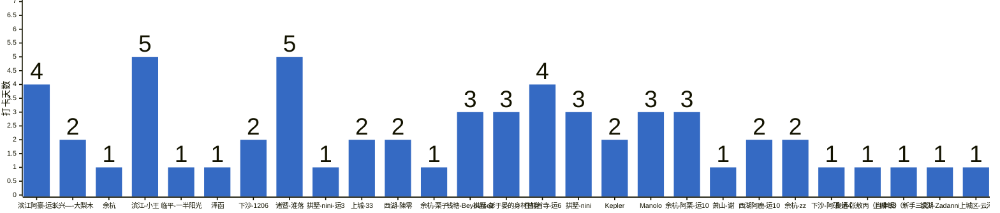

{
  "title": "杭州-健身-enjoy your life · 2026-09-14 至 2026-09-20",
  "date": "2026-09-14",
  "layout": "weekly",
  "group_id": "group-2",
  "record_dates": [
    "2026-09-15",
    "2026-09-16",
    "2026-09-17",
    "2026-09-18",
    "2026-09-19",
    "2026-09-20"
  ],
  "generated_by": "checkins-v1"
}

本期统计名单仅包含本周有有效打卡内容的参与者，打卡率以本期统计名单人数为分母。

## 1. 本周打卡概览 {#本周打卡概览}

<span id="打卡天数排行榜"></span>

**成员打卡天数**（按名单顺序展示，左右滑动查看全部成员，柱顶数字为本周打卡天数）



<span id="每日打卡率"></span>

**每日打卡率**

| 日期 | 已打卡 | 未打卡 | 打卡率 |
| --- | --- | --- | --- |
| 2026-09-15 | 11 | 16 | 40.7% |
| 2026-09-16 | 13 | 14 | 48.1% |
| 2026-09-17 | 9 | 18 | 33.3% |
| 2026-09-18 | 8 | 19 | 29.6% |
| 2026-09-19 | 5 | 22 | 18.5% |
| 2026-09-20 | 12 | 15 | 44.4% |

## 2. 打卡内容明细 {#打卡内容明细}

| 名单编号 | 昵称 | 2026-09-15 | 2026-09-16 | 2026-09-17 | 2026-09-18 | 2026-09-19 | 2026-09-20 |
| --- | --- | --- | --- | --- | --- | --- | --- |
| 1 | 滨江阿豪-运3 | 背✅ | 肩✅ | 先起接龙 |  |  | 背+爬坡50min |
| 2 | 长兴—-大梨木 | 旅行 |  |  | 肩背 |  |  |
| 3 | 余杭 | 🐟 肩背1h |  |  |  |  |  |
| 4 | 滨江-小王 | 背 | 腿 | 胸 | 手臂 | 肩 |  |
| 5 | 临平-一半阳光 | 🚴🏻‍♂️三十公里 |  |  |  |  |  |
| 6 | 泽函 | 背 1.5h |  |  |  |  |  |
| 7 | 下沙-1206 | 胸 | 爬楼30min |  |  |  |  |
| 8 | 诸暨-淮落 | 肩 | 肩背 |  | 背 | 肩 | 休息 |
| 9 | 拱墅-nini-运3 | 肩 |  |  |  |  |  |
| 10 | 上城-33 | 肩 | 肩 |  |  |  |  |
| 11 | 西湖-陳零 | 背 | 背 |  |  |  |  |
| 12 | 余杭-栗子 |  | 肩尖尖<br>刷脂  16号 |  |  |  |  |
| 13 | 钱塘-Beyourself |  | 胸+三头 | 背+二头 |  |  | 腿 |
| 14 | 拱墅-彭于晏的身材替身 |  | 有氧➕🐻 |  | 腿 |  | 有🐑+背 |
| 15 | 仓前首寺-运6 |  | 背 | 肩 |  | 胸 | 背 |
| 16 | 拱墅-nini |  | 腿 |  | 背 |  | 肩 |
| 17 | Kepler |  | 肩 |  |  |  | 🐻 |
| 18 | Manolo |  | 🦵 | xiuxi | 胸部+背部 |  |  |
| 19 | 余杭-阿栗-运10 |  |  | 腹 | 手臂 |  | 熊熊🐻 |
| 20 | 萧山-谢 |  |  | 运3 肩 |  |  |  |
| 21 | 西湖阿鹿-运10 |  |  | 背 |  | 肩 |  |
| 22 | 余杭-zz |  |  | 胸 |  |  | 肩+手臂 |
| 23 | 下沙-阿硕-运4 |  |  |  | 背 |  |  |
| 24 | 良渚-张敖丙（自律版） |  |  |  |  | 有氧1 |  |
| 25 | 上城-33（新手三天） |  |  |  |  |  | 空腹有氧 |
| 26 | 银湖-Zadanni |  |  |  |  |  | 臀腿 |
| 27 | 上城区-云泽 |  |  |  |  |  | 屁股 |

## 3. 原始打卡内容（2026-09-14 至 2026-09-20） {#原始打卡内容2026-09-14-至-2026-09-20}

```text
#接龙
2026-09-15

1. 滨江阿豪-运3
背✅
3. 长兴—-大梨木 旅行
4. 余杭 🐟 肩背1h
5. 滨江-小王 背
6. 临平-一半阳光 🚴🏻‍♂️三十公里
7. 泽函 背 1.5h
8. 下沙-1206 胸
9. 诸暨-淮落 肩
10. 拱墅-nini-运3 肩
11. 上城-33 肩
12. 西湖-陳零 背

#接龙
2026-09-16

1. 余杭-栗子 肩尖尖
2. 钱塘-Beyourself 胸+三头
3. 下沙-1206 爬楼30min
4. 拱墅-彭于晏的身材替身 有氧➕🐻
5. 滨江阿豪-运3 肩✅
6. 仓前首寺-运6 背
7. 拱墅-nini 腿
8. 西湖-陳零 背
9. 上城-33 肩
10. Kepler 肩
11. Manolo 🦵
12. 诸暨-淮落  肩背
13. 滨江-小王 腿
14. 余杭-栗子 刷脂  16号

#接龙
2026-09-17

平静 自由 坚定地主宰自己的命运

1. 滨江阿豪-运3 先起接龙
2. 钱塘-Beyourself 背+二头
3. 余杭-阿栗-运10 腹
7. 仓前首寺-运6 肩
8. 萧山-谢 运3 肩
9. 西湖阿鹿-运10 背
10. 余杭-zz 胸
11. 滨江-小王 胸
12. Manolo xiuxi

#接龙
2026-09-18
今天是九·一八事变纪念日，炮火虽不在，警钟仍长鸣，铭记历史，吾辈自强！

1. 余杭-阿栗-运10 手臂
2. 诸暨-淮落 背
3. 拱墅-nini 背
4. 拱墅-彭于晏的身材替身 腿
5. 长兴—-大梨木 肩背
7. 滨江-小王 手臂
8. 下沙-阿硕-运4 背
10. Manolo 胸部+背部

#接龙
2026-09-19

1. 良渚-张敖丙（自律版） 有氧1
2. 滨江-小王 肩
3. 诸暨-淮落  肩
4. 仓前首寺-运6 胸
5. 西湖阿鹿-运10 肩

#接龙
2026-09-20
脚下的每一步都是具体的、唯一的，走好脚下这一步，其实就是走好了人生这条路。
1. 余杭-阿栗-运10 熊熊🐻
2. 上城-33（新手三天） 空腹有氧
3. 拱墅-nini 肩
4. 滨江阿豪-运3 背+爬坡50min
5. 拱墅-彭于晏的身材替身 有🐑+背
6. 诸暨-淮落 休息
7. 仓前首寺-运6 背
8. Kepler 🐻
10. 余杭-zz  肩+手臂
11. 钱塘-Beyourself 腿
12. 银湖-Zadanni 臀腿
13. 上城区-云泽 屁股
```
