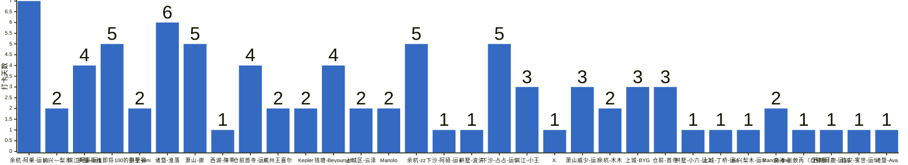

{
  "title": "杭州-健身-enjoy your life · 2026-09-21 至 2026-09-27",
  "date": "2026-09-21",
  "layout": "weekly",
  "group_id": "group-2",
  "record_dates": [
    "2026-09-21",
    "2026-09-22",
    "2026-09-23",
    "2026-09-24",
    "2026-09-25",
    "2026-09-26",
    "2026-09-27"
  ],
  "generated_by": "checkins-v1"
}

本期统计名单仅包含本周有有效打卡内容的参与者，打卡率以本期统计名单人数为分母。

## 1. 本周打卡概览 {#本周打卡概览}

<span id="打卡天数排行榜"></span>

**成员打卡天数**（按名单顺序展示，左右滑动查看全部成员，柱顶数字为本周打卡天数）



<span id="每日打卡率"></span>

**每日打卡率**

| 日期 | 已打卡 | 未打卡 | 打卡率 |
| --- | --- | --- | --- |
| 2026-09-21 | 17 | 15 | 53.1% |
| 2026-09-22 | 13 | 19 | 40.6% |
| 2026-09-23 | 13 | 19 | 40.6% |
| 2026-09-24 | 10 | 22 | 31.2% |
| 2026-09-25 | 11 | 21 | 34.4% |
| 2026-09-26 | 9 | 23 | 28.1% |
| 2026-09-27 | 11 | 21 | 34.4% |

## 2. 打卡内容明细 {#打卡内容明细}

| 名单编号 | 昵称 | 2026-09-21 | 2026-09-22 | 2026-09-23 | 2026-09-24 | 2026-09-25 | 2026-09-26 | 2026-09-27 |
| --- | --- | --- | --- | --- | --- | --- | --- | --- |
| 1 | 余杭-阿栗-运10 | 背背背 | 肩膀头子呀<br>徒步20km | 卷腹 | 有氧 | 有氧8km | 有氧 | 有氧<br>卷腹 |
| 2 | 长兴—梨木 | 肩 | 臀 |  |  |  |  |  |
| 3 | 滨江阿豪-运1 | 肩 | 腿✅ | 胸 | 背+爬坡50min✅ |  |  |  |
| 4 | 拱墅-卧推即将100的彭于晏 | 有🐏➕谭🐻 | 肩背 | 休息 |  |  | 腿 | 胸➕腿 |
| 5 | 拱墅-nini | 背 | 臀腿 |  |  |  |  |  |
| 6 | 诸暨-淮落 | 🐻 | 背 | 休息 | 胸 | 胸 |  | 背<br>背加练 |
| 7 | 萧山-谢 | 肩 |  | 腿 | 背 | 肩 |  | 胸 |
| 8 | 西湖-陳零 | 背 |  |  |  |  |  |  |
| 9 | 仓前首寺-运6 | 臀腿 | 休息 | 胸 | 背 |  |  |  |
| 10 | 杭州王嘉尔 | 休息 |  | 休息 |  |  |  |  |
| 11 | Kepler | 背 | 肩 |  |  |  |  |  |
| 12 | 钱塘-Beyourself | 肩 |  | 胸三头 | 背二头 |  | 有氧10公里 |  |
| 13 | 上城区-云泽 | 屁股 |  | 屁股 |  |  |  |  |
| 14 | Manolo | 胸部肩部 | 🪽 |  |  |  |  |  |
| 15 | 余杭-zz | 有氧 | 背 | 胸 |  | 有氧 | 有氧 |  |
| 16 | 下沙-阿硕-运4 | 肩腹 |  |  |  |  |  |  |
| 17 | 拱墅-波涛 | 腹 |  |  |  |  |  |  |
| 18 | 下沙-占占-运5 |  | 胸 二头 爬坡 | 爬楼42分钟 | 背 核心80分钟 爬楼20分钟 | 肩 背一小时 爬楼45分钟 | 腿一小时 爬楼25分钟 |  |
| 19 | 滨江-小王 |  | 背 |  | 肩 |  | 胸 |  |
| 20 | X. |  | 有氧 |  |  |  |  |  |
| 21 | 萧山威少-运7 |  |  | 今天骑行267km，玩完成198km | 腿，112km |  |  | 床上运动 |
| 22 | 余杭-木木 |  |  | 🐻 | 肩 |  |  |  |
| 23 | 上城-BYG |  |  |  |  | 腿60min爬楼40min | 背 | 腹 |
| 24 | 仓前-首寺 |  |  |  |  | 肩 | 休息 | 胸 |
| 25 | 拱墅-小六-运2 |  |  |  |  | 腹 |  |  |
| 26 | 上城-丁桥-运4 |  |  |  |  | 练腿30分钟 |  |  |
| 27 | 长兴梨木-运3 |  |  |  |  | 弹跳混合有氧40min |  |  |
| 28 | Manolo-tmg |  |  |  |  | chest back |  | 游泳 ,足球 |
| 29 | 良渚-张敖丙（自律版） |  |  |  |  |  | 有氧1小时 |  |
| 30 | 西湖阿鹿-运10 |  |  |  |  |  |  | 背 |
| 31 | 临安-雾世-运5 |  |  |  |  |  |  | 三头+肩 |
| 32 | 诸暨-Ava |  |  |  |  |  |  | 有氧➕腹 |

## 3. 原始打卡内容（2026-09-21 至 2026-09-27） {#原始打卡内容2026-09-21-至-2026-09-27}

```text
#接龙
2026-09-21
今天是国际和平日，愿世界温柔以待，也愿你被这世界温柔以待~
1. 余杭-阿栗-运10 背背背
2. 长兴—梨木 肩
3. 滨江阿豪-运1 肩
4. 拱墅-卧推即将100的彭于晏 有🐏➕谭🐻
5. 拱墅-nini 背
6. 诸暨-淮落 🐻
7. 萧山-谢 肩
8. 西湖-陳零 背
9. 仓前首寺-运6 臀腿
10. 杭州王嘉尔 休息
11. Kepler 背
12. 钱塘-Beyourself 肩
13. 上城区-云泽 屁股
14. Manolo 胸部肩部
15. 余杭-zz 有氧
16. 下沙-阿硕-运4 肩腹
17. 拱墅-波涛 腹

#接龙
2026-09-22
今天是2026年最后100天，愿你清零烦恼，整理当下，更新未来，遇见更好的自己！！
1. 余杭-阿栗-运10 肩膀头子呀
2. 长兴—梨木 臀
3. 拱墅-nini 臀腿
4. 拱墅-卧推即将100的彭于晏 肩背
5. 滨江阿豪-运1  腿✅
6. 下沙-占占-运5 胸 二头 爬坡
7. Manolo 🪽
8. 仓前首寺-运6 休息
9. 诸暨-淮落 背
10. 余杭-阿栗-运10 徒步20km
11. 滨江-小王 背
12. 余杭-zz 背
13. Kepler 肩
14. X. 有氧

#接龙
2026-09-23
人间好时节，一切都刚好。今日秋分，此时秋高气爽，适合出游，愿你与美好不期而遇！

1. 余杭-阿栗-运10 卷腹
2. 滨江阿豪-运1 胸
3. 下沙-占占-运5 爬楼42分钟
4. 仓前首寺-运6 胸
5. 萧山威少-运7 今天骑行267km，玩完成198km
6. 余杭-zz 胸
7. 杭州王嘉尔 休息
8. 余杭-木木 🐻
9. 上城区-云泽 屁股
10. 诸暨-淮落 休息
11. 拱墅-卧推即将100的彭于晏 休息
12. 萧山-谢 腿
13. 钱塘-Beyourself 胸三头

#接龙
2026-09-24
生活是自己的，你选择怎样的生活，就会成就怎样的你！
1. 余杭-阿栗-运10 有氧
2. 滨江阿豪-运1 背+爬坡50min✅
3. 下沙-占占-运5 背 核心80分钟 爬楼20分钟
4. 诸暨-淮落 胸
5. 钱塘-Beyourself 背二头
6. 滨江-小王 肩
7. 余杭-木木 肩
8. 仓前首寺-运6 背
9. 萧山-谢 背
10. 萧山威少-运7 腿，112km

#接龙
2026-09-25
但愿人长久，千里共婵娟。今日中秋，愿亲友岁岁平安，朝朝如愿～

1. 余杭-阿栗-运10 有氧8km
2. 萧山-谢 肩
3. 上城-BYG 腿60min爬楼40min
4. 仓前-首寺 肩
5. 下沙-占占-运5 肩 背一小时 爬楼45分钟
6. 诸暨-淮落  胸
7. 拱墅-小六-运2 腹
8. 上城-丁桥-运4  练腿30分钟
9. 余杭-zz 有氧
10. 长兴梨木-运3 弹跳混合有氧40min
11. Manolo-tmg chest back

#接龙
2026-09-26
所谓的一鸣惊人，都有十足的努力和付出来支撑。
1. 余杭-阿栗-运10 有氧
2. 上城-BYG 背
3. 钱塘-Beyourself 有氧10公里
4. 良渚-张敖丙（自律版） 有氧1小时
5. 下沙-占占-运5 腿一小时 爬楼25分钟
6. 仓前-首寺 休息
7. 余杭-zz 有氧
8. 滨江-小王 胸
9. 拱墅-卧推即将100的彭于晏 腿

#接龙
2026-09-27
今天是世界旅游日，忙有所得，闲有所乐，出发永远比向往更有意义。看世界，也找自己！
1. 余杭-阿栗-运10 有氧
2. 上城-BYG 腹
3. Manolo-tmg 游泳 ,足球
4. 诸暨-淮落   背
5. 萧山威少-运7 床上运动
6. 西湖阿鹿-运10 背
7. 余杭-阿栗-运10 卷腹
8. 临安-雾世-运5 三头+肩
9. 萧山-谢 胸
10. 诸暨-Ava 有氧➕腹
11. 仓前-首寺 胸
12. 拱墅-卧推即将100的彭于晏 胸➕腿
13. 诸暨-淮落 背加练
```
