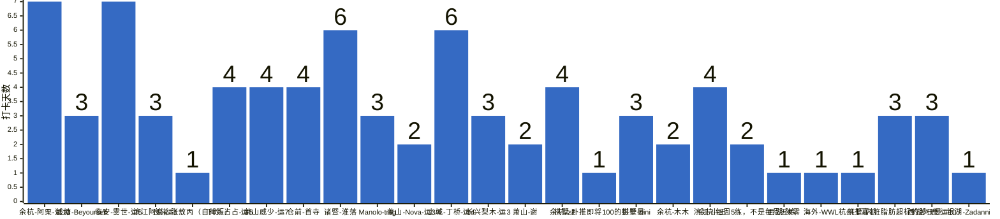

{
  "title": "杭州-健身-enjoy your life · 2026-09-28 至 2026-10-04",
  "date": "2026-09-28",
  "layout": "weekly",
  "group_id": "group-2",
  "record_dates": [
    "2026-09-28",
    "2026-09-29",
    "2026-09-30",
    "2026-10-01",
    "2026-10-02",
    "2026-10-03",
    "2026-10-04"
  ],
  "generated_by": "checkins-v1",
  "iso_year": 2026,
  "iso_week": 40,
  "date_summary": [
    "📅 周打卡：2026-09-28 至 2026-10-04（第40周）",
    "🏆 季度：2026年第4季度｜已过4天，剩余88天",
    "⏳ 年度：2026年｜已过277天（75.89%），剩余88天（24.11%）"
  ]
}

本期统计名单仅包含本周有有效打卡内容的参与者，打卡率以本期统计名单人数为分母。

## 1. 本周打卡概览 {#本周打卡概览}

<span id="打卡天数排行榜"></span>

**成员打卡天数**（按名单顺序展示，左右滑动查看全部成员，柱顶数字为本周打卡天数）



<span id="每日打卡率"></span>

**每日打卡率**

| 日期 | 已打卡 | 未打卡 | 打卡率 |
| --- | --- | --- | --- |
| 2026-09-28 | 12 | 14 | 46.2% |
| 2026-09-29 | 17 | 9 | 65.4% |
| 2026-09-30 | 18 | 8 | 69.2% |
| 2026-10-01 | 11 | 15 | 42.3% |
| 2026-10-02 | 5 | 21 | 19.2% |
| 2026-10-03 | 10 | 16 | 38.5% |
| 2026-10-04 | 8 | 18 | 30.8% |

## 2. 打卡内容明细 {#打卡内容明细}

| 名单编号 | 昵称 | 2026-09-28 | 2026-09-29 | 2026-09-30 | 2026-10-01 | 2026-10-02 | 2026-10-03 | 2026-10-04 |
| --- | --- | --- | --- | --- | --- | --- | --- | --- |
| 1 | 余杭-阿栗-运10 | 刷脂 | 有氧6km<br>卷腹 | 有氧6km<br>熊🐻熊熊 | 背 | 慢跑7km | 有氧3km | 休闲5km |
| 2 | 钱塘-Beyourself | 肩 | 胸三头 | 背二头 |  |  |  |  |
| 3 | 临安-雾世-运5 | 三分化之拉日 | 放纵日-牛肉自助火锅 | 胸  肩  三头<br>咬肌训练！ | 最痛苦的腿&#91;苦涩&#93; | 手臂 | 在家虐腹 | 背 二头 |
| 4 | 滨江阿豪-运1 | 肩✅ | 划水练腿🦵🏻 | 胸40min |  |  |  |  |
| 5 | 良渚-张敖丙（自律版） | 有氧45分钟 |  |  |  |  |  |  |
| 6 | 下沙-占占-运5 | 胸 核心一小时  爬楼30分钟 | 背一小时 爬楼30分钟 | 肩核心80分钟 爬楼机20分钟 | 腿一小时 |  |  |  |
| 7 | 萧山威少-运7 | 游泳1h | 唱歌，练肺 | 练群主 |  |  |  | 🐷＋🐔＋🐻 |
| 8 | 仓前-首寺 | 背 | 休息 | 胸 | 背 |  |  |  |
| 9 | 诸暨-淮落 | 胸 | 休息 | 肩 | 背 |  | 胸 | 背 |
| 10 | Manolo-tmg | 胸 | 背部肌肉 | 🦵 |  |  |  |  |
| 11 | 萧山-Nova-运3/4 | 背 |  | 肩+三头+腹 |  |  |  |  |
| 12 | 上城-丁桥-运4 | 胸部 ＆手臂 | 手臂15分钟 | 背+肩 | 爬山 450千卡 |  | 爬山 10000步 | 胸 |
| 13 | 长兴梨木-运3 |  | 臀 | 核心➕有氧 |  |  |  | 肩背 |
| 14 | 萧山-谢 |  | 背 |  |  |  |  | 腿 |
| 15 | 余杭-zz |  | 背 |  | 胸 | 肩+有氧 | 有氧 |  |
| 16 | 拱墅-卧推即将100的彭于晏 |  | 背 |  |  |  |  |  |
| 17 | 拱墅-nini |  | 背 | 胸 | 肩膀 |  |  |  |
| 18 | 余杭-木木 |  | 🐻 | 背 |  |  |  |  |
| 19 | 滨江-小王 |  | 背 | 肩 |  | 胸 | 手臂，腿 |  |
| 20 | 余杭-每周5练，不是每周五练 |  |  | 腿 |  |  | 三大项 |  |
| 21 | 西湖-陳零 |  |  | 腿 |  |  |  |  |
| 22 | 海外-WWL |  |  | 健身 |  |  |  |  |
| 23 | 杭州王嘉尔 |  |  |  | 休息 |  |  |  |
| 24 | 拱墅-内脏脂肪超标的彭于晏 |  |  |  | 有氧一小时 |  | 有氧40 | 🐏➕🐻 |
| 25 | 西湖阿鹿-运10 |  |  |  | 肩🗡️ | 慢跑3km<br>腿🦵 | 胸 |  |
| 26 | 银湖-Zadanni |  |  |  |  |  | 全身 |  |

## 3. 原始打卡内容（2026-09-28 至 2026-10-04） {#原始打卡内容2026-09-28-至-2026-10-04}

```text
#接龙
2026-09-28
三人行，必有我师。今日孔子诞辰，愿你我常怀谦逊，见贤思齐，日日自新~

1. 余杭-阿栗-运10 刷脂
2. 钱塘-Beyourself 肩
3. 临安-雾世-运5 三分化之拉日
4. 长兴梨木-肩背
5. 滨江阿豪-运1  肩✅
6. 良渚-张敖丙（自律版） 有氧45分钟
7. 下沙-占占-运5 胸 核心一小时  爬楼30分钟
8. 萧山威少-运7 游泳1h
9. 仓前-首寺 背
10. 诸暨-淮落  胸
11. Manolo-tmg 胸
12. 萧山-Nova-运3/4 背
13. 上城-丁桥-运4  胸部 ＆手臂

#接龙
2026-09-29
希望自己是一棵树，守静、安然、向阳、扎根，每一天都在默默成长。

1. 余杭-阿栗-运10 有氧6km
2. 长兴梨木-运3 臀
3. 临安-雾世-运5 放纵日-牛肉自助火锅
4. 钱塘-Beyourself 胸三头
5. 滨江阿豪-运1 划水练腿🦵🏻
6. 下沙-占占-运5 背一小时 爬楼30分钟
7. 萧山-谢 背
8. 仓前-首寺 休息
9. 余杭-zz 背
10. 上城-丁桥-运4 手臂15分钟
11. 余杭-阿栗-运10 卷腹
12. 萧山威少-运7 唱歌，练肺
13. 诸暨-淮落 休息
14. 拱墅-卧推即将100的彭于晏 背
15. 拱墅-nini 背
16. 余杭-木木 🐻
17. Manolo-tmg 背部肌肉
18. 滨江-小王 背


#接龙
2026-09-30
九月再见，愿过往所有的遗憾，都能在秋天补全，所有的幸运，都能不期而遇！

1. 余杭-阿栗-运10 有氧6km
2. 长兴梨木-运3 核心➕有氧
3. 余杭-每周5练，不是每周五练 腿
4. 临安-雾世-运5 胸  肩  三头
5. 滨江阿豪-运1 胸40min
6. 下沙-占占-运5 肩核心80分钟 爬楼机20分钟
7. 余杭-阿栗-运10 熊🐻熊熊
8. 钱塘-Beyourself 背二头
9. 滨江-小王 肩
10. 萧山威少-运7 练群主
11. 诸暨-淮落 肩
12. 仓前-首寺 胸
13. 上城-丁桥-运4  背+肩
14. Manolo-tmg 🦵
15. 拱墅-nini 胸
16. 西湖-陳零 腿
17. 余杭-木木 背
18. 临安-雾世-运5 咬肌训练！
19. 海外-WWL 健身
20. 萧山-Nova-运3/4 肩+三头+腹

#接龙
2026-10-01
今天是国庆节，忆峥嵘岁月，看今朝辉煌。逢祖国华诞，祝繁荣昌盛！

1. 余杭-阿栗-运10 背
2. 临安-雾世-运5 最痛苦的腿[苦涩]
3. 杭州王嘉尔 休息
4. 拱墅-内脏脂肪超标的彭于晏 有氧一小时
5. 拱墅-nini 肩膀
6. 下沙-占占-运5 腿一小时
7. 余杭-zz 胸
8. 西湖阿鹿-运10 肩🗡️
9. 诸暨-淮落 背
10. 仓前-首寺 背
11. 上城-丁桥-运4  爬山 450千卡

#接龙
2026-10-02
你一生只需要专注2件事：做自己喜欢的事，成为自己喜欢的人。

1. 余杭-阿栗-运10 慢跑7km
2. 西湖阿鹿-运10 慢跑3km
3. 余杭-zz 肩+有氧
4. 临安-雾世-运5 手臂
5. 西湖阿鹿-运10 腿🦵
6. 滨江-小王 胸

#接龙
2026-10-03
不沉迷于幻想，不茫然于未来，走今天的路，过当下的生活。
1. 余杭-阿栗-运10 有氧3km
2. 临安-雾世-运5 在家虐腹
3. 余杭-zz 有氧
4. 拱墅-内脏脂肪超标的彭于晏 有氧40
5. 上城-丁桥-运4  爬山 10000步
6. 余杭-每周5练，不是每周五练 三大项
7. 诸暨-淮落 胸
8. 诸暨-背
9. 西湖阿鹿-运10 胸
10. 滨江-小王 手臂，腿
11. 银湖-Zadanni 全身

#接龙
2026-10-04
如果这世界上真有奇迹，那只是努力的另一个名字。
1. 余杭-阿栗-运10 休闲5km
2. 长兴梨木-运3 肩背
3. 临安-雾世-运5 背 二头
4. 诸暨-淮落 背
5. 上城-丁桥-运4  胸
6. 拱墅-内脏脂肪超标的彭于晏 🐏➕🐻
7. 萧山威少-运7 🐷＋🐔＋🐻
8. 萧山-谢 腿
```
