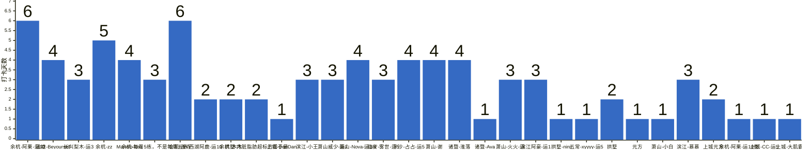

{
  "title": "杭州-健身-enjoy your life · 2026-10-05 至 2026-10-11",
  "date": "2026-10-05",
  "layout": "weekly",
  "group_id": "group-2",
  "record_dates": [
    "2026-10-05",
    "2026-10-06",
    "2026-10-07",
    "2026-10-08",
    "2026-10-09",
    "2026-10-10"
  ],
  "generated_by": "checkins-v1",
  "iso_year": 2026,
  "iso_week": 41,
  "date_summary": [
    "📅 周打卡：2026-10-05 至 2026-10-11（第41周）",
    "🏆 季度：2026年第4季度｜已过11天，剩余81天",
    "⏳ 年度：2026年｜已过284天（77.81%），剩余81天（22.19%）"
  ]
}

本期统计名单仅包含本周有有效打卡内容的参与者，打卡率以本期统计名单人数为分母。

## 1. 本周打卡概览 {#本周打卡概览}

<span id="打卡天数排行榜"></span>

**成员打卡天数**（按名单顺序展示，左右滑动查看全部成员，柱顶数字为本周打卡天数）



<span id="每日打卡率"></span>

**每日打卡率**

| 日期 | 已打卡 | 未打卡 | 打卡率 |
| --- | --- | --- | --- |
| 2026-10-05 | 14 | 17 | 45.2% |
| 2026-10-06 | 8 | 23 | 25.8% |
| 2026-10-07 | 10 | 21 | 32.3% |
| 2026-10-08 | 21 | 10 | 67.7% |
| 2026-10-09 | 17 | 14 | 54.8% |
| 2026-10-10 | 14 | 17 | 45.2% |

## 2. 打卡内容明细 {#打卡内容明细}

| 名单编号 | 昵称 | 2026-10-05 | 2026-10-06 | 2026-10-07 | 2026-10-08 | 2026-10-09 | 2026-10-10 |
| --- | --- | --- | --- | --- | --- | --- | --- |
| 1 | 余杭-阿栗-运10 | 有氧 | 有氧 | 休闲8km | 休闲5km | 有氧 | 有氧 |
| 2 | 钱塘-Beyourself | 有氧 |  | 腿 |  | 胸 | 背 |
| 3 | 长兴梨木-运3 | 臀 |  | 爬山1小时 |  |  | 肩背 |
| 4 | 余杭-zz | 背+有氧 | 有氧 | 肩+有氧 | 手臂+有氧 | 背 |  |
| 5 | Manolo-tmg | 20km hike + chest and shoulders |  | legg |  | chest,back | shoulder arms |
| 6 | 余杭-每周5练，不是每周五练 | 背 |  |  | 单车30min |  | 爬坡 |
| 7 | 仓前-首寺 | 胸 | 背 | 臀腿 | 休息 | 胸 | 背 |
| 8 | 西湖阿鹿-运10 | 背 | 肩 |  |  |  |  |
| 9 | 余杭-木木 | 胸+背 |  |  | 肩膀 |  |  |
| 10 | 拱墅-内脏脂肪超标的彭于晏 | 肩 |  |  | 颈椎+肩胛骨 |  |  |
| 11 | 上城-DanDan | 腿 |  |  |  |  |  |
| 12 | 滨江-小王 | 背 |  |  | 肩 | 背 |  |
| 13 | 萧山威少-运7 | 给腰板松解 |  |  | 暴走2.76km | 恋群猪 |  |
| 14 | 萧山-Nova-运3/4 | 肩+三头+有氧 | 背+二头 |  | 臀腿 | 背+小臂 |  |
| 15 | 临安-雾世-运5 |  | 臂力棒4x15x6 |  | 腿 | 胸 肩 二头 |  |
| 16 | 下沙-占占-运5 |  | 胸 核心一小时 爬楼30分钟 | 背 核心一小时 爬楼机35分钟 | 肩 卷腹一小时 没有氧 晚上去学游泳 |  | 腿一小时  爬楼25分钟 |
| 17 | 萧山-谢 |  | 胸 | 背 | 背 |  | 胸 |
| 18 | 诸暨-淮落 |  |  | 胸 | 背 | 肩 | 背 |
| 19 | 诸暨-Ava |  |  | 胸 |  |  |  |
| 20 | 萧山-火火-运 |  |  |  | 4 奥体乐刻胸背腹+有氧 30min | 4 胸+有氧 | 4 胸➕有氧 |
| 21 | 滨江阿豪-运1 |  |  |  | 胸40min | 背 | 肩<br>坐姿推肩四组<br>器械水平飞鸟四组<br>坐姿后侧飞鸟四组， |
| 22 | 拱墅-nini |  |  |  | 臀腿 |  |  |
| 23 | 五常-xyyyy-运5 |  |  |  | 背＋二头 |  |  |
| 24 | 拱墅 |  |  |  | 一度 核心 |  | 一度 核心 |
| 25 | 元方 |  |  |  | 背 |  |  |
| 26 | 萧山-小白 |  |  |  | 胸 |  |  |
| 27 | 滨江-慕慕 |  |  |  | 有氧 | 屁 | 肩 |
| 28 | 上城元方 |  |  |  |  | 肩 | 胸 |
| 29 | 余杭-阿栗-运10卷 |  |  |  |  | 腹 |  |
| 30 | 上城-CC-运5 |  |  |  |  | 有氧篮球 |  |
| 31 | 上城-大肌霸 |  |  |  |  | 腿 |  |

## 3. 原始打卡内容（2026-10-05 至 2026-10-11） {#原始打卡内容2026-10-05-至-2026-10-11}

```text
#接龙
2026-10-05
喜欢的事，一定要即刻开始，有益的事，一定要长期坚持。
1. 余杭-阿栗-运10 有氧
2. 钱塘-Beyourself 有氧
3. 长兴梨木-运3 臀
4. 余杭-zz 背+有氧
5. Manolo-tmg 20km hike + chest and shoulders
6. 余杭-每周5练，不是每周五练 背
7. 仓前-首寺 胸
8. 西湖阿鹿-运10 背
9. 余杭-木木 胸+背
10. 拱墅-内脏脂肪超标的彭于晏 肩
11. 上城-DanDan 腿
12. 滨江-小王 背
13. 萧山威少-运7 给腰板松解
14. 萧山-Nova-运3/4 肩+三头+有氧

#接龙
2026-10-06
只有超越自我，才可以俯瞰世界。
1. 余杭-阿栗-运10 有氧
2. 临安-雾世-运5 臂力棒4x15x6
3. 下沙-占占-运5 胸 核心一小时 爬楼30分钟
4. 仓前-首寺 背
5. 萧山-谢 胸
6. 西湖阿鹿-运10 肩
7. 萧山-Nova-运3/4 背+二头
8. 余杭-zz 有氧

#接龙
2026-10-07
越是穷途末路，越要势如破竹。
1. 余杭-阿栗-运10 休闲8km
2. 长兴梨木-运3 爬山1小时
3. 余杭-zz 肩+有氧
4. 下沙-占占-运5 背 核心一小时 爬楼机35分钟
5. 钱塘-Beyourself 腿
6. Manolo-tmg legg
7. 诸暨-淮落 胸
8. 萧山-谢 背
9. 诸暨-Ava 胸
10. 仓前-首寺 臀腿

#接龙
2026-10-08
寒风起，露水凝。今日寒露，自此气温迅速下降，切记添衣护体，安度深秋！
1. 余杭-阿栗-运10 休闲5km
2. 萧山-火火-运 4 奥体乐刻胸背腹+有氧 30min
3. 滨江阿豪-运1 胸40min
4. 拱墅-nini 臀腿
5. 临安-雾世-运5 腿
6. 余杭-zz 手臂+有氧
7. 五常-xyyyy-运5 背＋二头
8. 拱墅-内脏脂肪超标的彭于晏 颈椎+肩胛骨
9. 下沙-占占-运5 肩 卷腹一小时 没有氧 晚上去学游泳
10. 诸暨-淮落 背
11. 拱墅 一度 核心
12. 滨江-小王 肩
13. 元方  背
14. 萧山-谢 背
15. 萧山-小白 胸
16. 滨江-慕慕 有氧
17. 萧山威少-运7 暴走2.76km
18. 萧山-Nova-运3/4 臀腿
19. 余杭-木木 肩膀
20. 仓前-首寺 休息
21. 余杭-每周5练，不是每周五练 单车30min

#接龙
2026-10-09
人的眼睛之所以长在前面，是为了要向前看，心有所期，就要全力以赴，来日定有所成。

1. 余杭-阿栗-运10 有氧
2. 钱塘-Beyourself 胸
3. 滨江阿豪-运1 背
4. 萧山-火火-运 4 胸+有氧
5. 上城元方 肩
6. 临安-雾世-运5 胸 肩 二头
7. 萧山-Nova-运3/4 背+小臂
8. 仓前-首寺 胸
9. 滨江-慕慕  屁
10. 滨江-小王 背
11. 诸暨-淮落 肩
12. 余杭-阿栗-运10卷 腹
13. 上城-CC-运5  有氧篮球
14. Manolo-tmg chest,back
15. 萧山威少-运7 恋群猪
16. 上城-大肌霸 腿
17. 余杭-zz 背

#接龙
2026-10-10
10月10日，双十相逢，十全十美。愿日子温柔，万事圆满~

1. 余杭-阿栗-运10 有氧
2. 萧山-火火-运 4 胸➕有氧
3. 上城元方 胸
4. 滨江阿豪-运1 
肩
坐姿推肩四组
器械水平飞鸟四组
坐姿后侧飞鸟四组，
5. 钱塘-Beyourself 背
6. 拱墅 一度 核心
7. 下沙-占占-运5    腿一小时  爬楼25分钟
8. 长兴梨木-运3 肩背
9. 仓前-首寺 背
10. 诸暨-淮落 背
11. Manolo-tmg shoulder arms
12. 滨江-慕慕 肩
13. 余杭-每周5练，不是每周五练 爬坡
14. 萧山-谢 胸
```
