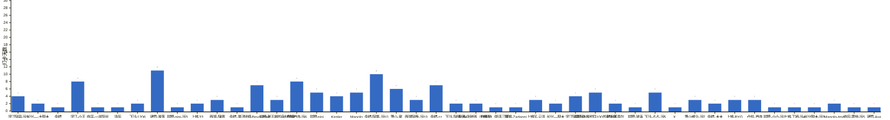

{
  "title": "2026 年月度打卡汇总",
  "date": "2026-01-01",
  "layout": "history-summary",
  "group_id": "group-2",
  "generated_by": "checkins-summary-v1",
  "summary_year": 2026,
  "months": {
    "2026-09": {
      "names": [
        "滨江阿豪-运3",
        "长兴—-大梨木",
        "余杭",
        "滨江-小王",
        "临平-一半阳光",
        "泽函",
        "下沙-1206",
        "诸暨-淮落",
        "拱墅-nini-运3",
        "上城-33",
        "西湖-陳零",
        "余杭-栗子",
        "钱塘-Beyourself",
        "拱墅-彭于晏的身材替身",
        "仓前首寺-运6",
        "拱墅-nini",
        "Kepler",
        "Manolo",
        "余杭-阿栗-运10",
        "萧山-谢",
        "西湖阿鹿-运10",
        "余杭-zz",
        "下沙-阿硕-运4",
        "良渚-张敖丙（自律版）",
        "上城-33（新手三天）",
        "银湖-Zadanni",
        "上城区-云泽",
        "长兴—梨木",
        "滨江阿豪-运1",
        "拱墅-卧推即将100的彭于晏",
        "杭州王嘉尔",
        "拱墅-波涛",
        "下沙-占占-运5",
        "X.",
        "萧山威少-运7",
        "余杭-木木",
        "上城-BYG",
        "仓前-首寺",
        "拱墅-小六-运2",
        "上城-丁桥-运4",
        "长兴梨木-运3",
        "Manolo-tmg",
        "临安-雾世-运5",
        "诸暨-Ava"
      ],
      "counts": {
        "Kepler": 4,
        "Manolo": 5,
        "Manolo-tmg": 2,
        "X.": 1,
        "上城-33": 2,
        "上城-33（新手三天）": 1,
        "上城-BYG": 3,
        "上城-丁桥-运4": 1,
        "上城区-云泽": 3,
        "下沙-1206": 2,
        "下沙-占占-运5": 5,
        "下沙-阿硕-运4": 2,
        "临安-雾世-运5": 1,
        "临平-一半阳光": 1,
        "仓前-首寺": 3,
        "仓前首寺-运6": 8,
        "余杭": 1,
        "余杭-zz": 7,
        "余杭-木木": 2,
        "余杭-栗子": 1,
        "余杭-阿栗-运10": 10,
        "拱墅-nini": 5,
        "拱墅-nini-运3": 1,
        "拱墅-卧推即将100的彭于晏": 5,
        "拱墅-小六-运2": 1,
        "拱墅-彭于晏的身材替身": 3,
        "拱墅-波涛": 1,
        "杭州王嘉尔": 2,
        "泽函": 1,
        "滨江-小王": 8,
        "滨江阿豪-运1": 4,
        "滨江阿豪-运3": 4,
        "良渚-张敖丙（自律版）": 2,
        "萧山-谢": 6,
        "萧山威少-运7": 3,
        "西湖-陳零": 3,
        "西湖阿鹿-运10": 3,
        "诸暨-Ava": 1,
        "诸暨-淮落": 11,
        "钱塘-Beyourself": 7,
        "银湖-Zadanni": 1,
        "长兴—-大梨木": 2,
        "长兴—梨木": 2,
        "长兴梨木-运3": 1
      },
      "dates": [
        "2026-09-15",
        "2026-09-16",
        "2026-09-17",
        "2026-09-18",
        "2026-09-19",
        "2026-09-20",
        "2026-09-21",
        "2026-09-22",
        "2026-09-23",
        "2026-09-24",
        "2026-09-25",
        "2026-09-26",
        "2026-09-27"
      ],
      "source_sha256": "ce6bdba05f9de3282837194f258dabcc3d13dc3fea90f0247d8993ff70e66360"
    }
  }
}

根据博客已收录的周报统计；未收录日期不代表未打卡。每人每天最多计一次，按名单顺序展示。

## 1. 2026 年 9 月

已收录 13 天：2026-09-15 至 2026-09-27。

**成员打卡天数**（按名单顺序展示，左右滑动查看全部成员，柱顶数字为本月打卡天数）

