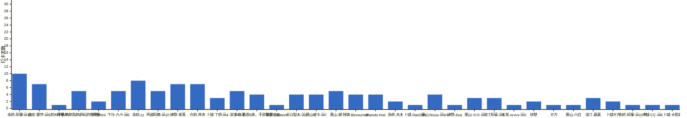
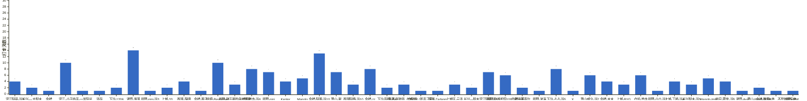

{
  "title": "2026 年月度打卡汇总",
  "date": "2026-01-01",
  "layout": "history-summary",
  "group_id": "group-2",
  "generated_by": "checkins-summary-v1",
  "summary_year": 2026,
  "months": {
    "2026-09": {
      "names": [
        "滨江阿豪-运3",
        "长兴—-大梨木",
        "余杭",
        "滨江-小王",
        "临平-一半阳光",
        "泽函",
        "下沙-1206",
        "诸暨-淮落",
        "拱墅-nini-运3",
        "上城-33",
        "西湖-陳零",
        "余杭-栗子",
        "钱塘-Beyourself",
        "拱墅-彭于晏的身材替身",
        "仓前首寺-运6",
        "拱墅-nini",
        "Kepler",
        "Manolo",
        "余杭-阿栗-运10",
        "萧山-谢",
        "西湖阿鹿-运10",
        "余杭-zz",
        "下沙-阿硕-运4",
        "良渚-张敖丙（自律版）",
        "上城-33（新手三天）",
        "银湖-Zadanni",
        "上城区-云泽",
        "长兴—梨木",
        "滨江阿豪-运1",
        "拱墅-卧推即将100的彭于晏",
        "杭州王嘉尔",
        "拱墅-波涛",
        "下沙-占占-运5",
        "X.",
        "萧山威少-运7",
        "余杭-木木",
        "上城-BYG",
        "仓前-首寺",
        "拱墅-小六-运2",
        "上城-丁桥-运4",
        "长兴梨木-运3",
        "Manolo-tmg",
        "临安-雾世-运5",
        "诸暨-Ava",
        "萧山-Nova-运3/4",
        "余杭-每周5练，不是每周五练",
        "海外-WWL"
      ],
      "counts": {
        "Kepler": 4,
        "Manolo": 5,
        "Manolo-tmg": 5,
        "X.": 1,
        "上城-33": 2,
        "上城-33（新手三天）": 1,
        "上城-BYG": 3,
        "上城-丁桥-运4": 4,
        "上城区-云泽": 3,
        "下沙-1206": 2,
        "下沙-占占-运5": 8,
        "下沙-阿硕-运4": 2,
        "临安-雾世-运5": 4,
        "临平-一半阳光": 1,
        "仓前-首寺": 6,
        "仓前首寺-运6": 8,
        "余杭": 1,
        "余杭-zz": 8,
        "余杭-木木": 4,
        "余杭-栗子": 1,
        "余杭-每周5练，不是每周五练": 1,
        "余杭-阿栗-运10": 13,
        "拱墅-nini": 7,
        "拱墅-nini-运3": 1,
        "拱墅-卧推即将100的彭于晏": 6,
        "拱墅-小六-运2": 1,
        "拱墅-彭于晏的身材替身": 3,
        "拱墅-波涛": 1,
        "杭州王嘉尔": 2,
        "泽函": 1,
        "海外-WWL": 1,
        "滨江-小王": 10,
        "滨江阿豪-运1": 7,
        "滨江阿豪-运3": 4,
        "良渚-张敖丙（自律版）": 3,
        "萧山-Nova-运3/4": 2,
        "萧山-谢": 7,
        "萧山威少-运7": 6,
        "西湖-陳零": 4,
        "西湖阿鹿-运10": 3,
        "诸暨-Ava": 1,
        "诸暨-淮落": 14,
        "钱塘-Beyourself": 10,
        "银湖-Zadanni": 1,
        "长兴—-大梨木": 2,
        "长兴—梨木": 2,
        "长兴梨木-运3": 3
      },
      "dates": [
        "2026-09-15",
        "2026-09-16",
        "2026-09-17",
        "2026-09-18",
        "2026-09-19",
        "2026-09-20",
        "2026-09-21",
        "2026-09-22",
        "2026-09-23",
        "2026-09-24",
        "2026-09-25",
        "2026-09-26",
        "2026-09-27",
        "2026-09-28",
        "2026-09-29",
        "2026-09-30"
      ],
      "source_sha256": "d2cb4134a46a30073b82dc43da88df41aa2dbd5c6888237ba5c4958d2073e967"
    },
    "2026-10": {
      "names": [
        "余杭-阿栗-运10",
        "临安-雾世-运5",
        "杭州王嘉尔",
        "拱墅-内脏脂肪超标的彭于晏",
        "拱墅-nini",
        "下沙-占占-运5",
        "余杭-zz",
        "西湖阿鹿-运10",
        "诸暨-淮落",
        "仓前-首寺",
        "上城-丁桥-运4",
        "滨江-小王",
        "余杭-每周5练，不是每周五练",
        "银湖-Zadanni",
        "长兴梨木-运3",
        "萧山威少-运7",
        "萧山-谢",
        "钱塘-Beyourself",
        "Manolo-tmg",
        "余杭-木木",
        "上城-DanDan",
        "萧山-Nova-运3/4",
        "诸暨-Ava",
        "萧山-火火-运",
        "滨江阿豪-运1",
        "五常-xyyyy-运5",
        "拱墅",
        "元方",
        "萧山-小白",
        "滨江-慕慕",
        "上城元方",
        "余杭-阿栗-运10卷",
        "上城-CC-运5",
        "上城-大肌霸"
      ],
      "counts": {
        "Manolo-tmg": 4,
        "上城-CC-运5": 1,
        "上城-DanDan": 1,
        "上城-丁桥-运4": 3,
        "上城-大肌霸": 1,
        "上城元方": 2,
        "下沙-占占-运5": 5,
        "临安-雾世-运5": 7,
        "五常-xyyyy-运5": 1,
        "仓前-首寺": 7,
        "余杭-zz": 8,
        "余杭-木木": 2,
        "余杭-每周5练，不是每周五练": 4,
        "余杭-阿栗-运10": 10,
        "余杭-阿栗-运10卷": 1,
        "元方": 1,
        "拱墅": 2,
        "拱墅-nini": 2,
        "拱墅-内脏脂肪超标的彭于晏": 5,
        "杭州王嘉尔": 1,
        "滨江-小王": 5,
        "滨江-慕慕": 3,
        "滨江阿豪-运1": 3,
        "萧山-Nova-运3/4": 4,
        "萧山-小白": 1,
        "萧山-火火-运": 3,
        "萧山-谢": 5,
        "萧山威少-运7": 4,
        "西湖阿鹿-运10": 5,
        "诸暨-Ava": 1,
        "诸暨-淮落": 7,
        "钱塘-Beyourself": 4,
        "银湖-Zadanni": 1,
        "长兴梨木-运3": 4
      },
      "dates": [
        "2026-10-01",
        "2026-10-02",
        "2026-10-03",
        "2026-10-04",
        "2026-10-05",
        "2026-10-06",
        "2026-10-07",
        "2026-10-08",
        "2026-10-09",
        "2026-10-10"
      ],
      "source_sha256": "a195d9b96d17df23c6cb3a41a6a871eef8f50a0e510cd6df5fee257f1fbf1294"
    }
  }
}

根据博客已收录的周打卡统计；未收录日期不代表未打卡。每人每天最多计一次，按名单顺序展示。

## 1. 2026 年 10 月

已收录 10 天：2026-10-01 至 2026-10-10。

**成员打卡天数**（按名单顺序展示，左右滑动查看全部成员，柱顶数字为本月打卡天数）

## 2. 2026 年 9 月

已收录 16 天：2026-09-15 至 2026-09-30。

**成员打卡天数**（按名单顺序展示，左右滑动查看全部成员，柱顶数字为本月打卡天数）

